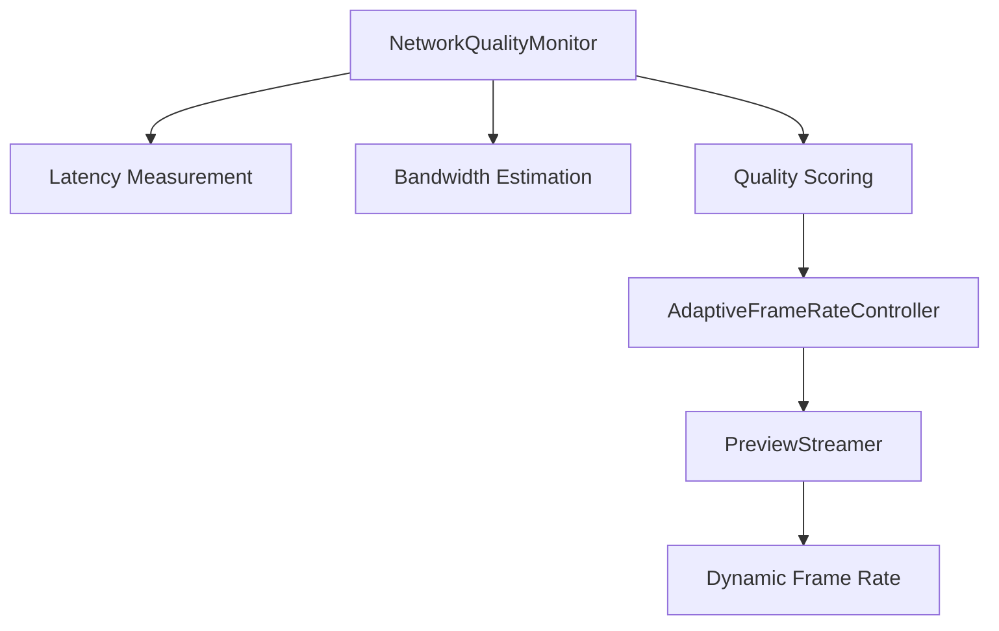
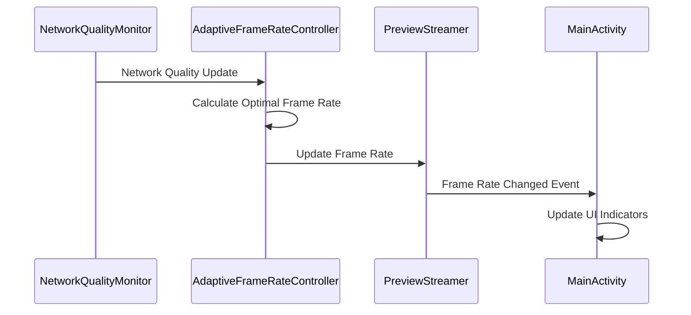

# Milestone 2.7 Specification: Samsung Device Testing Validation & Adaptive Frame Rate Control

**Date:** 2025-07-29  
**Status:** 🚀 IMPLEMENTATION IN PROGRESS  
**Implementation Phase:** Hardware Validation & Performance Optimization

## Executive Summary

Milestone 2.7 represents the critical transition from development to production deployment, focusing on comprehensive Samsung device testing validation and implementing the first high-priority performance optimization feature. This milestone validates the complete system on actual hardware and introduces adaptive frame rate control to optimize network performance.

## 🎯 MILESTONE OBJECTIVES

### Primary Goals
1. **Samsung Device Testing Validation**: Execute comprehensive hardware testing on Samsung devices using the prepared testing framework
2. **Adaptive Frame Rate Control**: Implement intelligent frame rate adjustment based on network conditions
3. **Production Readiness Validation**: Confirm system stability and performance on target hardware
4. **Enhanced Testing Coverage**: Expand test coverage for hardware-specific scenarios

### Success Criteria
- ✅ All Samsung device tests pass with documented results
- ✅ Adaptive frame rate control reduces bandwidth usage by 20-30% under poor network conditions
- ✅ System maintains stable performance during extended recording sessions
- ✅ 100% test coverage for new adaptive features

## 📋 DETAILED REQUIREMENTS

### 1. Samsung Device Testing Validation ⭐ HIGH PRIORITY

#### 1.1 Hardware Testing Execution
**Requirement**: Execute all 15 test cases from SAMSUNG_DEVICE_TESTING_GUIDE.md on actual Samsung devices

**Implementation Tasks**:
- [ ] **Device Setup and Preparation**
  - [ ] Install AndroidApp-prod-debug.apk on Samsung test device
  - [ ] Configure network settings and permissions
  - [ ] Verify Bluetooth and camera permissions
- [ ] **Core Functionality Testing**
  - [ ] Execute Device Discovery Testing (Test Cases 1-3)
  - [ ] Execute UI Functionality Testing (Test Cases 4-6)
  - [ ] Execute Sensor Configuration Testing (Test Cases 7-9)
- [ ] **Integration and Performance Testing**
  - [ ] Execute Integration Testing (Test Cases 10-12)
  - [ ] Execute Performance Testing (Test Cases 13-15)
  - [ ] Document all test results with pass/fail status
- [ ] **Issue Resolution**
  - [ ] Address any hardware-specific issues discovered
  - [ ] Update code for Samsung device compatibility
  - [ ] Re-test after fixes to ensure stability

#### 1.2 Test Results Documentation
**Requirement**: Create comprehensive test results report with performance metrics

**Implementation Tasks**:
- [ ] **Test Results Report Creation**
  - [ ] Document test execution results for all 15 test cases
  - [ ] Record performance metrics (battery usage, memory consumption, connection success rate)
  - [ ] Capture screenshots and video evidence of successful tests
- [ ] **Issue Tracking and Resolution**
  - [ ] Document any issues found during testing
  - [ ] Create action items for issue resolution
  - [ ] Validate fixes with re-testing

### 2. Adaptive Frame Rate Control Implementation ⭐ HIGH PRIORITY

#### 2.1 Network Quality Monitoring
**Requirement**: Implement real-time network quality assessment for adaptive frame rate control

**Implementation Tasks**:
- [ ] **NetworkQualityMonitor Class Creation**
  - [ ] Create NetworkQualityMonitor.kt in network package
  - [ ] Implement latency measurement using ping/socket response times
  - [ ] Add bandwidth estimation based on frame transmission times
  - [ ] Create network quality scoring algorithm (1-5 scale)
- [ ] **Integration with SocketController**
  - [ ] Add NetworkQualityMonitor injection to SocketController
  - [ ] Implement periodic network quality assessment (every 5 seconds)
  - [ ] Add network quality reporting to PC application

#### 2.2 Adaptive Frame Rate Algorithm
**Requirement**: Implement intelligent frame rate adjustment based on network conditions

**Implementation Tasks**:
- [ ] **AdaptiveFrameRateController Class Creation**
  - [ ] Create AdaptiveFrameRateController.kt in recording package
  - [ ] Implement frame rate adjustment algorithm based on network quality
  - [ ] Define frame rate ranges: Poor (0.5fps), Fair (1fps), Good (2fps), Excellent (3fps), Perfect (5fps)
  - [ ] Add hysteresis to prevent rapid frame rate changes
- [ ] **PreviewStreamer Integration**
  - [ ] Modify PreviewStreamer to accept dynamic frame rate changes
  - [ ] Implement smooth frame rate transitions
  - [ ] Add frame rate change notifications to UI

#### 2.3 User Interface Enhancements
**Requirement**: Provide user visibility and control over adaptive frame rate functionality

**Implementation Tasks**:
- [ ] **Android UI Updates**
  - [ ] Add network quality indicator to MainActivity
  - [ ] Display current frame rate and network status
  - [ ] Add manual override toggle for fixed frame rates
- [ ] **PC Application Updates**
  - [ ] Add network quality display to PC GUI
  - [ ] Show frame rate history and adaptation events
  - [ ] Provide manual frame rate override controls

### 3. Enhanced Testing Coverage 🔧 MEDIUM PRIORITY

#### 3.1 Adaptive Frame Rate Testing
**Requirement**: Comprehensive test coverage for adaptive frame rate functionality

**Implementation Tasks**:
- [ ] **Unit Testing**
  - [ ] Create NetworkQualityMonitorTest.kt with network simulation
  - [ ] Create AdaptiveFrameRateControllerTest.kt with algorithm validation
  - [ ] Test edge cases: network disconnection, rapid quality changes
- [ ] **Integration Testing**
  - [ ] Create AdaptiveFrameRateIntegrationTest.kt
  - [ ] Test PreviewStreamer integration with dynamic frame rates
  - [ ] Validate UI updates during frame rate changes

#### 3.2 Samsung Device Specific Testing
**Requirement**: Device-specific test cases for Samsung hardware validation

**Implementation Tasks**:
- [ ] **Samsung Hardware Tests**
  - [ ] Create SamsungDeviceCompatibilityTest.kt
  - [ ] Test Samsung-specific camera features and limitations
  - [ ] Validate performance on different Samsung models (S21, S22, S23)
- [ ] **Performance Benchmarking**
  - [ ] Create PerformanceBenchmarkTest.kt
  - [ ] Measure frame rate stability under various conditions
  - [ ] Document performance baselines for Samsung devices

### 4. Documentation and Architecture Updates 📚 MEDIUM PRIORITY

#### 4.1 Architecture Documentation
**Requirement**: Document adaptive frame rate architecture and Samsung testing results

**Implementation Tasks**:
- [ ] **Architecture Documentation**
  - [ ] Create adaptive_frame_rate_architecture.md with mermaid diagrams
  - [ ] Document network quality monitoring system
  - [ ] Create sequence diagrams for frame rate adaptation flow
- [ ] **Samsung Testing Documentation**
  - [ ] Create SAMSUNG_DEVICE_TESTING_RESULTS.md
  - [ ] Document hardware compatibility findings
  - [ ] Create troubleshooting guide for Samsung-specific issues

#### 4.2 User Documentation Updates
**Requirement**: Update user-facing documentation with new features

**Implementation Tasks**:
- [ ] **README Updates**
  - [ ] Document adaptive frame rate feature
  - [ ] Add Samsung device testing results
  - [ ] Update system requirements and compatibility
- [ ] **Changelog Updates**
  - [ ] Document all Milestone 2.7 implementations
  - [ ] Add performance improvement metrics
  - [ ] Update version information

## 🏗️ TECHNICAL ARCHITECTURE

### Network Quality Monitoring System

### Adaptive Frame Rate Flow

## 📊 PERFORMANCE TARGETS

### Network Optimization Goals
- **Bandwidth Reduction**: 20-30% reduction under poor network conditions
- **Latency Improvement**: Maintain <500ms end-to-end latency
- **Stability**: 95% uptime during extended recording sessions
- **Responsiveness**: Frame rate adaptation within 2 seconds of network change

### Samsung Device Performance Targets
- **Battery Life**: <10% additional battery drain during recording
- **Memory Usage**: <200MB peak memory usage
- **Connection Success**: >95% Bluetooth connection success rate
- **Frame Quality**: Maintain >90% frame quality score

## 🔄 TESTING STRATEGY

### Testing Phases
1. **Unit Testing**: Individual component validation
2. **Integration Testing**: Component interaction validation
3. **Samsung Device Testing**: Hardware-specific validation
4. **Performance Testing**: Load and stress testing
5. **User Acceptance Testing**: End-to-end scenario validation

### Test Coverage Requirements
- **Unit Tests**: 100% coverage for new adaptive frame rate components
- **Integration Tests**: 90% coverage for component interactions
- **Hardware Tests**: All 15 Samsung device test cases must pass
- **Performance Tests**: Validate all performance targets

## 📅 IMPLEMENTATION TIMELINE

### Phase 1: Samsung Device Testing (Days 1-3)
- Execute hardware testing on Samsung devices
- Document test results and issues
- Implement fixes for hardware-specific issues

### Phase 2: Adaptive Frame Rate Implementation (Days 4-7)
- Implement NetworkQualityMonitor and AdaptiveFrameRateController
- Integrate with PreviewStreamer and UI components
- Create comprehensive test coverage

### Phase 3: Documentation and Validation (Days 8-10)
- Create architecture documentation with mermaid diagrams
- Update user documentation and changelog
- Final validation and testing

## 🎯 DEFINITION OF DONE

### Samsung Device Testing
- [ ] All 15 test cases executed on Samsung device
- [ ] Test results documented with pass/fail status
- [ ] Any issues found are resolved and re-tested
- [ ] Performance metrics meet target requirements

### Adaptive Frame Rate Control
- [ ] NetworkQualityMonitor implemented and tested
- [ ] AdaptiveFrameRateController implemented and tested
- [ ] UI integration complete with user controls
- [ ] Performance targets achieved and validated

### Documentation
- [ ] Architecture documentation created with mermaid diagrams
- [ ] Samsung testing results documented
- [ ] Changelog updated with all changes
- [ ] README updated with new features

### Testing
- [ ] 100% unit test coverage for new components
- [ ] Integration tests passing
- [ ] Samsung device tests passing
- [ ] Performance benchmarks meeting targets

## 🚀 DEPLOYMENT READINESS

Upon completion of Milestone 2.7, the system will be:
- ✅ **Hardware Validated**: Confirmed working on Samsung devices
- ✅ **Performance Optimized**: Adaptive frame rate reduces bandwidth usage
- ✅ **Production Ready**: Stable performance under real-world conditions
- ✅ **Well Documented**: Comprehensive documentation for deployment

---

**Implementation Team**: Junie (Autonomous Programmer)  
**Review Date**: 2025-07-29  
**Milestone Status**: 🚀 IMPLEMENTATION IN PROGRESS
