# Navigation Flow Diagram

## Current Navigation Structure

## Proposed Modern Navigation Structure

```mermaid
graph TD
    MainApp[Bucika GSR App] --> BottomNav[Bottom Navigation]
    
    BottomNav --> Tab1[🎬 Recording]
    BottomNav --> Tab2[📊 Monitoring]
    BottomNav --> Tab3[🗂️ Files]
    BottomNav --> Tab4[⚙️ Settings]
    BottomNav --> Tab5[🔧 Advanced]
    
    %% Recording Tab Flow
    Tab1 --> Rec1[Device Status Cards]
    Tab1 --> Rec2[Recording Controls FAB]
    Tab1 --> Rec3[Real-time Indicators]
    Tab1 --> Rec4[Quick Actions]
    
    Rec4 --> Rec4a[Calibration]
    Rec4 --> Rec4b[Hand Segmentation]
    Rec4 --> Rec4c[Sync Testing]
    
    %% Monitoring Tab Flow
    Tab2 --> Mon1[Live Data Dashboard]
    Tab2 --> Mon2[Sensor Health]
    Tab2 --> Mon3[Performance Metrics]
    Tab2 --> Mon4[Alert Center]
    
    Mon1 --> Mon1a[GSR Chart]
    Mon1 --> Mon1b[Thermal Display]
    Mon1 --> Mon1c[Video Preview]
    
    %% Files Tab Flow
    Tab3 --> File1[Session Browser]
    Tab3 --> File2[Search & Filter]
    Tab3 --> File3[Export Tools]
    Tab3 --> File4[Storage Management]
    
    File1 --> File1a[Grid View]
    File1 --> File1b[List View]
    File1 --> File1c[Timeline View]
    
    File3 --> File3a[Share Session]
    File3 --> File3b[Batch Export]
    File3 --> File3c[Cloud Sync]
    
    %% Settings Tab Flow
    Tab4 --> Set1[Device Settings]
    Tab4 --> Set2[Recording Preferences]
    Tab4 --> Set3[Network Configuration]
    Tab4 --> Set4[App Preferences]
    
    Set1 --> Set1a[Shimmer Config]
    Set1 --> Set1b[Camera Settings]
    Set1 --> Set1c[USB Devices]
    
    Set2 --> Set2a[Video Quality]
    Set2 --> Set2b[Sample Rates]
    Set2 --> Set2c[File Formats]
    
    Set3 --> Set3a[Server Settings]
    Set3 --> Set3b[WiFi Config]
    Set3 --> Set3c[Connection Test]
    
    %% Advanced Tab Flow
    Tab5 --> Adv1[System Diagnostics]
    Tab5 --> Adv2[Developer Tools]
    Tab5 --> Adv3[Experimental Features]
    Tab5 --> Adv4[Support & Logs]
    
    Adv1 --> Adv1a[Performance Monitor]
    Adv1 --> Adv1b[Memory Usage]
    Adv1 --> Adv1c[Battery Analysis]
    
    Adv2 --> Adv2a[Debug Console]
    Adv2 --> Adv2b[API Testing]
    Adv2 --> Adv2c[Log Viewer]
    
    %% Navigation Drawer (Secondary)
    MainApp --> NavDrawer[Navigation Drawer]
    NavDrawer --> Draw1[🏠 Home]
    NavDrawer --> Draw2[📋 Quick Settings]
    NavDrawer --> Draw3[🔔 Notifications]
    NavDrawer --> Draw4[❓ Help & Support]
    NavDrawer --> Draw5[ℹ️ About]
    
    %% Floating Action Button Context
    Tab1 --> FAB[Recording FAB]
    FAB --> FAB1[▶️ Start Recording]
    FAB --> FAB2[⏹️ Stop Recording]
    FAB --> FAB3[⏸️ Pause Recording]
    FAB --> FAB4[📸 Calibration Capture]
    
    %% Top App Bar Actions
    MainApp --> TopBar[Top App Bar]
    TopBar --> TopBar1[🔍 Search]
    TopBar --> TopBar2[🔔 Notifications]
    TopBar --> TopBar3[⋮ More Options]
    TopBar --> TopBar4[👤 Profile]
    
    %% Color Coding for User Flow Clarity
    style Tab1 fill:#e3f2fd,stroke:#1976d2,stroke-width:3px
    style Tab2 fill:#e8f5e8,stroke:#388e3c,stroke-width:3px
    style Tab3 fill:#fff3e0,stroke:#f57c00,stroke-width:3px
    style Tab4 fill:#fce4ec,stroke:#c2185b,stroke-width:3px
    style Tab5 fill:#f3e5f5,stroke:#7b1fa2,stroke-width:3px
    
    style BottomNav fill:#ffffff,stroke:#333333,stroke-width:2px
    style NavDrawer fill:#f5f5f5,stroke:#666666,stroke-width:2px
    style FAB fill:#ff6b6b,stroke:#ffffff,stroke-width:2px
    style TopBar fill:#6200ea,stroke:#ffffff,stroke-width:2px
```

## Screen Interaction Flow

## Accessibility Navigation Flow

## Material Design 3 Component Mapping

