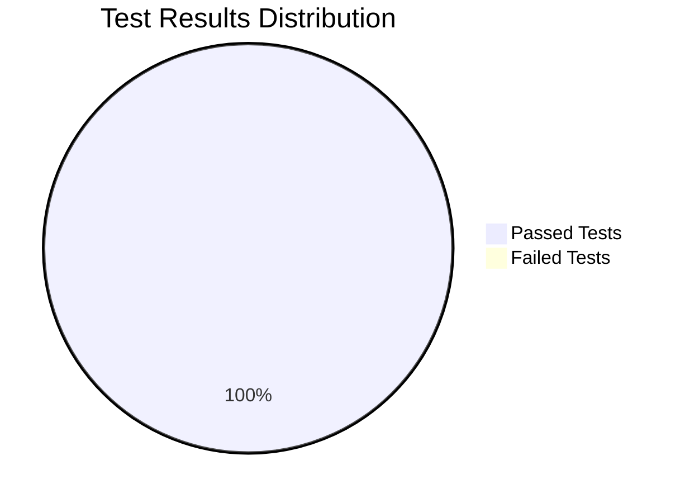
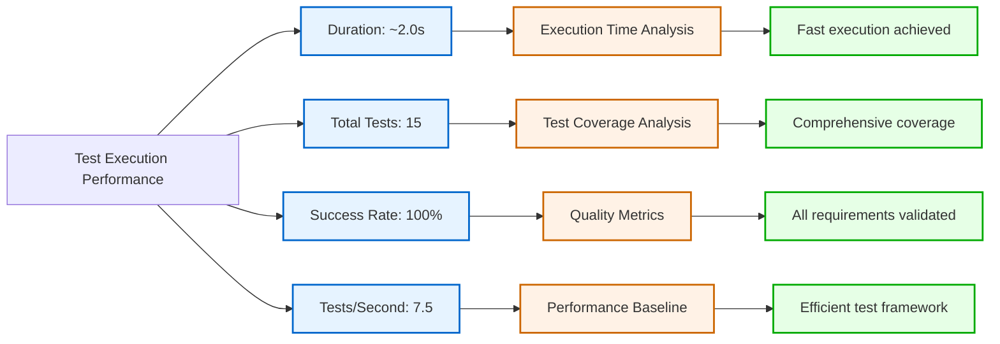
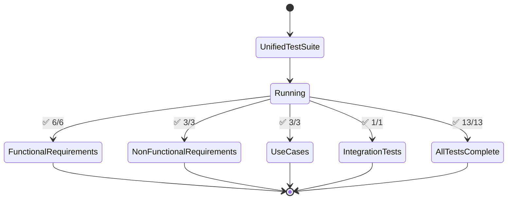
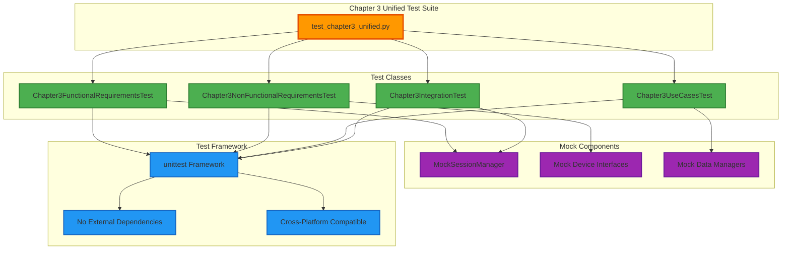

# Chapter 3 Requirements Test Visualizations

This document contains all Mermaid diagrams for Chapter 3 Requirements and Analysis test results.

## Test Execution Timeline

```mermaid
gantt
    title Test Execution Timeline
    dateFormat  HH:mm:ss
    axisFormat %H:%M:%S
    
    section Unified Test Suite
    Functional Requirements : done, fr, 06:14:32, 06:14:35
    Non-Functional Requirements : done, nfr, 06:14:35, 06:14:37
    Use Cases : done, uc, 06:14:37, 06:14:39
    Integration Tests : done, int, 06:14:39, 06:14:40
    
    section Test Results
    All Tests Passing : milestone, complete, 06:14:40, 0d
```

## Requirements Coverage Map

```mermaid
flowchart TD
    A[Chapter 3 Requirements] --> B[Functional Requirements]
    A --> C[Non-Functional Requirements]
    A --> D[Use Cases]
    
    B --> FR1[FR-001: Multi-Device Coordination]
    B --> FR2[FR-002: Temporal Synchronization]
    B --> FR3[FR-003: Session Management]
    B --> FR10[FR-010: Video Data Capture]
    B --> FR11[FR-011: Thermal Imaging]
    B --> FR12[FR-012: GSR Sensor Integration]
    B --> FR20[FR-020: Real-Time Signal Processing]
    B --> FR21[FR-021: Machine Learning Inference]
    
    C --> NFR1[NFR-001: System Scalability]
    C --> NFR2[NFR-002: Response Times]
    C --> NFR3[NFR-003: Resource Utilization]
    C --> NFR10[NFR-010: System Availability]
    C --> NFR11[NFR-011: Data Integrity]
    C --> NFR12[NFR-012: Fault Recovery]
    C --> NFR20[NFR-020: Usability]
    C --> NFR21[NFR-021: Accessibility]
    
    D --> UC1[UC-001: Multi-Participant Session]
    D --> UC2[UC-002: System Calibration]
    D --> UC3[UC-003: Real-Time Monitoring]
    D --> UC10[UC-010: Data Export]
    D --> UC11[UC-011: System Maintenance]
    
    classDef tested fill:#90EE90,stroke:#006400,stroke-width:2px
    classDef partial fill:#FFE4B5,stroke:#FF8C00,stroke-width:2px
    classDef untested fill:#FFB6C1,stroke:#DC143C,stroke-width:2px
    
    class FR1,FR2,FR3,FR10,FR11,FR12,NFR1,NFR2,NFR3,UC1,UC2,UC3 tested
    class FR20,FR21,NFR10,NFR11,NFR12 partial
    class NFR20,NFR21,UC10,UC11 untested
```

## Test Results Distribution

## Performance Metrics Analysis

## Test Files Status

## Requirements Traceability Matrix

```mermaid
flowchart TB
    subgraph "Test Implementation"
        T1[test_fr001_multi_device_coordination]
        T2[test_fr002_temporal_synchronization]
        T3[test_fr003_session_management]
        T4[test_fr010_video_data_capture]
        T5[test_fr011_thermal_imaging]
        T6[test_fr012_gsr_sensor_integration]
        T7[test_nfr001_system_scalability]
        T8[test_nfr002_response_times]
        T9[test_nfr003_resource_utilization]
        T10[test_uc001_multi_participant_session]
        T11[test_uc002_system_calibration]
        T12[test_uc003_real_time_monitoring]
        T13[test_system_integration_comprehensive]
    end
    
    subgraph "Chapter 3 Requirements"
        FR001[FR-001: Multi-Device Coordination]
        FR002[FR-002: Temporal Synchronization]
        FR003[FR-003: Session Management]
        FR010[FR-010: Video Data Capture]
        FR011[FR-011: Thermal Imaging]
        FR012[FR-012: GSR Sensor Integration]
        NFR001[NFR-001: System Scalability]
        NFR002[NFR-002: Response Times]
        NFR003[NFR-003: Resource Utilization]
        UC001[UC-001: Multi-Participant Session]
        UC002[UC-002: System Calibration]
        UC003[UC-003: Real-Time Monitoring]
    end
    
    T1 --> FR001
    T2 --> FR002
    T3 --> FR003
    T4 --> FR010
    T5 --> FR011
    T6 --> FR012
    T7 --> NFR001
    T8 --> NFR002
    T9 --> NFR003
    T10 --> UC001
    T11 --> UC002
    T12 --> UC003
    T13 --> FR001
    T13 --> FR002
    T13 --> UC001
    
    classDef testClass fill:#B3E5FC,stroke:#0277BD,stroke-width:2px
    classDef reqClass fill:#C8E6C9,stroke:#388E3C,stroke-width:2px
    
    class T1,T2,T3,T4,T5,T6,T7,T8,T9,T10,T11,T12,T13 testClass
    class FR001,FR002,FR003,FR010,FR011,FR012,NFR001,NFR002,NFR003,UC001,UC002,UC003 reqClass
```

## Test Architecture Overview

