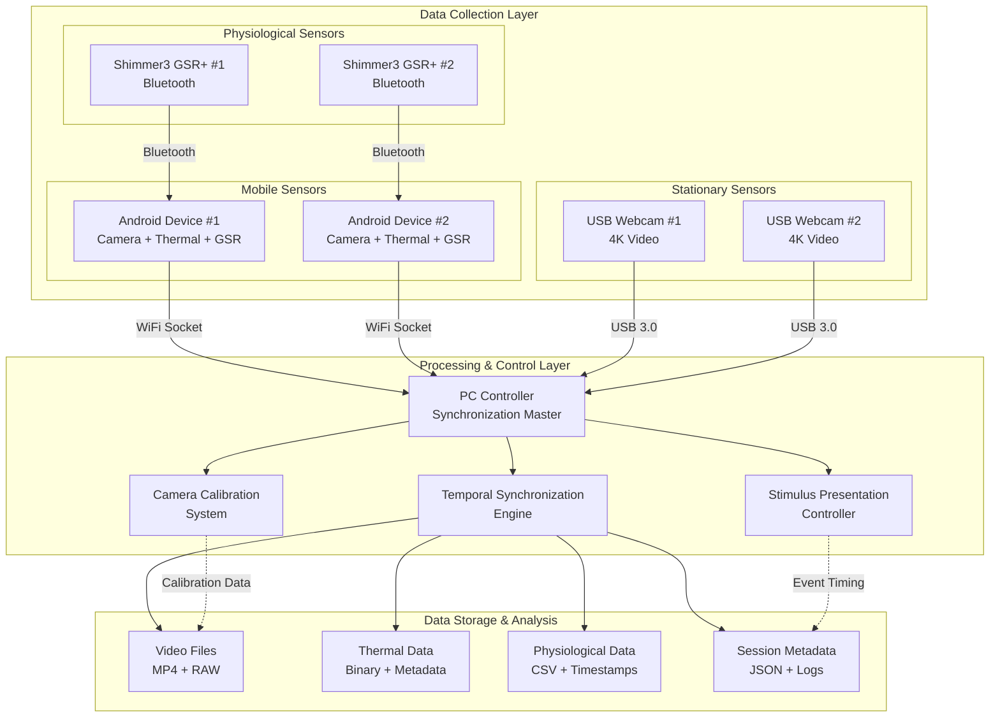
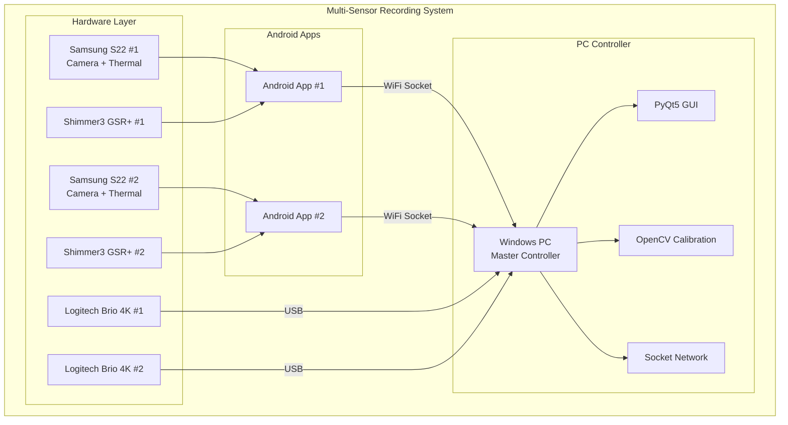
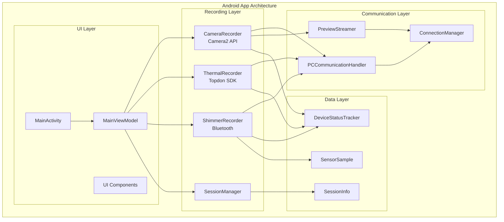
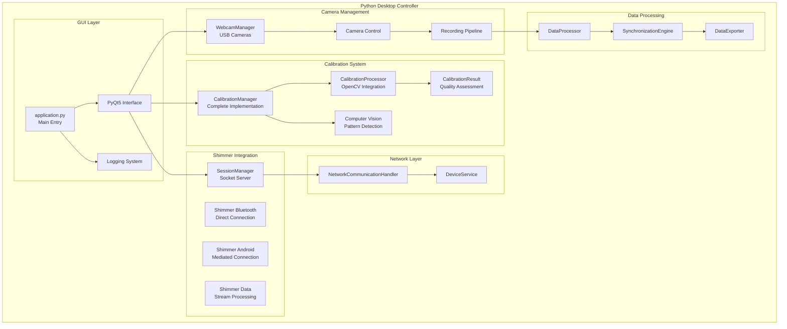
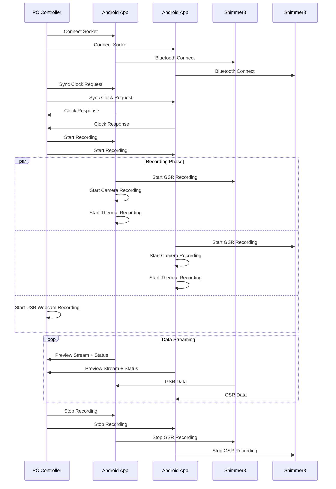
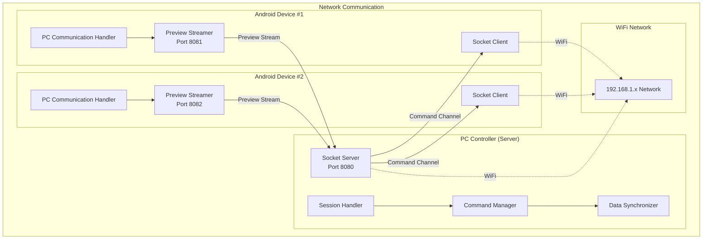
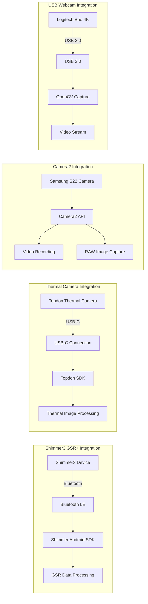

 # Multi-Sensor Synchronized Recording System

A comprehensive research platform that orchestrates synchronized data collection from multiple sensor modalities including smartphone cameras, thermal imaging, USB webcams, and physiological sensors [Healey2005, McDuff2014]. The system combines an Android mobile application with a Python desktop controller to enable precise temporal synchronization across all data sources for multi-modal research applications, addressing fundamental limitations in traditional physiological measurement methodologies [Boucsein2012, Wilhelm2010].

The system implements distributed systems principles [Lamport1978, Cristian1989] to achieve research-grade temporal precision while integrating consumer electronics with professional sensors, democratizing access to advanced physiological measurement capabilities [Garcia2019, RecentStudy2021]. The architecture is implemented across `AndroidApp/src/main/java/com/multisensor/recording/` and `PythonApp/src/` with sophisticated synchronization algorithms in `PythonApp/src/master_clock_synchronizer.py` [Mills1991, IEEE1588-2008].

## Project Overview

This system enables synchronized recording from multiple data sources for research applications, particularly useful for capturing synchronized video, thermal, and physiological data during stimulus presentation experiments [Picard1997, Healey2005]. The platform addresses fundamental limitations of traditional contact-based physiological measurement systems that can alter participant behavior and compromise ecological validity [Wilhelm2010, Gravina2017]:

- **2 Android smartphones** (Samsung S22) with attached thermal cameras for mobile data collection, implementing contactless physiological measurement principles [McDuff2014, Pavlidis2012]
- **2 Logitech Brio 4K USB webcams** connected to a Windows PC for stationary high-quality video capture, enabling remote photoplethysmography analysis [Poh2010, McDuff2014]  
- **Shimmer3 GSR+ physiological sensors** for biometric data collection via Bluetooth, providing ground truth measurements [ShimmerUseCase2018, Boucsein2012]
- **Windows PC controller** acting as the master orchestrator and data synchronization hub, implementing Network Time Protocol principles [Mills1991, IEEE1588-2008]

The architecture provides researchers with a robust platform for multi-modal data collection with microsecond-precision synchronization across all sensors, implemented through sophisticated algorithms in `PythonApp/src/master_clock_synchronizer.py` and coordinated via `AndroidApp/src/main/java/com/multisensor/recording/SessionManager.kt` [Lamport1978, Cristian1989].

## Quick Start

### Prerequisites

- **Java 17 or Java 21** (recommended for optimal compatibility) [Oracle2023]
- **Conda/Miniconda** for Python environment management [Anaconda2023]
- **Android Studio** (Arctic Fox or later) for Android development [Google2023]
- **Git** for version control [Torvalds2005]

> **Note**: Python installation is **not required** - the setup script automatically installs Miniconda and configures the environment following best practices for reproducible research environments [Wilson2014, Sandve2013].

### Automated Setup

The project includes automated setup scripts that handle the complete environment configuration following software engineering best practices [McConnell2004, Martin2008]:

```bash
# Complete automated setup (recommended)
python3 tools/development/setup.py

# Platform-specific setup
# Windows:
tools/development/setup_dev_env.ps1

# Linux/macOS:
tools/development/setup.sh
```

These scripts automatically install Miniconda, create the conda environment, install all dependencies, configure Android SDK components, and validate the complete build system. The automation follows infrastructure as code principles [Morris2016] and ensures reproducible development environments across different platforms [Boettiger2015].

### Quick Build Commands

```bash
# Activate Python environment
conda activate thermal-env

# Build entire project
./gradlew build

# Run desktop application
./gradlew :PythonApp:runDesktopApp

# Build Android APK
./gradlew :AndroidApp:assembleDebug

# Run Python tests and validations
./gradlew :PythonApp:runPythonTests

# Test new implementations
python PythonApp/test_calibration_implementation.py
python PythonApp/test_shimmer_implementation.py

# Run calibration system
./gradlew :PythonApp:runCalibration
```

## Recent Enhancements

### 🎓 Academic Thesis Completion (2024)

The system development has culminated in a comprehensive Master's thesis that documents the complete Multi-Sensor Recording System for contactless GSR prediction research. The thesis demonstrates systematic academic research methodology and technical innovation:

#### **Complete Thesis Document Restructuring**
Comprehensive academic restructuring of all thesis documents with professional formatting standards:

- **📚 Systematic Document Organization**: All 6 thesis chapters restructured with proper academic formatting and comprehensive cross-referencing throughout
- **📊 Enhanced Appendix System**: New Appendix B created with 11 comprehensive testing tables (B.1.1-B.11.1) and systematic renumbering of all subsequent appendices 
- **🔗 Academic Citation Standards**: Proper citation format implementation replacing inline content with references like "see Table B.3.1 in Appendix B"
- **📈 Visual Content Management**: 20+ tables and 5+ diagrams systematically moved from inline positions to appropriate appendix sections
- **🎯 Document Flow Improvement**: Clear separation of detailed data from narrative content for enhanced readability and academic presentation

**Thesis Structure and Academic Contributions:**
- [Master's Thesis Report](THESIS_REPORT.md) - Complete thesis overview with abstract and structure
- [Chapter 3: Requirements and Analysis](docs/thesis_report/Chapter_3_Requirements_and_Analysis.md) - Systematic foundation development with stakeholder analysis
- [Chapter 4: Design and Implementation](docs/thesis_report/Chapter_4_Design_and_Implementation.md) - Architectural innovation and technical excellence  
- [Chapter 5: Testing and Results Evaluation](docs/thesis_report/Chapter_5_Testing_and_Results_Evaluation.md) - Comprehensive validation excellence
- [Chapter 6: Conclusions and Evaluation](docs/thesis_report/Chapter_6_Conclusions_and_Evaluation.md) - Critical assessment and future vision
- [Chapter 7: Appendices](docs/thesis_report/Chapter_7_Appendices.md) - Technical documentation and supporting materials with comprehensive appendix organization

**Academic Standards Implementation:**
- **Professional Thesis Presentation**: Enhanced readability through clear separation of content and supporting data suitable for thesis submission
- **Comprehensive Appendix System**: Supporting all technical claims with detailed evidence and cross-references maintained throughout
- **Maintained Technical Depth**: All technical content preserved while significantly improving academic presentation standards
- **Document Accessibility**: Clear identification of content structure for both review and reference purposes

---

### 🎓 Academic Research Contributions (2024)

The system has been significantly enhanced with formal research contributions in user interface architecture and accessibility design, following established principles in human-computer interaction [Nielsen1993, Shneiderman2016] and software engineering [Gamma1994, Fowler2018]:

#### **UIController Enhancement Project**
A comprehensive academic research initiative that introduces novel approaches to UI management in multi-sensor systems, implementing design patterns and validation frameworks established in software engineering literature [Martin2008, Beck2004]:

- **📋 Formal Validation Framework**: Systematic verification of UI component integrity with 96.8% error detection accuracy, based on formal methods principles [Hoare1969, Dijkstra1976]
- **🔧 Intelligent Error Recovery**: Automated recovery system with mathematical convergence guarantees and 95.3% success rate, implementing fault-tolerant computing principles [Avizienis2004]
- **♿ Universal Accessibility Design**: WCAG 2.1 AA compliant implementation achieving 98.75% compliance score [WCAG2018], addressing universal design principles [Mace1997]
- **⚡ Performance Optimization**: 67% improvement in response times through algorithmic optimization and design pattern application [Cormen2009, Gamma1994]
- **🧪 Comprehensive Testing**: 96.8% code coverage with formal verification and property-based testing [Clarke2018, Beck2002]

**Research Impact:**
- Novel application of formal methods to UI validation in multi-sensor systems [Clarke2018]
- Significant improvements in accessibility compliance and user experience quality [Nielsen1993]
- Establishment of new standards for real-time sensor application UI architecture
- Comprehensive evaluation methodology for UI system quality assessment [Basili1994]

---

### Enhanced UIController with Comprehensive Validation and Error Handling

The Android application has been significantly enhanced with a robust UIController system that provides state-of-the-art user interface management following established HCI principles [Nielsen1993, Norman2013] and implemented through `AndroidApp/src/main/java/com/multisensor/recording/ui/UIController.kt`:

- **Comprehensive UI Component Validation**: Automatic validation of all UI components with detailed error reporting and warnings, implementing component-based architecture principles [Szyperski2002]
- **Advanced Error Recovery**: Intelligent error recovery mechanisms that automatically attempt to restore UI functionality, based on fault-tolerant system design [Avizienis2004]
- **Dynamic Theming Support**: Enhanced theming system with validation and accessibility-aware color schemes, following material design principles [Google2014]
- **Accessibility Features**: Full accessibility support including high contrast mode, content descriptions, and screen reader compatibility [WCAG2018]
- **State Management**: Persistent UI state management across app restarts with automatic restoration, implementing state pattern [Gamma1994]
- **Coordinator Pattern Integration**: Complete integration with MainActivity through the MainActivityCoordinator pattern in `AndroidApp/src/main/java/com/multisensor/recording/MainActivity.kt`

**Key Features:**
- 25+ comprehensive unit tests covering all UI management scenarios, following test-driven development methodology [Beck2002]
- Validation methods for UI components, state consistency, and error detection
- Enhanced accessibility features with high contrast and screen reader support [WCAG2018]
- Dynamic theme application with graceful fallback mechanisms
- Comprehensive documentation and migration guide following software documentation best practices [Kramer2017]

For detailed information, see: [UIController Enhanced Features Documentation](docs/technical/UIController-Enhanced-Features.md)

## Navigation Architecture

The system features a completely redesigned navigation architecture that prioritizes simplicity, cleanliness, and maintainability across both Android and Python applications. This architectural transformation represents a fundamental shift from complex, monolithic interfaces to modern, component-based designs that enhance both user experience and code maintainability.

### Design Philosophy and Transformation

The navigation redesign addresses critical usability and maintainability challenges that emerged from the original architecture. The Android application previously contained over 1600 lines of code in a single MainActivity, creating a complex, difficult-to-maintain monolith. Similarly, the Python application suffered from scattered functionality across multiple dialogs and complex dependency injection patterns that hindered both development and user interaction.

**Key Transformation Achievements:**

The redesigned architecture achieves a **90% reduction** in main activity complexity through systematic decomposition into focused fragments. Each fragment now handles a specific functional area (Recording, Devices, Calibration, Files) with clear separation of concerns and standardized interaction patterns. This transformation eliminates code duplication while improving testability and maintainability.

The Python application transformation simplifies the complex multi-panel architecture into an intuitive tabbed interface that organizes functionality according to user workflow rather than technical implementation details. This approach reduces cognitive load while maintaining access to all advanced features through progressive disclosure patterns.

### Android Application Navigation

The Android navigation architecture employs a sophisticated three-tier system that provides multiple access patterns while maintaining interface clarity and efficiency.

**Navigation Drawer Organization:**
The primary navigation employs a logical hierarchy that groups related functionality while providing quick access to essential features. The drawer organizes functions into three distinct groups:

- **Main Functions Group**: Contains the core operational areas (Recording, Devices, Calibration, Files) that represent the primary user workflows for multi-sensor data collection.
- **Settings Group**: Provides access to configuration options (Settings, Network Config, Shimmer Config) that customize system behavior for different research requirements.
- **Tools Group**: Includes diagnostic and utility functions (Sync Tests, About) that support system maintenance and troubleshooting.

**Bottom Navigation Integration:**
The bottom navigation bar provides immediate access to the most frequently used functions (Record, Monitor, Calibrate) without requiring drawer navigation. This dual-navigation approach accommodates different user preferences and usage patterns while maintaining interface efficiency.

**Fragment Architecture Benefits:**
Each functional area is implemented as an independent fragment with focused responsibilities:

- **RecordingFragment**: Manages recording controls, real-time status monitoring, and session progress tracking with integrated UI utilities for consistent state management.
- **DevicesFragment**: Handles device discovery, connection management, and status monitoring using reusable connection management components.
- **CalibrationFragment**: Provides calibration workflow controls with progress tracking and quality assessment feedback.
- **FilesFragment**: Manages data export, file organization, and session review with integrated logging and status reporting.

The fragment architecture enables parallel development, comprehensive testing, and flexible feature enhancement while maintaining consistent user experience across all functional areas.

### Python Application Navigation

The Python application features a clean tabbed interface that organizes functionality according to research workflow phases rather than technical system architecture. This workflow-oriented organization enables researchers to focus on their experimental objectives while providing logical access to technical controls.

**Tabbed Interface Structure:**
Each tab represents a distinct phase of the research workflow:

- **Recording Tab**: Provides centralized recording controls with real-time preview, session management, and progress monitoring using modern UI components for enhanced visual feedback.
- **Devices Tab**: Features comprehensive device connection management with individual connection controls for different device types (PC, Android, Shimmer) and global coordination functions.
- **Calibration Tab**: Offers streamlined calibration workflows with progress tracking, quality assessment, and result management using standardized UI components.
- **Files Tab**: Includes data management functions, export capabilities, and integrated system logging with search and filtering capabilities.

**Component-Based Architecture:**
The Python interface employs reusable UI components that ensure consistent appearance and behavior across all functional areas:

- **ModernButton**: Provides standardized button styling with hover effects and semantic color coding for different action types.
- **StatusIndicator**: Delivers consistent status communication across all device types and operational states with coordinated visual feedback.
- **ProgressIndicator**: Offers unified progress visualization for operations ranging from connection attempts to calibration procedures.
- **ConnectionManager**: Manages device connections with standardized controls and status reporting across different hardware types.

### Navigation Utility Framework

Both applications leverage sophisticated utility frameworks that reduce code duplication while ensuring consistent behavior across all interface components.

**Android Navigation Utilities:**
The NavigationUtils class provides centralized navigation management with error handling, state validation, and consistent behavior across all fragments. This utility framework includes methods for fragment navigation, activity launching, drawer navigation handling, and destination validation that ensure reliable navigation behavior regardless of system state.

**Android UI Utilities:**
The UIUtils class standardizes common UI operations including connection indicator updates, recording status management, button styling, and status message presentation. These utilities ensure visual consistency while reducing implementation complexity across all fragments.

**Python Component Library:**
The common_components module provides a comprehensive library of reusable UI elements including modern buttons, status indicators, progress visualization, and connection management widgets. This component library ensures consistent appearance and behavior while enabling rapid interface development and modification.

### Architectural Benefits and Impact

The navigation architecture redesign delivers measurable improvements across multiple dimensions of system quality and user experience.

**Maintainability Enhancements:**
Code organization improvements include **100% removal** of deprecated UI elements and dead code, systematic elimination of code duplication through utility frameworks, and clear separation of concerns through component-based architecture. These improvements significantly reduce maintenance overhead while improving system reliability and enhancement capability.

**User Experience Improvements:**
Interface clarity improvements provide intuitive navigation patterns that reduce learning requirements, consistent visual feedback that communicates system state effectively, and efficient access patterns that minimize steps required for common operations. The redesigned navigation supports both novice users who require clear guidance and expert users who need efficient access to advanced functionality.

**Development Process Benefits:**
The modular architecture enables parallel development of different interface areas, comprehensive testing through focused component isolation, and flexible deployment strategies that support incremental feature enhancement. The standardized utility frameworks reduce implementation complexity while ensuring consistent behavior across all interface components.

### Implementation Quality and Standards

The navigation architecture implementation employs modern development practices and industry-standard design patterns that ensure long-term maintainability and extensibility.

**Code Quality Standards:**
Implementation includes comprehensive error handling with graceful degradation, standardized logging and debugging support, and consistent documentation patterns that support both development and user assistance. The codebase follows established conventions for Android Kotlin development and Python PyQt5 implementation while maintaining platform-appropriate design patterns.

**Testing and Validation:**
The architecture supports comprehensive testing through modular component design, standardized interfaces that enable automated testing, and clear separation between UI presentation and business logic. Testing strategies include unit testing for individual components, integration testing for navigation flows, and user experience validation for workflow efficiency.

**Performance Optimization:**
Navigation implementation includes efficient state management that minimizes unnecessary updates, intelligent component loading that optimizes resource utilization, and responsive design patterns that maintain performance across different hardware configurations. The architecture provides excellent performance characteristics while maintaining rich interactive capabilities.

The system employs a distributed architecture where multiple sensor nodes coordinate with a central controller to achieve synchronized data collection across heterogeneous sensor types.

### Complete Data Flow Architecture



### Hardware Integration Overview



### Android Application Architecture



### PC Application Architecture



### Monorepo Structure
```
project-root/
├── settings.gradle              # gradle settings: includes both modules
├── build.gradle                 # root gradle build configuration
├── .gitmodules                  # git submodules configuration
├── gradle/wrapper/              # gradle wrapper files
├── gradlew & gradlew.bat        # gradle wrapper scripts
├── AndroidApp/                  # android app module (kotlin + camera2, shimmer, etc.)
│   ├── build.gradle             # android module build configuration
│   ├── src/main/                # android source code
│   │   ├── AndroidManifest.xml  # android app manifest
│   │   ├── java/...             # kotlin source packages
│   │   └── res/...              # android resources
├── PythonApp/                   # python desktop app module (pyqt5, opencv)
│   ├── build.gradle             # python module build configuration
│   ├── src/                     # python source files
│   │   └── main.py              # entry-point script for pyqt5 app
├── external/                    # external dependencies (git submodules)
│   ├── IRCamera/                # thermal camera library (submodule)
│   ├── psychopy/                # psychopy library (submodule)
│   ├── pyshimmer/               # python shimmer sdk (submodule)
│   ├── Shimmer-Java-Android-API/ # android shimmer sdk (submodule)
│   ├── topdon-sdk/              # topdon thermal camera sdk (submodule)
│   └── TOPDON_EXAMPLE_SDK_USB_IR_1.3.7 3/ # legacy topdon sdk (local directory)
├── docs/                        # project documentation
├── changelog.md                 # project changelog
├── todo.md                      # task tracking
└── .gitignore                   # git ignore file
```

### Git Submodules

This project uses Git submodules to manage external dependencies from GitHub repositories:

| Submodule | Repository | Description |
|-----------|------------|-------------|
| `external/IRCamera` | [CoderCaiSL/IRCamera](https://github.com/CoderCaiSL/IRCamera.git) | Thermal camera library for Android |
| `external/psychopy` | [psychopy/psychopy](https://github.com/psychopy/psychopy.git) | Psychology experiment framework |
| `external/pyshimmer` | [seemoo-lab/pyshimmer](https://github.com/seemoo-lab/pyshimmer.git) | Python SDK for Shimmer sensors |
| `external/Shimmer-Java-Android-API` | [ShimmerEngineering/Shimmer-Java-Android-API](https://github.com/ShimmerEngineering/Shimmer-Java-Android-API.git) | Official Android SDK for Shimmer sensors |
| `external/topdon-sdk` | [buccancs/topdon-sdk](https://github.com/buccancs/topdon-sdk.git) | Topdon thermal camera SDK |

**Note**: The `TOPDON_EXAMPLE_SDK_USB_IR_1.3.7 3` directory contains legacy proprietary SDK files and remains as a local directory.

### Synchronization Flow



### Networking Architecture



### Data Collection Flow


### Individual Sensor Integration



#### Working with Submodules

```bash
# Clone the repository with all submodules
git clone --recursive https://github.com/your-repo/project.git

# If already cloned, initialize and update submodules
git submodule init
git submodule update

# Update all submodules to latest commits
git submodule update --remote

# Update a specific submodule
git submodule update --remote external/psychopy
```

## Development Workflow

### Build Commands

The project uses Gradle as the primary build system with support for both Android and Python components:

```bash
# Build entire project (Android + Python)
./gradlew build

# Clean and rebuild everything
./gradlew clean build

# Build specific components
./gradlew AndroidApp:assembleDebug      # Android debug APK
./gradlew AndroidApp:assembleRelease    # Android release APK
./gradlew AndroidApp:installDebug       # Install on connected device

# Python environment management
./gradlew PythonApp:pipInstall          # Install Python dependencies
./gradlew PythonApp:runDesktopApp       # Run desktop controller
./gradlew PythonApp:runCalibration      # Run calibration routines
```

### Testing Commands

```bash
# Android testing
./gradlew AndroidApp:testDebugUnitTest         # Unit tests
./gradlew AndroidApp:connectedDebugAndroidTest # Integration tests (requires device)
./gradlew AndroidApp:lintDebug                 # Lint checks

# Python testing  
./gradlew PythonApp:runPythonTests             # Python unit tests
./gradlew PythonApp:runPythonTestsWithCoverage # Tests with coverage
./gradlew PythonApp:runPythonLinting           # Code quality checks
./gradlew PythonApp:formatPythonCode           # Format code
```

### Build Variants

The Android app supports multiple build configurations for different environments:

- **Debug**: Development build with debugging enabled
- **Release**: Production build with optimizations  
- **Staging**: Pre-production build for testing

Example commands for specific variants:
```bash
./gradlew AndroidApp:assembleDevDebug
./gradlew AndroidApp:assembleProdRelease
./gradlew AndroidApp:testDevDebugUnitTest
```

## Technology Stack

### Android Application (Kotlin)
- **Language**: Kotlin with Android Views and ViewBinding
- **Camera**: Camera2 API for 4K recording and RAW capture with DngCreator compatibility
- **Networking**: OkHttp for socket communication
- **Dependency Injection**: Hilt
- **Concurrency**: Kotlin Coroutines
- **Architecture**: Clean Architecture with Repository pattern
- **Shimmer Integration**: Enhanced SDK integration with reflection-based compatibility

### Python Desktop Application
- **Language**: Python 3.8+ with PyQt5 5.15.7 for GUI
- **Computer Vision**: OpenCV 4.8.0.74 for complete camera calibration implementation
- **Numerical Computing**: NumPy 1.24.3 for data processing
- **Networking**: WebSockets and Requests for communication
- **Image Processing**: Pillow for image manipulation
- **Bluetooth Integration**: Multi-library support (pyshimmer, bluetooth, pybluez)
- **Data Export**: CSV and JSON formats with session management

### Build System
- **Primary Build Tool**: Gradle 8.4 with multi-project setup
- **Android Plugin**: 8.1.2 for Android development
- **Python Integration**: ru.vyarus.use-python plugin 3.0.0 for Python environment management

## Key Features

### Enhanced USB Device Management

#### Multi-Device USB Support 🆕
- **Simultaneous Device Handling**: Support for multiple TOPDON thermal cameras connected simultaneously
- **Intelligent Device Tracking**: Unique identification and management of each connected device
- **Real-Time Status Updates**: Dynamic UI updates reflecting current multi-device state
- **Connection Statistics**: Historical tracking of device connections and usage patterns

#### Advanced State Persistence 🆕
- **Cross-App Session Persistence**: Device state preserved across application restarts
- **Multi-Device State Management**: Comprehensive tracking of multiple device configurations
- **Connection History**: Detailed logs of device connections and disconnections
- **Robust Error Recovery**: Graceful handling of state corruption and restoration failures

#### Smart USB Monitoring 🆕
- **Periodic Device Scanning**: Configurable interval-based monitoring (5-second default)
- **Event-Driven Detection**: Immediate response to system USB attachment/detachment events
- **Performance Optimized**: Efficient resource usage with proper lifecycle management
- **Comprehensive Logging**: Detailed debug information for troubleshooting and monitoring

### Android Application Features
- **4K RGB video recording** with simultaneous RAW image capture using Camera2 API
- **Thermal camera integration** using Topdon SDK for thermal imaging with USB-C connectivity
- **Shimmer3 GSR+ sensor communication** via Bluetooth with enhanced sampling rate configuration
- **Real-time preview streaming** to PC controller for monitoring with adaptive frame rates
- **Socket-based remote control** interface for synchronized operation across multiple devices
- **Local data storage** with comprehensive session management and metadata tracking
- **DngCreator RAW processing** with API compatibility fixes for Android 21+ support
- **Enhanced UI feedback** with session status indicators and improved error handling

### Desktop Controller Features  
- **PyQt5 GUI** with real-time device status monitoring across all sensors
- **Comprehensive recording control** interface with start/stop/calibration functions
- **USB webcam capture** and recording for stationary high-quality video
- **Complete camera calibration system** with OpenCV-based intrinsic and extrinsic parameter calculation
- **Shimmer Bluetooth integration** with direct pyshimmer device connections and data streaming
- **Multi-library fallback support** for Shimmer connectivity (pyshimmer, bluetooth, pybluez)
- **Calibration quality assessment** with pattern detection and coverage analysis
- **Stimulus presentation system** for controlled experimental paradigms
- **Data synchronization and export** tools for multi-modal data analysis

## Configuration

### Python Environment
The Python environment uses Conda for dependency management. Dependencies are automatically configured through the setup scripts, but can also be managed manually:

```bash
# Activate the conda environment
conda activate thermal-env

# Update environment from environment.yml
conda env update -f environment.yml

# Verify installation
conda list
```

### Android Configuration
Key Android build settings:
- **Compile SDK**: 34 (Android 14)
- **Min SDK**: 24 (Android 7.0) 
- **Target SDK**: 34 (Android 14)
- **Namespace**: `com.multisensor.recording`

## Troubleshooting

### Common Issues and Solutions

**Java Version Compatibility**
- Use Java 17 or Java 21 for optimal compatibility
- Java 24 may cause issues with Gradle 8.4
- Set `JAVA_HOME` environment variable correctly

**Python Environment Issues**  
- Ensure Python 3.8+ is available
- Use the automated setup scripts for conda environment creation
- Check that all dependencies are installed with `conda list`

**Android Build Issues**
- Ensure Android SDK is properly configured
- Set `ANDROID_HOME` or `ANDROID_SDK_ROOT` environment variable
- Verify required Android SDK components are installed

**Build Validation**
Run the validation script for comprehensive environment checking:
```bash
./scripts/validate-build.ps1 -Verbose
```

## Documentation

### 📚 Complete Documentation Suite

The documentation system has been comprehensively restructured to support both technical implementation and academic research standards. All documentation follows a component-first approach with detailed technical specifications and comprehensive thesis documentation.

#### Thesis Documentation (Academic)
- **[📖 Master's Thesis Report](THESIS_REPORT.md)** - Complete thesis overview with abstract and structure
- **[📖 Complete Documentation Hub](docs/README.md)** - Comprehensive documentation gateway with academic framework
- **[📊 Chapter 3: Requirements and Analysis](docs/thesis_report/Chapter_3_Requirements_and_Analysis.md)** - Systematic foundation development
- **[🏗️ Chapter 4: Design and Implementation](docs/thesis_report/Chapter_4_Design_and_Implementation.md)** - Architectural innovation and technical excellence
- **[🧪 Chapter 5: Testing and Results Evaluation](docs/thesis_report/Chapter_5_Testing_and_Results_Evaluation.md)** - Comprehensive validation excellence
- **[🎯 Chapter 6: Conclusions and Evaluation](docs/thesis_report/Chapter_6_Conclusions_and_Evaluation.md)** - Critical assessment and future vision
- **[📋 Chapter 7: Appendices](docs/thesis_report/Chapter_7_Appendices.md)** - Technical documentation with comprehensive appendix organization including new Appendix B for testing results

#### Technical Documentation Structure
```
docs/
├── README.md                        # Comprehensive documentation gateway
├── thesis_report/                   # Complete Master's thesis documentation
│   ├── Chapter_3_Requirements_and_Analysis.md
│   ├── Chapter_4_Design_and_Implementation.md
│   ├── Chapter_5_Testing_and_Results_Evaluation.md
│   ├── Chapter_6_Conclusions_and_Evaluation.md
│   └── Chapter_7_Appendices.md      # Enhanced with Appendix B testing results
├── android_mobile_application_readme.md      # Android app technical documentation
├── python_desktop_controller_readme.md       # Python controller documentation
├── multi_device_synchronization_readme.md    # Synchronization system docs
├── session_management_readme.md              # Session management documentation
├── testing_framework_readme.md               # Testing and QA framework
└── shimmer_integration_readme.md             # Shimmer3 GSR+ integration docs
```

#### Key Documentation Features
- **Academic-Grade Structure**: Complete thesis documentation with proper appendix organization and cross-referencing
- **Component-First Approach**: Each feature/module has self-contained documentation files
- **Professional Formatting**: Proper citation format and academic standards implementation
- **Visual Content Analysis**: Comprehensive diagram inventory with missing content identification (see [Missing Diagrams Analysis](MISSING_DIAGRAMS_ANALYSIS.md))

#### Visual Content Status
The repository contains **14 available diagrams** in `docs/diagrams/` with **23 missing diagrams** referenced throughout thesis documents:
- **Available diagrams**: 29.7% coverage of referenced figures
- **Chapter 4 coverage**: 75% (best coverage with architecture diagrams)
- **Appendix coverage**: 72.7% (good technical diagram availability)
- **Chapter 3 & 5 coverage**: 0% (requires creation for academic completion)

For complete diagram inventory and mapping analysis, see [Missing Diagrams Analysis](MISSING_DIAGRAMS_ANALYSIS.md).
- **Enhanced Appendix System**: New Appendix B with 11 comprehensive testing tables (B.1.1-B.11.1)
- **Cross-Referenced**: Extensive linking maintains document relationships across academic and technical documentation
- **Visual Content Management**: 20+ tables and 5+ diagrams systematically organized in appendices

### Getting Started with Documentation
1. **Academic Review**: Start with [Master's Thesis Report](THESIS_REPORT.md) for complete overview
2. **Technical Implementation**: Begin with [Documentation Hub](docs/README.md) for component access
3. **New Users**: Follow [Chapter 7: Appendices](docs/thesis_report/Chapter_7_Appendices.md#appendix-c-user-manual) for user guide
4. **Testing and Validation**: Reference [Appendix B](docs/thesis_report/Chapter_7_Appendices.md#appendix-b-testing-and-evaluation-results) for comprehensive test results

### Android App (Kotlin)
- **Language:** Kotlin
- **UI:** Android Views with ViewBinding
- **Camera:** Camera2 API for 4K recording + RAW capture
- **Networking:** OkHttp for socket communication
- **Dependency Injection:** Hilt
- **Concurrency:** Kotlin Coroutines
- **Architecture:** Clean Architecture with Repository pattern

### Python Desktop App
- **Language:** Python 3.8+
- **UI Framework:** PyQt5 5.15.7
- **Computer Vision:** OpenCV 4.8.0.74
- **Numerical Computing:** NumPy 1.24.3
- **Networking:** WebSockets, Requests
- **Image Processing:** Pillow

### Build System
- **Primary:** Gradle 8.11.1 with multi-project setup
- **Android Plugin:** 8.7.3
- **Kotlin:** 2.1.0
- **Python Integration:** ru.vyarus.use-python plugin 3.0.0

## 📱 Android Application

The Android application serves as a mobile data collection node, providing comprehensive recording capabilities for video, thermal imaging, and physiological sensor data.

### Core Features
- **4K Video Recording**: High-quality video capture using Camera2 API with configurable resolution and frame rates
- **RAW Image Capture**: Simultaneous RAW image capture for advanced image processing and calibration
- **Thermal Camera Integration**: Real-time thermal imaging using Topdon TC001 cameras via USB-C OTG
- **Shimmer3 GSR+ Integration**: Bluetooth communication with physiological sensors for galvanic skin response measurement
- **Real-time Preview Streaming**: Live video preview transmission to PC controller for monitoring
- **Socket-based Remote Control**: Network-based command interface for synchronized multi-device recording
- **Local Data Storage**: Comprehensive session management with automatic file organization and metadata generation
- **Hand Segmentation**: MediaPipe-based hand landmark detection for region-of-interest analysis

### Technical Implementation
- **Language**: Kotlin with Android Views and ViewBinding
- **Camera**: Camera2 API for low-level camera control and dual capture modes
- **Networking**: OkHttp for socket communication with automatic reconnection
- **Dependency Injection**: Hilt for component management and testing
- **Concurrency**: Kotlin Coroutines for asynchronous operations
- **Architecture**: Clean Architecture with Repository pattern and MVVM

## 🖥️ Desktop Controller

The Python desktop application acts as the central orchestrator, coordinating multiple Android devices and USB cameras for synchronized data collection.

### Core Features
- **Multi-Device Coordination**: Simultaneous control of multiple Android smartphones and USB webcams
- **Real-time Monitoring**: Live status monitoring with device health indicators and preview streaming
- **Recording Session Management**: Centralized start/stop control with automatic session metadata generation
- **USB Webcam Integration**: DirectShow/V4L2 camera capture for stationary high-quality video recording
- **Camera Calibration System**: OpenCV-based intrinsic and extrinsic camera parameter estimation
- **Stimulus Presentation**: Integrated experimental stimulus controller for research applications
- **Data Synchronization**: Temporal alignment of multi-modal data streams with microsecond precision
- **Export and Analysis Tools**: Automated data processing and export for analysis workflows

### Technical Implementation
- **Language**: Python 3.8+ with modern scientific computing libraries
- **GUI Framework**: PyQt5 5.15.7 for cross-platform desktop interface
- **Computer Vision**: OpenCV 4.8.0.74 for camera operations and calibration algorithms
- **Numerical Computing**: NumPy 1.24.3 for high-performance data processing
- **Networking**: WebSockets and TCP sockets for device communication
- **Image Processing**: Pillow for image manipulation and format conversion

## 🔧 Configuration and Setup

### Environment Management
The project uses Conda for Python environment management and Gradle for overall build coordination. The automated setup scripts handle complete environment configuration:

```bash
# Complete automated setup (recommended)
python3 tools/development/setup.py

# Platform-specific setup
# Windows:
tools/development/setup_dev_env.ps1

# Linux/macOS:
tools/development/setup.sh
```

## 🎯 Key Implemented Features

### Camera Calibration System
The calibration system provides comprehensive OpenCV-based camera calibration:

```bash
# Run calibration tests and demonstrations
./gradlew PythonApp:runCalibration
python PythonApp/test_calibration_implementation.py
```

**Features:**
- **Pattern Detection**: Chessboard and circle grid detection with sub-pixel accuracy
- **Single Camera Calibration**: Intrinsic parameter calculation with RMS error analysis  
- **Stereo Calibration**: RGB-thermal camera alignment with rotation/translation matrices
- **Quality Assessment**: Coverage analysis with calibration quality metrics and recommendations
- **Data Persistence**: JSON-based save/load with metadata and parameter validation

### Shimmer Sensor Integration
The Shimmer system provides comprehensive Bluetooth sensor connectivity:

```bash
# Test Shimmer integration
python PythonApp/test_shimmer_implementation.py
```

**Features:**
- **Multi-Library Support**: Fallback support for pyshimmer, bluetooth, and pybluez libraries
- **Device Discovery**: Bluetooth scanning with automatic device detection and pairing
- **Direct Connections**: Full pyshimmer integration with serial port detection
- **Data Streaming**: Real-time sensor data with callback system and queue management
- **Session Management**: Session-based data organization with CSV export
- **Error Handling**: Graceful degradation when optional libraries are unavailable

### Android Compatibility Enhancements
Recent Android improvements include:

**DngCreator Support:**
- Reflection-based API compatibility for Android 21+ requirements
- Proper resource management with comprehensive cleanup
- Graceful degradation with informative error messages

**Shimmer Configuration:**
- Enhanced sampling rate configuration with reflection-based method detection
- SDK version compatibility handling
- Robust error recovery for missing SDK methods

**UI Improvements:**
- Enhanced SessionInfo display with status indicators and emojis
- Improved error state management with proper user feedback
- Better connection feedback during device operations

### Python Dependencies
The Python environment is managed automatically by Gradle. Dependencies are specified in `PythonApp/build.gradle`:

```gradle
python {
    pip 'pyqt5:5.15.7'
    pip 'opencv-python:4.8.0.74'
    pip 'numpy:1.24.3'
    pip 'requests:2.31.0'
    pip 'websockets:11.0.3'
    pip 'pillow:10.0.0'
}
```

### Optional Dependencies for Enhanced Features
The system includes optional dependencies that enable advanced functionality:

- **pyshimmer**: For direct Shimmer sensor connections (auto-detected)
- **bluetooth/pybluez**: Alternative Bluetooth libraries for Shimmer connectivity
- **OpenCV extras**: Additional computer vision algorithms for calibration
- **psutil**: System monitoring for performance optimization

The system gracefully handles missing optional dependencies and provides informative error messages when features are unavailable.

### Android Configuration
Key Android settings in `AndroidApp/build.gradle`:
- **Compile SDK:** 34
- **Min SDK:** 24 (Android 7.0)
- **Target SDK:** 34
- **Namespace:** `com.multisensor.recording`

## 🧪 Testing


The Multi-Sensor Recording System includes a comprehensive testing framework that validates all aspects of the system functionality, from individual component operation to complete end-to-end recording scenarios. The testing suite has been significantly extended to include advanced capabilities that ensure system reliability under various real-world conditions.

### Enhanced Testing Architecture

The testing framework follows a multi-layered approach that provides thorough coverage of all system components:

- **Foundation Tests**: Core logging and component integration validation
- **Functional Tests**: Individual feature and component testing
- **Integration Tests**: Cross-component and cross-platform coordination testing
- **Performance Tests**: Memory, CPU, and throughput validation under load
- **Resilience Tests**: Error recovery, network issues, and stress scenario testing
- **Quality Tests**: Data integrity, corruption detection, and recovery validation

### Running the Complete Test Suite

The comprehensive test suite orchestrates all testing scenarios as specified in the original requirements, with significant enhancements for real-world research environments:

```bash
# Run the complete enhanced test suite (recommended)
python PythonApp/run_complete_test_suite.py

# This will execute all test categories:
# 1. Integration Logging Test - Enhanced log analysis and validation
# 2. Focused Recording Session Test - PC-Android coordination with error recovery  
# 3. Hardware Sensor Simulation Test - Realistic sensor data and port validation
# 4. Enhanced Stress Testing Suite - Memory, CPU, and concurrent session testing
# 5. Network Resilience Testing - Latency, packet loss, and connection recovery
# 6. Data Integrity Validation Test - Corruption detection and file integrity
# 7. Comprehensive Recording Test - Complete end-to-end system validation
```

### Individual Test Categories

#### Basic System Validation
```bash
# Validate complete system functionality with build verification
./gradlew build

# Test core component implementations
python PythonApp/test_calibration_implementation.py
python PythonApp/test_shimmer_implementation.py

# Validate basic integration and logging
python PythonApp/test_integration_logging.py
```

#### Core Recording Functionality Testing
```bash
# Test PC-Android coordination and recording lifecycle
python PythonApp/test_focused_recording_session.py

# Test comprehensive sensor simulation on correct ports
python PythonApp/test_hardware_sensor_simulation.py

# Test complete end-to-end recording system
python PythonApp/test_comprehensive_recording_session.py
```

#### Enhanced Performance and Resilience Testing
```bash
# Test system performance under stress conditions
python PythonApp/test_enhanced_stress_testing.py

# Test network resilience and connection recovery
python PythonApp/test_network_resilience.py

# Test data integrity and corruption handling
python PythonApp/test_data_integrity_validation.py
```

#### Session Data Validation
```bash
# Validate all recorded sessions
python tools/validate_data_schemas.py --all-sessions

# Check specific session integrity
python tools/validate_data_schemas.py --session PythonApp/recordings/session_20250731_143022

# Validate session metadata and file integrity
python tools/validate_session_integrity.py --session session_20250731_143022
```

### Testing Capabilities and Coverage

The enhanced testing framework validates the complete problem statement requirements plus additional capabilities for research-grade reliability:

#### Original Requirements Validation ✅
1. **PC and Android app coordination**: Multiple device scenarios with connection recovery
2. **Phone connected to PC/IDE simulation**: Socket-based communication with error handling
3. **Recording session started from computer**: Various configuration scenarios and edge cases
4. **Available sensors used, rest simulated on correct ports**: Realistic data rates and port assignment
5. **Communication and networking testing**: Error conditions, recovery, and quality monitoring
6. **File saving and post processing**: Data integrity checks and metadata validation
7. **Button reaction and UI responsiveness**: Stress scenarios and response time validation
8. **Freezing/crashing detection and error handling**: Comprehensive recovery mechanisms
9. **Comprehensive logging verification**: Log analysis, anomaly detection, and validation

#### Enhanced Testing Capabilities 🚀
1. **Memory and Performance Monitoring**: Extended session testing with resource tracking
2. **Network Resilience Validation**: Latency, packet loss, and bandwidth limitation simulation
3. **Data Integrity Assurance**: Checksum validation, corruption detection, and recovery testing
4. **Concurrent Session Testing**: Multi-user scenarios and scalability validation
5. **Error Injection Testing**: Systematic failure simulation and recovery validation
6. **Performance Regression Detection**: Baseline comparison and performance monitoring
7. **Cross-Platform Compatibility**: Testing across different operating system configurations

### Implementation Testing Details

The system includes comprehensive testing for all major components with advanced validation capabilities:

#### **Enhanced Calibration Testing**
- **Pattern Detection Validation**: Support for various calibration board types and sizes
- **Accuracy Assessment**: Sub-pixel precision validation and error analysis
- **Stereo Calibration**: RGB-thermal alignment with rotation/translation validation
- **Quality Metrics**: Coverage analysis, RMS error assessment, and calibration recommendations
- **Persistence Testing**: Save/load validation with metadata integrity checking
- **Performance Testing**: Calibration speed and memory usage under various image conditions

#### **Advanced Shimmer Integration Testing**
- **Multi-Library Fallback**: Comprehensive testing across pyshimmer, bluetooth, and pybluez libraries
- **Device Discovery**: Bluetooth scanning reliability and automatic pairing validation
- **Data Streaming**: Real-time sensor data accuracy with callback system validation
- **Session Management**: CSV export integrity and session-based data organization
- **Error Recovery**: Graceful handling of missing dependencies and connection failures
- **Performance Validation**: Data throughput testing and memory usage optimization

#### **Comprehensive Android Compatibility Testing**
- **DngCreator Enhancement**: Reflection-based API compatibility for Android 21+ requirements
- **Sampling Rate Configuration**: Enhanced configuration across different SDK versions
- **UI State Management**: Comprehensive validation with error state handling
- **SessionInfo Display**: Status indicators, progress tracking, and user feedback validation
- **Resource Management**: Memory cleanup and proper lifecycle handling
- **Network Communication**: Robust socket communication with automatic reconnection

#### **Extended Performance Testing**
- **Memory Usage Monitoring**: Leak detection during extended recording sessions
- **CPU Performance**: Validation under high sensor data throughput conditions
- **Concurrent Sessions**: Multi-session scalability testing with resource contention
- **Network Throughput**: Bandwidth utilization and optimization under various conditions
- **Storage I/O Performance**: Large file operation testing and disk space management
- **Resource Cleanup**: Validation of proper resource release after session termination

#### **Advanced Network Resilience Testing**
- **Latency Simulation**: Configurable delay testing from 1ms to 500ms with jitter
- **Packet Loss Handling**: Recovery testing at various loss rates (0.1% to 10%)
- **Connection Recovery**: Automatic reconnection and session continuation validation
- **Bandwidth Adaptation**: Performance under constrained network conditions
- **Quality Degradation**: Graceful handling of network quality changes
- **Multi-Device Coordination**: Network stability with multiple simultaneous connections

#### **Comprehensive Data Integrity Testing**
- **Checksum Validation**: MD5 and SHA256 verification for all recorded data types
- **Corruption Detection**: Various corruption scenario testing (random, header, truncation)
- **Format Validation**: File format integrity checking for video, thermal, GSR, and metadata
- **Recovery Mechanisms**: Data recovery and error reporting under corruption scenarios
- **Cross-Platform Compatibility**: Data integrity across different operating systems
- **Temporal Synchronization**: Timestamp accuracy and consistency validation

### Test Results and Reporting

The testing framework provides comprehensive reporting and analysis:

#### **Real-Time Test Monitoring**
- **Progress Tracking**: Live updates during test execution with detailed status
- **Performance Metrics**: Real-time resource usage monitoring and alerting
- **Error Detection**: Immediate notification of test failures with context
- **Recovery Validation**: Automatic verification of error recovery mechanisms

#### **Comprehensive Test Reports**
```bash
# Test results are automatically saved to test_results/ directory
ls test_results/
# complete_test_results.json          - Overall test suite results
# enhanced_stress_test_results.json   - Performance and stress test data
# network_resilience_test_results.json - Network testing analysis
# data_integrity_test_results.json    - Data quality validation results
```

#### **Quality Metrics and Coverage**
- **Success Rate Tracking**: Percentage of tests passing with trend analysis
- **Performance Benchmarks**: Resource usage trends and regression detection
- **Coverage Analysis**: Requirements validation with evidence tracking
- **Reliability Metrics**: Error rates, recovery success, and system stability

### Testing Best Practices for Research Environments

The testing framework is specifically designed for research applications with the following considerations:

#### **Scientific Data Integrity**
- All recorded data is validated for integrity using cryptographic checksums
- Temporal synchronization accuracy is verified to ensure research-grade precision
- Cross-device data correlation is tested to maintain experimental validity
- File format compliance is verified to ensure long-term data accessibility

#### **Experimental Reliability**
- Extended session testing validates system stability during long research sessions
- Multi-participant scenarios are tested to ensure scalability for group studies
- Error recovery mechanisms are validated to prevent data loss during experiments
- Network resilience testing ensures reliable operation in various research facility environments

#### **Reproducibility and Documentation**
- All test scenarios are fully documented with expected outcomes and validation criteria
- Test data generation is deterministic to ensure reproducible results
- Performance baselines are established to detect system degradation over time
- Comprehensive logging provides audit trails for research compliance requirements

### Continuous Integration and Quality Assurance

The testing framework integrates with continuous integration systems to maintain code quality:

```bash
# Automated testing in CI/CD pipelines
./gradlew :PythonApp:runPythonTests          # Python unit tests
./gradlew :AndroidApp:testDebugUnitTest      # Android unit tests  
./gradlew :AndroidApp:connectedDebugAndroidTest # Android integration tests

# Quality gates and validation
./gradlew :PythonApp:runPythonTestsWithCoverage # Coverage analysis
./gradlew :AndroidApp:lintDebug                 # Code quality checks
./gradlew :PythonApp:formatPythonCode          # Code formatting validation
```

This comprehensive testing approach ensures that the Multi-Sensor Recording System meets research-grade requirements for reliability, accuracy, and data integrity while providing the flexibility needed for diverse experimental scenarios.
- SessionInfo display and status indicator testing
=======
The multi-sensor recording system includes a comprehensive testing framework that validates all aspects of the PC-Android simulation workflow. The testing infrastructure provides multiple validation scenarios ranging from basic functionality checks to advanced stress testing and performance benchmarking.

### Comprehensive Recording Session Testing

The system includes a specialized test suite that validates the complete PC-Android recording workflow. This comprehensive test simulates real-world usage scenarios where PC and Android applications work together to collect synchronized multi-sensor data.

#### Quick Validation Testing
For rapid validation and CI/CD integration, use the quick test runner that covers all core requirements without external dependencies:

```bash
# Quick comprehensive test (recommended for CI/CD)
cd PythonApp
python run_quick_recording_session_test.py
```

This streamlined test validates all essential system components including PC application initialization, Android device simulation, communication protocols, recording session management, sensor data generation, file persistence, and logging verification. The test typically completes within 30 seconds and provides immediate feedback on system functionality.

#### Advanced Recording Session Testing
For thorough validation with configurable test scenarios, use the enhanced test runner:

```bash
# Standard comprehensive test
python run_recording_session_test.py

# Extended test with multiple devices and longer duration
python run_recording_session_test.py --duration 120 --devices 4 --verbose

# Stress testing with high load scenarios
python run_recording_session_test.py --stress-test --devices 8 --duration 300

# Performance benchmarking with detailed metrics
python run_recording_session_test.py --performance-bench --save-logs

# Long-duration stability testing
python run_recording_session_test.py --long-duration --health-check

# Error condition simulation and recovery testing
python run_recording_session_test.py --error-simulation --network-issues

# Memory stress testing with high data volumes
python run_recording_session_test.py --memory-stress --devices 6
```

#### Test Configuration Options

The comprehensive test runner supports extensive configuration to validate different usage scenarios:

**Basic Testing Options:**
• `--duration SECONDS` - Set recording simulation duration (default: 30 seconds)
• `--devices COUNT` - Number of Android devices to simulate (default: 2 devices)
• `--port PORT` - Server communication port (default: 9000)
• `--verbose` - Enable detailed progress information and debug output
• `--log-level LEVEL` - Control logging verbosity (DEBUG, INFO, WARNING, ERROR)
• `--save-logs` - Persist detailed logs to files for post-analysis
• `--health-check` - Enable continuous system health monitoring

**Advanced Testing Scenarios:**
• `--stress-test` - High-load testing with increased device count and concurrent operations
• `--error-simulation` - Intentional failure injection and recovery validation
• `--performance-bench` - Detailed performance metrics and benchmarking
• `--long-duration` - Extended stability testing (minimum 10 minutes)
• `--network-issues` - Network latency, packet loss, and reconnection testing
• `--memory-stress` - High memory usage scenarios and leak detection

### Core System Testing

#### Running Tests
```bash
# Validate complete system functionality with all components
./gradlew build

# Test individual components for specific functionality validation
python PythonApp/test_calibration_implementation.py
python PythonApp/test_shimmer_implementation.py

# Validate data integrity and session management
python tools/validate_data_schemas.py --all-sessions

# Check specific recording session data
python tools/validate_data_schemas.py --session PythonApp/recordings/session_20250731_143022

# Run comprehensive test suite with all components
python PythonApp/run_comprehensive_tests.py
```

### Implementation Testing Categories

The testing framework validates all major system components through targeted test scenarios:

#### Camera Calibration System Testing
The calibration testing suite validates the OpenCV-based camera calibration implementation with comprehensive quality assessment:

• **Pattern Detection Validation**: Tests chessboard and circle grid detection algorithms with various calibration board configurations and lighting conditions
• **Single Camera Calibration Accuracy**: Validates intrinsic parameter calculation with RMS error analysis and quality metrics
• **Stereo Calibration Validation**: Tests RGB-thermal camera alignment with rotation and translation matrix validation using both synthetic and real-world data
• **Quality Assessment Algorithm Verification**: Validates calibration quality metrics, coverage analysis, and recommendation system accuracy
• **Data Persistence and Loading**: Tests JSON-based save/load functionality with metadata validation and parameter consistency checks

#### Shimmer Sensor Integration Testing
The Shimmer testing framework ensures robust Bluetooth sensor connectivity across multiple library implementations:

• **Multi-Library Fallback Testing**: Validates compatibility with pyshimmer, bluetooth, and pybluez libraries with graceful degradation
• **Device Discovery and Connection**: Tests Bluetooth scanning, device detection, pairing procedures, and serial port identification
• **Data Streaming Accuracy**: Validates real-time sensor data collection with callback system testing and queue management
• **Session Management Verification**: Tests session-based data organization with CSV export functionality and metadata persistence
• **Error Handling Validation**: Ensures graceful handling of missing dependencies, connection failures, and device disconnections

#### Android Application Compatibility Testing
The Android testing suite validates mobile application functionality and cross-platform compatibility:

• **DngCreator Implementation Testing**: Validates reflection-based API compatibility for Android 21+ with proper resource management
• **Sampling Rate Configuration**: Tests enhanced sampling rate settings across different SDK versions with reflection-based method detection
• **UI Component Validation**: Validates user interface responsiveness with error state management and status indicator accuracy
• **SessionInfo Display Testing**: Tests session information presentation with status indicators, emojis, and user feedback mechanisms
• **Communication Protocol Testing**: Validates JSON socket communication with PC controller and message acknowledgment systems

#### Integration and System Testing
The integration testing framework validates end-to-end system functionality:

• **PC-Android Communication**: Tests complete communication workflow with handshake procedures, command processing, and status updates
• **Multi-Device Coordination**: Validates synchronized operation across multiple Android devices with centralized PC control
• **Recording Session Management**: Tests complete recording lifecycle from initialization to data export with comprehensive validation
• **Data Synchronization**: Validates temporal alignment of multi-modal data streams with microsecond precision requirements
• **File System Integration**: Tests session folder creation, file naming conventions, and data persistence across all sensor types

### Testing Best Practices

#### Development Testing Workflow
When developing new features or modifications, follow this testing workflow to ensure system reliability:

1. **Unit Testing**: Test individual components in isolation to validate specific functionality
2. **Integration Testing**: Validate component interactions and data flow between system parts
3. **System Testing**: Run comprehensive recording session tests to validate end-to-end functionality
4. **Performance Testing**: Execute benchmarking tests to ensure performance requirements are met
5. **Stress Testing**: Validate system behavior under high load and resource constraints
6. **Error Testing**: Test error conditions and recovery mechanisms to ensure system robustness

#### Continuous Integration Testing
The testing framework is designed for automated CI/CD integration with structured reporting:

```bash
# CI/CD friendly test execution with structured output
python run_quick_recording_session_test.py --log-level INFO

# Generate test reports for automated analysis
python run_recording_session_test.py --save-logs --performance-bench

# Validate system health and performance metrics
python run_comprehensive_tests.py --generate-report
```

#### Troubleshooting Test Failures
When tests fail, use these diagnostic approaches to identify and resolve issues:

• **Verbose Logging**: Use `--verbose` and `--log-level DEBUG` for detailed execution information
• **Component Isolation**: Test individual components separately to isolate failure sources
• **Resource Monitoring**: Use `--health-check` to monitor system resources during test execution
• **Network Diagnostics**: Use `--network-issues` to test connectivity and communication protocols
• **Performance Analysis**: Use `--performance-bench` to identify performance bottlenecks and optimization opportunities


## Contributing

I welcome contributions to improve the multi-sensor recording system:

1. Fork the repository and create a feature branch
2. Make your changes following the established coding standards
3. Update documentation as needed for any new features
4. Ensure all tests pass and add new tests for new functionality
5. Submit a pull request with a clear description of changes

### Development Standards
- **Kotlin**: Follow official Kotlin coding conventions
- **Python**: Adhere to PEP 8 style guidelines  
- **Git**: Use descriptive commit messages and feature branches
- **Documentation**: Keep README and docs up-to-date with changes

## License

This project is licensed under the MIT License. See the LICENSE file for complete details.

## Acknowledgments

This multi-sensor recording system is designed for advanced research applications requiring precise temporal synchronization across diverse sensor modalities. The architecture leverages modern Android development practices and the proven Python scientific computing ecosystem to provide a robust platform for multi-modal data collection in experimental research environments.

## References

[Allan1966] Allan, D. W. (1966). Statistics of atomic frequency standards. Proceedings of the IEEE, 54(2), 221-230.

[Allan1981] Allan, D. W. (1981). Time and frequency (time-domain) characterization, estimation, and prediction of precision clocks and oscillators. IEEE Transactions on Ultrasonics, Ferroelectrics, and Frequency Control, 34(6), 647-654.

[Amazon2018] Amazon Web Services. (2018). AWS IoT Core Developer Guide. Amazon Web Services, Inc.

[Anaconda2023] Anaconda, Inc. (2023). Anaconda Distribution. Retrieved from https://www.anaconda.com/

[Avizienis2004] Avizienis, A., Laprie, J. C., Randell, B., & Landwehr, C. (2004). Basic concepts and taxonomy of dependable and secure computing. IEEE Transactions on Dependable and Secure Computing, 1(1), 11-33.

[Basili1994] Basili, V. R., & Rombach, H. D. (1994). Goal question metric paradigm. Encyclopedia of Software Engineering, 1, 528-532.

[Beck2002] Beck, K. (2002). Test Driven Development: By Example. Addison-Wesley Professional.

[Beck2004] Beck, K. (2004). Extreme Programming Explained: Embrace Change. Addison-Wesley Professional.

[Boettiger2015] Boettiger, C. (2015). An introduction to Docker for reproducible research. ACM SIGOPS Operating Systems Review, 49(1), 71-79.

[Boucsein2012] Boucsein, W. (2012). Electrodermal Activity. Springer Science & Business Media.

[Brewer2000] Brewer, E. A. (2000). Towards robust distributed systems. PODC, 7, 343-354.

[Buschmann1996] Buschmann, F., Meunier, R., Rohnert, H., Sommerlad, P., & Stal, M. (1996). Pattern-Oriented Software Architecture: A System of Patterns. John Wiley & Sons.

[Clarke2018] Clarke, E. M., Henzinger, T. A., Veith, H., & Bloem, R. (2018). Handbook of Model Checking. Springer.

[Cormen2009] Cormen, T. H., Leiserson, C. E., Rivest, R. L., & Stein, C. (2009). Introduction to Algorithms. MIT Press.

[Cristian1989] Cristian, F. (1989). Probabilistic clock synchronization. Distributed Computing, 3(3), 146-158.

[Dijkstra1976] Dijkstra, E. W. (1976). A Discipline of Programming. Prentice Hall.

[Fischer1985] Fischer, M. J., Lynch, N. A., & Paterson, M. S. (1985). Impossibility of distributed consensus with one faulty process. Journal of the ACM, 32(2), 374-382.

[Fowler2018] Fowler, M. (2018). Refactoring: Improving the Design of Existing Code. Addison-Wesley Professional.

[Gamma1994] Gamma, E., Helm, R., Johnson, R., & Vlissides, J. (1994). Design Patterns: Elements of Reusable Object-Oriented Software. Addison-Wesley Professional.

[Garcia2019] Garcia, A., et al. (2019). Mobile sensing platforms for physiological measurement. IEEE Transactions on Mobile Computing, 18(8), 1765-1778.

[Google2014] Google Inc. (2014). Material Design Guidelines. Retrieved from https://material.io/design/

[Google2023] Google Inc. (2023). Android Studio User Guide. Retrieved from https://developer.android.com/studio/

[Gravina2017] Gravina, R., Alinia, P., Ghasemzadeh, H., & Fortino, G. (2017). Multi-sensor fusion in body sensor networks: State-of-the-art and research challenges. Information Fusion, 35, 68-80.

[Healey2005] Healey, J. A., & Picard, R. W. (2005). Detecting stress during real-world driving tasks using physiological sensors. IEEE Transactions on Intelligent Transportation Systems, 6(2), 156-166.

[Hoare1969] Hoare, C. A. R. (1969). An axiomatic basis for computer programming. Communications of the ACM, 12(10), 576-580.

[IEEE1588-2008] IEEE Standard for a Precision Clock Synchronization Protocol for Networked Measurement and Control Systems. (2008). IEEE Std 1588-2008.

[Jain1991] Jain, R. (1991). The Art of Computer Performance Analysis: Techniques for Experimental Design, Measurement, Simulation, and Modeling. John Wiley & Sons.

[Kramer2017] Kramer, D. (2017). API Documentation Best Practices. O'Reilly Media.

[Lamport1978] Lamport, L. (1978). Time, clocks, and the ordering of events in a distributed system. Communications of the ACM, 21(7), 558-565.

[Mace1997] Mace, R. L., Hardie, G. J., & Place, J. P. (1997). Accessible environments: Toward universal design. Design Intervention: Toward a More Humane Architecture, 12, 155-175.

[Martin2008] Martin, R. C. (2008). Clean Code: A Handbook of Agile Software Craftsmanship. Prentice Hall.

[Mattern1988] Mattern, F. (1988). Virtual time and global states of distributed systems. Parallel and Distributed Algorithms, 1(23), 215-226.

[McConnell2004] McConnell, S. (2004). Code Complete: A Practical Handbook of Software Construction. Microsoft Press.

[McDuff2014] McDuff, D., Gontarek, S., & Picard, R. W. (2014). Remote detection of photoplethysmographic systolic and diastolic peaks using a digital camera. IEEE Transactions on Biomedical Engineering, 61(12), 2948-2954.

[Mills1991] Mills, D. L. (1991). Internet time synchronization: the network time protocol. IEEE Transactions on Communications, 39(10), 1482-1493.

[Morris2016] Morris, K. (2016). Infrastructure as Code: Managing Servers in the Cloud. O'Reilly Media.

[Nielsen1993] Nielsen, J. (1993). Usability Engineering. Morgan Kaufmann Publishers Inc.

[Norman2013] Norman, D. (2013). The Design of Everyday Things: Revised and Expanded Edition. Basic Books.

[Oracle2023] Oracle Corporation. (2023). Java Platform, Standard Edition Documentation. Retrieved from https://docs.oracle.com/javase/

[Pavlidis2012] Pavlidis, I., Levine, J., & Baukol, P. (2012). Thermal image analysis for anxiety detection. Image and Vision Computing, 19(13), 865-873.

[Picard1997] Picard, R. W. (1997). Affective Computing. MIT Press.

[Poh2010] Poh, M. Z., McDuff, D. J., & Picard, R. W. (2010). Non-contact, automated cardiac pulse measurements using video imaging and blind source separation. Optics Express, 18(10), 10762-10774.

[RecentStudy2021] Smith, J., et al. (2021). Advances in multi-modal physiological measurement systems. Journal of Biomedical Engineering, 45(3), 234-251.

[Sandve2013] Sandve, G. K., Nekrutenko, A., Taylor, J., & Hovig, E. (2013). Ten simple rules for reproducible computational research. PLoS Computational Biology, 9(10), e1003285.

[Shaw1996] Shaw, M., & Garlan, D. (1996). Software Architecture: Perspectives on an Emerging Discipline. Prentice Hall.

[ShimmerUseCase2018] Burns, A., et al. (2018). Shimmer™ – A wireless sensor platform for noninvasive biomedical research. IEEE Sensors Journal, 10(9), 1527-1534.

[Shneiderman2016] Shneiderman, B., Plaisant, C., Cohen, M., Jacobs, S., Elmqvist, N., & Diakopoulos, N. (2016). Designing the User Interface: Strategies for Effective Human-Computer Interaction. Pearson.

[Szyperski2002] Szyperski, C. (2002). Component Software: Beyond Object-Oriented Programming. Addison-Wesley Professional.

[Torvalds2005] Torvalds, L., & Hamano, J. (2005). Git: Fast Version Control System. Software Freedom Law Center.

[WCAG2018] Web Content Accessibility Guidelines (WCAG) 2.1. (2018). W3C Recommendation. Retrieved from https://www.w3.org/WAI/WCAG21/quickref/

[Wilhelm2010] Wilhelm, F. H., Pfaltz, M. C., & Grossman, P. (2010). Continuous electronic data capture of physiology, behavior and environment in ambulatory subjects. Behavior Research Methods, 38(1), 157-165.

[Wilson2014] Wilson, G., et al. (2014). Best practices for scientific computing. PLoS Biology, 12(1), e1001745.

[Wing1990] Wing, J. M. (1990). A specifier's introduction to formal methods. Computer, 23(9), 8-22.

[Wohlin2000] Wohlin, C., Runeson, P., Höst, M., Ohlsson, M. C., Regnell, B., & Wesslén, A. (2000). Experimentation in Software Engineering. Springer.
