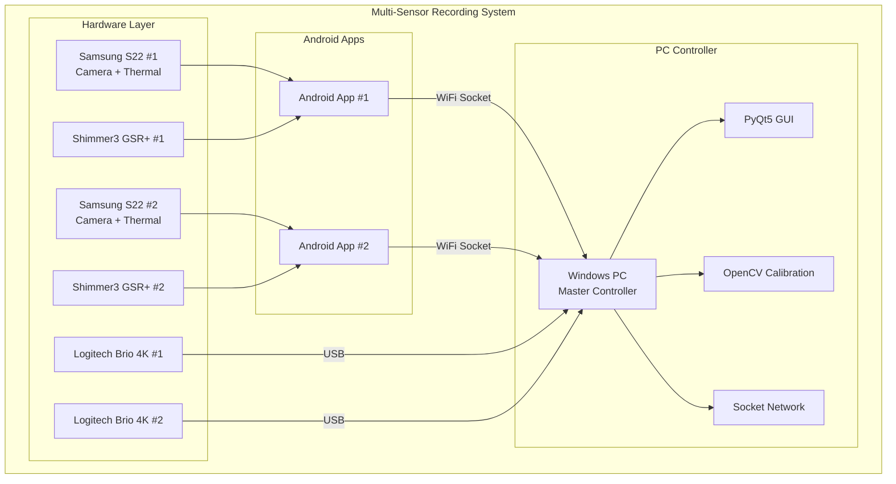
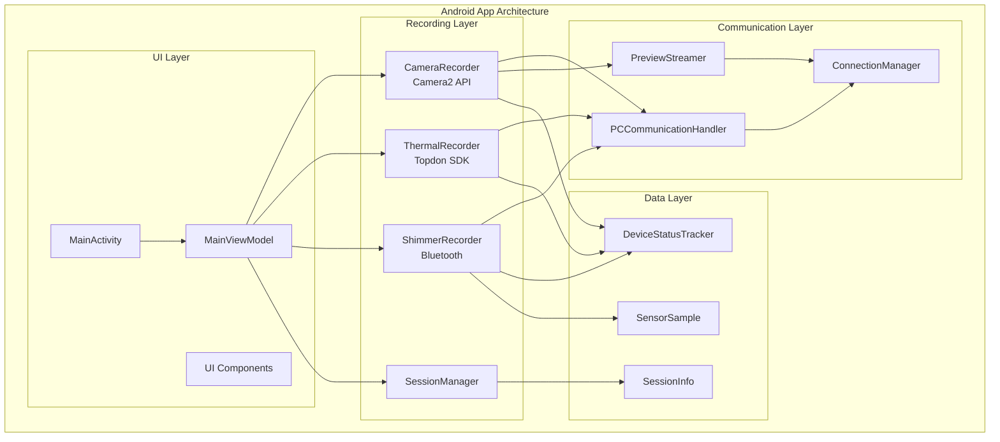
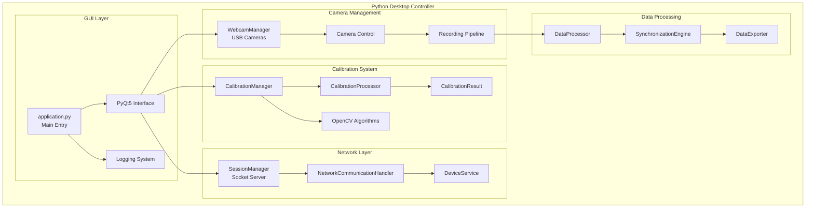
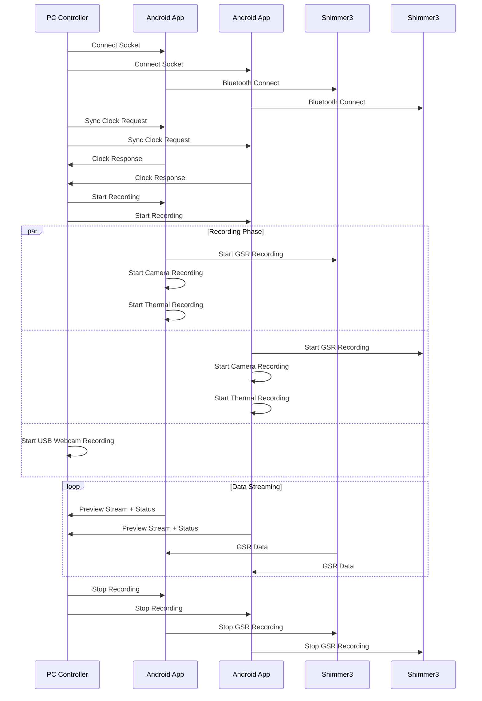
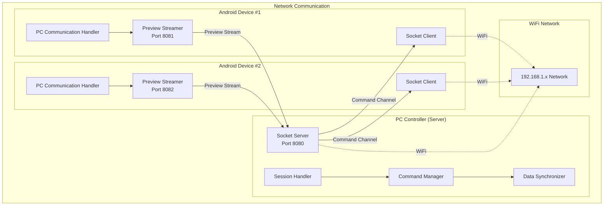
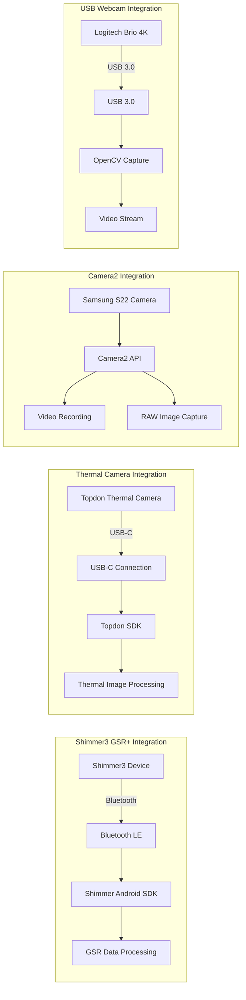

# Multi-Sensor Synchronized Recording System

A comprehensive system combining an Android mobile app with a Python desktop controller for synchronized multi-modal data recording.

## Quick Start

### Cross-Platform Setup

This project supports Windows, Linux, and macOS development environments.

**Automatic Setup (Recommended):**
```bash
python3 tools/development/setup.py
```

**Platform-Specific Setup:**

Windows:
```powershell
tools/development/setup_dev_env.ps1
```

Linux/macOS:
```bash
tools/development/setup.sh
```

### Prerequisites

- Java 11+ (for Android development)
- Conda/Miniconda (for Python environment management)
- Git (for version control)

### After Setup

```bash
# activate python environment
conda activate thermal-env

# run desktop application
./gradlew :PythonApp:runDesktopApp

# run python tests
./gradlew :PythonApp:runPythonTests

# build android apk
./gradlew :AndroidApp:assembleDebug
```

## 🎯 Project Overview

This system enables synchronized recording from multiple data sources:
- **2 Android smartphones** (Samsung S22) with attached thermal cameras
- **2 Logitech Brio 4K USB webcams** connected to a Windows PC
- **Shimmer3 GSR+ physiological sensors** for biometric data
- **Windows PC controller** acting as the master orchestrator

The system is designed for research applications, particularly for capturing synchronized video, thermal, and physiological data during stimulus presentation experiments.

## 🏗️ Architecture

### System Overview



### Android Application Architecture



### PC Application Architecture



### Monorepo Structure
```
project-root/
├── settings.gradle              # gradle settings: includes both modules
├── build.gradle                 # root gradle build configuration
├── .gitmodules                  # git submodules configuration
├── gradle/wrapper/              # gradle wrapper files
├── gradlew & gradlew.bat        # gradle wrapper scripts
├── AndroidApp/                  # android app module (kotlin + camera2, shimmer, etc.)
│   ├── build.gradle             # android module build configuration
│   ├── src/main/                # android source code
│   │   ├── AndroidManifest.xml  # android app manifest
│   │   ├── java/...             # kotlin source packages
│   │   └── res/...              # android resources
├── PythonApp/                   # python desktop app module (pyqt5, opencv)
│   ├── build.gradle             # python module build configuration
│   ├── src/                     # python source files
│   │   └── main.py              # entry-point script for pyqt5 app
├── external/                    # external dependencies (git submodules)
│   ├── IRCamera/                # thermal camera library (submodule)
│   ├── psychopy/                # psychopy library (submodule)
│   ├── pyshimmer/               # python shimmer sdk (submodule)
│   ├── Shimmer-Java-Android-API/ # android shimmer sdk (submodule)
│   ├── topdon-sdk/              # topdon thermal camera sdk (submodule)
│   └── TOPDON_EXAMPLE_SDK_USB_IR_1.3.7 3/ # legacy topdon sdk (local directory)
├── docs/                        # project documentation
├── changelog.md                 # project changelog
├── todo.md                      # task tracking
└── .gitignore                   # git ignore file
```

### Git Submodules

This project uses Git submodules to manage external dependencies from GitHub repositories:

| Submodule | Repository | Description |
|-----------|------------|-------------|
| `external/IRCamera` | [CoderCaiSL/IRCamera](https://github.com/CoderCaiSL/IRCamera.git) | Thermal camera library for Android |
| `external/psychopy` | [psychopy/psychopy](https://github.com/psychopy/psychopy.git) | Psychology experiment framework |
| `external/pyshimmer` | [seemoo-lab/pyshimmer](https://github.com/seemoo-lab/pyshimmer.git) | Python SDK for Shimmer sensors |
| `external/Shimmer-Java-Android-API` | [ShimmerEngineering/Shimmer-Java-Android-API](https://github.com/ShimmerEngineering/Shimmer-Java-Android-API.git) | Official Android SDK for Shimmer sensors |
| `external/topdon-sdk` | [buccancs/topdon-sdk](https://github.com/buccancs/topdon-sdk.git) | Topdon thermal camera SDK |

**Note**: The `TOPDON_EXAMPLE_SDK_USB_IR_1.3.7 3` directory contains legacy proprietary SDK files and remains as a local directory.

### Synchronization Flow



### Networking Architecture



### Data Collection Flow


### Individual Sensor Integration



#### Working with Submodules

```bash
# Clone the repository with all submodules
git clone --recursive https://github.com/your-repo/project.git

# If already cloned, initialize and update submodules
git submodule init
git submodule update

# Update all submodules to latest commits
git submodule update --remote

# Update a specific submodule
git submodule update --remote external/psychopy
```

## 🚀 Quick Start (Milestone 5 Enhanced)

### Prerequisites

1. **Java 17 or Java 21** (recommended for best compatibility)
   - ⚠️ **Important**: Java 24 may cause compatibility issues with Gradle 8.4
   - Download from [Eclipse Temurin](https://adoptium.net/) or [Oracle JDK](https://www.oracle.com/java/technologies/downloads/)

2. **Android Studio** (Arctic Fox or later)
   - Download from [developer.android.com](https://developer.android.com/studio)
   - Ensure Android SDK is properly configured
   - Set `ANDROID_HOME` environment variable

3. **Git** for version control

4. **Internet connection** (for Miniconda and dependency downloads)

> **Note**: Python installation is **no longer required** - the setup script will install Miniconda automatically!

### 🎯 One-Command Setup (Milestone 5.1)

**Enhanced Environment Bootstrapping Script:**
```powershell
# Complete automated setup (installs Miniconda, creates conda env, configures everything)
.\setup_dev_env.ps1

# Force reinstall everything (useful for clean setup)
.\setup_dev_env.ps1 -ForceReinstall

# Skip build validation for faster setup
.\setup_dev_env.ps1 -SkipValidation

# Verbose output for troubleshooting
.\setup_dev_env.ps1 -Verbose
```

This script automatically:
- ✅ Installs Miniconda (if not present)
- ✅ Creates conda environment from `environment.yml`
- ✅ Installs all Python dependencies (PyQt5, OpenCV, etc.)
- ✅ Configures Android SDK components
- ✅ Sets up Gradle wrapper
- ✅ Tests the complete build system

### 🔧 Build Automation (Milestone 5.1)

**New Gradle Tasks:**
```powershell
# Build everything (Android APK + Python tests)
.\gradlew assembleAll

# Setup/update conda environment
.\gradlew setupPythonEnv

# Run code quality checks (Android lint + Python flake8)
.\gradlew codeQuality

# Build release versions of both apps
.\gradlew buildRelease

# Package Python app as executable
.\gradlew pythonPackage

# Run Python tests only
.\gradlew pythonTest

# Run Python linting only
.\gradlew pythonLint
```

### 🐍 Python Environment (Conda-based)

The project now uses **Conda** for Python dependency management:

```powershell
# Activate the conda environment
conda activate thermal-env

# Verify environment
conda list

# Update environment from environment.yml
conda env update -f environment.yml
```

### 📱 IDE Setup

**Android Studio:**
1. Open Android Studio
2. Choose "Open an existing project"
3. Select the `AndroidApp` folder
4. Wait for Gradle sync to complete

**Python IDE (PyCharm/VSCode):**
1. Open the project root directory
2. Set Python interpreter to: `%USERPROFILE%\Miniconda3\envs\thermal-env\python.exe`
3. Mark `PythonApp/src` as Sources Root

## 🔄 CI/CD Pipeline (Milestone 5.2)

The project includes a comprehensive GitHub Actions CI/CD pipeline with:

### ✅ Automated Testing
- **Path-based job filtering** - Only runs relevant tests when files change
- **Matrix builds** - Tests across multiple OS and environments
- **Conda environment setup** - Uses the same environment.yml as development
- **Quality gates** - Code must pass linting and tests to merge

### 🚀 Build Automation
- **Android CI**: Build APK, run unit tests, lint checks
- **Python CI**: Conda environment, pytest, flake8, mypy
- **Integration testing**: End-to-end build validation
- **Security scanning**: Trivy vulnerability scanner

### 📦 Release Automation
- **Automatic releases** on main branch pushes
- **Multi-platform artifacts**: Android APK + Windows Python executable
- **Signed APKs** (when keystore secrets are configured)
- **Release notes** with build information

### 🔧 CI Status Badges


## 👥 Team Workflow (Milestone 5.1)

### Branching Strategy
- **Main branch**: Production-ready code
- **Develop branch**: Integration branch for features
- **Feature branches**: `feature/description` for individual tasks
- **Pull requests**: Required for all changes with code review

### Development Process
1. Create feature branch from develop
2. Make changes and test locally with `.\gradlew assembleAll`
3. Push changes - CI automatically runs tests
4. Create pull request to develop branch
5. Code review and CI checks must pass
6. Merge to develop, then to main for releases

### Code Quality Standards
- **Android**: Ktlint formatting, Android Lint checks
- **Python**: Black formatting, flake8 linting, mypy type checking
- **Pre-commit hooks**: Optional but recommended
- **Test coverage**: Aim for comprehensive test coverage

### Build Validation

After setup, validate your build environment:

```powershell
# Full validation with tests
.\scripts\validate-build.ps1

# Quick validation without tests
.\scripts\validate-build.ps1 -SkipTests

# Verbose output for debugging
.\scripts\validate-build.ps1 -Verbose
```

## 🔧 Development Workflow

### Build Commands

**Complete Project Build:**
```bash
# Build entire project (Android + Python)
.\gradlew build

# Clean and rebuild
.\gradlew clean build
```

**Android App Development:**
```bash
# Build debug APK
.\gradlew AndroidApp:assembleDebug

# Build release APK
.\gradlew AndroidApp:assembleRelease

# Install on connected device
.\gradlew AndroidApp:installDebug

# Build all variants
.\gradlew AndroidApp:assemble
```

**Python Desktop App:**
```bash
# Install Python dependencies
.\gradlew PythonApp:pipInstall

# Run desktop controller app
.\gradlew PythonApp:runDesktopApp

# Run calibration routines
.\gradlew PythonApp:runCalibration

# Test Python environment
.\gradlew PythonApp:testPythonSetup
```

### Testing Commands

**Android Testing:**
```bash
# Run unit tests
.\gradlew AndroidApp:testDebugUnitTest

# Run integration tests (requires emulator/device)
.\gradlew AndroidApp:connectedDebugAndroidTest

# Run lint checks
.\gradlew AndroidApp:lintDebug

# Generate test coverage report
.\gradlew AndroidApp:testDebugUnitTestCoverage
```

**Python Testing:**
```bash
# Run Python unit tests
.\gradlew PythonApp:runPythonTests

# Run tests with coverage
.\gradlew PythonApp:runPythonTestsWithCoverage

# Run code quality checks
.\gradlew PythonApp:runPythonLinting

# Run type checking
.\gradlew PythonApp:runPythonTypeCheck

# Format code
.\gradlew PythonApp:formatPythonCode
```

### Build Variants & Flavors

The Android app supports multiple build configurations:

**Build Types:**
- `debug` - Development build with debugging enabled
- `release` - Production build with optimizations
- `staging` - Pre-production build for testing

**Product Flavors:**
- `dev` - Development environment configuration
- `prod` - Production environment configuration

**Example Commands:**
```bash
# Build specific variant
.\gradlew AndroidApp:assembleDevDebug
.\gradlew AndroidApp:assembleProdRelease

# Test specific variant
.\gradlew AndroidApp:testDevDebugUnitTest
```

### CI/CD Pipeline

The project includes a comprehensive GitHub Actions pipeline:

**Automated Workflows:**
- **Android Build & Test** - Builds APK and runs unit tests
- **Android Integration Tests** - Runs UI tests on emulator
- **Python Cross-Platform Tests** - Tests on Windows, macOS, Linux
- **Build Validation** - Comprehensive environment validation
- **Security Scanning** - Vulnerability detection
- **Automated Releases** - Creates releases on main branch

**Pipeline Configuration:** `.github/workflows/ci-cd.yml`

**Local Pipeline Testing:**
```bash
# Run same validations as CI
.\scripts\validate-build.ps1

# Test specific components
.\scripts\validate-build.ps1 -SkipTests
```

## 🔧 Troubleshooting Guide

### Common Issues and Solutions

#### Java Version Issues

**Problem:** Build fails with "Unsupported class file major version" error
```
Solution: Use Java 17 or Java 21 instead of Java 24
1. Download Java 17 from Eclipse Temurin
2. Set JAVA_HOME environment variable
3. Update PATH to point to correct Java version
4. Verify: java -version
```

**Problem:** Gradle daemon issues with Java version
```
Solution: Stop Gradle daemon and restart
.\gradlew --stop
.\gradlew build
```

#### Python Environment Issues

**Problem:** Python dependencies installation fails
```
Solution: Check Python version and pip
1. Verify Python 3.8+: python --version
2. Update pip: python -m pip install --upgrade pip
3. Clear pip cache: pip cache purge
4. Retry: .\gradlew PythonApp:pipInstall
```

**Problem:** PyQt5 installation fails on Windows
```
Solution: Install Visual C++ redistributables
1. Download Microsoft Visual C++ Redistributable
2. Install and restart
3. Retry PyQt5 installation
```

#### Android Build Issues

**Problem:** Android SDK not found
```
Solution: Set Android SDK environment variables
1. Install Android Studio
2. Set ANDROID_HOME or ANDROID_SDK_ROOT
3. Add SDK tools to PATH
4. Verify: .\scripts\validate-build.ps1
```

**Problem:** Gradle sync fails in Android Studio
```
Solution: Clear caches and restart
1. File > Invalidate Caches and Restart
2. Delete .gradle folder in project root
3. Restart Android Studio
4. Sync project
```

#### Build Validation Failures

**Problem:** Build validation script fails
```
Solution: Run with verbose output for debugging
.\scripts\validate-build.ps1 -Verbose
Check build-validation.log for detailed errors
```

**Problem:** Tests fail during validation
```
Solution: Run tests individually to isolate issues
.\gradlew AndroidApp:testDebugUnitTest --info
.\gradlew PythonApp:runPythonTests --stacktrace
```

### Performance Optimization

#### Gradle Build Performance
```bash
# Enable parallel builds
echo "org.gradle.parallel=true" >> gradle.properties

# Increase memory allocation
echo "org.gradle.jvmargs=-Xmx4g" >> gradle.properties

# Enable build cache
echo "org.gradle.caching=true" >> gradle.properties
```

#### Android Studio Performance
```
1. Increase IDE memory: Help > Edit Custom VM Options
   -Xmx4g
2. Enable offline mode: File > Settings > Build > Gradle
3. Disable unnecessary plugins
```

### Environment Verification Commands

```bash
# Quick environment check
java -version
python --version
.\gradlew --version

# Comprehensive validation
.\scripts\validate-build.ps1

# Test specific components
.\gradlew AndroidApp:assembleDebug --dry-run
.\gradlew PythonApp:testPythonSetup
```

### Getting Help

1. **Check build logs:** Look for detailed error messages in console output
2. **Run validation:** Use `.\scripts\validate-build.ps1 -Verbose` for detailed diagnostics
3. **Check documentation:** Review `docs/` folder for architecture details
4. **GitHub Issues:** Report bugs with full error logs and environment details

## 🛠️ Technology Stack

### Android App (Kotlin)
- **Language:** Kotlin
- **UI:** Android Views with ViewBinding
- **Camera:** Camera2 API for 4K recording + RAW capture
- **Networking:** OkHttp for socket communication
- **Dependency Injection:** Hilt
- **Concurrency:** Kotlin Coroutines
- **Architecture:** Clean Architecture with Repository pattern

### Python Desktop App
- **Language:** Python 3.8+
- **UI Framework:** PyQt5 5.15.7
- **Computer Vision:** OpenCV 4.8.0.74
- **Numerical Computing:** NumPy 1.24.3
- **Networking:** WebSockets, Requests
- **Image Processing:** Pillow

### Build System
- **Primary:** Gradle 8.4 with multi-project setup
- **Android Plugin:** 8.1.2
- **Python Integration:** ru.vyarus.use-python plugin 3.0.0

## 📱 Android App Features

### Current Implementation (Milestone 1)
- ✅ Project structure and build configuration
- ✅ Essential permissions and manifest setup
- ✅ Dependency injection setup (Hilt)
- ✅ Camera2 API dependencies

### Planned Features (Milestone 2+)
- 🔄 4K RGB video recording with RAW image capture
- 🔄 Thermal camera integration (Topdon SDK)
- 🔄 Shimmer3 GSR+ sensor Bluetooth communication
- 🔄 Real-time preview streaming to PC
- 🔄 Socket-based remote control interface
- 🔄 Local data storage and session management

## 🖥️ Desktop Controller Features

### Current Implementation (Milestone 1)
- ✅ PyQt5 GUI with device status monitoring
- ✅ Recording control interface (start/stop/calibration)
- ✅ System logging and status updates
- ✅ Extensible architecture for sensor integration

### Planned Features (Milestone 3+)
- 🔄 Real device communication protocols
- 🔄 USB webcam capture and recording
- 🔄 Camera calibration algorithms (intrinsic/extrinsic)
- 🔄 Stimulus presentation system
- 🔄 Data synchronization and export tools

## 🔧 Configuration

### Python Dependencies
The Python environment is managed automatically by Gradle. Dependencies are specified in `PythonApp/build.gradle`:

```gradle
python {
    pip 'pyqt5:5.15.7'
    pip 'opencv-python:4.8.0.74'
    pip 'numpy:1.24.3'
    pip 'requests:2.31.0'
    pip 'websockets:11.0.3'
    pip 'pillow:10.0.0'
}
```

### Android Configuration
Key Android settings in `AndroidApp/build.gradle`:
- **Compile SDK:** 34
- **Min SDK:** 24 (Android 7.0)
- **Target SDK:** 34
- **Namespace:** `com.multisensor.recording`

## 🧪 Testing

### Running Tests
```bash
# Android unit tests
./gradlew :AndroidApp:test

# Android instrumented tests
./gradlew :AndroidApp:connectedAndroidTest

# Python environment test
./gradlew :PythonApp:testPythonSetup
```

## 📋 Development Guidelines

### Code Style
- **Kotlin:** Follow official Kotlin coding conventions
- **Python:** Follow PEP 8 style guide
- **Comments:** Minimal commenting, focus on self-documenting code
- **Cognitive Complexity:** Keep under 15 per function

### Git Workflow
- Use feature branches for new development
- Update `changelog.md` for all significant changes
- Update `todo.md` for incomplete work or future ideas
- Keep commits atomic and well-described

### Documentation
- Always maintain up-to-date documentation
- Generate Mermaid diagrams for architectural changes
- Update README.md for setup or workflow changes

## 🚨 Troubleshooting

### Common Issues

**Gradle Sync Fails:**
- Ensure Python is installed and in PATH
- Check internet connection for dependency downloads
- Try `./gradlew clean` and sync again

**Python Module Import Errors:**
- Run `./gradlew :PythonApp:pipInstall` to install dependencies
- Verify Python version is 3.8 or higher
- Check that virtual environment is created in `.gradle/python/`

**Android Build Errors:**
- Ensure Android SDK is properly configured
- Check that `local.properties` points to correct SDK location
- Verify all required Android SDK components are installed

**IDE Integration Issues:**
- Install Python plugin in Android Studio
- Ignore "No Python interpreter" warnings (expected)
- Use Gradle tasks to run Python code instead of IDE run configurations

## 📚 Documentation

### Data Management
- **[Data Storage Guide](docs/DATA_STORAGE_QUICK_REFERENCE.md)** - Quick reference for finding and understanding your recordings
- **[Data Structure Documentation](docs/DATA_STRUCTURE_DOCUMENTATION.md)** - Complete technical documentation of file organization and schemas
- **[File Naming Standards](docs/FILE_NAMING_STANDARDS.md)** - Naming conventions and organization guidelines for developers
- **[Data Management Overview](docs/README.md)** - Complete guide to the data management system

### Architecture & Implementation  
- **Architecture:** See `docs/markdown/architecture.md`
- **Milestones:** See `docs/markdown/` for detailed implementation guides
- **Changelog:** See `changelog.md` for version history
- **TODO:** See `todo.md` for pending tasks and future work

### Data Validation
```bash
# Validate all recorded sessions
python tools/validate_data_schemas.py --all-sessions

# Validate specific session
python tools/validate_data_schemas.py --session PythonApp/recordings/session_20250731_143022

# Check data schemas
python tools/validate_data_schemas.py --check-schema docs/schemas/session_metadata_schema.json
```

## 🤝 Contributing

1. Fork the repository
2. Create a feature branch (`git checkout -b feature/amazing-feature`)
3. Make your changes
4. Update documentation as needed
5. Commit your changes (`git commit -m 'Add amazing feature'`)
6. Push to the branch (`git push origin feature/amazing-feature`)
7. Open a Pull Request

## 📄 License

This project is licensed under the MIT License - see the LICENSE file for details.

## 🙏 Acknowledgments

- Built for multi-sensor research applications
- Inspired by modern Android development practices
- Leverages proven Python scientific computing stack
- Designed for Windows development environments

---

**Status:** Milestone 1 Complete ✅  
**Next:** Milestone 2.1 - Android Application Implementation  
**Last Updated:** 2025-07-28
