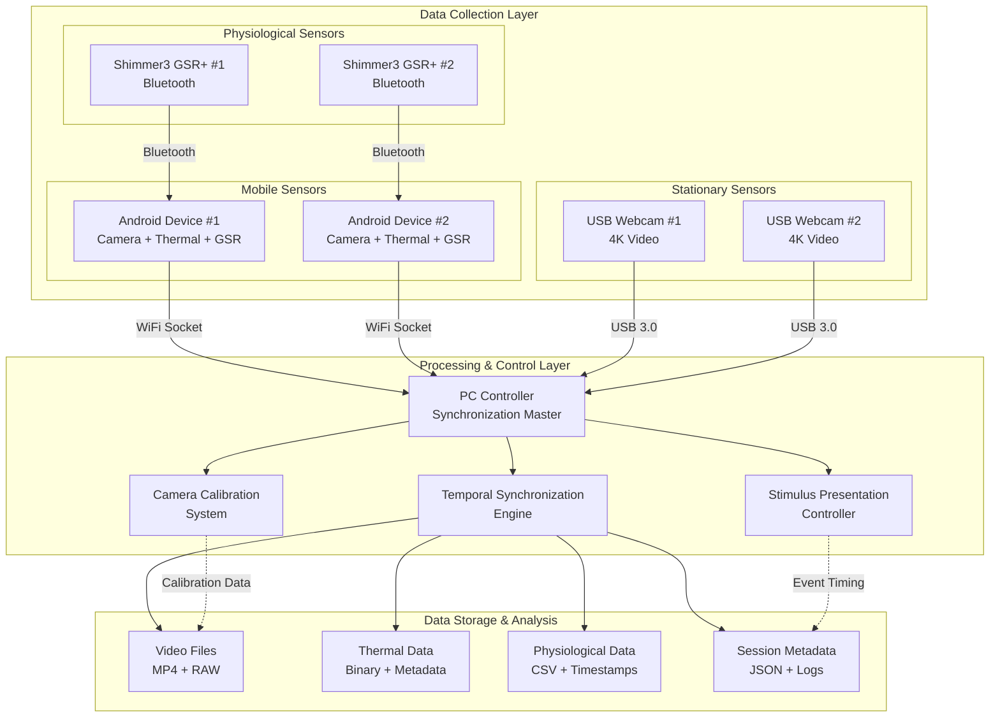
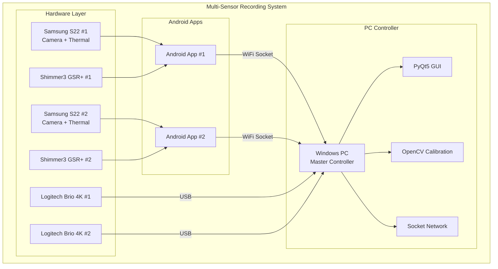
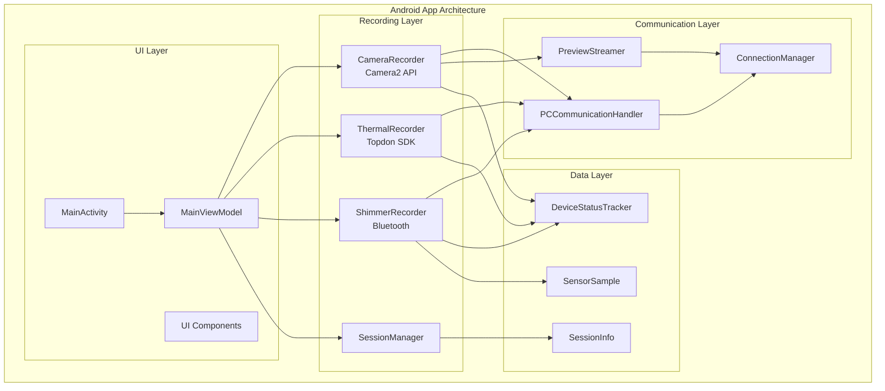
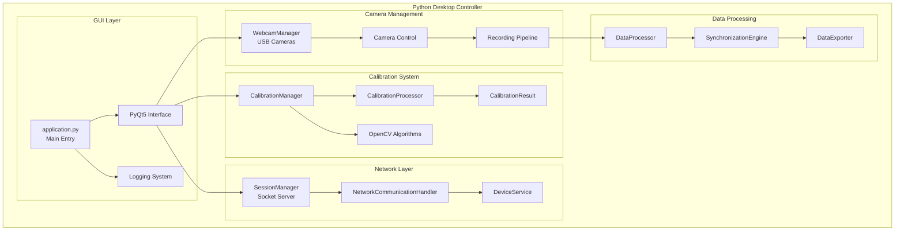
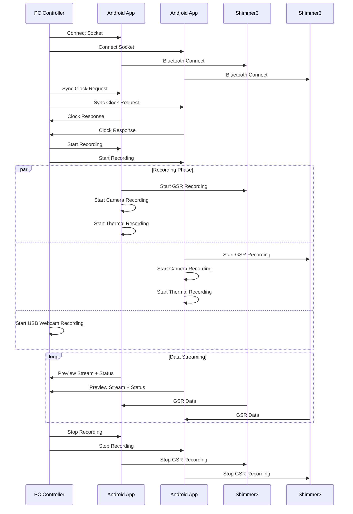
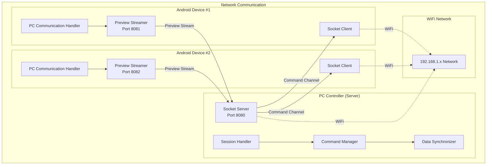
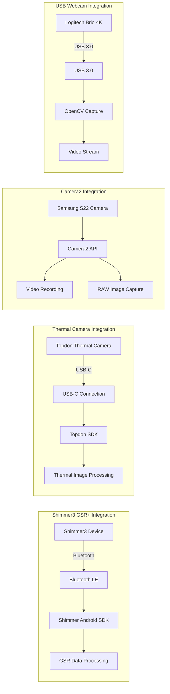

# Multi-Sensor Synchronized Recording System

A comprehensive research platform that orchestrates synchronized data collection from multiple sensor modalities including smartphone cameras, thermal imaging, USB webcams, and physiological sensors. The system combines an Android mobile application with a Python desktop controller to enable precise temporal synchronization across all data sources for multi-modal research applications.

## Project Overview

This system enables synchronized recording from multiple data sources for research applications, particularly useful for capturing synchronized video, thermal, and physiological data during stimulus presentation experiments:

- **2 Android smartphones** (Samsung S22) with attached thermal cameras for mobile data collection
- **2 Logitech Brio 4K USB webcams** connected to a Windows PC for stationary high-quality video capture
- **Shimmer3 GSR+ physiological sensors** for biometric data collection via Bluetooth
- **Windows PC controller** acting as the master orchestrator and data synchronization hub

The architecture provides researchers with a robust platform for multi-modal data collection with microsecond-precision synchronization across all sensors.

## Quick Start

### Prerequisites

- **Java 17 or Java 21** (recommended for optimal compatibility)
- **Conda/Miniconda** for Python environment management
- **Android Studio** (Arctic Fox or later) for Android development
- **Git** for version control

> **Note**: Python installation is **not required** - the setup script automatically installs Miniconda and configures the environment.

### Automated Setup

The project includes automated setup scripts that handle the complete environment configuration:

```bash
# Complete automated setup (recommended)
python3 tools/development/setup.py

# Platform-specific setup
# Windows:
tools/development/setup_dev_env.ps1

# Linux/macOS:
tools/development/setup.sh
```

These scripts automatically install Miniconda, create the conda environment, install all dependencies, configure Android SDK components, and validate the complete build system.

### Quick Build Commands

```bash
# Activate Python environment
conda activate thermal-env

# Build entire project
./gradlew build

# Run desktop application
./gradlew :PythonApp:runDesktopApp

# Build Android APK
./gradlew :AndroidApp:assembleDebug

# Run tests
./gradlew :PythonApp:runPythonTests
```

## System Architecture

The system employs a distributed architecture where multiple sensor nodes coordinate with a central controller to achieve synchronized data collection across heterogeneous sensor types.

### Complete Data Flow Architecture



### Hardware Integration Overview



### Android Application Architecture



### PC Application Architecture



### Monorepo Structure
```
project-root/
├── settings.gradle              # gradle settings: includes both modules
├── build.gradle                 # root gradle build configuration
├── .gitmodules                  # git submodules configuration
├── gradle/wrapper/              # gradle wrapper files
├── gradlew & gradlew.bat        # gradle wrapper scripts
├── AndroidApp/                  # android app module (kotlin + camera2, shimmer, etc.)
│   ├── build.gradle             # android module build configuration
│   ├── src/main/                # android source code
│   │   ├── AndroidManifest.xml  # android app manifest
│   │   ├── java/...             # kotlin source packages
│   │   └── res/...              # android resources
├── PythonApp/                   # python desktop app module (pyqt5, opencv)
│   ├── build.gradle             # python module build configuration
│   ├── src/                     # python source files
│   │   └── main.py              # entry-point script for pyqt5 app
├── external/                    # external dependencies (git submodules)
│   ├── IRCamera/                # thermal camera library (submodule)
│   ├── psychopy/                # psychopy library (submodule)
│   ├── pyshimmer/               # python shimmer sdk (submodule)
│   ├── Shimmer-Java-Android-API/ # android shimmer sdk (submodule)
│   ├── topdon-sdk/              # topdon thermal camera sdk (submodule)
│   └── TOPDON_EXAMPLE_SDK_USB_IR_1.3.7 3/ # legacy topdon sdk (local directory)
├── docs/                        # project documentation
├── changelog.md                 # project changelog
├── todo.md                      # task tracking
└── .gitignore                   # git ignore file
```

### Git Submodules

This project uses Git submodules to manage external dependencies from GitHub repositories:

| Submodule | Repository | Description |
|-----------|------------|-------------|
| `external/IRCamera` | [CoderCaiSL/IRCamera](https://github.com/CoderCaiSL/IRCamera.git) | Thermal camera library for Android |
| `external/psychopy` | [psychopy/psychopy](https://github.com/psychopy/psychopy.git) | Psychology experiment framework |
| `external/pyshimmer` | [seemoo-lab/pyshimmer](https://github.com/seemoo-lab/pyshimmer.git) | Python SDK for Shimmer sensors |
| `external/Shimmer-Java-Android-API` | [ShimmerEngineering/Shimmer-Java-Android-API](https://github.com/ShimmerEngineering/Shimmer-Java-Android-API.git) | Official Android SDK for Shimmer sensors |
| `external/topdon-sdk` | [buccancs/topdon-sdk](https://github.com/buccancs/topdon-sdk.git) | Topdon thermal camera SDK |

**Note**: The `TOPDON_EXAMPLE_SDK_USB_IR_1.3.7 3` directory contains legacy proprietary SDK files and remains as a local directory.

### Synchronization Flow



### Networking Architecture



### Data Collection Flow


### Individual Sensor Integration



#### Working with Submodules

```bash
# Clone the repository with all submodules
git clone --recursive https://github.com/your-repo/project.git

# If already cloned, initialize and update submodules
git submodule init
git submodule update

# Update all submodules to latest commits
git submodule update --remote

# Update a specific submodule
git submodule update --remote external/psychopy
```

## Development Workflow

### Build Commands

The project uses Gradle as the primary build system with support for both Android and Python components:

```bash
# Build entire project (Android + Python)
./gradlew build

# Clean and rebuild everything
./gradlew clean build

# Build specific components
./gradlew AndroidApp:assembleDebug      # Android debug APK
./gradlew AndroidApp:assembleRelease    # Android release APK
./gradlew AndroidApp:installDebug       # Install on connected device

# Python environment management
./gradlew PythonApp:pipInstall          # Install Python dependencies
./gradlew PythonApp:runDesktopApp       # Run desktop controller
./gradlew PythonApp:runCalibration      # Run calibration routines
```

### Testing Commands

```bash
# Android testing
./gradlew AndroidApp:testDebugUnitTest         # Unit tests
./gradlew AndroidApp:connectedDebugAndroidTest # Integration tests (requires device)
./gradlew AndroidApp:lintDebug                 # Lint checks

# Python testing  
./gradlew PythonApp:runPythonTests             # Python unit tests
./gradlew PythonApp:runPythonTestsWithCoverage # Tests with coverage
./gradlew PythonApp:runPythonLinting           # Code quality checks
./gradlew PythonApp:formatPythonCode           # Format code
```

### Build Variants

The Android app supports multiple build configurations for different environments:

- **Debug**: Development build with debugging enabled
- **Release**: Production build with optimizations  
- **Staging**: Pre-production build for testing

Example commands for specific variants:
```bash
./gradlew AndroidApp:assembleDevDebug
./gradlew AndroidApp:assembleProdRelease
./gradlew AndroidApp:testDevDebugUnitTest
```

## Technology Stack

### Android Application (Kotlin)
- **Language**: Kotlin with Android Views and ViewBinding
- **Camera**: Camera2 API for 4K recording and RAW capture
- **Networking**: OkHttp for socket communication
- **Dependency Injection**: Hilt
- **Concurrency**: Kotlin Coroutines
- **Architecture**: Clean Architecture with Repository pattern

### Python Desktop Application
- **Language**: Python 3.8+ with PyQt5 5.15.7 for GUI
- **Computer Vision**: OpenCV 4.8.0.74 for camera calibration and processing
- **Numerical Computing**: NumPy 1.24.3 for data processing
- **Networking**: WebSockets and Requests for communication
- **Image Processing**: Pillow for image manipulation

### Build System
- **Primary Build Tool**: Gradle 8.4 with multi-project setup
- **Android Plugin**: 8.1.2 for Android development
- **Python Integration**: ru.vyarus.use-python plugin 3.0.0 for Python environment management

## Key Features

### Android Application Features
- 4K RGB video recording with simultaneous RAW image capture
- Thermal camera integration using Topdon SDK for thermal imaging
- Shimmer3 GSR+ sensor communication via Bluetooth for physiological data
- Real-time preview streaming to PC controller for monitoring
- Socket-based remote control interface for synchronized operation
- Local data storage with comprehensive session management

### Desktop Controller Features  
- PyQt5 GUI with real-time device status monitoring across all sensors
- Comprehensive recording control interface with start/stop/calibration functions
- USB webcam capture and recording for stationary high-quality video
- Advanced camera calibration algorithms for intrinsic and extrinsic parameters
- Stimulus presentation system for controlled experimental paradigms
- Data synchronization and export tools for multi-modal data analysis

## Configuration

### Python Environment
The Python environment uses Conda for dependency management. Dependencies are automatically configured through the setup scripts, but can also be managed manually:

```bash
# Activate the conda environment
conda activate thermal-env

# Update environment from environment.yml
conda env update -f environment.yml

# Verify installation
conda list
```

### Android Configuration
Key Android build settings:
- **Compile SDK**: 34 (Android 14)
- **Min SDK**: 24 (Android 7.0) 
- **Target SDK**: 34 (Android 14)
- **Namespace**: `com.multisensor.recording`

## Troubleshooting

### Common Issues and Solutions

**Java Version Compatibility**
- Use Java 17 or Java 21 for optimal compatibility
- Java 24 may cause issues with Gradle 8.4
- Set `JAVA_HOME` environment variable correctly

**Python Environment Issues**  
- Ensure Python 3.8+ is available
- Use the automated setup scripts for conda environment creation
- Check that all dependencies are installed with `conda list`

**Android Build Issues**
- Ensure Android SDK is properly configured
- Set `ANDROID_HOME` or `ANDROID_SDK_ROOT` environment variable
- Verify required Android SDK components are installed

**Build Validation**
Run the validation script for comprehensive environment checking:
```bash
./scripts/validate-build.ps1 -Verbose
```

## Documentation

### Architecture and Implementation
- **Architecture Details**: See `docs/architecture/` for detailed system design
- **API Documentation**: Generated docs available in `docs/generated_docs/`
- **Development Guidelines**: See `docs/development/` for coding standards

### Data Management
- **[Data Storage Guide](docs/DATA_STORAGE_QUICK_REFERENCE.md)**: Quick reference for data organization
- **[Data Structure Documentation](docs/DATA_STRUCTURE_DOCUMENTATION.md)**: Complete technical documentation
- **[File Naming Standards](docs/FILE_NAMING_STANDARDS.md)**: Naming conventions for consistency

### Android App (Kotlin)
- **Language:** Kotlin
- **UI:** Android Views with ViewBinding
- **Camera:** Camera2 API for 4K recording + RAW capture
- **Networking:** OkHttp for socket communication
- **Dependency Injection:** Hilt
- **Concurrency:** Kotlin Coroutines
- **Architecture:** Clean Architecture with Repository pattern

### Python Desktop App
- **Language:** Python 3.8+
- **UI Framework:** PyQt5 5.15.7
- **Computer Vision:** OpenCV 4.8.0.74
- **Numerical Computing:** NumPy 1.24.3
- **Networking:** WebSockets, Requests
- **Image Processing:** Pillow

### Build System
- **Primary:** Gradle 8.11.1 with multi-project setup
- **Android Plugin:** 8.7.3
- **Kotlin:** 2.1.0
- **Python Integration:** ru.vyarus.use-python plugin 3.0.0

## 📱 Android App Features

### Current Implementation (Milestone 1)
- ✅ Project structure and build configuration
- ✅ Essential permissions and manifest setup
- ✅ Dependency injection setup (Hilt)
- ✅ Camera2 API dependencies

### Planned Features (Milestone 2+)
- 🔄 4K RGB video recording with RAW image capture
- 🔄 Thermal camera integration (Topdon SDK)
- 🔄 Shimmer3 GSR+ sensor Bluetooth communication
- 🔄 Real-time preview streaming to PC
- 🔄 Socket-based remote control interface
- 🔄 Local data storage and session management

## 🖥️ Desktop Controller Features

### Current Implementation (Milestone 1)
- ✅ PyQt5 GUI with device status monitoring
- ✅ Recording control interface (start/stop/calibration)
- ✅ System logging and status updates
- ✅ Extensible architecture for sensor integration

### Planned Features (Milestone 3+)
- 🔄 Real device communication protocols
- 🔄 USB webcam capture and recording
- 🔄 Camera calibration algorithms (intrinsic/extrinsic)
- 🔄 Stimulus presentation system
- 🔄 Data synchronization and export tools

## 🔧 Configuration

### Python Dependencies
The Python environment is managed automatically by Gradle. Dependencies are specified in `PythonApp/build.gradle`:

```gradle
python {
    pip 'pyqt5:5.15.7'
    pip 'opencv-python:4.8.0.74'
    pip 'numpy:1.24.3'
    pip 'requests:2.31.0'
    pip 'websockets:11.0.3'
    pip 'pillow:10.0.0'
}
```

### Android Configuration
Key Android settings in `AndroidApp/build.gradle`:
- **Compile SDK:** 34
- **Min SDK:** 24 (Android 7.0)
- **Target SDK:** 34
- **Namespace:** `com.multisensor.recording`

## 🧪 Testing

### Running Tests
```bash
# Validate recorded sessions
python tools/validate_data_schemas.py --all-sessions

# Check specific session  
python tools/validate_data_schemas.py --session PythonApp/recordings/session_20250731_143022
```

## Contributing

I welcome contributions to improve the multi-sensor recording system:

1. Fork the repository and create a feature branch
2. Make your changes following the established coding standards
3. Update documentation as needed for any new features
4. Ensure all tests pass and add new tests for new functionality
5. Submit a pull request with a clear description of changes

### Development Standards
- **Kotlin**: Follow official Kotlin coding conventions
- **Python**: Adhere to PEP 8 style guidelines  
- **Git**: Use descriptive commit messages and feature branches
- **Documentation**: Keep README and docs up-to-date with changes

## License

This project is licensed under the MIT License. See the LICENSE file for complete details.

## Acknowledgments

This multi-sensor recording system is designed for advanced research applications requiring precise temporal synchronization across diverse sensor modalities. The architecture leverages modern Android development practices and the proven Python scientific computing ecosystem to provide a robust platform for multi-modal data collection in experimental research environments.
