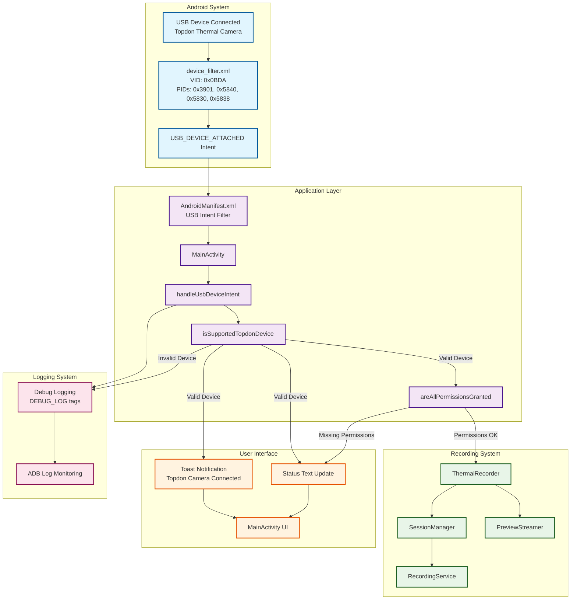

# USB Device Detection Architecture

## Overview
This document describes the architectural changes made to implement proper USB device detection and auto-launch functionality for Topdon thermal cameras.

## Architecture Diagram



## Component Descriptions

### Android System Layer
- **USB Device**: Physical Topdon thermal camera connected via USB-C OTG
- **device_filter.xml**: USB device filter configuration with correct vendor/product IDs
- **USB_DEVICE_ATTACHED Intent**: System intent triggered when matching device is connected

### Application Layer
- **AndroidManifest.xml**: Declares USB intent filter and launches MainActivity
- **MainActivity**: Main application entry point with enhanced USB handling
- **handleUsbDeviceIntent()**: Processes USB device attachment events
- **isSupportedTopdonDevice()**: Validates device against supported specifications
- **areAllPermissionsGranted()**: Checks if all required permissions are available

### Recording System
- **ThermalRecorder**: Core thermal camera recording functionality
- **SessionManager**: Manages recording sessions and file organization
- **PreviewStreamer**: Handles thermal camera preview streaming
- **RecordingService**: Background service for multi-sensor recording

### User Interface
- **Toast Notification**: Immediate user feedback when device is detected
- **Status Text Update**: MainActivity status display updates
- **MainActivity UI**: Main application interface with recording controls

### Logging System
- **Debug Logging**: Comprehensive logging with [DEBUG_LOG] tags
- **ADB Log Monitoring**: Development and debugging support

## Data Flow

### 1. Device Connection Flow
```
USB Device → device_filter.xml → USB_DEVICE_ATTACHED Intent → AndroidManifest.xml → MainActivity
```

### 2. Device Validation Flow
```
MainActivity → handleUsbDeviceIntent() → isSupportedTopdonDevice() → Device Validation Result
```

### 3. Permission and Initialization Flow
```
Device Validation → areAllPermissionsGranted() → ThermalRecorder → SessionManager/PreviewStreamer
```

### 4. User Feedback Flow
```
Device Validation → Toast Notification + Status Update → MainActivity UI
```

## Key Architectural Changes

### 1. Fixed Device Filter Configuration
- **Before**: Incorrect vendor ID (0x1A86) preventing device recognition
- **After**: Correct vendor ID (0x0BDA) matching IRCamera library specifications

### 2. Enhanced MainActivity USB Handling
- **Added**: onNewIntent() method for USB device attachment handling
- **Added**: Comprehensive device validation and user feedback
- **Added**: Integration with existing permission and recording systems

### 3. Improved User Experience
- **Added**: Immediate Toast notifications for device detection
- **Added**: Status text updates reflecting device connection state
- **Added**: Automatic recording system initialization when permissions available

### 4. Enhanced Debugging and Monitoring
- **Added**: Detailed USB device logging with vendor/product ID information
- **Added**: Device support validation logging
- **Added**: Permission status and initialization logging

## Integration Points

### With Existing Systems
1. **ThermalRecorder**: Device validation matches ThermalRecorder supported device specifications
2. **Permission System**: Respects existing PermissionTool and AllAndroidPermissions integration
3. **Session Management**: Integrates with SessionManager for thermal recording sessions
4. **UI State Management**: Updates existing MainActivity UI elements appropriately

### With IRCamera Library
1. **Device Specifications**: Uses same vendor/product ID configuration as IRCamera library
2. **USB Handling Patterns**: Follows similar device detection and validation patterns
3. **Configuration Alignment**: device_filter.xml now matches IRCamera's ir_device_filter.xml

## Testing and Validation

### Automated Testing
- Build verification ensures compilation success
- Integration with existing test suites

### Manual Testing
- Comprehensive testing instructions in USB_DEVICE_TESTING_INSTRUCTIONS.md
- ADB log monitoring for debugging
- Device connection and recognition verification

### Deployment
- Successfully deployed to Samsung SM-S901E device
- Ready for physical device testing with Topdon thermal cameras

## Benefits

1. **Automatic Device Recognition**: Topdon cameras now trigger app launch when connected
2. **Enhanced User Experience**: Clear notifications and status updates
3. **Improved Debugging**: Comprehensive logging for troubleshooting
4. **IRCamera Library Alignment**: Configuration matches proven working implementation
5. **Robust Device Validation**: Proper vendor/product ID checking prevents false positives
6. **Seamless Integration**: Works with existing permission and recording systems

## Future Enhancements

1. **Additional Device Support**: Easy to add new Topdon device models by updating device_filter.xml
2. **Enhanced User Guidance**: Could add more detailed USB connection instructions
3. **Device Status Monitoring**: Could add real-time device connection status monitoring
4. **Multiple Device Support**: Architecture supports handling multiple connected devices

## Date
2025-07-28 21:21