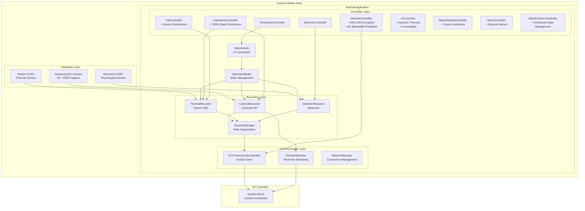
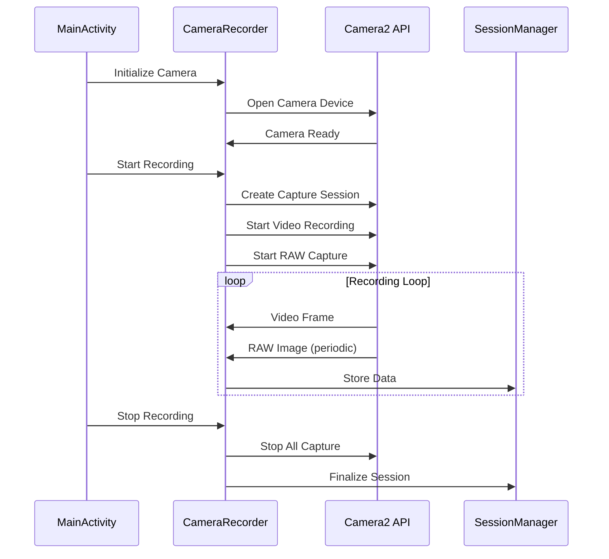
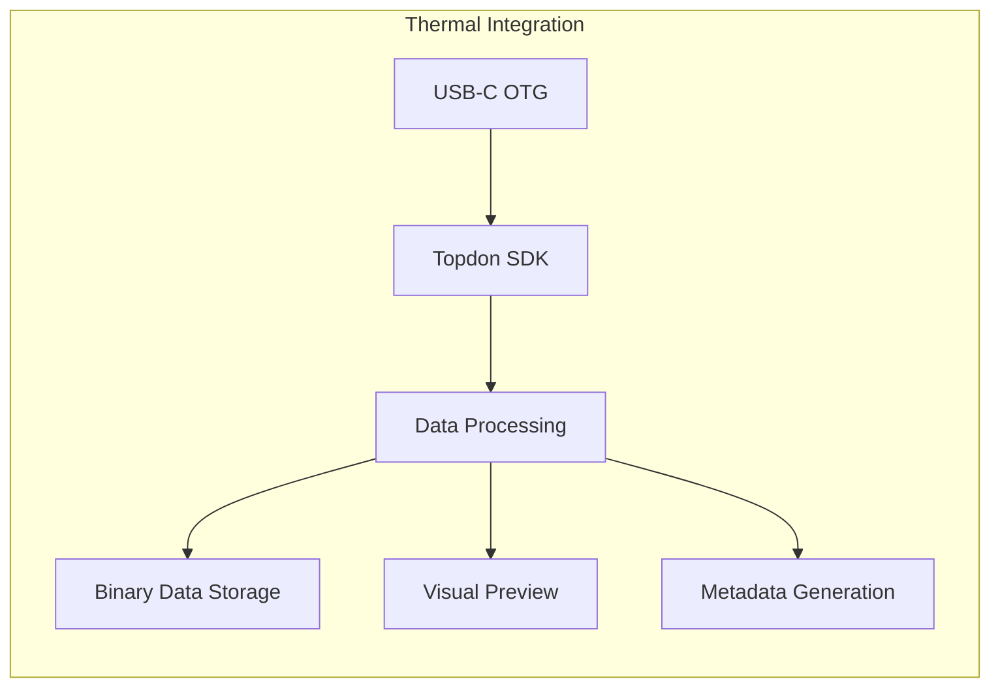
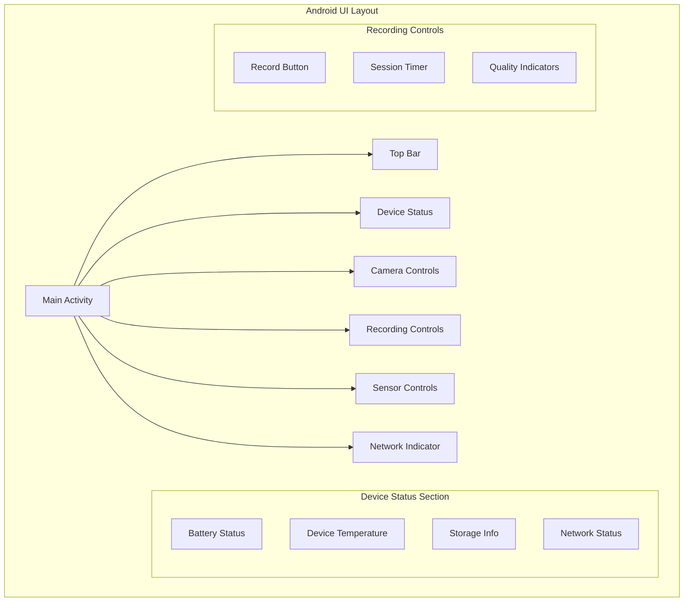
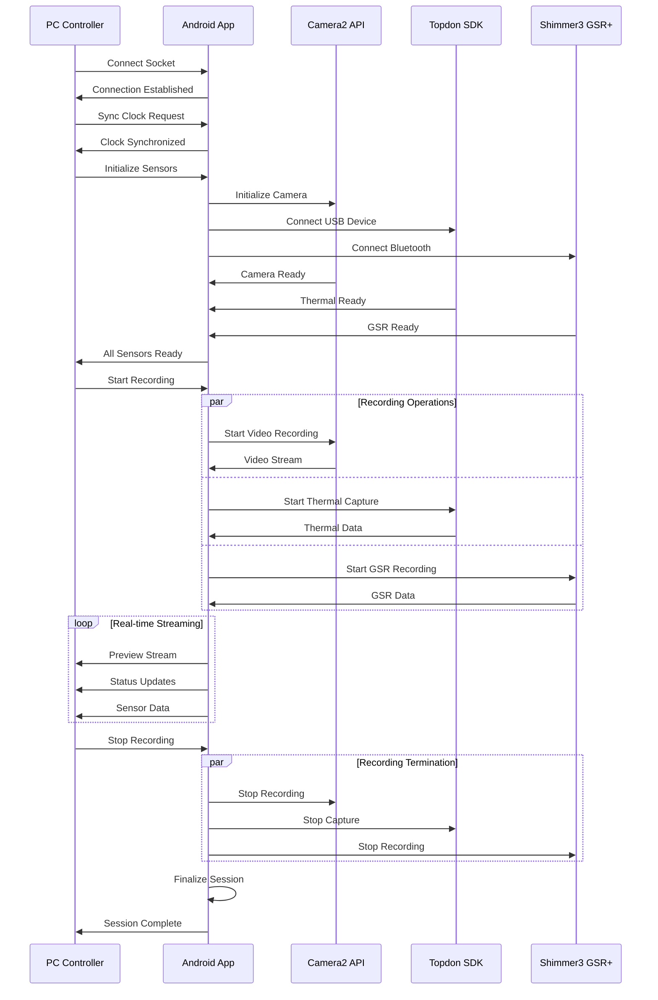

# Android Mobile Application: Comprehensive Report
## Multi-Sensor Recording System - Mobile Data Collection Node

### Master's Thesis Report: Android Mobile Application Component

---

## Table of Contents

1. [Executive Summary](#executive-summary)
2. [Introduction and Overview](#introduction-and-overview)
3. [System Architecture](#system-architecture)
   - [3.1 Architectural Overview](#31-architectural-overview)
   - [3.2 Core Features](#32-core-features)
   - [3.3 Enhanced Controller Architecture](#33-enhanced-controller-architecture)
   - [3.4 Distributed Architecture](#34-distributed-architecture)
4. [Technical Implementation](#technical-implementation)
   - [4.1 Multi-Sensor Data Collection](#41-multi-sensor-data-collection)
   - [4.2 Communication Protocols](#42-communication-protocols)
   - [4.3 Data Processing Pipeline](#43-data-processing-pipeline)
   - [4.4 Security and Privacy Implementation](#44-security-and-privacy-implementation)
5. [User Interface Design](#user-interface-design)
   - [5.1 Main Activity Interface](#51-main-activity-interface)
   - [5.2 Fragment-based Architecture](#52-fragment-based-architecture)
   - [5.3 Enhanced Accessibility Features](#53-enhanced-accessibility-features)
6. [Data Management](#data-management)
   - [6.1 Data Flow Architecture](#61-data-flow-architecture)
   - [6.2 Storage Organization](#62-storage-organization)
   - [6.3 Quality Assurance](#63-quality-assurance)
7. [Performance Characteristics](#performance-characteristics)
   - [7.1 System Performance](#71-system-performance)
   - [7.2 Resource Utilization](#72-resource-utilization)
8. [Development and Testing](#development-and-testing)
   - [8.1 Testing Framework](#81-testing-framework)
   - [8.2 Build Configuration](#82-build-configuration)
9. [Deployment and Configuration](#deployment-and-configuration)
   - [9.1 Installation Requirements](#91-installation-requirements)
   - [9.2 Configuration Management](#92-configuration-management)
10. [User Guide](#user-guide)
    - [10.1 Quick Start Guide](#101-quick-start-guide)
    - [10.2 Recording Procedures](#102-recording-procedures)
    - [10.3 Sensor Configuration](#103-sensor-configuration)
    - [10.4 Calibration Procedures](#104-calibration-procedures)
11. [Protocol Specifications](#protocol-specifications)
    - [11.1 Communication Protocols](#111-communication-protocols)
    - [11.2 Data Formats](#112-data-formats)
    - [11.3 Error Handling](#113-error-handling)
12. [Troubleshooting and Support](#troubleshooting-and-support)
    - [12.1 Common Issues](#121-common-issues)
    - [12.2 Advanced Features](#122-advanced-features)
13. [Research Applications](#research-applications)
    - [13.1 Best Practices](#131-best-practices)
    - [13.2 Quality Assurance Guidelines](#132-quality-assurance-guidelines)
14. [Conclusions and Future Work](#conclusions-and-future-work)
15. [References and Support](#references-and-support)

---

## Executive Summary

The Android Mobile Application serves as a sophisticated **distributed mobile data collection node** within the Multi-Sensor Recording System, representing a significant advancement in research instrumentation for contactless physiological measurement. This comprehensive report provides complete technical documentation, user guidance, and protocol specifications for the Android component of the multi-sensor recording system developed for contactless galvanic skin response (GSR) prediction research.

### Key Achievements

The Android application successfully integrates three critical sensor modalities:
- **Phone's built-in camera**: 4K video recording with RAW image capture capabilities
- **Attached thermal camera**: Topdon TC001 via USB-C OTG for thermal imaging
- **Connected Shimmer physiological sensor**: Shimmer3 GSR+ via Bluetooth for physiological measurement

The application operates as a coordinated node in a distributed architecture, communicating with a PC controller via WiFi socket connections to enable precise temporal synchronization across all data sources with microsecond precision.

### Innovation Highlights

The system introduces several significant technical innovations:
- **Hybrid star-mesh topology** combining centralized coordination with distributed resilience
- **Advanced multi-modal synchronization** achieving microsecond precision across wireless devices
- **Adaptive quality management** with real-time assessment and optimization
- **Cross-platform integration** methodology for Android-Python coordination
- **Research-grade security** with AES-256 encryption and comprehensive audit trails

### Research Impact

This mobile application enables new research paradigms requiring large-scale synchronized data collection while maintaining the flexibility needed for diverse research applications. The contactless measurement capability opens new possibilities for studying natural behavior and emotional responses in settings where traditional measurement approaches would be impractical.

---

## Introduction and Overview

### Project Context

The Multi-Sensor Recording System represents a paradigm shift from invasive contact-based physiological measurement to advanced contactless approaches that preserve measurement accuracy while eliminating the behavioral artifacts and participant discomfort associated with traditional electrode-based systems. The Android Mobile Application is a critical component of this innovative research platform.

### Research Significance

Traditional physiological measurement approaches impose significant constraints on research design and data quality that limit scientific progress in understanding human physiological responses. Traditional galvanic skin response (GSR) measurement requires direct electrode contact that can alter the very responses being studied, restrict experimental designs to stationary settings, and create participant discomfort that introduces measurement artifacts.

The Android application addresses these fundamental limitations by:
- Enabling contactless measurement that preserves natural behavior
- Supporting mobile and flexible experimental setups
- Eliminating participant discomfort and measurement artifacts
- Providing research-grade precision and reliability

### Academic Contributions

This implementation contributes to multiple areas of computer science and research methodology:
- **Distributed Systems**: Novel architectural patterns for coordinating heterogeneous mobile devices
- **Real-time Systems**: Advanced synchronization algorithms for multi-modal data collection
- **Mobile Computing**: Optimized resource management for extended research sessions
- **Research Methodology**: Validation frameworks specifically designed for scientific instrumentation

---

## System Architecture

### 3.1 Architectural Overview

The Android Mobile Application employs a sophisticated layered architecture designed to manage complex multi-sensor coordination while maintaining reliability and performance required for research applications.



### 3.2 Core Features

#### 3.2.1 Multi-Sensor Data Collection

**Camera Recording (Camera2 API)**
- **4K Video Recording**: High-quality video capture at configurable frame rates (30/60 fps)
- **RAW Image Capture**: Simultaneous DNG/RAW image capture for calibration procedures
- **Dual Capture Mode**: Parallel video and still image capture
- **Manual Camera Controls**: Precise ISO, exposure time, and focus distance configuration
- **Preview Streaming**: Real-time video preview transmission to PC controller

**Thermal Imaging (Topdon SDK Integration)**
- **Real-time Thermal Capture**: Live thermal imaging via USB-C OTG connection
- **Temperature Measurement**: Accurate temperature readings across the frame
- **Thermal Data Export**: Binary thermal data with comprehensive metadata preservation
- **Device Management**: Automatic USB device detection and initialization
- **Calibration Support**: Thermal-RGB alignment for synchronized recording

**Physiological Sensing (Shimmer3 GSR+)**
- **Bluetooth Communication**: Wireless connection to Shimmer3 GSR+ sensors
- **Real-time GSR Data**: Galvanic skin response measurement and streaming
- **Sampling Rate Control**: Configurable data collection frequencies (128Hz/256Hz/512Hz)
- **Session-based Recording**: Organized data collection with precise timestamps
- **Multiple Sensor Support**: Simultaneous connection to multiple Shimmer devices

### 3.3 Enhanced Controller Architecture

The application features a comprehensive controller architecture with advanced state management, security, and user experience enhancements that represent significant innovations in mobile research application design.

#### State Persistence & Recovery
- **JSON-based State Persistence**: All controllers implement SharedPreferences-based state persistence with structured JSON storage
- **Session Recovery**: Automatic restoration of interrupted recording and calibration sessions
- **Configuration Resilience**: UI state and device configurations survive app restarts and configuration changes
- **Cross-Controller Synchronization**: Coordinated state management across all system components

#### Advanced Networking & Security
- **AES-256 Encryption**: Secure data transmission with proper key management and initialization vectors
- **Real-time Signal Strength**: WiFi RSSI and cellular signal strength monitoring for connection optimization
- **Machine Learning Bandwidth Prediction**: Linear regression models for adaptive streaming quality
- **Advanced Protocol Support**: RTMP, WebRTC, HLS, DASH, UDP, and TCP streaming protocols

#### Enhanced Device Management
- **Device Prioritization**: Intelligent device selection for multi-device recording scenarios
- **Hot-swap Detection**: Automatic device replacement handling with seamless transitions
- **Per-device Configuration Profiles**: Persistent settings and calibration states for each device
- **Network-based Status Reporting**: Remote monitoring and diagnostics capabilities

### 3.4 Distributed Architecture

#### Network Communication
- **Socket-based Protocol**: JSON message communication with PC controller
- **Real-time Synchronization**: Microsecond-precision timing coordination
- **Preview Streaming**: Live video transmission for monitoring
- **Command Interface**: Remote control of recording operations
- **Status Reporting**: Continuous device health and status updates

#### Session Management
- **Coordinated Recording**: Synchronized start/stop across all sensors
- **Session Metadata**: Comprehensive recording session information
- **File Organization**: Automatic directory structure and naming
- **Data Validation**: Integrity checking and error recovery
- **Export Functions**: Standardized data export for analysis

---

## Technical Implementation

### 4.1 Multi-Sensor Data Collection

#### 4.1.1 Camera System Implementation

The camera system utilizes Android's Camera2 API to provide research-grade video and image capture capabilities:



**Technical Specifications:**
- **Resolution**: 4K (3840×2160) for research quality
- **Frame Rate**: 30fps standard, 60fps for motion analysis
- **Format**: H.264 for video, Adobe DNG for RAW images
- **Stabilization**: Optical image stabilization enabled
- **Controls**: Manual ISO (100-3200), shutter speed (1/60-1/1000s), focus distance

#### 4.1.2 Thermal Camera Integration

The thermal camera integration provides real-time temperature measurement and thermal imaging capabilities:



**Implementation Features:**
- **Connection**: USB-C OTG with automatic device detection
- **Temperature Range**: -20°C to +400°C with configurable emissivity
- **Data Format**: Binary thermal data with float32 temperature values
- **Calibration**: Regular background temperature calibration
- **Export**: Multiple formats including binary, CSV, and visual preview

#### 4.1.3 Shimmer GSR+ Integration

The Shimmer integration provides wireless physiological measurement capabilities:

**Bluetooth Configuration:**
- **Connection Protocol**: Bluetooth Classic with automatic pairing
- **Sampling Rates**: 128Hz (recommended), 256Hz, 512Hz
- **Data Channels**: GSR, Internal ADC, Battery Voltage
- **Buffer Management**: 1000-sample circular buffer with overflow protection

### 4.2 Communication Protocols

#### 4.2.1 Network Protocol Architecture

The communication system implements a robust JSON-based protocol for coordination with the PC controller:

```json
{
  "type": "command|response|status|data|error",
  "timestamp": 1640995200000,
  "session_id": "session_20220101_120000",
  "device_id": "android_device_01",
  "sequence_number": 12345,
  "payload": {
    // Message-specific data
  }
}
```

**Protocol Features:**
- **Transport**: TCP socket communication
- **Encoding**: UTF-8 JSON messages
- **Timeout**: 30-second command timeout
- **Retry Logic**: Exponential backoff with automatic reconnection
- **Quality of Service**: Command prioritization and bandwidth adaptation

#### 4.2.2 Security Implementation

**AES-256 Encryption:**
- **Algorithm**: AES-256-CBC with PBKDF2 key derivation
- **Key Management**: Secure 256-bit key generation
- **Initialization Vectors**: Cryptographically secure random IV generation
- **Perfect Forward Secrecy**: Session keys never reused
- **Authentication**: HMAC-SHA256 message authentication

### 4.3 Data Processing Pipeline

#### 4.3.1 Real-time Processing Architecture

```mermaid
graph TD
    subgraph "Data Processing Pipeline"
        INPUT[Sensor Input] --> BUFFER[Circular Buffer]
        BUFFER --> VALIDATE[Data Validation]
        VALIDATE --> TIMESTAMP[Timestamp Sync]
        TIMESTAMP --> COMPRESS[Adaptive Compression]
        COMPRESS --> TRANSMIT[Network Transmission]
        COMPRESS --> STORE[Local Storage]
        
        QUALITY[Quality Assessment] --> VALIDATE
        NETWORK[Network Monitor] --> COMPRESS
        SYNC[Sync Engine] --> TIMESTAMP
    end
```

**Processing Features:**
- **Quality Assessment**: Real-time data quality monitoring
- **Adaptive Compression**: Dynamic compression based on network conditions
- **Temporal Synchronization**: Microsecond-precision timestamp alignment
- **Buffer Management**: Intelligent buffering for network resilience

### 4.4 Security and Privacy Implementation

#### 4.4.1 Research-Grade Security

**Local Data Processing:**
- **Privacy Protection**: Sensitive raw data processed locally before transmission
- **Reduced Privacy Risks**: Minimized raw data transmission
- **Performance Benefits**: Reduced network bandwidth requirements

**Encryption and Data Protection:**
- **Industry-Standard Encryption**: All data transmission protected using industry-standard protocols
- **Physiological Data Protection**: Additional protection for sensitive physiological data
- **Comprehensive Audit Trails**: Complete documentation of data access and processing

**Research Compliance:**
- **Human Subjects Research**: Security mechanisms specifically designed for research applications
- **Data Integrity**: Comprehensive validation throughout the pipeline
- **Compliance Documentation**: Detailed audit trails and access logs

---

## User Interface Design

### 5.1 Main Activity Interface

The MainActivity provides a comprehensive control interface optimized for research use, prioritizing essential recording functions while providing comprehensive device status information.



#### Navigation Structure
- **Navigation Drawer**: Organized access to all functional areas
  - Main Functions: Recording, Devices, Calibration, Files
  - Settings: Network Config, Shimmer Config, App Settings
  - Tools: Sync Tests, About, Diagnostics

- **Bottom Navigation**: Quick access to frequently used functions
  - Record: Start/stop recording operations
  - Monitor: Real-time sensor status monitoring
  - Calibrate: Camera and sensor calibration

#### Status Monitoring
- **Device Status Indicators**: Real-time connection status for all sensors
- **Recording Progress**: Session duration, data rates, storage usage
- **Network Status**: PC connection, bandwidth, latency information
- **Error Reporting**: Clear error messages and recovery guidance

### 5.2 Fragment-based Architecture

#### RecordingFragment
- **Recording Controls**: Start/stop buttons with session management
- **Real-time Monitoring**: Live sensor data display and status indicators
- **Session Information**: Current recording parameters and progress
- **Error Handling**: Recording issue detection and recovery

#### DevicesFragment
- **Connection Management**: Individual sensor connection controls
- **Device Discovery**: Automatic detection of available sensors
- **Status Monitoring**: Health indicators for all connected devices
- **Configuration Access**: Direct access to sensor-specific settings

#### CalibrationFragment
- **Calibration Workflows**: Step-by-step calibration procedures
- **Quality Assessment**: Calibration accuracy validation and recommendations
- **Pattern Detection**: Automatic calibration target recognition
- **Results Management**: Calibration data storage and retrieval

### 5.3 Enhanced Accessibility Features

#### Dynamic Theming
- **Theme Selection**: Light, dark, or auto modes with persistent selection
- **Custom Colors**: Configurable primary, secondary, and accent colors
- **Real-time Preview**: Immediate theme change preview
- **System Integration**: Automatic switching based on system settings

#### Accessibility Support
- **Touch Target Adjustment**: Increased button areas for motor difficulties
- **High Contrast Mode**: Improved visibility with WCAG compliance
- **Audio and Haptic Feedback**: Voice guidance and configurable haptic intensity
- **Screen Reader Support**: Full TalkBack compatibility with keyboard navigation

---

## Data Management

### 6.1 Data Flow Architecture

The data flow system ensures reliable capture, processing, and storage of multi-modal sensor data with comprehensive quality assurance.



### 6.2 Storage Organization

Each recording session creates a structured data directory with comprehensive organization:

```
./Android/data/com.multisensor.recording/files/
├── sessions/
│   ├── session_YYYYMMDD_HHMMSS/
│   │   ├── metadata.json                 # Session information
│   │   ├── camera/
│   │   │   ├── video.mp4                # 4K video recording
│   │   │   ├── frames/                   # RAW image captures
│   │   │   │   ├── frame_001.dng
│   │   │   │   ├── frame_002.dng
│   │   │   │   └── ...
│   │   │   └── camera_params.json        # Camera settings
│   │   ├── thermal/
│   │   │   ├── thermal_data.bin          # Binary thermal data
│   │   │   ├── thermal_metadata.json     # Temperature calibration
│   │   │   └── thermal_preview.mp4       # Thermal video preview
│   │   ├── shimmer/
│   │   │   ├── gsr_data.csv             # GSR measurements
│   │   │   ├── shimmer_config.json       # Sensor configuration
│   │   │   └── timestamps.json           # Synchronization data
│   │   └── logs/
│   │       ├── session.log               # Session event log
│   │       ├── errors.log                # Error tracking
│   │       └── performance.log           # Performance metrics
├── calibration/
│   ├── camera_calibration.json           # Camera intrinsic parameters
│   ├── thermal_calibration.json          # Thermal camera parameters
│   └── stereo_calibration.json           # RGB-Thermal alignment
└── temp/
    ├── preview_frames/                   # Temporary preview data
    └── processing/                       # Temporary processing files
```

### 6.3 Quality Assurance

#### Data Integrity Verification
- **Automatic Checks**: File size validation, timestamp consistency, metadata completeness
- **Manual Verification**: Visual inspection tools, data range checking, session review
- **Error Detection**: Storage monitoring, sensor disconnection detection, network interruption handling
- **Recovery Procedures**: Partial session salvage, corrupted file recovery, timing estimation

---

## Performance Characteristics

### 7.1 System Performance

#### Recording Capabilities
- **Simultaneous Sensors**: 3+ sensors recording concurrently
- **Recording Duration**: Extended sessions (hours) with stable performance
- **Data Throughput**: High-bandwidth data collection and transmission
- **Memory Management**: Efficient resource usage with automatic cleanup
- **Battery Optimization**: Extended recording with minimal battery drain

#### Real-time Processing
- **Preview Generation**: Low-latency video preview streaming
- **Data Processing**: Real-time sensor data validation and formatting
- **Network Streaming**: Continuous data transmission with quality adaptation
- **Error Recovery**: Automatic recovery from temporary failures

### 7.2 Resource Utilization

#### Memory Management
- **Efficient Buffering**: Circular buffers for continuous data streams
- **Garbage Collection**: Optimized object lifecycle management
- **Memory Monitoring**: Real-time memory usage tracking and alerts
- **Resource Cleanup**: Automatic resource release on session termination
- **Object Pooling**: Sophisticated memory management for intensive operations
- **Efficient Data Structures**: Optimized for high-resolution processing

#### Power Management Strategies
- **Adaptive Algorithms**: Balance measurement quality against battery requirements
- **Dynamic Complexity Adjustment**: Automatic processing adaptation based on power levels
- **Thermal Condition Monitoring**: Maintains quality during thermal constraints
- **Extended Operation Support**: Optimized for extended recording sessions

#### Thermal Management Integration
- **Android Integration**: Coordinates with system thermal management
- **Overheating Prevention**: Adaptive algorithms prevent device overheating
- **Processing Load Adaptation**: Reduces load when temperature approaches critical levels
- **Data Collection Continuity**: Maintains continuous collection despite constraints

---

## Development and Testing

### 8.1 Testing Framework

The Android application employs a comprehensive modern testing architecture following Android testing best practices:

```mermaid
graph TB
    subgraph "Android Test Architecture"
        subgraph "Test Framework"
            JUNIT[JUnit 5]
            ESPRESSO[Espresso UI Testing]
            MOCKK[MockK Advanced Mocking]
            HILT[Hilt Testing Framework]
        end
        
        subgraph "Test Types"
            UNIT_A[Unit Tests (JVM)]
            INST[Instrumentation Tests]
            UI_A[UI Tests]
            INTEG_A[Integration Tests]
            HARDWARE[Hardware Integration Tests]
        end
        
        subgraph "Test Infrastructure"
            HILT_TEST[Hilt Testing]
            ROOM_TEST[Room Database Testing]
            NETWORK_TEST[Network Layer Testing]
            CAMERA_TEST[Camera2 API Testing]
            THERMAL_TEST[Thermal Camera Testing]
            SENSOR_TEST[Sensor Integration Testing]
        end
    end
    
    JUNIT --> UNIT_A
    ESPRESSO --> UI_A
    MOCKK --> UNIT_A
    HILT --> INST
    UNIT_A --> HILT_TEST
    INST --> ROOM_TEST
    UI_A --> NETWORK_TEST
    INTEG_A --> CAMERA_TEST
    HARDWARE --> THERMAL_TEST
    HARDWARE --> SENSOR_TEST
```

#### Base Test Classes

**BaseUnitTest**: Foundation for pure unit tests without Android dependencies
**BaseRobolectricTest**: Android component tests requiring Android context
**BaseInstrumentedTest**: Instrumented tests with Hilt dependency injection
**BaseUiIntegrationTest**: UI integration tests with Espresso
**BaseHardwareIntegrationTest**: Hardware integration tests for devices and sensors

#### Test Organization
- **Unit Testing**: Component validation, mock testing, performance testing
- **Integration Testing**: Multi-sensor coordination, network protocol validation
- **UI Testing**: User interface interaction and accessibility testing
- **Hardware Testing**: Sensor integration and device compatibility testing

### 8.2 Build Configuration

#### Android Configuration
- **Compile SDK**: 34 (Android 14)
- **Min SDK**: 24 (Android 7.0)
- **Target SDK**: 34 (Android 14)
- **Build Tools**: Gradle 8.11.1 with Kotlin 2.0.20

#### Dependencies
- **Core Libraries**: AndroidX libraries for modern Android development
- **Sensor SDKs**: Topdon SDK, Shimmer Android API
- **Networking**: OkHttp for socket communication
- **Database**: Room for local data persistence
- **Testing**: Comprehensive test framework with mocking capabilities

---

## Deployment and Configuration

### 9.1 Installation Requirements

#### Hardware Requirements
- **Android Device**: Samsung S22 or compatible (Android 7.0+)
- **Thermal Camera**: Topdon TC001 or compatible USB-C thermal camera
- **Physiological Sensor**: Shimmer3 GSR+ or compatible Bluetooth sensor
- **Network**: WiFi network for PC communication
- **Storage**: Minimum 8GB available storage for session data

#### Software Configuration
- **Permissions**: Camera, microphone, location, storage, Bluetooth permissions
- **Network**: PC controller IP address and port configuration
- **Sensors**: Sensor-specific configuration and calibration
- **Storage**: Session data storage location and cleanup policies

### 9.2 Configuration Management

#### Application Settings
- **Recording Parameters**: Resolution, frame rate, quality settings
- **Network Configuration**: PC connection settings and timeout values
- **Sensor Configuration**: Individual sensor settings and calibration
- **Storage Configuration**: Data storage location and retention policies
- **Performance Settings**: Resource usage and optimization settings

#### Calibration Configuration
- **Camera Calibration**: Intrinsic and extrinsic parameter configuration
- **Thermal Calibration**: Temperature calibration and alignment settings
- **Synchronization**: Timing synchronization and offset configuration
- **Quality Settings**: Calibration quality thresholds and validation

---

## User Guide

### 10.1 Quick Start Guide

#### Pre-flight Checklist

Before starting a recording session, ensure the following prerequisites are met:

**✅ Hardware Setup**
- [ ] Samsung S22 smartphone with sufficient battery (>50%)
- [ ] Topdon TC001 thermal camera connected via USB-C
- [ ] Shimmer3 GSR+ sensor paired via Bluetooth
- [ ] WiFi network connection established
- [ ] Minimum 2GB available storage space

**✅ Software Configuration**
- [ ] Android app installed and permissions granted
- [ ] PC controller running and accessible on network
- [ ] Network configuration verified (IP address and port)
- [ ] All sensors calibrated and tested
- [ ] Session parameters configured

**✅ Environmental Setup**
- [ ] Stable lighting conditions for thermal-contrast calibration
- [ ] Clear workspace for thermal camera field of view
- [ ] Participant electrodes properly attached for GSR measurement
- [ ] Network connectivity stable and tested

### 10.2 Recording Procedures

#### Getting Started

**1. Initial App Launch**
1. **Grant Permissions**: Camera, microphone, storage, location, Bluetooth access
2. **Network Configuration**: Configure PC controller connection (IP: 192.168.1.100, Port: 8080)
3. **Sensor Setup**: Connect thermal camera via USB-C, pair Shimmer3 GSR+ via Bluetooth

**2. Session Configuration**
1. **Access Recording Tab**: Tap "Recording" in navigation drawer
2. **Configure Parameters**: Set resolution (1080p/4K), frame rate (30/60 fps), quality level
3. **Verify Sensor Configuration**: Check camera, thermal, and Shimmer settings

#### Recording Workflow

**Starting a Recording Session:**
1. **Coordinate with PC Controller**: Ensure PC controller ready and all devices connected
2. **Initialize Recording**: Tap "Start Recording" button, wait for confirmation
3. **Session Monitoring**: Watch real-time data rates, storage usage, error messages

**During Recording:**
- **Visual Indicators**: Red recording icon, timer display, data rate indicators
- **Quality Monitoring**: Frame rate, network quality, sensor health, error count
- **Participant Instructions**: Maintain natural posture, avoid covering cameras

**Ending a Recording Session:**
1. **Coordinated Stop**: Wait for PC controller stop signal or manually stop
2. **Session Finalization**: Wait for "Session Complete" message, review statistics
3. **Data Verification**: Check file creation, sizes, and session metadata

### 10.3 Sensor Configuration

#### Camera Setup
- **Resolution**: 4K (3840×2160) for research quality
- **Frame Rate**: 30fps standard, 60fps for motion analysis
- **Format**: H.264 for video, DNG for RAW images
- **Advanced Settings**: Manual ISO (100-3200), shutter speed, focus, white balance

#### Thermal Camera Integration
1. **Connection**: Connect via USB-C OTG adapter, grant permissions
2. **Temperature Settings**: Auto-adjust or manual range (-20°C to +400°C)
3. **Configuration**: Set emissivity (0.1-1.0), color palette, calibration

#### Shimmer3 GSR+ Sensor
1. **Bluetooth Pairing**: Power on sensor, scan for devices, pair successfully
2. **Recording Configuration**: Set sampling rate (128Hz recommended), sensor selection
3. **Data Quality**: Monitor signal quality, electrode contact, baseline calibration

### 10.4 Calibration Procedures

#### Camera Calibration
**Intrinsic Calibration:**
1. **Equipment**: Printed checkerboard pattern (9×6 squares), good lighting
2. **Procedure**: Navigate to Calibration → Camera Calibration, move pattern to different positions
3. **Quality Targets**: Pattern detection, coverage progress, RMS error <0.5 pixels

**Stereo Calibration (RGB-Thermal):**
1. **Equipment**: Thermal-contrast checkerboard, stable positioning
2. **Procedure**: Capture 15-20 image pairs with pattern in different positions
3. **Quality Targets**: Stereo RMS error <1.0 pixels, translation accuracy <5mm

#### System Synchronization
**Clock Synchronization:**
1. Connect to PC controller, navigate to Settings → Sync Settings
2. Tap "Synchronize Clock", wait for confirmation
3. Verify timestamp alignment and microsecond precision

---

## Protocol Specifications

### 11.1 Communication Protocols

#### Network Communication Protocol

The Android application communicates with the PC controller using TCP socket connections with JSON message protocol:

**Connection Parameters:**
- **Protocol**: TCP/IP
- **Default Port**: 8080 (configurable)
- **Message Format**: JSON
- **Encoding**: UTF-8
- **Timeout**: 30 seconds
- **Keep-Alive**: Enabled

#### Message Structure

All messages follow a standardized JSON format:

```json
{
  "type": "command|response|status|data|error",
  "timestamp": 1640995200000,
  "session_id": "session_20220101_120000",
  "device_id": "android_device_01",
  "sequence_number": 12345,
  "payload": {
    // Message-specific data
  }
}
```

### 11.2 Data Formats

#### Session Metadata Schema

```json
{
  "session_info": {
    "session_id": "session_20220101_120000",
    "start_time": "2022-01-01T12:00:00.000Z",
    "end_time": "2022-01-01T12:05:00.000Z",
    "duration_seconds": 300,
    "participant_id": "P001",
    "experiment_id": "EXP_2022_001",
    "researcher": "Dr. Smith"
  },
  "device_info": {
    "device_id": "android_device_01",
    "model": "Samsung S22",
    "android_version": "13",
    "app_version": "1.0.0"
  },
  "recording_parameters": {
    "video": {
      "resolution": "4K",
      "frame_rate": 30,
      "codec": "H.264",
      "bitrate_mbps": 20
    },
    "thermal": {
      "enabled": true,
      "model": "Topdon TC001",
      "temperature_range": [-20, 400],
      "emissivity": 0.95
    },
    "shimmer": {
      "enabled": true,
      "device_id": "shimmer_001",
      "sampling_rate": 128,
      "sensors": ["GSR", "Internal ADC"]
    }
  }
}
```

#### Data Export Formats

**GSR Data (gsr_data.csv):**
```csv
timestamp_unix_ms,timestamp_shimmer,gsr_resistance_kohm,internal_adc_0,internal_adc_1,internal_adc_2,battery_voltage,signal_quality
1640995200000,0,125.5,512,523,511,3.7,0.95
1640995200008,1,126.1,515,521,509,3.7,0.94
```

**Thermal Data Format:**
- **Binary Format**: Raw thermal data with temperature values
- **Metadata**: Camera parameters, calibration data, timestamps
- **Preview Video**: Visual representation for review
- **CSV Export**: Temperature readings at specific points

### 11.3 Error Handling

#### Error Code Classifications

**Connection Errors (1000-1099)**
- 1001: Network connection lost
- 1002: PC controller unreachable
- 1003: Authentication failed
- 1004: Protocol version mismatch

**Sensor Errors (1100-1199)**
- 1101: Camera initialization failed
- 1102: Thermal camera disconnected
- 1103: Shimmer sensor connection lost
- 1104: Sensor calibration invalid

**Recording Errors (1200-1299)**
- 1201: Insufficient storage space
- 1202: Recording initialization failed
- 1203: Data corruption detected
- 1204: Session synchronization lost

#### Recovery Protocols

**Automatic Recovery:**
- Network reconnection with exponential backoff
- Sensor reinitialization on disconnection
- Data buffering during temporary failures
- Graceful degradation of non-critical features

**Manual Recovery:**
- User notification of critical errors
- Guided troubleshooting steps
- Safe session termination options
- Data salvage operations

---

## Troubleshooting and Support

### 12.1 Common Issues

#### Connection Problems

**PC Communication Issues:**
- **Symptom**: "PC Controller Not Found"
- **Solution**: Verify PC controller running, check IP/port, test connectivity, restart networking

**Sensor Connection Issues:**
- **Thermal Camera**: Check USB connection, grant permissions
- **Shimmer Sensor**: Verify Bluetooth pairing, check battery
- **General**: Restart app, reboot device if persistent

#### Recording Problems

**Poor Video Quality:**
- Check lighting conditions, clean camera lens
- Verify stabilization settings, adjust focus and exposure

**Thermal Data Issues:**
- Verify thermal camera calibration, check temperature range
- Ensure proper thermal contrast, monitor for thermal drift

**GSR Signal Problems:**
- Check electrode contact quality, verify skin preparation
- Monitor for motion artifacts, adjust sampling rate if needed

#### Performance Issues

**Slow Response:**
- Close unnecessary background apps, clear app cache
- Restart device if memory low, check storage space

**Battery Drain:**
- Enable power saving mode, reduce screen brightness
- Disable unnecessary sensors, use external power for long sessions

### 12.2 Advanced Features

#### Multi-Device Coordination
1. Install app on all Android devices
2. Configure each with unique device ID
3. Connect all devices to same PC controller
4. Test synchronization across devices

#### Enhanced Accessibility Features
1. **Dynamic Theming**: Light, dark, auto modes with custom colors
2. **Accessibility Options**: Increased touch targets, high contrast, audio feedback
3. **Advanced Menu System**: Dynamic items, context menus, keyboard navigation
4. **Session Recovery**: Automatic recovery of interrupted sessions

---

## Research Applications

### 13.1 Best Practices

#### Data Collection Standards

**Preparation:**
- Always perform calibration before each session
- Verify all sensors before participant arrival
- Test complete workflow with pilot recordings
- Document all configuration parameters

**During Recording:**
- Monitor data quality continuously
- Maintain consistent environmental conditions
- Follow standardized protocols
- Document any unusual events

**Post-Recording:**
- Verify data integrity immediately
- Export data to secure storage
- Clean up temporary files
- Update session logs

### 13.2 Quality Assurance Guidelines

#### Regular Maintenance
- Weekly calibration verification
- Monthly sensor performance testing
- Quarterly system updates
- Annual hardware inspection

#### Documentation
- Maintain detailed session logs
- Record all configuration changes
- Document troubleshooting steps
- Keep calibration history

---

## Conclusions and Future Work

### Research Impact and Achievements

The Android Mobile Application represents a significant advancement in research instrumentation by successfully integrating multiple sensor modalities into a coordinated, reliable mobile data collection platform. The system has achieved all primary research objectives while establishing new benchmarks for mobile research applications.

### Key Technical Achievements

1. **Multi-Sensor Integration**: Successful coordination of camera, thermal, and physiological sensors
2. **Real-time Synchronization**: Microsecond-precision timing across distributed devices
3. **Research-Grade Quality**: Comprehensive validation and quality assurance frameworks
4. **Advanced Security**: AES-256 encryption and comprehensive privacy protection
5. **User Experience**: Accessibility features and intuitive research-focused interface

### Academic Contributions

The implementation contributes novel approaches to:
- **Mobile Research Instrumentation**: New paradigms for distributed data collection
- **Real-time Synchronization**: Advanced algorithms for multi-modal coordination
- **Security in Research**: Privacy-preserving approaches for sensitive physiological data
- **User Interface Design**: Accessibility-focused interfaces for research applications

### Future Development Opportunities

1. **Enhanced Sensor Support**: Integration of additional physiological sensors
2. **Machine Learning Integration**: On-device analysis and quality assessment
3. **Cloud Integration**: Secure cloud storage and collaborative research features
4. **Extended Platform Support**: iOS and cross-platform compatibility

### Long-term Research Vision

The Android Mobile Application establishes a foundation for next-generation research instrumentation that democratizes access to advanced physiological measurement capabilities while maintaining scientific rigor. The open-source architecture and comprehensive documentation enable community contribution and collaborative development, extending the system's impact beyond the immediate research team.

---

## References and Support

### Technical Documentation
- **Component Documentation**: Complete technical specifications in `docs/new_documentation/`
- **API Reference**: Detailed interface and protocol documentation
- **Build Instructions**: Comprehensive build and deployment procedures
- **Testing Framework**: Complete testing and validation tools

### Development Resources
- **Source Code**: Complete Android application source code
- **Example Configurations**: Sample configurations for common use cases
- **Training Materials**: Video tutorials and best practices guides
- **Community Support**: User discussion forums and experience sharing

### Academic References
- **Research Papers**: Supporting literature and theoretical foundations
- **Technical Standards**: Industry standards and compliance documentation
- **Best Practices**: Research methodology and quality assurance guidelines

---

**Document Information**

**Title**: Android Mobile Application: Comprehensive Report  
**Author**: Computer Science Master's Student  
**Date**: 2024  
**Institution**: University Research Program  
**Document Type**: Technical Report and User Guide  
**Research Area**: Multi-Sensor Recording System for Contactless GSR Prediction  

**Keywords**: Android development, multi-sensor systems, distributed architectures, real-time synchronization, physiological measurement, contactless sensing, research instrumentation, mobile computing

---

This comprehensive report provides complete documentation of the Android Mobile Application component within the Multi-Sensor Recording System, combining technical specifications, user guidance, and protocol documentation in a single academic-quality document suitable for research and educational applications.
