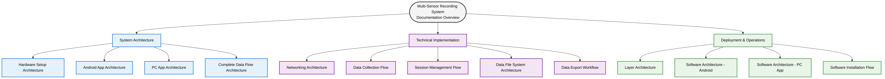
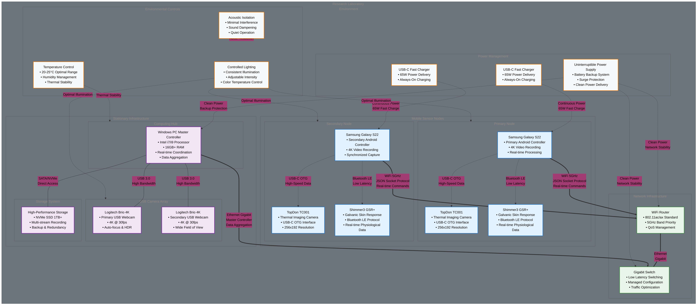
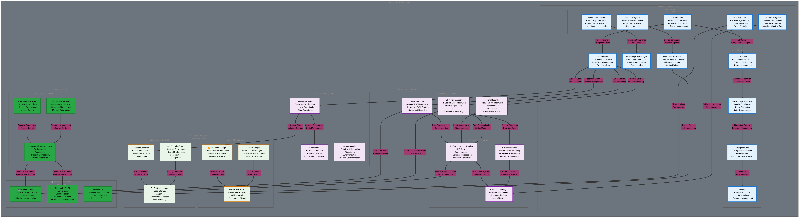
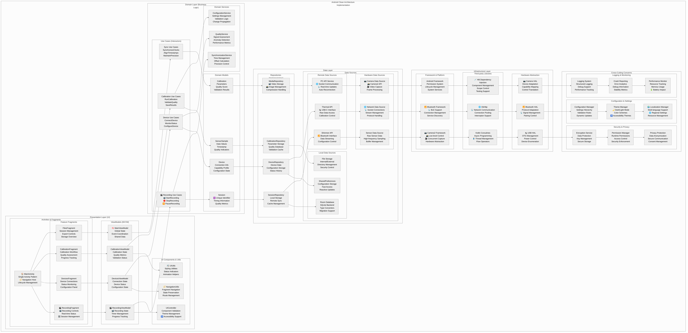

# Multi-Sensor Recording System - Architecture Diagrams

This document provides a comprehensive visual overview of the multi-sensor recording system architecture through professionally styled diagrams. Each diagram illustrates different aspects of the system design, from hardware setup to software deployment.

## Architecture Overview

The multi-sensor recording system follows a **PC master-controller** architecture with **offline-first local recording** capabilities, using a **JSON socket protocol** for standardized communication between components.

## Diagram Collection

### 1. Table of Contents

*Overview of the documentation structure and navigation guide*

### 2. Hardware Setup Architecture

*Physical device connectivity including Samsung S22 devices, thermal cameras, GSR sensors, USB webcams, and network infrastructure with power management*

### 3. Android App Architecture

*4-layer clean architecture (Presentation, Domain, Data, Infrastructure) with detailed component interactions*

### 4. PC App Architecture

*Component-based Python architecture with PyQt5 framework, business logic layers, and external dependencies*

### 5. Complete Data Flow Architecture

*Multi-modal data collection from mobile and stationary sensors with real-time processing hub*

### 6. Networking Architecture

*Multi-layer network stack from physical infrastructure to communication patterns with security and QoS management*

### 7. Data Collection Flow

*Comprehensive flowchart with pre-recording setup, real-time monitoring, and error handling*

### 8. Session Management Flow

*Complete session lifecycle from initialization through archival with state management*

### 9. Data File System Architecture

*Hierarchical storage organization with device-specific storage, backup systems, and version control*

### 10. Data Export Workflow

*Multi-format export pipeline with quality assurance, compression, and delivery*

### 11. Layer Architecture

*6-layer system architecture from hardware to application with clear separation of concerns*

### 12. Software Architecture of Android

*Clean architecture implementation with MVVM, domain models, repositories, and cross-cutting concerns*

### 13. Software Architecture of PC App

*Detailed component structure with PyQt5 framework, business logic, services, and infrastructure layers*

### 14. Software Installation Flow

*Complete installation process with automated setup scripts for Windows, Linux, and cross-platform support*

## Architectural Principles

### Design Consistency
All diagrams consistently reference the established architecture principles:
- **PC master-controller** for centralized coordination
- **Offline-first local recording** for data integrity
- **JSON socket protocol** for standardized communication
- **Component-first design** for modularity and maintainability

### Visual Design
The diagrams feature:
- **Professional color scheme** with blue primary palette and complementary accent colors
- **Clear component hierarchy** with logical grouping and subgraphs
- **Consistent styling** across all diagram types
- **High-resolution rendering** suitable for documentation and presentations

### Academic Value
These visualizations support thesis documentation by providing:
- Clear, precise, and practical documentation style
- Component-first documentation approach explaining both rationale ("why") and implementation ("how")
- Professional visualization suitable for academic presentation
- Comprehensive system understanding for research purposes

## Usage Guidelines

### Documentation Integration
- Reference specific diagrams when explaining system components
- Use as visual aids during technical presentations
- Include in academic papers and thesis documentation
- Utilize for onboarding new team members

### Maintenance
- Update diagrams when architectural changes occur
- Maintain consistency with actual implementation
- Version control diagram sources alongside code changes
- Regular review for accuracy and completeness

## Technical Details

The diagrams are generated from mermaid.js source code with custom styling and rendered as high-resolution PNG images for optimal quality and compatibility across different platforms and documentation systems.

All diagrams maintain consistency with the established multi-sensor recording system architecture and provide both high-level overviews and detailed implementation insights.