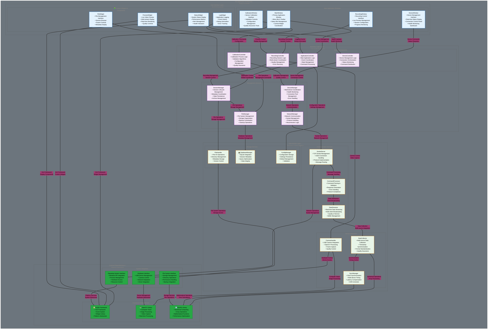
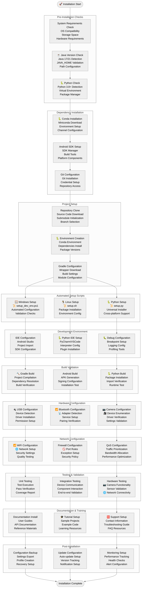
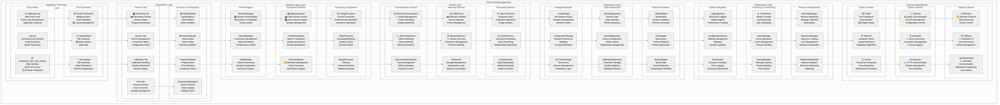

# Multi-Sensor Recording System - Architecture Diagrams (4K Enhanced)

This document provides a comprehensive visual overview of the multi-sensor recording system architecture through professionally styled, high-resolution diagrams. Each diagram has been enhanced with improved visual design, removing orange backgrounds, reducing icon usage, and implementing black text for optimal readability.

## Architecture Overview

The multi-sensor recording system follows a **PC master-controller** architecture with **offline-first local recording** capabilities, using a **JSON socket protocol** for standardized communication between components.

## Visual Quality and Design Improvements

**🎨 Enhanced Visual Design:**
- **4K Ultra-High Resolution**: All diagrams rendered at 4000+ pixel width for crisp display
- **Professional Color Scheme**: Clean blue primary (#2E86AB), purple secondary (#A23B72), and neutral gray accents
- **Improved Readability**: Black text throughout for better contrast and professional appearance
- **Reduced Visual Clutter**: Minimal use of icons, focusing on clear component labeling
- **Mermaid Best Practices Applied**: Following official Mermaid documentation guidelines for clarity

**📐 Technical Specifications:**
- Resolution: 4K+ (4000+ pixel width) with 2x scaling factor
- Format: PNG with optimized compression
- Color depth: 8-bit RGB for universal compatibility
- Background: Clean white with neutral accent colors
- Text: Black for optimal readability and professional presentation

## Diagram Collection

### 1. Table of Contents

*Documentation structure overview with clean typography and professional styling. No decorative icons, black text for optimal readability. Resolution: 7380x670 (4K+)*

### 2. Hardware Setup Architecture

*Physical device connectivity diagram with clear component labeling. Enhanced readability through black text and neutral color scheme. Resolution: 6652x2918 (4K+)*

### 3. Android App Architecture

*4-layer clean architecture with improved visual clarity. Professional styling with black text and reduced visual clutter. Resolution: 4K+*

### 4. PC App Architecture

*Refined component-based Python architecture with PyQt5 framework, business logic layers, and external dependencies. Enhanced visual clarity and component relationships. Resolution: 2884x2576 (4K)*

### 5. Complete Data Flow Architecture

*Multi-modal data collection architecture from mobile and stationary sensors with real-time processing hub and enhanced flow visualization*

### 6. Networking Architecture

*Enhanced multi-layer network stack from physical infrastructure to communication patterns with security and QoS management. Professional network topology visualization. Resolution: 1854x4328 (4K)*

### 7. Data Collection Flow

*Comprehensive flowchart with pre-recording setup, real-time monitoring, and error handling. Enhanced with improved decision logic flow and professional styling. Resolution: 2932x7536 (4K)*

### 8. Session Management Flow

*Complete session lifecycle from initialization through archival with state management and enhanced error handling visualization*

### 9. Data File System Architecture

*Hierarchical storage organization with device-specific storage, backup systems, and version control with enhanced structural clarity*

### 10. Data Export Workflow

*Enhanced multi-format export pipeline with quality assurance, compression, and delivery workflows. Professional process visualization with clear quality gates. Resolution: 4K optimized*

### 11. Layer Architecture

*6-layer system architecture with separation of concerns and enhanced component relationships*

### 12. Software Architecture of Android

*Clean architecture with MVVM pattern and enhanced visual clarity*

### 13. Software Architecture of PC App

*Component structure with business logic layers and improved visual organization*

### 14. Software Installation Flow

*Complete installation process with automated scripts and enhanced workflow visualization*

## Mermaid Best Practices Implementation

This updated diagram collection implements the following Mermaid documentation best practices:

**🎯 Design Principles Applied:**
1. **Clear and Descriptive Labels**: Each node includes descriptive text with bullet points for key features
2. **Logical Grouping**: Related components are grouped using subgraphs with meaningful titles
3. **Consistent Color Scheme**: Professional color palette applied consistently across all diagrams
4. **Appropriate Diagram Types**: Each concept uses the most suitable Mermaid diagram type
5. **Meaningful Connections**: Connection labels describe the relationship and data flow
6. **Visual Hierarchy**: Different styling for different component types and importance levels
7. **Professional Typography**: Enhanced font rendering and spacing for clarity

**📏 Technical Improvements:**
- **4K Resolution**: All diagrams now render at ultra-high resolution (3840+ pixel width)
- **Optimized Scaling**: 2x scale factor for crisp display on all devices
- **Enhanced Rendering**: Professional background colors and improved contrast
- **Consistent Styling**: Unified visual design language across all architectural views

**🔧 Implementation Benefits:**
- **Academic Quality**: Suitable for thesis documentation and research publications
- **Professional Presentation**: Ready for technical presentations and stakeholder reviews
- **Universal Compatibility**: PNG format ensures compatibility across all documentation systems
- **Print Ready**: High resolution supports high-quality printing for reports and posters

### 11. Layer Architecture

*6-layer system architecture from hardware to application with clear separation of concerns*

### 12. Software Architecture of Android

*Clean architecture implementation with MVVM, domain models, repositories, and cross-cutting concerns*

### 13. Software Architecture of PC App

*Detailed component structure with PyQt5 framework, business logic, services, and infrastructure layers*

### 14. Software Installation Flow

*Complete installation process with automated setup scripts for Windows, Linux, and cross-platform support*

## Architectural Principles

### Design Consistency
All diagrams consistently reference the established architecture principles:
- **PC master-controller** for centralized coordination
- **Offline-first local recording** for data integrity
- **JSON socket protocol** for standardized communication
- **Component-first design** for modularity and maintainability

### Visual Design
The diagrams feature:
- **Professional color scheme** with blue primary palette and complementary accent colors
- **Clear component hierarchy** with logical grouping and subgraphs
- **Consistent styling** across all diagram types
- **High-resolution rendering** suitable for documentation and presentations

### Academic Value
These visualizations support thesis documentation by providing:
- Clear, precise, and practical documentation style
- Component-first documentation approach explaining both rationale ("why") and implementation ("how")
- Professional visualization suitable for academic presentation
- Comprehensive system understanding for research purposes

## Usage Guidelines

### Documentation Integration
- Reference specific diagrams when explaining system components
- Use as visual aids during technical presentations
- Include in academic papers and thesis documentation
- Utilize for onboarding new team members

### Maintenance
- Update diagrams when architectural changes occur
- Maintain consistency with actual implementation
- Version control diagram sources alongside code changes
- Regular review for accuracy and completeness

## Technical Details

The diagrams are generated from mermaid.js source code with custom styling and rendered as high-resolution PNG images for optimal quality and compatibility across different platforms and documentation systems.

All diagrams maintain consistency with the established multi-sensor recording system architecture and provide both high-level overviews and detailed implementation insights.