# Multi-Sensor Recording System - Comprehensive Architecture Diagrams

## Table of Contents

1. [Hardware Setup Architecture](#hardware-setup-architecture)
2. [Android App Architecture](#android-app-architecture)
3. [PC App Architecture](#pc-app-architecture)
4. [Complete Data Flow Architecture](#complete-data-flow-architecture)
5. [Synchronization Flow](#synchronization-flow)
6. [Networking Architecture](#networking-architecture)
7. [Data Collection Flow](#data-collection-flow)
8. [Session Management Flow](#session-management-flow)
9. [Individual Sensor Integration](#individual-sensor-integration)
10. [Camera2 Image Processing Flow](#camera2-image-processing-flow)
11. [Data File System Architecture](#data-file-system-architecture)
12. [Data Export Workflow](#data-export-workflow)
13. [Layer Architecture](#layer-architecture)
14. [Software Architecture of Android](#software-architecture-of-android)
15. [Software Architecture of PC App](#software-architecture-of-pc-app)
16. [Software Installation Flow](#software-installation-flow)
17. [System Architecture Deployment Flow](#system-architecture-deployment-flow)
18. [Testing Architecture](#testing-architecture)

---

## Hardware Setup Architecture

This diagram illustrates the physical hardware configuration and connectivity between all components in the multi-sensor recording system.

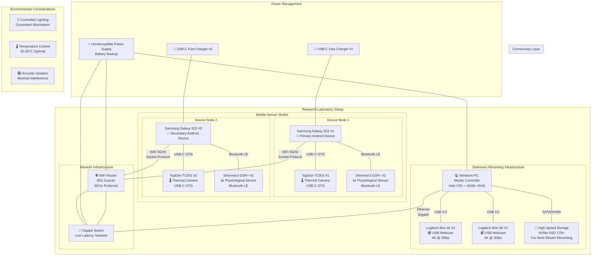

## Android App Architecture

Enhanced architecture diagram showing the complete Android application structure with detailed component interactions.

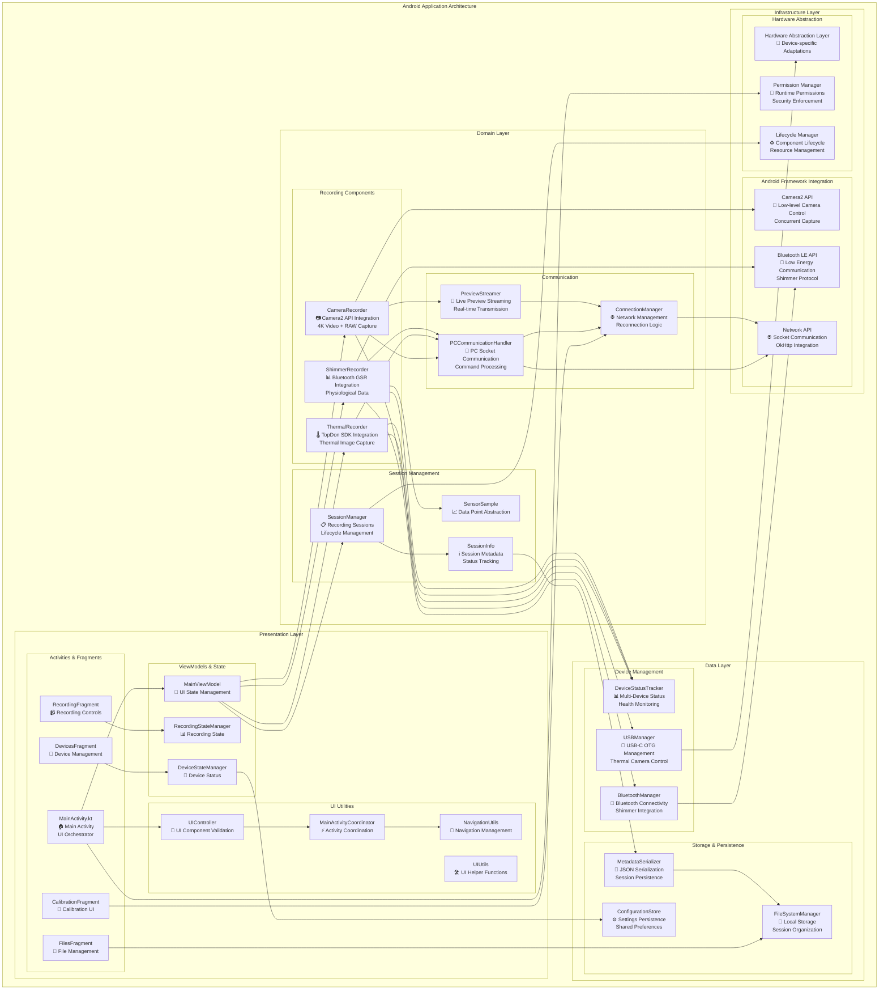

## PC App Architecture

Comprehensive architecture diagram for the Python desktop controller application.

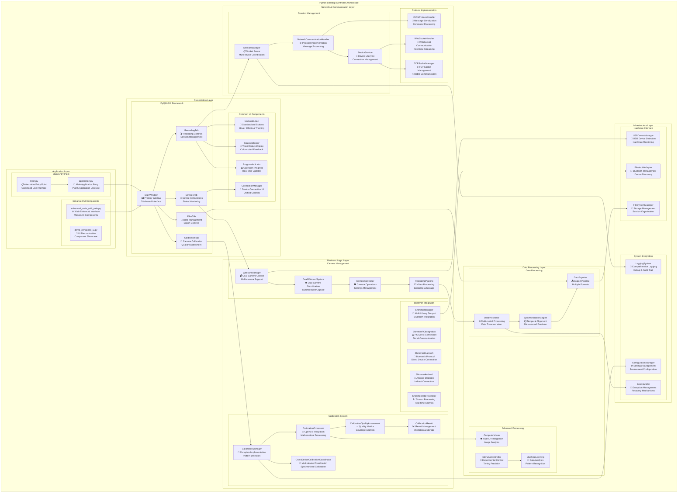

## Complete Data Flow Architecture

Enhanced data flow architecture showing detailed data pathways, processing stages, and synchronization mechanisms.

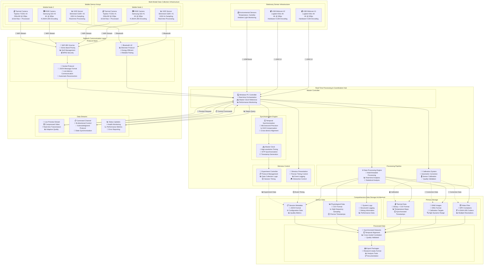

## Synchronization Flow

Detailed sequence diagram showing the complete synchronization process with timing precision and error handling.

```mermaid
sequenceDiagram
    participant PC as 💻 PC Controller<br/>Master Clock
    participant A1 as 📱 Android #1<br/>Mobile Node
    participant A2 as 📱 Android #2<br/>Mobile Node
    participant S1 as 📊 Shimmer3 #1<br/>GSR Sensor
    participant S2 as 📊 Shimmer3 #2<br/>GSR Sensor
    participant W1 as 📹 USB Webcam #1<br/>Stationary Camera
    participant W2 as 📹 USB Webcam #2<br/>Stationary Camera
    
    Note over PC,W2: System Initialization & Discovery Phase
    
    PC->>PC: 🚀 Initialize Master Clock<br/>High-resolution Timer
    PC->>PC: 🔍 Scan USB Devices<br/>Detect Webcams
    
    PC->>W1: 🎥 Initialize Camera #1<br/>Configure Settings
    PC->>W2: 🎥 Initialize Camera #2<br/>Configure Settings
    
    W1-->>PC: ✅ Camera Ready<br/>Capabilities Report
    W2-->>PC: ✅ Camera Ready<br/>Capabilities Report
    
    Note over PC,W2: Network Discovery & Connection Phase
    
    PC->>PC: 🌐 Start Socket Server<br/>Port 8080 + Preview Ports
    
    A1->>PC: 🔗 Connect Request<br/>Device ID + Capabilities
    PC->>A1: ✅ Connection Accepted<br/>Session Token
    
    A2->>PC: 🔗 Connect Request<br/>Device ID + Capabilities
    PC->>A2: ✅ Connection Accepted<br/>Session Token
    
    Note over PC,W2: Sensor Initialization Phase
    
    A1->>S1: 📶 Bluetooth Discovery<br/>Shimmer Protocol
    S1-->>A1: ✅ Pairing Successful<br/>Device Info
    
    A2->>S2: 📶 Bluetooth Discovery<br/>Shimmer Protocol
    S2-->>A2: ✅ Pairing Successful<br/>Device Info
    
    A1->>S1: ⚙️ Configure Sampling<br/>1024 Hz GSR Settings
    S1-->>A1: ✅ Configuration Set<br/>Ready for Recording
    
    A2->>S2: ⚙️ Configure Sampling<br/>1024 Hz GSR Settings
    S2-->>A2: ✅ Configuration Set<br/>Ready for Recording
    
    Note over PC,W2: Clock Synchronization Phase (Critical Timing)
    
    PC->>A1: ⏱️ Clock Sync Request<br/>T0 = PC_timestamp
    A1->>A1: 📊 Measure Local Time<br/>T1 = Android_timestamp
    A1->>PC: ⏱️ Clock Response<br/>T1 + Network_delay
    
    PC->>A2: ⏱️ Clock Sync Request<br/>T0 = PC_timestamp  
    A2->>A2: 📊 Measure Local Time<br/>T1 = Android_timestamp
    A2->>PC: ⏱️ Clock Response<br/>T1 + Network_delay
    
    PC->>PC: 🧮 Calculate Offsets<br/>Compensate Network Latency
    PC->>A1: 📐 Time Offset Correction<br/>Δt1 = calculated_offset
    PC->>A2: 📐 Time Offset Correction<br/>Δt2 = calculated_offset
    
    Note over PC,W2: Recording Preparation Phase
    
    PC->>PC: 📋 Create Session Folder<br/>Generate Session ID
    PC->>PC: 📄 Initialize Metadata<br/>Device Configuration
    
    PC->>A1: 🎬 Prepare Recording<br/>Session Config
    A1->>A1: 📁 Create Local Storage<br/>Session Folder
    A1->>PC: ✅ Ready for Recording<br/>Storage Confirmed
    
    PC->>A2: 🎬 Prepare Recording<br/>Session Config
    A2->>A2: 📁 Create Local Storage<br/>Session Folder
    A2->>PC: ✅ Ready for Recording<br/>Storage Confirmed
    
    Note over PC,W2: Synchronized Recording Start (Critical Timing)
    
    PC->>PC: ⏰ Calculate Start Time<br/>T_start = now + 2000ms
    
    PC->>A1: 🚀 Start Recording Command<br/>T_start = synchronized_time
    PC->>A2: 🚀 Start Recording Command<br/>T_start = synchronized_time
    PC->>W1: 🎥 Start USB Recording<br/>T_start = synchronized_time
    PC->>W2: 🎥 Start USB Recording<br/>T_start = synchronized_time
    
    par Synchronized Recording Initiation
        A1->>A1: ⏳ Wait for T_start<br/>Precise Timing
        A1->>A1: 🎬 Start Camera Recording<br/>RGB + RAW Capture
        A1->>A1: 🌡️ Start Thermal Recording<br/>TC001 Capture
        A1->>S1: 📊 Start GSR Recording<br/>Begin Data Stream
    and
        A2->>A2: ⏳ Wait for T_start<br/>Precise Timing
        A2->>A2: 🎬 Start Camera Recording<br/>RGB + RAW Capture
        A2->>A2: 🌡️ Start Thermal Recording<br/>TC001 Capture
        A2->>S2: 📊 Start GSR Recording<br/>Begin Data Stream
    and
        PC->>PC: ⏳ Wait for T_start<br/>Precise Timing
        PC->>PC: 🎥 Start Webcam #1<br/>4K Capture
        PC->>PC: 🎥 Start Webcam #2<br/>4K Capture
    end
    
    Note over PC,W2: Active Recording Phase with Monitoring
    
    loop Real-time Data Streaming
        S1->>A1: 📊 GSR Data Packet<br/>1024 Hz Samples
        S2->>A2: 📊 GSR Data Packet<br/>1024 Hz Samples
        
        A1->>PC: 📡 Preview Frame + Status<br/>Compressed Stream
        A2->>PC: 📡 Preview Frame + Status<br/>Compressed Stream
        
        A1->>PC: 📊 Device Status Update<br/>Health + Performance
        A2->>PC: 📊 Device Status Update<br/>Health + Performance
        
        PC->>PC: 📈 Monitor Performance<br/>Resource Usage
        PC->>PC: 🔄 Log Synchronization<br/>Timestamp Validation
    end
    
    Note over PC,W2: Recording Termination Phase
    
    PC->>A1: 🛑 Stop Recording Command<br/>Graceful Shutdown
    PC->>A2: 🛑 Stop Recording Command<br/>Graceful Shutdown
    PC->>W1: 🛑 Stop USB Recording<br/>Finalize Files
    PC->>W2: 🛑 Stop USB Recording<br/>Finalize Files
    
    par Synchronized Recording Stop
        A1->>S1: 🛑 Stop GSR Recording<br/>Finalize Data
        A1->>A1: 🛑 Stop Camera Recording<br/>Finalize Video
        A1->>A1: 🛑 Stop Thermal Recording<br/>Finalize Thermal
        A1->>PC: ✅ Recording Stopped<br/>File Count + Size
    and
        A2->>S2: 🛑 Stop GSR Recording<br/>Finalize Data
        A2->>A2: 🛑 Stop Camera Recording<br/>Finalize Video
        A2->>A2: 🛑 Stop Thermal Recording<br/>Finalize Thermal
        A2->>PC: ✅ Recording Stopped<br/>File Count + Size
    end
    
    Note over PC,W2: Post-Recording Validation Phase
    
    PC->>PC: 📊 Generate Session Report<br/>Synchronization Analysis
    PC->>PC: ✅ Validate Data Integrity<br/>File Completeness Check
    PC->>PC: 📋 Update Session Metadata<br/>Final Statistics
    
    PC->>A1: 📄 Request Session Summary<br/>Local Statistics
    A1-->>PC: 📊 Session Summary<br/>Files + Metadata
    
    PC->>A2: 📄 Request Session Summary<br/>Local Statistics
    A2-->>PC: 📊 Session Summary<br/>Files + Metadata
    
    PC->>PC: 📁 Archive Session Data<br/>Backup + Organization
```

## Networking Architecture

Comprehensive networking architecture showing protocol layers, security, and communication patterns.

```mermaid
graph TB
    subgraph "Multi-Layer Network Architecture"
        subgraph "Physical Network Infrastructure"
            subgraph "Wireless Infrastructure"
                ROUTER[🌐 WiFi Router/Access Point<br/>📡 802.11ac/ax (WiFi 6)<br/>🚀 5GHz Primary Band<br/>📊 QoS Traffic Shaping]
                MESH[🔗 Mesh Network Support<br/>📶 Extended Coverage<br/>🔄 Automatic Roaming<br/>⚡ Load Balancing]
            end
            
            subgraph "Wired Infrastructure"
                SWITCH[🔗 Gigabit Ethernet Switch<br/>⚡ Low-latency Switching<br/>📊 Port Mirroring<br/>🔒 VLAN Support]
                BACKBONE[🌐 Network Backbone<br/>🚀 Gigabit Connectivity<br/>📈 Bandwidth Management<br/>🔄 Redundancy]
            end
        end
        
        subgraph "Network Protocol Stack"
            subgraph "Application Layer Protocols"
                HTTP[🌐 HTTP/HTTPS<br/>📄 RESTful API<br/>🔒 TLS 1.3 Encryption<br/>📊 JSON Data Format]
                WS[🔌 WebSocket Protocol<br/>⚡ Real-time Communication<br/>📡 Bi-directional Streaming<br/>🔄 Automatic Reconnection]
                CUSTOM[📋 Custom Protocol<br/>⚡ Low-latency Commands<br/>📊 Binary + JSON Hybrid<br/>✅ Acknowledgment System]
            end
            
            subgraph "Transport Layer"
                TCP[🚛 TCP Protocol<br/>✅ Reliable Delivery<br/>🔄 Connection Management<br/>📊 Flow Control]
                UDP[📡 UDP Protocol<br/>⚡ Low-latency Streaming<br/>🎞️ Video/Audio Data<br/>📊 Best-effort Delivery]
            end
            
            subgraph "Network Layer"
                IPv4[🌐 IPv4 Addressing<br/>📍 192.168.x.x Range<br/>🔗 NAT Translation<br/>🛣️ Routing Tables]
                IPv6[🌐 IPv6 Support<br/>🚀 Future-ready<br/>🔒 Built-in Security<br/>📈 Extended Address Space]
            end
        end
        
        subgraph "Device Communication Layers"
            subgraph "PC Controller (Server)"
                subgraph "Server Components"
                    SS[🖥️ Socket Server<br/>📍 Port 8080 (Control)<br/>⚡ Multi-threaded<br/>🔄 Connection Pool]
                    PS[📡 Preview Server<br/>📍 Ports 8081-8090<br/>🎞️ Video Streaming<br/>📊 Adaptive Bitrate]
                    API[🔗 REST API Server<br/>📍 Port 8000<br/>📄 JSON Endpoints<br/>🔒 Authentication]
                end
                
                subgraph "Communication Handlers"
                    NCH[📋 Network Communication Handler<br/>📄 Message Processing<br/>🔄 Protocol Management<br/>📊 Performance Monitoring]
                    SMH[📋 Session Management Handler<br/>🎯 Multi-device Coordination<br/>⏱️ Synchronization Logic<br/>📊 State Management]
                    EH[🚨 Error Handler<br/>🔄 Recovery Mechanisms<br/>📝 Logging System<br/>📊 Health Monitoring]
                end
            end
            
            subgraph "Android Clients"
                subgraph "Device 1 Communication"
                    SC1[📱 Socket Client #1<br/>🔗 Connection Management<br/>⚡ Auto-reconnection<br/>📊 Heartbeat Protocol]
                    PCH1[📋 PC Communication Handler #1<br/>📄 Message Parsing<br/>✅ Command Execution<br/>📊 Status Reporting]
                    PVS1[📡 Preview Streamer #1<br/>🎞️ Video Compression<br/>📊 Quality Adaptation<br/>⚡ Real-time Encoding]
                end
                
                subgraph "Device 2 Communication"
                    SC2[📱 Socket Client #2<br/>🔗 Connection Management<br/>⚡ Auto-reconnection<br/>📊 Heartbeat Protocol]
                    PCH2[📋 PC Communication Handler #2<br/>📄 Message Parsing<br/>✅ Command Execution<br/>📊 Status Reporting]
                    PVS2[📡 Preview Streamer #2<br/>🎞️ Video Compression<br/>📊 Quality Adaptation<br/>⚡ Real-time Encoding]
                end
            end
        end
        
        subgraph "Security & Quality of Service"
            subgraph "Network Security"
                WPA3[🔒 WPA3 Encryption<br/>🛡️ Advanced Security<br/>🔐 Key Management<br/>🚫 Unauthorized Access]
                FW[🛡️ Firewall Rules<br/>🚫 Port Filtering<br/>📋 Access Control Lists<br/>📊 Traffic Monitoring]
                VPN[🔒 VPN Support<br/>🌐 Secure Remote Access<br/>🔐 Encrypted Tunneling<br/>🌍 Geographic Flexibility]
            end
            
            subgraph "Quality of Service"
                QOS[📊 QoS Management<br/>⚡ Traffic Prioritization<br/>📈 Bandwidth Allocation<br/>🎯 Latency Optimization]
                DSCP[🏷️ DSCP Marking<br/>📊 Traffic Classification<br/>⚡ Priority Queuing<br/>🎯 Service Differentiation]
                BWM[📈 Bandwidth Management<br/>🎛️ Rate Limiting<br/>📊 Fair Queuing<br/>⚡ Congestion Control]
            end
        end
        
        subgraph "Communication Patterns"
            subgraph "Control Communications"
                CMD[📋 Command Channel<br/>⚡ Bi-directional Control<br/>✅ Request-Response Pattern<br/>🔄 State Synchronization]
                SYNC[⏱️ Synchronization Messages<br/>🎯 Clock Alignment<br/>📊 Timestamp Exchange<br/>⚡ Precision Timing]
                STATUS[📊 Status Updates<br/>⚡ Health Monitoring<br/>📈 Performance Metrics<br/>🚨 Error Notifications]
            end
            
            subgraph "Data Streaming"
                PREVIEW[📡 Live Preview Streaming<br/>🎞️ Compressed Video<br/>📊 Adaptive Quality<br/>⚡ Real-time Transmission]
                BULK[📦 Bulk Data Transfer<br/>💾 File Synchronization<br/>📊 Progress Monitoring<br/>✅ Integrity Verification]
                META[📄 Metadata Exchange<br/>📋 Configuration Data<br/>📊 Session Information<br/>🔄 State Persistence]
            end
        end
    end
    
    %% Network Flow Connections
    ROUTER ---|Ethernet| SWITCH
    SWITCH ---|Gigabit| BACKBONE
    
    SS -->|TCP| ROUTER
    PS -->|UDP/TCP| ROUTER
    API -->|HTTP/HTTPS| ROUTER
    
    SC1 -->|WiFi 5GHz| ROUTER
    SC2 -->|WiFi 5GHz| ROUTER
    
    SS --> NCH
    NCH --> SMH
    SMH --> EH
    
    PS --> PVS1
    PS --> PVS2
    
    PCH1 --> SC1
    PCH2 --> SC2
    
    WPA3 -.->|Security| ROUTER
    FW -.->|Protection| SWITCH
    QOS -.->|Traffic Management| ROUTER
    
    CMD -.->|Control Flow| NCH
    SYNC -.->|Timing| SMH
    STATUS -.->|Monitoring| EH
    
    PREVIEW -.->|Streaming| PS
    BULK -.->|Transfer| API
    META -.->|Configuration| SS
```

## Data Collection Flow

Comprehensive flowchart showing the complete data collection process with error handling and quality assurance.

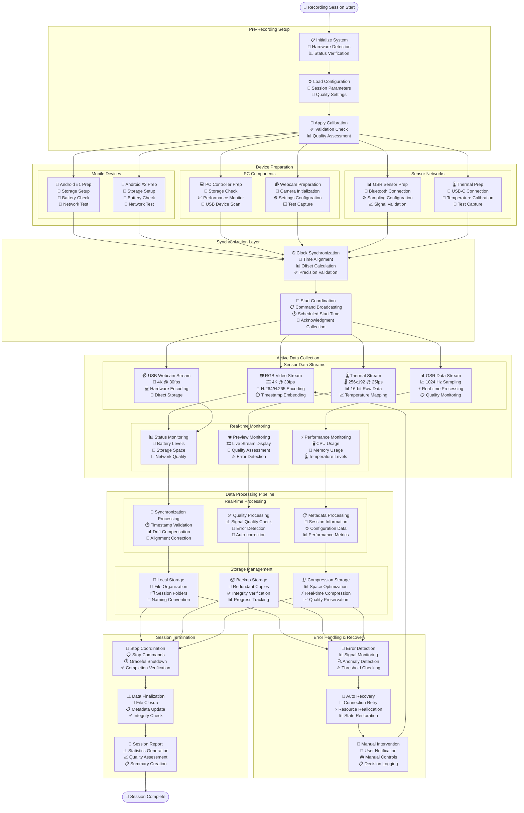

## Session Management Flow

Detailed flowchart showing the complete session lifecycle from initialization to data export.

```mermaid
flowchart TD
    START([🎬 Session Management Start])
    
    subgraph "Session Initialization"
        CREATE_ID[🆔 Generate Session ID<br/>📅 Timestamp-based<br/>🔢 Unique Identifier<br/>📋 Format: session_YYYYMMDD_HHMMSS]
        SETUP_DIR[📁 Setup Directory Structure<br/>📂 Main Session Folder<br/>📁 Device-specific Subfolders<br/>📄 Metadata Files]
        INIT_META[📋 Initialize Metadata<br/>⚙️ Configuration Parameters<br/>🕰️ Start Timestamp<br/>📊 Device Information]
    end
    
    subgraph "Device Registration"
        REG_DEVICES[📱 Register Devices<br/>🔗 Connection Verification<br/>📊 Capability Assessment<br/>✅ Status Validation]
        ASSIGN_ROLES[🎯 Assign Device Roles<br/>📱 Primary/Secondary Mobile<br/>📹 Camera Assignments<br/>📊 Sensor Allocation]
        CONFIG_DEVICES[⚙️ Configure Devices<br/>📄 Apply Settings<br/>🎯 Quality Parameters<br/>⏱️ Timing Configuration]
    end
    
    subgraph "Pre-Recording Phase"
        CALIB_CHECK[🎯 Calibration Check<br/>📐 Geometric Validation<br/>🌡️ Thermal Calibration<br/>✅ Quality Verification]
        STORAGE_CHECK[💾 Storage Verification<br/>📊 Available Space<br/>⚡ Write Speed Test<br/>🔄 Backup Availability]
        NETWORK_TEST[🌐 Network Testing<br/>📶 Connection Quality<br/>⏱️ Latency Measurement<br/>📈 Bandwidth Assessment]
    end
    
    subgraph "Recording Session Management"
        subgraph "Session Control"
            START_SESSION[🚀 Start Recording Session<br/>⏰ Synchronized Start<br/>📋 Command Broadcasting<br/>✅ Confirmation Collection]
            MONITOR_SESSION[👁️ Monitor Active Session<br/>📊 Real-time Status<br/>🔋 Resource Monitoring<br/>⚠️ Error Detection]
            CONTROL_SESSION[🎮 Session Control<br/>⏸️ Pause/Resume<br/>⚙️ Quality Adjustment<br/>🛑 Emergency Stop]
        end
        
        subgraph "Data Management"
            STREAM_MANAGE[📡 Stream Management<br/>🎞️ Video Streams<br/>📊 Sensor Data<br/>🌡️ Thermal Data]
            BUFFER_MANAGE[💾 Buffer Management<br/>🔄 Circular Buffers<br/>⚡ Memory Optimization<br/>📊 Flow Control]
            SYNC_MANAGE[⏱️ Synchronization Management<br/>🕰️ Timestamp Alignment<br/>📈 Drift Correction<br/>🎯 Precision Maintenance]
        end
    end
    
    subgraph "Real-time Quality Assurance"
        SIGNAL_QA[📊 Signal Quality Assessment<br/>📈 SNR Monitoring<br/>🎯 Threshold Checking<br/>📋 Quality Logging]
        SYNC_QA[⏱️ Synchronization QA<br/>🕰️ Timing Validation<br/>📊 Offset Monitoring<br/>⚠️ Drift Detection]
        DATA_QA[✅ Data Integrity QA<br/>🔍 Corruption Detection<br/>📊 Completeness Check<br/>🔧 Auto-correction]
    end
    
    subgraph "Session State Management"
        STATE_TRACK[📊 State Tracking<br/>🎯 Recording Status<br/>📱 Device States<br/>🔗 Connection Status]
        EVENT_LOG[📝 Event Logging<br/>⏱️ Timestamped Events<br/>🚨 Error Logging<br/>📊 Performance Metrics]
        CHECKPOINT[🔖 Checkpoint Management<br/>💾 State Persistence<br/>🔄 Recovery Points<br/>📋 Resume Capability]
    end
    
    subgraph "Session Termination"
        STOP_SESSION[🛑 Stop Recording Session<br/>📋 Stop Commands<br/>⏱️ Graceful Shutdown<br/>⏳ Completion Wait]
        FINALIZE_DATA[📊 Finalize Data<br/>📁 File Closure<br/>📋 Metadata Update<br/>✅ Integrity Verification]
        GENERATE_REPORT[📄 Generate Session Report<br/>📊 Statistics Compilation<br/>📈 Quality Analysis<br/>⚠️ Error Summary]
    end
    
    subgraph "Post-Processing & Export"
        DATA_VALIDATION[✅ Data Validation<br/>🔍 Completeness Check<br/>📊 Quality Assessment<br/>🔧 Error Correction]
        SYNC_PROCESSING[🔄 Synchronization Processing<br/>⏱️ Final Alignment<br/>📊 Cross-correlation<br/>🎯 Precision Optimization]
        EXPORT_PREP[📦 Export Preparation<br/>📁 Data Organization<br/>📋 Metadata Assembly<br/>🗜️ Compression Options]
        EXPORT_EXECUTE[📤 Execute Export<br/>💾 Multiple Formats<br/>📊 Research Package<br/>📋 Documentation]
    end
    
    subgraph "Session Archival"
        ARCHIVE_SESSION[📦 Archive Session<br/>💾 Long-term Storage<br/>🔒 Data Security<br/>📋 Index Generation]
        CLEANUP[🧹 Cleanup Operations<br/>🗑️ Temporary Files<br/>💾 Cache Cleanup<br/>📊 Resource Release]
        BACKUP_VERIFY[✅ Backup Verification<br/>🔍 Integrity Check<br/>📊 Redundancy Verification<br/>📋 Backup Catalog]
    end
    
    %% Flow Connections
    START --> CREATE_ID
    CREATE_ID --> SETUP_DIR
    SETUP_DIR --> INIT_META
    
    INIT_META --> REG_DEVICES
    REG_DEVICES --> ASSIGN_ROLES
    ASSIGN_ROLES --> CONFIG_DEVICES
    
    CONFIG_DEVICES --> CALIB_CHECK
    CALIB_CHECK --> STORAGE_CHECK
    STORAGE_CHECK --> NETWORK_TEST
    
    NETWORK_TEST --> START_SESSION
    START_SESSION --> MONITOR_SESSION
    MONITOR_SESSION --> CONTROL_SESSION
    
    START_SESSION --> STREAM_MANAGE
    STREAM_MANAGE --> BUFFER_MANAGE
    BUFFER_MANAGE --> SYNC_MANAGE
    
    MONITOR_SESSION --> SIGNAL_QA
    SIGNAL_QA --> SYNC_QA
    SYNC_QA --> DATA_QA
    
    CONTROL_SESSION --> STATE_TRACK
    STATE_TRACK --> EVENT_LOG
    EVENT_LOG --> CHECKPOINT
    
    DATA_QA --> STOP_SESSION
    CHECKPOINT --> STOP_SESSION
    STOP_SESSION --> FINALIZE_DATA
    FINALIZE_DATA --> GENERATE_REPORT
    
    GENERATE_REPORT --> DATA_VALIDATION
    DATA_VALIDATION --> SYNC_PROCESSING
    SYNC_PROCESSING --> EXPORT_PREP
    EXPORT_PREP --> EXPORT_EXECUTE
    
    EXPORT_EXECUTE --> ARCHIVE_SESSION
    ARCHIVE_SESSION --> CLEANUP
    CLEANUP --> BACKUP_VERIFY
    
    BACKUP_VERIFY --> END([✅ Session Management Complete])
```

## Individual Sensor Integration

Comprehensive diagram showing detailed integration architecture for each sensor type in the multi-sensor recording system.

```mermaid
graph TB
    subgraph "Individual Sensor Integration Architecture"
        subgraph "Samsung S22 Built-in Camera Integration"
            subgraph "Camera2 API Layer"
                CAM2_MGR[📷 CameraManager<br/>🔍 Device Discovery<br/>📊 Capability Enumeration<br/>⚙️ Characteristics Query]
                CAM2_DEV[📱 CameraDevice<br/>🔗 Session Management<br/>⚙️ Configuration Control<br/>📊 State Monitoring]
                CAM2_SESS[🎬 CameraCaptureSession<br/>🎯 Capture Requests<br/>🔄 Repeating Sessions<br/>📊 Result Processing]
            end
            
            subgraph "Capture Configuration"
                IMG_READER[📸 ImageReader<br/>🎞️ YUV_420_888 Format<br/>📊 Multiple Buffers<br/>⚡ Async Processing]
                SURF_VIEW[🖼️ SurfaceView<br/>👁️ Preview Display<br/>⚡ Real-time Rendering<br/>🎯 UI Integration]
                MEDIA_REC[🎥 MediaRecorder<br/>📹 H.264/H.265 Encoding<br/>💾 MP4 Container<br/>⚙️ Quality Settings]
            end
            
            subgraph "Processing Pipeline"
                FRAME_PROC[🖼️ Frame Processing<br/>🎯 ROI Extraction<br/>📊 Quality Assessment<br/>⏱️ Timestamp Addition]
                FORMAT_CONV[🔄 Format Conversion<br/>📊 Color Space Transform<br/>🎯 Resolution Scaling<br/>📈 Quality Optimization]
                PREVIEW_STREAM[📡 Preview Streaming<br/>🗜️ JPEG Compression<br/>📶 Network Transmission<br/>⚡ Real-time Delivery]
            end
        end
        
        subgraph "Logitech Brio 4K USB Webcam Integration"
            subgraph "USB Interface Layer"
                USB_ENUM[🔌 USB Enumeration<br/>🔍 Device Detection<br/>📊 Descriptor Parsing<br/>⚙️ Endpoint Configuration]
                UVC_DRIVER[📹 UVC Driver Interface<br/>📊 Video Class Support<br/>⚙️ Control Extensions<br/>🎯 Format Negotiation]
                DIRECT_SHOW[🖥️ DirectShow/V4L2<br/>🎞️ Media Foundation<br/>⚙️ Filter Graph<br/>📊 Format Selection]
            end
            
            subgraph "Capture Management"
                WEBCAM_MGR[📹 WebcamManager<br/>🔍 Multi-camera Support<br/>⚙️ Settings Management<br/>📊 Status Monitoring]
                CAP_ENGINE[🎥 Capture Engine<br/>⚡ Hardware Acceleration<br/>💾 Direct Memory Access<br/>🔄 Buffer Management]
                SYNC_CTRL[⏱️ Sync Controller<br/>🕰️ Frame Timing<br/>📊 Timestamp Generation<br/>🎯 Precision Control]
            end
            
            subgraph "Quality Control"
                AUTO_FOCUS[🎯 Auto Focus Control<br/>⚡ Continuous AF<br/>📊 Focus Quality<br/>🔧 Manual Override]
                AUTO_EXPO[☀️ Auto Exposure<br/>📊 Histogram Analysis<br/>⚙️ ISO/Shutter Control<br/>🎯 Target Brightness]
                WHITE_BAL[🎨 White Balance<br/>🌡️ Color Temperature<br/>📊 Scene Analysis<br/>🎯 Natural Colors]
            end
        end
        
        subgraph "TopDon TC001 Thermal Camera Integration"
            subgraph "USB-C OTG Interface"
                OTG_MGR[🔌 OTG Manager<br/>⚡ USB Host Mode<br/>🔍 Device Recognition<br/>⚙️ Power Management]
                TOPDON_SDK[🌡️ TopDon SDK<br/>📊 Native Library<br/>🔗 JNI Interface<br/>📄 API Wrapper]
                THERMAL_DEV[🌡️ Thermal Device<br/>⚙️ Sensor Configuration<br/>📊 Calibration Data<br/>🎯 Temperature Range]
            end
            
            subgraph "Thermal Processing"
                RAW_CAPTURE[📊 Raw Thermal Capture<br/>📈 16-bit ADC Data<br/>🌡️ Temperature Matrix<br/>⏱️ Frame Timing]
                TEMP_CONV[🌡️ Temperature Conversion<br/>📊 Radiometric Calculation<br/>🎯 Emissivity Correction<br/>📈 Non-linearity Compensation]
                FALSE_COLOR[🎨 False Color Mapping<br/>🌈 Palette Application<br/>📊 Contrast Enhancement<br/>🎯 Visual Representation]
            end
            
            subgraph "Calibration System"
                THERMAL_CAL[🎯 Thermal Calibration<br/>🌡️ Blackbody Reference<br/>📊 Gain/Offset Correction<br/>✅ Accuracy Validation]
                GEOMETRIC_CAL[📐 Geometric Calibration<br/>🎯 Lens Distortion<br/>📊 Pixel Mapping<br/>🔗 RGB Alignment]
                TEMPORAL_CAL[⏱️ Temporal Calibration<br/>🕰️ Frame Synchronization<br/>📊 Delay Compensation<br/>🎯 Timestamp Alignment]
            end
        end
        
        subgraph "Shimmer3 GSR+ Sensor Integration"
            subgraph "Bluetooth LE Interface"
                BLE_MGR[📶 BLE Manager<br/>🔍 Device Scanning<br/>🔗 Connection Management<br/>📊 Service Discovery]
                SHIMMER_PROT[📊 Shimmer Protocol<br/>📄 Custom GATT Services<br/>⚙️ Configuration Commands<br/>📈 Data Streaming]
                CONN_MGR[🔗 Connection Manager<br/>📶 Signal Monitoring<br/>🔄 Auto-reconnection<br/>⚡ Power Management]
            end
            
            subgraph "GSR Data Processing"
                RAW_GSR[📊 Raw GSR Data<br/>📈 ADC Samples<br/>⚡ 1024 Hz Sampling<br/>📋 16-bit Resolution]
                SIGNAL_PROC[📈 Signal Processing<br/>🔍 Noise Filtering<br/>📊 Baseline Correction<br/>📈 Feature Extraction]
                CALIB_PROC[🎯 Calibration Processing<br/>⚙️ Gain/Offset Correction<br/>📊 Individual Calibration<br/>✅ Quality Validation]
            end
            
            subgraph "Real-time Analysis"
                STREAM_PROC[📡 Stream Processing<br/>⚡ Real-time Analysis<br/>📊 Statistical Measures<br/>🚨 Anomaly Detection]
                BUFFER_MGR[💾 Buffer Management<br/>🔄 Circular Buffers<br/>📊 Data Windowing<br/>⚡ Memory Optimization]
                SYNC_PROC[⏱️ Sync Processing<br/>🕰️ Timestamp Alignment<br/>📊 Cross-modal Sync<br/>🎯 Precision Timing]
            end
        end
    end
    
    %% Integration Connections
    CAM2_MGR --> CAM2_DEV
    CAM2_DEV --> CAM2_SESS
    CAM2_SESS --> IMG_READER
    CAM2_SESS --> SURF_VIEW
    CAM2_SESS --> MEDIA_REC
    
    IMG_READER --> FRAME_PROC
    FRAME_PROC --> FORMAT_CONV
    FORMAT_CONV --> PREVIEW_STREAM
    
    USB_ENUM --> UVC_DRIVER
    UVC_DRIVER --> DIRECT_SHOW
    DIRECT_SHOW --> WEBCAM_MGR
    WEBCAM_MGR --> CAP_ENGINE
    CAP_ENGINE --> SYNC_CTRL
    
    SYNC_CTRL --> AUTO_FOCUS
    AUTO_FOCUS --> AUTO_EXPO
    AUTO_EXPO --> WHITE_BAL
    
    OTG_MGR --> TOPDON_SDK
    TOPDON_SDK --> THERMAL_DEV
    THERMAL_DEV --> RAW_CAPTURE
    RAW_CAPTURE --> TEMP_CONV
    TEMP_CONV --> FALSE_COLOR
    
    RAW_CAPTURE --> THERMAL_CAL
    THERMAL_CAL --> GEOMETRIC_CAL
    GEOMETRIC_CAL --> TEMPORAL_CAL
    
    BLE_MGR --> SHIMMER_PROT
    SHIMMER_PROT --> CONN_MGR
    CONN_MGR --> RAW_GSR
    RAW_GSR --> SIGNAL_PROC
    SIGNAL_PROC --> CALIB_PROC
    
    CALIB_PROC --> STREAM_PROC
    STREAM_PROC --> BUFFER_MGR
    BUFFER_MGR --> SYNC_PROC
```

## Camera2 Image Processing Flow

Detailed flowchart showing the Android Camera2 API image processing pipeline from capture to storage.

```mermaid
flowchart TD
    START([📷 Camera2 Processing Start])
    
    subgraph "Camera Initialization"
        CAM_PERM[🔐 Camera Permissions<br/>📱 Runtime Permission Check<br/>✅ Camera Access Grant<br/>🚨 Permission Denial Handling]
        CAM_DISC[🔍 Camera Discovery<br/>📊 CameraManager Query<br/>📱 Available Cameras<br/>📋 Capability Assessment]
        CAM_CHAR[📊 Camera Characteristics<br/>🎯 Supported Formats<br/>📏 Resolution Options<br/>⚙️ Feature Capabilities]
    end
    
    subgraph "Surface Configuration"
        SURF_PREP[🖼️ Surface Preparation<br/>📱 SurfaceView Setup<br/>📸 ImageReader Creation<br/>🎥 MediaRecorder Surface]
        FORMAT_SEL[📊 Format Selection<br/>🎞️ YUV_420_888 for Processing<br/>📸 JPEG for Stills<br/>🎥 H.264/H.265 for Video]
        SIZE_CONFIG[📏 Size Configuration<br/>🎯 4K Video (3840x2160)<br/>📸 High-res Stills<br/>👁️ Preview Resolution]
    end
    
    subgraph "Session Management"
        SESS_CREATE[🎬 Session Creation<br/>📋 CameraCaptureSession<br/>🎯 Multiple Outputs<br/>⚙️ Session Configuration]
        SESS_CONFIG[⚙️ Session Configuration<br/>🎥 Video + Still Capture<br/>👁️ Preview Stream<br/>📡 Network Stream]
        SESS_START[🚀 Session Start<br/>⚡ Repeating Requests<br/>📊 Capture Results<br/>🔄 Continuous Operation]
    end
    
    subgraph "Capture Request Pipeline"
        REQ_BUILD[📋 Request Building<br/>🎯 Capture Parameters<br/>⚙️ Camera Controls<br/>📊 Metadata Tags]
        AUTO_CONTROLS[🤖 Auto Controls<br/>🎯 Auto Focus (AF)<br/>☀️ Auto Exposure (AE)<br/>🎨 Auto White Balance (AWB)]
        MANUAL_CTRL[🎮 Manual Controls<br/>📊 ISO Settings<br/>⏱️ Shutter Speed<br/>🎯 Focus Distance]
    end
    
    subgraph "Image Processing Pipeline"
        subgraph "RAW Processing"
            RAW_CAPTURE[📸 RAW Capture<br/>📊 DngCreator Support<br/>🔍 Bayer Pattern<br/>📈 High Dynamic Range]
            RAW_PROCESS[🔧 RAW Processing<br/>📊 Demosaicing<br/>🎨 Color Correction<br/>📈 Tone Mapping]
            DNG_SAVE[💾 DNG Saving<br/>📁 Adobe DNG Format<br/>📋 Metadata Embedding<br/>🎯 Calibration Data]
        end
        
        subgraph "YUV Processing"
            YUV_CAPTURE[📊 YUV Capture<br/>🎞️ YUV_420_888<br/>📊 Multi-plane Data<br/>⚡ Real-time Processing]
            YUV_PROCESS[🔧 YUV Processing<br/>🎨 Color Space Conversion<br/>📊 Noise Reduction<br/>🎯 Sharpening]
            JPEG_ENCODE[🗜️ JPEG Encoding<br/>📊 Quality Selection<br/>⚡ Hardware Acceleration<br/>📄 EXIF Metadata]
        end
        
        subgraph "Video Processing"
            VIDEO_CAPTURE[🎥 Video Capture<br/>🎞️ H.264/H.265 Encoding<br/>📊 Hardware Encoder<br/>⚡ Real-time Performance]
            FRAME_PROCESS[🖼️ Frame Processing<br/>📊 Frame Rate Control<br/>🎯 Quality Adjustment<br/>⏱️ Timestamp Injection]
            STREAM_OUTPUT[📡 Stream Output<br/>💾 Local Storage<br/>📶 Network Streaming<br/>📊 Quality Adaptation]
        end
    end
    
    subgraph "Preview & Monitoring"
        PREVIEW_PROC[👁️ Preview Processing<br/>🖼️ SurfaceView Rendering<br/>⚡ Real-time Display<br/>🎯 UI Integration]
        PREVIEW_STREAM[📡 Preview Streaming<br/>🗜️ JPEG Compression<br/>📶 Network Transmission<br/>📊 Adaptive Quality]
        STATUS_MON[📊 Status Monitoring<br/>📈 Frame Rate Tracking<br/>🔋 Performance Metrics<br/>🚨 Error Detection]
    end
    
    subgraph "Synchronization & Timing"
        TIMESTAMP[⏱️ Timestamp Management<br/>🕰️ Frame Timestamps<br/>📊 Monotonic Time<br/>🎯 Precision Timing]
        SYNC_CTRL[🔄 Sync Control<br/>⚡ External Triggers<br/>📊 Cross-device Sync<br/>🎯 Frame Alignment]
        BUFFER_SYNC[💾 Buffer Synchronization<br/>🔄 Frame Buffering<br/>📊 Memory Management<br/>⚡ Flow Control]
    end
    
    subgraph "Quality Control & Validation"
        QUALITY_CHECK[✅ Quality Assessment<br/>📊 Image Quality Metrics<br/>🎯 Focus Quality<br/>☀️ Exposure Validation]
        ERROR_HANDLE[🚨 Error Handling<br/>🔧 Recovery Mechanisms<br/>📝 Error Logging<br/>🚨 User Notification]
        CALIB_VALID[🎯 Calibration Validation<br/>📐 Geometric Accuracy<br/>🎨 Color Accuracy<br/>📊 Quality Metrics]
    end
    
    subgraph "Data Storage & Export"
        LOCAL_STORAGE[💾 Local Storage<br/>📁 Session Organization<br/>📋 File Naming<br/>📊 Metadata Storage]
        EXPORT_PREP[📦 Export Preparation<br/>🗜️ Compression Options<br/>📋 Metadata Assembly<br/>📊 Quality Reports]
        FINAL_OUTPUT[📤 Final Output<br/>📁 Multiple Formats<br/>📊 Research Package<br/>📋 Documentation]
    end
    
    %% Flow Connections
    START --> CAM_PERM
    CAM_PERM --> CAM_DISC
    CAM_DISC --> CAM_CHAR
    
    CAM_CHAR --> SURF_PREP
    SURF_PREP --> FORMAT_SEL
    FORMAT_SEL --> SIZE_CONFIG
    
    SIZE_CONFIG --> SESS_CREATE
    SESS_CREATE --> SESS_CONFIG
    SESS_CONFIG --> SESS_START
    
    SESS_START --> REQ_BUILD
    REQ_BUILD --> AUTO_CONTROLS
    AUTO_CONTROLS --> MANUAL_CTRL
    
    MANUAL_CTRL --> RAW_CAPTURE
    MANUAL_CTRL --> YUV_CAPTURE
    MANUAL_CTRL --> VIDEO_CAPTURE
    
    RAW_CAPTURE --> RAW_PROCESS
    RAW_PROCESS --> DNG_SAVE
    
    YUV_CAPTURE --> YUV_PROCESS
    YUV_PROCESS --> JPEG_ENCODE
    
    VIDEO_CAPTURE --> FRAME_PROCESS
    FRAME_PROCESS --> STREAM_OUTPUT
    
    YUV_CAPTURE --> PREVIEW_PROC
    PREVIEW_PROC --> PREVIEW_STREAM
    PREVIEW_STREAM --> STATUS_MON
    
    STREAM_OUTPUT --> TIMESTAMP
    TIMESTAMP --> SYNC_CTRL
    SYNC_CTRL --> BUFFER_SYNC
    
    BUFFER_SYNC --> QUALITY_CHECK
    QUALITY_CHECK --> ERROR_HANDLE
    ERROR_HANDLE --> CALIB_VALID
    
    DNG_SAVE --> LOCAL_STORAGE
    JPEG_ENCODE --> LOCAL_STORAGE
    STREAM_OUTPUT --> LOCAL_STORAGE
    
    LOCAL_STORAGE --> EXPORT_PREP
    EXPORT_PREP --> FINAL_OUTPUT
    
    FINAL_OUTPUT --> END([📁 Camera2 Processing Complete])
```

## Data File System Architecture

Comprehensive diagram showing the complete data storage organization and file system structure.

```mermaid
graph TB
    subgraph "Multi-Sensor Data File System Architecture"
        subgraph "Root Storage Structure"
            ROOT[📁 Root Storage Directory<br/>💾 /recordings/<br/>🗂️ Session-based Organization<br/>📋 Hierarchical Structure]
            
            subgraph "Session Organization"
                SESS_MAIN[📂 Session Folders<br/>📅 session_YYYYMMDD_HHMMSS/<br/>🆔 Unique Identifiers<br/>📋 Chronological Ordering]
                SESS_META[📄 Session Metadata<br/>📋 session_metadata.json<br/>⚙️ Configuration Data<br/>📊 Quality Metrics]
                SESS_LOG[📝 Session Logs<br/>📋 session_log.txt<br/>🚨 Error Reports<br/>📊 Performance Data]
            end
        end
        
        subgraph "Device-Specific Storage"
            subgraph "Android Device Storage"
                AND_ROOT[📱 Android Storage Root<br/>📁 /android_device_[ID]/<br/>🆔 Device Identification<br/>📊 Capability Metadata]
                
                subgraph "Video Data"
                    RGB_VID[🎞️ RGB Video Files<br/>📁 /rgb_video/<br/>🎥 video_HHMMSS.mp4<br/>📊 H.264/H.265 Encoded]
                    RGB_RAW[📸 RAW Image Files<br/>📁 /raw_images/<br/>📷 image_HHMMSS.dng<br/>📊 Adobe DNG Format]
                    RGB_THUMB[🖼️ Thumbnail Images<br/>📁 /thumbnails/<br/>🖼️ thumb_HHMMSS.jpg<br/>📊 Preview Quality]
                end
                
                subgraph "Thermal Data"
                    THER_RAW[🌡️ Thermal Raw Data<br/>📁 /thermal_raw/<br/>📊 thermal_HHMMSS.bin<br/>📈 16-bit Binary]
                    THER_CSV[📊 Thermal CSV Data<br/>📁 /thermal_csv/<br/>📋 thermal_HHMMSS.csv<br/>🌡️ Temperature Matrix]
                    THER_VIS[🎨 Thermal Visualization<br/>📁 /thermal_visual/<br/>🌈 thermal_HHMMSS.png<br/>🎨 False Color]
                end
                
                subgraph "Sensor Data"
                    GSR_DATA[📊 GSR Data Files<br/>📁 /gsr_data/<br/>📈 gsr_HHMMSS.csv<br/>⚡ 1024 Hz Samples]
                    GSR_META[📋 GSR Metadata<br/>📁 /gsr_metadata/<br/>📄 gsr_meta_HHMMSS.json<br/>⚙️ Sensor Configuration]
                    GSR_QUAL[✅ GSR Quality Data<br/>📁 /gsr_quality/<br/>📊 quality_HHMMSS.json<br/>📈 Signal Quality Metrics]
                end
            end
            
            subgraph "PC Controller Storage"
                PC_ROOT[💻 PC Storage Root<br/>📁 /pc_controller/<br/>🖥️ Central Coordination<br/>📊 Master Records]
                
                subgraph "USB Webcam Data"
                    WEB_VID[📹 Webcam Video Files<br/>📁 /webcam_video/<br/>🎥 webcam_[ID]_HHMMSS.mp4<br/>📊 4K H.264 Encoded]
                    WEB_FRAME[🖼️ Webcam Frame Captures<br/>📁 /webcam_frames/<br/>📷 frame_[ID]_HHMMSS.jpg<br/>📊 Calibration Images]
                    WEB_CALIB[🎯 Calibration Data<br/>📁 /calibration/<br/>📐 calib_[ID]_HHMMSS.json<br/>📊 Intrinsic Parameters]
                end
                
                subgraph "Synchronization Data"
                    SYNC_LOG[⏱️ Synchronization Logs<br/>📁 /sync_logs/<br/>📋 sync_HHMMSS.log<br/>🕰️ Timestamp Records]
                    SYNC_OFFSET[📊 Time Offset Data<br/>📁 /time_offsets/<br/>📄 offset_HHMMSS.json<br/>⏱️ Clock Corrections]
                    SYNC_QUAL[✅ Sync Quality Metrics<br/>📁 /sync_quality/<br/>📊 quality_HHMMSS.json<br/>🎯 Precision Metrics]
                end
                
                subgraph "System Monitoring"
                    SYS_PERF[📊 Performance Logs<br/>📁 /performance/<br/>📋 perf_HHMMSS.log<br/>💻 Resource Usage]
                    SYS_ERR[🚨 Error Logs<br/>📁 /errors/<br/>📋 error_HHMMSS.log<br/>🚨 Exception Reports]
                    SYS_NET[🌐 Network Logs<br/>📁 /network/<br/>📋 network_HHMMSS.log<br/>📶 Communication Records]
                end
            end
        end
        
        subgraph "Processed Data Storage"
            PROC_ROOT[⚙️ Processed Data Root<br/>📁 /processed/<br/>🔄 Post-processing Results<br/>📊 Analysis Ready]
            
            subgraph "Synchronized Datasets"
                SYNC_VID[🔄 Synchronized Videos<br/>📁 /sync_videos/<br/>🎞️ Temporal Alignment<br/>⏱️ Common Timeline]
                SYNC_DATA[📊 Synchronized Sensor Data<br/>📁 /sync_data/<br/>📈 Cross-modal Alignment<br/>⏱️ Unified Timestamps]
                SYNC_META[📋 Sync Metadata<br/>📁 /sync_metadata/<br/>📄 Alignment Parameters<br/>📊 Quality Metrics]
            end
            
            subgraph "Analysis Products"
                ANALYSIS[📊 Analysis Results<br/>📁 /analysis/<br/>📈 Statistical Analysis<br/>🧮 Feature Extraction]
                REPORTS[📄 Generated Reports<br/>📁 /reports/<br/>📋 Session Summaries<br/>📊 Quality Assessments]
                EXPORT[📦 Export Packages<br/>📁 /exports/<br/>📤 Research-ready Data<br/>📋 Documentation]
            end
        end
        
        subgraph "Archive & Backup Storage"
            ARCHIVE_ROOT[📦 Archive Storage<br/>💾 Long-term Storage<br/>🔒 Data Preservation<br/>📋 Indexing System]
            
            subgraph "Backup Structure"
                BACKUP_PRIM[💾 Primary Backup<br/>📁 /backup/primary/<br/>🔄 Real-time Replication<br/>✅ Integrity Verification]
                BACKUP_SEC[💾 Secondary Backup<br/>📁 /backup/secondary/<br/>📦 Compressed Archives<br/>🗜️ Space Optimization]
                BACKUP_OFF[☁️ Offsite Backup<br/>📁 /backup/offsite/<br/>🌐 Cloud Storage<br/>🔒 Encrypted Transfer]
            end
            
            subgraph "Version Control"
                VERSION[📋 Version Control<br/>📁 /versions/<br/>🔄 Change Tracking<br/>📊 Diff Records]
                CHECKSUM[✅ Checksum Records<br/>📁 /checksums/<br/>🔍 Integrity Validation<br/>📊 Hash Values]
                INDEX[📑 Archive Index<br/>📁 /index/<br/>🔍 Search Metadata<br/>📋 Catalog System]
            end
        end
        
        subgraph "Metadata & Configuration"
            META_ROOT[📋 Metadata Storage<br/>📁 /metadata/<br/>📊 System Configuration<br/>📄 Documentation]
            
            subgraph "Configuration Files"
                DEVICE_CONFIG[⚙️ Device Configurations<br/>📁 /config/devices/<br/>📱 Device-specific Settings<br/>🎯 Capability Profiles]
                SESSION_CONFIG[📋 Session Configurations<br/>📁 /config/sessions/<br/>🎬 Recording Parameters<br/>📊 Quality Settings]
                CALIB_CONFIG[🎯 Calibration Configurations<br/>📁 /config/calibration/<br/>📐 Calibration Parameters<br/>✅ Validation Results]
            end
            
            subgraph "Documentation"
                DOC_SCHEMA[📄 Data Schemas<br/>📁 /documentation/schemas/<br/>📋 Format Specifications<br/>📊 Validation Rules]
                DOC_API[📖 API Documentation<br/>📁 /documentation/api/<br/>🔗 Interface Specifications<br/>📋 Usage Examples]
                DOC_USER[👤 User Documentation<br/>📁 /documentation/user/<br/>📖 Operation Manuals<br/>🎯 Best Practices]
            end
        end
    end
    
    %% File System Connections
    ROOT --> SESS_MAIN
    SESS_MAIN --> SESS_META
    SESS_MAIN --> SESS_LOG
    
    SESS_MAIN --> AND_ROOT
    AND_ROOT --> RGB_VID
    AND_ROOT --> THER_RAW
    AND_ROOT --> GSR_DATA
    
    RGB_VID --> RGB_RAW
    RGB_RAW --> RGB_THUMB
    
    THER_RAW --> THER_CSV
    THER_CSV --> THER_VIS
    
    GSR_DATA --> GSR_META
    GSR_META --> GSR_QUAL
    
    SESS_MAIN --> PC_ROOT
    PC_ROOT --> WEB_VID
    PC_ROOT --> SYNC_LOG
    PC_ROOT --> SYS_PERF
    
    WEB_VID --> WEB_FRAME
    WEB_FRAME --> WEB_CALIB
    
    SYNC_LOG --> SYNC_OFFSET
    SYNC_OFFSET --> SYNC_QUAL
    
    SYS_PERF --> SYS_ERR
    SYS_ERR --> SYS_NET
    
    SESS_MAIN --> PROC_ROOT
    PROC_ROOT --> SYNC_VID
    PROC_ROOT --> ANALYSIS
    
    SYNC_VID --> SYNC_DATA
    SYNC_DATA --> SYNC_META
    
    ANALYSIS --> REPORTS
    REPORTS --> EXPORT
    
    ROOT --> ARCHIVE_ROOT
    ARCHIVE_ROOT --> BACKUP_PRIM
    BACKUP_PRIM --> BACKUP_SEC
    BACKUP_SEC --> BACKUP_OFF
    
    ARCHIVE_ROOT --> VERSION
    VERSION --> CHECKSUM
    CHECKSUM --> INDEX
    
    ROOT --> META_ROOT
    META_ROOT --> DEVICE_CONFIG
    META_ROOT --> DOC_SCHEMA
    
    DEVICE_CONFIG --> SESSION_CONFIG
    SESSION_CONFIG --> CALIB_CONFIG
    
    DOC_SCHEMA --> DOC_API
    DOC_API --> DOC_USER
```

## Data Export Workflow

Comprehensive flowchart showing the complete data export and analysis preparation workflow.

```mermaid
flowchart TD
    START([📦 Data Export Start])
    
    subgraph "Export Configuration"
        EXPORT_TYPE[📊 Select Export Type<br/>📄 Research Package<br/>📈 Analysis Dataset<br/>🔄 Raw Data Archive]
        FORMAT_SEL[📋 Format Selection<br/>📊 CSV/JSON/HDF5<br/>🎞️ Video Formats<br/>📄 Documentation Types]
        QUALITY_SET[⚙️ Quality Settings<br/>🎯 Compression Level<br/>📊 Metadata Inclusion<br/>📋 Validation Options]
    end
    
    subgraph "Data Validation & Integrity"
        INTEGRITY_CHECK[✅ Integrity Verification<br/>🔍 File Completeness<br/>📊 Checksum Validation<br/>🚨 Corruption Detection]
        SYNC_VALIDATE[⏱️ Synchronization Validation<br/>🕰️ Timestamp Consistency<br/>📊 Alignment Quality<br/>🎯 Precision Metrics]
        QUALITY_ASSESS[📊 Quality Assessment<br/>📈 Signal Quality<br/>🎯 Calibration Accuracy<br/>📋 Completeness Score]
    end
    
    subgraph "Pre-processing Pipeline"
        DATA_CLEAN[🧹 Data Cleaning<br/>🔍 Outlier Detection<br/>📊 Noise Reduction<br/>🚨 Artifact Removal]
        SYNC_PROCESS[🔄 Synchronization Processing<br/>⏱️ Final Alignment<br/>📊 Cross-correlation<br/>🎯 Precision Optimization]
        CALIB_APPLY[🎯 Calibration Application<br/>📐 Geometric Correction<br/>🌡️ Thermal Calibration<br/>📊 Color Correction]
    end
    
    subgraph "Data Organization"
        STRUCT_ORG[📁 Structure Organization<br/>📂 Hierarchical Layout<br/>📋 Naming Convention<br/>🗂️ Category Grouping]
        META_COMPILE[📋 Metadata Compilation<br/>📄 Session Information<br/>⚙️ Configuration Data<br/>📊 Quality Metrics]
        DOC_GEN[📖 Documentation Generation<br/>📄 Dataset Description<br/>📋 Usage Instructions<br/>🔗 Reference Materials]
    end
    
    subgraph "Format-Specific Processing"
        subgraph "Video Export"
            VID_PROCESS[🎞️ Video Processing<br/>📊 Format Conversion<br/>🗜️ Compression Settings<br/>📋 Codec Selection]
            VID_SYNC[⏱️ Video Synchronization<br/>🔄 Frame Alignment<br/>📊 Temporal Matching<br/>🎯 Multi-stream Sync]
            VID_PACKAGE[📦 Video Packaging<br/>📁 Container Format<br/>📋 Metadata Embedding<br/>🎞️ Multi-track Support]
        end
        
        subgraph "Sensor Data Export"
            SENSOR_CONV[📊 Sensor Data Conversion<br/>📈 Format Standardization<br/>⏱️ Timestamp Alignment<br/>📋 Unit Conversion]
            SENSOR_FILTER[🔍 Sensor Data Filtering<br/>📊 Quality-based Selection<br/>🎯 Feature Extraction<br/>📈 Statistical Summary]
            SENSOR_PACKAGE[📦 Sensor Data Packaging<br/>📄 CSV/JSON Export<br/>📋 Metadata Inclusion<br/>📊 Schema Validation]
        end
        
        subgraph "Thermal Data Export"
            THERMAL_PROC[🌡️ Thermal Processing<br/>📊 Temperature Conversion<br/>🎨 Visualization Generation<br/>📈 Statistical Analysis]
            THERMAL_FORMAT[📋 Thermal Formatting<br/>📄 Multiple Formats<br/>🌈 Color Map Export<br/>📊 Raw Data Preservation]
            THERMAL_VALID[✅ Thermal Validation<br/>🎯 Calibration Check<br/>📊 Accuracy Assessment<br/>🌡️ Range Validation]
        end
    end
    
    subgraph "Archive Creation"
        COMPRESS[🗜️ Data Compression<br/>📦 Archive Creation<br/>⚡ Compression Algorithms<br/>📊 Size Optimization]
        ENCRYPT[🔒 Data Encryption<br/>🛡️ Security Application<br/>🔐 Key Management<br/>📋 Access Control]
        BUNDLE[📦 Bundle Creation<br/>📁 Complete Package<br/>📋 Manifest Generation<br/>✅ Integrity Sealing]
    end
    
    subgraph "Quality Assurance"
        FINAL_VALIDATE[✅ Final Validation<br/>🔍 Complete Package Check<br/>📊 Format Compliance<br/>📋 Documentation Review]
        TEST_IMPORT[🧪 Test Import<br/>📥 Validation Import<br/>📊 Data Accessibility<br/>🔧 Tool Compatibility]
        QUALITY_REPORT[📄 Quality Report<br/>📊 Export Summary<br/>📈 Quality Metrics<br/>⚠️ Known Issues]
    end
    
    subgraph "Delivery & Distribution"
        EXPORT_DELIVERY[📤 Export Delivery<br/>💾 Local Storage<br/>☁️ Cloud Upload<br/>📧 Email Notification]
        ACCESS_SETUP[🔗 Access Setup<br/>👤 User Permissions<br/>📋 Access Documentation<br/>🔐 Security Briefing]
        BACKUP_EXPORT[💾 Export Backup<br/>📦 Archive Storage<br/>🔄 Version Control<br/>📋 Backup Verification]
    end
    
    subgraph "Post-Export Support"
        SUPPORT_DOC[📖 Support Documentation<br/>📋 Usage Guidelines<br/>🔧 Tool Recommendations<br/>📞 Support Contacts]
        VERSION_TRACK[📋 Version Tracking<br/>🔄 Export Versioning<br/>📊 Change Logging<br/>📦 Update Management]
        FEEDBACK_COL[📝 Feedback Collection<br/>📊 User Experience<br/>🔧 Improvement Requests<br/>📈 Usage Analytics]
    end
    
    %% Workflow Connections
    START --> EXPORT_TYPE
    EXPORT_TYPE --> FORMAT_SEL
    FORMAT_SEL --> QUALITY_SET
    
    QUALITY_SET --> INTEGRITY_CHECK
    INTEGRITY_CHECK --> SYNC_VALIDATE
    SYNC_VALIDATE --> QUALITY_ASSESS
    
    QUALITY_ASSESS --> DATA_CLEAN
    DATA_CLEAN --> SYNC_PROCESS
    SYNC_PROCESS --> CALIB_APPLY
    
    CALIB_APPLY --> STRUCT_ORG
    STRUCT_ORG --> META_COMPILE
    META_COMPILE --> DOC_GEN
    
    DOC_GEN --> VID_PROCESS
    DOC_GEN --> SENSOR_CONV
    DOC_GEN --> THERMAL_PROC
    
    VID_PROCESS --> VID_SYNC
    VID_SYNC --> VID_PACKAGE
    
    SENSOR_CONV --> SENSOR_FILTER
    SENSOR_FILTER --> SENSOR_PACKAGE
    
    THERMAL_PROC --> THERMAL_FORMAT
    THERMAL_FORMAT --> THERMAL_VALID
    
    VID_PACKAGE --> COMPRESS
    SENSOR_PACKAGE --> COMPRESS
    THERMAL_VALID --> COMPRESS
    
    COMPRESS --> ENCRYPT
    ENCRYPT --> BUNDLE
    
    BUNDLE --> FINAL_VALIDATE
    FINAL_VALIDATE --> TEST_IMPORT
    TEST_IMPORT --> QUALITY_REPORT
    
    QUALITY_REPORT --> EXPORT_DELIVERY
    EXPORT_DELIVERY --> ACCESS_SETUP
    ACCESS_SETUP --> BACKUP_EXPORT
    
    BACKUP_EXPORT --> SUPPORT_DOC
    SUPPORT_DOC --> VERSION_TRACK
    VERSION_TRACK --> FEEDBACK_COL
    
    FEEDBACK_COL --> END([✅ Export Complete])
```

## Layer Architecture

Comprehensive multi-layer system architecture showing the complete architectural stack from hardware to application layers.

```mermaid
graph TB
    subgraph "Multi-Layer System Architecture"
        subgraph "Application Layer"
            subgraph "User Interface Applications"
                ANDROID_UI[📱 Android Mobile App<br/>🎬 Recording Interface<br/>👁️ Preview Display<br/>⚙️ Configuration Controls]
                PC_UI[💻 PC Desktop Controller<br/>🖥️ PyQt5 Interface<br/>📊 Multi-device Monitoring<br/>🎛️ Central Control Panel]
                WEB_UI[🌐 Web Interface<br/>🔗 Browser-based Control<br/>📊 Real-time Dashboard<br/>📈 Analytics Visualization]
            end
            
            subgraph "Application Services"
                SESSION_APP[📋 Session Management App<br/>🎬 Recording Orchestration<br/>⏱️ Timing Coordination<br/>📊 State Management]
                CALIB_APP[🎯 Calibration Application<br/>📐 Geometric Calibration<br/>🌡️ Thermal Calibration<br/>✅ Quality Assessment]
                EXPORT_APP[📤 Export Application<br/>📦 Data Packaging<br/>🗜️ Compression Service<br/>📋 Documentation Generator]
            end
        end
        
        subgraph "Business Logic Layer"
            subgraph "Core Business Services"
                RECORD_SERV[🎬 Recording Service<br/>📹 Multi-stream Coordination<br/>⏱️ Synchronization Logic<br/>📊 Quality Monitoring]
                DEVICE_SERV[📱 Device Management Service<br/>🔗 Connection Management<br/>📊 Status Monitoring<br/>⚙️ Configuration Service]
                DATA_SERV[📊 Data Processing Service<br/>🔄 Stream Processing<br/>📈 Real-time Analysis<br/>💾 Storage Coordination]
            end
            
            subgraph "Integration Services"
                SENSOR_INT[📊 Sensor Integration<br/>📈 GSR Processing<br/>🌡️ Thermal Processing<br/>📷 Camera Processing]
                NETWORK_INT[🌐 Network Integration<br/>📡 Socket Communication<br/>🔄 Protocol Management<br/>📊 Quality Management]
                STORAGE_INT[💾 Storage Integration<br/>📁 File Management<br/>🔄 Backup Coordination<br/>📋 Metadata Management]
            end
        end
        
        subgraph "Service Layer"
            subgraph "Communication Services"
                SOCKET_SERV[🔌 Socket Service<br/>📡 TCP/UDP Communication<br/>🔄 Connection Management<br/>📊 Protocol Handling]
                STREAM_SERV[📡 Streaming Service<br/>🎞️ Video Streaming<br/>📊 Data Streaming<br/>⚡ Real-time Delivery]
                SYNC_SERV[⏱️ Synchronization Service<br/>🕰️ Clock Management<br/>📊 Offset Calculation<br/>🎯 Precision Control]
            end
            
            subgraph "Data Services"
                FILE_SERV[📁 File Service<br/>💾 Storage Management<br/>📋 Naming Convention<br/>🗂️ Organization Logic]
                META_SERV[📋 Metadata Service<br/>📄 JSON Processing<br/>⚙️ Configuration Management<br/>📊 Schema Validation]
                BACKUP_SERV[💾 Backup Service<br/>🔄 Replication Logic<br/>✅ Integrity Verification<br/>📦 Archive Management]
            end
            
            subgraph "Processing Services"
                IMAGE_SERV[🖼️ Image Processing Service<br/>📊 Format Conversion<br/>🎨 Enhancement Algorithms<br/>📐 Geometric Operations]
                VIDEO_SERV[🎞️ Video Processing Service<br/>🗜️ Encoding/Decoding<br/>📊 Quality Control<br/>⏱️ Frame Synchronization]
                SIGNAL_SERV[📈 Signal Processing Service<br/>🔍 Filtering Algorithms<br/>📊 Feature Extraction<br/>📈 Statistical Analysis]
            end
        end
        
        subgraph "Data Access Layer"
            subgraph "Data Repositories"
                SESSION_REPO[📋 Session Repository<br/>📄 Session Data Access<br/>🔍 Query Interface<br/>📊 CRUD Operations]
                DEVICE_REPO[📱 Device Repository<br/>⚙️ Configuration Storage<br/>📊 Status Persistence<br/>🔗 Relationship Management]
                CALIB_REPO[🎯 Calibration Repository<br/>📐 Parameter Storage<br/>📊 Quality Metrics<br/>📋 Validation Records]
            end
            
            subgraph "File System Abstraction"
                LOCAL_FS[💾 Local File System<br/>📁 Direct File Access<br/>📊 Performance Optimized<br/>🔒 Security Controlled]
                NETWORK_FS[🌐 Network File System<br/>📡 Remote Access<br/>🔄 Synchronization<br/>📊 Distributed Storage]
                CLOUD_FS[☁️ Cloud File System<br/>🌐 Cloud Integration<br/>📦 Scalable Storage<br/>🔒 Encrypted Access]
            end
            
            subgraph "Database Abstraction"
                CONFIG_DB[⚙️ Configuration Database<br/>📋 Settings Storage<br/>🔍 Query Interface<br/>🔄 Transaction Support]
                LOG_DB[📝 Logging Database<br/>📊 Event Storage<br/>🔍 Search Interface<br/>📈 Analytics Support]
                META_DB[📋 Metadata Database<br/>📄 Schema Management<br/>🔗 Relationship Mapping<br/>📊 Validation Rules]
            end
        end
        
        subgraph "Infrastructure Layer"
            subgraph "Hardware Abstraction"
                CAM_HAL[📷 Camera HAL<br/>📸 Camera2 API<br/>🎥 Video Capture<br/>⚙️ Device Control]
                USB_HAL[🔌 USB HAL<br/>📹 Webcam Interface<br/>🌡️ Thermal Camera<br/>⚡ Power Management]
                BT_HAL[📶 Bluetooth HAL<br/>📡 BLE Communication<br/>📊 Shimmer Protocol<br/>🔗 Pairing Management]
            end
            
            subgraph "Operating System Interface"
                ANDROID_OS[📱 Android OS Interface<br/>🔐 Permission Management<br/>⚡ Resource Management<br/>📊 System Services]
                WINDOWS_OS[💻 Windows OS Interface<br/>🔧 Driver Management<br/>📊 Performance Monitoring<br/>🔒 Security Services]
                LINUX_OS[🐧 Linux OS Interface<br/>⚡ Real-time Support<br/>📊 Process Management<br/>🔧 System Optimization]
            end
            
            subgraph "Network Infrastructure"
                NET_STACK[🌐 Network Stack<br/>📡 TCP/IP Implementation<br/>🔒 Security Protocols<br/>📊 Quality Management]
                WIFI_INT[📶 WiFi Interface<br/>📡 802.11ac/ax Support<br/>📊 QoS Management<br/>🔒 Security Enforcement]
                ETH_INT[🔗 Ethernet Interface<br/>🚀 Gigabit Support<br/>⚡ Low Latency<br/>📊 Performance Monitoring]
            end
        end
        
        subgraph "Hardware Layer"
            subgraph "Computing Hardware"
                MOBILE_HW[📱 Mobile Hardware<br/>🔧 Samsung S22<br/>⚡ ARM Processor<br/>💾 Storage + Memory]
                PC_HW[💻 PC Hardware<br/>🖥️ Intel/AMD Processor<br/>💾 High-speed Storage<br/>📊 Performance Optimized]
                NET_HW[🌐 Network Hardware<br/>📡 WiFi Router/Switch<br/>🔗 Gigabit Infrastructure<br/>⚡ Low Latency Design]
            end
            
            subgraph "Sensor Hardware"
                CAM_HW[📷 Camera Hardware<br/>📸 Samsung S22 Cameras<br/>📹 Logitech Brio 4K<br/>🎯 High Resolution Sensors]
                THERMAL_HW[🌡️ Thermal Hardware<br/>🔧 TopDon TC001<br/>📊 256x192 Resolution<br/>🌡️ Calibrated Sensors]
                GSR_HW[📊 GSR Hardware<br/>🔧 Shimmer3 GSR+<br/>📡 Bluetooth LE<br/>⚡ High-frequency Sampling]
            end
            
            subgraph "Support Hardware"
                POWER_HW[⚡ Power Hardware<br/>🔋 UPS Systems<br/>🔌 Fast Chargers<br/>⚡ Power Management]
                STORAGE_HW[💾 Storage Hardware<br/>🚀 NVMe SSDs<br/>📦 Backup Systems<br/>📊 High Throughput]
                COOLING_HW[🌡️ Cooling Hardware<br/>❄️ Temperature Control<br/>🌪️ Ventilation Systems<br/>📊 Thermal Management]
            end
        end
    end
    
    %% Layer Connections
    ANDROID_UI --> SESSION_APP
    PC_UI --> CALIB_APP
    WEB_UI --> EXPORT_APP
    
    SESSION_APP --> RECORD_SERV
    CALIB_APP --> DEVICE_SERV
    EXPORT_APP --> DATA_SERV
    
    RECORD_SERV --> SENSOR_INT
    DEVICE_SERV --> NETWORK_INT
    DATA_SERV --> STORAGE_INT
    
    SENSOR_INT --> SOCKET_SERV
    NETWORK_INT --> STREAM_SERV
    STORAGE_INT --> SYNC_SERV
    
    SOCKET_SERV --> FILE_SERV
    STREAM_SERV --> META_SERV
    SYNC_SERV --> BACKUP_SERV
    
    FILE_SERV --> IMAGE_SERV
    META_SERV --> VIDEO_SERV
    BACKUP_SERV --> SIGNAL_SERV
    
    IMAGE_SERV --> SESSION_REPO
    VIDEO_SERV --> DEVICE_REPO
    SIGNAL_SERV --> CALIB_REPO
    
    SESSION_REPO --> LOCAL_FS
    DEVICE_REPO --> NETWORK_FS
    CALIB_REPO --> CLOUD_FS
    
    LOCAL_FS --> CONFIG_DB
    NETWORK_FS --> LOG_DB
    CLOUD_FS --> META_DB
    
    CONFIG_DB --> CAM_HAL
    LOG_DB --> USB_HAL
    META_DB --> BT_HAL
    
    CAM_HAL --> ANDROID_OS
    USB_HAL --> WINDOWS_OS
    BT_HAL --> LINUX_OS
    
    ANDROID_OS --> NET_STACK
    WINDOWS_OS --> WIFI_INT
    LINUX_OS --> ETH_INT
    
    NET_STACK --> MOBILE_HW
    WIFI_INT --> PC_HW
    ETH_INT --> NET_HW
    
    MOBILE_HW --> CAM_HW
    PC_HW --> THERMAL_HW
    NET_HW --> GSR_HW
    
    CAM_HW --> POWER_HW
    THERMAL_HW --> STORAGE_HW
    GSR_HW --> COOLING_HW
```

## Software Architecture of Android

Clean architecture implementation for the Android application showing layers, patterns, and component interactions.

```mermaid
graph TB
    subgraph "Android Clean Architecture Implementation"
        subgraph "Presentation Layer (UI)"
            subgraph "Activities & Fragments"
                MAIN_ACT[🏠 MainActivity<br/>📋 Single Activity Pattern<br/>🧭 Navigation Host<br/>⚡ Lifecycle Management]
                
                subgraph "Feature Fragments"
                    REC_FRAG[🎬 RecordingFragment<br/>📹 Recording Controls<br/>📊 Real-time Status<br/>🎛️ Session Management]
                    DEV_FRAG[📱 DevicesFragment<br/>🔗 Device Connections<br/>📊 Status Monitoring<br/>⚙️ Configuration Panel]
                    CAL_FRAG[🎯 CalibrationFragment<br/>📐 Calibration Workflow<br/>✅ Quality Assessment<br/>📊 Progress Tracking]
                    FILE_FRAG[📁 FilesFragment<br/>📂 Session Management<br/>📤 Export Controls<br/>📊 Storage Overview]
                end
            end
            
            subgraph "ViewModels (MVVM)"
                MAIN_VM[🧠 MainViewModel<br/>📊 Global State<br/>🔄 Event Coordination<br/>📋 Shared Data]
                REC_VM[🎬 RecordingViewModel<br/>📹 Recording State<br/>⏱️ Timer Management<br/>📊 Progress Tracking]
                DEV_VM[📱 DevicesViewModel<br/>🔗 Connection State<br/>📊 Device Status<br/>⚙️ Configuration State]
                CAL_VM[🎯 CalibrationViewModel<br/>📐 Calibration State<br/>📊 Quality Metrics<br/>✅ Validation Status]
            end
            
            subgraph "UI Components & Utils"
                UI_CTRL[🎨 UIController<br/>✅ Component Validation<br/>🎨 Theme Management<br/>♿ Accessibility Support]
                NAV_UTIL[🧭 NavigationUtils<br/>📱 Fragment Navigation<br/>🔄 State Preservation<br/>📊 Route Management]
                UI_UTIL[🛠️ UIUtils<br/>🎨 Styling Utilities<br/>📊 Status Indicators<br/>⚡ Animation Helpers]
            end
        end
        
        subgraph "Domain Layer (Business Logic)"
            subgraph "Use Cases (Interactors)"
                REC_UC[🎬 Recording Use Cases<br/>📹 StartRecording<br/>🛑 StopRecording<br/>⏸️ PauseRecording]
                DEV_UC[📱 Device Use Cases<br/>🔗 ConnectDevice<br/>📊 MonitorStatus<br/>⚙️ ConfigureDevice]
                CAL_UC[🎯 Calibration Use Cases<br/>📐 RunCalibration<br/>✅ ValidateQuality<br/>💾 SaveResults]
                SYNC_UC[⏱️ Sync Use Cases<br/>🕰️ SynchronizeClocks<br/>📊 AlignTimestamps<br/>🎯 MaintainPrecision]
            end
            
            subgraph "Domain Models"
                SESSION_MODEL[📋 Session<br/>🆔 Unique Identifier<br/>⏱️ Timing Information<br/>📊 Quality Metrics]
                DEVICE_MODEL[📱 Device<br/>🔗 Connection Info<br/>📊 Capability Profile<br/>⚙️ Configuration State]
                SENSOR_MODEL[📊 SensorSample<br/>📈 Data Values<br/>⏱️ Timestamp<br/>✅ Quality Indicators]
                CALIB_MODEL[🎯 Calibration<br/>📐 Parameters<br/>📊 Quality Score<br/>✅ Validation Results]
            end
            
            subgraph "Domain Services"
                SYNC_SERV[⏱️ SynchronizationService<br/>🕰️ Time Management<br/>📊 Offset Calculation<br/>🎯 Precision Control]
                QUALITY_SERV[✅ QualityService<br/>📊 Signal Assessment<br/>🚨 Anomaly Detection<br/>📈 Performance Metrics]
                CONFIG_SERV[⚙️ ConfigurationService<br/>📋 Settings Management<br/>✅ Validation Logic<br/>🔄 Change Propagation]
            end
        end
        
        subgraph "Data Layer"
            subgraph "Repositories (Implementation)"
                SESSION_REPO[📋 SessionRepository<br/>💾 Local Storage<br/>☁️ Remote Sync<br/>🔄 Cache Management]
                DEVICE_REPO[📱 DeviceRepository<br/>📊 Device Data<br/>⚙️ Configuration Storage<br/>📈 Status History]
                CALIB_REPO[🎯 CalibrationRepository<br/>📐 Parameter Storage<br/>📊 Quality Database<br/>✅ Validation Cache]
                MEDIA_REPO[🎞️ MediaRepository<br/>📹 Video Storage<br/>📸 Image Management<br/>🗜️ Compression Handling]
            end
            
            subgraph "Data Sources"
                subgraph "Local Data Sources"
                    ROOM_DB[💾 Room Database<br/>📊 SQLite Backend<br/>🔍 Type Converters<br/>📋 Migration Support]
                    SHARED_PREF[⚙️ SharedPreferences<br/>📋 Configuration Storage<br/>⚡ Fast Access<br/>🔄 Reactive Updates]
                    FILE_STORAGE[📁 File Storage<br/>💾 Internal/External<br/>📂 Directory Management<br/>🔒 Security Control]
                end
                
                subgraph "Remote Data Sources"
                    PC_API[💻 PC API Service<br/>🌐 Socket Communication<br/>📡 Real-time Updates<br/>🔄 Auto Reconnection]
                    SHIMMER_API[📊 Shimmer API<br/>📶 Bluetooth Interface<br/>📈 Data Streaming<br/>⚙️ Configuration Control]
                    THERMAL_API[🌡️ Thermal API<br/>🔌 USB-C Interface<br/>📊 Raw Data Access<br/>🎯 Calibration Control]
                end
                
                subgraph "Hardware Data Sources"
                    CAMERA_DS[📷 Camera Data Source<br/>📸 Camera2 API<br/>🎥 Video Capture<br/>📊 Frame Processing]
                    SENSOR_DS[📊 Sensor Data Source<br/>📈 Raw Sensor Data<br/>⚡ High-frequency Sampling<br/>🔄 Buffer Management]
                    NETWORK_DS[🌐 Network Data Source<br/>📡 Socket Connections<br/>📊 Stream Management<br/>🔄 Protocol Handling]
                end
            end
        end
        
        subgraph "Infrastructure Layer"
            subgraph "Framework & Platform"
                ANDROID_FW[📱 Android Framework<br/>🔐 Permission System<br/>⚡ Lifecycle Management<br/>📊 System Services]
                CAMERA2_FW[📷 Camera2 Framework<br/>📸 Low-level Control<br/>🎥 Concurrent Capture<br/>⚙️ Hardware Abstraction]
                BT_FW[📶 Bluetooth Framework<br/>📡 BLE Support<br/>🔗 Connection Management<br/>📊 Service Discovery]
            end
            
            subgraph "Third-party Libraries"
                HILT_DI[💉 Hilt Dependency Injection<br/>🔧 Component Management<br/>📋 Scope Control<br/>🧪 Testing Support]
                COROUTINES[⚡ Kotlin Coroutines<br/>🔄 Async Programming<br/>🧵 Thread Management<br/>📊 Flow Operators]
                OKHTTP[🌐 OkHttp<br/>📡 Network Communication<br/>🔄 Connection Pooling<br/>📊 Interceptor Support]
            end
            
            subgraph "Hardware Abstraction"
                HAL_CAMERA[📷 Camera HAL<br/>🔧 Device Adaptation<br/>📊 Capability Mapping<br/>⚙️ Control Translation]
                HAL_USB[🔌 USB HAL<br/>🔧 OTG Management<br/>⚡ Power Control<br/>📊 Device Enumeration]
                HAL_BT[📶 Bluetooth HAL<br/>🔧 Protocol Adaptation<br/>📡 Signal Management<br/>🔗 Pairing Control]
            end
        end
        
        subgraph "Cross-Cutting Concerns"
            subgraph "Logging & Monitoring"
                LOGGER[📝 Logging System<br/>📊 Structured Logging<br/>🔍 Debug Support<br/>📈 Performance Tracking]
                CRASH_REPORT[🚨 Crash Reporting<br/>📊 Error Analytics<br/>🔧 Debug Information<br/>📈 Stability Metrics]
                PERF_MON[📊 Performance Monitor<br/>⚡ Resource Tracking<br/>📈 Memory Usage<br/>🔋 Battery Impact]
            end
            
            subgraph "Security & Privacy"
                ENCRYPT[🔒 Encryption Service<br/>🛡️ Data Protection<br/>🔐 Key Management<br/>🔒 Secure Storage]
                PERM_MGR[🔐 Permission Manager<br/>📋 Runtime Permissions<br/>✅ Access Control<br/>🚨 Security Enforcement]
                PRIVACY[👤 Privacy Protection<br/>📊 Data Anonymization<br/>🔒 Secure Communication<br/>📋 Consent Management]
            end
            
            subgraph "Configuration & Settings"
                CONFIG_MGR[⚙️ Configuration Manager<br/>📋 Settings Hierarchy<br/>✅ Validation Rules<br/>🔄 Dynamic Updates]
                THEME_MGR[🎨 Theme Manager<br/>🌙 Dark/Light Mode<br/>🎨 Color Schemes<br/>♿ Accessibility Themes]
                LOCALE_MGR[🌍 Localization Manager<br/>📋 Multi-language Support<br/>🌐 Regional Settings<br/>📄 Resource Management]
            end
        end
    end
    
    %% Architecture Flow Connections
    MAIN_ACT --> REC_FRAG
    MAIN_ACT --> DEV_FRAG
    MAIN_ACT --> CAL_FRAG
    MAIN_ACT --> FILE_FRAG
    
    REC_FRAG --> REC_VM
    DEV_FRAG --> DEV_VM
    CAL_FRAG --> CAL_VM
    FILE_FRAG --> MAIN_VM
    
    REC_VM --> UI_CTRL
    DEV_VM --> NAV_UTIL
    CAL_VM --> UI_UTIL
    
    REC_VM --> REC_UC
    DEV_VM --> DEV_UC
    CAL_VM --> CAL_UC
    MAIN_VM --> SYNC_UC
    
    REC_UC --> SESSION_MODEL
    DEV_UC --> DEVICE_MODEL
    CAL_UC --> SENSOR_MODEL
    SYNC_UC --> CALIB_MODEL
    
    REC_UC --> SYNC_SERV
    DEV_UC --> QUALITY_SERV
    CAL_UC --> CONFIG_SERV
    
    SESSION_MODEL --> SESSION_REPO
    DEVICE_MODEL --> DEVICE_REPO
    SENSOR_MODEL --> CALIB_REPO
    CALIB_MODEL --> MEDIA_REPO
    
    SESSION_REPO --> ROOM_DB
    DEVICE_REPO --> SHARED_PREF
    CALIB_REPO --> FILE_STORAGE
    
    MEDIA_REPO --> PC_API
    SESSION_REPO --> SHIMMER_API
    DEVICE_REPO --> THERMAL_API
    
    PC_API --> CAMERA_DS
    SHIMMER_API --> SENSOR_DS
    THERMAL_API --> NETWORK_DS
    
    CAMERA_DS --> ANDROID_FW
    SENSOR_DS --> CAMERA2_FW
    NETWORK_DS --> BT_FW
    
    ANDROID_FW --> HILT_DI
    CAMERA2_FW --> COROUTINES
    BT_FW --> OKHTTP
    
    HILT_DI --> HAL_CAMERA
    COROUTINES --> HAL_USB
    OKHTTP --> HAL_BT
    
    HAL_CAMERA --> LOGGER
    HAL_USB --> ENCRYPT
    HAL_BT --> CONFIG_MGR
    
    LOGGER --> CRASH_REPORT
    ENCRYPT --> PERM_MGR
    CONFIG_MGR --> THEME_MGR
    
    CRASH_REPORT --> PERF_MON
    PERM_MGR --> PRIVACY
    THEME_MGR --> LOCALE_MGR
```

## Software Architecture of PC App

Component-based architecture visualization for the Python desktop controller application.

```mermaid
graph TB
    subgraph "Python Desktop Application Architecture"
        subgraph "Application Framework Layer"
            subgraph "Entry Points"
                MAIN_APP[🚀 application.py<br/>📋 Main Entry Point<br/>🔄 Event Loop Management<br/>⚡ Application Lifecycle]
                CLI_APP[📋 main.py<br/>💻 Command Line Interface<br/>🔧 Script Execution<br/>📊 Batch Processing]
                WEB_APP[🌐 enhanced_main_with_web.py<br/>🔗 Web Interface<br/>📊 REST API Server<br/>🌐 Browser Integration]
            end
            
            subgraph "GUI Framework"
                PYQT5_FW[🖼️ PyQt5 Framework<br/>🎨 Widget System<br/>📊 Event Handling<br/>🎛️ Layout Management]
                MAIN_WIN[🏠 MainWindow<br/>📋 Tab Container<br/>🎛️ Menu System<br/>📊 Status Bar]
                TAB_MGR[📑 Tab Manager<br/>🔄 Tab Switching<br/>📊 State Persistence<br/>🎯 Content Organization]
            end
        end
        
        subgraph "Presentation Layer"
            subgraph "Feature Tabs"
                REC_TAB[🎬 Recording Tab<br/>📹 Recording Controls<br/>📊 Session Status<br/>⏱️ Progress Monitoring]
                DEV_TAB[📱 Devices Tab<br/>🔗 Device Management<br/>📊 Connection Status<br/>⚙️ Configuration Panel]
                CAL_TAB[🎯 Calibration Tab<br/>📐 Calibration Workflow<br/>✅ Quality Assessment<br/>📊 Results Display]
                FILE_TAB[📁 Files Tab<br/>📂 Session Browser<br/>📤 Export Controls<br/>📊 Storage Management]
            end
            
            subgraph "Common UI Components"
                MOD_BTN[🔘 ModernButton<br/>🎨 Styled Buttons<br/>⚡ Hover Effects<br/>🎯 Action Handlers]
                STATUS_IND[🚥 StatusIndicator<br/>📊 Visual Status<br/>🎨 Color Coding<br/>⚡ Real-time Updates]
                PROGRESS_IND[📊 ProgressIndicator<br/>📈 Progress Bars<br/>⏱️ Time Estimates<br/>🎯 Completion Status]
                CONN_MGR_UI[🔗 ConnectionManagerUI<br/>📱 Device Controls<br/>📊 Status Display<br/>⚙️ Settings Panel]
            end
        end
        
        subgraph "Business Logic Layer"
            subgraph "Core Managers"
                SESSION_MGR[📋 SessionManager<br/>🎬 Session Orchestration<br/>📊 Multi-device Coordination<br/>⏱️ Timing Control]
                DEVICE_MGR[📱 DeviceManager<br/>🔗 Connection Management<br/>📊 Status Monitoring<br/>⚙️ Configuration Control]
                DATA_MGR[📊 DataManager<br/>🔄 Stream Processing<br/>💾 Storage Coordination<br/>📈 Real-time Analysis]
            end
            
            subgraph "Specialized Systems"
                WEBCAM_SYS[📹 WebcamSystem<br/>📷 USB Camera Control<br/>🎥 Dual Camera Support<br/>⚙️ Settings Management]
                CALIB_SYS[🎯 CalibrationSystem<br/>📐 OpenCV Integration<br/>✅ Quality Assessment<br/>📊 Result Management]
                SHIMMER_SYS[📊 ShimmerSystem<br/>📶 Bluetooth Management<br/>📈 Data Processing<br/>🔄 Multi-library Support]
            end
            
            subgraph "Processing Components"
                IMG_PROC[🖼️ ImageProcessor<br/>📊 Format Conversion<br/>🎨 Enhancement Algorithms<br/>📐 Geometric Operations]
                VID_PROC[🎞️ VideoProcessor<br/>🗜️ Encoding/Decoding<br/>📊 Quality Control<br/>⏱️ Synchronization]
                SIG_PROC[📈 SignalProcessor<br/>🔍 Filtering<br/>📊 Feature Extraction<br/>📈 Statistical Analysis]
            end
        end
        
        subgraph "Service Layer"
            subgraph "Communication Services"
                NET_COMM[🌐 NetworkCommunication<br/>📡 Socket Management<br/>🔄 Protocol Handling<br/>📊 Quality Monitoring]
                STREAM_SERV[📡 StreamingService<br/>🎞️ Video Streaming<br/>📊 Data Streaming<br/>⚡ Real-time Delivery]
                SYNC_SERV[⏱️ SynchronizationService<br/>🕰️ Clock Management<br/>📊 Offset Calculation<br/>🎯 Precision Control]
            end
            
            subgraph "Hardware Services"
                USB_SERV[🔌 USBService<br/>📹 Webcam Interface<br/>🔍 Device Detection<br/>⚡ Power Management]
                BT_SERV[📶 BluetoothService<br/>📡 Device Discovery<br/>🔗 Connection Management<br/>📊 Protocol Handling]
                FILE_SERV[📁 FileService<br/>💾 Storage Management<br/>📋 Organization Logic<br/>🔄 Backup Coordination]
            end
            
            subgraph "Processing Services"
                OPENCV_SERV[👁️ OpenCVService<br/>📐 Computer Vision<br/>🎯 Calibration Algorithms<br/>📊 Image Analysis]
                NUMPY_SERV[🧮 NumPyService<br/>📊 Numerical Computing<br/>📈 Array Processing<br/>📊 Mathematical Operations]
                PANDAS_SERV[📊 PandasService<br/>📋 Data Manipulation<br/>📈 Statistical Analysis<br/>📊 Export Functions]
            end
        end
        
        subgraph "Data Access Layer"
            subgraph "Storage Abstraction"
                LOCAL_STORE[💾 LocalStorage<br/>📁 File System Access<br/>📂 Directory Management<br/>🔒 Security Control]
                CONFIG_STORE[⚙️ ConfigurationStorage<br/>📋 Settings Persistence<br/>✅ Validation<br/>🔄 Change Notification]
                CACHE_STORE[🚀 CacheStorage<br/>⚡ Fast Access<br/>💾 Memory Management<br/>🔄 Invalidation Logic]
            end
            
            subgraph "Data Repositories"
                SESSION_REPO[📋 SessionRepository<br/>📄 Session Data<br/>🔍 Query Interface<br/>📊 CRUD Operations]
                DEVICE_REPO[📱 DeviceRepository<br/>⚙️ Device Configuration<br/>📊 Status History<br/>🔗 Relationship Management]
                CALIB_REPO[🎯 CalibrationRepository<br/>📐 Parameter Storage<br/>📊 Quality Database<br/>✅ Validation Records]
            end
            
            subgraph "External Interfaces"
                JSON_ADAPTER[📄 JSONAdapter<br/>📊 Serialization<br/>📋 Schema Validation<br/>🔄 Format Conversion]
                CSV_ADAPTER[📊 CSVAdapter<br/>📈 Data Export<br/>📋 Column Mapping<br/>📊 Format Optimization]
                BINARY_ADAPTER[📦 BinaryAdapter<br/>💾 Binary Data<br/>🔍 Format Detection<br/>📊 Compression Handling]
            end
        end
        
        subgraph "Infrastructure Layer"
            subgraph "System Integration"
                LOG_SYS[📝 LoggingSystem<br/>📊 Structured Logging<br/>🔍 Debug Support<br/>📈 Performance Tracking]
                CONFIG_SYS[⚙️ ConfigurationSystem<br/>📋 Settings Management<br/>✅ Validation<br/>🔄 Dynamic Updates]
                ERROR_SYS[🚨 ErrorSystem<br/>🔧 Exception Handling<br/>📝 Error Logging<br/>🔄 Recovery Mechanisms]
            end
            
            subgraph "Threading & Concurrency"
                THREAD_POOL[🧵 ThreadPool<br/>⚡ Worker Threads<br/>📊 Load Balancing<br/>🔄 Task Scheduling]
                ASYNC_MGR[⚡ AsyncManager<br/>🔄 Async Operations<br/>📊 Future Management<br/>⏱️ Timeout Handling]
                QUEUE_MGR[📋 QueueManager<br/>🔄 Message Queues<br/>📊 Priority Handling<br/>⚡ Flow Control]
            end
            
            subgraph "Resource Management"
                MEM_MGR[💾 MemoryManager<br/>📊 Memory Monitoring<br/>🔄 Garbage Collection<br/>⚡ Optimization]
                RESOURCE_MGR[🔧 ResourceManager<br/>📊 Resource Tracking<br/>🔒 Lock Management<br/>⚡ Cleanup Coordination]
                PERF_MON[📊 PerformanceMonitor<br/>📈 Metrics Collection<br/>⚡ Real-time Monitoring<br/>📊 Reporting]
            end
        end
        
        subgraph "External Dependencies"
            subgraph "Python Libraries"
                PYQT5[🖼️ PyQt5<br/>🎨 GUI Framework<br/>📊 Event System<br/>🎛️ Widget Library]
                OPENCV[👁️ OpenCV<br/>📐 Computer Vision<br/>🎯 Image Processing<br/>📊 Calibration Algorithms]
                NUMPY[🧮 NumPy<br/>📊 Numerical Computing<br/>📈 Array Operations<br/>📊 Mathematical Functions]
            end
            
            subgraph "System Libraries"
                PYSERIAL[📡 PySerial<br/>🔌 Serial Communication<br/>📶 Port Management<br/>⚙️ Configuration Control]
                BLUETOOTH[📶 Bluetooth<br/>📡 Device Discovery<br/>🔗 Connection Management<br/>📊 Protocol Support]
                REQUESTS[🌐 Requests<br/>📡 HTTP Communication<br/>🔄 Session Management<br/>📊 Error Handling]
            end
            
            subgraph "Optional Libraries"
                PYSHIMMER[📊 PyShimmer<br/>📶 Shimmer Protocol<br/>📈 Data Streaming<br/>⚙️ Device Control]
                PYBLUEZ[📶 PyBluez<br/>📡 Bluetooth LE<br/>🔗 Low-level Access<br/>📊 Device Management]
                WEBSOCKETS[🔌 WebSockets<br/>📡 Real-time Communication<br/>🔄 Bidirectional Streaming<br/>⚡ Low Latency]
            end
        end
    end
    
    %% Component Connections
    MAIN_APP --> PYQT5_FW
    CLI_APP --> MAIN_WIN
    WEB_APP --> TAB_MGR
    
    PYQT5_FW --> REC_TAB
    MAIN_WIN --> DEV_TAB
    TAB_MGR --> CAL_TAB
    
    REC_TAB --> MOD_BTN
    DEV_TAB --> STATUS_IND
    CAL_TAB --> PROGRESS_IND
    FILE_TAB --> CONN_MGR_UI
    
    MOD_BTN --> SESSION_MGR
    STATUS_IND --> DEVICE_MGR
    PROGRESS_IND --> DATA_MGR
    
    SESSION_MGR --> WEBCAM_SYS
    DEVICE_MGR --> CALIB_SYS
    DATA_MGR --> SHIMMER_SYS
    
    WEBCAM_SYS --> IMG_PROC
    CALIB_SYS --> VID_PROC
    SHIMMER_SYS --> SIG_PROC
    
    IMG_PROC --> NET_COMM
    VID_PROC --> STREAM_SERV
    SIG_PROC --> SYNC_SERV
    
    NET_COMM --> USB_SERV
    STREAM_SERV --> BT_SERV
    SYNC_SERV --> FILE_SERV
    
    USB_SERV --> OPENCV_SERV
    BT_SERV --> NUMPY_SERV
    FILE_SERV --> PANDAS_SERV
    
    OPENCV_SERV --> LOCAL_STORE
    NUMPY_SERV --> CONFIG_STORE
    PANDAS_SERV --> CACHE_STORE
    
    LOCAL_STORE --> SESSION_REPO
    CONFIG_STORE --> DEVICE_REPO
    CACHE_STORE --> CALIB_REPO
    
    SESSION_REPO --> JSON_ADAPTER
    DEVICE_REPO --> CSV_ADAPTER
    CALIB_REPO --> BINARY_ADAPTER
    
    JSON_ADAPTER --> LOG_SYS
    CSV_ADAPTER --> CONFIG_SYS
    BINARY_ADAPTER --> ERROR_SYS
    
    LOG_SYS --> THREAD_POOL
    CONFIG_SYS --> ASYNC_MGR
    ERROR_SYS --> QUEUE_MGR
    
    THREAD_POOL --> MEM_MGR
    ASYNC_MGR --> RESOURCE_MGR
    QUEUE_MGR --> PERF_MON
    
    MEM_MGR --> PYQT5
    RESOURCE_MGR --> OPENCV
    PERF_MON --> NUMPY
    
    PYQT5 --> PYSERIAL
    OPENCV --> BLUETOOTH
    NUMPY --> REQUESTS
    
    PYSERIAL --> PYSHIMMER
    BLUETOOTH --> PYBLUEZ
    REQUESTS --> WEBSOCKETS
```

## Software Installation Flow

Comprehensive flowchart showing the complete software installation and configuration process.

```mermaid
flowchart TD
    START([🚀 Installation Start])
    
    subgraph "Pre-Installation Checks"
        SYS_REQ[📋 System Requirements Check<br/>💻 OS Compatibility<br/>💾 Storage Space<br/>🔧 Hardware Requirements]
        JAVA_CHECK[☕ Java Version Check<br/>📋 Java 17/21 Detection<br/>⚙️ JAVA_HOME Validation<br/>🔧 Path Configuration]
        PYTHON_CHECK[🐍 Python Check<br/>📋 Python 3.8+ Detection<br/>⚙️ Virtual Environment<br/>📦 Package Manager]
    end
    
    subgraph "Dependency Installation"
        CONDA_INSTALL[🐍 Conda Installation<br/>📦 Miniconda Download<br/>⚙️ Environment Setup<br/>📋 Channel Configuration]
        ANDROID_SDK[📱 Android SDK Setup<br/>📦 SDK Manager<br/>🔧 Build Tools<br/>📋 Platform Components]
        GIT_SETUP[📂 Git Configuration<br/>📦 Git Installation<br/>🔧 Credential Setup<br/>📋 Repository Access]
    end
    
    subgraph "Project Setup"
        REPO_CLONE[📂 Repository Clone<br/>📦 Source Code Download<br/>🔧 Submodule Initialization<br/>📋 Branch Selection]
        ENV_CREATE[🐍 Environment Creation<br/>📦 Conda Environment<br/>📋 Dependencies Install<br/>⚙️ Package Versions]
        GRADLE_SETUP[🔧 Gradle Configuration<br/>📦 Wrapper Download<br/>⚙️ Build Settings<br/>📋 Module Configuration]
    end
    
    subgraph "Automated Setup Scripts"
        WIN_SETUP[🪟 Windows Setup<br/>📜 setup_dev_env.ps1<br/>⚡ Automated Configuration<br/>✅ Validation Checks]
        LINUX_SETUP[🐧 Linux Setup<br/>📜 setup.sh<br/>⚡ Package Installation<br/>🔧 Environment Config]
        PYTHON_SETUP[🐍 Python Setup<br/>📜 setup.py<br/>📦 Universal Installer<br/>⚙️ Cross-platform Support]
    end
    
    subgraph "Development Environment"
        IDE_CONFIG[💻 IDE Configuration<br/>📋 Android Studio<br/>🔧 Project Import<br/>⚙️ SDK Configuration]
        PYTHON_IDE[🐍 Python IDE Setup<br/>📋 PyCharm/VSCode<br/>🔧 Interpreter Config<br/>📦 Plugin Installation]
        DEBUG_SETUP[🐛 Debug Configuration<br/>📋 Breakpoint Setup<br/>🔧 Logging Config<br/>📊 Profiling Tools]
    end
    
    subgraph "Build Validation"
        GRADLE_BUILD[🔨 Gradle Build<br/>📦 Project Compilation<br/>🔧 Dependency Resolution<br/>✅ Build Verification]
        ANDROID_BUILD[📱 Android Build<br/>📦 APK Generation<br/>🔧 Signing Configuration<br/>✅ Installation Test]
        PYTHON_BUILD[🐍 Python Build<br/>📦 Package Installation<br/>🔧 Import Verification<br/>✅ Runtime Test]
    end
    
    subgraph "Hardware Configuration"
        USB_CONFIG[🔌 USB Configuration<br/>📱 Device Detection<br/>🔧 Driver Installation<br/>📋 Permission Setup]
        BT_CONFIG[📶 Bluetooth Configuration<br/>📡 Adapter Detection<br/>🔧 Service Setup<br/>📋 Pairing Verification]
        CAMERA_CONFIG[📷 Camera Configuration<br/>🎥 Device Enumeration<br/>🔧 Driver Verification<br/>⚙️ Settings Validation]
    end
    
    subgraph "Network Configuration"
        WIFI_CONFIG[📶 WiFi Configuration<br/>🌐 Network Setup<br/>🔧 Security Settings<br/>📊 Quality Testing]
        FIREWALL_CONFIG[🛡️ Firewall Configuration<br/>🚫 Port Rules<br/>🔧 Exception Setup<br/>📋 Security Policy]
        QOS_CONFIG[📊 QoS Configuration<br/>⚡ Traffic Prioritization<br/>🔧 Bandwidth Allocation<br/>📈 Performance Optimization]
    end
    
    subgraph "Testing & Validation"
        UNIT_TEST[🧪 Unit Testing<br/>📋 Test Execution<br/>✅ Pass Verification<br/>📊 Coverage Report]
        INTEGRATION_TEST[🔗 Integration Testing<br/>📱 Device Communication<br/>🔧 Component Interaction<br/>✅ End-to-end Validation]
        HARDWARE_TEST[🔧 Hardware Testing<br/>📷 Camera Functionality<br/>📊 Sensor Validation<br/>🌐 Network Connectivity]
    end
    
    subgraph "Documentation & Training"
        DOC_INSTALL[📖 Documentation Install<br/>📋 User Guides<br/>🔧 API Documentation<br/>📊 Reference Materials]
        TUTORIAL_SETUP[🎓 Tutorial Setup<br/>📋 Sample Projects<br/>🔧 Example Code<br/>📊 Learning Resources]
        SUPPORT_SETUP[🆘 Support Setup<br/>📞 Contact Information<br/>🔧 Troubleshooting Guide<br/>📋 FAQ Resources]
    end
    
    subgraph "Post-Installation"
        CONFIG_BACKUP[💾 Configuration Backup<br/>📦 Settings Export<br/>🔧 Profile Creation<br/>📋 Recovery Setup]
        UPDATE_SETUP[🔄 Update Configuration<br/>📦 Auto-update Setup<br/>🔧 Version Tracking<br/>📋 Notification Setup]
        MONITORING_SETUP[📊 Monitoring Setup<br/>📈 Performance Tracking<br/>🔧 Health Checks<br/>📋 Alert Configuration]
    end
    
    %% Installation Flow
    START --> SYS_REQ
    SYS_REQ --> JAVA_CHECK
    JAVA_CHECK --> PYTHON_CHECK
    
    PYTHON_CHECK --> CONDA_INSTALL
    CONDA_INSTALL --> ANDROID_SDK
    ANDROID_SDK --> GIT_SETUP
    
    GIT_SETUP --> REPO_CLONE
    REPO_CLONE --> ENV_CREATE
    ENV_CREATE --> GRADLE_SETUP
    
    GRADLE_SETUP --> WIN_SETUP
    GRADLE_SETUP --> LINUX_SETUP
    GRADLE_SETUP --> PYTHON_SETUP
    
    WIN_SETUP --> IDE_CONFIG
    LINUX_SETUP --> PYTHON_IDE
    PYTHON_SETUP --> DEBUG_SETUP
    
    IDE_CONFIG --> GRADLE_BUILD
    PYTHON_IDE --> ANDROID_BUILD
    DEBUG_SETUP --> PYTHON_BUILD
    
    GRADLE_BUILD --> USB_CONFIG
    ANDROID_BUILD --> BT_CONFIG
    PYTHON_BUILD --> CAMERA_CONFIG
    
    USB_CONFIG --> WIFI_CONFIG
    BT_CONFIG --> FIREWALL_CONFIG
    CAMERA_CONFIG --> QOS_CONFIG
    
    WIFI_CONFIG --> UNIT_TEST
    FIREWALL_CONFIG --> INTEGRATION_TEST
    QOS_CONFIG --> HARDWARE_TEST
    
    UNIT_TEST --> DOC_INSTALL
    INTEGRATION_TEST --> TUTORIAL_SETUP
    HARDWARE_TEST --> SUPPORT_SETUP
    
    DOC_INSTALL --> CONFIG_BACKUP
    TUTORIAL_SETUP --> UPDATE_SETUP
    SUPPORT_SETUP --> MONITORING_SETUP
    
    CONFIG_BACKUP --> SUCCESS([✅ Installation Complete])
    UPDATE_SETUP --> SUCCESS
    MONITORING_SETUP --> SUCCESS
```

## System Architecture Deployment Flow

Detailed deployment architecture showing the complete system deployment and operational workflow.

```mermaid
flowchart TD
    START([🚀 Deployment Start])
    
    subgraph "Infrastructure Preparation"
        HW_SETUP[🔧 Hardware Setup<br/>💻 PC Configuration<br/>📱 Mobile Device Setup<br/>🌐 Network Infrastructure]
        NET_CONFIG[🌐 Network Configuration<br/>📡 WiFi Setup<br/>🔗 Ethernet Configuration<br/>🛡️ Security Settings]
        POWER_SETUP[⚡ Power Management<br/>🔋 UPS Configuration<br/>🔌 Charging Stations<br/>⚡ Power Distribution]
    end
    
    subgraph "Software Deployment"
        subgraph "PC Deployment"
            PC_OS[💻 PC OS Preparation<br/>🪟 Windows Configuration<br/>⚙️ System Updates<br/>🔧 Driver Installation]
            PC_PYTHON[🐍 Python Environment<br/>📦 Conda Installation<br/>📋 Package Dependencies<br/>⚙️ Virtual Environment]
            PC_APP[📱 PC Application<br/>📦 Source Code Deploy<br/>🔧 Configuration Setup<br/>✅ Functionality Test]
        end
        
        subgraph "Android Deployment"
            AND_PREP[📱 Android Preparation<br/>⚙️ Developer Options<br/>🔧 USB Debugging<br/>📋 Permission Setup]
            APK_INSTALL[📦 APK Installation<br/>📱 Application Deploy<br/>⚙️ Configuration Setup<br/>✅ Functionality Test]
            AND_CONFIG[⚙️ Android Configuration<br/>📋 App Permissions<br/>🔧 System Settings<br/>📊 Performance Tuning]
        end
    end
    
    subgraph "Hardware Integration"
        SENSOR_SETUP[📊 Sensor Integration<br/>📶 Shimmer3 Pairing<br/>🌡️ Thermal Camera Setup<br/>📷 Camera Configuration]
        USB_SETUP[🔌 USB Device Setup<br/>📹 Webcam Installation<br/>🔧 Driver Configuration<br/>⚙️ Settings Optimization]
        BT_SETUP[📶 Bluetooth Setup<br/>📡 Device Discovery<br/>🔗 Pairing Process<br/>📋 Connection Validation]
    end
    
    subgraph "System Configuration"
        SYNC_CONFIG[⏱️ Synchronization Config<br/>🕰️ Clock Setup<br/>📊 Offset Calibration<br/>🎯 Precision Testing]
        CALIB_CONFIG[🎯 Calibration Config<br/>📐 Camera Calibration<br/>🌡️ Thermal Calibration<br/>✅ Quality Validation]
        QUAL_CONFIG[📊 Quality Config<br/>📈 Thresholds Setup<br/>🚨 Alert Configuration<br/>📋 Monitoring Rules]
    end
    
    subgraph "Network Deployment"
        NET_SECURITY[🔒 Network Security<br/>🛡️ Firewall Rules<br/>🔐 Access Control<br/>📋 Security Policies]
        QOS_DEPLOY[📊 QoS Deployment<br/>⚡ Traffic Prioritization<br/>📈 Bandwidth Management<br/>🎯 Latency Optimization]
        MON_DEPLOY[📊 Monitoring Deployment<br/>📈 Performance Tracking<br/>🚨 Alert Systems<br/>📋 Logging Configuration]
    end
    
    subgraph "Testing & Validation"
        UNIT_DEPLOY[🧪 Unit Testing<br/>📋 Component Tests<br/>✅ Functionality Validation<br/>📊 Coverage Analysis]
        INT_DEPLOY[🔗 Integration Testing<br/>📱 Multi-device Testing<br/>🌐 Network Validation<br/>✅ End-to-end Testing]
        PERF_DEPLOY[⚡ Performance Testing<br/>📊 Load Testing<br/>⏱️ Response Time<br/>📈 Resource Usage]
    end
    
    subgraph "Data Management Deployment"
        STORAGE_DEPLOY[💾 Storage Deployment<br/>📁 Directory Structure<br/>🔄 Backup Configuration<br/>📊 Capacity Planning]
        BACKUP_DEPLOY[📦 Backup Deployment<br/>🔄 Automated Backup<br/>☁️ Cloud Integration<br/>✅ Recovery Testing]
        ARCHIVE_DEPLOY[📚 Archive Deployment<br/>📦 Long-term Storage<br/>🔍 Search Configuration<br/>📋 Retention Policies]
    end
    
    subgraph "Security Deployment"
        AUTH_DEPLOY[🔐 Authentication Deploy<br/>👤 User Management<br/>🔑 Access Control<br/>📋 Permission Matrix]
        ENCRYPT_DEPLOY[🔒 Encryption Deploy<br/>🛡️ Data Protection<br/>🔐 Key Management<br/>📋 Security Protocols]
        AUDIT_DEPLOY[📋 Audit Deployment<br/>📝 Activity Logging<br/>🔍 Security Monitoring<br/>📊 Compliance Tracking]
    end
    
    subgraph "Monitoring & Maintenance"
        HEALTH_MON[💓 Health Monitoring<br/>📊 System Health<br/>🚨 Alert Configuration<br/>📈 Performance Metrics]
        LOG_DEPLOY[📝 Logging Deployment<br/>📋 Centralized Logging<br/>🔍 Log Analysis<br/>📊 Retention Policies]
        UPDATE_DEPLOY[🔄 Update Deployment<br/>📦 Version Management<br/>🔄 Auto-update Config<br/>📋 Rollback Procedures]
    end
    
    subgraph "Training & Documentation"
        USER_TRAIN[👥 User Training<br/>📖 Operation Manual<br/>🎓 Training Sessions<br/>📋 Certification Process]
        ADMIN_TRAIN[👨‍💼 Admin Training<br/>🔧 System Management<br/>🚨 Troubleshooting<br/>📋 Maintenance Procedures]
        DOC_DEPLOY[📖 Documentation Deploy<br/>📋 User Guides<br/>🔧 Technical Docs<br/>📞 Support Resources]
    end
    
    subgraph "Go-Live Preparation"
        FINAL_TEST[✅ Final Testing<br/>🧪 Acceptance Testing<br/>📊 Performance Validation<br/>✅ Sign-off Process]
        CUTOVER[🔄 System Cutover<br/>⚡ Go-Live Execution<br/>📊 Status Monitoring<br/>🚨 Incident Response]
        SUPPORT_ACT[🆘 Support Activation<br/>📞 Help Desk Setup<br/>🚨 Escalation Procedures<br/>📋 Support Documentation]
    end
    
    %% Deployment Flow
    START --> HW_SETUP
    HW_SETUP --> NET_CONFIG
    NET_CONFIG --> POWER_SETUP
    
    POWER_SETUP --> PC_OS
    POWER_SETUP --> AND_PREP
    
    PC_OS --> PC_PYTHON
    PC_PYTHON --> PC_APP
    
    AND_PREP --> APK_INSTALL
    APK_INSTALL --> AND_CONFIG
    
    PC_APP --> SENSOR_SETUP
    AND_CONFIG --> USB_SETUP
    
    SENSOR_SETUP --> BT_SETUP
    USB_SETUP --> BT_SETUP
    
    BT_SETUP --> SYNC_CONFIG
    SYNC_CONFIG --> CALIB_CONFIG
    CALIB_CONFIG --> QUAL_CONFIG
    
    QUAL_CONFIG --> NET_SECURITY
    NET_SECURITY --> QOS_DEPLOY
    QOS_DEPLOY --> MON_DEPLOY
    
    MON_DEPLOY --> UNIT_DEPLOY
    UNIT_DEPLOY --> INT_DEPLOY
    INT_DEPLOY --> PERF_DEPLOY
    
    PERF_DEPLOY --> STORAGE_DEPLOY
    STORAGE_DEPLOY --> BACKUP_DEPLOY
    BACKUP_DEPLOY --> ARCHIVE_DEPLOY
    
    ARCHIVE_DEPLOY --> AUTH_DEPLOY
    AUTH_DEPLOY --> ENCRYPT_DEPLOY
    ENCRYPT_DEPLOY --> AUDIT_DEPLOY
    
    AUDIT_DEPLOY --> HEALTH_MON
    HEALTH_MON --> LOG_DEPLOY
    LOG_DEPLOY --> UPDATE_DEPLOY
    
    UPDATE_DEPLOY --> USER_TRAIN
    USER_TRAIN --> ADMIN_TRAIN
    ADMIN_TRAIN --> DOC_DEPLOY
    
    DOC_DEPLOY --> FINAL_TEST
    FINAL_TEST --> CUTOVER
    CUTOVER --> SUPPORT_ACT
    
    SUPPORT_ACT --> SUCCESS([✅ Deployment Complete])
```

## Testing Architecture

Comprehensive testing framework architecture showing all testing layers, methodologies, and validation processes.

```mermaid
graph TB
    subgraph "Comprehensive Testing Architecture"
        subgraph "Testing Strategy Layer"
            TEST_STRATEGY[📋 Testing Strategy<br/>🎯 Test Planning<br/>📊 Coverage Goals<br/>✅ Quality Gates]
            TEST_PYRAMID[📊 Test Pyramid<br/>🧪 Unit Tests (70%)<br/>🔗 Integration Tests (20%)<br/>🎭 E2E Tests (10%)]
            RISK_ANALYSIS[⚠️ Risk Analysis<br/>🎯 Critical Paths<br/>📊 Impact Assessment<br/>🔍 Vulnerability Testing]
        end
        
        subgraph "Unit Testing Layer"
            subgraph "Android Unit Tests"
                AND_UNIT[📱 Android Unit Tests<br/>🧪 JUnit 4/5<br/>🔧 Mockito Framework<br/>📊 Robolectric Testing]
                VM_TESTS[🧠 ViewModel Tests<br/>📊 State Testing<br/>🔄 Event Validation<br/>📋 Data Flow Tests]
                REPO_TESTS[📚 Repository Tests<br/>💾 Data Access Tests<br/>🔄 Cache Validation<br/>📊 Error Handling]
            end
            
            subgraph "Python Unit Tests"
                PY_UNIT[🐍 Python Unit Tests<br/>🧪 PyTest Framework<br/>🔧 Mock Objects<br/>📊 Fixture Management]
                FUNC_TESTS[⚙️ Function Tests<br/>📊 Algorithm Validation<br/>🧮 Math Operations<br/>📈 Signal Processing]
                CLASS_TESTS[🏗️ Class Tests<br/>📋 Object Behavior<br/>🔄 State Management<br/>📊 Interface Compliance]
            end
        end
        
        subgraph "Integration Testing Layer"
            subgraph "Component Integration"
                COMP_INT[🔗 Component Integration<br/>📱 Android Components<br/>💻 Python Modules<br/>🔄 Interface Testing]
                DATA_INT[📊 Data Integration<br/>💾 Database Testing<br/>📁 File System Tests<br/>🔄 Serialization Tests]
                NET_INT[🌐 Network Integration<br/>📡 Socket Testing<br/>🔄 Protocol Validation<br/>📊 Communication Tests]
            end
            
            subgraph "System Integration"
                DEV_INT[📱 Device Integration<br/>🔗 Multi-device Tests<br/>📊 Status Sync Tests<br/>⚙️ Configuration Tests]
                SENSOR_INT[📊 Sensor Integration<br/>📈 Data Flow Tests<br/>⏱️ Timing Validation<br/>📊 Quality Tests]
                CALIB_INT[🎯 Calibration Integration<br/>📐 Algorithm Tests<br/>✅ Quality Validation<br/>📊 Accuracy Tests]
            end
        end
        
        subgraph "End-to-End Testing Layer"
            subgraph "User Journey Testing"
                USER_FLOW[👤 User Flow Tests<br/>🎬 Recording Workflow<br/>📊 Session Management<br/>📤 Export Process]
                SCENARIO_TEST[🎭 Scenario Testing<br/>📋 Use Case Validation<br/>🔄 Workflow Testing<br/>✅ Acceptance Criteria]
                REGRESSION_TEST[🔄 Regression Testing<br/>📊 Feature Validation<br/>🚨 Bug Prevention<br/>📈 Quality Maintenance]
            end
            
            subgraph "System Testing"
                PERF_TEST[⚡ Performance Testing<br/>📊 Load Testing<br/>⏱️ Response Time<br/>📈 Throughput Testing]
                STRESS_TEST[💪 Stress Testing<br/>🔥 Resource Limits<br/>📊 Breaking Points<br/>🚨 Failure Recovery]
                COMPAT_TEST[🔄 Compatibility Testing<br/>📱 Device Compatibility<br/>💻 OS Compatibility<br/>🌐 Browser Testing]
            end
        end
        
        subgraph "Specialized Testing"
            subgraph "Hardware Testing"
                HW_TEST[🔧 Hardware Testing<br/>📷 Camera Functionality<br/>📊 Sensor Validation<br/>🔌 USB Testing]
                SENSOR_TEST[📊 Sensor Testing<br/>📈 GSR Validation<br/>🌡️ Thermal Testing<br/>📱 Camera Testing]
                SYNC_TEST[⏱️ Sync Testing<br/>🕰️ Clock Accuracy<br/>📊 Timestamp Precision<br/>🎯 Alignment Testing]
            end
            
            subgraph "Security Testing"
                SEC_TEST[🔒 Security Testing<br/>🛡️ Penetration Testing<br/>🔐 Encryption Validation<br/>👤 Access Control]
                PRIV_TEST[🔒 Privacy Testing<br/>📊 Data Protection<br/>🚫 Information Leakage<br/>📋 Compliance Testing]
                AUTH_TEST[🔐 Authentication Testing<br/>👤 User Validation<br/>🔑 Access Rights<br/>📋 Permission Testing]
            end
        end
        
        subgraph "Quality Assurance Framework"
            subgraph "Automated Testing"
                CI_PIPELINE[🔄 CI/CD Pipeline<br/>🚀 Automated Builds<br/>🧪 Test Execution<br/>📊 Result Reporting]
                TEST_AUTO[🤖 Test Automation<br/>📋 Script Generation<br/>🔄 Execution Framework<br/>📊 Result Analysis]
                SCHED_TEST[⏰ Scheduled Testing<br/>🔄 Nightly Builds<br/>📊 Regression Runs<br/>📈 Trend Analysis]
            end
            
            subgraph "Quality Metrics"
                COV_METRICS[📊 Coverage Metrics<br/>📈 Code Coverage<br/>🎯 Branch Coverage<br/>📋 Function Coverage]
                QUAL_METRICS[✅ Quality Metrics<br/>📊 Defect Density<br/>⏱️ Test Execution Time<br/>📈 Pass Rate]
                PERF_METRICS[⚡ Performance Metrics<br/>📊 Response Time<br/>💾 Memory Usage<br/>🔋 Battery Impact]
            end
        end
        
        subgraph "Test Data Management"
            TEST_DATA[📊 Test Data<br/>📋 Data Generation<br/>🔄 Data Refresh<br/>🔒 Data Security]
            MOCK_SERV[🎭 Mock Services<br/>📡 Service Simulation<br/>🔄 Response Mocking<br/>📊 Behavior Testing]
            ENV_MGT[🌍 Environment Management<br/>⚙️ Test Environments<br/>📊 Configuration Control<br/>🔄 Environment Reset]
        end
        
        subgraph "Test Reporting & Analysis"
            REPORT_GEN[📄 Report Generation<br/>📊 Test Results<br/>📈 Trend Analysis<br/>📋 Summary Reports]
            DEFECT_TRACK[🐛 Defect Tracking<br/>📋 Bug Management<br/>🔄 Status Tracking<br/>📊 Resolution Analysis]
            METRICS_DASH[📊 Metrics Dashboard<br/>📈 Real-time Monitoring<br/>🎯 KPI Tracking<br/>📋 Quality Indicators]
        end
        
        subgraph "Testing Tools & Infrastructure"
            subgraph "Testing Frameworks"
                JUNIT[🧪 JUnit<br/>📱 Android Testing<br/>🔧 Test Annotations<br/>📊 Assertion Library]
                PYTEST[🐍 PyTest<br/>💻 Python Testing<br/>🔧 Fixture Framework<br/>📊 Plugin Ecosystem]
                SELENIUM[🌐 Selenium<br/>🖥️ UI Testing<br/>🔄 Browser Automation<br/>📊 Cross-browser Testing]
            end
            
            subgraph "Support Tools"
                MOCKITO[🎭 Mockito<br/>🔧 Mock Framework<br/>📱 Android Mocking<br/>🧪 Test Doubles]
                WIREMOCK[📡 WireMock<br/>🌐 HTTP Mocking<br/>🔄 Service Simulation<br/>📊 Request Validation]
                TESTNG[🧪 TestNG<br/>📊 Test Organization<br/>🔄 Parallel Execution<br/>📋 Configuration Management]
            end
        end
    end
    
    %% Testing Architecture Connections
    TEST_STRATEGY --> TEST_PYRAMID
    TEST_PYRAMID --> RISK_ANALYSIS
    
    RISK_ANALYSIS --> AND_UNIT
    RISK_ANALYSIS --> PY_UNIT
    
    AND_UNIT --> VM_TESTS
    VM_TESTS --> REPO_TESTS
    
    PY_UNIT --> FUNC_TESTS
    FUNC_TESTS --> CLASS_TESTS
    
    REPO_TESTS --> COMP_INT
    CLASS_TESTS --> DATA_INT
    
    COMP_INT --> NET_INT
    DATA_INT --> DEV_INT
    NET_INT --> SENSOR_INT
    
    DEV_INT --> CALIB_INT
    SENSOR_INT --> USER_FLOW
    CALIB_INT --> SCENARIO_TEST
    
    USER_FLOW --> REGRESSION_TEST
    SCENARIO_TEST --> PERF_TEST
    REGRESSION_TEST --> STRESS_TEST
    
    PERF_TEST --> COMPAT_TEST
    STRESS_TEST --> HW_TEST
    COMPAT_TEST --> SENSOR_TEST
    
    HW_TEST --> SYNC_TEST
    SENSOR_TEST --> SEC_TEST
    SYNC_TEST --> PRIV_TEST
    
    SEC_TEST --> AUTH_TEST
    PRIV_TEST --> CI_PIPELINE
    AUTH_TEST --> TEST_AUTO
    
    CI_PIPELINE --> SCHED_TEST
    TEST_AUTO --> COV_METRICS
    SCHED_TEST --> QUAL_METRICS
    
    COV_METRICS --> PERF_METRICS
    QUAL_METRICS --> TEST_DATA
    PERF_METRICS --> MOCK_SERV
    
    TEST_DATA --> ENV_MGT
    MOCK_SERV --> REPORT_GEN
    ENV_MGT --> DEFECT_TRACK
    
    REPORT_GEN --> METRICS_DASH
    DEFECT_TRACK --> JUNIT
    METRICS_DASH --> PYTEST
    
    JUNIT --> SELENIUM
    PYTEST --> MOCKITO
    SELENIUM --> WIREMOCK
    
    MOCKITO --> TESTNG
    WIREMOCK --> TESTNG
```

---

## Conclusion

This comprehensive collection of 18 mermaid diagrams provides a complete architectural visualization of the Multi-Sensor Recording System, covering every aspect from hardware setup to testing frameworks. The diagrams are designed to support the thesis work on "Multi-Sensor Recording System" and follow a component-first documentation approach that explains both the rationale ("why") and implementation details ("how").

### Diagram Categories

**System Architecture (4 diagrams):**
- Hardware Setup Architecture
- Android App Architecture  
- PC App Architecture
- Complete Data Flow Architecture

**Communication & Synchronization (2 diagrams):**
- Synchronization Flow
- Networking Architecture

**Data Management (4 diagrams):**
- Data Collection Flow
- Session Management Flow
- Data File System Architecture
- Data Export Workflow

**Technical Implementation (4 diagrams):**
- Individual Sensor Integration
- Camera2 Image Processing Flow
- Layer Architecture
- Software Architecture of Android

**Deployment & Operations (4 diagrams):**
- Software Architecture of PC App
- Software Installation Flow
- System Architecture Deployment Flow
- Testing Architecture

### Key Architectural Principles

All diagrams consistently reference the established architecture:
- **PC master-controller**: Centralized coordination and timing control
- **Offline-first local recording**: Data integrity and reliability focus
- **JSON socket protocol**: Standardized communication across devices
- **Component-first design**: Modular, maintainable, and testable architecture

### Usage Guidelines

These diagrams serve as:
- **Design Reference**: For understanding system architecture and component relationships
- **Implementation Guide**: For developers working on specific components
- **Documentation Standard**: For maintaining consistent architectural documentation
- **Academic Resource**: For thesis documentation and research presentation

Each diagram includes detailed component descriptions, connection types, and architectural patterns that support both high-level understanding and detailed implementation work.