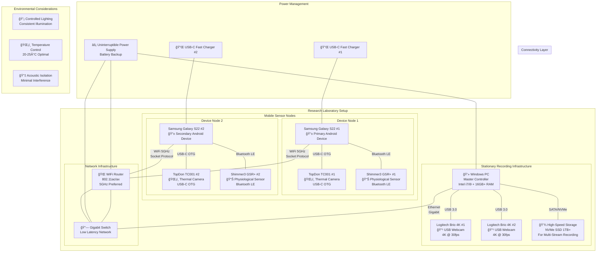

# Multi-Sensor Recording System - Comprehensive Architecture Diagrams

## Table of Contents

1. [Hardware Setup Architecture](#hardware-setup-architecture)
2. [Android App Architecture](#android-app-architecture)
3. [PC App Architecture](#pc-app-architecture)
4. [Complete Data Flow Architecture](#complete-data-flow-architecture)
5. [Synchronization Flow](#synchronization-flow)
6. [Networking Architecture](#networking-architecture)
7. [Data Collection Flow](#data-collection-flow)
8. [Session Management Flow](#session-management-flow)
9. [Individual Sensor Integration](#individual-sensor-integration)
10. [Camera2 Image Processing Flow](#camera2-image-processing-flow)
11. [Data File System Architecture](#data-file-system-architecture)
12. [Data Export Workflow](#data-export-workflow)
13. [Layer Architecture](#layer-architecture)
14. [Software Architecture of Android](#software-architecture-of-android)
15. [Software Architecture of PC App](#software-architecture-of-pc-app)
16. [Software Installation Flow](#software-installation-flow)
17. [System Architecture Deployment Flow](#system-architecture-deployment-flow)
18. [Testing Architecture](#testing-architecture)

---

## Hardware Setup Architecture

This diagram illustrates the physical hardware configuration and connectivity between all components in the multi-sensor recording system.

## Android App Architecture

Enhanced architecture diagram showing the complete Android application structure with detailed component interactions.

## PC App Architecture

Comprehensive architecture diagram for the Python desktop controller application.

```mermaid
graph TB
    subgraph "Python Desktop Controller Architecture"
        subgraph "Application Layer"
            subgraph "Main Entry Point"
                APP[application.py<br/>🚀 Main Application Entry<br/>PyQt5 Application Lifecycle]
                MAIN[main.py<br/>📋 Alternative Entry Point<br/>Command Line Interface]
            end
            
            subgraph "Enhanced UI Components"
                EUI[enhanced_main_with_web.py<br/>🌠Web-Enhanced Interface<br/>Modern UI Components]
                DUI[demo_enhanced_ui.py<br/>🨠UI Demonstration<br/>Component Showcase]
            end
        end
        
        subgraph "Presentation Layer"
            subgraph "PyQt5 GUI Framework"
                MW[MainWindow<br/>ğŸ–¼ï¸ Primary Window<br/>Tab-based Interface]
                RT[RecordingTab<br/>🬠Recording Controls<br/>Session Management]
                DT[DevicesTab<br/>📱 Device Connections<br/>Status Monitoring]
                CT[CalibrationTab<br/>🯠Camera Calibration<br/>Quality Assessment]
                FT[FilesTab<br/>📠Data Management<br/>Export Controls]
            end
            
            subgraph "Common UI Components"
                MB[ModernButton<br/>🔘 Standardized Buttons<br/>Hover Effects & Theming]
                SI[StatusIndicator<br/>🚥 Visual Status Display<br/>Color-coded Feedback]
                PI[ProgressIndicator<br/>📊 Operation Progress<br/>Real-time Updates]
                CMgr[ConnectionManager<br/>🔗 Device Connection UI<br/>Unified Controls]
            end
        end
        
        subgraph "Business Logic Layer"
            subgraph "Camera Management"
                WM[WebcamManager<br/>📹 USB Camera Control<br/>Multi-camera Support]
                DWS[DualWebcamSystem<br/>ğŸ‘ï¸ Dual Camera Coordination<br/>Synchronized Capture]
                CAM[CameraController<br/>🮠Camera Operations<br/>Settings Management]
                REC[RecordingPipeline<br/>ğŸï¸ Video Processing<br/>Encoding & Storage]
            end
            
            subgraph "Calibration System"
                CM[CalibrationManager<br/>📠Complete Implementation<br/>Pattern Detection]
                CP[CalibrationProcessor<br/>🧮 OpenCV Integration<br/>Mathematical Processing]
                CQA[CalibrationQualityAssessment<br/>✅ Quality Metrics<br/>Coverage Analysis]
                CR[CalibrationResult<br/>📊 Result Management<br/>Validation & Storage]
                CDCC[CrossDeviceCalibrationCoordinator<br/>🔄 Multi-device Coordination<br/>Synchronized Calibration]
            end
            
            subgraph "Shimmer Integration"
                SM[ShimmerManager<br/>📡 Multi-Library Support<br/>Bluetooth Integration]
                SPC[ShimmerPCIntegration<br/>💻 PC Direct Connection<br/>Serial Communication]
                SB[ShimmerBluetooth<br/>📶 Bluetooth Protocol<br/>Direct Device Connection]
                SA[ShimmerAndroid<br/>📱 Android Mediated<br/>Indirect Connection]
                SD[ShimmerDataProcessor<br/>📈 Stream Processing<br/>Real-time Analysis]
            end
        end
        
        subgraph "Network & Communication Layer"
            subgraph "Session Management"
                SMgr[SessionManager<br/>📋 Socket Server<br/>Multi-device Coordination]
                NCH[NetworkCommunicationHandler<br/>🌠Protocol Implementation<br/>Message Processing]
                DS[DeviceService<br/>🔧 Device Lifecycle<br/>Connection Management]
            end
            
            subgraph "Protocol Implementation"
                JSON[JSONProtocolHandler<br/>📄 Message Serialization<br/>Command Processing]
                WS[WebSocketHandler<br/>🔌 WebSocket Communication<br/>Real-time Streaming]
                TCP[TCPSocketManager<br/>🌠TCP Socket Management<br/>Reliable Communication]
            end
        end
        
        subgraph "Data Processing Layer"
            subgraph "Core Processing"
                DP[DataProcessor<br/>âš™ï¸ Multi-modal Processing<br/>Data Transformation]
                SYNC[SynchronizationEngine<br/>â±ï¸ Temporal Alignment<br/>Microsecond Precision]
                EXP[DataExporter<br/>📤 Export Pipeline<br/>Multiple Formats]
            end
            
            subgraph "Advanced Processing"
                CV[ComputerVision<br/>ğŸ‘ï¸ OpenCV Integration<br/>Image Analysis]
                ML[MachineLearning<br/>🤖 Data Analysis<br/>Pattern Recognition]
                STIM[StimulusController<br/>🯠Experimental Control<br/>Timing Precision]
            end
        end
        
        subgraph "Infrastructure Layer"
            subgraph "System Integration"
                LOG[LoggingSystem<br/>📠Comprehensive Logging<br/>Debug & Audit Trail]
                CONFIG[ConfigurationManager<br/>âš™ï¸ Settings Management<br/>Environment Configuration]
                ERR[ErrorHandler<br/>🚨 Exception Management<br/>Recovery Mechanisms]
            end
            
            subgraph "Hardware Interface"
                USB[USBDeviceManager<br/>🔌 USB Device Detection<br/>Hardware Monitoring]
                BT[BluetoothAdapter<br/>📶 Bluetooth Management<br/>Device Discovery]
                FS[FileSystemManager<br/>💾 Storage Management<br/>Session Organization]
            end
        end
    end
    
    %% Application Flow Connections
    APP --> MW
    MAIN --> APP
    EUI --> MW
    
    MW --> RT
    MW --> DT
    MW --> CT
    MW --> FT
    
    RT --> MB
    RT --> SI
    RT --> PI
    DT --> CMgr
    
    RT --> SMgr
    DT --> WM
    CT --> CM
    FT --> EXP
    
    WM --> DWS
    DWS --> CAM
    CAM --> REC
    
    CM --> CP
    CP --> CQA
    CQA --> CR
    CM --> CDCC
    
    SMgr --> NCH
    NCH --> DS
    NCH --> JSON
    
    DS --> WS
    DS --> TCP
    
    REC --> DP
    DP --> SYNC
    SYNC --> EXP
    
    CP --> CV
    STIM --> ML
    
    SMgr --> LOG
    CM --> CONFIG
    DP --> ERR
    
    WM --> USB
    SM --> BT
    EXP --> FS
```

## Complete Data Flow Architecture

Enhanced data flow architecture showing detailed data pathways, processing stages, and synchronization mechanisms.

