# Multi-Sensor Recording System - Improved Architecture Diagrams

This document contains enhanced Mermaid diagrams following best practices for documentation clarity and visual design.

## Table of Contents Diagram

```mermaid
%%{init: {'theme':'base', 'themeVariables': { 'primaryColor': '#2E86AB', 'primaryTextColor': '#FFFFFF', 'primaryBorderColor': '#1B5E75', 'lineColor': '#333333', 'secondaryColor': '#A23B72', 'tertiaryColor': '#F18F01', 'background': '#FFFFFF', 'mainBkg': '#E8F4F8', 'secondBkg': '#F5E6F0', 'tertiaryBkg': '#FFF3E0'}}}%%
flowchart TD
    %% Main documentation structure
    START([📋 Multi-Sensor Recording System<br/>Documentation Overview]) --> ARCH[🏗️ System Architecture]
    START --> TECH[⚙️ Technical Implementation]
    START --> DEPLOY[🚀 Deployment & Operations]
    
    %% Architecture Documentation
    ARCH --> A1[📱 Hardware Setup Architecture]
    ARCH --> A2[📲 Android App Architecture] 
    ARCH --> A3[💻 PC App Architecture]
    ARCH --> A4[🔄 Complete Data Flow Architecture]
    
    %% Technical Implementation
    TECH --> T1[🌐 Networking Architecture]
    TECH --> T2[📊 Data Collection Flow]
    TECH --> T3[📁 Session Management Flow]
    TECH --> T4[💾 Data File System Architecture]
    TECH --> T5[📤 Data Export Workflow]
    
    %% System Architecture Details
    DEPLOY --> D1[🏢 Layer Architecture]
    DEPLOY --> D2[📱 Software Architecture - Android]
    DEPLOY --> D3[💻 Software Architecture - PC App]
    DEPLOY --> D4[⚡ Software Installation Flow]
    
    %% Styling for different categories
    classDef archClass fill:#2E86AB,stroke:#1B5E75,stroke-width:2px,color:#FFFFFF
    classDef techClass fill:#A23B72,stroke:#7A2B55,stroke-width:2px,color:#FFFFFF
    classDef deployClass fill:#F18F01,stroke:#D17001,stroke-width:2px,color:#FFFFFF
    classDef startClass fill:#333333,stroke:#1A1A1A,stroke-width:3px,color:#FFFFFF
    
    class START startClass
    class ARCH,A1,A2,A3,A4 archClass
    class TECH,T1,T2,T3,T4,T5 techClass
    class DEPLOY,D1,D2,D3,D4 deployClass
```

## Hardware Setup Architecture

```mermaid
%%{init: {'theme':'base', 'themeVariables': { 'primaryColor': '#2E86AB', 'primaryTextColor': '#FFFFFF', 'primaryBorderColor': '#1B5E75', 'lineColor': '#333333', 'secondaryColor': '#A23B72', 'tertiaryColor': '#F18F01', 'background': '#FFFFFF', 'mainBkg': '#E8F4F8', 'secondBkg': '#F5E6F0', 'tertiaryBkg': '#FFF3E0'}}}%%
graph TB
    subgraph LAB ["🔬 Research Laboratory Environment"]
        direction TB
        
        subgraph MOBILE ["📱 Mobile Sensor Nodes"]
            direction LR
            
            subgraph NODE1 ["🎯 Primary Node"]
                S22_1["📱 Samsung Galaxy S22<br/>• Primary Android Controller<br/>• 4K Video Recording<br/>• Real-time Processing"]
                TC001_1["🌡️ TopDon TC001<br/>• Thermal Imaging Camera<br/>• USB-C OTG Interface<br/>• 256x192 Resolution"]
                GSR_1["📊 Shimmer3 GSR+<br/>• Galvanic Skin Response<br/>• Bluetooth LE Protocol<br/>• Real-time Physiological Data"]
                
                S22_1 -.->|USB-C OTG<br/>High-Speed Data| TC001_1
                S22_1 -.->|Bluetooth LE<br/>Low Latency| GSR_1
            end
            
            subgraph NODE2 ["🎯 Secondary Node"]
                S22_2["📱 Samsung Galaxy S22<br/>• Secondary Android Controller<br/>• 4K Video Recording<br/>• Synchronized Capture"]
                TC001_2["🌡️ TopDon TC001<br/>• Thermal Imaging Camera<br/>• USB-C OTG Interface<br/>• 256x192 Resolution"]
                GSR_2["📊 Shimmer3 GSR+<br/>• Galvanic Skin Response<br/>• Bluetooth LE Protocol<br/>• Real-time Physiological Data"]
                
                S22_2 -.->|USB-C OTG<br/>High-Speed Data| TC001_2
                S22_2 -.->|Bluetooth LE<br/>Low Latency| GSR_2
            end
        end
        
        subgraph STATIONARY ["🏠 Stationary Infrastructure"]
            direction TB
            
            subgraph COMPUTE ["💻 Computing Hub"]
                PC["💻 Windows PC Master Controller<br/>• Intel i7/i9 Processor<br/>• 16GB+ RAM<br/>• Real-time Coordination<br/>• Data Aggregation"]
            end
            
            subgraph CAMERAS ["📹 USB Camera Array"]
                BRIO_1["📹 Logitech Brio 4K<br/>• Primary USB Webcam<br/>• 4K @ 30fps<br/>• Auto-focus & HDR"]
                BRIO_2["📹 Logitech Brio 4K<br/>• Secondary USB Webcam<br/>• 4K @ 30fps<br/>• Wide Field of View"]
            end
            
            subgraph STORAGE_SYS ["💾 Storage System"]
                STORAGE["💾 High-Performance Storage<br/>• NVMe SSD 1TB+<br/>• Multi-stream Recording<br/>• Backup & Redundancy"]
            end
            
            PC ---|USB 3.0<br/>High Bandwidth| BRIO_1
            PC ---|USB 3.0<br/>High Bandwidth| BRIO_2
            PC ---|SATA/NVMe<br/>Direct Access| STORAGE
        end
        
        subgraph NETWORK ["🌐 Network Infrastructure"]
            direction LR
            ROUTER["🌐 WiFi Router<br/>• 802.11ac/ax Standard<br/>• 5GHz Band Priority<br/>• QoS Management"]
            SWITCH["🔗 Gigabit Switch<br/>• Low Latency Switching<br/>• Managed Configuration<br/>• Traffic Optimization"]
            
            ROUTER ===|Ethernet<br/>Gigabit| SWITCH
        end
        
        subgraph POWER ["⚡ Power Management"]
            direction TB
            UPS["⚡ Uninterruptible Power Supply<br/>• Battery Backup System<br/>• Surge Protection<br/>• Clean Power Delivery"]
            CHARGER_1["🔌 USB-C Fast Charger<br/>• 65W Power Delivery<br/>• Always-On Charging"]
            CHARGER_2["🔌 USB-C Fast Charger<br/>• 65W Power Delivery<br/>• Always-On Charging"]
        end
        
        subgraph ENV ["🌿 Environmental Controls"]
            direction LR
            LIGHTING["💡 Controlled Lighting<br/>• Consistent Illumination<br/>• Adjustable Intensity<br/>• Color Temperature Control"]
            TEMP["🌡️ Temperature Control<br/>• 20-25°C Optimal Range<br/>• Humidity Management<br/>• Thermal Stability"]
            ACOUSTIC["🔇 Acoustic Isolation<br/>• Minimal Interference<br/>• Sound Dampening<br/>• Quiet Operation"]
        end
    end
    
    %% Network Connections
    S22_1 ==>|WiFi 5GHz<br/>JSON Socket Protocol<br/>Real-time Commands| ROUTER
    S22_2 ==>|WiFi 5GHz<br/>JSON Socket Protocol<br/>Real-time Commands| ROUTER
    PC ==>|Ethernet Gigabit<br/>Master Controller<br/>Data Aggregation| SWITCH
    
    %% Power Connections
    UPS -.->|Clean Power<br/>Backup Protection| PC
    UPS -.->|Clean Power<br/>Network Stability| ROUTER
    UPS -.->|Clean Power<br/>Network Stability| SWITCH
    CHARGER_1 -.->|Continuous Power<br/>65W Fast Charge| S22_1
    CHARGER_2 -.->|Continuous Power<br/>65W Fast Charge| S22_2
    
    %% Environmental Impact
    LIGHTING -.->|Optimal Illumination| NODE1
    LIGHTING -.->|Optimal Illumination| NODE2
    LIGHTING -.->|Optimal Illumination| CAMERAS
    TEMP -.->|Thermal Stability| COMPUTE
    ACOUSTIC -.->|Noise Reduction| LAB
    
    %% Styling
    classDef mobileClass fill:#2E86AB,stroke:#1B5E75,stroke-width:2px,color:#FFFFFF
    classDef stationaryClass fill:#A23B72,stroke:#7A2B55,stroke-width:2px,color:#FFFFFF
    classDef networkClass fill:#F18F01,stroke:#D17001,stroke-width:2px,color:#FFFFFF
    classDef infraClass fill:#28A745,stroke:#1E7E34,stroke-width:2px,color:#FFFFFF
    
    class S22_1,S22_2,TC001_1,TC001_2,GSR_1,GSR_2 mobileClass
    class PC,BRIO_1,BRIO_2,STORAGE stationaryClass
    class ROUTER,SWITCH networkClass
    class UPS,CHARGER_1,CHARGER_2,LIGHTING,TEMP,ACOUSTIC infraClass
```

## Android App Architecture

```mermaid
%%{init: {'theme':'base', 'themeVariables': { 'primaryColor': '#2E86AB', 'primaryTextColor': '#FFFFFF', 'primaryBorderColor': '#1B5E75', 'lineColor': '#333333', 'secondaryColor': '#A23B72', 'tertiaryColor': '#F18F01', 'background': '#FFFFFF', 'mainBkg': '#E8F4F8', 'secondBkg': '#F5E6F0', 'tertiaryBkg': '#FFF3E0'}}}%%
graph TB
    subgraph ANDROID ["📱 Android Application Clean Architecture"]
        direction TB
        
        subgraph PRESENTATION ["🎨 Presentation Layer - UI & User Interaction"]
            direction TB
            
            subgraph ACTIVITIES ["📱 Activities & Fragments"]
                MA["🏠 MainActivity<br/>• Main UI Orchestrator<br/>• Fragment Navigation<br/>• Lifecycle Management"]
                RF["📹 RecordingFragment<br/>• Recording Controls UI<br/>• Real-time Status Display<br/>• User Interaction Handler"]
                DF["📱 DevicesFragment<br/>• Device Management UI<br/>• Connection Status Display<br/>• Pairing Interface"]
                CF["🎯 CalibrationFragment<br/>• Sensor Calibration UI<br/>• Validation Controls<br/>• Configuration Interface"]
                FF["📁 FilesFragment<br/>• File Management UI<br/>• Browse Recordings<br/>• Export Controls"]
            end
            
            subgraph VIEWMODELS ["🧠 ViewModels & State Management"]
                MVM["🧠 MainViewModel<br/>• UI State Coordination<br/>• LiveData Management<br/>• Event Handling"]
                RSM["📊 RecordingStateManager<br/>• Recording State Logic<br/>• Status Broadcasting<br/>• Error Handling"]
                DSM["🔗 DeviceStateManager<br/>• Device Connection States<br/>• Health Monitoring<br/>• Status Updates"]
            end
            
            subgraph UI_UTILS ["🛠️ UI Utilities & Navigation"]
                UC["🎨 UIController<br/>• Component Validation<br/>• Dynamic UI Updates<br/>• Theme Management"]
                NU["🧭 NavigationUtils<br/>• Fragment Navigation<br/>• Deep Linking<br/>• Back Stack Management"]
                UU["🛠️ UIUtils<br/>• Helper Functions<br/>• UI Animations<br/>• Resource Management"]
                MAC["⚡ MainActivityCoordinator<br/>• Activity Coordination<br/>• Event Distribution<br/>• State Synchronization"]
            end
        end
        
        subgraph DOMAIN ["🏗️ Domain Layer - Business Logic & Use Cases"]
            direction TB
            
            subgraph RECORDING ["📹 Recording Components"]
                CR["📷 CameraRecorder<br/>• Camera2 API Integration<br/>• 4K Video + RAW Capture<br/>• Concurrent Recording"]
                TR["🌡️ ThermalRecorder<br/>• TopDon SDK Integration<br/>• Thermal Image Processing<br/>• Real-time Capture"]
                SR["📊 ShimmerRecorder<br/>• Bluetooth GSR Integration<br/>• Physiological Data Collection<br/>• Real-time Streaming"]
            end
            
            subgraph SESSION ["📋 Session Management"]
                SM["📋 SessionManager<br/>• Recording Session Logic<br/>• Lifecycle Coordination<br/>• State Persistence"]
                SI["ℹ️ SessionInfo<br/>• Session Metadata<br/>• Status Tracking<br/>• Configuration Storage"]
                SS["📈 SensorSample<br/>• Data Point Abstraction<br/>• Timestamp Synchronization<br/>• Format Standardization"]
            end
            
            subgraph COMMUNICATION ["🔗 Communication Layer"]
                PCH["🔗 PCCommunicationHandler<br/>• PC Socket Communication<br/>• Command Processing<br/>• Protocol Implementation"]
                CM["🌐 ConnectionManager<br/>• Network Management<br/>• Reconnection Logic<br/>• Health Monitoring"]
                PS["📡 PreviewStreamer<br/>• Live Preview Streaming<br/>• Real-time Transmission<br/>• Quality Management"]
            end
        end
        
        subgraph DATA ["💾 Data Layer - Storage & Device Integration"]
            direction TB
            
            subgraph DEVICE_MGT ["📱 Device Management"]
                DST["📊 DeviceStatusTracker<br/>• Multi-Device Status<br/>• Health Monitoring<br/>• Performance Metrics"]
                BM["📶 BluetoothManager<br/>• Bluetooth LE Connectivity<br/>• Shimmer Integration<br/>• Pairing Management"]
                UM["🔌 USBManager<br/>• USB-C OTG Management<br/>• Thermal Camera Control<br/>• Device Detection"]
            end
            
            subgraph STORAGE ["💾 Storage & Persistence"]
                FS["💾 FileSystemManager<br/>• Local Storage Management<br/>• Session Organization<br/>• File Hierarchy"]
                MS["📝 MetadataSerializer<br/>• JSON Serialization<br/>• Session Persistence<br/>• Data Integrity"]
                CS["⚙️ ConfigurationStore<br/>• Settings Persistence<br/>• Shared Preferences<br/>• Configuration Management"]
            end
        end
        
        subgraph INFRASTRUCTURE ["🔧 Infrastructure Layer - Platform Integration"]
            direction TB
            
            subgraph ANDROID_FW ["🤖 Android Framework Integration"]
                CAM2["📸 Camera2 API<br/>• Low-level Camera Control<br/>• Concurrent Capture<br/>• Hardware Acceleration"]
                BLE["📡 Bluetooth LE API<br/>• Low Energy Communication<br/>• Shimmer Protocol<br/>• Connection Management"]
                NET["🌐 Network API<br/>• Socket Communication<br/>• OkHttp Integration<br/>• Connection Pooling"]
            end
            
            subgraph HARDWARE ["🔧 Hardware Abstraction"]
                HAL["🔧 Hardware Abstraction Layer<br/>• Device-specific Adaptations<br/>• Platform Compatibility<br/>• Driver Integration"]
                PERM["🔐 Permission Manager<br/>• Runtime Permissions<br/>• Security Enforcement<br/>• Access Control"]
                LIFE["♻️ Lifecycle Manager<br/>• Component Lifecycle<br/>• Resource Management<br/>• Memory Optimization"]
            end
        end
    end
    
    %% Layer Interactions - Presentation to Domain
    MA ==>|User Actions<br/>Navigation Events| MVM
    MVM ==>|Business Logic<br/>State Updates| SM
    RF ==>|Recording Commands<br/>UI Events| RSM
    DF ==>|Device Commands<br/>Status Requests| DSM
    CF ==>|Calibration Requests<br/>Configuration| CM
    FF ==>|File Operations<br/>Data Access| FS
    
    %% Domain Layer Internal Connections
    MVM ==>|Recording Control<br/>Session Management| CR
    MVM ==>|Thermal Control<br/>Image Processing| TR
    MVM ==>|GSR Control<br/>Data Streaming| SR
    SM ==>|Session Coordination<br/>State Management| SI
    CR ==>|Data Communication<br/>Status Updates| PCH
    TR ==>|Data Communication<br/>Status Updates| PCH
    SR ==>|Data Communication<br/>Status Updates| PCH
    PCH ==>|Network Management<br/>Connection Control| CM
    CR ==>|Preview Streaming<br/>Real-time Data| PS
    PS ==>|Network Transmission<br/>Stream Management| CM
    
    %% Data Layer Connections
    DSM ==>|Device Status<br/>Health Monitoring| DST
    BM ==>|Bluetooth Status<br/>Connection State| DST
    UM ==>|USB Status<br/>Device Detection| DST
    SM ==>|Session Data<br/>Metadata Storage| MS
    MS ==>|File Operations<br/>Data Persistence| FS
    CS ==>|Configuration Data<br/>Settings Storage| FS
    
    %% Infrastructure Layer Support
    CR ==>|Camera Control<br/>Hardware Access| CAM2
    SR ==>|Bluetooth Communication<br/>Data Transfer| BLE
    PCH ==>|Network Communication<br/>Socket Operations| NET
    HAL ==>|Platform Adaptation<br/>Hardware Abstraction| CAM2
    HAL ==>|Platform Adaptation<br/>Hardware Abstraction| BLE
    PERM ==>|Security Enforcement<br/>Access Control| HAL
    LIFE ==>|Resource Management<br/>Lifecycle Control| HAL
    
    %% UI Coordination
    MA ==>|UI Control<br/>Component Management| UC
    UC ==>|Activity Coordination<br/>Event Distribution| MAC
    MAC ==>|Navigation Control<br/>Fragment Management| NU
    NU ==>|UI Utilities<br/>Helper Functions| UU
    
    %% Styling
    classDef presentationClass fill:#2E86AB,stroke:#1B5E75,stroke-width:2px,color:#FFFFFF
    classDef domainClass fill:#A23B72,stroke:#7A2B55,stroke-width:2px,color:#FFFFFF
    classDef dataClass fill:#F18F01,stroke:#D17001,stroke-width:2px,color:#FFFFFF
    classDef infraClass fill:#28A745,stroke:#1E7E34,stroke-width:2px,color:#FFFFFF
    
    class MA,RF,DF,CF,FF,MVM,RSM,DSM,UC,NU,UU,MAC presentationClass
    class CR,TR,SR,SM,SI,SS,PCH,CM,PS domainClass
    class DST,BM,UM,FS,MS,CS dataClass
    class CAM2,BLE,NET,HAL,PERM,LIFE infraClass
```

## PC App Architecture

```mermaid
%%{init: {'theme':'base', 'themeVariables': { 'primaryColor': '#2E86AB', 'primaryTextColor': '#FFFFFF', 'primaryBorderColor': '#1B5E75', 'lineColor': '#333333', 'secondaryColor': '#A23B72', 'tertiaryColor': '#F18F01', 'background': '#FFFFFF', 'mainBkg': '#E8F4F8', 'secondBkg': '#F5E6F0', 'tertiaryBkg': '#FFF3E0'}}}%%
graph TB
    subgraph PC_APP ["💻 PC Application Architecture - Python & PyQt5"]
        direction TB
        
        subgraph UI_LAYER ["🎨 User Interface Layer - PyQt5 Framework"]
            direction TB
            
            subgraph MAIN_UI ["🏠 Main Application Windows"]
                MW["🏠 MainWindow<br/>• Primary Application Window<br/>• Menu Bar & Toolbar<br/>• Status Bar Management<br/>• Central Widget Coordination"]
                DW["📊 DeviceWindow<br/>• Device Management Interface<br/>• Real-time Status Display<br/>• Connection Control Panel<br/>• Health Monitoring Dashboard"]
                RW["📹 RecordingWindow<br/>• Recording Control Interface<br/>• Live Preview Management<br/>• Session Configuration<br/>• Progress Monitoring"]
                CW["🎯 CalibrationWindow<br/>• Sensor Calibration Interface<br/>• Validation Controls<br/>• Configuration Management<br/>• Quality Assurance Tools"]
            end
            
            subgraph WIDGETS ["🧩 Custom Widgets & Components"]
                PW["📡 PreviewWidget<br/>• Live Video Preview<br/>• Multi-stream Display<br/>• Real-time Rendering<br/>• Quality Controls"]
                SW["📊 StatusWidget<br/>• System Status Display<br/>• Performance Metrics<br/>• Alert Management<br/>• Health Indicators"]
                LW["📋 LogWidget<br/>• Application Logging<br/>• Event History<br/>• Debug Information<br/>• Error Tracking"]
                FW["📁 FileWidget<br/>• File Management Interface<br/>• Session Browser<br/>• Export Controls<br/>• Metadata Display"]
            end
        end
        
        subgraph BUSINESS ["🏗️ Business Logic Layer - Core Application Logic"]
            direction TB
            
            subgraph CONTROLLERS ["🎮 Control Components"]
                AC["🎮 ApplicationController<br/>• Main Application Logic<br/>• Event Coordination<br/>• State Management<br/>• Command Processing"]
                DC["📱 DeviceController<br/>• Device Management Logic<br/>• Connection Orchestration<br/>• Status Monitoring<br/>• Command Distribution"]
                RC["📹 RecordingController<br/>• Recording Session Logic<br/>• Multi-stream Coordination<br/>• Quality Management<br/>• Error Recovery"]
                CC["🎯 CalibrationController<br/>• Calibration Process Logic<br/>• Validation Algorithms<br/>• Configuration Management<br/>• Quality Assurance"]
            end
            
            subgraph MANAGERS ["📋 Management Services"]
                SM["📋 SessionManager<br/>• Session Lifecycle Management<br/>• Metadata Coordination<br/>• State Persistence<br/>• Archive Management"]
                DM["📱 DeviceManager<br/>• Multi-device Coordination<br/>• Health Monitoring<br/>• Connection Pool Management<br/>• Error Handling"]
                FM["📁 FileManager<br/>• File System Management<br/>• Storage Organization<br/>• Backup Coordination<br/>• Cleanup Operations"]
                NM["🌐 NetworkManager<br/>• Network Communication<br/>• Socket Management<br/>• Protocol Handling<br/>• Reconnection Logic"]
            end
        end
        
        subgraph DATA_LAYER ["💾 Data Access Layer - Storage & Communication"]
            direction TB
            
            subgraph COMMUNICATION ["🔗 Communication Services"]
                SocketServer["🔗 SocketServer<br/>• TCP Socket Management<br/>• Client Connection Handling<br/>• Protocol Implementation<br/>• Message Routing"]
                CommandProcessor["⚡ CommandProcessor<br/>• Command Parsing & Validation<br/>• Response Generation<br/>• Error Handling<br/>• Protocol Compliance"]
                DataStreamer["📡 DataStreamer<br/>• Real-time Data Streaming<br/>• Multi-client Broadcasting<br/>• Quality of Service<br/>• Buffer Management"]
            end
            
            subgraph STORAGE ["💾 Storage Services"]
                FileHandler["📁 FileHandler<br/>• File I/O Operations<br/>• Directory Management<br/>• Metadata Storage<br/>• Version Control"]
                DatabaseManager["🗃️ DatabaseManager<br/>• SQLite Integration<br/>• Session Metadata<br/>• Query Optimization<br/>• Data Integrity"]
                ConfigManager["⚙️ ConfigManager<br/>• Configuration Storage<br/>• Settings Persistence<br/>• Default Management<br/>• Validation"]
            end
            
            subgraph SENSORS ["📊 Sensor Integration"]
                CameraHandler["📹 CameraHandler<br/>• USB Camera Integration<br/>• OpenCV Processing<br/>• Frame Capture<br/>• Quality Control"]
                DataCollector["📊 DataCollector<br/>• Multi-source Data Collection<br/>• Timestamp Synchronization<br/>• Format Standardization<br/>• Quality Assurance"]
                SyncManager["⏰ SyncManager<br/>• Clock Synchronization<br/>• Multi-device Timing<br/>• Latency Compensation<br/>• Drift Correction"]
            end
        end
        
        subgraph EXTERNAL ["🔌 External Dependencies & Platform Integration"]
            direction TB
            
            subgraph FRAMEWORKS ["📚 Framework Dependencies"]
                PyQt5["🖼️ PyQt5 Framework<br/>• GUI Framework<br/>• Event System<br/>• Widget Library<br/>• Platform Abstraction"]
                OpenCV["👁️ OpenCV Library<br/>• Computer Vision<br/>• Image Processing<br/>• Video Capture<br/>• Real-time Processing"]
                NumPy["🔢 NumPy Library<br/>• Numerical Computing<br/>• Array Operations<br/>• Mathematical Functions<br/>• Performance Optimization"]
            end
            
            subgraph SYSTEM ["🖥️ System Integration"]
                OS_Interface["🖥️ Operating System Interface<br/>• Windows API Integration<br/>• Process Management<br/>• Hardware Access<br/>• Resource Control"]
                HW_Interface["🔧 Hardware Interface<br/>• USB Device Management<br/>• Camera Control<br/>• Network Adaptation<br/>• Driver Integration"]
                FS_Interface["💾 File System Interface<br/>• Storage Management<br/>• Directory Operations<br/>• Permissions Handling<br/>• Backup Integration"]
            end
        end
    end
    
    %% UI Layer Connections
    MW ==>|Window Management<br/>Event Coordination| AC
    DW ==>|Device Commands<br/>Status Requests| DC
    RW ==>|Recording Commands<br/>Session Control| RC
    CW ==>|Calibration Commands<br/>Configuration| CC
    
    %% Widget to Controller Connections
    PW ==>|Preview Control<br/>Display Management| RC
    SW ==>|Status Updates<br/>Health Monitoring| DC
    LW ==>|Logging Events<br/>Debug Information| AC
    FW ==>|File Operations<br/>Management Commands| FM
    
    %% Business Logic Internal Connections
    AC ==>|Application Control<br/>Global Coordination| SM
    DC ==>|Device Management<br/>Connection Control| DM
    RC ==>|Recording Management<br/>Session Control| SM
    CC ==>|Calibration Management<br/>Quality Control| DM
    SM ==>|File Operations<br/>Storage Management| FM
    DM ==>|Network Operations<br/>Communication| NM
    
    %% Data Layer Connections
    NM ==>|Socket Operations<br/>Network Management| SocketServer
    SocketServer ==>|Command Processing<br/>Message Handling| CommandProcessor
    CommandProcessor ==>|Data Distribution<br/>Client Broadcasting| DataStreamer
    SM ==>|File Operations<br/>Storage Management| FileHandler
    FM ==>|Database Operations<br/>Metadata Management| DatabaseManager
    AC ==>|Configuration Operations<br/>Settings Management| ConfigManager
    
    %% Sensor Integration
    RC ==>|Camera Control<br/>Video Capture| CameraHandler
    DataStreamer ==>|Data Collection<br/>Multi-source Integration| DataCollector
    DataCollector ==>|Synchronization<br/>Timing Control| SyncManager
    
    %% External Dependencies
    MW ==>|GUI Framework<br/>Widget Management| PyQt5
    PW ==>|GUI Framework<br/>Custom Widgets| PyQt5
    SW ==>|GUI Framework<br/>Display Components| PyQt5
    CameraHandler ==>|Computer Vision<br/>Image Processing| OpenCV
    DataCollector ==>|Numerical Operations<br/>Array Processing| NumPy
    SyncManager ==>|Mathematical Operations<br/>Time Calculations| NumPy
    
    %% System Integration
    FileHandler ==>|File System Operations<br/>Storage Access| FS_Interface
    SocketServer ==>|Network Operations<br/>Socket Management| OS_Interface
    CameraHandler ==>|Hardware Control<br/>Device Access| HW_Interface
    OS_Interface ==>|Platform Services<br/>System Resources| PyQt5
    HW_Interface ==>|Device Management<br/>Hardware Abstraction| OpenCV
    FS_Interface ==>|Storage Services<br/>File Operations| NumPy
    
    %% Styling
    classDef uiClass fill:#2E86AB,stroke:#1B5E75,stroke-width:2px,color:#FFFFFF
    classDef businessClass fill:#A23B72,stroke:#7A2B55,stroke-width:2px,color:#FFFFFF
    classDef dataClass fill:#F18F01,stroke:#D17001,stroke-width:2px,color:#FFFFFF
    classDef externalClass fill:#28A745,stroke:#1E7E34,stroke-width:2px,color:#FFFFFF
    
    class MW,DW,RW,CW,PW,SW,LW,FW uiClass
    class AC,DC,RC,CC,SM,DM,FM,NM businessClass
    class SocketServer,CommandProcessor,DataStreamer,FileHandler,DatabaseManager,ConfigManager,CameraHandler,DataCollector,SyncManager dataClass
    class PyQt5,OpenCV,NumPy,OS_Interface,HW_Interface,FS_Interface externalClass
```

## Complete Data Flow Architecture

```mermaid
%%{init: {'theme':'base', 'themeVariables': { 'primaryColor': '#2E86AB', 'primaryTextColor': '#FFFFFF', 'primaryBorderColor': '#1B5E75', 'lineColor': '#333333', 'secondaryColor': '#A23B72', 'tertiaryColor': '#F18F01', 'background': '#FFFFFF', 'mainBkg': '#E8F4F8', 'secondBkg': '#F5E6F0', 'tertiaryBkg': '#FFF3E0'}}}%%
graph TD
    subgraph COLLECTION ["📊 Multi-Modal Data Collection Architecture"]
        direction TB
        
        subgraph MOBILE_SOURCES ["📱 Mobile Data Sources"]
            direction LR
            
            subgraph DEVICE1 ["🎯 Primary Mobile Node"]
                CAM1["📷 Camera2 API<br/>• 4K Video @ 30fps<br/>• RAW Image Capture<br/>• Concurrent Streams<br/>• Hardware Acceleration"]
                THERMAL1["🌡️ TopDon Thermal<br/>• 256x192 Resolution<br/>• 30fps Thermal Imaging<br/>• Temperature Mapping<br/>• Real-time Processing"]
                GSR1["📊 Shimmer3 GSR+<br/>• Galvanic Skin Response<br/>• 1KHz Sampling Rate<br/>• Bluetooth LE Streaming<br/>• Real-time Physiological"]
            end
            
            subgraph DEVICE2 ["🎯 Secondary Mobile Node"]
                CAM2["📷 Camera2 API<br/>• 4K Video @ 30fps<br/>• RAW Image Capture<br/>• Synchronized Recording<br/>• Multi-angle Coverage"]
                THERMAL2["🌡️ TopDon Thermal<br/>• 256x192 Resolution<br/>• 30fps Thermal Imaging<br/>• Temperature Analysis<br/>• Coordinated Capture"]
                GSR2["📊 Shimmer3 GSR+<br/>• Galvanic Skin Response<br/>• 1KHz Sampling Rate<br/>• Synchronized Streaming<br/>• Physiological Monitoring"]
            end
        end
        
        subgraph STATIONARY_SOURCES ["🏠 Stationary Data Sources"]
            direction LR
            
            BRIO1["📹 Logitech Brio 4K<br/>• Primary USB Camera<br/>• 4K @ 30fps Recording<br/>• Auto-focus & HDR<br/>• Wide Field of View"]
            BRIO2["📹 Logitech Brio 4K<br/>• Secondary USB Camera<br/>• 4K @ 30fps Recording<br/>• Fixed Position<br/>• Detail Capture"]
        end
        
        subgraph AGGREGATION ["🔄 Real-time Data Aggregation Hub"]
            direction TB
            
            subgraph MOBILE_PROC ["📱 Mobile Processing"]
                ANDROID1["📱 Android App Node 1<br/>• Real-time Data Processing<br/>• Local Storage Management<br/>• Network Communication<br/>• Quality Control"]
                ANDROID2["📱 Android App Node 2<br/>• Real-time Data Processing<br/>• Synchronized Operations<br/>• Backup Recording<br/>• Status Monitoring"]
            end
            
            subgraph MASTER_CTRL ["💻 Master Controller Hub"]
                PC_CTRL["💻 PC Master Controller<br/>• Multi-stream Coordination<br/>• Real-time Synchronization<br/>• Quality Assurance<br/>• Command Distribution<br/>• Data Aggregation"]
            end
        end
        
        subgraph PROCESSING ["⚙️ Real-time Processing Pipeline"]
            direction TB
            
            subgraph SYNC_LAYER ["⏰ Synchronization Layer"]
                MASTER_CLOCK["⏰ Master Clock Synchronizer<br/>• Global Time Reference<br/>• Drift Compensation<br/>• Latency Calculation<br/>• Precision Timing"]
                SYNC_ENGINE["🔄 Synchronization Engine<br/>• Multi-stream Alignment<br/>• Timestamp Correction<br/>• Buffer Management<br/>• Quality Monitoring"]
            end
            
            subgraph QUALITY_CTRL ["✅ Quality Control Layer"]
                QC_ENGINE["✅ Quality Control Engine<br/>• Data Validation<br/>• Error Detection<br/>• Integrity Checking<br/>• Performance Monitoring"]
                REDUNDANCY["🔄 Redundancy Manager<br/>• Backup Data Streams<br/>• Failover Handling<br/>• Recovery Mechanisms<br/>• Continuity Assurance"]
            end
        end
        
        subgraph STORAGE ["💾 Multi-tier Storage Architecture"]
            direction TB
            
            subgraph LOCAL_STORAGE ["💾 Local Storage Tier"]
                MOBILE_STORAGE["📱 Mobile Local Storage<br/>• Device-specific Storage<br/>• Session Organization<br/>• Temporary Buffering<br/>• Quick Access"]
                PC_STORAGE["💻 PC Primary Storage<br/>• High-speed NVMe SSD<br/>• Master Data Repository<br/>• Real-time Writing<br/>• Performance Optimization"]
            end
            
            subgraph BACKUP_TIER ["🔄 Backup & Archive Tier"]
                BACKUP_STORAGE["💾 Backup Storage<br/>• Redundant Data Copies<br/>• Automated Backup<br/>• Version Control<br/>• Disaster Recovery"]
                ARCHIVE_STORAGE["📚 Archive Storage<br/>• Long-term Retention<br/>• Compressed Storage<br/>• Metadata Indexing<br/>• Research Database"]
            end
        end
        
        subgraph EXPORT ["📤 Data Export & Analysis Pipeline"]
            direction LR
            
            EXPORT_ENGINE["📤 Export Engine<br/>• Multi-format Export<br/>• Quality Assurance<br/>• Compression Optimization<br/>• Delivery Management"]
            ANALYSIS_PREP["📊 Analysis Preparation<br/>• Data Preprocessing<br/>• Format Conversion<br/>• Annotation Integration<br/>• Research Ready Output"]
        end
    end
    
    %% Data Flow from Sources to Mobile Processing
    CAM1 ==>|Video Stream<br/>4K @ 30fps<br/>Real-time| ANDROID1
    THERMAL1 ==>|Thermal Data<br/>256x192 @ 30fps<br/>USB-C| ANDROID1
    GSR1 ==>|Physiological Data<br/>1KHz Sampling<br/>Bluetooth LE| ANDROID1
    
    CAM2 ==>|Video Stream<br/>4K @ 30fps<br/>Synchronized| ANDROID2
    THERMAL2 ==>|Thermal Data<br/>256x192 @ 30fps<br/>USB-C| ANDROID2
    GSR2 ==>|Physiological Data<br/>1KHz Sampling<br/>Bluetooth LE| ANDROID2
    
    %% Stationary Sources to Master Controller
    BRIO1 ==>|Video Stream<br/>4K @ 30fps<br/>USB 3.0| PC_CTRL
    BRIO2 ==>|Video Stream<br/>4K @ 30fps<br/>USB 3.0| PC_CTRL
    
    %% Mobile to Master Controller Communication
    ANDROID1 ==>|Processed Data<br/>JSON Protocol<br/>WiFi 5GHz| PC_CTRL
    ANDROID2 ==>|Processed Data<br/>JSON Protocol<br/>WiFi 5GHz| PC_CTRL
    
    %% Master Controller to Synchronization
    PC_CTRL ==>|Multi-stream Data<br/>Real-time Coordination<br/>Command Distribution| MASTER_CLOCK
    MASTER_CLOCK ==>|Synchronized Timing<br/>Global Time Reference<br/>Precision Control| SYNC_ENGINE
    
    %% Synchronization to Quality Control
    SYNC_ENGINE ==>|Aligned Data Streams<br/>Timestamp Corrected<br/>Buffer Managed| QC_ENGINE
    QC_ENGINE ==>|Validated Data<br/>Quality Assured<br/>Error Corrected| REDUNDANCY
    
    %% Processing to Storage
    ANDROID1 ==>|Local Data<br/>Device Storage<br/>Session Files| MOBILE_STORAGE
    ANDROID2 ==>|Local Data<br/>Device Storage<br/>Session Files| MOBILE_STORAGE
    REDUNDANCY ==>|Master Data<br/>High-speed Write<br/>Real-time Storage| PC_STORAGE
    
    %% Storage Tier Management
    PC_STORAGE ==>|Automated Backup<br/>Redundant Copies<br/>Version Control| BACKUP_STORAGE
    BACKUP_STORAGE ==>|Long-term Archive<br/>Compressed Storage<br/>Research Database| ARCHIVE_STORAGE
    
    %% Export Pipeline
    PC_STORAGE ==>|Source Data<br/>Session Files<br/>Metadata| EXPORT_ENGINE
    ARCHIVE_STORAGE ==>|Historical Data<br/>Research Archive<br/>Long-term Storage| EXPORT_ENGINE
    EXPORT_ENGINE ==>|Processed Output<br/>Multi-format<br/>Quality Assured| ANALYSIS_PREP
    
    %% Feedback and Control Loops
    QC_ENGINE -.->|Quality Metrics<br/>Performance Data<br/>Error Reports| PC_CTRL
    SYNC_ENGINE -.->|Timing Information<br/>Latency Data<br/>Sync Status| PC_CTRL
    PC_CTRL -.->|Control Commands<br/>Configuration Updates<br/>Status Requests| ANDROID1
    PC_CTRL -.->|Control Commands<br/>Configuration Updates<br/>Status Requests| ANDROID2
    
    %% Styling
    classDef sourceClass fill:#2E86AB,stroke:#1B5E75,stroke-width:2px,color:#FFFFFF
    classDef processingClass fill:#A23B72,stroke:#7A2B55,stroke-width:2px,color:#FFFFFF
    classDef storageClass fill:#F18F01,stroke:#D17001,stroke-width:2px,color:#FFFFFF
    classDef controlClass fill:#28A745,stroke:#1E7E34,stroke-width:2px,color:#FFFFFF
    
    class CAM1,CAM2,THERMAL1,THERMAL2,GSR1,GSR2,BRIO1,BRIO2 sourceClass
    class ANDROID1,ANDROID2,MASTER_CLOCK,SYNC_ENGINE,QC_ENGINE,REDUNDANCY processingClass
    class MOBILE_STORAGE,PC_STORAGE,BACKUP_STORAGE,ARCHIVE_STORAGE storageClass
    class PC_CTRL,EXPORT_ENGINE,ANALYSIS_PREP controlClass
```

## Networking Architecture

```mermaid
%%{init: {'theme':'base', 'themeVariables': { 'primaryColor': '#2E86AB', 'primaryTextColor': '#FFFFFF', 'primaryBorderColor': '#1B5E75', 'lineColor': '#333333', 'secondaryColor': '#A23B72', 'tertiaryColor': '#F18F01', 'background': '#FFFFFF', 'mainBkg': '#E8F4F8', 'secondBkg': '#F5E6F0', 'tertiaryBkg': '#FFF3E0'}}}%%
graph TB
    subgraph NETWORK ["🌐 Multi-Layer Network Architecture"]
        direction TB
        
        subgraph PHYSICAL ["🔌 Physical Network Infrastructure"]
            direction LR
            
            subgraph WIRED ["🔗 Wired Infrastructure"]
                ETHERNET["🔗 Gigabit Ethernet<br/>• 1000BASE-T Standard<br/>• Cat6 Cabling<br/>• Low Latency<br/>• Reliable Connection"]
                SWITCH["🔗 Managed Switch<br/>• QoS Configuration<br/>• VLAN Support<br/>• Traffic Prioritization<br/>• Performance Monitoring"]
            end
            
            subgraph WIRELESS ["📡 Wireless Infrastructure"]
                WIFI_ROUTER["📡 WiFi 6 Router<br/>• 802.11ax Standard<br/>• 5GHz Band Priority<br/>• MIMO Technology<br/>• Advanced QoS"]
                ACCESS_POINT["📡 Access Point<br/>• High Density Support<br/>• Band Steering<br/>• Load Balancing<br/>• Coverage Optimization"]
            end
        end
        
        subgraph NETWORK_LAYER ["🌐 Network Protocol Stack"]
            direction TB
            
            subgraph L3_LAYER ["🌐 Layer 3 - Network Layer"]
                IP_ROUTING["🌐 IP Routing<br/>• IPv4 Protocol<br/>• Subnet Management<br/>• Static Routes<br/>• Traffic Engineering"]
                QOS_MGMT["🚀 QoS Management<br/>• Traffic Classification<br/>• Bandwidth Allocation<br/>• Priority Queuing<br/>• Latency Control"]
            end
            
            subgraph L4_LAYER ["🔗 Layer 4 - Transport Layer"]
                TCP_MGMT["🔗 TCP Management<br/>• Reliable Transport<br/>• Connection Pooling<br/>• Flow Control<br/>• Error Recovery"]
                UDP_STREAMING["📡 UDP Streaming<br/>• Real-time Data<br/>• Low Latency<br/>• Minimal Overhead<br/>• Live Streaming"]
            end
        end
        
        subgraph APPLICATION ["📱 Application Communication Layer"]
            direction TB
            
            subgraph PROTOCOLS ["🔌 Communication Protocols"]
                JSON_SOCKET["📋 JSON Socket Protocol<br/>• Structured Data Exchange<br/>• Command-Response Pattern<br/>• Error Handling<br/>• Version Compatibility"]
                HTTP_REST["🌐 HTTP REST API<br/>• RESTful Services<br/>• Status Endpoints<br/>• Configuration API<br/>• Health Monitoring"]
                WEBSOCKET["📡 WebSocket Streaming<br/>• Real-time Communication<br/>• Bidirectional Data<br/>• Live Updates<br/>• Event Streaming"]
            end
            
            subgraph SECURITY ["🔐 Security Layer"]
                TLS_ENCRYPTION["🔐 TLS Encryption<br/>• Data Encryption<br/>• Certificate Management<br/>• Secure Channels<br/>• Identity Verification"]
                AUTH_LAYER["🔑 Authentication Layer<br/>• Device Authentication<br/>• Session Management<br/>• Access Control<br/>• Security Tokens"]
            end
        end
        
        subgraph ENDPOINTS ["📱 Network Endpoints"]
            direction LR
            
            subgraph MOBILE_ENDPOINTS ["📱 Mobile Endpoints"]
                ANDROID_1["📱 Android Device 1<br/>• WiFi 5GHz Client<br/>• JSON Socket Client<br/>• Real-time Streaming<br/>• Error Recovery"]
                ANDROID_2["📱 Android Device 2<br/>• WiFi 5GHz Client<br/>• JSON Socket Client<br/>• Synchronized Communication<br/>• Backup Channel"]
            end
            
            subgraph PC_ENDPOINT ["💻 PC Master Endpoint"]
                PC_SERVER["💻 PC Master Server<br/>• Socket Server Host<br/>• Multi-client Support<br/>• Command Dispatcher<br/>• Data Aggregator"]
            end
        end
        
        subgraph MONITORING ["📊 Network Monitoring & Management"]
            direction TB
            
            subgraph PERFORMANCE ["📈 Performance Monitoring"]
                LATENCY_MONITOR["⏱️ Latency Monitor<br/>• Round-trip Time<br/>• Jitter Measurement<br/>• Packet Loss Detection<br/>• Performance Metrics"]
                BANDWIDTH_MONITOR["📊 Bandwidth Monitor<br/>• Throughput Measurement<br/>• Utilization Tracking<br/>• Capacity Planning<br/>• Traffic Analysis"]
            end
            
            subgraph RELIABILITY ["🔄 Reliability & Recovery"]
                CONNECTION_POOL["🔗 Connection Pool Manager<br/>• Connection Reuse<br/>• Pool Size Management<br/>• Health Checking<br/>• Resource Optimization"]
                FAILOVER_MGMT["🔄 Failover Management<br/>• Automatic Recovery<br/>• Redundant Paths<br/>• Service Continuity<br/>• Graceful Degradation"]
            end
        end
    end
    
    %% Physical Layer Connections
    ETHERNET ===|Gigabit Connection<br/>Low Latency| SWITCH
    SWITCH ===|Managed Switching<br/>QoS Enabled| WIFI_ROUTER
    WIFI_ROUTER ===|Wireless Extension<br/>Coverage Optimization| ACCESS_POINT
    
    %% Network Stack Flow
    ETHERNET ==>|Physical Transport<br/>Gigabit Speed| IP_ROUTING
    ACCESS_POINT ==>|Wireless Transport<br/>WiFi 6 Speed| IP_ROUTING
    IP_ROUTING ==>|Network Routing<br/>Traffic Management| QOS_MGMT
    QOS_MGMT ==>|Quality Assurance<br/>Priority Handling| TCP_MGMT
    QOS_MGMT ==>|Real-time Streaming<br/>Low Latency| UDP_STREAMING
    
    %% Transport to Application
    TCP_MGMT ==>|Reliable Transport<br/>Connection Management| JSON_SOCKET
    TCP_MGMT ==>|HTTP Transport<br/>RESTful Services| HTTP_REST
    UDP_STREAMING ==>|Real-time Transport<br/>Live Streaming| WEBSOCKET
    
    %% Security Integration
    JSON_SOCKET ==>|Secure Communication<br/>Encrypted Channels| TLS_ENCRYPTION
    HTTP_REST ==>|Secure API Access<br/>HTTPS Protocol| TLS_ENCRYPTION
    TLS_ENCRYPTION ==>|Authentication<br/>Access Control| AUTH_LAYER
    
    %% Endpoint Connections
    AUTH_LAYER ==>|Authenticated Access<br/>Secure Channels| ANDROID_1
    AUTH_LAYER ==>|Authenticated Access<br/>Secure Channels| ANDROID_2
    AUTH_LAYER ==>|Server Access<br/>Master Control| PC_SERVER
    
    %% Monitoring Integration
    QOS_MGMT ==>|Performance Data<br/>Quality Metrics| LATENCY_MONITOR
    TCP_MGMT ==>|Connection Metrics<br/>Throughput Data| BANDWIDTH_MONITOR
    JSON_SOCKET ==>|Connection Management<br/>Pool Optimization| CONNECTION_POOL
    AUTH_LAYER ==>|Service Management<br/>Recovery Control| FAILOVER_MGMT
    
    %% Feedback Loops
    LATENCY_MONITOR -.->|Performance Feedback<br/>Optimization Data| QOS_MGMT
    BANDWIDTH_MONITOR -.->|Capacity Information<br/>Traffic Patterns| IP_ROUTING
    CONNECTION_POOL -.->|Pool Status<br/>Resource Metrics| TCP_MGMT
    FAILOVER_MGMT -.->|Recovery Status<br/>Health Information| AUTH_LAYER
    
    %% Styling
    classDef physicalClass fill:#2E86AB,stroke:#1B5E75,stroke-width:2px,color:#FFFFFF
    classDef networkClass fill:#A23B72,stroke:#7A2B55,stroke-width:2px,color:#FFFFFF
    classDef applicationClass fill:#F18F01,stroke:#D17001,stroke-width:2px,color:#FFFFFF
    classDef endpointClass fill:#28A745,stroke:#1E7E34,stroke-width:2px,color:#FFFFFF
    classDef monitoringClass fill:#6C757D,stroke:#495057,stroke-width:2px,color:#FFFFFF
    
    class ETHERNET,SWITCH,WIFI_ROUTER,ACCESS_POINT physicalClass
    class IP_ROUTING,QOS_MGMT,TCP_MGMT,UDP_STREAMING networkClass
    class JSON_SOCKET,HTTP_REST,WEBSOCKET,TLS_ENCRYPTION,AUTH_LAYER applicationClass
    class ANDROID_1,ANDROID_2,PC_SERVER endpointClass
    class LATENCY_MONITOR,BANDWIDTH_MONITOR,CONNECTION_POOL,FAILOVER_MGMT monitoringClass
```

## Data Collection Flow

```mermaid
%%{init: {'theme':'base', 'themeVariables': { 'primaryColor': '#2E86AB', 'primaryTextColor': '#FFFFFF', 'primaryBorderColor': '#1B5E75', 'lineColor': '#333333', 'secondaryColor': '#A23B72', 'tertiaryColor': '#F18F01', 'background': '#FFFFFF', 'mainBkg': '#E8F4F8', 'secondBkg': '#F5E6F0', 'tertiaryBkg': '#FFF3E0'}}}%%
flowchart TD
    %% Start of the data collection process
    START([🚀 Data Collection Process Start]) --> INIT_CHECK{🔍 System Initialization Check}
    
    %% Initialization and Setup Phase
    INIT_CHECK -->|✅ System Ready| DEVICE_DISCOVERY[📱 Device Discovery & Connection]
    INIT_CHECK -->|❌ System Not Ready| ERROR_INIT[❌ Initialization Error]
    ERROR_INIT --> RETRY_INIT{🔄 Retry Initialization?}
    RETRY_INIT -->|Yes| INIT_CHECK
    RETRY_INIT -->|No| ABORT[🛑 Process Aborted]
    
    %% Device Discovery and Connection
    DEVICE_DISCOVERY --> CONNECT_ANDROID[📱 Connect Android Devices]
    CONNECT_ANDROID --> CONNECT_THERMAL[🌡️ Connect Thermal Cameras]
    CONNECT_THERMAL --> CONNECT_GSR[📊 Connect GSR Sensors]
    CONNECT_GSR --> CONNECT_USB[📹 Connect USB Cameras]
    CONNECT_USB --> DEVICE_CHECK{✅ All Devices Connected?}
    
    DEVICE_CHECK -->|❌ Missing Devices| DEVICE_ERROR[❌ Device Connection Error]
    DEVICE_ERROR --> RETRY_DEVICE{🔄 Retry Device Connection?}
    RETRY_DEVICE -->|Yes| DEVICE_DISCOVERY
    RETRY_DEVICE -->|No| PARTIAL_MODE{⚠️ Continue with Available Devices?}
    PARTIAL_MODE -->|Yes| CALIBRATION
    PARTIAL_MODE -->|No| ABORT
    
    %% Calibration and Configuration Phase
    DEVICE_CHECK -->|✅ All Connected| CALIBRATION[🎯 Sensor Calibration & Configuration]
    CALIBRATION --> SYNC_SETUP[⏰ Clock Synchronization Setup]
    SYNC_SETUP --> QUALITY_CHECK[✅ Quality Assurance Check]
    QUALITY_CHECK --> CALIB_VALID{✅ Calibration Valid?}
    
    CALIB_VALID -->|❌ Calibration Failed| RECALIBRATE{🔄 Recalibrate Sensors?}
    RECALIBRATE -->|Yes| CALIBRATION
    RECALIBRATE -->|No| ABORT
    
    %% Pre-Recording Setup
    CALIB_VALID -->|✅ Calibration Success| SESSION_SETUP[📋 Session Configuration]
    SESSION_SETUP --> METADATA_SETUP[📝 Metadata Configuration]
    METADATA_SETUP --> STORAGE_PREP[💾 Storage Preparation]
    STORAGE_PREP --> RECORDING_READY{🎬 Ready to Record?}
    
    %% Recording Phase
    RECORDING_READY -->|✅ Ready| START_RECORDING[🎬 Start Multi-stream Recording]
    START_RECORDING --> PARALLEL_RECORDING[⚡ Parallel Data Collection]
    
    %% Parallel Recording Streams
    PARALLEL_RECORDING --> ANDROID_REC[📱 Android Video & Thermal Recording]
    PARALLEL_RECORDING --> GSR_REC[📊 GSR Data Streaming]
    PARALLEL_RECORDING --> USB_REC[📹 USB Camera Recording]
    PARALLEL_RECORDING --> MONITORING[📊 Real-time Monitoring]
    
    %% Real-time Monitoring and Quality Control
    MONITORING --> QUALITY_MONITOR[✅ Quality Monitoring]
    QUALITY_MONITOR --> SYNC_MONITOR[⏰ Synchronization Monitoring]
    SYNC_MONITOR --> ERROR_DETECT{❌ Errors Detected?}
    
    ERROR_DETECT -->|✅ No Errors| CONTINUE_REC{⏳ Continue Recording?}
    ERROR_DETECT -->|❌ Errors Found| ERROR_HANDLE[🔧 Error Handling]
    
    %% Error Handling During Recording
    ERROR_HANDLE --> ERROR_TYPE{🔍 Error Type Analysis}
    ERROR_TYPE -->|Minor| MINOR_FIX[🔧 Minor Fix Applied]
    ERROR_TYPE -->|Major| MAJOR_FIX[🚨 Major Error Recovery]
    ERROR_TYPE -->|Critical| EMERGENCY_STOP[🛑 Emergency Stop]
    
    MINOR_FIX --> CONTINUE_REC
    MAJOR_FIX --> RESTART_CHECK{🔄 Restart Recording?}
    RESTART_CHECK -->|Yes| START_RECORDING
    RESTART_CHECK -->|No| STOP_RECORDING
    EMERGENCY_STOP --> EMERGENCY_SAVE[💾 Emergency Data Save]
    EMERGENCY_SAVE --> DATA_RECOVERY[🔄 Data Recovery Process]
    
    %% Recording Control
    CONTINUE_REC -->|Yes| MONITORING
    CONTINUE_REC -->|No| STOP_RECORDING[🛑 Stop Recording Command]
    
    %% Post-Recording Phase
    STOP_RECORDING --> FINALIZE_DATA[📊 Finalize Data Collection]
    FINALIZE_DATA --> DATA_VALIDATION[✅ Data Validation]
    DATA_VALIDATION --> METADATA_COMPLETE[📝 Complete Metadata]
    METADATA_COMPLETE --> FILE_ORGANIZATION[📁 File Organization]
    
    %% Data Processing and Storage
    FILE_ORGANIZATION --> COMPRESSION[🗜️ Data Compression]
    COMPRESSION --> BACKUP_CREATE[💾 Create Backup Copies]
    BACKUP_CREATE --> VERIFICATION[✅ Data Verification]
    VERIFICATION --> VERIFY_CHECK{✅ Verification Successful?}
    
    VERIFY_CHECK -->|❌ Verification Failed| DATA_CORRUPTION[❌ Data Corruption Detected]
    DATA_CORRUPTION --> RECOVERY_ATTEMPT[🔄 Recovery Attempt]
    RECOVERY_ATTEMPT --> RECOVERY_SUCCESS{✅ Recovery Successful?}
    RECOVERY_SUCCESS -->|Yes| ARCHIVE_READY
    RECOVERY_SUCCESS -->|No| PARTIAL_SAVE[⚠️ Partial Data Save]
    PARTIAL_SAVE --> ARCHIVE_READY
    
    %% Archival and Completion
    VERIFY_CHECK -->|✅ Verification Success| ARCHIVE_READY[📚 Ready for Archival]
    ARCHIVE_READY --> ARCHIVE_DATA[📚 Archive Data]
    ARCHIVE_DATA --> CLEANUP[🧹 Cleanup Temporary Files]
    CLEANUP --> SESSION_REPORT[📊 Generate Session Report]
    SESSION_REPORT --> COMPLETE([✅ Data Collection Complete])
    
    %% Data Recovery Flow
    DATA_RECOVERY --> RECOVERY_ASSESS[🔍 Assess Recoverable Data]
    RECOVERY_ASSESS --> RECOVERY_POSSIBLE{✅ Recovery Possible?}
    RECOVERY_POSSIBLE -->|Yes| PARTIAL_RECOVERY[⚠️ Partial Recovery]
    RECOVERY_POSSIBLE -->|No| LOSS_REPORT[📋 Data Loss Report]
    PARTIAL_RECOVERY --> ARCHIVE_READY
    LOSS_REPORT --> COMPLETE
    
    %% Styling
    classDef startEndClass fill:#28A745,stroke:#1E7E34,stroke-width:3px,color:#FFFFFF
    classDef processClass fill:#2E86AB,stroke:#1B5E75,stroke-width:2px,color:#FFFFFF
    classDef decisionClass fill:#F18F01,stroke:#D17001,stroke-width:2px,color:#FFFFFF
    classDef errorClass fill:#DC3545,stroke:#B02A37,stroke-width:2px,color:#FFFFFF
    classDef warningClass fill:#FFC107,stroke:#E0A800,stroke-width:2px,color:#000000
    
    class START,COMPLETE startEndClass
    class DEVICE_DISCOVERY,CONNECT_ANDROID,CONNECT_THERMAL,CONNECT_GSR,CONNECT_USB,CALIBRATION,SYNC_SETUP,QUALITY_CHECK,SESSION_SETUP,METADATA_SETUP,STORAGE_PREP,START_RECORDING,PARALLEL_RECORDING,ANDROID_REC,GSR_REC,USB_REC,MONITORING,QUALITY_MONITOR,SYNC_MONITOR,STOP_RECORDING,FINALIZE_DATA,DATA_VALIDATION,METADATA_COMPLETE,FILE_ORGANIZATION,COMPRESSION,BACKUP_CREATE,VERIFICATION,ARCHIVE_DATA,CLEANUP,SESSION_REPORT processClass
    class INIT_CHECK,DEVICE_CHECK,CALIB_VALID,RECORDING_READY,CONTINUE_REC,ERROR_DETECT,ERROR_TYPE,RESTART_CHECK,VERIFY_CHECK,RECOVERY_SUCCESS,RECOVERY_POSSIBLE decisionClass
    class ERROR_INIT,DEVICE_ERROR,EMERGENCY_STOP,DATA_CORRUPTION,LOSS_REPORT,ABORT errorClass
    class PARTIAL_MODE,MINOR_FIX,MAJOR_FIX,EMERGENCY_SAVE,DATA_RECOVERY,RECOVERY_ATTEMPT,PARTIAL_SAVE,PARTIAL_RECOVERY warningClass
```

## Session Management Flow

```mermaid
%%{init: {'theme':'base', 'themeVariables': { 'primaryColor': '#2E86AB', 'primaryTextColor': '#FFFFFF', 'primaryBorderColor': '#1B5E75', 'lineColor': '#333333', 'secondaryColor': '#A23B72', 'tertiaryColor': '#F18F01', 'background': '#FFFFFF', 'mainBkg': '#E8F4F8', 'secondBkg': '#F5E6F0', 'tertiaryBkg': '#FFF3E0'}}}%%
flowchart TD
    %% Session Lifecycle Start
    START([🎬 Session Management Lifecycle]) --> SESSION_REQ[📋 Session Creation Request]
    
    %% Session Initialization
    SESSION_REQ --> VALIDATE_REQ{✅ Validate Request Parameters?}
    VALIDATE_REQ -->|❌ Invalid| REQ_ERROR[❌ Request Validation Error]
    REQ_ERROR --> ERROR_RESPONSE[📨 Error Response & Logging]
    ERROR_RESPONSE --> END_ERROR([❌ Session Creation Failed])
    
    VALIDATE_REQ -->|✅ Valid| GEN_SESSION_ID[🆔 Generate Unique Session ID]
    GEN_SESSION_ID --> CREATE_METADATA[📝 Create Session Metadata]
    CREATE_METADATA --> INIT_STORAGE[💾 Initialize Storage Structure]
    
    %% Pre-Recording Setup
    INIT_STORAGE --> DEVICE_PREP[📱 Prepare Connected Devices]
    DEVICE_PREP --> CONFIG_SENSORS[⚙️ Configure Sensor Parameters]
    CONFIG_SENSORS --> SYNC_PREP[⏰ Prepare Synchronization]
    SYNC_PREP --> QUALITY_PREP[✅ Quality Assurance Setup]
    
    %% Session State Management
    QUALITY_PREP --> SESSION_READY[✅ Session Ready State]
    SESSION_READY --> AWAIT_START{⏳ Awaiting Start Command}
    
    AWAIT_START -->|Start Command| RECORDING_STATE[🎬 Recording State Active]
    AWAIT_START -->|Cancel Command| CANCEL_SESSION[❌ Cancel Session]
    AWAIT_START -->|Timeout| TIMEOUT_HANDLE[⏰ Handle Session Timeout]
    
    %% Recording State Management
    RECORDING_STATE --> MONITOR_RECORDING[📊 Monitor Recording Progress]
    MONITOR_RECORDING --> CHECK_STATUS{🔍 Check Recording Status}
    
    CHECK_STATUS -->|Continue| MONITOR_RECORDING
    CHECK_STATUS -->|Pause Request| PAUSE_STATE[⏸️ Pause Recording State]
    CHECK_STATUS -->|Stop Request| STOP_RECORDING[⏹️ Stop Recording Command]
    CHECK_STATUS -->|Error Detected| ERROR_HANDLE[🚨 Handle Recording Error]
    
    %% Pause State Management
    PAUSE_STATE --> PAUSE_AWAIT{⏳ Paused - Awaiting Command}
    PAUSE_AWAIT -->|Resume Command| RECORDING_STATE
    PAUSE_AWAIT -->|Stop Command| STOP_RECORDING
    PAUSE_AWAIT -->|Timeout| TIMEOUT_HANDLE
    
    %% Error Handling During Recording
    ERROR_HANDLE --> ERROR_ASSESS[🔍 Assess Error Severity]
    ERROR_ASSESS --> ERROR_DECISION{⚖️ Error Recovery Decision}
    
    ERROR_DECISION -->|Recoverable| RECOVER_SESSION[🔧 Attempt Session Recovery]
    ERROR_DECISION -->|Non-recoverable| EMERGENCY_STOP[🛑 Emergency Session Stop]
    
    RECOVER_SESSION --> RECOVERY_CHECK{✅ Recovery Successful?}
    RECOVERY_CHECK -->|Yes| RECORDING_STATE
    RECOVERY_CHECK -->|No| EMERGENCY_STOP
    
    %% Session Termination
    STOP_RECORDING --> FINALIZE_SESSION[📊 Finalize Session Data]
    EMERGENCY_STOP --> EMERGENCY_SAVE[💾 Emergency Data Preservation]
    CANCEL_SESSION --> CLEANUP_CANCELLED[🧹 Cleanup Cancelled Session]
    TIMEOUT_HANDLE --> TIMEOUT_SAVE[💾 Save Timeout Session Data]
    
    %% Data Finalization
    FINALIZE_SESSION --> PROCESS_DATA[⚙️ Process Collected Data]
    EMERGENCY_SAVE --> PROCESS_DATA
    TIMEOUT_SAVE --> PROCESS_DATA
    
    PROCESS_DATA --> VALIDATE_DATA[✅ Validate Session Data]
    VALIDATE_DATA --> DATA_QUALITY{✅ Data Quality Check}
    
    DATA_QUALITY -->|✅ Quality OK| ARCHIVE_SESSION[📚 Archive Session]
    DATA_QUALITY -->|⚠️ Quality Issues| QUALITY_REPORT[📋 Generate Quality Report]
    DATA_QUALITY -->|❌ Data Corrupted| CORRUPTION_HANDLE[🚨 Handle Data Corruption]
    
    %% Quality Issue Handling
    QUALITY_REPORT --> PARTIAL_ARCHIVE[📚 Partial Session Archive]
    CORRUPTION_HANDLE --> RECOVERY_ATTEMPT[🔄 Attempt Data Recovery]
    RECOVERY_ATTEMPT --> RECOVERY_RESULT{✅ Recovery Result}
    
    RECOVERY_RESULT -->|Success| PARTIAL_ARCHIVE
    RECOVERY_RESULT -->|Failure| FAILED_SESSION[❌ Mark Session as Failed]
    
    %% Archival Process
    ARCHIVE_SESSION --> UPDATE_INDEX[📇 Update Session Index]
    PARTIAL_ARCHIVE --> UPDATE_INDEX
    FAILED_SESSION --> UPDATE_INDEX
    
    UPDATE_INDEX --> GEN_REPORT[📊 Generate Session Report]
    GEN_REPORT --> NOTIFY_COMPLETION[📨 Notify Session Completion]
    
    %% Cleanup and Completion
    NOTIFY_COMPLETION --> CLEANUP_TEMP[🧹 Cleanup Temporary Files]
    CLEANUP_CANCELLED --> CLEANUP_TEMP
    
    CLEANUP_TEMP --> RELEASE_RESOURCES[♻️ Release System Resources]
    RELEASE_RESOURCES --> SESSION_COMPLETE[✅ Session Lifecycle Complete]
    SESSION_COMPLETE --> END_SUCCESS([✅ Session Management Complete])
    
    %% Session State Tracking
    subgraph STATE_TRACKING ["📊 Session State Tracking"]
        direction LR
        CREATED[📝 Created] --> INITIALIZED[🎯 Initialized]
        INITIALIZED --> READY[✅ Ready]
        READY --> ACTIVE[🎬 Active]
        ACTIVE --> PAUSED[⏸️ Paused]
        PAUSED --> ACTIVE
        ACTIVE --> STOPPING[⏹️ Stopping]
        STOPPING --> COMPLETED[✅ Completed]
        ACTIVE --> ERROR_STATE[❌ Error]
        ERROR_STATE --> RECOVERY[🔧 Recovery]
        RECOVERY --> ACTIVE
        RECOVERY --> FAILED[❌ Failed]
    end
    
    %% Metadata Management
    subgraph METADATA_MGMT ["📝 Metadata Management"]
        direction TB
        SESSION_META[📋 Session Metadata<br/>• Session ID<br/>• Timestamps<br/>• Configuration<br/>• Participants]
        DEVICE_META[📱 Device Metadata<br/>• Device Information<br/>• Sensor Configuration<br/>• Calibration Data<br/>• Status History]
        DATA_META[📊 Data Metadata<br/>• File Information<br/>• Quality Metrics<br/>• Processing History<br/>• Validation Results]
        
        SESSION_META --> DEVICE_META
        DEVICE_META --> DATA_META
    end
    
    %% Performance Monitoring
    subgraph PERFORMANCE ["📈 Performance Monitoring"]
        direction LR
        TIMING[⏱️ Timing Metrics] --> QUALITY[✅ Quality Metrics]
        QUALITY --> RESOURCES[💾 Resource Usage]
        RESOURCES --> ALERTS[🚨 Alert Management]
    end
    
    %% Styling
    classDef startEndClass fill:#28A745,stroke:#1E7E34,stroke-width:3px,color:#FFFFFF
    classDef processClass fill:#2E86AB,stroke:#1B5E75,stroke-width:2px,color:#FFFFFF
    classDef stateClass fill:#A23B72,stroke:#7A2B55,stroke-width:2px,color:#FFFFFF
    classDef decisionClass fill:#F18F01,stroke:#D17001,stroke-width:2px,color:#FFFFFF
    classDef errorClass fill:#DC3545,stroke:#B02A37,stroke-width:2px,color:#FFFFFF
    classDef warningClass fill:#FFC107,stroke:#E0A800,stroke-width:2px,color:#000000
    
    class START,END_SUCCESS,END_ERROR startEndClass
    class SESSION_REQ,GEN_SESSION_ID,CREATE_METADATA,INIT_STORAGE,DEVICE_PREP,CONFIG_SENSORS,SYNC_PREP,QUALITY_PREP,MONITOR_RECORDING,FINALIZE_SESSION,PROCESS_DATA,VALIDATE_DATA,ARCHIVE_SESSION,UPDATE_INDEX,GEN_REPORT,NOTIFY_COMPLETION,CLEANUP_TEMP,RELEASE_RESOURCES,SESSION_COMPLETE processClass
    class SESSION_READY,RECORDING_STATE,PAUSE_STATE,CREATED,INITIALIZED,READY,ACTIVE,PAUSED,STOPPING,COMPLETED stateClass
    class VALIDATE_REQ,AWAIT_START,CHECK_STATUS,PAUSE_AWAIT,ERROR_DECISION,RECOVERY_CHECK,DATA_QUALITY,RECOVERY_RESULT decisionClass
    class REQ_ERROR,ERROR_RESPONSE,ERROR_HANDLE,EMERGENCY_STOP,CORRUPTION_HANDLE,FAILED_SESSION,ERROR_STATE errorClass
    class CANCEL_SESSION,TIMEOUT_HANDLE,EMERGENCY_SAVE,QUALITY_REPORT,PARTIAL_ARCHIVE,RECOVERY_ATTEMPT,CLEANUP_CANCELLED,TIMEOUT_SAVE warningClass
```

## Data File System Architecture

```mermaid
%%{init: {'theme':'base', 'themeVariables': { 'primaryColor': '#2E86AB', 'primaryTextColor': '#FFFFFF', 'primaryBorderColor': '#1B5E75', 'lineColor': '#333333', 'secondaryColor': '#A23B72', 'tertiaryColor': '#F18F01', 'background': '#FFFFFF', 'mainBkg': '#E8F4F8', 'secondBkg': '#F5E6F0', 'tertiaryBkg': '#FFF3E0'}}}%%
graph TB
    subgraph FILESYSTEM ["💾 Hierarchical Data File System Architecture"]
        direction TB
        
        subgraph ROOT_STRUCTURE ["📁 Root Directory Structure"]
            direction TB
            
            ROOT["📁 /bucika_gsr_data<br/>• Root Data Directory<br/>• Master Index<br/>• Configuration Files<br/>• System Metadata"]
            
            ROOT --> SESSIONS["📁 /sessions<br/>• Session-based Organization<br/>• Temporal Grouping<br/>• Unique Session IDs<br/>• Metadata Integration"]
            ROOT --> CALIBRATION["📁 /calibration<br/>• Sensor Calibration Data<br/>• Reference Standards<br/>• Validation Results<br/>• Historical Calibrations"]
            ROOT --> EXPORTS["📁 /exports<br/>• Export Packages<br/>• Formatted Data<br/>• Analysis Ready<br/>• Distribution Copies"]
            ROOT --> BACKUP["📁 /backup<br/>• Automated Backups<br/>• Redundant Copies<br/>• Recovery Data<br/>• Archive Storage"]
        end
        
        subgraph SESSION_STRUCTURE ["📋 Session Directory Structure"]
            direction TB
            
            SESSIONS --> SESSION_DIR["📁 /sessions/YYYY-MM-DD_HHmmss_SessionID<br/>• Date-Time Prefix<br/>• Unique Session Identifier<br/>• Human Readable Format<br/>• Chronological Sorting"]
            
            SESSION_DIR --> METADATA_DIR["📁 /metadata<br/>• Session Configuration<br/>• Device Information<br/>• Participant Data<br/>• Processing History"]
            SESSION_DIR --> RAW_DATA["📁 /raw_data<br/>• Original Sensor Data<br/>• Unprocessed Files<br/>• Device-specific Formats<br/>• Maximum Quality"]
            SESSION_DIR --> PROCESSED["📁 /processed<br/>• Processed Data Files<br/>• Synchronized Streams<br/>• Quality Enhanced<br/>• Analysis Ready"]
            SESSION_DIR --> PREVIEWS["📁 /previews<br/>• Preview Media<br/>• Thumbnails<br/>• Quick Reference<br/>• Web Optimized"]
        end
        
        subgraph DEVICE_ORGANIZATION ["📱 Device-Specific Data Organization"]
            direction TB
            
            RAW_DATA --> ANDROID1_DATA["📁 /android_device_1<br/>• Primary Android Data<br/>• Video Files (MP4)<br/>• Thermal Images<br/>• GSR Data Streams"]
            RAW_DATA --> ANDROID2_DATA["📁 /android_device_2<br/>• Secondary Android Data<br/>• Video Files (MP4)<br/>• Thermal Images<br/>• GSR Data Streams"]
            RAW_DATA --> PC_DATA["📁 /pc_master<br/>• PC Master Data<br/>• USB Camera Videos<br/>• System Logs<br/>• Coordination Data"]
            
            ANDROID1_DATA --> A1_VIDEO["📹 video_4k.mp4<br/>📹 video_raw.dng<br/>• 4K Video Recording<br/>• RAW Image Sequences"]
            ANDROID1_DATA --> A1_THERMAL["🌡️ thermal_stream.csv<br/>🌡️ thermal_images/<br/>• Temperature Data<br/>• Thermal Image Sequences"]
            ANDROID1_DATA --> A1_GSR["📊 gsr_data.csv<br/>📊 gsr_realtime.log<br/>• Physiological Data<br/>• Real-time Streaming Log"]
            
            ANDROID2_DATA --> A2_VIDEO["📹 video_4k.mp4<br/>📹 video_raw.dng<br/>• Synchronized Video<br/>• Multi-angle Coverage"]
            ANDROID2_DATA --> A2_THERMAL["🌡️ thermal_stream.csv<br/>🌡️ thermal_images/<br/>• Coordinated Thermal<br/>• Synchronized Capture"]
            ANDROID2_DATA --> A2_GSR["📊 gsr_data.csv<br/>📊 gsr_realtime.log<br/>• Physiological Monitoring<br/>• Continuous Streaming"]
            
            PC_DATA --> PC_USB1["📹 usb_camera_1.mp4<br/>• Primary USB Camera<br/>• Fixed Position<br/>• High Quality"]
            PC_DATA --> PC_USB2["📹 usb_camera_2.mp4<br/>• Secondary USB Camera<br/>• Wide Field of View<br/>• Detail Capture"]
            PC_DATA --> PC_LOGS["📋 system_logs/<br/>• Application Logs<br/>• Performance Metrics<br/>• Error Reports"]
        end
        
        subgraph METADATA_STRUCTURE ["📝 Metadata File Structure"]
            direction TB
            
            METADATA_DIR --> SESSION_CONFIG["📋 session_config.json<br/>• Session Parameters<br/>• Device Configuration<br/>• Recording Settings<br/>• Quality Parameters"]
            METADATA_DIR --> DEVICE_INFO["📱 device_info.json<br/>• Hardware Specifications<br/>• Firmware Versions<br/>• Calibration Status<br/>• Health Metrics"]
            METADATA_DIR --> SYNC_DATA["⏰ synchronization.json<br/>• Timing Information<br/>• Clock Offsets<br/>• Latency Data<br/>• Sync Quality Metrics"]
            METADATA_DIR --> QUALITY_REPORT["✅ quality_report.json<br/>• Data Quality Assessment<br/>• Validation Results<br/>• Error Analysis<br/>• Recommendations"]
        end
        
        subgraph BACKUP_STRATEGY ["🔄 Backup & Recovery Strategy"]
            direction TB
            
            BACKUP --> LOCAL_BACKUP["💾 Local Backup<br/>• Real-time Mirroring<br/>• RAID Configuration<br/>• Instant Recovery<br/>• Hardware Redundancy"]
            BACKUP --> NETWORK_BACKUP["🌐 Network Backup<br/>• Remote Storage<br/>• Automated Scheduling<br/>• Off-site Protection<br/>• Disaster Recovery"]
            BACKUP --> ARCHIVE_BACKUP["📚 Archive Backup<br/>• Long-term Storage<br/>• Compressed Format<br/>• Research Database<br/>• Historical Preservation"]
            
            LOCAL_BACKUP --> INCREMENTAL["🔄 Incremental Backup<br/>• Changed Files Only<br/>• Efficient Storage<br/>• Fast Recovery<br/>• Version History"]
            NETWORK_BACKUP --> CLOUD_SYNC["☁️ Cloud Synchronization<br/>• Automatic Upload<br/>• Global Access<br/>• Collaboration Support<br/>• Security Encryption"]
            ARCHIVE_BACKUP --> COMPRESSION["🗜️ Data Compression<br/>• Space Optimization<br/>• Format Preservation<br/>• Integrity Checking<br/>• Quality Retention"]
        end
        
        subgraph ACCESS_CONTROL ["🔐 Access Control & Security"]
            direction LR
            
            PERMISSIONS["🔑 Permission Management<br/>• Role-based Access<br/>• User Authentication<br/>• Operation Logging<br/>• Security Auditing"]
            ENCRYPTION["🔒 Data Encryption<br/>• At-rest Encryption<br/>• Transport Security<br/>• Key Management<br/>• Compliance Standards"]
            VERSIONING["📚 Version Control<br/>• File Versioning<br/>• Change Tracking<br/>• Rollback Capability<br/>• History Preservation"]
            
            PERMISSIONS --> ENCRYPTION
            ENCRYPTION --> VERSIONING
        end
    end
    
    %% File System Relationships
    ROOT ==>|Organized Structure<br/>Hierarchical Access| SESSIONS
    SESSION_DIR ==>|Session Data<br/>Temporal Organization| RAW_DATA
    RAW_DATA ==>|Device-specific<br/>Multi-modal Data| ANDROID1_DATA
    METADATA_DIR ==>|Session Information<br/>Configuration Data| SESSION_CONFIG
    
    %% Backup Relationships
    SESSION_DIR ==>|Real-time Backup<br/>Data Protection| LOCAL_BACKUP
    LOCAL_BACKUP ==>|Network Replication<br/>Remote Storage| NETWORK_BACKUP
    NETWORK_BACKUP ==>|Long-term Archive<br/>Research Database| ARCHIVE_BACKUP
    
    %% Security Integration
    ROOT ==>|Access Control<br/>Security Layer| PERMISSIONS
    RAW_DATA ==>|Data Protection<br/>Encryption Layer| ENCRYPTION
    METADATA_DIR ==>|Version Control<br/>Change Tracking| VERSIONING
    
    %% Processing Pipeline
    RAW_DATA ==>|Data Processing<br/>Quality Enhancement| PROCESSED
    PROCESSED ==>|Export Generation<br/>Distribution Ready| EXPORTS
    RAW_DATA ==>|Preview Generation<br/>Quick Reference| PREVIEWS
    
    %% Styling
    classDef rootClass fill:#28A745,stroke:#1E7E34,stroke-width:3px,color:#FFFFFF
    classDef sessionClass fill:#2E86AB,stroke:#1B5E75,stroke-width:2px,color:#FFFFFF
    classDef deviceClass fill:#A23B72,stroke:#7A2B55,stroke-width:2px,color:#FFFFFF
    classDef dataClass fill:#F18F01,stroke:#D17001,stroke-width:2px,color:#FFFFFF
    classDef backupClass fill:#6C757D,stroke:#495057,stroke-width:2px,color:#FFFFFF
    classDef securityClass fill:#DC3545,stroke:#B02A37,stroke-width:2px,color:#FFFFFF
    
    class ROOT,SESSIONS,CALIBRATION,EXPORTS,BACKUP rootClass
    class SESSION_DIR,METADATA_DIR,RAW_DATA,PROCESSED,PREVIEWS sessionClass
    class ANDROID1_DATA,ANDROID2_DATA,PC_DATA deviceClass
    class A1_VIDEO,A1_THERMAL,A1_GSR,A2_VIDEO,A2_THERMAL,A2_GSR,PC_USB1,PC_USB2,PC_LOGS,SESSION_CONFIG,DEVICE_INFO,SYNC_DATA,QUALITY_REPORT dataClass
    class LOCAL_BACKUP,NETWORK_BACKUP,ARCHIVE_BACKUP,INCREMENTAL,CLOUD_SYNC,COMPRESSION backupClass
    class PERMISSIONS,ENCRYPTION,VERSIONING securityClass
```

