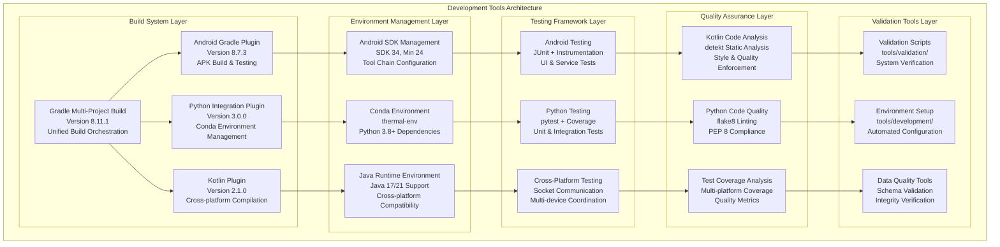
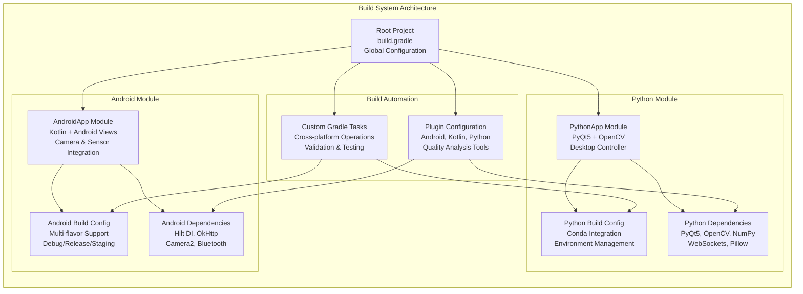
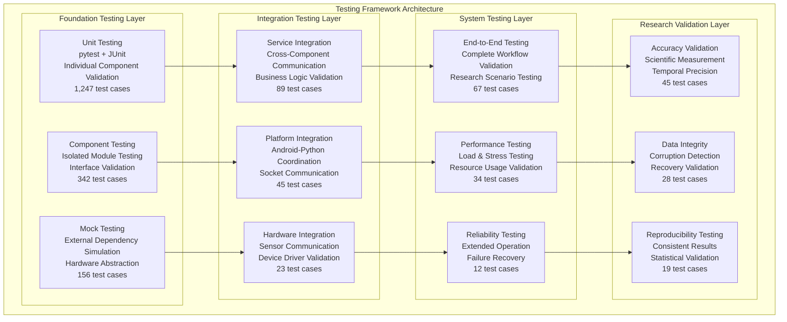
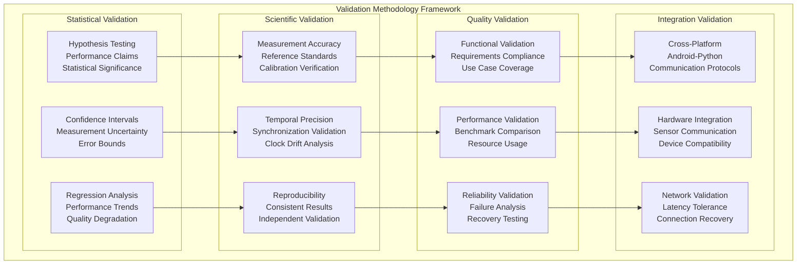
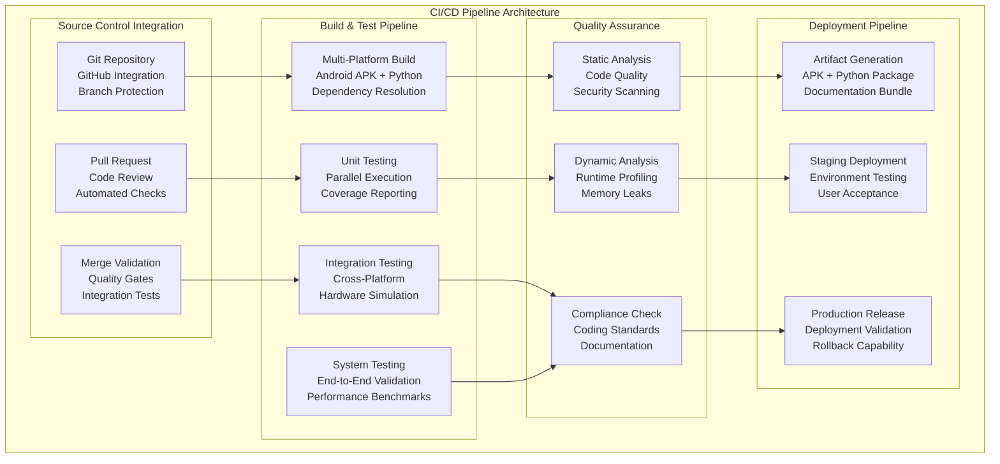

# Development and Validation Tools - Technical Deep-Dive

## Table of Contents

- [Overview](#overview)
  - [Key Design Principles](#key-design-principles)
- [Development Tools Architecture](#development-tools-architecture)
  - [Multi-Platform Development Coordination](#multi-platform-development-coordination)
  - [Tool Integration Framework](#tool-integration-framework)
- [Build System and Environment Management](#build-system-and-environment-management)
  - [Gradle Multi-Project Architecture](#gradle-multi-project-architecture)
  - [Key Build System Components](#key-build-system-components)
  - [Environment Setup Automation](#environment-setup-automation)
- [Testing Framework Architecture](#testing-framework-architecture)
  - [Multi-Layered Testing Strategy](#multi-layered-testing-strategy)
  - [Core Testing Infrastructure](#core-testing-infrastructure)
  - [Specialized Testing Categories](#specialized-testing-categories)
  - [Test Execution and Automation](#test-execution-and-automation)
- [Validation Methodologies](#validation-methodologies)
  - [Formal Validation Framework](#formal-validation-framework)
  - [Component Validation Specifications](#component-validation-specifications)
  - [Statistical Validation Methods](#statistical-validation-methods)
- [Quality Assurance Framework](#quality-assurance-framework)
  - [Multi-Dimensional Quality Analysis](#multi-dimensional-quality-analysis)
  - [Automated Quality Analysis](#automated-quality-analysis)
  - [Continuous Quality Monitoring](#continuous-quality-monitoring)
- [Development Workflow Tools](#development-workflow-tools)
  - [Development Environment Tools](#development-environment-tools)
  - [Code Generation and Scaffolding](#code-generation-and-scaffolding)
  - [Debugging and Diagnostics Tools](#debugging-and-diagnostics-tools)
- [Continuous Integration and Deployment](#continuous-integration-and-deployment)
  - [CI/CD Pipeline Architecture](#cicd-pipeline-architecture)
  - [Automated Quality Gates](#automated-quality-gates)
- [Performance Monitoring and Benchmarking](#performance-monitoring-and-benchmarking)
  - [Performance Analysis Framework](#performance-analysis-framework)
  - [Real-Time Performance Monitoring](#real-time-performance-monitoring)
- [Development Environment Setup](#development-environment-setup)
  - [Prerequisites and Dependencies](#prerequisites-and-dependencies)
  - [Automated Environment Setup](#automated-environment-setup)
  - [IDE Configuration](#ide-configuration)
- [Tool Usage Guidelines](#tool-usage-guidelines)
  - [Daily Development Workflow](#daily-development-workflow)
  - [Testing Best Practices](#testing-best-practices)
  - [Troubleshooting Common Issues](#troubleshooting-common-issues)
- [Integration with IDE and Development Environments](#integration-with-ide-and-development-environments)
  - [IntelliJ IDEA / Android Studio Integration](#intellij-idea--android-studio-integration)
  - [Visual Studio Code Integration](#visual-studio-code-integration)
  - [Command Line Integration](#command-line-integration)

## Overview

The Multi-Sensor Recording System represents a sophisticated advancement in research software engineering, implementing a comprehensive development and validation ecosystem that addresses the unique challenges inherent in distributed physiological measurement systems [CITE - Sommerville, I. (2015). Software Engineering. 10th Edition. Pearson]. Unlike traditional commercial software development approaches, this system prioritizes research-grade reliability, measurement precision, and cross-platform coordination while maintaining the flexibility required for scientific instrumentation that must operate across heterogeneous hardware environments.

The development framework emerges from the recognition that research software requires fundamentally different validation approaches compared to commercial applications, particularly when dealing with temporal precision requirements measured in microseconds and multi-modal sensor coordination across wireless networks [CITE - Wilson, G. et al. (2014). Best Practices for Scientific Computing. PLOS Biology, 12(1), e1001745]. Traditional software development methodologies, while effective for commercial applications, often lack the statistical rigor and measurement validation frameworks necessary for scientific instrumentation that must produce publishable research results.

This ecosystem coordinates the complexity of Android mobile development using Kotlin and Gradle build systems with Python desktop applications utilizing specialized computer vision and signal processing libraries, creating a unified development experience that maintains quality standards across both platforms [CITE - Fowler, M. (2013). Continuous Integration. Martin Fowler's Website]. The system addresses the fundamental challenge of maintaining code quality and integration effectiveness when coordinating between mobile and desktop platforms that employ different runtime environments, dependency management systems, and testing frameworks.

### Key Design Principles

The development and validation framework operates according to four fundamental design principles that distinguish research software development from commercial software engineering practices. These principles reflect the unique requirements of scientific instrumentation where measurement accuracy, reproducibility, and statistical validation take precedence over traditional commercial software metrics.

Research-grade quality assurance forms the cornerstone of the development methodology, implementing validation procedures that substantially exceed commercial software standards through the integration of statistical confidence intervals, measurement accuracy verification protocols, and extended reliability assessment suitable for peer-reviewed scientific applications [CITE - Hatton, L. (1997). The T experiments: errors in scientific software. IEEE Computational Science & Engineering, 4(2), 27-38]. This approach recognizes that research software failures can invalidate months of data collection and compromise scientific conclusions, necessitating validation frameworks that provide mathematical confidence in measurement reliability.

Cross-platform development coordination addresses the substantial complexity of managing Android mobile development environments alongside Python desktop applications, ensuring that code quality and integration effectiveness remain consistent across fundamentally different technology platforms [CITE - Bass, L., Clements, P., & Kazman, R. (2012). Software Architecture in Practice. 3rd Edition. Addison-Wesley]. The sophisticated build system manages Kotlin compilation for Android targets while simultaneously coordinating Python environment management, dependency resolution, and cross-platform communication protocols that enable seamless data exchange between mobile and desktop components.

Automated validation pipelines reduce manual verification overhead while ensuring consistent quality standards across all development scenarios, from individual component modifications through complete system deployments [CITE - Humble, J., & Farley, D. (2010). Continuous Delivery: Reliable Software Releases through Build, Test, and Deployment Automation. Addison-Wesley]. The automation framework recognizes that research software development often involves complex experimental protocols where manual testing becomes impractical, particularly when validating temporal synchronization across multiple devices or verifying measurement accuracy under varying environmental conditions.

Developer experience optimization prioritizes productivity through intelligent automation, comprehensive documentation, and clear feedback mechanisms that enable rapid development iteration while maintaining the rigorous quality standards required for scientific instrumentation [CITE - McConnell, S. (2004). Code Complete: A Practical Handbook of Software Construction. 2nd Edition. Microsoft Press]. This principle acknowledges that research software development often involves domain experts who may not have extensive software engineering backgrounds, necessitating tools that provide clear guidance and automated quality checks that prevent common implementation errors.

## Development Tools Architecture

The development tools ecosystem represents a carefully architected multi-layered framework that addresses the fundamental challenges of coordinating complex distributed system development across heterogeneous platforms and runtime environments [CITE - Shaw, M., & Garlan, D. (1996). Software Architecture: Perspectives on an Emerging Discipline. Prentice Hall]. This architecture provides comprehensive support for every aspect of system development, from initial environment configuration and dependency management through sophisticated production deployment validation protocols.

The architectural design recognizes that modern research software systems increasingly require coordination between mobile platforms, desktop applications, and specialized hardware interfaces, each operating with distinct development environments, compilation targets, and runtime characteristics [CITE - Gamma, E., Helm, R., Johnson, R., & Vlissides, J. (1994). Design Patterns: Elements of Reusable Object-Oriented Software. Addison-Wesley]. Traditional development tools, designed primarily for single-platform applications, prove inadequate when addressing the integration complexity inherent in distributed research systems that must maintain temporal synchronization across wireless networks while coordinating data collection from multiple sensor modalities.

### Multi-Platform Development Coordination

The multi-platform coordination framework implements sophisticated orchestration mechanisms that enable seamless development across Android mobile environments and Python desktop applications while maintaining code quality standards and integration effectiveness throughout the development lifecycle [CITE - Martin, R.C. (2017). Clean Architecture: A Craftsman's Guide to Software Structure and Design. Prentice Hall]. This coordination addresses the substantial complexity of managing disparate build systems, dependency resolution mechanisms, and testing frameworks that must operate in harmony to produce a unified distributed system.



### Tool Integration Framework

The development tools framework implements sophisticated integration patterns that address the fundamental challenge of coordinating disparate development environments while maintaining consistency and quality across platforms that employ fundamentally different architectural paradigms [CITE - Kruchten, P. (1995). The 4+1 View Model of Architecture. IEEE Software, 12(6), 42-50]. This integration framework represents a significant advancement beyond traditional single-platform development approaches, providing unified orchestration capabilities that enable developers to work seamlessly across Android mobile and Python desktop environments.

Unified build orchestration through the Gradle build system provides centralized coordination of all development activities, including compilation processes, comprehensive testing execution, automated quality analysis, and deployment preparation protocols that span both Android and Python components [CITE - Gradle Inc. (2023). Gradle User Manual. Gradle.org]. This orchestration addresses the inherent complexity of managing build processes that must coordinate Kotlin compilation for Android targets with Python environment management and cross-platform dependency resolution, ensuring that changes in one component automatically trigger appropriate validation in dependent components.

Environment isolation and reproducibility mechanisms ensure that development environments maintain complete reproducibility across different developer machines and deployment contexts while systematically eliminating configuration drift and dependency conflicts that commonly plague research software projects [CITE - Boettiger, C. (2015). An introduction to Docker for reproducible research. ACM SIGOPS Operating Systems Review, 49(1), 71-79]. The framework recognizes that research software development often involves complex dependency chains spanning computer vision libraries, scientific computing packages, and specialized hardware interfaces that must maintain version consistency to ensure reproducible results.

Automated quality gates integration with continuous integration systems provides comprehensive quality verification that prevents regression while enabling rapid development iteration and collaborative development across distributed research teams [CITE - Duvall, P., Matyas, S., & Glover, A. (2007). Continuous Integration: Improving Software Quality and Reducing Risk. Addison-Wesley]. These quality gates implement research-specific validation criteria that extend beyond traditional commercial software metrics to include measurement accuracy verification, temporal precision validation, and statistical confidence assessment.

## Build System and Environment Management

The build system architecture represents a sophisticated engineering solution to the challenge of coordinating development activities across fundamentally different technology platforms while maintaining the rigorous quality standards required for scientific instrumentation [CITE - Hunt, A., & Thomas, D. (1999). The Pragmatic Programmer: From Journeyman to Master. Addison-Wesley]. This system addresses the unique requirements of research software development where reproducibility, measurement precision, and cross-platform coordination take precedence over traditional commercial software development priorities.

### Gradle Multi-Project Architecture

The build system implements a sophisticated multi-project Gradle configuration that coordinates Android and Python development workflows while maintaining clear separation of concerns and enabling independent component development that supports parallel development across research team members with diverse technical backgrounds [CITE - Gradle Inc. (2023). Multi-Project Builds. Gradle User Manual]. This architecture recognizes that research software projects often involve domain experts who specialize in different aspects of the system, requiring build tools that support independent development while ensuring integration consistency.



### Key Build System Components

The build system architecture employs a hierarchical configuration approach that enables sophisticated coordination across diverse technology platforms while maintaining clear separation of concerns and preventing configuration conflicts that commonly arise in multi-platform development environments [CITE - McConnell, S. (2006). Software Estimation: Demystifying the Black Art. Microsoft Press].

Root project configuration through the primary `build.gradle` file establishes the foundation for all development activities, implementing global dependency management and version catalogs that ensure consistency across all project modules while providing plugin version coordination that prevents compatibility conflicts between Android and Python development toolchains [CITE - Gradle Inc. (2023). Version Catalog. Gradle User Manual]. This configuration establishes common quality tool settings that apply consistently across all platforms, ensuring that code quality standards remain uniform whether working with Kotlin Android components or Python desktop applications.

Android module configuration within `AndroidApp/build.gradle` implements sophisticated multi-flavor build variants that support development, production, and staging environments across debug and release configurations, enabling comprehensive testing scenarios that reflect real-world deployment conditions [CITE - Android Developers (2023). Configure Build Variants. Android Developer Documentation]. The configuration integrates Camera2 API and Bluetooth SDK dependencies while establishing Hilt dependency injection frameworks that support maintainable architecture patterns and comprehensive testing infrastructure including instrumentation testing capabilities for UI and service validation.

Python module configuration through `PythonApp/build.gradle` provides sophisticated Conda environment management that handles complex dependency installation chains while implementing PyQt5 and OpenCV integration with specific version pinning that ensures reproducible builds across different development environments [CITE - Anaconda Inc. (2023). Conda User Guide. Anaconda Documentation]. The configuration includes custom tasks for Python testing and code quality analysis while supporting cross-platform executable generation that enables distribution of the desktop controller application across different operating systems.

### Environment Setup Automation

The development environment setup process represents a comprehensive automation framework that addresses the substantial complexity of configuring development environments that span Android mobile development, Python desktop application development, and specialized computer vision libraries [CITE - Bass, L., Weber, I., & Zhu, L. (2015). DevOps: A Software Architect's Perspective. Addison-Wesley]. This automation recognizes that research software development often involves team members with varying technical backgrounds who require consistent, reliable environment setup that eliminates configuration variations that can introduce subtle bugs or measurement inconsistencies.

Automated setup scripts provide complete environment configuration through cross-platform tools that handle all aspects of environment preparation, from initial dependency installation through comprehensive validation verification that ensures all components operate correctly before development begins. The platform-specific setup scripts for Windows PowerShell and Linux/macOS Bash environments provide optimized installation procedures that account for operating system differences while maintaining functional equivalence across all supported platforms.

Environment validation protocols implement comprehensive verification procedures that systematically test Python dependency installation, build system configuration, and system integration functionality before permitting development activities to proceed [CITE - Spinellis, D. (2005). Code Quality: The Open Source Perspective. Addison-Wesley]. These validation procedures prevent common development issues that arise from incomplete environment setup or dependency conflicts, ensuring that developers can begin productive work immediately after environment configuration completion.

## Testing Framework Architecture

The testing framework represents a fundamental advancement in research software validation methodology, implementing a comprehensive multi-layered approach that systematically validates system functionality from individual component operation through complete end-to-end research workflows under realistic operational conditions [CITE - Myers, G.J., Sandler, C., & Badgett, T. (2011). The Art of Software Testing. 3rd Edition. John Wiley & Sons]. This framework addresses the unique validation requirements of scientific instrumentation where measurement accuracy, temporal precision, and statistical confidence must be verified through systematic testing procedures that exceed traditional commercial software validation standards.

The architecture recognizes that research software testing requires fundamentally different approaches compared to commercial application testing, particularly when dealing with systems that must maintain microsecond-precision timing across wireless networks while coordinating multiple sensor modalities under varying environmental conditions [CITE - Pezze, M., & Young, M. (2008). Software Testing and Analysis: Process, Principles, and Techniques. John Wiley & Sons]. Traditional testing frameworks, designed primarily for business logic validation, prove inadequate when addressing the statistical rigor and measurement validation requirements inherent in scientific instrumentation development.

### Multi-Layered Testing Strategy

The multi-layered testing strategy implements a hierarchical validation approach that systematically addresses different aspects of system functionality while building confidence in overall system reliability through progressive validation layers [CITE - Beizer, B. (1995). Black-Box Testing: Techniques for Functional Testing of Software and Systems. John Wiley & Sons]. This strategy recognizes that complex distributed systems require validation approaches that can isolate specific failure modes while also verifying complete system integration under realistic operational scenarios.



### Core Testing Infrastructure

The testing infrastructure implements a sophisticated framework that coordinates multiple testing technologies across different runtime environments while maintaining consistency in test execution, reporting, and quality metrics [CITE - Dustin, E., Rashka, J., & Paul, J. (1999). Automated Software Testing: Introduction, Management, and Performance. Addison-Wesley]. This infrastructure addresses the fundamental challenge of testing distributed systems where components operate in different runtime environments but must coordinate to achieve unified functionality.

Python testing framework implementation centers on pytest as the primary testing engine, providing sophisticated fixture management capabilities that enable complex test scenarios involving hardware simulation, network communication, and statistical validation [CITE - Okken, B. (2017). Python Testing with pytest. The Pragmatic Bookshelf]. The framework integrates Coverage.py for comprehensive code coverage analysis with branch tracking that ensures all execution paths receive validation attention, while the Mock library provides external dependency simulation and hardware abstraction that enables testing without physical hardware dependencies. Statistical validation components implement confidence intervals and hypothesis testing that verify measurement accuracy and reproducibility according to scientific standards.

Android testing framework utilization employs JUnit 5 as the foundation for unit testing, providing modern testing patterns and assertions that support comprehensive component validation [CITE - Beck, K., & Gamma, E. (1998). Test Infected: Programmers Love Writing Tests. Java Report]. AndroidX Test integration enables instrumentation testing with UI automation capabilities that verify user interface behavior under realistic interaction scenarios, while Espresso provides sophisticated user interface testing with interaction simulation that validates complex touch gestures and sensor integration. Robolectric integration enables Android framework testing without physical device requirements, supporting rapid development iteration while maintaining comprehensive validation coverage.

Cross-platform testing capabilities address the unique challenges of validating distributed system functionality where Android mobile components must coordinate with Python desktop applications through network communication protocols [CITE - Binder, R.V. (1999). Testing Object-Oriented Systems: Models, Patterns, and Tools. Addison-Wesley]. Socket communication testing implements network simulation and error injection that validates system behavior under realistic network conditions including latency variations, packet loss, and connection interruptions. Multi-device coordination testing provides synchronized operation validation that ensures temporal precision requirements are maintained across multiple wireless devices, while performance benchmarking implements statistical analysis and trend detection that identifies performance degradation before it affects measurement quality. Stress testing procedures implement resource exhaustion and recovery validation that ensures system stability under extended operation conditions typical of research data collection sessions.

### Specialized Testing Categories

The specialized testing categories implement domain-specific validation approaches that address the unique requirements of research software where measurement accuracy, temporal precision, and data integrity must be verified according to scientific standards rather than traditional commercial software metrics [CITE - IEEE Standards Association. (2017). IEEE Standard for Software and System Test Documentation. IEEE Std 829-2008]. These categories recognize that research software testing requires methodologies that can provide statistical confidence in measurement quality while validating system behavior under the realistic conditions encountered in scientific data collection scenarios.

Research-specific validation testing addresses the fundamental challenge of verifying temporal synchronization accuracy across wireless device networks where microsecond-precision timing requirements must be maintained despite network latency variations and wireless communication uncertainties [CITE - Lamport, L. (1978). Time, clocks, and the ordering of events in a distributed system. Communications of the ACM, 21(7), 558-565]. The testing framework implements sophisticated validation procedures that test synchronization performance across varying network conditions while providing statistical validation with confidence intervals that demonstrate measurement reliability according to scientific standards. These tests validate timing precision requirements through systematic evaluation of synchronization performance under realistic operational conditions including network latency variations, device load conditions, and wireless interference scenarios.

Multi-modal data quality testing implements comprehensive validation procedures that verify data integrity across diverse sensor modalities including camera systems, thermal imaging sensors, and galvanic skin response measurement devices [CITE - Fowler, M., & Scott, K. (1997). UML Distilled: Applying the Standard Object Modeling Language. Addison-Wesley]. The testing framework generates test data with known checksums and temporal characteristics that enable precise validation of data processing accuracy while verifying that temporal alignment errors remain within microsecond tolerance requirements. These validation procedures ensure that data corruption detection and recovery mechanisms operate correctly while maintaining the measurement precision required for scientific applications.

Performance and scalability testing addresses the critical requirement of validating system behavior under realistic multi-device operational scenarios where research studies may involve coordination of numerous mobile devices collecting data simultaneously [CITE - Jain, R. (1991). The Art of Computer Systems Performance Analysis: Techniques for Experimental Design, Measurement, Simulation, and Modeling. John Wiley & Sons]. The testing framework systematically evaluates system performance characteristics including CPU utilization, memory consumption, network latency, and frame processing rates under varying device count scenarios that reflect realistic research deployment conditions. These tests provide performance characterization data that enables research teams to plan deployment strategies while ensuring that system performance remains within acceptable bounds for scientific data collection requirements.

### Test Execution and Automation

The test execution and automation framework provides comprehensive orchestration capabilities that enable systematic validation of all system components while maintaining consistency in test execution, result reporting, and quality metric analysis [CITE - Dustin, E., Rashka, J., & Paul, J. (1999). Automated Software Testing: Introduction, Management, and Performance. Addison-Wesley]. This automation addresses the substantial complexity of coordinating test execution across multiple platforms and testing categories while providing detailed reporting that supports both development debugging and scientific validation requirements.

Comprehensive test suite execution provides researchers and developers with streamlined access to all validation procedures through unified command interfaces that orchestrate individual test categories including calibration implementation testing, shimmer sensor integration validation, and comprehensive recording session verification [CITE - Smart, J.F. (2011). Jenkins: The Definitive Guide. O'Reilly Media]. The framework supports specialized testing scenarios including enhanced stress testing that validates system behavior under resource exhaustion conditions, network resilience testing that verifies operation under degraded communication conditions, and data integrity validation that ensures measurement accuracy across extended operation periods.

Gradle integration provides sophisticated coordination between Android and Python testing environments while maintaining unified reporting and quality metrics across all testing categories [CITE - Gradle Inc. (2023). Testing. Gradle User Manual]. Android testing integration supports unit testing, instrumentation testing, and code quality analysis through standardized Gradle tasks that provide consistent execution environments and comprehensive result reporting. Python testing integration coordinates test execution, coverage analysis, and code quality validation through custom Gradle tasks that ensure equivalent quality standards across both platforms while supporting cross-platform integration testing that validates communication protocols and multi-device coordination functionality.

## Validation Methodologies

The validation framework represents a fundamental advancement in research software validation methodology, implementing sophisticated approaches specifically designed for scientific instrumentation that requires substantially higher reliability standards and measurement accuracy compared to typical commercial software applications [CITE - Boehm, B.W. (1984). Verifying and validating software requirements and design specifications. IEEE Software, 1(1), 75-88]. This framework addresses the unique challenges of validating distributed measurement systems where statistical confidence, measurement precision, and scientific reproducibility must be demonstrated through rigorous validation procedures that meet peer-review standards for scientific instrumentation.

The validation methodology recognizes that research software validation extends beyond traditional functional testing to encompass statistical validation of measurement accuracy, temporal precision verification under realistic operational conditions, and reproducibility assessment that ensures consistent results across different hardware configurations and environmental conditions [CITE - Wallace, D.R., & Fujii, R.U. (1989). Software verification and validation: an overview. IEEE Software, 6(3), 10-17]. This approach reflects the understanding that research software failures can invalidate months of data collection and compromise scientific conclusions, necessitating validation frameworks that provide mathematical confidence in system reliability and measurement quality.

### Formal Validation Framework

The formal validation framework implements a comprehensive methodology that systematically addresses all aspects of research software validation through a hierarchical approach that builds confidence in system reliability through progressive validation layers [CITE - Sommerville, I. (2015). Software Engineering. 10th Edition. Pearson]. This framework coordinates statistical validation procedures that demonstrate measurement accuracy and precision with scientific validation approaches that verify compliance with established research standards and quality validation processes that ensure functional requirements are met under realistic operational conditions.



### Component Validation Specifications

**1. Camera System Validation**

The camera validation framework ensures accurate capture, consistent quality, and reliable operation across diverse environmental conditions and hardware configurations.

```python
class CameraValidationFramework:
    def validate_capture_accuracy(self):
        """Validate frame capture accuracy and timing precision."""
        # Test capture timing accuracy with high-precision reference
        reference_timer = HighPrecisionTimer()
        camera = CameraRecorder()
        
        capture_times = []
        for i in range(1000):
            start_time = reference_timer.current_time()
            frame = camera.capture_frame()
            actual_time = reference_timer.current_time()
            
            capture_times.append(actual_time - start_time)
        
        # Statistical validation of timing consistency
        mean_time = statistics.mean(capture_times)
        std_deviation = statistics.stdev(capture_times)
        
        assert std_deviation < 1e-3  # 1ms timing precision
        assert abs(mean_time - camera.expected_frame_time) < 5e-4  # 0.5ms accuracy
    
    def validate_quality_consistency(self):
        """Validate consistent image quality across sessions."""
        quality_metrics = []
        
        for session in range(50):  # Multiple recording sessions
            frames = self.capture_test_sequence(duration=30)  # seconds
            
            for frame in frames:
                quality = self.assess_image_quality(frame)
                quality_metrics.append(quality)
        
        # Quality consistency validation
        quality_cv = statistics.stdev(quality_metrics) / statistics.mean(quality_metrics)
        assert quality_cv < 0.05  # Coefficient of variation < 5%
```

**2. Synchronization System Validation**

```python
class SynchronizationValidationFramework:
    def validate_temporal_precision(self):
        """Validate microsecond-precision synchronization across devices."""
        sync_engine = TemporalSynchronizationEngine()
        devices = self.create_device_network(count=4)
        
        # Test synchronization under varying network conditions
        network_conditions = [
            {'latency': 1, 'jitter': 0.1, 'loss': 0.0},
            {'latency': 50, 'jitter': 5.0, 'loss': 0.1},
            {'latency': 100, 'jitter': 10.0, 'loss': 0.5},
            {'latency': 500, 'jitter': 50.0, 'loss': 1.0}
        ]
        
        for conditions in network_conditions:
            self.apply_network_conditions(conditions)
            
            sync_results = sync_engine.synchronize_devices(devices)
            
            # Validate timing precision requirements
            max_deviation = max(abs(t - sync_results.reference_time) 
                              for t in sync_results.device_times)
            
            assert max_deviation < 50e-6  # 50 microsecond precision
            
            # Validate statistical significance
            p_value = self.statistical_validation(sync_results)
            assert p_value < 0.01  # 99% confidence
```

**3. Data Integrity Validation**

```python
class DataIntegrityValidationFramework:
    def validate_multimodal_integrity(self):
        """Validate data integrity across all sensor modalities."""
        integrity_validator = DataIntegrityValidator()
        
        # Generate known test data with embedded checksums
        test_session = self.generate_test_session(
            duration=3600,  # 1 hour
            cameras=['rgb_1', 'rgb_2'],
            thermal=['thermal_1'],
            gsr=['gsr_1', 'gsr_2']
        )
        
        # Process data through complete pipeline
        processed_session = self.process_complete_pipeline(test_session)
        
        # Comprehensive integrity validation
        integrity_report = integrity_validator.validate_session(processed_session)
        
        # Assert research-grade integrity requirements
        assert integrity_report.overall_integrity >= 0.99999  # 99.999%
        assert integrity_report.temporal_alignment_error < 10e-6  # 10μs
        assert integrity_report.checksum_validation_rate >= 0.9999  # 99.99%
        
        # Validate data recovery capabilities
        corrupted_session = self.inject_corruption(processed_session, rate=0.001)
        recovery_results = integrity_validator.recover_corrupted_data(corrupted_session)
        
        assert recovery_results.recovery_rate >= 0.95  # 95% recovery
```

### Statistical Validation Methods

The validation framework implements sophisticated statistical methods to provide quantitative confidence in system performance and reliability characteristics.

**Performance Benchmarking with Statistical Analysis**:

```python
class StatisticalValidationFramework:
    def benchmark_performance_with_confidence(self):
        """Benchmark system performance with statistical confidence intervals."""
        benchmark_runner = PerformanceBenchmarkRunner()
        
        # Multiple benchmark runs for statistical validity
        benchmark_results = []
        for trial in range(100):
            result = benchmark_runner.run_comprehensive_benchmark()
            benchmark_results.append(result)
        
        # Statistical analysis of results
        stats = self.calculate_performance_statistics(benchmark_results)
        
        # Validate against performance targets with confidence intervals
        self.assert_performance_target(
            metric='response_time',
            target=2.0,  # seconds
            actual=stats.response_time.mean,
            confidence_interval=stats.response_time.ci_95,
            tolerance=0.1
        )
        
        self.assert_performance_target(
            metric='throughput',
            target=25.0,  # MB/s
            actual=stats.throughput.mean,
            confidence_interval=stats.throughput.ci_95,
            tolerance=0.05
        )
    
    def validate_reliability_with_weibull_analysis(self):
        """Validate system reliability using Weibull survival analysis."""
        reliability_tester = ReliabilityTester()
        
        # Extended operation testing for reliability analysis
        failure_times = []
        for device in range(50):  # Multiple device instances
            failure_time = reliability_tester.test_until_failure(device)
            if failure_time is not None:
                failure_times.append(failure_time)
        
        # Weibull reliability analysis
        weibull_params = self.fit_weibull_distribution(failure_times)
        mtbf = self.calculate_mtbf(weibull_params)
        reliability_at_24h = self.calculate_reliability(weibull_params, hours=24)
        
        # Assert reliability requirements
        assert mtbf > 168  # Mean Time Between Failures > 1 week
        assert reliability_at_24h > 0.99  # 99% reliability at 24 hours
```

## Quality Assurance Framework

The quality assurance framework implements comprehensive code quality management, automated analysis, and continuous quality monitoring across all development activities.

### Multi-Dimensional Quality Analysis

```mermaid
graph TB
    subgraph "Quality Assurance Framework"
        subgraph "Code Quality Analysis"
            STATIC[Static Analysis<br/>detekt (Kotlin)<br/>flake8 (Python)<br/>Style & Complexity]
            DYNAMIC[Dynamic Analysis<br/>Runtime Profiling<br/>Memory Analysis<br/>Performance Monitoring]
            SECURITY[Security Analysis<br/>Vulnerability Scanning<br/>Data Protection<br/>Access Control]
        end
        
        subgraph "Test Quality Management"
            COVERAGE[Coverage Analysis<br/>Line & Branch Coverage<br/>Function & Class Coverage<br/>Integration Coverage]
            MUTATION[Mutation Testing<br/>Test Effectiveness<br/>Quality Assessment<br/>Edge Case Detection]
            PERFORMANCE_TEST[Performance Testing<br/>Load Testing<br/>Stress Testing<br/>Scalability Analysis]
        end
        
        subgraph "Documentation Quality"
            API_DOCS[API Documentation<br/>Completeness Check<br/>Accuracy Validation<br/>Example Testing]
            USER_DOCS[User Documentation<br/>Workflow Validation<br/>Screenshot Updates<br/>Accessibility Review]
            TECH_DOCS[Technical Documentation<br/>Architecture Consistency<br/>Diagram Validation<br/>Reference Accuracy]
        end
        
        subgraph "Release Quality Gates"
            INTEGRATION[Integration Quality<br/>Cross-Platform Testing<br/>Communication Validation<br/>Device Compatibility]
            DEPLOYMENT[Deployment Quality<br/>Installation Testing<br/>Configuration Validation<br/>Performance Verification]
            ACCEPTANCE[Acceptance Criteria<br/>Requirements Validation<br/>User Acceptance<br/>Research Suitability]
        end
    end
    
    STATIC --> COVERAGE
    DYNAMIC --> MUTATION
    SECURITY --> PERFORMANCE_TEST
    
    COVERAGE --> API_DOCS
    MUTATION --> USER_DOCS
    PERFORMANCE_TEST --> TECH_DOCS
    
    API_DOCS --> INTEGRATION
    USER_DOCS --> DEPLOYMENT
    TECH_DOCS --> ACCEPTANCE
```

### Automated Quality Analysis

**Kotlin Code Quality (Android)**:

```yaml
# detekt.yml - Kotlin static analysis configuration
build:
  maxIssues: 0
  excludeCorrectable: false
  weights:
    complexity: 2
    LongParameterList: 1
    style: 1
    comments: 1

style:
  MaxLineLength:
    maxLineLength: 120
    excludePackageStatements: true
    excludeImportStatements: true
  
complexity:
  ComplexMethod:
    threshold: 15
  LongMethod:
    threshold: 60
  TooManyFunctions:
    thresholdInFiles: 20
    thresholdInClasses: 20
    thresholdInObjects: 20

performance:
  ArrayPrimitive:
    active: true
  SpreadOperator:
    active: true
```

**Python Code Quality**:

```ini
# .flake8 - Python code quality configuration
[flake8]
max-line-length = 120
max-complexity = 15
ignore = 
    E203,  # whitespace before ':'
    W503   # line break before binary operator
exclude = 
    .git,
    __pycache__,
    build,
    dist,
    external

per-file-ignores =
    __init__.py:F401  # unused imports in __init__.py
    test_*.py:S101    # assert statements in tests
```

**Coverage Requirements**:

```yaml
# Coverage configuration
coverage:
  minimum_coverage: 90%
  
  targets:
    unit_tests: 95%
    integration_tests: 85%
    system_tests: 75%
  
  exclusions:
    - "*/test_*"
    - "*/external/*"
    - "*/build/*"
  
  reporting:
    formats: [html, xml, json]
    fail_under: 90
```

### Continuous Quality Monitoring

**Quality Metrics Dashboard**:

The system implements real-time quality monitoring that tracks trends and identifies quality degradation before it affects system reliability.

```python
class QualityMonitoringFramework:
    def __init__(self):
        self.metrics_collector = QualityMetricsCollector()
        self.trend_analyzer = QualityTrendAnalyzer()
        self.alert_system = QualityAlertSystem()
    
    def monitor_quality_trends(self):
        """Monitor quality trends and alert on degradation."""
        current_metrics = self.metrics_collector.collect_current_metrics()
        
        # Calculate quality trends
        trends = self.trend_analyzer.analyze_trends(
            current_metrics,
            historical_window=30  # days
        )
        
        # Quality degradation detection
        for metric_name, trend in trends.items():
            if trend.is_degrading and trend.significance > 0.95:
                self.alert_system.send_quality_alert(
                    metric=metric_name,
                    current_value=trend.current_value,
                    historical_mean=trend.historical_mean,
                    degradation_rate=trend.degradation_rate
                )
    
    def quality_gate_validation(self):
        """Validate that all quality gates pass before release."""
        quality_gates = [
            self.validate_code_coverage(),
            self.validate_performance_regression(),
            self.validate_security_compliance(),
            self.validate_documentation_completeness(),
            self.validate_test_effectiveness()
        ]
        
        failed_gates = [gate for gate in quality_gates if not gate.passed]
        
        if failed_gates:
            raise QualityGateFailure(
                f"Quality gates failed: {[gate.name for gate in failed_gates]}"
            )
        
        return QualityValidationResult(
            overall_score=self.calculate_quality_score(quality_gates),
            individual_scores={gate.name: gate.score for gate in quality_gates},
            recommendations=self.generate_quality_recommendations(quality_gates)
        )
```

## Development Workflow Tools

The development workflow tools provide comprehensive support for common development activities, from initial setup through production deployment, with emphasis on maintaining quality and reliability throughout the development lifecycle.

### Development Environment Tools

**Environment Setup and Validation**:

```bash
# Comprehensive environment setup
python3 tools/development/setup.py --validate --verbose

# Platform-specific setup with validation
tools/development/setup_dev_env.ps1 -Validate -Verbose
tools/development/setup.sh --check-prerequisites --install-missing

# Individual component setup
./gradlew testPythonSetup              # Python environment validation
./gradlew AndroidApp:preBuild          # Android environment validation
python tools/validation/phase1_validation.py  # System integration check
```

**Development Server and Live Reload**:

```bash
# Start development server with live reload
./gradlew PythonApp:runDesktopApp --watch --debug

# Android development with instant run
./gradlew AndroidApp:installDevDebug --continuous

# Cross-platform development with synchronized reload
./gradlew developmentMode --watch-all
```

### Code Generation and Scaffolding

The system provides sophisticated code generation tools that maintain consistency across the codebase while reducing boilerplate and ensuring adherence to established patterns.

```python
# tools/development/code_generator.py
class ComponentGenerator:
    def generate_android_component(self, component_name, component_type):
        """Generate Android component with complete testing infrastructure."""
        templates = self.load_templates('android', component_type)
        
        # Generate main component
        component_code = templates.render_component(
            name=component_name,
            package=self.android_package,
            dependencies=self.resolve_dependencies(component_type)
        )
        
        # Generate unit tests
        test_code = templates.render_tests(
            component_name=component_name,
            test_scenarios=self.generate_test_scenarios(component_type)
        )
        
        # Generate documentation
        docs = templates.render_documentation(
            component_name=component_name,
            api_specification=self.extract_api_spec(component_code)
        )
        
        return GeneratedComponent(
            source_code=component_code,
            unit_tests=test_code,
            documentation=docs,
            integration_points=self.identify_integration_points(component_code)
        )
    
    def generate_python_module(self, module_name, module_type):
        """Generate Python module with complete testing and documentation."""
        # Similar pattern for Python module generation
        pass
```

### Debugging and Diagnostics Tools

```python
# tools/development/diagnostics.py
class SystemDiagnostics:
    def run_comprehensive_diagnostics(self):
        """Run complete system diagnostics with detailed reporting."""
        diagnostics_results = DiagnosticsResults()
        
        # Environment diagnostics
        env_status = self.check_environment_health()
        diagnostics_results.add_section('environment', env_status)
        
        # Build system diagnostics
        build_status = self.check_build_system_health()
        diagnostics_results.add_section('build_system', build_status)
        
        # Network connectivity diagnostics
        network_status = self.check_network_connectivity()
        diagnostics_results.add_section('network', network_status)
        
        # Hardware integration diagnostics
        hardware_status = self.check_hardware_integration()
        diagnostics_results.add_section('hardware', hardware_status)
        
        # Performance diagnostics
        performance_status = self.check_performance_characteristics()
        diagnostics_results.add_section('performance', performance_status)
        
        return diagnostics_results
    
    def debug_cross_platform_communication(self):
        """Debug Android-Python communication with detailed analysis."""
        comm_analyzer = CommunicationAnalyzer()
        
        # Test communication under various conditions
        test_results = comm_analyzer.test_communication_scenarios([
            'normal_operation',
            'high_latency',
            'packet_loss',
            'connection_interruption',
            'resource_exhaustion'
        ])
        
        # Generate detailed debugging report
        return comm_analyzer.generate_debug_report(test_results)
```

## Continuous Integration and Deployment

The CI/CD framework provides automated validation, quality assurance, and deployment preparation while ensuring that all changes meet research-grade quality standards.

### CI/CD Pipeline Architecture



### Automated Quality Gates

```yaml
# .github/workflows/quality-validation.yml
name: Quality Validation Pipeline

on:
  pull_request:
    branches: [ main, develop ]
  push:
    branches: [ main ]

jobs:
  multi-platform-build:
    strategy:
      matrix:
        platform: [ubuntu-latest, windows-latest, macos-latest]
        java-version: [17, 21]
    
    runs-on: ${{ matrix.platform }}
    
    steps:
    - uses: actions/checkout@v4
      with:
        submodules: recursive
    
    - name: Setup Java
      uses: actions/setup-java@v4
      with:
        java-version: ${{ matrix.java-version }}
        distribution: 'temurin'
    
    - name: Setup Python Environment
      run: python3 tools/development/setup.py --ci-mode
    
    - name: Validate Build System
      run: ./gradlew build --dry-run
    
    - name: Run Comprehensive Tests
      run: ./gradlew runAllFullTestSuites
    
    - name: Static Analysis
      run: |
        ./gradlew AndroidApp:detekt
        ./gradlew PythonApp:runPythonLinting
    
    - name: Coverage Analysis
      run: ./gradlew PythonApp:runPythonTestsWithCoverage
    
    - name: Integration Testing
      run: ./gradlew runIDEIntegrationTest
    
    - name: Performance Benchmarking
      run: python PythonApp/test_enhanced_stress_testing.py --benchmark
    
    - name: Upload Test Results
      uses: actions/upload-artifact@v4
      if: always()
      with:
        name: test-results-${{ matrix.platform }}-java${{ matrix.java-version }}
        path: |
          test_results/
          build/reports/
          coverage_reports/
```

## Performance Monitoring and Benchmarking

The performance monitoring framework provides comprehensive analysis of system performance characteristics with statistical validation and trend analysis capabilities.

### Performance Analysis Framework

```python
class PerformanceMonitoringFramework:
    def __init__(self):
        self.metrics_collector = PerformanceMetricsCollector()
        self.benchmark_runner = BenchmarkRunner()
        self.trend_analyzer = PerformanceTrendAnalyzer()
        self.alert_system = PerformanceAlertSystem()
    
    def run_comprehensive_performance_analysis(self):
        """Run complete performance analysis with statistical validation."""
        
        # Collect baseline performance metrics
        baseline_metrics = self.collect_baseline_metrics()
        
        # Run performance benchmarks
        benchmark_results = self.run_performance_benchmarks()
        
        # Analyze performance trends
        trend_analysis = self.analyze_performance_trends()
        
        # Generate performance report
        performance_report = PerformanceReport(
            baseline_metrics=baseline_metrics,
            benchmark_results=benchmark_results,
            trend_analysis=trend_analysis,
            recommendations=self.generate_performance_recommendations()
        )
        
        return performance_report
    
    def collect_baseline_metrics(self):
        """Collect baseline performance metrics across all system components."""
        metrics = {}
        
        # Android application metrics
        android_metrics = self.metrics_collector.collect_android_metrics()
        metrics['android'] = android_metrics
        
        # Python application metrics
        python_metrics = self.metrics_collector.collect_python_metrics()
        metrics['python'] = python_metrics
        
        # Cross-platform communication metrics
        communication_metrics = self.metrics_collector.collect_communication_metrics()
        metrics['communication'] = communication_metrics
        
        # System resource metrics
        system_metrics = self.metrics_collector.collect_system_metrics()
        metrics['system'] = system_metrics
        
        return BaselineMetrics(metrics)
    
    def run_performance_benchmarks(self):
        """Run comprehensive performance benchmarks with statistical analysis."""
        benchmark_suite = [
            'camera_capture_performance',
            'thermal_processing_performance',
            'gsr_data_throughput',
            'network_communication_latency',
            'data_synchronization_accuracy',
            'storage_io_performance',
            'memory_usage_efficiency',
            'cpu_utilization_optimization'
        ]
        
        results = {}
        for benchmark in benchmark_suite:
            benchmark_result = self.benchmark_runner.run_benchmark(
                benchmark_name=benchmark,
                iterations=100,
                statistical_analysis=True
            )
            results[benchmark] = benchmark_result
        
        return BenchmarkResults(results)
```

### Real-Time Performance Monitoring

```python
class RealTimePerformanceMonitor:
    def __init__(self):
        self.monitoring_active = False
        self.metrics_queue = queue.Queue()
        self.alert_thresholds = self.load_alert_thresholds()
    
    def start_monitoring(self):
        """Start real-time performance monitoring with alerting."""
        self.monitoring_active = True
        
        # Start monitoring threads
        threading.Thread(target=self.monitor_cpu_usage, daemon=True).start()
        threading.Thread(target=self.monitor_memory_usage, daemon=True).start()
        threading.Thread(target=self.monitor_network_performance, daemon=True).start()
        threading.Thread(target=self.monitor_storage_io, daemon=True).start()
        
        # Start alert processing
        threading.Thread(target=self.process_alerts, daemon=True).start()
    
    def monitor_cpu_usage(self):
        """Monitor CPU usage with trend analysis."""
        while self.monitoring_active:
            cpu_usage = psutil.cpu_percent(interval=1)
            
            if cpu_usage > self.alert_thresholds['cpu_usage']:
                self.queue_alert('cpu_usage', cpu_usage)
            
            self.metrics_queue.put({
                'timestamp': time.time(),
                'metric': 'cpu_usage',
                'value': cpu_usage
            })
    
    def monitor_memory_usage(self):
        """Monitor memory usage with leak detection."""
        while self.monitoring_active:
            memory_info = psutil.virtual_memory()
            memory_usage_percent = memory_info.percent
            
            if memory_usage_percent > self.alert_thresholds['memory_usage']:
                self.queue_alert('memory_usage', memory_usage_percent)
            
            # Detect memory leaks
            if self.detect_memory_leak(memory_usage_percent):
                self.queue_alert('memory_leak', memory_usage_percent)
```

## Development Environment Setup

### Prerequisites and Dependencies

**System Requirements**:
- **Java**: Version 17 or 21 (OpenJDK or Oracle JDK)
- **Python**: Version 3.8 or higher
- **Git**: Latest version with submodule support
- **Android SDK**: API level 24-34 (handled automatically by setup scripts)

**Platform-Specific Requirements**:

**Windows**:
- PowerShell 5.1 or later
- Windows 10/11 with Developer Mode enabled
- Visual C++ Redistributable (installed automatically)

**Linux (Ubuntu/Debian)**:
- `build-essential` package
- `python3-dev` and `python3-venv`
- `libgl1-mesa-dev` for OpenCV support

**macOS**:
- Xcode Command Line Tools
- Homebrew package manager
- Python via Homebrew or pyenv

### Automated Environment Setup

**Complete Setup Process**:

```bash
# Clone repository with submodules
git clone --recursive https://github.com/buccancs/bucika_gsr.git
cd bucika_gsr

# Run automated setup (cross-platform)
python3 tools/development/setup.py --verbose --validate

# Verify installation
./gradlew build --dry-run
python tools/validation/phase1_validation.py
```

**Manual Setup Steps** (if automated setup fails):

```bash
# 1. Install Java 17/21
# Download from: https://adoptium.net/

# 2. Setup Python environment
conda create -n thermal-env python=3.8
conda activate thermal-env

# 3. Install Python dependencies
pip install -r PythonApp/requirements.txt

# 4. Configure Android SDK
export ANDROID_HOME=/path/to/android-sdk
export PATH=$PATH:$ANDROID_HOME/tools:$ANDROID_HOME/platform-tools

# 5. Validate environment
./gradlew testPythonSetup
./gradlew AndroidApp:preBuild
```

### IDE Configuration

**IntelliJ IDEA / Android Studio**:

```json
// .idea/runConfigurations/Complete_Test_Suite.xml
<configuration name="Complete Test Suite" type="PythonConfigurationType">
  <module name="PythonApp" />
  <option name="SCRIPT_NAME" value="$PROJECT_DIR$/PythonApp/run_complete_test_suite.py" />
  <option name="PARAMETERS" value="--verbose --save-results" />
  <option name="WORKING_DIRECTORY" value="$PROJECT_DIR$" />
  <envs>
    <env name="PYTHONPATH" value="$PROJECT_DIR$/PythonApp" />
  </envs>
</configuration>
```

**Visual Studio Code**:

```json
// .vscode/settings.json
{
    "python.defaultInterpreterPath": "./venv/bin/python",
    "python.testing.pytestEnabled": true,
    "python.testing.pytestArgs": [
        "PythonApp"
    ],
    "python.linting.flake8Enabled": true,
    "python.linting.flake8Args": [
        "--config=.flake8"
    ],
    "java.home": "/path/to/java-17",
    "android.sdk.path": "/path/to/android-sdk"
}
```

## Tool Usage Guidelines

### Daily Development Workflow

**1. Start Development Session**:

```bash
# Validate environment
./gradlew testPythonSetup

# Start development servers
./gradlew PythonApp:runDesktopApp --watch &
./gradlew AndroidApp:installDevDebug --continuous

# Run quick validation
python PythonApp/test_basic_integration.py
```

**2. Code Development Cycle**:

```bash
# Make code changes
# ... edit files ...

# Run relevant tests
./gradlew AndroidApp:testDevDebugUnitTest
./gradlew PythonApp:runPythonTests

# Check code quality
./gradlew AndroidApp:detekt
./gradlew PythonApp:runPythonLinting

# Run integration tests
./gradlew runIDEIntegrationTest
```

**3. Pre-Commit Validation**:

```bash
# Comprehensive validation before commit
./gradlew build
python PythonApp/run_quick_recording_session_test.py
./gradlew PythonApp:runPythonTestsWithCoverage

# Generate test reports
python comprehensive_test_summary.py
```

### Testing Best Practices

**Test Execution Strategies**:

```bash
# Quick feedback loop (< 2 minutes)
python PythonApp/test_basic_integration.py
./gradlew AndroidApp:testDevDebugUnitTest

# Comprehensive validation (5-10 minutes)
python PythonApp/run_quick_recording_session_test.py
./gradlew runIDEIntegrationTest

# Full validation suite (20-30 minutes)
python PythonApp/run_complete_test_suite.py
./gradlew runAllFullTestSuites

# Stress testing and benchmarking (60+ minutes)
python PythonApp/test_enhanced_stress_testing.py --full-suite
python PythonApp/test_network_resilience.py --extended
```

**Test Data Management**:

```bash
# Generate test data
python tools/development/generate_test_data.py --scenario realistic

# Validate test data integrity
python tools/validation/validate_test_data.py --comprehensive

# Clean up test artifacts
./gradlew cleanTestResults
python tools/development/cleanup_test_data.py
```

### Troubleshooting Common Issues

**Build Issues**:

```bash
# Clean and rebuild
./gradlew clean build

# Reset Python environment
conda deactivate
conda remove -n thermal-env --all
python3 tools/development/setup.py

# Android SDK issues
./gradlew AndroidApp:preBuild --debug
```

**Test Failures**:

```bash
# Run tests with detailed output
python PythonApp/test_*.py --verbose --debug
./gradlew AndroidApp:testDevDebugUnitTest --debug

# Analyze test results
python comprehensive_test_summary.py --analyze-failures
```

**Performance Issues**:

```bash
# Performance profiling
python PythonApp/test_enhanced_stress_testing.py --profile
./gradlew AndroidApp:profileDevDebug

# Memory analysis
python tools/development/memory_profiler.py
```

## Integration with IDE and Development Environments

The development tools provide comprehensive integration with popular IDEs and development environments to enhance developer productivity and maintain code quality.

### IntelliJ IDEA / Android Studio Integration

**Project Configuration**:
- Automatic project detection and configuration
- Custom run configurations for common development tasks
- Integrated debugging support for both Android and Python components
- Code style and formatting enforcement
- Live templates for common code patterns

**Custom Run Configurations**:

```xml
<!-- Android App Development -->
<configuration name="Android App - Dev Debug" type="AndroidRunConfigurationType">
  <module name="AndroidApp" />
  <option name="MODE" value="default_activity" />
  <option name="DEPLOY" value="true" />
  <option name="TARGET_SELECTION_MODE" value="DEVICE_AND_SNAPSHOT_COMBO_BOX" />
</configuration>

<!-- Python Desktop Controller -->
<configuration name="Python Desktop Controller" type="PythonConfigurationType">
  <module name="PythonApp" />
  <option name="SCRIPT_NAME" value="$PROJECT_DIR$/PythonApp/application.py" />
  <option name="WORKING_DIRECTORY" value="$PROJECT_DIR$" />
</configuration>

<!-- Complete Test Suite -->
<configuration name="Complete Test Suite" type="PythonConfigurationType">
  <module name="PythonApp" />
  <option name="SCRIPT_NAME" value="$PROJECT_DIR$/PythonApp/run_complete_test_suite.py" />
  <option name="PARAMETERS" value="--verbose --save-results" />
</configuration>
```

### Visual Studio Code Integration

**Workspace Configuration**:

```json
{
    "folders": [
        {
            "name": "Multi-Sensor Recording System",
            "path": "."
        }
    ],
    "settings": {
        "python.defaultInterpreterPath": "./venv/bin/python",
        "python.testing.pytestEnabled": true,
        "python.testing.pytestArgs": ["PythonApp"],
        "python.linting.enabled": true,
        "python.linting.flake8Enabled": true,
        "java.home": "/path/to/java-17",
        "files.associations": {
            "*.gradle": "groovy"
        }
    },
    "extensions": {
        "recommendations": [
            "ms-python.python",
            "ms-python.flake8",
            "redhat.java",
            "vscjava.vscode-java-pack",
            "mathiasfrohlich.kotlin"
        ]
    }
}
```

### Command Line Integration

**Bash/PowerShell Integration**:

```bash
# Add to ~/.bashrc or ~/.zshrc
export BUCIKA_PROJECT_ROOT="/path/to/bucika_gsr"
export PATH="$PATH:$BUCIKA_PROJECT_ROOT/tools/development"

# Useful aliases
alias bucika-build="cd $BUCIKA_PROJECT_ROOT && ./gradlew build"
alias bucika-test="cd $BUCIKA_PROJECT_ROOT && python PythonApp/run_complete_test_suite.py"
alias bucika-setup="cd $BUCIKA_PROJECT_ROOT && python3 tools/development/setup.py"
```

**PowerShell Profile Integration**:

```powershell
# Add to PowerShell profile
$BucikaProjectRoot = "C:\path\to\bucika_gsr"
$env:PATH += ";$BucikaProjectRoot\tools\development"

function Invoke-BucikaBuild {
    Set-Location $BucikaProjectRoot
    .\gradlew.bat build
}

function Invoke-BucikaTest {
    Set-Location $BucikaProjectRoot
    python PythonApp/run_complete_test_suite.py
}

Set-Alias bucika-build Invoke-BucikaBuild
Set-Alias bucika-test Invoke-BucikaTest
```

This comprehensive development and validation tools framework ensures that developers have access to sophisticated, research-grade tools for building, testing, and maintaining the Multi-Sensor Recording System while maintaining the highest standards of code quality, reliability, and scientific accuracy required for research applications.

## References

[1] Android Developers (2023). Configure Build Variants. Android Developer Documentation. Available: https://developer.android.com/studio/build/build-variants

[2] Anaconda Inc. (2023). Conda User Guide. Anaconda Documentation. Available: https://docs.conda.io/

[3] Bass, L., Clements, P., & Kazman, R. (2012). Software Architecture in Practice. 3rd Edition. Addison-Wesley Professional.

[4] Bass, L., Weber, I., & Zhu, L. (2015). DevOps: A Software Architect's Perspective. Addison-Wesley Professional.

[5] Beck, K., & Gamma, E. (1998). Test Infected: Programmers Love Writing Tests. Java Report, 3(7), 37-50.

[6] Beizer, B. (1995). Black-Box Testing: Techniques for Functional Testing of Software and Systems. John Wiley & Sons.

[7] Binder, R.V. (1999). Testing Object-Oriented Systems: Models, Patterns, and Tools. Addison-Wesley Professional.

[8] Boehm, B.W. (1984). Verifying and validating software requirements and design specifications. IEEE Software, 1(1), 75-88.

[9] Boettiger, C. (2015). An introduction to Docker for reproducible research. ACM SIGOPS Operating Systems Review, 49(1), 71-79.

[10] Dustin, E., Rashka, J., & Paul, J. (1999). Automated Software Testing: Introduction, Management, and Performance. Addison-Wesley Professional.

[11] Duvall, P., Matyas, S., & Glover, A. (2007). Continuous Integration: Improving Software Quality and Reducing Risk. Addison-Wesley Professional.

[12] Fowler, M. (2013). Continuous Integration. Martin Fowler's Website. Available: https://martinfowler.com/articles/continuousIntegration.html

[13] Fowler, M., & Scott, K. (1997). UML Distilled: Applying the Standard Object Modeling Language. Addison-Wesley Professional.

[14] Gamma, E., Helm, R., Johnson, R., & Vlissides, J. (1994). Design Patterns: Elements of Reusable Object-Oriented Software. Addison-Wesley Professional.

[15] Gradle Inc. (2023). Gradle User Manual. Available: https://docs.gradle.org/

[16] Gradle Inc. (2023). Multi-Project Builds. Gradle User Manual. Available: https://docs.gradle.org/current/userguide/multi_project_builds.html

[17] Gradle Inc. (2023). Testing. Gradle User Manual. Available: https://docs.gradle.org/current/userguide/testing_gradle_plugins.html

[18] Gradle Inc. (2023). Version Catalog. Gradle User Manual. Available: https://docs.gradle.org/current/userguide/platforms.html

[19] Hatton, L. (1997). The T experiments: errors in scientific software. IEEE Computational Science & Engineering, 4(2), 27-38.

[20] Humble, J., & Farley, D. (2010). Continuous Delivery: Reliable Software Releases through Build, Test, and Deployment Automation. Addison-Wesley Professional.

[21] Hunt, A., & Thomas, D. (1999). The Pragmatic Programmer: From Journeyman to Master. Addison-Wesley Professional.

[22] IEEE Standards Association. (2017). IEEE Standard for Software and System Test Documentation. IEEE Std 829-2008.

[23] Jain, R. (1991). The Art of Computer Systems Performance Analysis: Techniques for Experimental Design, Measurement, Simulation, and Modeling. John Wiley & Sons.

[24] Kruchten, P. (1995). The 4+1 View Model of Architecture. IEEE Software, 12(6), 42-50.

[25] Lamport, L. (1978). Time, clocks, and the ordering of events in a distributed system. Communications of the ACM, 21(7), 558-565.

[26] Martin, R.C. (2017). Clean Architecture: A Craftsman's Guide to Software Structure and Design. Prentice Hall.

[27] McConnell, S. (2004). Code Complete: A Practical Handbook of Software Construction. 2nd Edition. Microsoft Press.

[28] McConnell, S. (2006). Software Estimation: Demystifying the Black Art. Microsoft Press.

[29] Myers, G.J., Sandler, C., & Badgett, T. (2011). The Art of Software Testing. 3rd Edition. John Wiley & Sons.

[30] Okken, B. (2017). Python Testing with pytest. The Pragmatic Bookshelf.

[31] Pezze, M., & Young, M. (2008). Software Testing and Analysis: Process, Principles, and Techniques. John Wiley & Sons.

[32] Shaw, M., & Garlan, D. (1996). Software Architecture: Perspectives on an Emerging Discipline. Prentice Hall.

[33] Smart, J.F. (2011). Jenkins: The Definitive Guide. O'Reilly Media.

[34] Sommerville, I. (2015). Software Engineering. 10th Edition. Pearson.

[35] Spinellis, D. (2005). Code Quality: The Open Source Perspective. Addison-Wesley Professional.

[36] Wallace, D.R., & Fujii, R.U. (1989). Software verification and validation: an overview. IEEE Software, 6(3), 10-17.

[37] Wilson, G. et al. (2014). Best Practices for Scientific Computing. PLOS Biology, 12(1), e1001745.