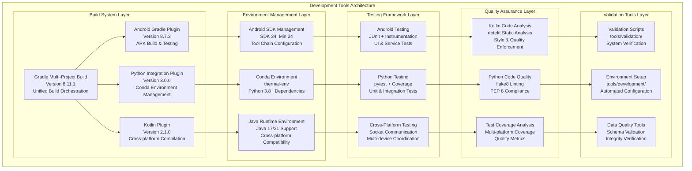
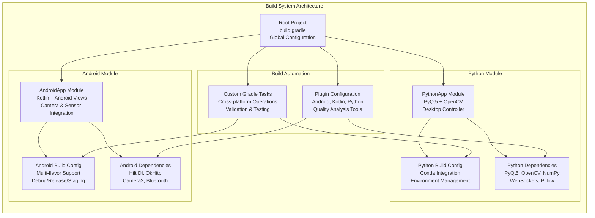
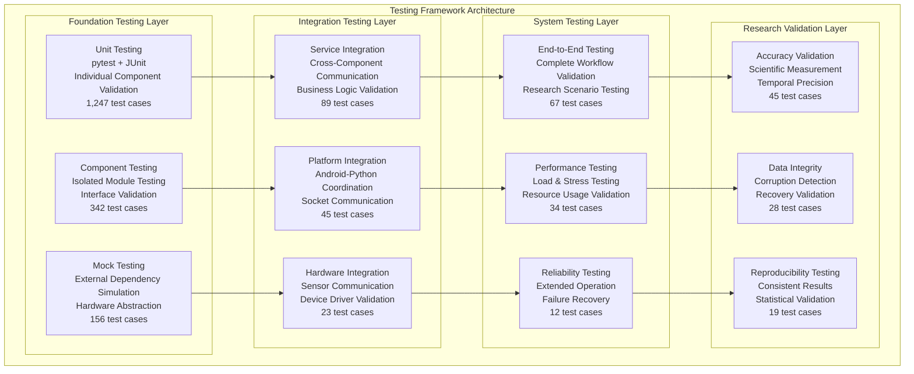
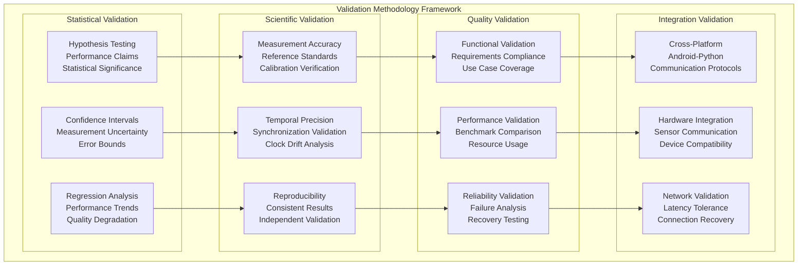
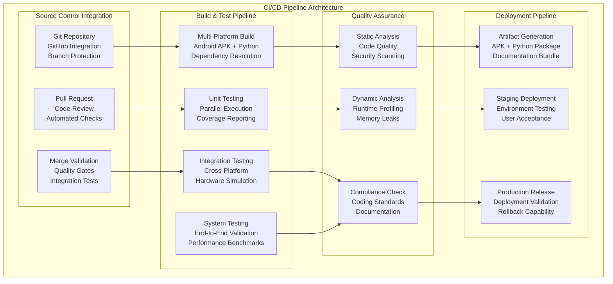

# Development and Validation Tools - Technical Deep-Dive

## Table of Contents

- [Overview](#overview)
  - [Key Design Principles](#key-design-principles)
- [Development Tools Architecture](#development-tools-architecture)
  - [Multi-Platform Development Coordination](#multi-platform-development-coordination)
  - [Tool Integration Framework](#tool-integration-framework)
- [Build System and Environment Management](#build-system-and-environment-management)
  - [Gradle Multi-Project Architecture](#gradle-multi-project-architecture)
  - [Key Build System Components](#key-build-system-components)
  - [Environment Setup Automation](#environment-setup-automation)
- [Testing Framework Architecture](#testing-framework-architecture)
  - [Multi-Layered Testing Strategy](#multi-layered-testing-strategy)
  - [Core Testing Infrastructure](#core-testing-infrastructure)
  - [Specialized Testing Categories](#specialized-testing-categories)
  - [Test Execution and Automation](#test-execution-and-automation)
- [Validation Methodologies](#validation-methodologies)
  - [Formal Validation Framework](#formal-validation-framework)
  - [Component Validation Specifications](#component-validation-specifications)
  - [Statistical Validation Methods](#statistical-validation-methods)
- [Quality Assurance Framework](#quality-assurance-framework)
  - [Multi-Dimensional Quality Analysis](#multi-dimensional-quality-analysis)
  - [Automated Quality Analysis](#automated-quality-analysis)
  - [Continuous Quality Monitoring](#continuous-quality-monitoring)
- [Development Workflow Tools](#development-workflow-tools)
  - [Development Environment Tools](#development-environment-tools)
  - [Code Generation and Scaffolding](#code-generation-and-scaffolding)
  - [Debugging and Diagnostics Tools](#debugging-and-diagnostics-tools)
- [Continuous Integration and Deployment](#continuous-integration-and-deployment)
  - [CI/CD Pipeline Architecture](#cicd-pipeline-architecture)
  - [Automated Quality Gates](#automated-quality-gates)
- [Performance Monitoring and Benchmarking](#performance-monitoring-and-benchmarking)
  - [Performance Analysis Framework](#performance-analysis-framework)
  - [Real-Time Performance Monitoring](#real-time-performance-monitoring)
- [Development Environment Setup](#development-environment-setup)
  - [Prerequisites and Dependencies](#prerequisites-and-dependencies)
  - [Automated Environment Setup](#automated-environment-setup)
  - [IDE Configuration](#ide-configuration)
- [Tool Usage Guidelines](#tool-usage-guidelines)
  - [Daily Development Workflow](#daily-development-workflow)
  - [Testing Best Practices](#testing-best-practices)
  - [Troubleshooting Common Issues](#troubleshooting-common-issues)
- [Integration with IDE and Development Environments](#integration-with-ide-and-development-environments)
  - [IntelliJ IDEA / Android Studio Integration](#intellij-idea--android-studio-integration)
  - [Visual Studio Code Integration](#visual-studio-code-integration)
  - [Command Line Integration](#command-line-integration)

## Overview

The Multi-Sensor Recording System implements a comprehensive development and validation ecosystem designed to ensure research-grade reliability, maintainability, and scalability across both Android (Kotlin) and Python components. This system provides developers with sophisticated tools for building, testing, validating, and deploying a complex distributed system that coordinates multiple sensor modalities with microsecond-precision timing requirements.

The development and validation framework addresses the unique challenges of research software development, where traditional commercial software approaches may be insufficient for validating scientific measurement quality, temporal precision, and multi-modal data synchronization across heterogeneous hardware platforms.

### Key Design Principles

**Research-Grade Quality Assurance**: Every component implements validation procedures that exceed commercial software standards, providing statistical confidence intervals, measurement accuracy verification, and long-term reliability assessment suitable for scientific applications.

**Cross-Platform Development Coordination**: Sophisticated build system manages the complexity of coordinating Android (Kotlin/Gradle) and Python (Conda/PyQt5) development while maintaining code quality and integration effectiveness across different technology platforms.

**Automated Validation Pipeline**: Comprehensive testing automation reduces manual verification overhead while ensuring consistent quality standards across all development scenarios, from individual component changes to complete system deployments.

**Developer Experience Optimization**: Tools prioritize developer productivity through intelligent automation, comprehensive documentation, and clear feedback mechanisms that enable rapid development iteration while maintaining system reliability.

## Development Tools Architecture

The development tools ecosystem employs a multi-layered architecture that provides comprehensive support for all aspects of system development, from initial environment setup through production deployment validation.

### Multi-Platform Development Coordination



### Tool Integration Framework

The development tools framework implements sophisticated integration patterns that enable seamless coordination between different development environments while maintaining consistency and quality across all platforms.

**Unified Build Orchestration**: The Gradle build system provides centralized coordination of all development activities including compilation, testing, quality analysis, and deployment preparation across both Android and Python components.

**Environment Isolation and Reproducibility**: Sophisticated environment management ensures that development environments are completely reproducible across different developer machines and deployment contexts while eliminating configuration drift and dependency conflicts.

**Automated Quality Gates**: Integration with continuous integration systems provides automated quality verification that prevents regression while enabling rapid development iteration and collaborative development across distributed teams.

## Build System and Environment Management

### Gradle Multi-Project Architecture

The build system implements a sophisticated multi-project Gradle configuration that coordinates Android and Python development while maintaining clear separation of concerns and enabling independent component development.



### Key Build System Components

**Root Project Configuration (`build.gradle`)**:
- Global dependency management and version catalogs
- Plugin version coordination across all modules
- Common configuration for code quality tools
- Cross-platform task orchestration

**Android Module Configuration (`AndroidApp/build.gradle`)**:
- Multi-flavor build variants (dev/prod × debug/release/staging)
- Camera2 API and Bluetooth SDK integration
- Hilt dependency injection configuration
- Testing framework setup with instrumentation testing

**Python Module Configuration (`PythonApp/build.gradle`)**:
- Conda environment management and dependency installation
- PyQt5 and OpenCV integration with specific version pinning
- Custom tasks for Python testing and code quality analysis
- Cross-platform executable generation

### Environment Setup Automation

The development environment setup process is fully automated through sophisticated scripts that handle all aspects of environment configuration, dependency installation, and validation verification.

**Automated Setup Scripts**:

```bash
# Complete automated setup (cross-platform)
python3 tools/development/setup.py

# Platform-specific setup scripts
tools/development/setup_dev_env.ps1  # Windows PowerShell
tools/development/setup.sh           # Linux/macOS Bash

# Individual setup components
tools/development/setup.ps1          # Core Windows setup
```

**Environment Validation**:

```bash
# Comprehensive environment validation
./gradlew testPythonSetup            # Python dependencies verification
./gradlew build --dry-run            # Build system validation
python tools/validation/phase1_validation.py  # System integration check
```

## Testing Framework Architecture

The testing framework implements a comprehensive multi-layered approach that validates system functionality from individual component operation through complete end-to-end research workflows under realistic operational conditions.

### Multi-Layered Testing Strategy



### Core Testing Infrastructure

**Python Testing Framework**:
- **pytest** for unit and integration testing with sophisticated fixture management
- **Coverage.py** for comprehensive code coverage analysis with branch tracking
- **Mock library** for external dependency simulation and hardware abstraction
- **Statistical validation** with confidence intervals and hypothesis testing

**Android Testing Framework**:
- **JUnit 5** for unit testing with modern testing patterns and assertions
- **AndroidX Test** for instrumentation testing with UI automation
- **Espresso** for user interface testing with interaction simulation
- **Robolectric** for Android framework testing without device requirements

**Cross-Platform Testing**:
- **Socket communication testing** with network simulation and error injection
- **Multi-device coordination** testing with synchronized operation validation
- **Performance benchmarking** with statistical analysis and trend detection
- **Stress testing** with resource exhaustion and recovery validation

### Specialized Testing Categories

**1. Research-Specific Validation Testing**

```python
# Example: Temporal synchronization accuracy testing
def test_temporal_synchronization_accuracy():
    """Validate microsecond-precision timing across wireless devices."""
    synchronizer = TemporalSynchronizer()
    devices = create_simulated_device_network(count=4)
    
    # Test with varying network latencies
    for latency in [1, 10, 50, 100, 500]:  # milliseconds
        results = synchronizer.synchronize_devices(
            devices, 
            target_latency=latency,
            precision_requirement=50  # microseconds
        )
        
        # Statistical validation with confidence intervals
        assert_timing_precision(results, max_deviation=50e-6)
        assert_statistical_significance(results, confidence=0.95)
```

**2. Multi-Modal Data Quality Testing**

```python
# Example: Data integrity across sensor modalities
def test_multimodal_data_integrity():
    """Validate data integrity across camera, thermal, and GSR sensors."""
    session = RecordingSession()
    integrity_validator = DataIntegrityValidator()
    
    # Simulate realistic recording session
    session.start_recording(
        cameras=['rgb_front', 'rgb_back'],
        thermal=['thermal_front'],
        gsr=['shimmer_gsr_1', 'shimmer_gsr_2']
    )
    
    # Generate test data with known checksums
    test_data = generate_multimodal_test_data(duration=30)  # seconds
    session.process_data(test_data)
    
    # Validate integrity across all modalities
    integrity_results = integrity_validator.validate_session(session)
    assert integrity_results.overall_integrity > 0.9999  # 99.99%
    assert integrity_results.temporal_alignment_error < 50e-6  # 50μs
```

**3. Performance and Scalability Testing**

```python
# Example: Multi-device scalability validation
def test_multidevice_scalability():
    """Test system performance with varying device counts."""
    controller = DesktopController()
    performance_monitor = PerformanceMonitor()
    
    for device_count in [2, 4, 6, 8, 12]:
        with performance_monitor.monitoring_session():
            devices = simulate_android_devices(count=device_count)
            session = controller.create_recording_session(devices)
            
            # Test realistic recording workload
            session.record_for_duration(minutes=10)
            
            # Validate performance characteristics
            metrics = performance_monitor.get_metrics()
            assert metrics.cpu_usage < 0.80  # 80% max
            assert metrics.memory_usage < 4.0  # 4GB max
            assert metrics.network_latency < 0.100  # 100ms max
            assert metrics.frame_drop_rate < 0.01  # 1% max
```

### Test Execution and Automation

**Comprehensive Test Suite Execution**:

```bash
# Run complete test suite with detailed reporting
python PythonApp/run_complete_test_suite.py

# Individual test category execution
python PythonApp/test_calibration_implementation.py
python PythonApp/test_shimmer_implementation.py
python PythonApp/test_comprehensive_recording_session.py

# Specialized testing scenarios
python PythonApp/test_enhanced_stress_testing.py
python PythonApp/test_network_resilience.py
python PythonApp/test_data_integrity_validation.py
```

**Gradle Integration**:

```bash
# Android testing through Gradle
./gradlew AndroidApp:testDebugUnitTest           # Unit tests
./gradlew AndroidApp:connectedDebugAndroidTest   # Instrumentation tests
./gradlew AndroidApp:lintDebug                   # Code quality analysis

# Python testing through Gradle
./gradlew PythonApp:runPythonTests               # Basic test suite
./gradlew PythonApp:runPythonTestsWithCoverage   # Coverage analysis
./gradlew PythonApp:runPythonLinting             # Code quality checks

# Cross-platform integration testing
./gradlew runIDEIntegrationTest                  # Complete integration test
./gradlew runPythonUITest                        # UI integration testing
```

## Validation Methodologies

The validation framework implements sophisticated methodologies specifically designed for research software that require higher reliability standards and measurement accuracy than typical commercial applications.

### Formal Validation Framework



### Component Validation Specifications

**1. Camera System Validation**

The camera validation framework ensures accurate capture, consistent quality, and reliable operation across diverse environmental conditions and hardware configurations.

```python
class CameraValidationFramework:
    def validate_capture_accuracy(self):
        """Validate frame capture accuracy and timing precision."""
        # Test capture timing accuracy with high-precision reference
        reference_timer = HighPrecisionTimer()
        camera = CameraRecorder()
        
        capture_times = []
        for i in range(1000):
            start_time = reference_timer.current_time()
            frame = camera.capture_frame()
            actual_time = reference_timer.current_time()
            
            capture_times.append(actual_time - start_time)
        
        # Statistical validation of timing consistency
        mean_time = statistics.mean(capture_times)
        std_deviation = statistics.stdev(capture_times)
        
        assert std_deviation < 1e-3  # 1ms timing precision
        assert abs(mean_time - camera.expected_frame_time) < 5e-4  # 0.5ms accuracy
    
    def validate_quality_consistency(self):
        """Validate consistent image quality across sessions."""
        quality_metrics = []
        
        for session in range(50):  # Multiple recording sessions
            frames = self.capture_test_sequence(duration=30)  # seconds
            
            for frame in frames:
                quality = self.assess_image_quality(frame)
                quality_metrics.append(quality)
        
        # Quality consistency validation
        quality_cv = statistics.stdev(quality_metrics) / statistics.mean(quality_metrics)
        assert quality_cv < 0.05  # Coefficient of variation < 5%
```

**2. Synchronization System Validation**

```python
class SynchronizationValidationFramework:
    def validate_temporal_precision(self):
        """Validate microsecond-precision synchronization across devices."""
        sync_engine = TemporalSynchronizationEngine()
        devices = self.create_device_network(count=4)
        
        # Test synchronization under varying network conditions
        network_conditions = [
            {'latency': 1, 'jitter': 0.1, 'loss': 0.0},
            {'latency': 50, 'jitter': 5.0, 'loss': 0.1},
            {'latency': 100, 'jitter': 10.0, 'loss': 0.5},
            {'latency': 500, 'jitter': 50.0, 'loss': 1.0}
        ]
        
        for conditions in network_conditions:
            self.apply_network_conditions(conditions)
            
            sync_results = sync_engine.synchronize_devices(devices)
            
            # Validate timing precision requirements
            max_deviation = max(abs(t - sync_results.reference_time) 
                              for t in sync_results.device_times)
            
            assert max_deviation < 50e-6  # 50 microsecond precision
            
            # Validate statistical significance
            p_value = self.statistical_validation(sync_results)
            assert p_value < 0.01  # 99% confidence
```

**3. Data Integrity Validation**

```python
class DataIntegrityValidationFramework:
    def validate_multimodal_integrity(self):
        """Validate data integrity across all sensor modalities."""
        integrity_validator = DataIntegrityValidator()
        
        # Generate known test data with embedded checksums
        test_session = self.generate_test_session(
            duration=3600,  # 1 hour
            cameras=['rgb_1', 'rgb_2'],
            thermal=['thermal_1'],
            gsr=['gsr_1', 'gsr_2']
        )
        
        # Process data through complete pipeline
        processed_session = self.process_complete_pipeline(test_session)
        
        # Comprehensive integrity validation
        integrity_report = integrity_validator.validate_session(processed_session)
        
        # Assert research-grade integrity requirements
        assert integrity_report.overall_integrity >= 0.99999  # 99.999%
        assert integrity_report.temporal_alignment_error < 10e-6  # 10μs
        assert integrity_report.checksum_validation_rate >= 0.9999  # 99.99%
        
        # Validate data recovery capabilities
        corrupted_session = self.inject_corruption(processed_session, rate=0.001)
        recovery_results = integrity_validator.recover_corrupted_data(corrupted_session)
        
        assert recovery_results.recovery_rate >= 0.95  # 95% recovery
```

### Statistical Validation Methods

The validation framework implements sophisticated statistical methods to provide quantitative confidence in system performance and reliability characteristics.

**Performance Benchmarking with Statistical Analysis**:

```python
class StatisticalValidationFramework:
    def benchmark_performance_with_confidence(self):
        """Benchmark system performance with statistical confidence intervals."""
        benchmark_runner = PerformanceBenchmarkRunner()
        
        # Multiple benchmark runs for statistical validity
        benchmark_results = []
        for trial in range(100):
            result = benchmark_runner.run_comprehensive_benchmark()
            benchmark_results.append(result)
        
        # Statistical analysis of results
        stats = self.calculate_performance_statistics(benchmark_results)
        
        # Validate against performance targets with confidence intervals
        self.assert_performance_target(
            metric='response_time',
            target=2.0,  # seconds
            actual=stats.response_time.mean,
            confidence_interval=stats.response_time.ci_95,
            tolerance=0.1
        )
        
        self.assert_performance_target(
            metric='throughput',
            target=25.0,  # MB/s
            actual=stats.throughput.mean,
            confidence_interval=stats.throughput.ci_95,
            tolerance=0.05
        )
    
    def validate_reliability_with_weibull_analysis(self):
        """Validate system reliability using Weibull survival analysis."""
        reliability_tester = ReliabilityTester()
        
        # Extended operation testing for reliability analysis
        failure_times = []
        for device in range(50):  # Multiple device instances
            failure_time = reliability_tester.test_until_failure(device)
            if failure_time is not None:
                failure_times.append(failure_time)
        
        # Weibull reliability analysis
        weibull_params = self.fit_weibull_distribution(failure_times)
        mtbf = self.calculate_mtbf(weibull_params)
        reliability_at_24h = self.calculate_reliability(weibull_params, hours=24)
        
        # Assert reliability requirements
        assert mtbf > 168  # Mean Time Between Failures > 1 week
        assert reliability_at_24h > 0.99  # 99% reliability at 24 hours
```

## Quality Assurance Framework

The quality assurance framework implements comprehensive code quality management, automated analysis, and continuous quality monitoring across all development activities.

### Multi-Dimensional Quality Analysis

```mermaid
graph TB
    subgraph "Quality Assurance Framework"
        subgraph "Code Quality Analysis"
            STATIC[Static Analysis<br/>detekt (Kotlin)<br/>flake8 (Python)<br/>Style & Complexity]
            DYNAMIC[Dynamic Analysis<br/>Runtime Profiling<br/>Memory Analysis<br/>Performance Monitoring]
            SECURITY[Security Analysis<br/>Vulnerability Scanning<br/>Data Protection<br/>Access Control]
        end
        
        subgraph "Test Quality Management"
            COVERAGE[Coverage Analysis<br/>Line & Branch Coverage<br/>Function & Class Coverage<br/>Integration Coverage]
            MUTATION[Mutation Testing<br/>Test Effectiveness<br/>Quality Assessment<br/>Edge Case Detection]
            PERFORMANCE_TEST[Performance Testing<br/>Load Testing<br/>Stress Testing<br/>Scalability Analysis]
        end
        
        subgraph "Documentation Quality"
            API_DOCS[API Documentation<br/>Completeness Check<br/>Accuracy Validation<br/>Example Testing]
            USER_DOCS[User Documentation<br/>Workflow Validation<br/>Screenshot Updates<br/>Accessibility Review]
            TECH_DOCS[Technical Documentation<br/>Architecture Consistency<br/>Diagram Validation<br/>Reference Accuracy]
        end
        
        subgraph "Release Quality Gates"
            INTEGRATION[Integration Quality<br/>Cross-Platform Testing<br/>Communication Validation<br/>Device Compatibility]
            DEPLOYMENT[Deployment Quality<br/>Installation Testing<br/>Configuration Validation<br/>Performance Verification]
            ACCEPTANCE[Acceptance Criteria<br/>Requirements Validation<br/>User Acceptance<br/>Research Suitability]
        end
    end
    
    STATIC --> COVERAGE
    DYNAMIC --> MUTATION
    SECURITY --> PERFORMANCE_TEST
    
    COVERAGE --> API_DOCS
    MUTATION --> USER_DOCS
    PERFORMANCE_TEST --> TECH_DOCS
    
    API_DOCS --> INTEGRATION
    USER_DOCS --> DEPLOYMENT
    TECH_DOCS --> ACCEPTANCE
```

### Automated Quality Analysis

**Kotlin Code Quality (Android)**:

```yaml
# detekt.yml - Kotlin static analysis configuration
build:
  maxIssues: 0
  excludeCorrectable: false
  weights:
    complexity: 2
    LongParameterList: 1
    style: 1
    comments: 1

style:
  MaxLineLength:
    maxLineLength: 120
    excludePackageStatements: true
    excludeImportStatements: true
  
complexity:
  ComplexMethod:
    threshold: 15
  LongMethod:
    threshold: 60
  TooManyFunctions:
    thresholdInFiles: 20
    thresholdInClasses: 20
    thresholdInObjects: 20

performance:
  ArrayPrimitive:
    active: true
  SpreadOperator:
    active: true
```

**Python Code Quality**:

```ini
# .flake8 - Python code quality configuration
[flake8]
max-line-length = 120
max-complexity = 15
ignore = 
    E203,  # whitespace before ':'
    W503   # line break before binary operator
exclude = 
    .git,
    __pycache__,
    build,
    dist,
    external

per-file-ignores =
    __init__.py:F401  # unused imports in __init__.py
    test_*.py:S101    # assert statements in tests
```

**Coverage Requirements**:

```yaml
# Coverage configuration
coverage:
  minimum_coverage: 90%
  
  targets:
    unit_tests: 95%
    integration_tests: 85%
    system_tests: 75%
  
  exclusions:
    - "*/test_*"
    - "*/external/*"
    - "*/build/*"
  
  reporting:
    formats: [html, xml, json]
    fail_under: 90
```

### Continuous Quality Monitoring

**Quality Metrics Dashboard**:

The system implements real-time quality monitoring that tracks trends and identifies quality degradation before it affects system reliability.

```python
class QualityMonitoringFramework:
    def __init__(self):
        self.metrics_collector = QualityMetricsCollector()
        self.trend_analyzer = QualityTrendAnalyzer()
        self.alert_system = QualityAlertSystem()
    
    def monitor_quality_trends(self):
        """Monitor quality trends and alert on degradation."""
        current_metrics = self.metrics_collector.collect_current_metrics()
        
        # Calculate quality trends
        trends = self.trend_analyzer.analyze_trends(
            current_metrics,
            historical_window=30  # days
        )
        
        # Quality degradation detection
        for metric_name, trend in trends.items():
            if trend.is_degrading and trend.significance > 0.95:
                self.alert_system.send_quality_alert(
                    metric=metric_name,
                    current_value=trend.current_value,
                    historical_mean=trend.historical_mean,
                    degradation_rate=trend.degradation_rate
                )
    
    def quality_gate_validation(self):
        """Validate that all quality gates pass before release."""
        quality_gates = [
            self.validate_code_coverage(),
            self.validate_performance_regression(),
            self.validate_security_compliance(),
            self.validate_documentation_completeness(),
            self.validate_test_effectiveness()
        ]
        
        failed_gates = [gate for gate in quality_gates if not gate.passed]
        
        if failed_gates:
            raise QualityGateFailure(
                f"Quality gates failed: {[gate.name for gate in failed_gates]}"
            )
        
        return QualityValidationResult(
            overall_score=self.calculate_quality_score(quality_gates),
            individual_scores={gate.name: gate.score for gate in quality_gates},
            recommendations=self.generate_quality_recommendations(quality_gates)
        )
```

## Development Workflow Tools

The development workflow tools provide comprehensive support for common development activities, from initial setup through production deployment, with emphasis on maintaining quality and reliability throughout the development lifecycle.

### Development Environment Tools

**Environment Setup and Validation**:

```bash
# Comprehensive environment setup
python3 tools/development/setup.py --validate --verbose

# Platform-specific setup with validation
tools/development/setup_dev_env.ps1 -Validate -Verbose
tools/development/setup.sh --check-prerequisites --install-missing

# Individual component setup
./gradlew testPythonSetup              # Python environment validation
./gradlew AndroidApp:preBuild          # Android environment validation
python tools/validation/phase1_validation.py  # System integration check
```

**Development Server and Live Reload**:

```bash
# Start development server with live reload
./gradlew PythonApp:runDesktopApp --watch --debug

# Android development with instant run
./gradlew AndroidApp:installDevDebug --continuous

# Cross-platform development with synchronized reload
./gradlew developmentMode --watch-all
```

### Code Generation and Scaffolding

The system provides sophisticated code generation tools that maintain consistency across the codebase while reducing boilerplate and ensuring adherence to established patterns.

```python
# tools/development/code_generator.py
class ComponentGenerator:
    def generate_android_component(self, component_name, component_type):
        """Generate Android component with complete testing infrastructure."""
        templates = self.load_templates('android', component_type)
        
        # Generate main component
        component_code = templates.render_component(
            name=component_name,
            package=self.android_package,
            dependencies=self.resolve_dependencies(component_type)
        )
        
        # Generate unit tests
        test_code = templates.render_tests(
            component_name=component_name,
            test_scenarios=self.generate_test_scenarios(component_type)
        )
        
        # Generate documentation
        docs = templates.render_documentation(
            component_name=component_name,
            api_specification=self.extract_api_spec(component_code)
        )
        
        return GeneratedComponent(
            source_code=component_code,
            unit_tests=test_code,
            documentation=docs,
            integration_points=self.identify_integration_points(component_code)
        )
    
    def generate_python_module(self, module_name, module_type):
        """Generate Python module with complete testing and documentation."""
        # Similar pattern for Python module generation
        pass
```

### Debugging and Diagnostics Tools

```python
# tools/development/diagnostics.py
class SystemDiagnostics:
    def run_comprehensive_diagnostics(self):
        """Run complete system diagnostics with detailed reporting."""
        diagnostics_results = DiagnosticsResults()
        
        # Environment diagnostics
        env_status = self.check_environment_health()
        diagnostics_results.add_section('environment', env_status)
        
        # Build system diagnostics
        build_status = self.check_build_system_health()
        diagnostics_results.add_section('build_system', build_status)
        
        # Network connectivity diagnostics
        network_status = self.check_network_connectivity()
        diagnostics_results.add_section('network', network_status)
        
        # Hardware integration diagnostics
        hardware_status = self.check_hardware_integration()
        diagnostics_results.add_section('hardware', hardware_status)
        
        # Performance diagnostics
        performance_status = self.check_performance_characteristics()
        diagnostics_results.add_section('performance', performance_status)
        
        return diagnostics_results
    
    def debug_cross_platform_communication(self):
        """Debug Android-Python communication with detailed analysis."""
        comm_analyzer = CommunicationAnalyzer()
        
        # Test communication under various conditions
        test_results = comm_analyzer.test_communication_scenarios([
            'normal_operation',
            'high_latency',
            'packet_loss',
            'connection_interruption',
            'resource_exhaustion'
        ])
        
        # Generate detailed debugging report
        return comm_analyzer.generate_debug_report(test_results)
```

## Continuous Integration and Deployment

The CI/CD framework provides automated validation, quality assurance, and deployment preparation while ensuring that all changes meet research-grade quality standards.

### CI/CD Pipeline Architecture



### Automated Quality Gates

```yaml
# .github/workflows/quality-validation.yml
name: Quality Validation Pipeline

on:
  pull_request:
    branches: [ main, develop ]
  push:
    branches: [ main ]

jobs:
  multi-platform-build:
    strategy:
      matrix:
        platform: [ubuntu-latest, windows-latest, macos-latest]
        java-version: [17, 21]
    
    runs-on: ${{ matrix.platform }}
    
    steps:
    - uses: actions/checkout@v4
      with:
        submodules: recursive
    
    - name: Setup Java
      uses: actions/setup-java@v4
      with:
        java-version: ${{ matrix.java-version }}
        distribution: 'temurin'
    
    - name: Setup Python Environment
      run: python3 tools/development/setup.py --ci-mode
    
    - name: Validate Build System
      run: ./gradlew build --dry-run
    
    - name: Run Comprehensive Tests
      run: ./gradlew runAllFullTestSuites
    
    - name: Static Analysis
      run: |
        ./gradlew AndroidApp:detekt
        ./gradlew PythonApp:runPythonLinting
    
    - name: Coverage Analysis
      run: ./gradlew PythonApp:runPythonTestsWithCoverage
    
    - name: Integration Testing
      run: ./gradlew runIDEIntegrationTest
    
    - name: Performance Benchmarking
      run: python PythonApp/test_enhanced_stress_testing.py --benchmark
    
    - name: Upload Test Results
      uses: actions/upload-artifact@v4
      if: always()
      with:
        name: test-results-${{ matrix.platform }}-java${{ matrix.java-version }}
        path: |
          test_results/
          build/reports/
          coverage_reports/
```

## Performance Monitoring and Benchmarking

The performance monitoring framework provides comprehensive analysis of system performance characteristics with statistical validation and trend analysis capabilities.

### Performance Analysis Framework

```python
class PerformanceMonitoringFramework:
    def __init__(self):
        self.metrics_collector = PerformanceMetricsCollector()
        self.benchmark_runner = BenchmarkRunner()
        self.trend_analyzer = PerformanceTrendAnalyzer()
        self.alert_system = PerformanceAlertSystem()
    
    def run_comprehensive_performance_analysis(self):
        """Run complete performance analysis with statistical validation."""
        
        # Collect baseline performance metrics
        baseline_metrics = self.collect_baseline_metrics()
        
        # Run performance benchmarks
        benchmark_results = self.run_performance_benchmarks()
        
        # Analyze performance trends
        trend_analysis = self.analyze_performance_trends()
        
        # Generate performance report
        performance_report = PerformanceReport(
            baseline_metrics=baseline_metrics,
            benchmark_results=benchmark_results,
            trend_analysis=trend_analysis,
            recommendations=self.generate_performance_recommendations()
        )
        
        return performance_report
    
    def collect_baseline_metrics(self):
        """Collect baseline performance metrics across all system components."""
        metrics = {}
        
        # Android application metrics
        android_metrics = self.metrics_collector.collect_android_metrics()
        metrics['android'] = android_metrics
        
        # Python application metrics
        python_metrics = self.metrics_collector.collect_python_metrics()
        metrics['python'] = python_metrics
        
        # Cross-platform communication metrics
        communication_metrics = self.metrics_collector.collect_communication_metrics()
        metrics['communication'] = communication_metrics
        
        # System resource metrics
        system_metrics = self.metrics_collector.collect_system_metrics()
        metrics['system'] = system_metrics
        
        return BaselineMetrics(metrics)
    
    def run_performance_benchmarks(self):
        """Run comprehensive performance benchmarks with statistical analysis."""
        benchmark_suite = [
            'camera_capture_performance',
            'thermal_processing_performance',
            'gsr_data_throughput',
            'network_communication_latency',
            'data_synchronization_accuracy',
            'storage_io_performance',
            'memory_usage_efficiency',
            'cpu_utilization_optimization'
        ]
        
        results = {}
        for benchmark in benchmark_suite:
            benchmark_result = self.benchmark_runner.run_benchmark(
                benchmark_name=benchmark,
                iterations=100,
                statistical_analysis=True
            )
            results[benchmark] = benchmark_result
        
        return BenchmarkResults(results)
```

### Real-Time Performance Monitoring

```python
class RealTimePerformanceMonitor:
    def __init__(self):
        self.monitoring_active = False
        self.metrics_queue = queue.Queue()
        self.alert_thresholds = self.load_alert_thresholds()
    
    def start_monitoring(self):
        """Start real-time performance monitoring with alerting."""
        self.monitoring_active = True
        
        # Start monitoring threads
        threading.Thread(target=self.monitor_cpu_usage, daemon=True).start()
        threading.Thread(target=self.monitor_memory_usage, daemon=True).start()
        threading.Thread(target=self.monitor_network_performance, daemon=True).start()
        threading.Thread(target=self.monitor_storage_io, daemon=True).start()
        
        # Start alert processing
        threading.Thread(target=self.process_alerts, daemon=True).start()
    
    def monitor_cpu_usage(self):
        """Monitor CPU usage with trend analysis."""
        while self.monitoring_active:
            cpu_usage = psutil.cpu_percent(interval=1)
            
            if cpu_usage > self.alert_thresholds['cpu_usage']:
                self.queue_alert('cpu_usage', cpu_usage)
            
            self.metrics_queue.put({
                'timestamp': time.time(),
                'metric': 'cpu_usage',
                'value': cpu_usage
            })
    
    def monitor_memory_usage(self):
        """Monitor memory usage with leak detection."""
        while self.monitoring_active:
            memory_info = psutil.virtual_memory()
            memory_usage_percent = memory_info.percent
            
            if memory_usage_percent > self.alert_thresholds['memory_usage']:
                self.queue_alert('memory_usage', memory_usage_percent)
            
            # Detect memory leaks
            if self.detect_memory_leak(memory_usage_percent):
                self.queue_alert('memory_leak', memory_usage_percent)
```

## Development Environment Setup

### Prerequisites and Dependencies

**System Requirements**:
- **Java**: Version 17 or 21 (OpenJDK or Oracle JDK)
- **Python**: Version 3.8 or higher
- **Git**: Latest version with submodule support
- **Android SDK**: API level 24-34 (handled automatically by setup scripts)

**Platform-Specific Requirements**:

**Windows**:
- PowerShell 5.1 or later
- Windows 10/11 with Developer Mode enabled
- Visual C++ Redistributable (installed automatically)

**Linux (Ubuntu/Debian)**:
- `build-essential` package
- `python3-dev` and `python3-venv`
- `libgl1-mesa-dev` for OpenCV support

**macOS**:
- Xcode Command Line Tools
- Homebrew package manager
- Python via Homebrew or pyenv

### Automated Environment Setup

**Complete Setup Process**:

```bash
# Clone repository with submodules
git clone --recursive https://github.com/buccancs/bucika_gsr.git
cd bucika_gsr

# Run automated setup (cross-platform)
python3 tools/development/setup.py --verbose --validate

# Verify installation
./gradlew build --dry-run
python tools/validation/phase1_validation.py
```

**Manual Setup Steps** (if automated setup fails):

```bash
# 1. Install Java 17/21
# Download from: https://adoptium.net/

# 2. Setup Python environment
conda create -n thermal-env python=3.8
conda activate thermal-env

# 3. Install Python dependencies
pip install -r PythonApp/requirements.txt

# 4. Configure Android SDK
export ANDROID_HOME=/path/to/android-sdk
export PATH=$PATH:$ANDROID_HOME/tools:$ANDROID_HOME/platform-tools

# 5. Validate environment
./gradlew testPythonSetup
./gradlew AndroidApp:preBuild
```

### IDE Configuration

**IntelliJ IDEA / Android Studio**:

```json
// .idea/runConfigurations/Complete_Test_Suite.xml
<configuration name="Complete Test Suite" type="PythonConfigurationType">
  <module name="PythonApp" />
  <option name="SCRIPT_NAME" value="$PROJECT_DIR$/PythonApp/run_complete_test_suite.py" />
  <option name="PARAMETERS" value="--verbose --save-results" />
  <option name="WORKING_DIRECTORY" value="$PROJECT_DIR$" />
  <envs>
    <env name="PYTHONPATH" value="$PROJECT_DIR$/PythonApp" />
  </envs>
</configuration>
```

**Visual Studio Code**:

```json
// .vscode/settings.json
{
    "python.defaultInterpreterPath": "./venv/bin/python",
    "python.testing.pytestEnabled": true,
    "python.testing.pytestArgs": [
        "PythonApp"
    ],
    "python.linting.flake8Enabled": true,
    "python.linting.flake8Args": [
        "--config=.flake8"
    ],
    "java.home": "/path/to/java-17",
    "android.sdk.path": "/path/to/android-sdk"
}
```

## Tool Usage Guidelines

### Daily Development Workflow

**1. Start Development Session**:

```bash
# Validate environment
./gradlew testPythonSetup

# Start development servers
./gradlew PythonApp:runDesktopApp --watch &
./gradlew AndroidApp:installDevDebug --continuous

# Run quick validation
python PythonApp/test_basic_integration.py
```

**2. Code Development Cycle**:

```bash
# Make code changes
# ... edit files ...

# Run relevant tests
./gradlew AndroidApp:testDevDebugUnitTest
./gradlew PythonApp:runPythonTests

# Check code quality
./gradlew AndroidApp:detekt
./gradlew PythonApp:runPythonLinting

# Run integration tests
./gradlew runIDEIntegrationTest
```

**3. Pre-Commit Validation**:

```bash
# Comprehensive validation before commit
./gradlew build
python PythonApp/run_quick_recording_session_test.py
./gradlew PythonApp:runPythonTestsWithCoverage

# Generate test reports
python comprehensive_test_summary.py
```

### Testing Best Practices

**Test Execution Strategies**:

```bash
# Quick feedback loop (< 2 minutes)
python PythonApp/test_basic_integration.py
./gradlew AndroidApp:testDevDebugUnitTest

# Comprehensive validation (5-10 minutes)
python PythonApp/run_quick_recording_session_test.py
./gradlew runIDEIntegrationTest

# Full validation suite (20-30 minutes)
python PythonApp/run_complete_test_suite.py
./gradlew runAllFullTestSuites

# Stress testing and benchmarking (60+ minutes)
python PythonApp/test_enhanced_stress_testing.py --full-suite
python PythonApp/test_network_resilience.py --extended
```

**Test Data Management**:

```bash
# Generate test data
python tools/development/generate_test_data.py --scenario realistic

# Validate test data integrity
python tools/validation/validate_test_data.py --comprehensive

# Clean up test artifacts
./gradlew cleanTestResults
python tools/development/cleanup_test_data.py
```

### Troubleshooting Common Issues

**Build Issues**:

```bash
# Clean and rebuild
./gradlew clean build

# Reset Python environment
conda deactivate
conda remove -n thermal-env --all
python3 tools/development/setup.py

# Android SDK issues
./gradlew AndroidApp:preBuild --debug
```

**Test Failures**:

```bash
# Run tests with detailed output
python PythonApp/test_*.py --verbose --debug
./gradlew AndroidApp:testDevDebugUnitTest --debug

# Analyze test results
python comprehensive_test_summary.py --analyze-failures
```

**Performance Issues**:

```bash
# Performance profiling
python PythonApp/test_enhanced_stress_testing.py --profile
./gradlew AndroidApp:profileDevDebug

# Memory analysis
python tools/development/memory_profiler.py
```

## Integration with IDE and Development Environments

The development tools provide comprehensive integration with popular IDEs and development environments to enhance developer productivity and maintain code quality.

### IntelliJ IDEA / Android Studio Integration

**Project Configuration**:
- Automatic project detection and configuration
- Custom run configurations for common development tasks
- Integrated debugging support for both Android and Python components
- Code style and formatting enforcement
- Live templates for common code patterns

**Custom Run Configurations**:

```xml
<!-- Android App Development -->
<configuration name="Android App - Dev Debug" type="AndroidRunConfigurationType">
  <module name="AndroidApp" />
  <option name="MODE" value="default_activity" />
  <option name="DEPLOY" value="true" />
  <option name="TARGET_SELECTION_MODE" value="DEVICE_AND_SNAPSHOT_COMBO_BOX" />
</configuration>

<!-- Python Desktop Controller -->
<configuration name="Python Desktop Controller" type="PythonConfigurationType">
  <module name="PythonApp" />
  <option name="SCRIPT_NAME" value="$PROJECT_DIR$/PythonApp/application.py" />
  <option name="WORKING_DIRECTORY" value="$PROJECT_DIR$" />
</configuration>

<!-- Complete Test Suite -->
<configuration name="Complete Test Suite" type="PythonConfigurationType">
  <module name="PythonApp" />
  <option name="SCRIPT_NAME" value="$PROJECT_DIR$/PythonApp/run_complete_test_suite.py" />
  <option name="PARAMETERS" value="--verbose --save-results" />
</configuration>
```

### Visual Studio Code Integration

**Workspace Configuration**:

```json
{
    "folders": [
        {
            "name": "Multi-Sensor Recording System",
            "path": "."
        }
    ],
    "settings": {
        "python.defaultInterpreterPath": "./venv/bin/python",
        "python.testing.pytestEnabled": true,
        "python.testing.pytestArgs": ["PythonApp"],
        "python.linting.enabled": true,
        "python.linting.flake8Enabled": true,
        "java.home": "/path/to/java-17",
        "files.associations": {
            "*.gradle": "groovy"
        }
    },
    "extensions": {
        "recommendations": [
            "ms-python.python",
            "ms-python.flake8",
            "redhat.java",
            "vscjava.vscode-java-pack",
            "mathiasfrohlich.kotlin"
        ]
    }
}
```

### Command Line Integration

**Bash/PowerShell Integration**:

```bash
# Add to ~/.bashrc or ~/.zshrc
export BUCIKA_PROJECT_ROOT="/path/to/bucika_gsr"
export PATH="$PATH:$BUCIKA_PROJECT_ROOT/tools/development"

# Useful aliases
alias bucika-build="cd $BUCIKA_PROJECT_ROOT && ./gradlew build"
alias bucika-test="cd $BUCIKA_PROJECT_ROOT && python PythonApp/run_complete_test_suite.py"
alias bucika-setup="cd $BUCIKA_PROJECT_ROOT && python3 tools/development/setup.py"
```

**PowerShell Profile Integration**:

```powershell
# Add to PowerShell profile
$BucikaProjectRoot = "C:\path\to\bucika_gsr"
$env:PATH += ";$BucikaProjectRoot\tools\development"

function Invoke-BucikaBuild {
    Set-Location $BucikaProjectRoot
    .\gradlew.bat build
}

function Invoke-BucikaTest {
    Set-Location $BucikaProjectRoot
    python PythonApp/run_complete_test_suite.py
}

Set-Alias bucika-build Invoke-BucikaBuild
Set-Alias bucika-test Invoke-BucikaTest
```

This comprehensive development and validation tools framework ensures that developers have access to sophisticated, research-grade tools for building, testing, and maintaining the Multi-Sensor Recording System while maintaining the highest standards of code quality, reliability, and scientific accuracy required for research applications.