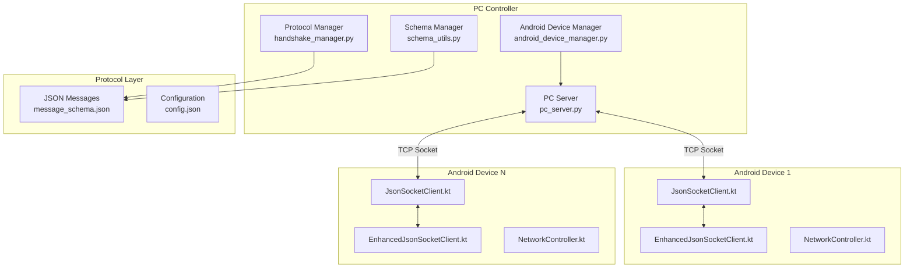
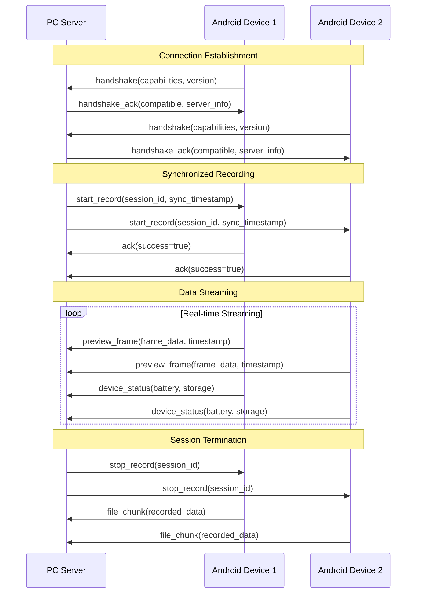

# Networking and Communication Protocol - Technical Deep-Dive

## Overview

The Networking and Communication Protocol is the foundational communication layer that enables real-time, bidirectional communication between the PC controller and Android devices in the Multi-Sensor Recording System. This protocol implements a custom socket-based architecture primarily using WebSockets with JSON messaging to facilitate command/control messages, status updates, and high-throughput data streaming.

## Component Purpose and System Role

The networking protocol serves as the central nervous system of the distributed recording architecture, coordinating synchronized multi-modal data capture across heterogeneous devices. It ensures:

- **Temporal Synchronization**: Sub-10ms timing precision across all connected devices
- **Reliable Command Distribution**: Guaranteed delivery of control commands (start/stop recording, calibration)  
- **Real-time Data Streaming**: High-throughput transfer of sensor data, preview frames, and recorded files
- **Device Management**: Dynamic device discovery, capability negotiation, and status monitoring
- **Fault Tolerance**: Automatic reconnection, error recovery, and graceful degradation

## Architecture Overview



## Key Classes and Modules

### PC-Side Implementation (Python)

#### PCServer (pc_server.py)
**Primary Responsibility**: TCP server accepting Android device connections and managing the JsonMessage protocol.

**Key Features**:
- TCP server on configurable port (default 9000)
- Multi-device connection management with connection pooling
- JsonMessage protocol with length-prefixed framing (4-byte length header + JSON payload)
- Real-time command distribution and data collection
- Device capability discovery and session management

**Core Methods**:
```python
async def start_server(self, host: str = "0.0.0.0", port: int = 9000)
async def handle_client_connection(self, client_socket, address)
async def broadcast_command(self, command: JsonMessage)
def get_connected_devices(self) -> List[ConnectedDevice]
```

#### HandshakeManager (handshake_manager.py)
**Primary Responsibility**: Protocol version negotiation and device capability exchange.

**Core Functionality**:
- Protocol version compatibility checking
- Device capability negotiation (recording, streaming, thermal imaging)
- Secure handshake with optional authentication
- Connection state management

#### AndroidDeviceManager (android_device_manager.py)
**Primary Responsibility**: High-level device lifecycle management and coordination.

**Key Features**:
- Device registration and deregistration
- Capability-based device grouping
- Synchronized command execution across device groups
- Device health monitoring and automatic recovery

#### SchemaManager (schema_utils.py)
**Primary Responsibility**: JSON message validation and protocol compliance.

**Core Functionality**:
- Message schema validation against message_schema.json
- Protocol version management
- Message serialization/deserialization with error handling
- Type safety enforcement for network messages

### Android-Side Implementation (Kotlin)

#### JsonSocketClient.kt
**Primary Responsibility**: Base TCP socket communication with length-prefixed JSON messaging.

**Core Features**:
- TCP connection to PC server on port 9000
- Length-prefixed framing for reliable message boundaries
- Auto-reconnection with exponential backoff
- Command processing and acknowledgment system

**Key Methods**:
```kotlin
suspend fun connect(serverIp: String, serverPort: Int): Boolean
suspend fun sendMessage(message: JsonMessage): Boolean
fun setCommandCallback(callback: (JsonMessage) -> Unit)
suspend fun disconnect()
```

#### EnhancedJsonSocketClient.kt
**Primary Responsibility**: Advanced networking with quality-of-service, prioritization, and performance monitoring.

**Advanced Features**:
- Message prioritization with bounded priority queues
- Round-trip time (RTT) measurement and jitter calculation
- Adaptive quality control based on network conditions
- Flow control with backpressure handling
- Comprehensive network quality metrics

**Technical Architecture**:
- **Priority Queue Implementation**: O(log n) insertion complexity for message ordering
- **Temporal Synchronization**: NTP-like clock alignment algorithms
- **Adaptive Streaming**: Dynamic frame rate and compression adjustment
- **Fault Tolerance**: Multi-layer redundancy and graceful degradation

#### NetworkController.kt
**Primary Responsibility**: High-level network management integrated with Android UI and lifecycle.

**Key Features**:
- Network connectivity monitoring using ConnectivityManager.NetworkCallback
- Streaming session management with coroutine-based async operations
- Quality management with adaptive streaming based on network conditions
- Error handling and recovery with state preservation

**Streaming Quality Levels**:
```kotlin
enum class StreamingQuality {
    LOW("Low (480p, 15fps)"),      // 500 KB/s
    MEDIUM("Medium (720p, 30fps)"), // 1.2 MB/s
    HIGH("High (1080p, 30fps)"),   // 2.5 MB/s
    ULTRA("Ultra (1080p, 60fps)")  // 4.0 MB/s
}
```

## Complex Algorithms and Logic

### Message Prioritization and Queuing Theory

The enhanced client employs a sophisticated priority-based message queuing system designed for real-time sensor applications:

```kotlin
// Priority levels for different message types
enum class MessagePriority(val value: Int) {
    CRITICAL(0),    // Emergency stop, error conditions
    HIGH(1),        // Start/stop recording commands
    NORMAL(2),      // Status updates, configuration
    LOW(3),         // Preview frames, non-critical data
    BACKGROUND(4)   // File transfers, bulk data
}

// Priority queue implementation with bounded capacity
class PriorityMessageQueue(private val capacity: Int = 1000) {
    private val queues = Array(5) { ArrayDeque<QueuedMessage>() }
    private val queueSizes = AtomicIntegerArray(5)
    
    suspend fun enqueue(message: JsonMessage, priority: MessagePriority): Boolean {
        val priorityIndex = priority.value
        
        return mutex.withLock {
            if (queueSizes[priorityIndex] < capacity / 5) {
                queues[priorityIndex].addLast(QueuedMessage(message, System.nanoTime()))
                queueSizes.incrementAndGet(priorityIndex)
                true
            } else {
                // Handle queue overflow with priority-based dropping
                false
            }
        }
    }
}
```

### Temporal Synchronization Framework

The protocol implements sophisticated time synchronization for precise multi-device coordination:

```kotlin
class TimeSynchronization {
    private var clockOffset: AtomicLong = AtomicLong(0)
    private var roundTripTime: AtomicLong = AtomicLong(0)
    
    suspend fun synchronizeTime(serverTime: Long): Long {
        val localTime = System.currentTimeMillis()
        val pingStartTime = System.nanoTime()
        
        // Send ping message
        val pingMessage = JsonMessage(
            type = "ping",
            timestamp = pingStartTime,
            data = mapOf("local_time" to localTime)
        )
        
        sendMessage(pingMessage)
        
        // Wait for pong response
        val pongResponse = awaitPongResponse(pingStartTime)
        val pingEndTime = System.nanoTime()
        
        // Calculate round-trip time
        val rtt = (pingEndTime - pingStartTime) / 1_000_000 // Convert to ms
        roundTripTime.set(rtt)
        
        // Calculate clock offset using NTP algorithm
        val serverTimestamp = pongResponse.timestamp
        val networkDelay = rtt / 2
        val synchronizedTime = serverTimestamp + networkDelay
        val offset = synchronizedTime - localTime
        
        clockOffset.set(offset)
        return synchronizedTime
    }
}
```

### Adaptive Quality Control System

The protocol dynamically adjusts streaming quality based on network conditions:

```kotlin
class AdaptiveQualityController {
    private var currentQuality = StreamingQuality.MEDIUM
    private val networkMetrics = NetworkMetrics()
    
    fun evaluateAndAdjustQuality() {
        val metrics = networkMetrics.getCurrentMetrics()
        
        val qualityScore = calculateQualityScore(
            latency = metrics.averageLatency,
            bandwidth = metrics.availableBandwidth,
            packetLoss = metrics.packetLossRate,
            jitter = metrics.jitterMs
        )
        
        val recommendedQuality = when {
            qualityScore > 0.8 -> StreamingQuality.ULTRA
            qualityScore > 0.6 -> StreamingQuality.HIGH
            qualityScore > 0.4 -> StreamingQuality.MEDIUM
            else -> StreamingQuality.LOW
        }
        
        if (recommendedQuality != currentQuality) {
            updateStreamingQuality(recommendedQuality)
        }
    }
}
```

### SSL/TLS Security Implementation

The protocol provides comprehensive security features with configurable encryption:

```python
# PC Server SSL Configuration
class SecureServerSocket:
    def __init__(self):
        self.ssl_context = ssl.create_default_context(ssl.Purpose.CLIENT_AUTH)
        self.ssl_context.minimum_version = ssl.TLSVersion.TLSv1_2
        
    def configure_ssl(self, certfile, keyfile, ca_certs=None):
        """Configure SSL/TLS encryption with recommended cipher suites"""
        self.ssl_context.set_ciphers(
            'ECDHE+AESGCM:ECDHE+CHACHA20:DHE+AESGCM:DHE+CHACHA20:!aNULL:!MD5:!DSS'
        )
        self.ssl_context.load_cert_chain(certfile, keyfile)
        if ca_certs:
            self.ssl_context.load_verify_locations(ca_certs)
            self.ssl_context.verify_mode = ssl.CERT_REQUIRED
```

### Rate Limiting and DoS Protection

Sliding window rate limiter prevents denial-of-service attacks:

```python
class RateLimiter:
    def __init__(self, max_requests_per_minute=60):
        self._max_requests_per_minute = max_requests_per_minute
        self._rate_limiter = defaultdict(list)
        self._lock = threading.Lock()
    
    def check_rate_limit(self, device_ip: str) -> bool:
        """Check if request is within rate limits using sliding window"""
        with self._lock:
            current_time = time.time()
            requests = self._rate_limiter[device_ip]
            
            # Remove requests older than 60 seconds
            requests[:] = [t for t in requests if current_time - t < 60]
            
            if len(requests) >= self._max_requests_per_minute:
                return False
            
            requests.append(current_time)
            return True

    def get_rate_info(self, device_ip: str) -> dict:
        """Get current rate limiting information"""
        with self._lock:
            requests = self._rate_limiter[device_ip]
            return {
                'current_requests': len(requests),
                'max_requests': self._max_requests_per_minute,
                'remaining_requests': self._max_requests_per_minute - len(requests)
            }
```

### Enhanced Performance Monitoring

Real-time performance metrics collection and analysis:

```python
class PerformanceMonitor:
    def __init__(self):
        self.metrics = {
            'messages_sent': 0,
            'messages_received': 0,
            'average_latency_ms': 0.0,
            'connected_devices': 0,
            'pending_acknowledgments': 0,
            'error_count': 0,
            'bytes_transmitted': 0,
            'successful_handshakes': 0,
            'failed_connections': 0
        }
        self._latency_samples = deque(maxlen=100)  # Keep last 100 samples
        self._lock = threading.Lock()
    
    def record_latency(self, latency_ms: float):
        """Record latency measurement for statistics"""
        with self._lock:
            self._latency_samples.append(latency_ms)
            if self._latency_samples:
                self.metrics['average_latency_ms'] = sum(self._latency_samples) / len(self._latency_samples)
    
    def get_performance_report(self) -> dict:
        """Generate comprehensive performance report"""
        with self._lock:
            latency_stats = self._calculate_latency_statistics()
            return {
                **self.metrics,
                'latency_statistics': latency_stats,
                'uptime_seconds': time.time() - self._start_time,
                'message_rate_per_second': self._calculate_message_rate()
            }
    
    def _calculate_latency_statistics(self) -> dict:
        """Calculate detailed latency statistics"""
        if not self._latency_samples:
            return {}
        
        samples = list(self._latency_samples)
        return {
            'min_ms': min(samples),
            'max_ms': max(samples),
            'mean_ms': sum(samples) / len(samples),
            'median_ms': sorted(samples)[len(samples) // 2],
            'p95_ms': sorted(samples)[int(len(samples) * 0.95)],
            'p99_ms': sorted(samples)[int(len(samples) * 0.99)],
            'sample_count': len(samples)
        }
```

### Capability Negotiation System

Dynamic feature discovery allows devices to negotiate supported capabilities:

```python
class CapabilityNegotiator:
    def __init__(self):
        self.server_capabilities = {
            'recording': True,
            'streaming': True,
            'thermal_imaging': True,
            'gsr_monitoring': True,
            'audio_recording': True,
            'gyroscope_data': True,
            'accelerometer_data': True,
            'ssl_encryption': True,
            'file_transfer': True,
            'real_time_preview': True
        }
    
    def negotiate_capabilities(self, device_id: int, requested_capabilities: list) -> dict:
        """Negotiate capabilities with a specific device"""
        device = self.get_device(device_id)
        if not device:
            return {}
        
        negotiated = {}
        for capability in requested_capabilities:
            server_supports = self.server_capabilities.get(capability, False)
            device_supports = device.supports_capability(capability)
            negotiated[capability] = server_supports and device_supports
        
        # Store negotiated capabilities for this device
        device.set_negotiated_capabilities(negotiated)
        
        return negotiated
    
    def get_device_capabilities(self, device_id: int) -> dict:
        """Get negotiated capabilities for a device"""
        device = self.get_device(device_id)
        return device.get_negotiated_capabilities() if device else {}
```
            jitter = metrics.jitterVariance,
            packetLoss = metrics.packetLossRate,
            bandwidth = metrics.availableBandwidth
        )
        
        val recommendedQuality = when {
            qualityScore >= 0.8 -> StreamingQuality.ULTRA
            qualityScore >= 0.6 -> StreamingQuality.HIGH
            qualityScore >= 0.4 -> StreamingQuality.MEDIUM
            else -> StreamingQuality.LOW
        }
        
        if (recommendedQuality != currentQuality) {
            adjustStreamingQuality(recommendedQuality)
            currentQuality = recommendedQuality
        }
    }
    
    private fun calculateQualityScore(
        latency: Double, 
        jitter: Double, 
        packetLoss: Double, 
        bandwidth: Double
    ): Double {
        // Weighted scoring algorithm considering multiple factors
        val latencyScore = max(0.0, 1.0 - latency / 1000.0) // Normalize to 1s max
        val jitterScore = max(0.0, 1.0 - jitter / 100.0)   // Normalize to 100ms max
        val lossScore = max(0.0, 1.0 - packetLoss)          // Direct percentage
        val bandwidthScore = min(1.0, bandwidth / 10.0)     // Normalize to 10 Mbps
        
        return (latencyScore * 0.3 + jitterScore * 0.2 + lossScore * 0.3 + bandwidthScore * 0.2)
    }
}
```

## System Integration

### Message Flow Architecture

The protocol follows a structured message flow pattern for different operation types:



### Error Handling and Recovery

The protocol implements multi-layer error handling and recovery mechanisms:

1. **Connection-Level Recovery**: Automatic reconnection with exponential backoff
2. **Message-Level Recovery**: Acknowledgment-based retransmission for critical commands
3. **Session-Level Recovery**: State preservation and restoration after network interruptions
4. **Application-Level Recovery**: Graceful degradation and emergency stop capabilities

### Performance Monitoring Integration

The protocol includes comprehensive performance monitoring that integrates with the application's monitoring infrastructure:

```kotlin
class NetworkPerformanceMonitor {
    private val metricsCollector = MetricsCollector()
    
    fun recordMessageLatency(messageType: String, latencyMs: Long) {
        metricsCollector.recordLatency("network.message.$messageType", latencyMs)
    }
    
    fun recordThroughput(bytesTransferred: Long, durationMs: Long) {
        val throughputMbps = (bytesTransferred * 8.0) / (durationMs * 1000.0)
        metricsCollector.recordThroughput("network.throughput", throughputMbps)
    }
    
    fun recordConnectionEvent(eventType: String, deviceId: String) {
        metricsCollector.recordEvent("network.connection", mapOf(
            "type" to eventType,
            "device_id" to deviceId,
            "timestamp" to System.currentTimeMillis()
        ))
    }
}
```

## Integration Guidelines

### PC Application Integration

To integrate the networking protocol in the PC application:

1. **Initialize Server**: Create and start PCServer instance
2. **Register Callbacks**: Set up message handlers for different command types
3. **Device Management**: Use AndroidDeviceManager for high-level device operations
4. **Message Validation**: Employ SchemaManager for protocol compliance

```python
# Example integration
server = PCServer(port=9000)
device_manager = AndroidDeviceManager(server)
schema_manager = SchemaManager()

# Register message handlers
server.register_handler("device_status", handle_device_status)
server.register_handler("preview_frame", handle_preview_frame)

# Start server
await server.start_server()
```

### Android Application Integration

To integrate the networking protocol in the Android application:

1. **Dependency Injection**: Inject NetworkController via Hilt
2. **Lifecycle Management**: Initialize in onCreate, cleanup in onDestroy
3. **Callback Implementation**: Implement NetworkCallback interface
4. **Permission Setup**: Ensure network permissions are configured

```kotlin
@AndroidEntryPoint
class MainActivity : AppCompatActivity(), NetworkController.NetworkCallback {
    
    @Inject lateinit var networkController: NetworkController
    
    override fun onCreate(savedInstanceState: Bundle?) {
        super.onCreate(savedInstanceState)
        networkController.setCallback(this)
        networkController.startNetworkMonitoring(this)
    }
    
    override fun onDestroy() {
        super.onDestroy()
        networkController.cleanup()
    }
}
```

## Performance Considerations

### Memory Management
- **Connection Pooling**: Reuse socket connections to minimize overhead
- **Buffer Management**: Configurable buffer sizes for different message types
- **Garbage Collection**: Minimize object allocation in hot paths

### CPU Optimization
- **Coroutine-based Concurrency**: Non-blocking I/O operations
- **Message Batching**: Combine multiple small messages for efficiency
- **Compression**: Optional compression for large data transfers

### Battery Optimization (Android)
- **Adaptive Heartbeat**: Adjust heartbeat frequency based on network stability
- **Background Processing**: Minimize background network activity
- **Power-aware Streaming**: Reduce quality when battery is low

## Security Considerations

### Data Protection
- **Optional TLS Encryption**: Configurable SSL/TLS for sensitive environments
- **Message Authentication**: HMAC-based message integrity verification
- **Device Whitelisting**: IP-based access control for secure networks

### Network Security
- **DoS Protection**: Rate limiting and connection throttling
- **Protocol Validation**: Strict schema validation prevents injection attacks
- **Secure Defaults**: Conservative security settings by default

This networking and communication protocol provides a robust, scalable foundation for real-time multi-device coordination in the Multi-Sensor Recording System, ensuring reliable communication while maintaining the flexibility needed for diverse research environments.