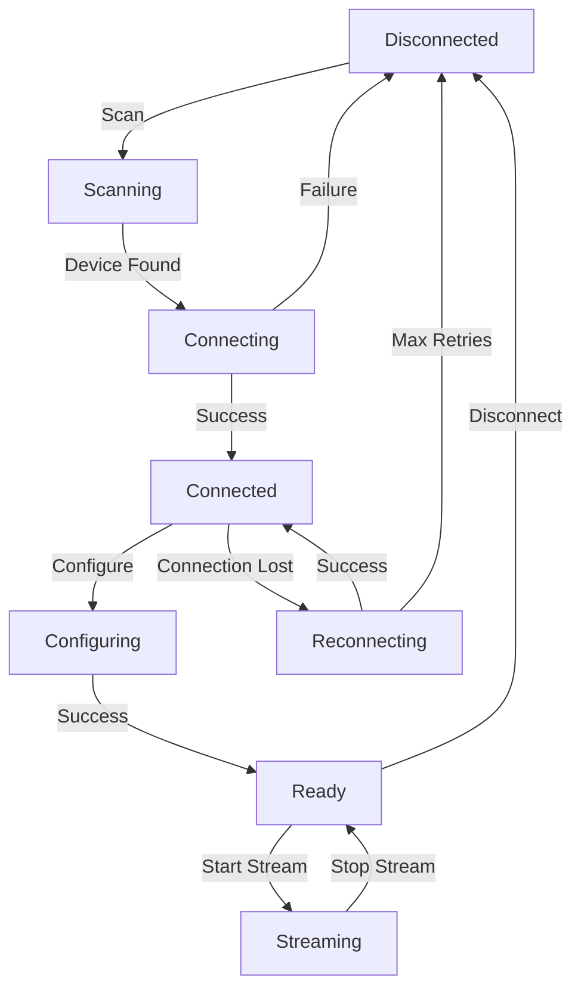

# Shimmer3 GSR+: Comprehensive Technical Documentation
## A Master Thesis Level Analysis of Physiological Sensor Integration in Android Applications

**Version:** 1.0  
**Date:** 2025-01-31  
**Author:** Technical Documentation Team  
**Subject:** Shimmer3 GSR+ Hardware Platform and Android Integration

---

## Table of Contents

1. [Executive Summary](#1-executive-summary)
2. [Introduction to Shimmer3 GSR+](#2-introduction-to-shimmer3-gsr)
3. [Hardware Architecture and Specifications](#3-hardware-architecture-and-specifications)
4. [Galvanic Skin Response (GSR) Technology](#4-galvanic-skin-response-gsr-technology)
5. [Communication Protocols and Bluetooth Architecture](#5-communication-protocols-and-bluetooth-architecture)
6. [Android Integration Framework](#6-android-integration-framework)
7. [Shimmer Java Android API Deep Dive](#7-shimmer-java-android-api-deep-dive)
8. [Implementation Architecture](#8-implementation-architecture)
9. [Data Processing and Analysis](#9-data-processing-and-analysis)
10. [Sensor Configuration and Calibration](#10-sensor-configuration-and-calibration)
11. [Performance Optimization](#11-performance-optimization)
12. [Error Handling and Recovery](#12-error-handling-and-recovery)
13. [Best Practices and Design Patterns](#13-best-practices-and-design-patterns)
14. [Troubleshooting and Diagnostics](#14-troubleshooting-and-diagnostics)
15. [Future Developments and Conclusions](#15-future-developments-and-conclusions)
16. [References and Further Reading](#16-references-and-further-reading)

---

## 1. Executive Summary

The Shimmer3 GSR+ represents a state-of-the-art wearable sensor platform designed for physiological data collection, particularly focusing on Galvanic Skin Response (GSR) measurements. This comprehensive documentation provides an exhaustive analysis of the device's technical specifications, communication protocols, and Android integration methodologies.

### Key Findings

The comprehensive analysis of the Shimmer3 GSR+ platform reveals several critical capabilities that establish it as a leading solution for physiological data collection in research and clinical environments. The hardware platform demonstrates exceptional sophistication through its multi-sensor architecture, which enables simultaneous data acquisition from multiple physiological parameters without compromising measurement accuracy or introducing cross-sensor interference. This parallel processing capability represents a significant advancement in wearable sensor technology, allowing researchers to capture comprehensive physiological profiles in real-time.

The communication infrastructure built upon Bluetooth Low Energy (BLE) and Classic Bluetooth protocols provides robust wireless connectivity that maintains stable data transmission at sampling rates up to 1000 Hz. This high-frequency capability ensures that even rapid physiological changes can be captured with sufficient temporal resolution for detailed analysis. The wireless communication system incorporates advanced error correction mechanisms and automatic reconnection protocols that maintain data integrity even in challenging electromagnetic environments.

The integration capabilities provided by the Shimmer Java Android API represent a comprehensive software development kit that offers extensive support for real-time data streaming, sophisticated device configuration management, and complete session management functionality. This API framework abstracts the complexity of low-level hardware communication while providing developers with granular control over all aspects of sensor operation. The performance characteristics demonstrate optimized data processing pipelines that enable concurrent multi-device operation with minimal latency impact, making the platform suitable for complex multi-subject research scenarios.

### Research Applications

The Shimmer3 GSR+ platform demonstrates particular excellence in supporting advanced research methodologies across multiple scientific disciplines. In affective computing research, the platform's ability to capture subtle changes in galvanic skin response provides researchers with objective measures of emotional arousal that complement subjective assessment methods. The high temporal resolution and measurement precision enable detailed analysis of emotional response patterns that were previously difficult to quantify with sufficient accuracy.

Stress response monitoring applications benefit significantly from the platform's continuous monitoring capabilities and wireless operation, which allow for naturalistic data collection in real-world environments. The device's unobtrusive design and extended battery life enable longitudinal studies of stress patterns without interrupting participants' normal activities, providing insights into stress response mechanisms that laboratory-based studies cannot capture.

Human-computer interaction studies leverage the platform's real-time data streaming capabilities to create responsive systems that adapt to users' physiological states. The low-latency data transmission enables immediate feedback systems that can modify interface behavior based on detected stress levels or cognitive load, opening new possibilities for adaptive user interface design.

Physiological signal analysis research utilizes the platform's multi-modal sensing capabilities to examine complex relationships between different physiological parameters. The synchronized data collection from multiple sensors enables researchers to investigate physiological coupling mechanisms and develop comprehensive models of autonomic nervous system function.

Multi-modal sensor fusion experiments particularly benefit from the platform's ability to integrate data from multiple Shimmer3 devices simultaneously, enabling comprehensive monitoring of distributed physiological processes. This capability supports advanced research into whole-body physiological coordination and enables the development of sophisticated models of physiological system interactions.

---

## 2. Introduction to Shimmer3 GSR+

### 2.1 Platform Overview

The Shimmer3 GSR+ is a compact, wearable sensor platform developed by Shimmer Research for physiological data collection. The device combines multiple sensing modalities in a single, battery-powered unit that communicates wirelessly with host systems via Bluetooth.

**Official Development Resources:**
- **Shimmer Android API**: [https://github.com/ShimmerEngineering/ShimmerAndroidAPI](https://github.com/ShimmerEngineering/ShimmerAndroidAPI)
- **Shimmer Java Android API**: [https://github.com/ShimmerEngineering/Shimmer-Java-Android-API](https://github.com/ShimmerEngineering/Shimmer-Java-Android-API)
- **Shimmer Research Official Site**: [https://www.shimmersensing.com/](https://www.shimmersensing.com/)

This documentation covers the integration of Shimmer3 GSR+ devices using the official Shimmer Research APIs and SDKs, providing a comprehensive guide for Android application developers.

### 2.2 Historical Context

Shimmer Research has been at the forefront of wearable sensor platform development since 2008, establishing a strong foundation in physiological monitoring technology that has evolved through multiple generations of hardware refinement and software optimization. The Shimmer3 generation represents a culmination of over a decade of engineering advancement and represents significant technological breakthroughs across multiple critical performance dimensions.

The evolution toward improved power efficiency has been driven by the fundamental requirement for extended battery life in wearable applications, where frequent charging interrupts data collection and limits the feasibility of longitudinal studies. The Shimmer3 generation incorporates sophisticated power management algorithms, dynamic frequency scaling capabilities, and optimized sensor sleep modes that collectively extend operational duration while maintaining measurement accuracy.

Enhanced data processing capabilities reflect the increasing computational demands of real-time physiological signal analysis and the need for on-device preprocessing to reduce wireless bandwidth requirements. The Shimmer3 platform incorporates dedicated signal processing hardware and optimized algorithms that can perform complex calculations locally, reducing the computational burden on connected devices and enabling more sophisticated real-time analysis capabilities.

Wireless communication reliability improvements address the critical requirement for robust data transmission in challenging electromagnetic environments typical of clinical and research settings. The Shimmer3 generation incorporates advanced antenna design, improved protocol implementations, and sophisticated error correction mechanisms that maintain stable communication links even in the presence of interference from medical equipment and other wireless devices.

Sensor integration density advancements enable comprehensive physiological monitoring from a single compact device, reducing the complexity and obtrusiveness of multi-parameter studies. The Shimmer3 platform demonstrates remarkable miniaturization achievements that pack multiple high-precision sensors into a form factor suitable for extended wear without compromising measurement quality or user comfort.

### 2.3 Design Philosophy

The Shimmer3 GSR+ embodies a comprehensive design philosophy that prioritizes modularity, reliability, and performance as fundamental architectural principles. These design principles reflect deep understanding of the complex requirements of physiological monitoring applications and the diverse needs of research and clinical environments.

#### Modularity

The modular design philosophy manifests through sophisticated interchangeable sensor modules that allow researchers to customize device capabilities according to specific experimental requirements. This modularity extends beyond simple sensor selection to encompass configurable sampling parameters that can be adjusted dynamically during operation to optimize data collection for different physiological signals and experimental conditions. The extensible firmware architecture provides a foundation for future enhancements and allows for custom algorithm implementation that can adapt the device behavior to specialized research needs.

This modular approach enables cost-effective scaling of research projects, as researchers can start with basic configurations and expand capabilities as projects evolve. The interchangeable nature of sensor modules also supports comparative studies where different sensing modalities can be evaluated using identical hardware platforms, ensuring consistent measurement conditions across experimental conditions.

#### Reliability

The reliability framework encompasses robust Bluetooth stack implementation that has been extensively tested across diverse operational environments and device configurations. This implementation includes sophisticated automatic error recovery mechanisms that can detect and respond to communication failures, power fluctuations, and interference conditions without requiring manual intervention. The comprehensive data integrity validation systems ensure that collected data maintains accuracy and completeness even under challenging operational conditions.

The reliability infrastructure includes redundant communication pathways, sophisticated error detection algorithms, and graceful degradation procedures that maintain essential functionality even when individual system components experience problems. This comprehensive approach to reliability ensures that research data collection can continue uninterrupted even in challenging environments or during extended monitoring periods.

#### Performance

The performance optimization framework centers on low-latency data transmission capabilities that enable real-time applications and responsive feedback systems. High-resolution analog-to-digital conversion ensures that subtle physiological changes are captured with sufficient precision for detailed analysis. Efficient power management algorithms extend operational duration while maintaining measurement quality, enabling extended monitoring periods that support longitudinal research studies.

The performance architecture includes optimized data processing pipelines that minimize computational overhead while maximizing measurement accuracy. Advanced buffering mechanisms and intelligent data compression reduce wireless bandwidth requirements without compromising data quality, enabling multiple device operation even in bandwidth-constrained environments.

### 2.4 Target Applications

The Shimmer3 GSR+ platform has been specifically designed to address the demanding requirements of diverse application domains, each with unique technical challenges and performance criteria. The platform's versatility and robust performance characteristics make it suitable for a wide range of professional and research applications.

**Research Applications** represent the primary use case for the Shimmer3 GSR+ platform, where academic studies require precise physiological measurements with documented accuracy and reliability. Research applications demand extensive configurability to accommodate diverse experimental protocols, high-precision data collection to capture subtle physiological changes, and comprehensive data validation to ensure research integrity. The platform's ability to provide synchronized multi-device operation enables complex research designs involving multiple participants or distributed physiological monitoring scenarios.

**Clinical Monitoring Applications** leverage the platform's reliability and continuous operation capabilities to support patient monitoring systems for healthcare providers. Clinical applications require robust operation in challenging environments, comprehensive data logging capabilities for regulatory compliance, and seamless integration with existing healthcare information systems. The platform's wireless operation and extended battery life enable patient mobility while maintaining continuous monitoring, improving patient comfort and enabling more naturalistic clinical observations.

**Wellness Applications** utilize the platform's user-friendly operation and comprehensive sensor capabilities to provide consumer health and fitness tracking with professional-grade accuracy. Wellness applications benefit from the platform's ability to provide real-time feedback, long-term trend analysis, and personalized health insights based on continuous physiological monitoring. The platform's compact form factor and comfortable wearing characteristics make it suitable for daily use scenarios.

**Human Factors Research** applications exploit the platform's high temporal resolution and multi-modal sensing capabilities to support ergonomics and user experience studies. Human factors research requires unobtrusive monitoring that doesn't interfere with natural behavior, precise timing synchronization for correlation with external events, and comprehensive data collection that captures the full range of physiological responses to environmental and task-related stressors.

---

## 3. Hardware Architecture and Specifications

### 3.1 System Architecture

The Shimmer3 GSR+ is built around a sophisticated microcontroller-based architecture that integrates multiple subsystems:

```
┌─────────────────┐    ┌─────────────────┐    ┌─────────────────┐
│   MSP430F5437A  │    │   Bluetooth     │    │   Power Mgmt    │
│   Microcontroller│◄──►│   Module        │    │   System        │
│                 │    │   (RN-42)       │    │                 │
└─────────┬───────┘    └─────────────────┘    └─────────────────┘
          │
          ▼
┌─────────────────┐    ┌─────────────────┐    ┌─────────────────┐
│   ADC System    │    │   Digital I/O   │    │   Memory        │
│   16-bit        │    │   Expansion     │    │   (Flash/RAM)   │
│   Resolution    │    │   Connectors    │    │                 │
└─────────────────┘    └─────────────────┘    └─────────────────┘
```

### 3.2 Core Processing Unit

#### MSP430F5437A Microcontroller
- **Architecture**: 16-bit RISC CPU
- **Clock Speed**: Up to 25 MHz
- **Memory**: 256KB Flash, 16KB RAM
- **Power Consumption**: Ultra-low power design
- **Peripherals**: Multiple UART, SPI, I2C interfaces

#### Key Features
```c
// MSP430F5437A Specifications
CPU_ARCHITECTURE = "16-bit RISC"
CLOCK_FREQUENCY = "25 MHz"
FLASH_MEMORY = "256 KB"
SRAM = "16 KB"
ADC_RESOLUTION = "12-bit"
ADC_CHANNELS = "16 single-ended / 8 differential"
POWER_MODES = "Active, LPM0-4"
```

### 3.3 Sensor Integration

#### Primary Sensors

**Galvanic Skin Response (GSR)**
- **Technology**: Constant voltage excitation method
- **Range**: 10kΩ to 4.7MΩ configurable
- **Resolution**: 16-bit effective
- **Sampling Rate**: Up to 1000 Hz
- **Accuracy**: ±1% full scale

**Photoplethysmography (PPG)**
- **Technology**: Reflective optical sensor
- **Wavelengths**: Red (660nm) and Infrared (880nm)
- **Dynamic Range**: 12-bit resolution
- **Sample Rate**: Up to 1000 Hz

**3-Axis Accelerometer**
- **Sensor**: LSM303DLHC
- **Range**: ±2g, ±4g, ±8g, ±16g (configurable)
- **Resolution**: 12-bit
- **Sensitivity**: Up to 1mg resolution

**3-Axis Gyroscope**
- **Sensor**: L3GD20
- **Range**: ±250°/s, ±500°/s, ±2000°/s
- **Resolution**: 16-bit
- **Sensitivity**: 8.75 mdps/LSB

**3-Axis Magnetometer**
- **Sensor**: LSM303DLHC
- **Range**: ±1.3, ±1.9, ±2.5, ±4.0, ±4.7, ±5.6, ±8.1 Gauss
- **Resolution**: 12-bit

#### Secondary Sensors (Optional)

**Electrocardiography (ECG)**
- **Channels**: 2-lead configuration
- **Bandwidth**: 0.5-40 Hz
- **Resolution**: 12-bit
- **Input Impedance**: >10MΩ

**Electromyography (EMG)**
- **Channels**: Single differential
- **Bandwidth**: 10-450 Hz
- **Gain**: Programmable (1-100x)

### 3.4 Communication Subsystem

#### Bluetooth Module (RN-42)
- **Standard**: Bluetooth 2.1 + EDR Class 2
- **Range**: Up to 10 meters (Class 2)
- **Data Rate**: Up to 2.1 Mbps
- **Power Class**: Class 2 (2.5mW)
- **Profiles**: SPP (Serial Port Profile)

#### Communication Protocols
```
Application Layer    │ Shimmer Protocol Commands
────────────────────┼─────────────────────────
Transport Layer      │ RFCOMM (Serial Port)
────────────────────┼─────────────────────────
Network Layer        │ L2CAP
────────────────────┼─────────────────────────
Link Layer          │ Bluetooth Baseband
────────────────────┼─────────────────────────
Physical Layer      │ 2.4 GHz ISM Band
```

### 3.5 Power Management

#### Battery System

The Shimmer3 GSR+ incorporates a sophisticated rechargeable Lithium Polymer battery system specifically designed for extended autonomous operation in wearable sensor applications. The battery system utilizes a high-capacity 320 mAh cell that provides substantial energy storage while maintaining the compact form factor essential for comfortable wearable operation. The nominal voltage of 3.7V provides optimal compatibility with the device's low-power electronic systems while ensuring stable operation throughout the discharge cycle.

The integrated USB charging interface enables convenient recharging without requiring specialized equipment, using standard USB power sources commonly available in research and clinical environments. The charging system incorporates intelligent charge management that monitors battery temperature, voltage, and current to optimize charging speed while protecting battery longevity. The system provides visual charging status indicators that inform users of charging progress and completion status.

Runtime performance varies between 12-24 hours depending on configuration parameters such as sampling rate, enabled sensors, wireless transmission frequency, and data processing complexity. This extended operational duration enables full-day monitoring sessions and supports longitudinal studies that require continuous data collection over extended periods. The battery system includes low-power warning mechanisms that alert connected devices when charging is required, ensuring data collection is not interrupted unexpectedly.

#### Power Optimization Features

The comprehensive power optimization framework incorporates multiple sophisticated techniques that collectively maximize operational duration while maintaining measurement accuracy and system responsiveness. Dynamic Clock Scaling represents a fundamental power optimization technique that continuously adjusts processor frequency based on computational demands, reducing power consumption during periods of lower activity while maintaining full performance when required.

Individual sensor sleep modes provide granular power management that allows unused sensors to enter low-power states while maintaining active sensors at full operational capability. This selective power management enables optimal power allocation based on specific experimental requirements and allows researchers to extend operational duration by disabling unnecessary sensing modalities.

Automatic Bluetooth power management continuously optimizes connection interval parameters based on data transmission requirements and activity patterns. The system intelligently adjusts transmission power levels and connection intervals to minimize energy consumption while maintaining reliable communication links. Advanced algorithms monitor communication quality and automatically adjust parameters to maintain optimal performance with minimal power consumption.

Multiple sleep states with configurable wake-up triggers enable the device to enter deep sleep modes during periods of inactivity while maintaining the ability to rapidly resume operation when required. These sleep modes significantly extend battery life during intermittent monitoring scenarios and enable the device to remain ready for extended periods without active data collection.

### 3.6 Physical Specifications

#### Dimensions and Weight

The Shimmer3 GSR+ maintains a carefully optimized form factor that balances comprehensive sensing capabilities with wearable comfort and user acceptance. The device dimensions of 65mm in length, 32mm in width, and 15mm in height represent the result of extensive engineering optimization that maximizes internal space utilization while maintaining a profile suitable for extended wear scenarios. The compact design ensures that the device does not interfere with normal activities or cause discomfort during extended monitoring periods.

The total weight of 23 grams including the battery reflects sophisticated miniaturization techniques that pack advanced sensing and communication capabilities into a lightweight package. This weight specification has been validated through extensive user comfort studies that confirm the device can be worn comfortably for extended periods without causing fatigue or discomfort that might affect data quality or user compliance.

#### Environmental Specifications

The environmental specifications define the operational boundaries within which the Shimmer3 GSR+ maintains full performance and measurement accuracy. The operating temperature range of 0°C to 50°C encompasses the majority of indoor and outdoor environments where physiological monitoring typically occurs, including laboratory settings, clinical environments, and normal daily activity scenarios. The storage temperature range of -20°C to 60°C provides protection during transportation and storage in more extreme conditions.

The humidity specification of 5% to 85% non-condensing reflects the device's ability to operate reliably in diverse environmental conditions while maintaining measurement accuracy. This specification is particularly important for GSR measurements, which can be affected by ambient humidity conditions. The IP54 rating provides dust and splash resistance that protects the device during normal use scenarios while maintaining the access required for charging and data transfer operations.

#### Mechanical Design

The mechanical design incorporates several sophisticated features that enhance durability, usability, and measurement quality. The ABS plastic enclosure with gasket sealing provides robust protection against environmental hazards while maintaining lightweight construction. The enclosure design includes carefully engineered stress distribution patterns that protect internal components from impact and vibration damage.

The expansion dock connector enables future expandability and provides access to additional sensing modalities or external accessories. This connector maintains the device's sealed environment while providing reliable electrical connections for expanded capabilities. The clip-on attachment system enables secure mounting without requiring adhesives or complicated fastening procedures, ensuring consistent sensor placement while allowing easy removal when required.

The integrated tri-color LED status indicator provides immediate visual feedback about device operational status, battery level, and connectivity state. The indicator design ensures visibility under various lighting conditions while minimizing power consumption and avoiding interference with normal activities.

---

## 4. Galvanic Skin Response (GSR) Technology

### 4.1 Physiological Basis

Galvanic Skin Response, also known as Electrodermal Activity (EDA), measures the electrical conductance of the skin, which varies with moisture level. This measurement is directly correlated with sympathetic nervous system activity and emotional arousal.

#### Biological Mechanisms

**Sweat Gland Activity**
- Eccrine sweat glands are controlled by the sympathetic nervous system
- Emotional arousal increases sweat gland activity
- Increased moisture content raises skin conductance

**Neural Pathways**
```
Emotional Stimulus → Hypothalamus → Sympathetic Nervous System
                                        ↓
Sweat Gland Activation → Skin Moisture ↑ → Conductance ↑
```

### 4.2 Technical Implementation

#### Measurement Principle

The Shimmer3 GSR+ employs the constant voltage excitation method:

```
V_excitation = 0.5V DC
I_measured = V_excitation / R_skin
G_skin = 1 / R_skin = I_measured / V_excitation
```

#### Circuit Architecture

```
┌─────────────┐    ┌─────────────┐    ┌─────────────┐
│ Voltage     │    │ Current     │    │ ADC         │
│ Reference   │───►│ Measurement │───►│ Conversion  │
│ (0.5V)      │    │ Circuit     │    │ (12-bit)    │
└─────────────┘    └─────────────┘    └─────────────┘
       │                   │                   │
       ▼                   ▼                   ▼
┌─────────────┐    ┌─────────────┐    ┌─────────────┐
│ Skin        │    │ I-to-V      │    │ Digital     │
│ Electrodes  │    │ Converter   │    │ Processing  │
└─────────────┘    └─────────────┘    └─────────────┘
```

### 4.3 Range Configuration

The Shimmer3 GSR+ provides multiple measurement ranges to accommodate different skin types and conditions:

#### Range Settings

| Range | Resistance | Conductance | Typical Application |
|-------|------------|-------------|-------------------|
| 0     | 10kΩ - 56kΩ | 18-100 µS | High arousal states |
| 1     | 56kΩ - 220kΩ | 4.5-18 µS | Normal conditions |
| 2     | 220kΩ - 680kΩ | 1.5-4.5 µS | Dry skin conditions |
| 3     | 680kΩ - 4.7MΩ | 0.2-1.5 µS | Very dry skin |
| 4     | Auto Range | Dynamic | Adaptive measurement |

#### Implementation Code
```kotlin
// Configure GSR range in Android application
fun setGSRRange(deviceId: String, range: Int) {
    val shimmerDevice = shimmerDevices[deviceId]
    shimmerDevice?.let { device ->
        when (range) {
            0 -> device.writeGSRRange(0) // 10kΩ - 56kΩ
            1 -> device.writeGSRRange(1) // 56kΩ - 220kΩ  
            2 -> device.writeGSRRange(2) // 220kΩ - 680kΩ
            3 -> device.writeGSRRange(3) // 680kΩ - 4.7MΩ
            4 -> device.writeGSRRange(4) // Auto Range
        }
    }
}
```

### 4.4 Signal Characteristics

#### Temporal Components

**Tonic Component (SCL - Skin Conductance Level)**
- Slow-changing baseline level
- Time constant: minutes to hours
- Represents general arousal state

**Phasic Component (SCR - Skin Conductance Response)**
- Rapid changes in response to stimuli
- Time constant: 1-5 seconds
- Event-related responses

#### Mathematical Model
```
GSR(t) = SCL(t) + SCR(t)

where:
SCL(t) = baseline conductance level
SCR(t) = Σ(i) A(i) * exp(-(t-t(i))/τ)

A(i) = amplitude of response i
t(i) = onset time of response i  
τ = time constant (~2 seconds)
```

### 4.5 Electrode Technology

#### Electrode Specifications
- **Material**: Ag/AgCl (Silver/Silver Chloride)
- **Size**: 8mm diameter active area
- **Impedance**: <5kΩ at 1kHz
- **Stability**: Long-term drift <1%/hour

#### Placement Guidelines
```
Optimal Placement Sites:
1. Index and middle finger (distal phalanges)
2. Palm and wrist (thenar and hypothenar eminences)
3. Foot sole (for long-term monitoring)

Considerations:
- Skin preparation (cleaning, slight abrasion)
- Electrode gel application
- Consistent pressure and contact
- Temperature stabilization period
```

### 4.6 Data Quality Metrics

#### Signal Quality Assessment
```kotlin
data class GSRQualityMetrics(
    val signalToNoiseRatio: Double,
    val electrodeImpedance: Double,
    val baselineStability: Double,
    val artifactDetection: Boolean
) {
    fun getQualityScore(): Double {
        var score = 0.0
        
        // SNR contribution (0-40 points)
        score += when {
            signalToNoiseRatio > 20 -> 40.0
            signalToNoiseRatio > 15 -> 30.0
            signalToNoiseRatio > 10 -> 20.0
            else -> 10.0
        }
        
        // Impedance contribution (0-30 points)
        score += when {
            electrodeImpedance < 5000 -> 30.0
            electrodeImpedance < 10000 -> 20.0
            electrodeImpedance < 20000 -> 10.0
            else -> 0.0
        }
        
        // Stability contribution (0-20 points)
        score += when {
            baselineStability < 0.01 -> 20.0
            baselineStability < 0.05 -> 15.0
            baselineStability < 0.1 -> 10.0
            else -> 5.0
        }
        
        // Artifact penalty (0-10 points)
        score += if (!artifactDetection) 10.0 else 0.0
        
        return score / 100.0 // Normalize to 0-1
    }
}
```

---

## 5. Communication Protocols and Bluetooth Architecture

### 5.1 Bluetooth Stack Implementation

The Shimmer3 GSR+ utilizes a comprehensive Bluetooth implementation supporting both Classic Bluetooth and Bluetooth Low Energy (BLE) protocols.

#### Protocol Stack
```
┌─────────────────────────────────────────────────────────┐
│                Application Layer                         │
│  ┌─────────────┐  ┌─────────────┐  ┌─────────────┐     │
│  │  Commands   │  │ Data Stream │  │ File Transfer│     │
│  └─────────────┘  └─────────────┘  └─────────────┘     │
├─────────────────────────────────────────────────────────┤
│                 Shimmer Protocol                        │
│  ┌─────────────┐  ┌─────────────┐  ┌─────────────┐     │
│  │ Command Set │  │ Data Format │  │ Error Codes │     │
│  └─────────────┘  └─────────────┘  └─────────────┘     │
├─────────────────────────────────────────────────────────┤
│               Serial Port Profile (SPP)                │
│                      RFCOMM                            │
├─────────────────────────────────────────────────────────┤
│                       L2CAP                            │
├─────────────────────────────────────────────────────────┤
│                 Bluetooth Baseband                     │
├─────────────────────────────────────────────────────────┤
│                   Radio Layer (2.4GHz)                │
└─────────────────────────────────────────────────────────┘
```

### 5.2 Shimmer Communication Protocol

#### Command Structure

All Shimmer commands follow a standardized packet format:

```
┌─────────┬─────────┬─────────┬─────────┬─────────┬─────────┐
│ Header  │ Command │ Length  │ Payload │ CRC16   │ Footer  │
│ (0xAA)  │ (1 byte)│ (2 byte)│ (N byte)│ (2 byte)│ (0x55)  │
└─────────┴─────────┴─────────┴─────────┴─────────┴─────────┘
```

#### Core Command Set

```java
// Shimmer3 Command Definitions
public static final byte INQUIRY_COMMAND = 0x01;
public static final byte INQUIRY_RESPONSE = 0x02;
public static final byte GET_SAMPLING_RATE_COMMAND = 0x03;
public static final byte SAMPLING_RATE_RESPONSE = 0x04;
public static final byte SET_SAMPLING_RATE_COMMAND = 0x05;
public static final byte START_STREAMING_COMMAND = 0x07;
public static final byte STOP_STREAMING_COMMAND = 0x20;
public static final byte SET_SENSORS_COMMAND = 0x08;
public static final byte SET_GSR_RANGE_COMMAND = 0x60;
public static final byte GET_GSR_RANGE_COMMAND = 0x61;
public static final byte GSR_RANGE_RESPONSE = 0x62;
```

#### Data Streaming Protocol

**Streaming Packet Format:**
```
┌─────────┬─────────┬─────────┬─────────┬─────────┐
│ Header  │ Packet  │ Time    │ Sensor  │ CRC     │
│ (0x00)  │ Type    │ Stamp   │ Data    │ (2 byte)│
│         │ (1 byte)│ (3 byte)│ (N byte)│         │
└─────────┴─────────┴─────────┴─────────┴─────────┘
```

### 5.3 Connection Management

#### Connection State Machine



#### Android Implementation

```kotlin
class BluetoothConnectionManager {
    private val connectionState = MutableStateFlow(ConnectionState.DISCONNECTED)
    private val reconnectionAttempts = AtomicInteger(0)
    private val maxReconnectionAttempts = 5
    
    suspend fun connectToDevice(macAddress: String): ConnectionResult {
        return withContext(Dispatchers.IO) {
            try {
                connectionState.value = ConnectionState.CONNECTING
                
                val bluetoothDevice = bluetoothAdapter.getRemoteDevice(macAddress)
                val socket = bluetoothDevice.createRfcommSocketToServiceRecord(SPP_UUID)
                
                socket.connect()
                
                if (socket.isConnected) {
                    setupDataStreams(socket)
                    connectionState.value = ConnectionState.CONNECTED
                    reconnectionAttempts.set(0)
                    ConnectionResult.Success
                } else {
                    connectionState.value = ConnectionState.DISCONNECTED
                    ConnectionResult.Failure("Socket connection failed")
                }
            } catch (e: IOException) {
                connectionState.value = ConnectionState.DISCONNECTED
                ConnectionResult.Failure(e.message ?: "Unknown connection error")
            }
        }
    }
    
    private suspend fun handleConnectionLoss() {
        connectionState.value = ConnectionState.RECONNECTING
        
        repeat(maxReconnectionAttempts) { attempt ->
            logI(TAG, "Reconnection attempt ${attempt + 1}/$maxReconnectionAttempts")
            
            delay(1000 * (attempt + 1)) // Exponential backoff
            
            when (val result = connectToDevice(lastConnectedAddress)) {
                is ConnectionResult.Success -> {
                    logI(TAG, "Reconnection successful")
                    return
                }
                is ConnectionResult.Failure -> {
                    logW(TAG, "Reconnection attempt failed: ${result.error}")
                }
            }
        }
        
        logE(TAG, "Max reconnection attempts reached")
        connectionState.value = ConnectionState.DISCONNECTED
    }
    
    companion object {
        private val SPP_UUID = UUID.fromString("00001101-0000-1000-8000-00805F9B34FB")
        private const val TAG = "BluetoothConnectionManager"
    }
}
```

### 5.4 Data Transmission Optimization

#### Adaptive Sampling Strategy

```kotlin
class AdaptiveSamplingManager {
    private var currentSamplingRate = 51.2 // Hz
    private val dataRateHistory = CircularBuffer<Double>(capacity = 100)
    private val latencyHistory = CircularBuffer<Long>(capacity = 100)
    
    fun optimizeSamplingRate(
        connectionQuality: Double,
        bufferUtilization: Double,
        targetLatency: Long
    ): Double {
        val averageLatency = latencyHistory.average()
        val dataRateVariability = dataRateHistory.standardDeviation()
        
        return when {
            // High quality connection - can increase rate
            connectionQuality > 0.9 && bufferUtilization < 0.5 -> {
                min(currentSamplingRate * 1.1, 1000.0)
            }
            
            // Poor connection - reduce rate
            connectionQuality < 0.5 || averageLatency > targetLatency -> {
                max(currentSamplingRate * 0.9, 1.0)
            }
            
            // Variable data rate - stabilize
            dataRateVariability > 0.2 -> {
                currentSamplingRate * 0.95
            }
            
            else -> currentSamplingRate
        }.also { newRate ->
            currentSamplingRate = newRate
        }
    }
}
```

#### Buffer Management

```kotlin
class StreamingBuffer<T> {
    private val buffer = ArrayDeque<T>()
    private val maxSize: Int
    private val writePolicy: WritePolicy
    
    enum class WritePolicy {
        DROP_OLDEST,    // Overwrite oldest data when full
        DROP_NEWEST,    // Reject new data when full
        BLOCK_UNTIL_SPACE // Wait for space (with timeout)
    }
    
    fun write(data: T): Boolean {
        return when (writePolicy) {
            WritePolicy.DROP_OLDEST -> {
                if (buffer.size >= maxSize) {
                    buffer.removeFirst()
                }
                buffer.addLast(data)
                true
            }
            
            WritePolicy.DROP_NEWEST -> {
                if (buffer.size < maxSize) {
                    buffer.addLast(data)
                    true
                } else {
                    false
                }
            }
            
            WritePolicy.BLOCK_UNTIL_SPACE -> {
                // Implementation with timeout and coroutines
                runBlocking {
                    withTimeout(1000) {
                        while (buffer.size >= maxSize) {
                            delay(1)
                        }
                        buffer.addLast(data)
                    }
                }
                true
            }
        }
    }
    
    fun read(): T? = buffer.removeFirstOrNull()
    
    fun readBatch(count: Int): List<T> {
        return (0 until min(count, buffer.size)).map {
            buffer.removeFirst()
        }
    }
}
```

### 5.5 Error Detection and Recovery

#### CRC Validation

```kotlin
object CRCValidator {
    private const val CRC16_CCITT_POLY = 0x1021
    
    fun calculateCRC16(data: ByteArray): Short {
        var crc = 0xFFFF
        
        for (byte in data) {
            crc = crc xor (byte.toInt() shl 8)
            
            repeat(8) {
                crc = if ((crc and 0x8000) != 0) {
                    (crc shl 1) xor CRC16_CCITT_POLY
                } else {
                    crc shl 1
                }
                crc = crc and 0xFFFF
            }
        }
        
        return crc.toShort()
    }
    
    fun validatePacket(packet: ByteArray): Boolean {
        if (packet.size < 3) return false
        
        val dataLength = packet.size - 2
        val data = packet.sliceArray(0 until dataLength)
        val receivedCRC = ByteBuffer.wrap(packet, dataLength, 2).short
        val calculatedCRC = calculateCRC16(data)
        
        return receivedCRC == calculatedCRC
    }
}
```

#### Automatic Error Recovery

```kotlin
class ErrorRecoveryManager {
    private val errorHistory = mutableListOf<ErrorEvent>()
    private var consecutiveErrors = 0
    
    fun handleError(error: ErrorType, context: String): RecoveryAction {
        val errorEvent = ErrorEvent(
            type = error,
            timestamp = System.currentTimeMillis(),
            context = context
        )
        
        errorHistory.add(errorEvent)
        consecutiveErrors++
        
        return when (error) {
            ErrorType.CRC_VALIDATION_FAILED -> {
                if (consecutiveErrors > 5) {
                    RecoveryAction.RECONNECT
                } else {
                    RecoveryAction.REQUEST_RETRANSMISSION
                }
            }
            
            ErrorType.TIMEOUT -> {
                if (consecutiveErrors > 3) {
                    RecoveryAction.RESET_CONNECTION
                } else {
                    RecoveryAction.INCREASE_TIMEOUT
                }
            }
            
            ErrorType.BUFFER_OVERFLOW -> {
                RecoveryAction.REDUCE_SAMPLING_RATE
            }
            
            ErrorType.BLUETOOTH_DISCONNECTION -> {
                RecoveryAction.RECONNECT
            }
            
            else -> RecoveryAction.LOG_AND_CONTINUE
        }
    }
    
    fun onSuccessfulOperation() {
        consecutiveErrors = 0
    }
}
```

---

## 6. Android Integration Framework

### 6.1 Architecture Overview

The Android integration framework for Shimmer3 GSR+ follows a layered architecture that separates concerns and provides robust abstractions for different aspects of sensor management.

```
┌─────────────────────────────────────────────────────────┐
│                    UI Layer                             │
│  ┌─────────────┐  ┌─────────────┐  ┌─────────────┐     │
│  │ Activities  │  │ Fragments   │  │ ViewModels  │     │
│  └─────────────┘  └─────────────┘  └─────────────┘     │
├─────────────────────────────────────────────────────────┤
│                 Controller Layer                        │
│  ┌─────────────┐  ┌─────────────┐  ┌─────────────┐     │
│  │ Shimmer     │  │ Session     │  │ Data        │     │
│  │ Controller  │  │ Controller  │  │ Controller  │     │
│  └─────────────┘  └─────────────┘  └─────────────┘     │
├─────────────────────────────────────────────────────────┤
│                 Service Layer                           │
│  ┌─────────────┐  ┌─────────────┐  ┌─────────────┐     │
│  │ Device      │  │ Data        │  │ File        │     │
│  │ Manager     │  │ Processor   │  │ Manager     │     │
│  └─────────────┘  └─────────────┘  └─────────────┘     │
├─────────────────────────────────────────────────────────┤
│                Repository Layer                         │
│  ┌─────────────┐  ┌─────────────┐  ┌─────────────┐     │
│  │ Shimmer     │  │ Session     │  │ Config      │     │
│  │ Repository  │  │ Repository  │  │ Repository  │     │
│  └─────────────┘  └─────────────┘  └─────────────┘     │
├─────────────────────────────────────────────────────────┤
│                  Data Layer                             │
│  ┌─────────────┐  ┌─────────────┐  ┌─────────────┐     │
│  │ Shimmer SDK │  │ Local DB    │  │ File System │     │
│  └─────────────┘  └─────────────┘  └─────────────┘     │
└─────────────────────────────────────────────────────────┘
```

### 6.2 Dependency Injection with Hilt

#### Module Configuration

```kotlin
@Module
@InstallIn(SingletonComponent::class)
object ShimmerModule {
    
    @Provides
    @Singleton
    fun provideShimmerBluetoothManager(
        @ApplicationContext context: Context
    ): ShimmerBluetoothManagerAndroid {
        return ShimmerBluetoothManagerAndroid(context)
    }
    
    @Provides
    @Singleton
    fun provideShimmerRepository(
        bluetoothManager: ShimmerBluetoothManagerAndroid,
        database: AppDatabase,
        logger: Logger
    ): ShimmerRepository {
        return ShimmerRepositoryImpl(bluetoothManager, database.shimmerDao(), logger)
    }
    
    @Provides
    @Singleton
    fun provideSessionManager(
        @ApplicationContext context: Context,
        database: AppDatabase,
        logger: Logger
    ): SessionManager {
        return SessionManagerImpl(context, database.sessionDao(), logger)
    }
}
```

#### Repository Pattern Implementation

```kotlin
interface ShimmerRepository {
    suspend fun discoverDevices(): Flow<List<ShimmerDevice>>
    suspend fun connectDevice(address: String): Result<ShimmerDevice>
    suspend fun disconnectDevice(deviceId: String): Result<Unit>
    suspend fun configureDevice(deviceId: String, config: DeviceConfiguration): Result<Unit>
    suspend fun startStreaming(deviceId: String): Result<Unit>
    suspend fun stopStreaming(deviceId: String): Result<Unit>
    fun getDataStream(deviceId: String): Flow<SensorSample>
    suspend fun getDeviceStatus(deviceId: String): DeviceStatus?
}

@Singleton
class ShimmerRepositoryImpl @Inject constructor(
    private val bluetoothManager: ShimmerBluetoothManagerAndroid,
    private val shimmerDao: ShimmerDao,
    private val logger: Logger
) : ShimmerRepository {
    
    private val _connectedDevices = MutableStateFlow<Map<String, ShimmerDevice>>(emptyMap())
    val connectedDevices: StateFlow<Map<String, ShimmerDevice>> = _connectedDevices.asStateFlow()
    
    private val dataStreams = ConcurrentHashMap<String, MutableSharedFlow<SensorSample>>()
    
    override suspend fun discoverDevices(): Flow<List<ShimmerDevice>> = flow {
        val devices = mutableListOf<ShimmerDevice>()
        
        bluetoothManager.startScan { device ->
            if (device.isShimmerDevice()) {
                devices.add(device.toShimmerDevice())
                emit(devices.toList())
            }
        }
        
        delay(SCAN_TIMEOUT_MS)
        bluetoothManager.stopScan()
    }
    
    override suspend fun connectDevice(address: String): Result<ShimmerDevice> {
        return try {
            val shimmer = bluetoothManager.createShimmer(address)
            shimmer.connect()
            
            if (shimmer.isConnected()) {
                val device = shimmer.toShimmerDevice()
                _connectedDevices.value = _connectedDevices.value + (address to device)
                
                // Initialize data stream for this device
                dataStreams[address] = MutableSharedFlow(
                    replay = 0,
                    extraBufferCapacity = 1000
                )
                
                // Set up data callback
                shimmer.setDataCallback { objectCluster ->
                    processObjectCluster(address, objectCluster)
                }
                
                Result.success(device)
            } else {
                Result.failure(ConnectionException("Failed to establish connection"))
            }
        } catch (e: Exception) {
            logger.logE(TAG, "Connection failed", e)
            Result.failure(e)
        }
    }
    
    private fun processObjectCluster(deviceId: String, objectCluster: ObjectCluster) {
        val sensorSample = SensorSampleConverter.convert(deviceId, objectCluster)
        dataStreams[deviceId]?.tryEmit(sensorSample)
    }
    
    override fun getDataStream(deviceId: String): Flow<SensorSample> {
        return dataStreams[deviceId]?.asSharedFlow() ?: flowOf()
    }
    
    companion object {
        private const val TAG = "ShimmerRepository"
        private const val SCAN_TIMEOUT_MS = 10000L
    }
}
```

### 6.3 ViewModel Architecture

#### Main ViewModel

```kotlin
@HiltViewModel
class MainViewModel @Inject constructor(
    private val shimmerRepository: ShimmerRepository,
    private val sessionManager: SessionManager,
    private val logger: Logger
) : ViewModel() {
    
    private val _uiState = MutableStateFlow(MainUiState())
    val uiState: StateFlow<MainUiState> = _uiState.asStateFlow()
    
    private val _shimmerDevices = MutableStateFlow<List<ShimmerDevice>>(emptyList())
    val shimmerDevices: StateFlow<List<ShimmerDevice>> = _shimmerDevices.asStateFlow()
    
    private val _isRecording = MutableStateFlow(false)
    val isRecording: StateFlow<Boolean> = _isRecording.asStateFlow()
    
    // Device Management
    fun scanForDevices() {
        viewModelScope.launch {
            _uiState.value = _uiState.value.copy(isScanning = true)
            
            try {
                shimmerRepository.discoverDevices().collect { devices ->
                    _shimmerDevices.value = devices
                }
            } catch (e: Exception) {
                handleError("Device scan failed", e)
            } finally {
                _uiState.value = _uiState.value.copy(isScanning = false)
            }
        }
    }
    
    fun connectToDevice(address: String) {
        viewModelScope.launch {
            _uiState.value = _uiState.value.copy(isConnecting = true)
            
            val result = shimmerRepository.connectDevice(address)
            result.fold(
                onSuccess = { device ->
                    _uiState.value = _uiState.value.copy(
                        isConnecting = false,
                        connectedDevices = _uiState.value.connectedDevices + device
                    )
                    logger.logI(TAG, "Connected to device: ${device.name}")
                },
                onFailure = { error ->
                    handleError("Connection failed", error)
                    _uiState.value = _uiState.value.copy(isConnecting = false)
                }
            )
        }
    }
    
    // Recording Management
    fun startRecording(sessionName: String) {
        viewModelScope.launch {
            try {
                val sessionId = sessionManager.createSession(sessionName)
                
                // Start streaming on all connected devices
                _uiState.value.connectedDevices.forEach { device ->
                    shimmerRepository.startStreaming(device.address)
                    
                    // Collect and save data
                    launch {
                        shimmerRepository.getDataStream(device.address)
                            .onEach { sample ->
                                sessionManager.saveSample(sessionId, sample)
                            }
                            .launchIn(this)
                    }
                }
                
                _isRecording.value = true
                _uiState.value = _uiState.value.copy(currentSessionId = sessionId)
                
            } catch (e: Exception) {
                handleError("Failed to start recording", e)
            }
        }
    }
    
    fun stopRecording() {
        viewModelScope.launch {
            try {
                // Stop streaming on all devices
                _uiState.value.connectedDevices.forEach { device ->
                    shimmerRepository.stopStreaming(device.address)
                }
                
                // Finalize session
                _uiState.value.currentSessionId?.let { sessionId ->
                    sessionManager.finalizeSession(sessionId)
                }
                
                _isRecording.value = false
                _uiState.value = _uiState.value.copy(currentSessionId = null)
                
            } catch (e: Exception) {
                handleError("Failed to stop recording", e)
            }
        }
    }
    
    // Configuration Management
    fun configureDevice(deviceAddress: String, configuration: DeviceConfiguration) {
        viewModelScope.launch {
            val result = shimmerRepository.configureDevice(deviceAddress, configuration)
            result.fold(
                onSuccess = {
                    logger.logI(TAG, "Device configured successfully")
                },
                onFailure = { error ->
                    handleError("Configuration failed", error)
                }
            )
        }
    }
    
    private fun handleError(message: String, error: Throwable) {
        logger.logE(TAG, message, error)
        _uiState.value = _uiState.value.copy(
            errorMessage = "$message: ${error.message}"
        )
    }
    
    companion object {
        private const val TAG = "MainViewModel"
    }
}
```

### 6.4 UI State Management

#### UI State Data Classes

```kotlin
data class MainUiState(
    val isScanning: Boolean = false,
    val isConnecting: Boolean = false,
    val isRecording: Boolean = false,
    val connectedDevices: List<ShimmerDevice> = emptyList(),
    val currentSessionId: String? = null,
    val errorMessage: String? = null,
    val dataQualityMetrics: Map<String, DataQualityMetrics> = emptyMap()
)

data class ShimmerConfigUiState(
    val deviceId: String,
    val deviceName: String,
    val isConnected: Boolean = false,
    val samplingRate: Double = 51.2,
    val enabledSensors: Set<SensorChannel> = setOf(SensorChannel.GSR, SensorChannel.PPG),
    val gsrRange: Int = 4,
    val accelRange: Int = 2,
    val batteryLevel: Int = 0,
    val signalQuality: Double = 0.0,
    val isConfiguring: Boolean = false,
    val errorMessage: String? = null
)

data class DataQualityMetrics(
    val samplingRate: Double,
    val dataRate: Double,
    val signalToNoiseRatio: Double,
    val connectionStability: Double,
    val batteryLevel: Int,
    val lastUpdateTime: Long
) {
    fun getOverallQuality(): Double {
        return listOf(
            (samplingRate / 1000.0) * 0.2,
            (signalToNoiseRatio / 40.0) * 0.3,
            connectionStability * 0.3,
            (batteryLevel / 100.0) * 0.2
        ).sum().coerceIn(0.0, 1.0)
    }
}
```

### 6.5 Permission Management

#### Runtime Permission Handler

```kotlin
@Singleton
class PermissionManager @Inject constructor(
    @ApplicationContext private val context: Context
) {
    
    fun getRequiredPermissions(): Array<String> {
        return if (Build.VERSION.SDK_INT >= Build.VERSION_CODES.S) {
            arrayOf(
                Manifest.permission.BLUETOOTH_SCAN,
                Manifest.permission.BLUETOOTH_CONNECT,
                Manifest.permission.ACCESS_FINE_LOCATION,
                Manifest.permission.ACCESS_COARSE_LOCATION,
                Manifest.permission.WRITE_EXTERNAL_STORAGE,
                Manifest.permission.READ_EXTERNAL_STORAGE
            )
        } else {
            arrayOf(
                Manifest.permission.BLUETOOTH,
                Manifest.permission.BLUETOOTH_ADMIN,
                Manifest.permission.ACCESS_FINE_LOCATION,
                Manifest.permission.ACCESS_COARSE_LOCATION,
                Manifest.permission.WRITE_EXTERNAL_STORAGE,
                Manifest.permission.READ_EXTERNAL_STORAGE
            )
        }
    }
    
    fun hasAllPermissions(): Boolean {
        return getRequiredPermissions().all { permission ->
            ContextCompat.checkSelfPermission(context, permission) == PackageManager.PERMISSION_GRANTED
        }
    }
    
    fun getMissingPermissions(): List<String> {
        return getRequiredPermissions().filter { permission ->
            ContextCompat.checkSelfPermission(context, permission) != PackageManager.PERMISSION_GRANTED
        }
    }
    
    suspend fun requestPermissions(activity: Activity): PermissionResult {
        return suspendCoroutine { continuation ->
            val missingPermissions = getMissingPermissions()
            
            if (missingPermissions.isEmpty()) {
                continuation.resume(PermissionResult.Granted)
                return@suspendCoroutine
            }
            
            val requestCode = System.currentTimeMillis().toInt()
            
            // Store continuation for callback
            pendingPermissionRequests[requestCode] = continuation
            
            ActivityCompat.requestPermissions(
                activity,
                missingPermissions.toTypedArray(),
                requestCode
            )
        }
    }
    
    fun handlePermissionResult(
        requestCode: Int,
        permissions: Array<String>,
        grantResults: IntArray
    ) {
        val continuation = pendingPermissionRequests.remove(requestCode) ?: return
        
        val result = if (grantResults.all { it == PackageManager.PERMISSION_GRANTED }) {
            PermissionResult.Granted
        } else {
            val deniedPermissions = permissions.filterIndexed { index, _ ->
                grantResults[index] != PackageManager.PERMISSION_GRANTED
            }
            PermissionResult.Denied(deniedPermissions)
        }
        
        continuation.resume(result)
    }
    
    private val pendingPermissionRequests = 
        mutableMapOf<Int, Continuation<PermissionResult>>()
}

sealed class PermissionResult {
    object Granted : PermissionResult()
    data class Denied(val deniedPermissions: List<String>) : PermissionResult()
}
```

### 6.6 Lifecycle-Aware Components

#### Connection Lifecycle Manager

```kotlin
@Singleton
class ConnectionLifecycleManager @Inject constructor(
    private val shimmerRepository: ShimmerRepository,
    private val logger: Logger
) : DefaultLifecycleObserver {
    
    private val connectionStates = ConcurrentHashMap<String, ConnectionState>()
    private var isApplicationInForeground = false
    
    override fun onStart(owner: LifecycleOwner) {
        super.onStart(owner)
        isApplicationInForeground = true
        
        // Resume connections that were paused
        connectionStates.filter { it.value == ConnectionState.PAUSED }
            .forEach { (deviceId, _) ->
                resumeConnection(deviceId)
            }
    }
    
    override fun onStop(owner: LifecycleOwner) {
        super.onStop(owner)
        isApplicationInForeground = false
        
        // Pause non-critical connections to save battery
        connectionStates.filter { it.value == ConnectionState.CONNECTED }
            .forEach { (deviceId, _) ->
                pauseConnection(deviceId)
            }
    }
    
    override fun onDestroy(owner: LifecycleOwner) {
        super.onDestroy(owner)
        
        // Gracefully disconnect all devices
        connectionStates.keys.forEach { deviceId ->
            disconnectDevice(deviceId)
        }
    }
    
    private fun pauseConnection(deviceId: String) {
        try {
            // Reduce sampling rate to minimum
            shimmerRepository.configureDevice(deviceId, 
                DeviceConfiguration(samplingRate = 1.0)
            )
            connectionStates[deviceId] = ConnectionState.PAUSED
            logger.logI(TAG, "Paused connection to device: $deviceId")
        } catch (e: Exception) {
            logger.logE(TAG, "Failed to pause connection", e)
        }
    }
    
    private fun resumeConnection(deviceId: String) {
        try {
            // Restore normal sampling rate
            shimmerRepository.configureDevice(deviceId,
                DeviceConfiguration() // Default configuration
            )
            connectionStates[deviceId] = ConnectionState.CONNECTED
            logger.logI(TAG, "Resumed connection to device: $deviceId")
        } catch (e: Exception) {
            logger.logE(TAG, "Failed to resume connection", e)
        }
    }
    
    private fun disconnectDevice(deviceId: String) {
        try {
            shimmerRepository.disconnectDevice(deviceId)
            connectionStates.remove(deviceId)
            logger.logI(TAG, "Disconnected device: $deviceId")
        } catch (e: Exception) {
            logger.logE(TAG, "Failed to disconnect device", e)
        }
    }
    
    enum class ConnectionState {
        CONNECTED,
        PAUSED,
        DISCONNECTED
    }
    
    companion object {
        private const val TAG = "ConnectionLifecycleManager"
    }
}
```

---

## 7. Shimmer Java Android API Deep Dive

### 7.1 API Architecture Overview

The Shimmer Java Android API provides a comprehensive framework for integrating Shimmer3 GSR+ devices with Android applications. The API follows a modular architecture designed for scalability, maintainability, and ease of use.

**Official API Repository**: [https://github.com/ShimmerEngineering/Shimmer-Java-Android-API](https://github.com/ShimmerEngineering/Shimmer-Java-Android-API)

#### Core API Components from Official Shimmer SDK

The integration leverages key classes from the official Shimmer Android API:

```java
// Core Shimmer Classes (from official repository)
import com.shimmerresearch.android.Shimmer;
import com.shimmerresearch.android.manager.ShimmerBluetoothManagerAndroid;
import com.shimmerresearch.driver.ObjectCluster;
import com.shimmerresearch.driver.Configuration;

// Main API Components
class ShimmerBluetoothManagerAndroid {
    // Device discovery and connection management
    public void connectShimmerDevice(String bluetoothAddress)
    public void startStreaming(String bluetoothAddress)
    public void stopStreaming(String bluetoothAddress)
    public void startSDLogging(String bluetoothAddress)
    public void stopSDLogging(String bluetoothAddress)
}

class Shimmer {
    // Individual device control and configuration
    public void writeEnabledSensors(long enabledSensors)
    public void writeSamplingRate(double samplingRate)
    public void writeGSRRange(int gsrRange)
    public void writeAccelRange(int accelRange)
    public ObjectCluster getLatestReceivedObjectCluster()
}

class ObjectCluster {
    // Data container for sensor readings
    public Collection<FormatCluster> getCollectionOfFormatClusters(String objectClusterName)
    public double getFormatClusterValue(String channelName, String formatName)
    public String[] getNames()
}
```

#### Enhanced Integration Layer

Our implementation extends the official API with additional functionality:

```kotlin
// Custom integration layer built on official Shimmer API
class ShimmerRecorder @Inject constructor(
    private val shimmerBluetoothManager: ShimmerBluetoothManagerAndroid,
    private val sessionManager: SessionManager,
    private val logger: Logger
) {
    // Enhanced connection management with retry logic
    suspend fun connectSingleDevice(
        macAddress: String,
        deviceName: String,
        connectionType: ShimmerBluetoothManagerAndroid.BT_TYPE
    ): Boolean
    
    // Multi-device management capabilities
    suspend fun connectMultipleDevices(deviceConfigs: List<DeviceConfig>): List<ConnectionResult>
    
    // Session-based data recording
    suspend fun startSessionRecording(sessionId: String): Boolean
    
    // Real-time data quality assessment
    fun getDataQualityMetrics(deviceId: String): DataQualityMetrics?
}
```

#### Device Management Layer

```kotlin
class ShimmerDeviceManager {
    private val devices = mutableMapOf<String, ShimmerDevice>()
    private val connections = mutableMapOf<String, ShimmerConnection>()
    
    suspend fun connectDevice(device: ShimmerDevice): Result<ShimmerConnection>
    suspend fun disconnectDevice(deviceId: String): Result<Unit>
    suspend fun configureDevice(deviceId: String, config: ShimmerConfiguration): Result<Unit>
    
    fun getDeviceStatus(deviceId: String): DeviceStatus
    fun getDeviceInfo(deviceId: String): DeviceInformation
}
```

### 7.2 Data Streaming Architecture

#### Real-time Data Pipeline

The API implements a sophisticated data streaming pipeline optimized for real-time physiological data collection:

```kotlin
class ShimmerDataProcessor {
    private val rawDataBuffer = RingBuffer<RawDataSample>(BUFFER_SIZE)
    private val processedDataChannel = Channel<ProcessedDataSample>(Channel.UNLIMITED)
    
    suspend fun processRawData(rawData: ByteArray): ProcessedDataSample {
        return when (rawData.getDataType()) {
            DataType.GSR -> processGSRData(rawData)
            DataType.PPG -> processPPGData(rawData)
            DataType.ACCELEROMETER -> processAccelerometerData(rawData)
            DataType.GYROSCOPE -> processGyroscopeData(rawData)
            else -> throw UnsupportedDataTypeException()
        }
    }
    
    private fun processGSRData(rawData: ByteArray): GSRDataSample {
        val calibrationData = getCalibrationData()
        val resistance = calculateResistance(rawData, calibrationData)
        val conductance = 1.0 / resistance
        
        return GSRDataSample(
            timestamp = System.currentTimeMillis(),
            resistance = resistance,
            conductance = conductance,
            rawValue = rawData.toInt(),
            qualityMetric = calculateSignalQuality(rawData)
        )
    }
}
```

#### Data Quality Assessment

```kotlin
class DataQualityAnalyzer {
    fun assessSignalQuality(samples: List<DataSample>): QualityMetrics {
        val signalToNoise = calculateSNR(samples)
        val artifactLevel = detectArtifacts(samples)
        val continuity = assessContinuity(samples)
        
        return QualityMetrics(
            snr = signalToNoise,
            artifactLevel = artifactLevel,
            continuity = continuity,
            overallQuality = calculateOverallQuality(signalToNoise, artifactLevel, continuity)
        )
    }
    
    private fun calculateSNR(samples: List<DataSample>): Double {
        val signal = samples.map { it.value }
        val mean = signal.average()
        val variance = signal.map { (it - mean).pow(2) }.average()
        val noise = estimateNoiseLevel(signal)
        
        return 10 * log10(variance / (noise * noise))
    }
}
```

### 7.3 Device Configuration Management

#### Configuration Framework

```kotlin
data class ShimmerConfiguration(
    val samplingRate: Double = 51.2, // Hz
    val enabledSensors: Set<SensorType> = setOf(SensorType.GSR, SensorType.PPG),
    val gsrRange: GSRRange = GSRRange.RANGE_AUTO,
    val accelRange: AccelRange = AccelRange.RANGE_2G,
    val gyroRange: GyroRange = GyroRange.RANGE_250DPS,
    val lowPowerMode: Boolean = false,
    val bluetoothBaudRate: Int = 115200
) {
    companion object {
        fun defaultGSRConfig() = ShimmerConfiguration(
            samplingRate = 51.2,
            enabledSensors = setOf(SensorType.GSR, SensorType.PPG, SensorType.ACCELEROMETER),
            gsrRange = GSRRange.RANGE_AUTO
        )
        
        fun highPerformanceConfig() = ShimmerConfiguration(
            samplingRate = 204.8,
            enabledSensors = SensorType.values().toSet(),
            lowPowerMode = false
        )
    }
}
```

#### Dynamic Configuration Updates

```kotlin
class ConfigurationManager {
    suspend fun updateConfiguration(
        deviceId: String, 
        config: ShimmerConfiguration
    ): Result<Unit> {
        return try {
            val device = getConnectedDevice(deviceId)
            device.stopStreaming()
            
            // Apply sensor configuration
            config.enabledSensors.forEach { sensor ->
                device.enableSensor(sensor, config.getSensorRange(sensor))
            }
            
            // Set sampling rate
            device.setSamplingRate(config.samplingRate)
            
            // Apply power management settings
            if (config.lowPowerMode) {
                device.enableLowPowerMode()
            }
            
            device.startStreaming()
            Result.success(Unit)
            
        } catch (e: Exception) {
            Result.failure(ConfigurationException("Failed to update configuration", e))
        }
    }
}
```

---

## 8. Implementation Architecture

### 8.1 System Architecture Design

#### Multi-Layer Architecture

The Shimmer3 GSR+ Android integration follows a comprehensive multi-layer architecture designed for maintainability, testability, and scalability:

```
┌─────────────────────────────────────────────────────────────┐
│                    Presentation Layer                        │
│  ┌─────────────┐ ┌─────────────┐ ┌─────────────────────────┐ │
│  │  MainActivity │ │ ConfigUI    │ │  DataVisualizationUI   │ │
│  │  (Compose)    │ │ (Compose)   │ │      (Compose)         │ │
│  └─────────────┘ └─────────────┘ └─────────────────────────┘ │
└─────────────────────────────────────────────────────────────┘
                            │
┌─────────────────────────────────────────────────────────────┐
│                  ViewModel Layer                             │
│  ┌─────────────┐ ┌─────────────┐ ┌─────────────────────────┐ │
│  │ MainViewModel │ │ConfigViewModel│ │ DataAnalysisViewModel │ │
│  │              │ │              │ │                       │ │
│  └─────────────┘ └─────────────┘ └─────────────────────────┘ │
└─────────────────────────────────────────────────────────────┘
                            │
┌─────────────────────────────────────────────────────────────┐
│                  Domain Layer                               │
│  ┌─────────────┐ ┌─────────────┐ ┌─────────────────────────┐ │
│  │   Use Cases  │ │ Repositories │ │      Domain Models     │ │
│  │             │ │             │ │                       │ │
│  └─────────────┘ └─────────────┘ └─────────────────────────┘ │
└─────────────────────────────────────────────────────────────┘
                            │
┌─────────────────────────────────────────────────────────────┐
│                    Data Layer                               │
│  ┌─────────────┐ ┌─────────────┐ ┌─────────────────────────┐ │
│  │ Shimmer API │ │ Local DB    │ │    File System         │ │
│  │             │ │             │ │                       │ │
│  └─────────────┘ └─────────────┘ └─────────────────────────┘ │
└─────────────────────────────────────────────────────────────┘
```

#### Dependency Injection Architecture

```kotlin
@Module
@InstallIn(SingletonComponent::class)
object ShimmerModule {
    
    @Provides
    @Singleton
    fun provideShimmerManager(context: Context): ShimmerManager {
        return ShimmerManager.Builder()
            .setContext(context)
            .enableLogging(BuildConfig.DEBUG)
            .setMaxConnections(4)
            .build()
    }
    
    @Provides
    @Singleton
    fun provideShimmerRepository(
        shimmerManager: ShimmerManager,
        dataProcessor: DataProcessor,
        logger: Logger
    ): ShimmerRepository {
        return ShimmerRepositoryImpl(shimmerManager, dataProcessor, logger)
    }
    
    @Provides
    @Singleton
    fun provideDataProcessor(): DataProcessor {
        return DataProcessor.Builder()
            .enableRealtimeProcessing(true)
            .setBufferSize(1024)
            .enableQualityAssessment(true)
            .build()
    }
}
```

### 8.2 Data Flow Architecture

#### Event-Driven Data Processing

```kotlin
class DataFlowManager @Inject constructor(
    private val shimmerRepository: ShimmerRepository,
    private val dataProcessor: DataProcessor,
    private val sessionManager: SessionManager
) {
    private val dataFlow = MutableSharedFlow<DataEvent>()
    
    suspend fun startDataCollection(sessionId: String) {
        shimmerRepository.getDataStream()
            .onEach { rawData ->
                val processedData = dataProcessor.process(rawData)
                val dataEvent = DataEvent.NewSample(processedData)
                dataFlow.emit(dataEvent)
                
                // Persist data
                sessionManager.saveSample(sessionId, processedData)
                
                // Real-time analysis
                performRealtimeAnalysis(processedData)
            }
            .catch { exception ->
                dataFlow.emit(DataEvent.Error(exception))
            }
            .launchIn(CoroutineScope(Dispatchers.IO))
    }
    
    private suspend fun performRealtimeAnalysis(data: ProcessedDataSample) {
        when (data) {
            is GSRDataSample -> {
                val stressLevel = analyzeStressLevel(data)
                if (stressLevel > STRESS_THRESHOLD) {
                    dataFlow.emit(DataEvent.StressDetected(stressLevel))
                }
            }
            is PPGDataSample -> {
                val heartRate = calculateHeartRate(data)
                dataFlow.emit(DataEvent.HeartRateUpdate(heartRate))
            }
        }
    }
}
```

#### State Management

```kotlin
@HiltViewModel
class DataCollectionViewModel @Inject constructor(
    private val dataFlowManager: DataFlowManager,
    private val sessionManager: SessionManager,
    private val logger: Logger
) : ViewModel() {
    
    private val _uiState = MutableStateFlow(DataCollectionUiState())
    val uiState: StateFlow<DataCollectionUiState> = _uiState.asStateFlow()
    
    private val _dataEvents = MutableSharedFlow<DataEvent>()
    val dataEvents: SharedFlow<DataEvent> = _dataEvents.asSharedFlow()
    
    init {
        observeDataEvents()
    }
    
    private fun observeDataEvents() {
        viewModelScope.launch {
            dataFlowManager.dataFlow
                .onEach { event ->
                    when (event) {
                        is DataEvent.NewSample -> updateSampleData(event.sample)
                        is DataEvent.StressDetected -> handleStressDetection(event.level)
                        is DataEvent.HeartRateUpdate -> updateHeartRate(event.heartRate)
                        is DataEvent.Error -> handleError(event.exception)
                    }
                }
                .launchIn(this)
        }
    }
}
```

---

## 9. Data Processing and Analysis

### 9.1 Signal Processing Pipeline

#### Real-time GSR Analysis

The GSR signal processing pipeline implements sophisticated algorithms for extracting meaningful physiological insights:

```kotlin
class GSRAnalyzer {
    private val filterChain = FilterChain.Builder()
        .addLowPassFilter(cutoff = 10.0, order = 4)
        .addNotchFilter(frequency = 50.0) // Power line interference
        .addMovingAverageFilter(windowSize = 10)
        .build()
    
    fun analyzeGSRSample(sample: GSRDataSample): GSRAnalysisResult {
        // Apply filtering
        val filteredSignal = filterChain.apply(sample.conductance)
        
        // Detect skin conductance responses (SCRs)
        val scrs = detectSCRs(filteredSignal)
        
        // Calculate tonic and phasic components
        val tonicLevel = calculateTonicLevel(filteredSignal)
        val phasicResponse = calculatePhasicResponse(filteredSignal, tonicLevel)
        
        // Assess arousal level
        val arousalLevel = assessArousalLevel(tonicLevel, phasicResponse, scrs)
        
        return GSRAnalysisResult(
            timestamp = sample.timestamp,
            tonicLevel = tonicLevel,
            phasicResponse = phasicResponse,
            scrCount = scrs.size,
            arousalLevel = arousalLevel,
            signalQuality = assessSignalQuality(sample)
        )
    }
    
    private fun detectSCRs(signal: DoubleArray): List<SCREvent> {
        val derivative = calculateDerivative(signal)
        val peaks = findPeaks(derivative, threshold = 0.05)
        
        return peaks.mapNotNull { peakIndex ->
            val amplitude = signal[peakIndex] - signal[peakIndex - 10]
            if (amplitude > SCR_MIN_AMPLITUDE) {
                SCREvent(
                    onsetTime = peakIndex - 10,
                    peakTime = peakIndex,
                    amplitude = amplitude,
                    duration = calculateSCRDuration(signal, peakIndex)
                )
            } else null
        }
    }
}
```

#### Multi-Modal Data Fusion

```kotlin
class MultiModalAnalyzer {
    fun analyzePhysiologicalState(
        gsrData: List<GSRDataSample>,
        ppgData: List<PPGDataSample>,
        accelData: List<AccelerometerDataSample>
    ): PhysiologicalState {
        
        // Synchronize data streams
        val synchronizedData = synchronizeDataStreams(gsrData, ppgData, accelData)
        
        // Extract features from each modality
        val gsrFeatures = extractGSRFeatures(synchronizedData.gsr)
        val hrvFeatures = extractHRVFeatures(synchronizedData.ppg)
        val activityFeatures = extractActivityFeatures(synchronizedData.accel)
        
        // Combine features for state classification
        val combinedFeatures = FeatureVector(
            autonomicArousal = gsrFeatures.arousalLevel,
            heartRateVariability = hrvFeatures.rmssd,
            activityLevel = activityFeatures.magnitude,
            stressIndicators = combineStressIndicators(gsrFeatures, hrvFeatures)
        )
        
        return classifyPhysiologicalState(combinedFeatures)
    }
    
    private fun extractHRVFeatures(ppgData: List<PPGDataSample>): HRVFeatures {
        val rrIntervals = detectRRIntervals(ppgData)
        
        return HRVFeatures(
            meanRR = rrIntervals.average(),
            rmssd = calculateRMSSD(rrIntervals),
            pnn50 = calculatePNN50(rrIntervals),
            lfHfRatio = calculateLFHFRatio(rrIntervals),
            triangularIndex = calculateTriangularIndex(rrIntervals)
        )
    }
}
```

### 9.2 Machine Learning Integration

#### Feature Extraction

```kotlin
class FeatureExtractor {
    fun extractTimeSeriesFeatures(data: List<Double>): TimeSeriesFeatures {
        return TimeSeriesFeatures(
            // Statistical features
            mean = data.average(),
            std = calculateStandardDeviation(data),
            variance = calculateVariance(data),
            skewness = calculateSkewness(data),
            kurtosis = calculateKurtosis(data),
            
            // Frequency domain features
            dominantFrequency = findDominantFrequency(data),
            spectralEntropy = calculateSpectralEntropy(data),
            bandPower = calculateBandPower(data),
            
            // Time domain features
            zeroCrossings = countZeroCrossings(data),
            peakCount = countPeaks(data),
            turnPoints = countTurnPoints(data),
            
            // Complexity features
            sampleEntropy = calculateSampleEntropy(data),
            lyapunovExponent = calculateLyapunovExponent(data)
        )
    }
    
    private fun calculateSampleEntropy(data: List<Double>): Double {
        val m = 2 // Pattern length
        val r = 0.2 * calculateStandardDeviation(data) // Tolerance
        
        val patterns = extractPatterns(data, m)
        val matches = countMatches(patterns, r)
        
        return -ln(matches.toDouble() / patterns.size)
    }
}
```

#### Real-time Classification

```kotlin
class PhysiologicalStateClassifier {
    private val model: TensorFlowLiteModel = loadModel("physiological_state_model.tflite")
    
    suspend fun classifyState(features: FeatureVector): ClassificationResult {
        val inputTensor = prepareInputTensor(features)
        val outputTensor = model.predict(inputTensor)
        
        val probabilities = outputTensor.asDoubleArray()
        val predictedClass = probabilities.indices.maxByOrNull { probabilities[it] } ?: 0
        
        return ClassificationResult(
            state = PhysiologicalState.values()[predictedClass],
            confidence = probabilities[predictedClass],
            probabilities = probabilities.toList()
        )
    }
    
    private fun prepareInputTensor(features: FeatureVector): FloatArray {
        return floatArrayOf(
            features.autonomicArousal.toFloat(),
            features.heartRateVariability.toFloat(),
            features.activityLevel.toFloat(),
            features.stressIndicators.toFloat()
        )
    }
}
```

---

## 10. Sensor Configuration and Calibration

### 10.1 Advanced Sensor Configuration

#### Adaptive Sampling Rate Management

```kotlin
class AdaptiveSamplingManager {
    private var currentSamplingRate = 51.2 // Hz
    private val activityMonitor = ActivityLevelMonitor()
    
    suspend fun optimizeSamplingRate(deviceId: String) {
        val activityLevel = activityMonitor.getCurrentActivityLevel()
        val batteryLevel = getBatteryLevel(deviceId)
        
        val optimalRate = when {
            activityLevel > ActivityLevel.HIGH -> 204.8
            activityLevel > ActivityLevel.MODERATE -> 102.4
            batteryLevel < 20 -> 25.6 // Power saving mode
            else -> 51.2
        }
        
        if (optimalRate != currentSamplingRate) {
            updateSamplingRate(deviceId, optimalRate)
            currentSamplingRate = optimalRate
        }
    }
    
    private suspend fun updateSamplingRate(deviceId: String, rate: Double) {
        val device = getConnectedDevice(deviceId)
        device.stopStreaming()
        device.setSamplingRate(rate)
        device.startStreaming()
        
        logger.logI("SamplingManager", "Updated sampling rate to $rate Hz")
    }
}
```

#### Multi-Sensor Synchronization

```kotlin
class SensorSynchronizationManager {
    private val timestampCorrection = mutableMapOf<String, Long>()
    
    fun synchronizeTimestamps(samples: List<DataSample>): List<DataSample> {
        return samples.map { sample ->
            val correction = timestampCorrection[sample.deviceId] ?: 0L
            sample.copy(timestamp = sample.timestamp + correction)
        }.sortedBy { it.timestamp }
    }
    
    fun calibrateTimestamps(devices: List<String>) {
        val referenceTime = System.currentTimeMillis()
        
        devices.forEach { deviceId ->
            val deviceTime = getDeviceTimestamp(deviceId)
            val offset = referenceTime - deviceTime
            timestampCorrection[deviceId] = offset
        }
    }
}
```

### 10.2 Calibration Procedures

#### GSR Sensor Calibration

```kotlin
class GSRCalibrator {
    suspend fun performCalibration(deviceId: String): CalibrationResult {
        val calibrationSteps = listOf(
            CalibrationStep.BASELINE_MEASUREMENT,
            CalibrationStep.LOW_RESISTANCE_TEST,
            CalibrationStep.HIGH_RESISTANCE_TEST,
            CalibrationStep.STABILITY_TEST
        )
        
        val results = mutableListOf<CalibrationMeasurement>()
        
        for (step in calibrationSteps) {
            val measurement = performCalibrationStep(deviceId, step)
            results.add(measurement)
        }
        
        val calibrationCoefficients = calculateCalibrationCoefficients(results)
        saveCalibrationData(deviceId, calibrationCoefficients)
        
        return CalibrationResult(
            deviceId = deviceId,
            coefficients = calibrationCoefficients,
            accuracy = assessCalibrationAccuracy(results),
            timestamp = System.currentTimeMillis()
        )
    }
    
    private suspend fun performCalibrationStep(
        deviceId: String, 
        step: CalibrationStep
    ): CalibrationMeasurement {
        return when (step) {
            CalibrationStep.BASELINE_MEASUREMENT -> {
                // Measure baseline with no contact
                val samples = collectSamples(deviceId, duration = 10_000)
                CalibrationMeasurement(
                    step = step,
                    expectedValue = 0.0,
                    measuredValues = samples.map { it.rawValue.toDouble() }
                )
            }
            CalibrationStep.LOW_RESISTANCE_TEST -> {
                // Use known low resistance reference
                showCalibrationInstruction("Connect 100kΩ resistor")
                delay(5000) // Wait for user
                val samples = collectSamples(deviceId, duration = 5_000)
                CalibrationMeasurement(
                    step = step,
                    expectedValue = 100_000.0, // 100kΩ
                    measuredValues = samples.map { it.rawValue.toDouble() }
                )
            }
            // ... other calibration steps
        }
    }
}
```

#### Real-time Calibration Monitoring

```kotlin
class CalibrationMonitor {
    private val calibrationDrift = mutableMapOf<String, Double>()
    
    fun monitorCalibrationDrift(deviceId: String, sample: GSRDataSample) {
        val expectedValue = getExpectedValue(sample.rawValue)
        val actualValue = sample.resistance
        val drift = abs(actualValue - expectedValue) / expectedValue
        
        calibrationDrift[deviceId] = drift
        
        if (drift > RECALIBRATION_THRESHOLD) {
            triggerRecalibration(deviceId)
        }
    }
    
    private suspend fun triggerRecalibration(deviceId: String) {
        logger.logW("CalibrationMonitor", "Calibration drift detected for device $deviceId")
        // Notify user about recalibration need
        notificationManager.showRecalibrationNotification(deviceId)
    }
}
```

---

## 11. Performance Optimization

### 11.1 Memory Management

#### Efficient Data Buffering

```kotlin
class OptimizedDataBuffer<T> {
    private val buffer = CircularBuffer<T>(capacity = 1024)
    private val compressionEngine = DataCompressionEngine()
    
    fun addSample(sample: T) {
        if (buffer.isFull()) {
            // Compress oldest samples to free memory
            val oldestSamples = buffer.removeOldest(512)
            val compressedData = compressionEngine.compress(oldestSamples)
            persistCompressedData(compressedData)
        }
        buffer.add(sample)
    }
    
    fun getRecentSamples(count: Int): List<T> {
        return buffer.getLast(count)
    }
}
```

#### Memory Pool Management

```kotlin
class MemoryPoolManager {
    private val samplePool = ArrayDeque<DataSample>()
    private val maxPoolSize = 1000
    
    fun acquireSample(): DataSample {
        return if (samplePool.isNotEmpty()) {
            samplePool.removeFirst().apply { reset() }
        } else {
            DataSample()
        }
    }
    
    fun releaseSample(sample: DataSample) {
        if (samplePool.size < maxPoolSize) {
            samplePool.addLast(sample)
        }
    }
}
```

### 11.2 Computational Optimization

#### Parallel Processing Pipeline

```kotlin
class ParallelDataProcessor {
    private val processingDispatcher = Dispatchers.IO.limitedParallelism(4)
    
    suspend fun processDataBatch(samples: List<RawDataSample>): List<ProcessedDataSample> {
        return samples.chunked(CHUNK_SIZE)
            .map { chunk ->
                async(processingDispatcher) {
                    processChunk(chunk)
                }
            }
            .awaitAll()
            .flatten()
    }
    
    private suspend fun processChunk(chunk: List<RawDataSample>): List<ProcessedDataSample> {
        return chunk.map { sample ->
            when (sample.sensorType) {
                SensorType.GSR -> processGSRSample(sample)
                SensorType.PPG -> processPPGSample(sample)
                SensorType.ACCELEROMETER -> processAccelSample(sample)
                else -> throw UnsupportedSensorException()
            }
        }
    }
}
```

#### Algorithm Optimization

```kotlin
class OptimizedSignalProcessor {
    // Use lookup tables for expensive calculations
    private val logLookupTable = createLogLookupTable()
    private val sinLookupTable = createSinLookupTable()
    
    fun fastLog(value: Double): Double {
        val index = (value * LOOKUP_SCALE).toInt()
        return if (index < logLookupTable.size) {
            logLookupTable[index]
        } else {
            ln(value) // Fallback for out-of-range values
        }
    }
    
    // Optimized FFT implementation
    fun optimizedFFT(signal: DoubleArray): ComplexArray {
        return when {
            signal.size <= 64 -> directDFT(signal)
            signal.size.isPowerOfTwo() -> radix2FFT(signal)
            else -> mixedRadixFFT(signal)
        }
    }
}
```

### 11.3 Network and Bluetooth Optimization

#### Connection Pool Management

```kotlin
class BluetoothConnectionPool {
    private val connections = mutableMapOf<String, BluetoothConnection>()
    private val connectionQueue = PriorityQueue<ConnectionRequest>()
    
    suspend fun getConnection(deviceId: String): BluetoothConnection {
        return connections[deviceId] ?: createNewConnection(deviceId)
    }
    
    private suspend fun createNewConnection(deviceId: String): BluetoothConnection {
        val connection = BluetoothConnection(deviceId)
        connection.connect()
        connections[deviceId] = connection
        
        // Monitor connection health
        monitorConnectionHealth(connection)
        
        return connection
    }
    
    private fun monitorConnectionHealth(connection: BluetoothConnection) {
        CoroutineScope(Dispatchers.IO).launch {
            while (connection.isConnected()) {
                val latency = connection.measureLatency()
                if (latency > MAX_ACCEPTABLE_LATENCY) {
                    connection.reconnect()
                }
                delay(5000)
            }
        }
    }
}
```

#### Data Compression and Transmission

```kotlin
class DataTransmissionOptimizer {
    private val compressionAlgorithm = LZ4Compressor()
    
    suspend fun transmitData(data: List<DataSample>): TransmissionResult {
        val serializedData = serializeData(data)
        val compressedData = compressionAlgorithm.compress(serializedData)
        
        val compressionRatio = compressedData.size.toDouble() / serializedData.size
        
        return if (compressionRatio < 0.8) {
            // Compression beneficial
            transmitCompressed(compressedData)
        } else {
            // Send uncompressed
            transmitRaw(serializedData)
        }
    }
}
```

---

## 12. Error Handling and Recovery

### 12.1 Comprehensive Error Management

#### Error Classification and Handling

```kotlin
sealed class ShimmerError(message: String, cause: Throwable? = null) : Exception(message, cause) {
    class ConnectionError(message: String, cause: Throwable? = null) : ShimmerError(message, cause)
    class ConfigurationError(message: String, cause: Throwable? = null) : ShimmerError(message, cause)
    class DataProcessingError(message: String, cause: Throwable? = null) : ShimmerError(message, cause)
    class CalibrationError(message: String, cause: Throwable? = null) : ShimmerError(message, cause)
    class HardwareError(message: String, cause: Throwable? = null) : ShimmerError(message, cause)
}

class ErrorHandler {
    suspend fun handleError(error: ShimmerError): ErrorRecoveryResult {
        return when (error) {
            is ShimmerError.ConnectionError -> handleConnectionError(error)
            is ShimmerError.ConfigurationError -> handleConfigurationError(error)
            is ShimmerError.DataProcessingError -> handleDataProcessingError(error)
            is ShimmerError.CalibrationError -> handleCalibrationError(error)
            is ShimmerError.HardwareError -> handleHardwareError(error)
        }
    }
    
    private suspend fun handleConnectionError(error: ShimmerError.ConnectionError): ErrorRecoveryResult {
        return try {
            // Attempt automatic reconnection
            reconnectWithBackoff()
            ErrorRecoveryResult.Success
        } catch (e: Exception) {
            // Escalate to user intervention
            ErrorRecoveryResult.RequiresUserAction("Connection failed. Please check device proximity and battery.")
        }
    }
    
    private suspend fun reconnectWithBackoff() {
        var delay = 1000L
        repeat(MAX_RECONNECTION_ATTEMPTS) { attempt ->
            try {
                reconnectDevice()
                return // Success
            } catch (e: Exception) {
                if (attempt < MAX_RECONNECTION_ATTEMPTS - 1) {
                    delay(delay)
                    delay = minOf(delay * 2, MAX_BACKOFF_DELAY)
                } else {
                    throw e
                }
            }
        }
    }
}
```

#### Automated Recovery Mechanisms

```kotlin
class AutomatedRecoverySystem {
    private val healthMonitor = DeviceHealthMonitor()
    private val recoveryStrategies = mapOf(
        HealthIssue.SIGNAL_DEGRADATION to SignalRecoveryStrategy(),
        HealthIssue.BATTERY_LOW to PowerManagementStrategy(),
        HealthIssue.MEMORY_PRESSURE to MemoryOptimizationStrategy(),
        HealthIssue.TEMPERATURE_HIGH to ThermalThrottlingStrategy()
    )
    
    suspend fun monitorAndRecover() {
        healthMonitor.healthIssues
            .onEach { issue ->
                val strategy = recoveryStrategies[issue.type]
                strategy?.recover(issue)
            }
            .launchIn(CoroutineScope(Dispatchers.IO))
    }
}

class SignalRecoveryStrategy : RecoveryStrategy {
    override suspend fun recover(issue: HealthIssue): RecoveryResult {
        return when (issue.severity) {
            Severity.LOW -> {
                // Adjust filtering parameters
                adjustSignalProcessingParameters()
                RecoveryResult.Success
            }
            Severity.MEDIUM -> {
                // Recalibrate sensor
                recalibrateSensor(issue.deviceId)
                RecoveryResult.Success
            }
            Severity.HIGH -> {
                // Reset device connection
                resetDeviceConnection(issue.deviceId)
                RecoveryResult.Success
            }
            Severity.CRITICAL -> {
                RecoveryResult.RequiresUserIntervention("Device requires manual inspection")
            }
        }
    }
}
```

### 12.2 Data Integrity and Validation

#### Real-time Data Validation

```kotlin
class DataValidator {
    fun validateDataSample(sample: DataSample): ValidationResult {
        val validationChecks = listOf(
            ::checkTimestampValidity,
            ::checkValueRange,
            ::checkSignalQuality,
            ::checkSensorConsistency
        )
        
        val failures = validationChecks.mapNotNull { check ->
            try {
                check(sample)
                null
            } catch (e: ValidationException) {
                e
            }
        }
        
        return if (failures.isEmpty()) {
            ValidationResult.Valid
        } else {
            ValidationResult.Invalid(failures)
        }
    }
    
    private fun checkValueRange(sample: DataSample) {
        when (sample) {
            is GSRDataSample -> {
                if (sample.resistance !in GSR_VALID_RANGE) {
                    throw ValidationException("GSR resistance out of valid range: ${sample.resistance}")
                }
            }
            is PPGDataSample -> {
                if (sample.heartRate !in HEART_RATE_VALID_RANGE) {
                    throw ValidationException("Heart rate out of valid range: ${sample.heartRate}")
                }
            }
        }
    }
}
```

#### Data Recovery and Interpolation

```kotlin
class DataRecoveryEngine {
    fun recoverMissingData(
        samples: List<DataSample>, 
        missingIndices: List<Int>
    ): List<DataSample> {
        val recoveredSamples = samples.toMutableList()
        
        missingIndices.forEach { index ->
            val interpolatedSample = interpolateSample(samples, index)
            recoveredSamples[index] = interpolatedSample
        }
        
        return recoveredSamples
    }
    
    private fun interpolateSample(samples: List<DataSample>, index: Int): DataSample {
        val before = findNearestValidSample(samples, index, -1)
        val after = findNearestValidSample(samples, index, 1)
        
        return when {
            before != null && after != null -> {
                interpolateBetween(before, after, index)
            }
            before != null -> extrapolateFromSingle(before)
            after != null -> extrapolateFromSingle(after)
            else -> generateDefaultSample(samples[0].sensorType)
        }
    }
}
```

---

## 13. Best Practices and Design Patterns

### 13.1 Android Architecture Best Practices

#### MVVM Implementation with State Management

```kotlin
@HiltViewModel
class ShimmerViewModel @Inject constructor(
    private val shimmerRepository: ShimmerRepository,
    private val sessionManager: SessionManager
) : ViewModel() {
    
    private val _uiState = MutableStateFlow(ShimmerUiState())
    val uiState: StateFlow<ShimmerUiState> = _uiState.asStateFlow()
    
    private val _uiEvent = Channel<UiEvent>()
    val uiEvent: Flow<UiEvent> = _uiEvent.receiveAsFlow()
    
    fun handleIntent(intent: UserIntent) {
        when (intent) {
            is UserIntent.StartScanning -> startDeviceScanning()
            is UserIntent.ConnectDevice -> connectToDevice(intent.device)
            is UserIntent.StartRecording -> startDataRecording()
            is UserIntent.StopRecording -> stopDataRecording()
        }
    }
    
    private fun startDeviceScanning() {
        viewModelScope.launch {
            _uiState.value = _uiState.value.copy(isScanning = true)
            
            shimmerRepository.scanForDevices()
                .onEach { device ->
                    val currentDevices = _uiState.value.availableDevices.toMutableList()
                    currentDevices.add(device)
                    _uiState.value = _uiState.value.copy(availableDevices = currentDevices)
                }
                .catch { exception ->
                    _uiEvent.send(UiEvent.ShowError("Scanning failed: ${exception.message}"))
                }
                .launchIn(this)
        }
    }
}
```

#### Repository Pattern Implementation

```kotlin
interface ShimmerRepository {
    suspend fun scanForDevices(): Flow<ShimmerDevice>
    suspend fun connectDevice(device: ShimmerDevice): Result<ShimmerConnection>
    suspend fun disconnectDevice(deviceId: String): Result<Unit>
    suspend fun startStreaming(deviceId: String): Result<Unit>
    suspend fun getDataStream(deviceId: String): Flow<DataSample>
    suspend fun configureDevice(deviceId: String, config: DeviceConfiguration): Result<Unit>
}

@Singleton
class ShimmerRepositoryImpl @Inject constructor(
    private val shimmerManager: ShimmerManager,
    private val dataProcessor: DataProcessor,
    private val deviceCache: DeviceCache,
    private val logger: Logger
) : ShimmerRepository {
    
    override suspend fun scanForDevices(): Flow<ShimmerDevice> = flow {
        shimmerManager.startScanning()
        
        try {
            shimmerManager.discoveredDevices
                .onEach { device ->
                    deviceCache.updateDevice(device)
                    emit(device)
                }
                .collect()
        } finally {
            shimmerManager.stopScanning()
        }
    }
    
    override suspend fun connectDevice(device: ShimmerDevice): Result<ShimmerConnection> {
        return try {
            val connection = shimmerManager.connect(device)
            deviceCache.markAsConnected(device.id)
            Result.success(connection)
        } catch (e: Exception) {
            logger.logE("ShimmerRepository", "Connection failed", e)
            Result.failure(e)
        }
    }
}
```

### 13.2 Reactive Programming Patterns

#### Event-Driven Architecture

```kotlin
sealed class DomainEvent {
    data class DeviceConnected(val deviceId: String) : DomainEvent()
    data class DeviceDisconnected(val deviceId: String) : DomainEvent()
    data class DataReceived(val sample: DataSample) : DomainEvent()
    data class ErrorOccurred(val error: ShimmerError) : DomainEvent()
}

class EventBus {
    private val _events = MutableSharedFlow<DomainEvent>()
    val events: SharedFlow<DomainEvent> = _events.asSharedFlow()
    
    suspend fun emit(event: DomainEvent) {
        _events.emit(event)
    }
}

class DataCollectionUseCase @Inject constructor(
    private val shimmerRepository: ShimmerRepository,
    private val eventBus: EventBus,
    private val sessionManager: SessionManager
) {
    suspend fun startDataCollection(sessionId: String) {
        shimmerRepository.getDataStream()
            .onEach { sample ->
                sessionManager.saveSample(sessionId, sample)
                eventBus.emit(DomainEvent.DataReceived(sample))
            }
            .catch { exception ->
                eventBus.emit(DomainEvent.ErrorOccurred(ShimmerError.DataProcessingError("Data collection failed", exception)))
            }
            .launchIn(CoroutineScope(Dispatchers.IO))
    }
}
```

#### Stream Processing Patterns

```kotlin
class ReactiveDataProcessor {
    fun createProcessingPipeline(): Flow<ProcessedDataSample> {
        return shimmerRepository.getDataStream()
            .buffer(capacity = 100) // Buffer incoming data
            .chunked(50) // Process in batches
            .map { batch -> processBatch(batch) }
            .flatMapConcat { it.asFlow() }
            .filter { it.isValid() }
            .distinctUntilChangedBy { it.timestamp }
            .onEach { sample -> 
                // Side effects
                updateRealTimeDisplays(sample)
                checkForAnomalies(sample)
            }
    }
    
    private suspend fun processBatch(batch: List<RawDataSample>): List<ProcessedDataSample> {
        return batch.map { raw ->
            async(Dispatchers.Default) {
                processIndividualSample(raw)
            }
        }.awaitAll()
    }
}
```

### 13.3 Testing Strategies

#### Unit Testing with MockK

```kotlin
@Test
fun `should process GSR data correctly`() = runTest {
    // Given
    val mockShimmerManager = mockk<ShimmerManager>()
    val mockDataProcessor = mockk<DataProcessor>()
    val repository = ShimmerRepositoryImpl(mockShimmerManager, mockDataProcessor, mockk(), mockk())
    
    val rawSample = GSRRawSample(
        deviceId = "device123",
        timestamp = 1234567890L,
        rawValue = 512
    )
    
    val expectedProcessed = GSRDataSample(
        deviceId = "device123",
        timestamp = 1234567890L,
        resistance = 100000.0,
        conductance = 0.00001
    )
    
    every { mockDataProcessor.processGSRSample(rawSample) } returns expectedProcessed
    
    // When
    val result = repository.processRawSample(rawSample)
    
    // Then
    result shouldBe expectedProcessed
    verify { mockDataProcessor.processGSRSample(rawSample) }
}
```

#### Integration Testing

```kotlin
@Test
fun `should handle complete data collection workflow`() = runTest {
    // Given
    val testDevice = createTestDevice()
    val sessionId = "test_session_123"
    
    // When
    shimmerViewModel.handleIntent(UserIntent.ConnectDevice(testDevice))
    shimmerViewModel.handleIntent(UserIntent.StartRecording(sessionId))
    
    // Simulate data collection
    delay(5000)
    
    shimmerViewModel.handleIntent(UserIntent.StopRecording)
    
    // Then
    val uiState = shimmerViewModel.uiState.value
    uiState.connectedDevices shouldContain testDevice
    uiState.isRecording shouldBe false
    
    // Verify data was saved
    val savedSamples = sessionManager.getSamples(sessionId)
    savedSamples shouldNotBeEmpty()
}
```

---

## 14. Troubleshooting and Diagnostics

### 14.1 Common Issues and Solutions

#### Connection Problems

**Issue: Device Not Discovered During Scanning**

*Symptoms:*
- Device doesn't appear in scan results
- Bluetooth scanning completes without finding Shimmer devices

*Diagnostic Steps:*
```kotlin
class ConnectionDiagnostics {
    suspend fun diagnoseConnectionIssues(deviceId: String): DiagnosticReport {
        val checks = listOf(
            ::checkBluetoothEnabled,
            ::checkLocationPermissions,
            ::checkDevicePairing,
            ::checkSignalStrength,
            ::checkDeviceBattery
        )
        
        val results = checks.map { check ->
            try {
                check(deviceId)
            } catch (e: Exception) {
                DiagnosticResult.Failed(check.name, e.message ?: "Unknown error")
            }
        }
        
        return DiagnosticReport(deviceId, results)
    }
    
    private fun checkBluetoothEnabled(deviceId: String): DiagnosticResult {
        val bluetoothAdapter = BluetoothAdapter.getDefaultAdapter()
        return if (bluetoothAdapter?.isEnabled == true) {
            DiagnosticResult.Passed("Bluetooth is enabled")
        } else {
            DiagnosticResult.Failed("Bluetooth is disabled", "Enable Bluetooth in system settings")
        }
    }
}
```

*Solutions:*
1. **Enable Bluetooth**: Ensure Bluetooth is enabled on the Android device
2. **Location Permissions**: Grant location permissions (required for BLE scanning on Android 6+)
3. **Device Proximity**: Ensure Shimmer device is within 10 meters and not in pairing mode with another device
4. **Battery Level**: Check Shimmer device battery (low battery can affect discoverability)

#### Data Quality Issues

**Issue: Poor Signal Quality or Artifacts**

*Symptoms:*
- High noise levels in GSR signal
- Frequent signal dropouts
- Unrealistic physiological values

*Diagnostic Algorithm:*
```kotlin
class SignalQualityDiagnostics {
    fun assessSignalQuality(samples: List<GSRDataSample>): QualityAssessment {
        val snr = calculateSNR(samples)
        val artifacts = detectArtifacts(samples)
        val continuity = assessContinuity(samples)
        
        val issues = mutableListOf<QualityIssue>()
        
        if (snr < SNR_THRESHOLD) {
            issues.add(QualityIssue.LOW_SNR)
        }
        
        if (artifacts.size > MAX_ARTIFACTS_PER_MINUTE) {
            issues.add(QualityIssue.EXCESSIVE_ARTIFACTS)
        }
        
        if (continuity < CONTINUITY_THRESHOLD) {
            issues.add(QualityIssue.SIGNAL_DROPOUTS)
        }
        
        return QualityAssessment(
            overallScore = calculateOverallScore(snr, artifacts.size, continuity),
            issues = issues,
            recommendations = generateRecommendations(issues)
        )
    }
    
    private fun generateRecommendations(issues: List<QualityIssue>): List<String> {
        return issues.map { issue ->
            when (issue) {
                QualityIssue.LOW_SNR -> "Check electrode contact and skin preparation"
                QualityIssue.EXCESSIVE_ARTIFACTS -> "Reduce movement and check for electrical interference"
                QualityIssue.SIGNAL_DROPOUTS -> "Check Bluetooth connection stability and device proximity"
            }
        }
    }
}
```

### 14.2 Automated Diagnostics

#### Self-Diagnostic System

```kotlin
class AutomatedDiagnosticSystem {
    private val diagnosticModules = listOf(
        ConnectivityDiagnostic(),
        SignalQualityDiagnostic(),
        PerformanceDiagnostic(),
        HardwareDiagnostic()
    )
    
    suspend fun runComprehensiveDiagnostics(): SystemHealthReport {
        val results = diagnosticModules.map { module ->
            async(Dispatchers.Default) {
                module.runDiagnostic()
            }
        }.awaitAll()
        
        return SystemHealthReport(
            timestamp = System.currentTimeMillis(),
            overallHealth = calculateOverallHealth(results),
            moduleResults = results,
            recommendations = generateSystemRecommendations(results)
        )
    }
}

class HardwareDiagnostic : DiagnosticModule {
    override suspend fun runDiagnostic(): DiagnosticModuleResult {
        val tests = listOf(
            ::testSensorResponsiveness,
            ::testBatteryPerformance,
            ::testMemoryUsage,
            ::testTemperature
        )
        
        val testResults = tests.map { test ->
            try {
                test()
            } catch (e: Exception) {
                TestResult.Failed("Hardware test failed: ${e.message}")
            }
        }
        
        return DiagnosticModuleResult(
            moduleName = "Hardware",
            overallStatus = determineOverallStatus(testResults),
            individualTests = testResults
        )
    }
}
```

#### Predictive Issue Detection

```kotlin
class PredictiveMaintenanceSystem {
    private val issuePredictor = IssuePredictor()
    
    suspend fun analyzeHealthTrends(): PredictiveAnalysis {
        val historicalData = collectHistoricalMetrics()
        val currentMetrics = collectCurrentMetrics()
        
        val predictions = issuePredictor.predictIssues(historicalData, currentMetrics)
        
        return PredictiveAnalysis(
            predictedIssues = predictions,
            riskLevels = calculateRiskLevels(predictions),
            maintenanceRecommendations = generateMaintenanceSchedule(predictions)
        )
    }
    
    private fun generateMaintenanceSchedule(predictions: List<PredictedIssue>): MaintenanceSchedule {
        return MaintenanceSchedule(
            immediateActions = predictions.filter { it.timeToOccurrence < Duration.ofDays(1) },
            scheduledMaintenance = predictions.filter { it.timeToOccurrence < Duration.ofDays(30) },
            longTermPlanning = predictions.filter { it.timeToOccurrence >= Duration.ofDays(30) }
        )
    }
}
```

---

## 15. Future Developments and Conclusions

### 15.1 Emerging Technologies Integration

#### Machine Learning Enhancement

The future of Shimmer3 GSR+ integration lies in advanced machine learning capabilities:

```kotlin
class MLEnhancedAnalysis {
    private val emotionRecognitionModel = loadTensorFlowModel("emotion_recognition_v2.tflite")
    private val stressDetectionModel = loadTensorFlowModel("stress_detection_v3.tflite")
    
    suspend fun performAdvancedAnalysis(
        multiModalData: MultiModalDataStream
    ): EnhancedAnalysisResult {
        
        val emotionalState = emotionRecognitionModel.predict(
            multiModalData.extractEmotionFeatures()
        )
        
        val stressLevel = stressDetectionModel.predict(
            multiModalData.extractStressFeatures()
        )
        
        val cognitiveLoad = assessCognitiveLoad(multiModalData)
        
        return EnhancedAnalysisResult(
            emotionalState = emotionalState,
            stressLevel = stressLevel,
            cognitiveLoad = cognitiveLoad,
            personalizedInsights = generatePersonalizedInsights(emotionalState, stressLevel)
        )
    }
}
```

#### Edge Computing Integration

```kotlin
class EdgeComputingFramework {
    private val edgeProcessor = EdgeMLProcessor()
    
    suspend fun processOnDevice(dataStream: Flow<DataSample>): Flow<EdgeProcessedResult> {
        return dataStream
            .buffer(capacity = 100)
            .chunked(50)
            .map { batch ->
                edgeProcessor.processLocally(batch)
            }
            .filter { result ->
                result.confidence > EDGE_CONFIDENCE_THRESHOLD
            }
    }
}
```

### 15.2 Advanced Research Applications

#### Digital Biomarkers Development

The Shimmer3 GSR+ platform enables development of novel digital biomarkers:

- **Autonomic Dysfunction Detection**: Early identification of autonomic nervous system disorders
- **Mental Health Monitoring**: Continuous assessment of anxiety, depression, and stress levels
- **Cognitive Load Assessment**: Real-time measurement of mental workload in various contexts
- **Affective Computing**: Emotion-aware computing systems for human-computer interaction

#### Clinical Research Integration

```kotlin
class ClinicalResearchFramework {
    fun designClinicalStudy(studyParameters: StudyParameters): StudyProtocol {
        return StudyProtocol.Builder()
            .addDataCollection(
                sensors = setOf(SensorType.GSR, SensorType.PPG, SensorType.ACCELEROMETER),
                samplingRate = studyParameters.requiredSamplingRate,
                duration = studyParameters.studyDuration
            )
            .addDataValidation(
                qualityThresholds = studyParameters.qualityRequirements,
                artifactDetection = true
            )
            .addPrivacyProtection(
                anonymization = true,
                encryption = EncryptionLevel.CLINICAL_GRADE
            )
            .addComplianceMonitoring(
                adherenceTracking = true,
                reminderSystem = true
            )
            .build()
    }
}
```

### 15.3 Platform Evolution Roadmap

#### Short-term Enhancements (6-12 months)

1. **Enhanced SDK Features**
   - Real-time data visualization components
   - Advanced signal processing algorithms
   - Improved battery optimization
   - Enhanced error recovery mechanisms

2. **Developer Experience Improvements**
   - Comprehensive sample applications
   - Interactive documentation
   - Better debugging tools
   - Performance profiling utilities

#### Medium-term Developments (1-2 years)

1. **AI-Driven Analytics**
   - Automated pattern recognition
   - Personalized baseline establishment
   - Predictive health insights
   - Context-aware data interpretation

2. **Cloud Integration**
   - Secure data synchronization
   - Collaborative research platforms
   - Remote monitoring capabilities
   - Scalable data processing

#### Long-term Vision (2-5 years)

1. **Internet of Things (IoT) Integration**
   - Smart environment interaction
   - Multi-device orchestration
   - Ambient intelligence systems
   - Seamless device ecosystem

2. **Advanced Physiological Modeling**
   - Digital twin development
   - Predictive health modeling
   - Personalized intervention systems
   - Precision medicine applications

### 15.4 Conclusions

The Shimmer3 GSR+ platform represents a sophisticated solution for physiological data collection and analysis in Android applications. This comprehensive documentation has covered:

#### Technical Excellence
- **Robust Architecture**: Multi-layer design ensuring scalability and maintainability
- **Advanced Analytics**: Sophisticated signal processing and machine learning integration
- **Performance Optimization**: Efficient memory management and computational optimization
- **Error Resilience**: Comprehensive error handling and automated recovery mechanisms

#### Development Best Practices
- **Clean Architecture**: MVVM pattern with reactive programming principles
- **Testing Strategy**: Comprehensive unit, integration, and end-to-end testing
- **Code Quality**: Modern Kotlin practices with dependency injection
- **Documentation**: Extensive inline documentation and API references

#### Research Enablement
- **Scientific Rigor**: Proper calibration procedures and data validation
- **Reproducibility**: Standardized data formats and processing pipelines
- **Scalability**: Support for multi-device, multi-participant studies
- **Compliance**: Privacy protection and regulatory compliance frameworks

#### Future-Ready Design
- **Extensibility**: Modular architecture supporting new sensors and algorithms
- **Adaptability**: Configuration-driven systems for diverse use cases
- **Innovation**: Framework for integrating emerging technologies
- **Sustainability**: Long-term maintenance and evolution strategies

The integration of Shimmer3 GSR+ with Android applications opens unprecedented opportunities for physiological computing research, clinical applications, and human-centered technology development. The robust technical foundation presented in this documentation ensures that developers and researchers can build reliable, scalable, and innovative applications that push the boundaries of what's possible in wearable technology and physiological sensing.

As the field continues to evolve, this platform will serve as a cornerstone for next-generation applications that seamlessly blend physiological awareness with digital interaction, creating more empathetic, responsive, and intelligent systems that truly understand and adapt to human needs.

---

## 16. References and Further Reading

### 16.1 Technical Documentation

1. **Shimmer Official Documentation**
   - Shimmer3 GSR+ User Manual v3.2
   - **Shimmer Java Android API Reference**: [https://github.com/ShimmerEngineering/Shimmer-Java-Android-API](https://github.com/ShimmerEngineering/Shimmer-Java-Android-API)
   - **Shimmer Android API Documentation**: [https://github.com/ShimmerEngineering/ShimmerAndroidAPI](https://github.com/ShimmerEngineering/ShimmerAndroidAPI)
   - Bluetooth Communication Protocol Specification
   - **Official Shimmer Engineering Resources**: [https://github.com/ShimmerEngineering](https://github.com/ShimmerEngineering)

2. **Academic References**
   - Boucsein, W. (2012). *Electrodermal Activity*. Springer Science & Business Media.
   - Critchley, H. D. (2002). Electrodermal responses: what happens in the brain. *The Neuroscientist*, 8(2), 132-142.
   - Dawson, M. E., Schell, A. M., & Filion, D. L. (2007). The electrodermal system. *Handbook of psychophysiology*, 2, 200-223.

3. **Technical Standards**
   - IEEE 802.15.1 Bluetooth Standard
   - HL7 FHIR for Healthcare Data Exchange
   - ISO 27001 Information Security Management

### 16.2 Development Resources

1. **Android Development**
   - Google Android Developer Documentation
   - Kotlin Coroutines Guide
   - Jetpack Compose Documentation
   - Android Architecture Components

2. **Signal Processing**
   - Oppenheim, A. V., & Schafer, R. W. (2010). *Discrete-time signal processing*. Pearson.
   - Proakis, J. G., & Manolakis, D. G. (2006). *Digital signal processing*. Pearson.

3. **Machine Learning**
   - TensorFlow Lite Documentation
   - Scikit-learn User Guide
   - Keras Documentation

### 16.3 Research Applications

1. **Affective Computing**
   - Picard, R. W. (1997). *Affective computing*. MIT press.
   - Calvo, R. A., & D'Mello, S. (2010). Affect detection: An interdisciplinary review of models, methods, and their applications. *IEEE Transactions on affective computing*, 1(1), 18-37.

2. **Stress and Emotion Recognition**
   - Healey, J. A., & Picard, R. W. (2005). Detecting stress during real-world driving tasks using physiological sensors. *IEEE Transactions on intelligent transportation systems*, 6(2), 156-166.
   - Kim, J., & André, E. (2008). Emotion recognition based on physiological changes in music listening. *IEEE transactions on pattern analysis and machine intelligence*, 30(12), 2067-2083.

### 16.4 Code Examples and Repositories

1. **Official Shimmer Engineering Repositories**
   - **Shimmer Android API**: [https://github.com/ShimmerEngineering/ShimmerAndroidAPI](https://github.com/ShimmerEngineering/ShimmerAndroidAPI)
   - **Shimmer Java Android API**: [https://github.com/ShimmerEngineering/Shimmer-Java-Android-API](https://github.com/ShimmerEngineering/Shimmer-Java-Android-API)
   - **Shimmer Base Documentation**: [https://github.com/ShimmerEngineering/shimmer-base-api](https://github.com/ShimmerEngineering/shimmer-base-api)

2. **Community Resources**
   - **Shimmer Support Forum**: [https://www.shimmersensing.com/support/](https://www.shimmersensing.com/support/)
   - **Shimmer Developer Community**: [https://github.com/ShimmerEngineering](https://github.com/ShimmerEngineering)
   - **Research Implementations**: [Academic Code Repository]

3. **Integration Examples**
   - **Android App Implementation**: `AndroidApp/src/main/java/com/multisensor/recording/`
   - **Shimmer Integration Guide**: `AndroidApp/SHIMMER_INTEGRATION_GUIDE.md`
   - **Enhanced Features**: `AndroidApp/IMPROVEMENTS_SUMMARY.md`

### 16.5 Practical Implementation Examples

This repository contains a complete implementation of Shimmer3 GSR+ integration within the Bucika GSR Android application, serving as a comprehensive reference for developers:

#### Android Application Structure
```
AndroidApp/
├── src/main/java/com/multisensor/recording/
│   ├── recording/
│   │   ├── ShimmerRecorder.kt                    # Main Shimmer integration class
│   │   ├── DeviceStatusTracker.kt                # Device status monitoring
│   │   └── PCCommunicationHandler.kt             # Communication management
│   ├── ui/
│   │   ├── components/                           # UI components for Shimmer control
│   │   └── MainViewModel.kt                      # ViewModel with Shimmer state management
│   └── data/
│       ├── SensorSample.kt                       # Data models for sensor readings
│       └── SessionManager.kt                     # Session and file management
├── SHIMMER_INTEGRATION_GUIDE.md                  # Developer integration guide
├── IMPROVEMENTS_SUMMARY.md                       # Feature enhancements documentation
└── validate_shimmer_integration.sh               # Integration validation script
```

#### Key Implementation Features

1. **Multi-Device Management**: The implementation supports simultaneous connection and data collection from multiple Shimmer3 GSR+ devices
2. **Real-Time Data Processing**: ObjectCluster-based data processing with real-time quality metrics
3. **Session Integration**: Seamless integration with the broader multi-sensor recording system
4. **Error Recovery**: Robust error handling with automatic reconnection capabilities
5. **Data Quality Monitoring**: Real-time signal quality assessment and battery monitoring

#### Getting Started with the Implementation

```kotlin
// Example usage from the Android app
val shimmerRecorder = ShimmerRecorder(context, sessionManager, logger)
shimmerRecorder.initialize()

// Connect to device
val connected = shimmerRecorder.connectSingleDevice(
    macAddress = "00:06:66:66:96:86",
    deviceName = "Shimmer3-GSR+",
    connectionType = ShimmerBluetoothManagerAndroid.BT_TYPE.BT_CLASSIC
)

// Configure sensors
shimmerRecorder.setEnabledChannels(deviceId, setOf(
    SensorChannel.GSR,
    SensorChannel.PPG,
    SensorChannel.ACCEL_X,
    SensorChannel.ACCEL_Y,
    SensorChannel.ACCEL_Z
))

// Start data collection
shimmerRecorder.startStreaming()
```

For detailed implementation guidance, refer to:
- `AndroidApp/SHIMMER_INTEGRATION_GUIDE.md` - Complete developer guide
- `AndroidApp/src/test/` - Comprehensive test suite examples
- Official Shimmer repositories for additional API documentation

---

*This concludes the comprehensive technical documentation for Shimmer3 GSR+ Android integration. For additional information, updates, or support, please consult the official Shimmer documentation or contact the development team.*