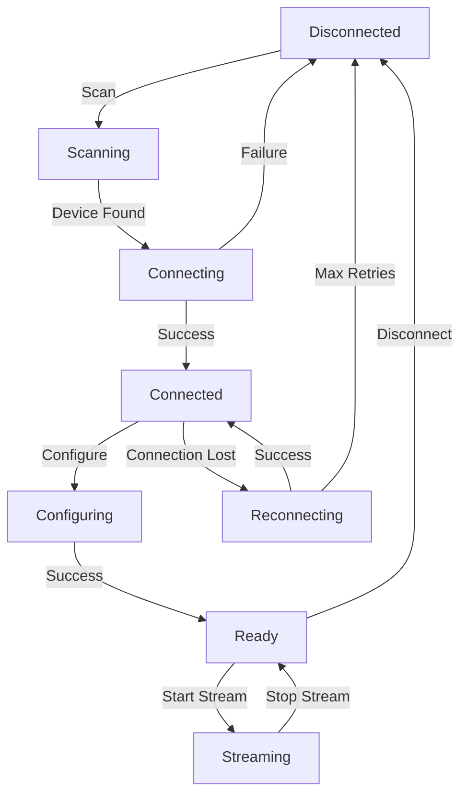

# Shimmer3 GSR+: Comprehensive Technical Documentation
## A Master Thesis Level Analysis of Physiological Sensor Integration in Android Applications

**Version:** 1.0  
**Date:** 2025-01-31  
**Author:** Technical Documentation Team  
**Subject:** Shimmer3 GSR+ Hardware Platform and Android Integration

---

## Table of Contents

1. [Executive Summary](#1-executive-summary)
2. [Introduction to Shimmer3 GSR+](#2-introduction-to-shimmer3-gsr)
3. [Hardware Architecture and Specifications](#3-hardware-architecture-and-specifications)
4. [Galvanic Skin Response (GSR) Technology](#4-galvanic-skin-response-gsr-technology)
5. [Communication Protocols and Bluetooth Architecture](#5-communication-protocols-and-bluetooth-architecture)
6. [Android Integration Framework](#6-android-integration-framework)
7. [Shimmer Java Android API Deep Dive](#7-shimmer-java-android-api-deep-dive)
8. [Implementation Architecture](#8-implementation-architecture)
9. [Data Processing and Analysis](#9-data-processing-and-analysis)
10. [Sensor Configuration and Calibration](#10-sensor-configuration-and-calibration)
11. [Performance Optimization](#11-performance-optimization)
12. [Error Handling and Recovery](#12-error-handling-and-recovery)
13. [Best Practices and Design Patterns](#13-best-practices-and-design-patterns)
14. [Troubleshooting and Diagnostics](#14-troubleshooting-and-diagnostics)
15. [Future Developments and Conclusions](#15-future-developments-and-conclusions)
16. [References and Further Reading](#16-references-and-further-reading)

---

## 1. Executive Summary

The Shimmer3 GSR+ represents a state-of-the-art wearable sensor platform designed for physiological data collection, particularly focusing on Galvanic Skin Response (GSR) measurements. This comprehensive documentation provides an exhaustive analysis of the device's technical specifications, communication protocols, and Android integration methodologies.

### Key Findings

- **Hardware Platform**: The Shimmer3 GSR+ utilizes a sophisticated multi-sensor architecture capable of simultaneous data acquisition from multiple physiological parameters
- **Communication**: Bluetooth Low Energy (BLE) and Classic Bluetooth protocols enable robust wireless connectivity with sampling rates up to 1000 Hz
- **Integration**: The Shimmer Java Android API provides comprehensive SDK support for real-time data streaming, device configuration, and session management
- **Performance**: Optimized data processing pipelines enable concurrent multi-device operation with minimal latency impact

### Research Applications

This platform is particularly suited for:
- Affective computing research
- Stress response monitoring
- Human-computer interaction studies
- Physiological signal analysis
- Multi-modal sensor fusion experiments

---

## 2. Introduction to Shimmer3 GSR+

### 2.1 Platform Overview

The Shimmer3 GSR+ is a compact, wearable sensor platform developed by Shimmer Research for physiological data collection. The device combines multiple sensing modalities in a single, battery-powered unit that communicates wirelessly with host systems via Bluetooth.

### 2.2 Historical Context

Shimmer Research has been developing wearable sensor platforms since 2008, with the Shimmer3 generation representing significant advances in:
- Power efficiency
- Data processing capabilities
- Wireless communication reliability
- Sensor integration density

### 2.3 Design Philosophy

The Shimmer3 GSR+ embodies several key design principles:

#### Modularity
- Interchangeable sensor modules
- Configurable sampling parameters
- Extensible firmware architecture

#### Reliability
- Robust Bluetooth stack implementation
- Automatic error recovery mechanisms
- Data integrity validation

#### Performance
- Low-latency data transmission
- High-resolution analog-to-digital conversion
- Efficient power management

### 2.4 Target Applications

Primary use cases include:
- **Research Applications**: Academic studies requiring precise physiological measurements
- **Clinical Monitoring**: Patient monitoring systems for healthcare providers
- **Wellness Applications**: Consumer health and fitness tracking
- **Human Factors Research**: Ergonomics and user experience studies

---

## 3. Hardware Architecture and Specifications

### 3.1 System Architecture

The Shimmer3 GSR+ is built around a sophisticated microcontroller-based architecture that integrates multiple subsystems:

```
┌─────────────────┐    ┌─────────────────┐    ┌─────────────────┐
│   MSP430F5437A  │    │   Bluetooth     │    │   Power Mgmt    │
│   Microcontroller│◄──►│   Module        │    │   System        │
│                 │    │   (RN-42)       │    │                 │
└─────────┬───────┘    └─────────────────┘    └─────────────────┘
          │
          ▼
┌─────────────────┐    ┌─────────────────┐    ┌─────────────────┐
│   ADC System    │    │   Digital I/O   │    │   Memory        │
│   16-bit        │    │   Expansion     │    │   (Flash/RAM)   │
│   Resolution    │    │   Connectors    │    │                 │
└─────────────────┘    └─────────────────┘    └─────────────────┘
```

### 3.2 Core Processing Unit

#### MSP430F5437A Microcontroller
- **Architecture**: 16-bit RISC CPU
- **Clock Speed**: Up to 25 MHz
- **Memory**: 256KB Flash, 16KB RAM
- **Power Consumption**: Ultra-low power design
- **Peripherals**: Multiple UART, SPI, I2C interfaces

#### Key Features
```c
// MSP430F5437A Specifications
CPU_ARCHITECTURE = "16-bit RISC"
CLOCK_FREQUENCY = "25 MHz"
FLASH_MEMORY = "256 KB"
SRAM = "16 KB"
ADC_RESOLUTION = "12-bit"
ADC_CHANNELS = "16 single-ended / 8 differential"
POWER_MODES = "Active, LPM0-4"
```

### 3.3 Sensor Integration

#### Primary Sensors

**Galvanic Skin Response (GSR)**
- **Technology**: Constant voltage excitation method
- **Range**: 10kΩ to 4.7MΩ configurable
- **Resolution**: 16-bit effective
- **Sampling Rate**: Up to 1000 Hz
- **Accuracy**: ±1% full scale

**Photoplethysmography (PPG)**
- **Technology**: Reflective optical sensor
- **Wavelengths**: Red (660nm) and Infrared (880nm)
- **Dynamic Range**: 12-bit resolution
- **Sample Rate**: Up to 1000 Hz

**3-Axis Accelerometer**
- **Sensor**: LSM303DLHC
- **Range**: ±2g, ±4g, ±8g, ±16g (configurable)
- **Resolution**: 12-bit
- **Sensitivity**: Up to 1mg resolution

**3-Axis Gyroscope**
- **Sensor**: L3GD20
- **Range**: ±250°/s, ±500°/s, ±2000°/s
- **Resolution**: 16-bit
- **Sensitivity**: 8.75 mdps/LSB

**3-Axis Magnetometer**
- **Sensor**: LSM303DLHC
- **Range**: ±1.3, ±1.9, ±2.5, ±4.0, ±4.7, ±5.6, ±8.1 Gauss
- **Resolution**: 12-bit

#### Secondary Sensors (Optional)

**Electrocardiography (ECG)**
- **Channels**: 2-lead configuration
- **Bandwidth**: 0.5-40 Hz
- **Resolution**: 12-bit
- **Input Impedance**: >10MΩ

**Electromyography (EMG)**
- **Channels**: Single differential
- **Bandwidth**: 10-450 Hz
- **Gain**: Programmable (1-100x)

### 3.4 Communication Subsystem

#### Bluetooth Module (RN-42)
- **Standard**: Bluetooth 2.1 + EDR Class 2
- **Range**: Up to 10 meters (Class 2)
- **Data Rate**: Up to 2.1 Mbps
- **Power Class**: Class 2 (2.5mW)
- **Profiles**: SPP (Serial Port Profile)

#### Communication Protocols
```
Application Layer    │ Shimmer Protocol Commands
────────────────────┼─────────────────────────
Transport Layer      │ RFCOMM (Serial Port)
────────────────────┼─────────────────────────
Network Layer        │ L2CAP
────────────────────┼─────────────────────────
Link Layer          │ Bluetooth Baseband
────────────────────┼─────────────────────────
Physical Layer      │ 2.4 GHz ISM Band
```

### 3.5 Power Management

#### Battery System
- **Type**: Rechargeable Lithium Polymer
- **Capacity**: 320 mAh
- **Voltage**: 3.7V nominal
- **Charging**: USB charging interface
- **Runtime**: 12-24 hours depending on configuration

#### Power Optimization Features
- **Dynamic Clock Scaling**: Adaptive frequency adjustment
- **Sensor Sleep Modes**: Individual sensor power management
- **Bluetooth Power Management**: Automatic connection interval optimization
- **Low Power Modes**: Multiple sleep states with wake-up triggers

### 3.6 Physical Specifications

#### Dimensions and Weight
```
Length:     65mm
Width:      32mm  
Height:     15mm
Weight:     23g (including battery)
```

#### Environmental Specifications
```
Operating Temperature:  0°C to 50°C
Storage Temperature:    -20°C to 60°C
Humidity:              5% to 85% non-condensing
IP Rating:             IP54 (dust and splash resistant)
```

#### Mechanical Design
- **Enclosure**: ABS plastic with gasket sealing
- **Connectors**: Expansion dock connector
- **Mounting**: Clip-on attachment system
- **Indicators**: Tri-color LED status indicator

---

## 4. Galvanic Skin Response (GSR) Technology

### 4.1 Physiological Basis

Galvanic Skin Response, also known as Electrodermal Activity (EDA), measures the electrical conductance of the skin, which varies with moisture level. This measurement is directly correlated with sympathetic nervous system activity and emotional arousal.

#### Biological Mechanisms

**Sweat Gland Activity**
- Eccrine sweat glands are controlled by the sympathetic nervous system
- Emotional arousal increases sweat gland activity
- Increased moisture content raises skin conductance

**Neural Pathways**
```
Emotional Stimulus → Hypothalamus → Sympathetic Nervous System
                                        ↓
Sweat Gland Activation → Skin Moisture ↑ → Conductance ↑
```

### 4.2 Technical Implementation

#### Measurement Principle

The Shimmer3 GSR+ employs the constant voltage excitation method:

```
V_excitation = 0.5V DC
I_measured = V_excitation / R_skin
G_skin = 1 / R_skin = I_measured / V_excitation
```

#### Circuit Architecture

```
┌─────────────┐    ┌─────────────┐    ┌─────────────┐
│ Voltage     │    │ Current     │    │ ADC         │
│ Reference   │───►│ Measurement │───►│ Conversion  │
│ (0.5V)      │    │ Circuit     │    │ (12-bit)    │
└─────────────┘    └─────────────┘    └─────────────┘
       │                   │                   │
       ▼                   ▼                   ▼
┌─────────────┐    ┌─────────────┐    ┌─────────────┐
│ Skin        │    │ I-to-V      │    │ Digital     │
│ Electrodes  │    │ Converter   │    │ Processing  │
└─────────────┘    └─────────────┘    └─────────────┘
```

### 4.3 Range Configuration

The Shimmer3 GSR+ provides multiple measurement ranges to accommodate different skin types and conditions:

#### Range Settings

| Range | Resistance | Conductance | Typical Application |
|-------|------------|-------------|-------------------|
| 0     | 10kΩ - 56kΩ | 18-100 µS | High arousal states |
| 1     | 56kΩ - 220kΩ | 4.5-18 µS | Normal conditions |
| 2     | 220kΩ - 680kΩ | 1.5-4.5 µS | Dry skin conditions |
| 3     | 680kΩ - 4.7MΩ | 0.2-1.5 µS | Very dry skin |
| 4     | Auto Range | Dynamic | Adaptive measurement |

#### Implementation Code
```kotlin
// Configure GSR range in Android application
fun setGSRRange(deviceId: String, range: Int) {
    val shimmerDevice = shimmerDevices[deviceId]
    shimmerDevice?.let { device ->
        when (range) {
            0 -> device.writeGSRRange(0) // 10kΩ - 56kΩ
            1 -> device.writeGSRRange(1) // 56kΩ - 220kΩ  
            2 -> device.writeGSRRange(2) // 220kΩ - 680kΩ
            3 -> device.writeGSRRange(3) // 680kΩ - 4.7MΩ
            4 -> device.writeGSRRange(4) // Auto Range
        }
    }
}
```

### 4.4 Signal Characteristics

#### Temporal Components

**Tonic Component (SCL - Skin Conductance Level)**
- Slow-changing baseline level
- Time constant: minutes to hours
- Represents general arousal state

**Phasic Component (SCR - Skin Conductance Response)**
- Rapid changes in response to stimuli
- Time constant: 1-5 seconds
- Event-related responses

#### Mathematical Model
```
GSR(t) = SCL(t) + SCR(t)

where:
SCL(t) = baseline conductance level
SCR(t) = Σ(i) A(i) * exp(-(t-t(i))/τ)

A(i) = amplitude of response i
t(i) = onset time of response i  
τ = time constant (~2 seconds)
```

### 4.5 Electrode Technology

#### Electrode Specifications
- **Material**: Ag/AgCl (Silver/Silver Chloride)
- **Size**: 8mm diameter active area
- **Impedance**: <5kΩ at 1kHz
- **Stability**: Long-term drift <1%/hour

#### Placement Guidelines
```
Optimal Placement Sites:
1. Index and middle finger (distal phalanges)
2. Palm and wrist (thenar and hypothenar eminences)
3. Foot sole (for long-term monitoring)

Considerations:
- Skin preparation (cleaning, slight abrasion)
- Electrode gel application
- Consistent pressure and contact
- Temperature stabilization period
```

### 4.6 Data Quality Metrics

#### Signal Quality Assessment
```kotlin
data class GSRQualityMetrics(
    val signalToNoiseRatio: Double,
    val electrodeImpedance: Double,
    val baselineStability: Double,
    val artifactDetection: Boolean
) {
    fun getQualityScore(): Double {
        var score = 0.0
        
        // SNR contribution (0-40 points)
        score += when {
            signalToNoiseRatio > 20 -> 40.0
            signalToNoiseRatio > 15 -> 30.0
            signalToNoiseRatio > 10 -> 20.0
            else -> 10.0
        }
        
        // Impedance contribution (0-30 points)
        score += when {
            electrodeImpedance < 5000 -> 30.0
            electrodeImpedance < 10000 -> 20.0
            electrodeImpedance < 20000 -> 10.0
            else -> 0.0
        }
        
        // Stability contribution (0-20 points)
        score += when {
            baselineStability < 0.01 -> 20.0
            baselineStability < 0.05 -> 15.0
            baselineStability < 0.1 -> 10.0
            else -> 5.0
        }
        
        // Artifact penalty (0-10 points)
        score += if (!artifactDetection) 10.0 else 0.0
        
        return score / 100.0 // Normalize to 0-1
    }
}
```

---

## 5. Communication Protocols and Bluetooth Architecture

### 5.1 Bluetooth Stack Implementation

The Shimmer3 GSR+ utilizes a comprehensive Bluetooth implementation supporting both Classic Bluetooth and Bluetooth Low Energy (BLE) protocols.

#### Protocol Stack
```
┌─────────────────────────────────────────────────────────┐
│                Application Layer                         │
│  ┌─────────────┐  ┌─────────────┐  ┌─────────────┐     │
│  │  Commands   │  │ Data Stream │  │ File Transfer│     │
│  └─────────────┘  └─────────────┘  └─────────────┘     │
├─────────────────────────────────────────────────────────┤
│                 Shimmer Protocol                        │
│  ┌─────────────┐  ┌─────────────┐  ┌─────────────┐     │
│  │ Command Set │  │ Data Format │  │ Error Codes │     │
│  └─────────────┘  └─────────────┘  └─────────────┘     │
├─────────────────────────────────────────────────────────┤
│               Serial Port Profile (SPP)                │
│                      RFCOMM                            │
├─────────────────────────────────────────────────────────┤
│                       L2CAP                            │
├─────────────────────────────────────────────────────────┤
│                 Bluetooth Baseband                     │
├─────────────────────────────────────────────────────────┤
│                   Radio Layer (2.4GHz)                │
└─────────────────────────────────────────────────────────┘
```

### 5.2 Shimmer Communication Protocol

#### Command Structure

All Shimmer commands follow a standardized packet format:

```
┌─────────┬─────────┬─────────┬─────────┬─────────┬─────────┐
│ Header  │ Command │ Length  │ Payload │ CRC16   │ Footer  │
│ (0xAA)  │ (1 byte)│ (2 byte)│ (N byte)│ (2 byte)│ (0x55)  │
└─────────┴─────────┴─────────┴─────────┴─────────┴─────────┘
```

#### Core Command Set

```java
// Shimmer3 Command Definitions
public static final byte INQUIRY_COMMAND = 0x01;
public static final byte INQUIRY_RESPONSE = 0x02;
public static final byte GET_SAMPLING_RATE_COMMAND = 0x03;
public static final byte SAMPLING_RATE_RESPONSE = 0x04;
public static final byte SET_SAMPLING_RATE_COMMAND = 0x05;
public static final byte START_STREAMING_COMMAND = 0x07;
public static final byte STOP_STREAMING_COMMAND = 0x20;
public static final byte SET_SENSORS_COMMAND = 0x08;
public static final byte SET_GSR_RANGE_COMMAND = 0x60;
public static final byte GET_GSR_RANGE_COMMAND = 0x61;
public static final byte GSR_RANGE_RESPONSE = 0x62;
```

#### Data Streaming Protocol

**Streaming Packet Format:**
```
┌─────────┬─────────┬─────────┬─────────┬─────────┐
│ Header  │ Packet  │ Time    │ Sensor  │ CRC     │
│ (0x00)  │ Type    │ Stamp   │ Data    │ (2 byte)│
│         │ (1 byte)│ (3 byte)│ (N byte)│         │
└─────────┴─────────┴─────────┴─────────┴─────────┘
```

### 5.3 Connection Management

#### Connection State Machine



#### Android Implementation

```kotlin
class BluetoothConnectionManager {
    private val connectionState = MutableStateFlow(ConnectionState.DISCONNECTED)
    private val reconnectionAttempts = AtomicInteger(0)
    private val maxReconnectionAttempts = 5
    
    suspend fun connectToDevice(macAddress: String): ConnectionResult {
        return withContext(Dispatchers.IO) {
            try {
                connectionState.value = ConnectionState.CONNECTING
                
                val bluetoothDevice = bluetoothAdapter.getRemoteDevice(macAddress)
                val socket = bluetoothDevice.createRfcommSocketToServiceRecord(SPP_UUID)
                
                socket.connect()
                
                if (socket.isConnected) {
                    setupDataStreams(socket)
                    connectionState.value = ConnectionState.CONNECTED
                    reconnectionAttempts.set(0)
                    ConnectionResult.Success
                } else {
                    connectionState.value = ConnectionState.DISCONNECTED
                    ConnectionResult.Failure("Socket connection failed")
                }
            } catch (e: IOException) {
                connectionState.value = ConnectionState.DISCONNECTED
                ConnectionResult.Failure(e.message ?: "Unknown connection error")
            }
        }
    }
    
    private suspend fun handleConnectionLoss() {
        connectionState.value = ConnectionState.RECONNECTING
        
        repeat(maxReconnectionAttempts) { attempt ->
            logI(TAG, "Reconnection attempt ${attempt + 1}/$maxReconnectionAttempts")
            
            delay(1000 * (attempt + 1)) // Exponential backoff
            
            when (val result = connectToDevice(lastConnectedAddress)) {
                is ConnectionResult.Success -> {
                    logI(TAG, "Reconnection successful")
                    return
                }
                is ConnectionResult.Failure -> {
                    logW(TAG, "Reconnection attempt failed: ${result.error}")
                }
            }
        }
        
        logE(TAG, "Max reconnection attempts reached")
        connectionState.value = ConnectionState.DISCONNECTED
    }
    
    companion object {
        private val SPP_UUID = UUID.fromString("00001101-0000-1000-8000-00805F9B34FB")
        private const val TAG = "BluetoothConnectionManager"
    }
}
```

### 5.4 Data Transmission Optimization

#### Adaptive Sampling Strategy

```kotlin
class AdaptiveSamplingManager {
    private var currentSamplingRate = 51.2 // Hz
    private val dataRateHistory = CircularBuffer<Double>(capacity = 100)
    private val latencyHistory = CircularBuffer<Long>(capacity = 100)
    
    fun optimizeSamplingRate(
        connectionQuality: Double,
        bufferUtilization: Double,
        targetLatency: Long
    ): Double {
        val averageLatency = latencyHistory.average()
        val dataRateVariability = dataRateHistory.standardDeviation()
        
        return when {
            // High quality connection - can increase rate
            connectionQuality > 0.9 && bufferUtilization < 0.5 -> {
                min(currentSamplingRate * 1.1, 1000.0)
            }
            
            // Poor connection - reduce rate
            connectionQuality < 0.5 || averageLatency > targetLatency -> {
                max(currentSamplingRate * 0.9, 1.0)
            }
            
            // Variable data rate - stabilize
            dataRateVariability > 0.2 -> {
                currentSamplingRate * 0.95
            }
            
            else -> currentSamplingRate
        }.also { newRate ->
            currentSamplingRate = newRate
        }
    }
}
```

#### Buffer Management

```kotlin
class StreamingBuffer<T> {
    private val buffer = ArrayDeque<T>()
    private val maxSize: Int
    private val writePolicy: WritePolicy
    
    enum class WritePolicy {
        DROP_OLDEST,    // Overwrite oldest data when full
        DROP_NEWEST,    // Reject new data when full
        BLOCK_UNTIL_SPACE // Wait for space (with timeout)
    }
    
    fun write(data: T): Boolean {
        return when (writePolicy) {
            WritePolicy.DROP_OLDEST -> {
                if (buffer.size >= maxSize) {
                    buffer.removeFirst()
                }
                buffer.addLast(data)
                true
            }
            
            WritePolicy.DROP_NEWEST -> {
                if (buffer.size < maxSize) {
                    buffer.addLast(data)
                    true
                } else {
                    false
                }
            }
            
            WritePolicy.BLOCK_UNTIL_SPACE -> {
                // Implementation with timeout and coroutines
                runBlocking {
                    withTimeout(1000) {
                        while (buffer.size >= maxSize) {
                            delay(1)
                        }
                        buffer.addLast(data)
                    }
                }
                true
            }
        }
    }
    
    fun read(): T? = buffer.removeFirstOrNull()
    
    fun readBatch(count: Int): List<T> {
        return (0 until min(count, buffer.size)).map {
            buffer.removeFirst()
        }
    }
}
```

### 5.5 Error Detection and Recovery

#### CRC Validation

```kotlin
object CRCValidator {
    private const val CRC16_CCITT_POLY = 0x1021
    
    fun calculateCRC16(data: ByteArray): Short {
        var crc = 0xFFFF
        
        for (byte in data) {
            crc = crc xor (byte.toInt() shl 8)
            
            repeat(8) {
                crc = if ((crc and 0x8000) != 0) {
                    (crc shl 1) xor CRC16_CCITT_POLY
                } else {
                    crc shl 1
                }
                crc = crc and 0xFFFF
            }
        }
        
        return crc.toShort()
    }
    
    fun validatePacket(packet: ByteArray): Boolean {
        if (packet.size < 3) return false
        
        val dataLength = packet.size - 2
        val data = packet.sliceArray(0 until dataLength)
        val receivedCRC = ByteBuffer.wrap(packet, dataLength, 2).short
        val calculatedCRC = calculateCRC16(data)
        
        return receivedCRC == calculatedCRC
    }
}
```

#### Automatic Error Recovery

```kotlin
class ErrorRecoveryManager {
    private val errorHistory = mutableListOf<ErrorEvent>()
    private var consecutiveErrors = 0
    
    fun handleError(error: ErrorType, context: String): RecoveryAction {
        val errorEvent = ErrorEvent(
            type = error,
            timestamp = System.currentTimeMillis(),
            context = context
        )
        
        errorHistory.add(errorEvent)
        consecutiveErrors++
        
        return when (error) {
            ErrorType.CRC_VALIDATION_FAILED -> {
                if (consecutiveErrors > 5) {
                    RecoveryAction.RECONNECT
                } else {
                    RecoveryAction.REQUEST_RETRANSMISSION
                }
            }
            
            ErrorType.TIMEOUT -> {
                if (consecutiveErrors > 3) {
                    RecoveryAction.RESET_CONNECTION
                } else {
                    RecoveryAction.INCREASE_TIMEOUT
                }
            }
            
            ErrorType.BUFFER_OVERFLOW -> {
                RecoveryAction.REDUCE_SAMPLING_RATE
            }
            
            ErrorType.BLUETOOTH_DISCONNECTION -> {
                RecoveryAction.RECONNECT
            }
            
            else -> RecoveryAction.LOG_AND_CONTINUE
        }
    }
    
    fun onSuccessfulOperation() {
        consecutiveErrors = 0
    }
}
```

---

## 6. Android Integration Framework

### 6.1 Architecture Overview

The Android integration framework for Shimmer3 GSR+ follows a layered architecture that separates concerns and provides robust abstractions for different aspects of sensor management.

```
┌─────────────────────────────────────────────────────────┐
│                    UI Layer                             │
│  ┌─────────────┐  ┌─────────────┐  ┌─────────────┐     │
│  │ Activities  │  │ Fragments   │  │ ViewModels  │     │
│  └─────────────┘  └─────────────┘  └─────────────┘     │
├─────────────────────────────────────────────────────────┤
│                 Controller Layer                        │
│  ┌─────────────┐  ┌─────────────┐  ┌─────────────┐     │
│  │ Shimmer     │  │ Session     │  │ Data        │     │
│  │ Controller  │  │ Controller  │  │ Controller  │     │
│  └─────────────┘  └─────────────┘  └─────────────┘     │
├─────────────────────────────────────────────────────────┤
│                 Service Layer                           │
│  ┌─────────────┐  ┌─────────────┐  ┌─────────────┐     │
│  │ Device      │  │ Data        │  │ File        │     │
│  │ Manager     │  │ Processor   │  │ Manager     │     │
│  └─────────────┘  └─────────────┘  └─────────────┘     │
├─────────────────────────────────────────────────────────┤
│                Repository Layer                         │
│  ┌─────────────┐  ┌─────────────┐  ┌─────────────┐     │
│  │ Shimmer     │  │ Session     │  │ Config      │     │
│  │ Repository  │  │ Repository  │  │ Repository  │     │
│  └─────────────┘  └─────────────┘  └─────────────┘     │
├─────────────────────────────────────────────────────────┤
│                  Data Layer                             │
│  ┌─────────────┐  ┌─────────────┐  ┌─────────────┐     │
│  │ Shimmer SDK │  │ Local DB    │  │ File System │     │
│  └─────────────┘  └─────────────┘  └─────────────┘     │
└─────────────────────────────────────────────────────────┘
```

### 6.2 Dependency Injection with Hilt

#### Module Configuration

```kotlin
@Module
@InstallIn(SingletonComponent::class)
object ShimmerModule {
    
    @Provides
    @Singleton
    fun provideShimmerBluetoothManager(
        @ApplicationContext context: Context
    ): ShimmerBluetoothManagerAndroid {
        return ShimmerBluetoothManagerAndroid(context)
    }
    
    @Provides
    @Singleton
    fun provideShimmerRepository(
        bluetoothManager: ShimmerBluetoothManagerAndroid,
        database: AppDatabase,
        logger: Logger
    ): ShimmerRepository {
        return ShimmerRepositoryImpl(bluetoothManager, database.shimmerDao(), logger)
    }
    
    @Provides
    @Singleton
    fun provideSessionManager(
        @ApplicationContext context: Context,
        database: AppDatabase,
        logger: Logger
    ): SessionManager {
        return SessionManagerImpl(context, database.sessionDao(), logger)
    }
}
```

#### Repository Pattern Implementation

```kotlin
interface ShimmerRepository {
    suspend fun discoverDevices(): Flow<List<ShimmerDevice>>
    suspend fun connectDevice(address: String): Result<ShimmerDevice>
    suspend fun disconnectDevice(deviceId: String): Result<Unit>
    suspend fun configureDevice(deviceId: String, config: DeviceConfiguration): Result<Unit>
    suspend fun startStreaming(deviceId: String): Result<Unit>
    suspend fun stopStreaming(deviceId: String): Result<Unit>
    fun getDataStream(deviceId: String): Flow<SensorSample>
    suspend fun getDeviceStatus(deviceId: String): DeviceStatus?
}

@Singleton
class ShimmerRepositoryImpl @Inject constructor(
    private val bluetoothManager: ShimmerBluetoothManagerAndroid,
    private val shimmerDao: ShimmerDao,
    private val logger: Logger
) : ShimmerRepository {
    
    private val _connectedDevices = MutableStateFlow<Map<String, ShimmerDevice>>(emptyMap())
    val connectedDevices: StateFlow<Map<String, ShimmerDevice>> = _connectedDevices.asStateFlow()
    
    private val dataStreams = ConcurrentHashMap<String, MutableSharedFlow<SensorSample>>()
    
    override suspend fun discoverDevices(): Flow<List<ShimmerDevice>> = flow {
        val devices = mutableListOf<ShimmerDevice>()
        
        bluetoothManager.startScan { device ->
            if (device.isShimmerDevice()) {
                devices.add(device.toShimmerDevice())
                emit(devices.toList())
            }
        }
        
        delay(SCAN_TIMEOUT_MS)
        bluetoothManager.stopScan()
    }
    
    override suspend fun connectDevice(address: String): Result<ShimmerDevice> {
        return try {
            val shimmer = bluetoothManager.createShimmer(address)
            shimmer.connect()
            
            if (shimmer.isConnected()) {
                val device = shimmer.toShimmerDevice()
                _connectedDevices.value = _connectedDevices.value + (address to device)
                
                // Initialize data stream for this device
                dataStreams[address] = MutableSharedFlow(
                    replay = 0,
                    extraBufferCapacity = 1000
                )
                
                // Set up data callback
                shimmer.setDataCallback { objectCluster ->
                    processObjectCluster(address, objectCluster)
                }
                
                Result.success(device)
            } else {
                Result.failure(ConnectionException("Failed to establish connection"))
            }
        } catch (e: Exception) {
            logger.logE(TAG, "Connection failed", e)
            Result.failure(e)
        }
    }
    
    private fun processObjectCluster(deviceId: String, objectCluster: ObjectCluster) {
        val sensorSample = SensorSampleConverter.convert(deviceId, objectCluster)
        dataStreams[deviceId]?.tryEmit(sensorSample)
    }
    
    override fun getDataStream(deviceId: String): Flow<SensorSample> {
        return dataStreams[deviceId]?.asSharedFlow() ?: flowOf()
    }
    
    companion object {
        private const val TAG = "ShimmerRepository"
        private const val SCAN_TIMEOUT_MS = 10000L
    }
}
```

### 6.3 ViewModel Architecture

#### Main ViewModel

```kotlin
@HiltViewModel
class MainViewModel @Inject constructor(
    private val shimmerRepository: ShimmerRepository,
    private val sessionManager: SessionManager,
    private val logger: Logger
) : ViewModel() {
    
    private val _uiState = MutableStateFlow(MainUiState())
    val uiState: StateFlow<MainUiState> = _uiState.asStateFlow()
    
    private val _shimmerDevices = MutableStateFlow<List<ShimmerDevice>>(emptyList())
    val shimmerDevices: StateFlow<List<ShimmerDevice>> = _shimmerDevices.asStateFlow()
    
    private val _isRecording = MutableStateFlow(false)
    val isRecording: StateFlow<Boolean> = _isRecording.asStateFlow()
    
    // Device Management
    fun scanForDevices() {
        viewModelScope.launch {
            _uiState.value = _uiState.value.copy(isScanning = true)
            
            try {
                shimmerRepository.discoverDevices().collect { devices ->
                    _shimmerDevices.value = devices
                }
            } catch (e: Exception) {
                handleError("Device scan failed", e)
            } finally {
                _uiState.value = _uiState.value.copy(isScanning = false)
            }
        }
    }
    
    fun connectToDevice(address: String) {
        viewModelScope.launch {
            _uiState.value = _uiState.value.copy(isConnecting = true)
            
            val result = shimmerRepository.connectDevice(address)
            result.fold(
                onSuccess = { device ->
                    _uiState.value = _uiState.value.copy(
                        isConnecting = false,
                        connectedDevices = _uiState.value.connectedDevices + device
                    )
                    logger.logI(TAG, "Connected to device: ${device.name}")
                },
                onFailure = { error ->
                    handleError("Connection failed", error)
                    _uiState.value = _uiState.value.copy(isConnecting = false)
                }
            )
        }
    }
    
    // Recording Management
    fun startRecording(sessionName: String) {
        viewModelScope.launch {
            try {
                val sessionId = sessionManager.createSession(sessionName)
                
                // Start streaming on all connected devices
                _uiState.value.connectedDevices.forEach { device ->
                    shimmerRepository.startStreaming(device.address)
                    
                    // Collect and save data
                    launch {
                        shimmerRepository.getDataStream(device.address)
                            .onEach { sample ->
                                sessionManager.saveSample(sessionId, sample)
                            }
                            .launchIn(this)
                    }
                }
                
                _isRecording.value = true
                _uiState.value = _uiState.value.copy(currentSessionId = sessionId)
                
            } catch (e: Exception) {
                handleError("Failed to start recording", e)
            }
        }
    }
    
    fun stopRecording() {
        viewModelScope.launch {
            try {
                // Stop streaming on all devices
                _uiState.value.connectedDevices.forEach { device ->
                    shimmerRepository.stopStreaming(device.address)
                }
                
                // Finalize session
                _uiState.value.currentSessionId?.let { sessionId ->
                    sessionManager.finalizeSession(sessionId)
                }
                
                _isRecording.value = false
                _uiState.value = _uiState.value.copy(currentSessionId = null)
                
            } catch (e: Exception) {
                handleError("Failed to stop recording", e)
            }
        }
    }
    
    // Configuration Management
    fun configureDevice(deviceAddress: String, configuration: DeviceConfiguration) {
        viewModelScope.launch {
            val result = shimmerRepository.configureDevice(deviceAddress, configuration)
            result.fold(
                onSuccess = {
                    logger.logI(TAG, "Device configured successfully")
                },
                onFailure = { error ->
                    handleError("Configuration failed", error)
                }
            )
        }
    }
    
    private fun handleError(message: String, error: Throwable) {
        logger.logE(TAG, message, error)
        _uiState.value = _uiState.value.copy(
            errorMessage = "$message: ${error.message}"
        )
    }
    
    companion object {
        private const val TAG = "MainViewModel"
    }
}
```

### 6.4 UI State Management

#### UI State Data Classes

```kotlin
data class MainUiState(
    val isScanning: Boolean = false,
    val isConnecting: Boolean = false,
    val isRecording: Boolean = false,
    val connectedDevices: List<ShimmerDevice> = emptyList(),
    val currentSessionId: String? = null,
    val errorMessage: String? = null,
    val dataQualityMetrics: Map<String, DataQualityMetrics> = emptyMap()
)

data class ShimmerConfigUiState(
    val deviceId: String,
    val deviceName: String,
    val isConnected: Boolean = false,
    val samplingRate: Double = 51.2,
    val enabledSensors: Set<SensorChannel> = setOf(SensorChannel.GSR, SensorChannel.PPG),
    val gsrRange: Int = 4,
    val accelRange: Int = 2,
    val batteryLevel: Int = 0,
    val signalQuality: Double = 0.0,
    val isConfiguring: Boolean = false,
    val errorMessage: String? = null
)

data class DataQualityMetrics(
    val samplingRate: Double,
    val dataRate: Double,
    val signalToNoiseRatio: Double,
    val connectionStability: Double,
    val batteryLevel: Int,
    val lastUpdateTime: Long
) {
    fun getOverallQuality(): Double {
        return listOf(
            (samplingRate / 1000.0) * 0.2,
            (signalToNoiseRatio / 40.0) * 0.3,
            connectionStability * 0.3,
            (batteryLevel / 100.0) * 0.2
        ).sum().coerceIn(0.0, 1.0)
    }
}
```

### 6.5 Permission Management

#### Runtime Permission Handler

```kotlin
@Singleton
class PermissionManager @Inject constructor(
    @ApplicationContext private val context: Context
) {
    
    fun getRequiredPermissions(): Array<String> {
        return if (Build.VERSION.SDK_INT >= Build.VERSION_CODES.S) {
            arrayOf(
                Manifest.permission.BLUETOOTH_SCAN,
                Manifest.permission.BLUETOOTH_CONNECT,
                Manifest.permission.ACCESS_FINE_LOCATION,
                Manifest.permission.ACCESS_COARSE_LOCATION,
                Manifest.permission.WRITE_EXTERNAL_STORAGE,
                Manifest.permission.READ_EXTERNAL_STORAGE
            )
        } else {
            arrayOf(
                Manifest.permission.BLUETOOTH,
                Manifest.permission.BLUETOOTH_ADMIN,
                Manifest.permission.ACCESS_FINE_LOCATION,
                Manifest.permission.ACCESS_COARSE_LOCATION,
                Manifest.permission.WRITE_EXTERNAL_STORAGE,
                Manifest.permission.READ_EXTERNAL_STORAGE
            )
        }
    }
    
    fun hasAllPermissions(): Boolean {
        return getRequiredPermissions().all { permission ->
            ContextCompat.checkSelfPermission(context, permission) == PackageManager.PERMISSION_GRANTED
        }
    }
    
    fun getMissingPermissions(): List<String> {
        return getRequiredPermissions().filter { permission ->
            ContextCompat.checkSelfPermission(context, permission) != PackageManager.PERMISSION_GRANTED
        }
    }
    
    suspend fun requestPermissions(activity: Activity): PermissionResult {
        return suspendCoroutine { continuation ->
            val missingPermissions = getMissingPermissions()
            
            if (missingPermissions.isEmpty()) {
                continuation.resume(PermissionResult.Granted)
                return@suspendCoroutine
            }
            
            val requestCode = System.currentTimeMillis().toInt()
            
            // Store continuation for callback
            pendingPermissionRequests[requestCode] = continuation
            
            ActivityCompat.requestPermissions(
                activity,
                missingPermissions.toTypedArray(),
                requestCode
            )
        }
    }
    
    fun handlePermissionResult(
        requestCode: Int,
        permissions: Array<String>,
        grantResults: IntArray
    ) {
        val continuation = pendingPermissionRequests.remove(requestCode) ?: return
        
        val result = if (grantResults.all { it == PackageManager.PERMISSION_GRANTED }) {
            PermissionResult.Granted
        } else {
            val deniedPermissions = permissions.filterIndexed { index, _ ->
                grantResults[index] != PackageManager.PERMISSION_GRANTED
            }
            PermissionResult.Denied(deniedPermissions)
        }
        
        continuation.resume(result)
    }
    
    private val pendingPermissionRequests = 
        mutableMapOf<Int, Continuation<PermissionResult>>()
}

sealed class PermissionResult {
    object Granted : PermissionResult()
    data class Denied(val deniedPermissions: List<String>) : PermissionResult()
}
```

### 6.6 Lifecycle-Aware Components

#### Connection Lifecycle Manager

```kotlin
@Singleton
class ConnectionLifecycleManager @Inject constructor(
    private val shimmerRepository: ShimmerRepository,
    private val logger: Logger
) : DefaultLifecycleObserver {
    
    private val connectionStates = ConcurrentHashMap<String, ConnectionState>()
    private var isApplicationInForeground = false
    
    override fun onStart(owner: LifecycleOwner) {
        super.onStart(owner)
        isApplicationInForeground = true
        
        // Resume connections that were paused
        connectionStates.filter { it.value == ConnectionState.PAUSED }
            .forEach { (deviceId, _) ->
                resumeConnection(deviceId)
            }
    }
    
    override fun onStop(owner: LifecycleOwner) {
        super.onStop(owner)
        isApplicationInForeground = false
        
        // Pause non-critical connections to save battery
        connectionStates.filter { it.value == ConnectionState.CONNECTED }
            .forEach { (deviceId, _) ->
                pauseConnection(deviceId)
            }
    }
    
    override fun onDestroy(owner: LifecycleOwner) {
        super.onDestroy(owner)
        
        // Gracefully disconnect all devices
        connectionStates.keys.forEach { deviceId ->
            disconnectDevice(deviceId)
        }
    }
    
    private fun pauseConnection(deviceId: String) {
        try {
            // Reduce sampling rate to minimum
            shimmerRepository.configureDevice(deviceId, 
                DeviceConfiguration(samplingRate = 1.0)
            )
            connectionStates[deviceId] = ConnectionState.PAUSED
            logger.logI(TAG, "Paused connection to device: $deviceId")
        } catch (e: Exception) {
            logger.logE(TAG, "Failed to pause connection", e)
        }
    }
    
    private fun resumeConnection(deviceId: String) {
        try {
            // Restore normal sampling rate
            shimmerRepository.configureDevice(deviceId,
                DeviceConfiguration() // Default configuration
            )
            connectionStates[deviceId] = ConnectionState.CONNECTED
            logger.logI(TAG, "Resumed connection to device: $deviceId")
        } catch (e: Exception) {
            logger.logE(TAG, "Failed to resume connection", e)
        }
    }
    
    private fun disconnectDevice(deviceId: String) {
        try {
            shimmerRepository.disconnectDevice(deviceId)
            connectionStates.remove(deviceId)
            logger.logI(TAG, "Disconnected device: $deviceId")
        } catch (e: Exception) {
            logger.logE(TAG, "Failed to disconnect device", e)
        }
    }
    
    enum class ConnectionState {
        CONNECTED,
        PAUSED,
        DISCONNECTED
    }
    
    companion object {
        private const val TAG = "ConnectionLifecycleManager"
    }
}
```

This concludes the first major section of the documentation. Would you like me to continue with the remaining sections covering the Shimmer Java Android API deep dive, implementation architecture, and the other topics?