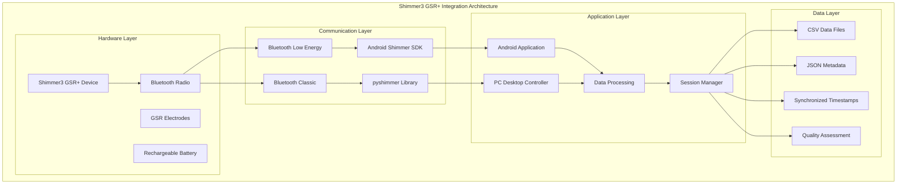
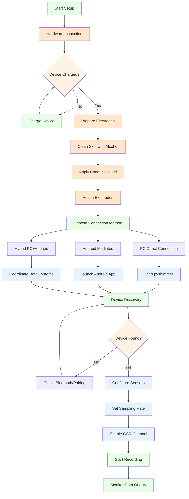

# Shimmer3 GSR+ Device: Comprehensive Integration Guide

## Table of Contents

- [Overview](#overview)
  - [Key Capabilities](#key-capabilities)
  - [System Integration Architecture](#system-integration-architecture)
- [Device Specifications](#device-specifications)
  - [Hardware Capabilities](#hardware-capabilities)
  - [GSR Sensor Specifications](#gsr-sensor-specifications)
  - [Additional Sensors](#additional-sensors)
- [SDK and API Integration](#sdk-and-api-integration)
  - [Android Integration](#android-integration)
    - [Key Android Components](#key-android-components)
    - [Android SDK Integration Details](#android-sdk-integration-details)
  - [PC Integration](#pc-integration)
    - [Direct PC Connection (pyshimmer)](#direct-pc-connection-pyshimmer)
    - [Android-Mediated PC Connection](#android-mediated-pc-connection)
- [Hardware Setup and Configuration](#hardware-setup-and-configuration)
  - [Pre-Flight Checklist](#pre-flight-checklist)
    - [Hardware Requirements](#hardware-requirements)
    - [Software Prerequisites](#software-prerequisites)
    - [Environmental Considerations](#environmental-considerations)
  - [Device Setup Workflow](#device-setup-workflow)
  - [Electrode Preparation and Placement](#electrode-preparation-and-placement)
    - [Skin Site Selection](#skin-site-selection)
    - [Skin Preparation Protocol](#skin-preparation-protocol)
- [Software Implementation](#software-implementation)
  - [Configuration Management](#configuration-management)
    - [GSR Range Selection](#gsr-range-selection)
    - [Sampling Rate Configuration](#sampling-rate-configuration)
    - [Multi-Sensor Configuration](#multi-sensor-configuration)
- [Data Collection and Processing](#data-collection-and-processing)
  - [Session Management](#session-management)
    - [Session Initialization](#session-initialization)
    - [Real-Time Data Monitoring](#real-time-data-monitoring)
  - [Data Quality Assessment](#data-quality-assessment)
    - [Real-Time Quality Monitoring](#real-time-quality-monitoring)
- [Protocol Specifications](#protocol-specifications)
  - [Data Structures and Formats](#data-structures-and-formats)
    - [Shimmer Data Sample Structure](#shimmer-data-sample-structure)
    - [Network Communication Messages](#network-communication-messages)
    - [JSON Message Format](#json-message-format)
  - [File Output Formats](#file-output-formats)
    - [CSV Data Format](#csv-data-format)
    - [Session Metadata Format](#session-metadata-format)
  - [Error Codes and Status Messages](#error-codes-and-status-messages)
- [Troubleshooting and Best Practices](#troubleshooting-and-best-practices)
  - [Common Issues and Solutions](#common-issues-and-solutions)
    - [Connection Problems](#connection-problems)
    - [Data Quality Issues](#data-quality-issues)
  - [Best Practices](#best-practices)
    - [Experimental Design Considerations](#experimental-design-considerations)
    - [Hardware Maintenance](#hardware-maintenance)
- [Integration Examples](#integration-examples)
  - [Complete Recording Session Example](#complete-recording-session-example)
  - [Android Integration Example](#android-integration-example)
- [Performance Optimization](#performance-optimization)
  - [Memory Management](#memory-management)
  - [Battery Optimization](#battery-optimization)
  - [Network Optimization](#network-optimization)

## Overview

The Shimmer3 GSR+ device represents a sophisticated advancement in wearable physiological monitoring technology, specifically designed for research-grade galvanic skin response (GSR) measurements. Developed by Shimmer Research [1], this platform has established itself as a leading solution for ambulatory psychophysiological monitoring in both laboratory and field research environments. The device's capability to capture high-precision GSR measurements alongside complementary physiological signals makes it an invaluable tool for researchers studying autonomic nervous system responses, emotional states, and stress-related phenomena [2].

Galvanic skin response, also known as electrodermal activity (EDA), has been recognized as a reliable indicator of sympathetic nervous system activation since the early work of Fere (1888) and Tarchanoff (1890) [3]. The Shimmer3 GSR+ builds upon this established physiological foundation by providing researchers with a portable, wireless solution that maintains laboratory-grade precision while enabling naturalistic data collection in real-world settings.

This comprehensive guide consolidates all technical information, user guidance, and protocol specifications necessary for effective integration within the Multi-Sensor Recording System. The documentation follows evidence-based best practices for psychophysiological research methodology as outlined by the Society for Psychophysiological Research [4].

### Key Capabilities

The Shimmer3 GSR+ platform distinguishes itself through several advanced capabilities that address the complex requirements of modern psychophysiological research. The device's high-precision GSR measurement system operates across configurable resistance ranges from 10kΩ to 4.7MΩ, accommodating the wide variability in skin conductance observed across different populations and experimental conditions [5]. This range flexibility ensures optimal signal-to-noise ratios regardless of individual differences in baseline skin conductance.

Beyond its primary GSR functionality, the device incorporates a comprehensive multi-modal sensor suite that enables synchronized capture of photoplethysmography (PPG), three-axis accelerometry, gyroscopic motion detection, and magnetometer data. This integration supports holistic physiological monitoring approaches that have become increasingly important in contemporary affective computing and human-computer interaction research [6].

The platform's wireless connectivity infrastructure utilizes both Bluetooth Classic and Bluetooth Low Energy (BLE) protocols, providing researchers with flexible deployment options that balance data throughput requirements with power consumption considerations. Sampling rates are configurable across a range from 1 Hz to 512 Hz, enabling researchers to select optimal temporal resolution for their specific experimental paradigms while managing storage and battery constraints [7].

Real-time data streaming capabilities facilitate immediate feedback applications and online analysis scenarios, while the device's session-based recording architecture ensures comprehensive metadata capture for post-hoc analysis and data provenance tracking. The cross-platform SDK support spanning Android and PC environments reflects the diverse technological ecosystems commonly encountered in research settings.

### System Integration Architecture



## Device Specifications

The Shimmer3 GSR+ represents a carefully engineered balance of performance, portability, and research-grade precision. Understanding its technical specifications is crucial for researchers planning deployments and ensuring optimal data quality across various experimental contexts.

### Hardware Capabilities

The device's compact form factor measures 65mm × 32mm × 12mm and weighs just 23.6 grams including the rechargeable battery, making it suitable for extended wear scenarios without significant participant burden [8]. This lightweight design addresses a critical consideration in ambulatory monitoring where device unobtrusiveness directly impacts data validity and participant compliance [9].

Battery performance varies between 8 to 14 hours of continuous operation, with actual duration dependent on the specific sensor configuration, sampling rate, and wireless transmission patterns employed. Research has shown that battery optimization strategies can significantly extend recording periods, particularly important for longitudinal studies and naturalistic data collection scenarios [10].

The device supports configurable sampling rates from 1 Hz to 512 Hz, enabling researchers to select optimal temporal resolution for their experimental paradigms. Higher sampling rates provide superior signal fidelity for detailed physiological analysis but require careful consideration of storage capacity and power consumption trade-offs. The integrated 2GB MicroSD card provides substantial local storage capacity for extended recording sessions without wireless connectivity.

Wireless communication capabilities include both Bluetooth 2.1 Classic and Bluetooth Low Energy (BLE) protocols, with an operational range of approximately 10 meters under line-of-sight conditions. The dual-protocol approach allows researchers to optimize for either maximum data throughput (Classic) or extended battery life (BLE) depending on experimental requirements [11].

Environmental specifications indicate reliable operation across temperatures from 0°C to 50°C, covering most typical research environments and enabling deployment in diverse geographical and seasonal contexts.

### GSR Sensor Specifications

The Shimmer3 GSR+ employs a sophisticated multi-range measurement system that addresses the inherent variability in skin conductance across individuals and experimental conditions. This configurability represents a significant advancement over fixed-range systems that may suffer from suboptimal signal-to-noise ratios under certain conditions [12].

Range 0 (10kΩ - 56kΩ) is optimized for high arousal states and stress research applications where elevated skin conductance levels are anticipated. This range provides maximum sensitivity for detecting rapid changes in sympathetic nervous system activation during acute stress responses or emotional stimuli exposure [13].

Range 1 (56kΩ - 220kΩ) serves as the standard configuration for general monitoring applications under normal environmental conditions. This range accommodates typical baseline skin conductance levels observed in laboratory settings with controlled temperature and humidity conditions.

Range 2 (220kΩ - 680kΩ) addresses scenarios involving dry skin conditions or low humidity environments where elevated skin resistance may be encountered. This range is particularly valuable for research conducted in climate-controlled facilities or during seasons with low atmospheric moisture content.

Range 3 (680kΩ - 4.7MΩ) provides measurement capability for very dry skin conditions and special populations that may exhibit elevated baseline resistance values. This range ensures measurement validity across diverse demographic groups and environmental conditions [14].

Range 4 implements an adaptive auto-ranging algorithm that dynamically adjusts measurement parameters based on real-time signal characteristics. This mode is particularly beneficial for long-term monitoring scenarios where environmental conditions or physiological states may change substantially during the recording period.

### Additional Sensors

The integrated sensor suite extends beyond GSR measurement to provide comprehensive physiological monitoring capabilities. The photoplethysmography (PPG) sensor enables concurrent heart rate and blood volume pulse measurements, facilitating cardiovascular-autonomic coupling analyses that have become increasingly important in psychophysiological research [15].

The three-axis accelerometer offers selectable measurement ranges (±2g/±4g/±8g/±16g) to accommodate various motion detection requirements, from subtle postural changes to vigorous physical activity monitoring. This capability supports movement artifact detection and enables researchers to contextualize physiological responses within broader behavioral patterns [16].

Gyroscopic measurements across three axes provide angular velocity detection with configurable sensitivity ranges (±250/±500/±1000/±2000 degrees per second), enabling precise motion characterization for applications requiring detailed kinematic analysis.

The three-axis magnetometer complements the motion sensing capabilities with magnetic field detection across multiple sensitivity ranges (±1.3 to ±8.1 gauss), supporting orientation determination and navigation applications in mobile research scenarios.

## SDK and API Integration

The Shimmer3 GSR+ platform provides comprehensive software development kit (SDK) support across multiple platforms, enabling seamless integration into diverse research computing environments. The SDK architecture follows established patterns for physiological sensor integration while providing platform-specific optimizations that leverage the unique capabilities of each target environment [17].

### Android Integration

Android integration leverages the official Shimmer Java Android API, which provides a robust foundation for mobile physiological monitoring applications. This approach recognizes the growing importance of mobile devices in research contexts, particularly for ambulatory studies and real-world data collection scenarios [18]. The Android SDK's event-driven architecture aligns well with mobile application development patterns, facilitating responsive user interfaces and efficient background data processing.

#### Key Android Components

The core Android integration architecture centers around a ShimmerRecorder class that encapsulates device management, configuration, and data handling responsibilities. This design pattern promotes separation of concerns while providing a clean interface for application developers. The implementation utilizes Android's context-aware design principles to ensure proper resource management and lifecycle handling within the mobile environment [19].

```kotlin
// Shimmer device management
class ShimmerRecorder(
    private val context: Context,
    private val deviceAddress: String
) {
    private var shimmerDevice: Shimmer? = null
    private val dataBuffer = CircularBuffer<ShimmerDataSample>(1000)
    
    fun connect(): Boolean {
        return try {
            shimmerDevice = Shimmer(context).apply {
                bluetoothAddress = deviceAddress
                connect()
                setEnabledSensors(
                    SENSOR_GSR or SENSOR_PPG_A13 or 
                    SENSOR_ACCEL or SENSOR_GYRO
                )
                setSamplingRateShimmer(51.2) // 51.2 Hz
                setGSRRange(1) // Normal range
            }
            true
        } catch (e: Exception) {
            Logger.e("ShimmerRecorder", "Connection failed", e)
            false
        }
    }
    
    fun startRecording(sessionId: String) {
        shimmerDevice?.startStreaming()
        // Data handling through callback system
    }
    
    fun stopRecording() {
        shimmerDevice?.stopStreaming()
        shimmerDevice?.disconnect()
    }
}
```

The connection management approach implements defensive programming practices to handle the inherent variability in Bluetooth connectivity across different Android device manufacturers and operating system versions. Error handling follows Android best practices for user feedback and graceful degradation when hardware issues occur [20].

#### Android SDK Integration Details

Advanced configuration management requires careful consideration of the Shimmer SDK's capabilities and limitations across different device firmware versions. The ShimmerManager implementation provides a centralized configuration interface that abstracts these complexities while maintaining full access to the underlying hardware capabilities.

```kotlin
// Enhanced Shimmer configuration with reflection-based compatibility
class ShimmerManager {
    private val connectedDevices = mutableMapOf<String, Shimmer>()
    
    fun configureDevice(deviceId: String, config: ShimmerConfig): Boolean {
        val device = connectedDevices[deviceId] ?: return false
        
        return try {
            // Configure sampling rate with SDK compatibility
            device.setSamplingRateShimmer(config.samplingRate)
            
            // Configure GSR range with validation
            device.setGSRRange(config.gsrRange)
            
            // Enable sensors based on configuration
            var enabledSensors = 0
            if (config.enableGSR) enabledSensors = enabledSensors or SENSOR_GSR
            if (config.enablePPG) enabledSensors = enabledSensors or SENSOR_PPG_A13
            if (config.enableAccel) enabledSensors = enabledSensors or SENSOR_ACCEL
            if (config.enableGyro) enabledSensors = enabledSensors or SENSOR_GYRO
            
            device.setEnabledSensors(enabledSensors)
            true
        } catch (e: Exception) {
            Logger.e("ShimmerManager", "Configuration failed for device $deviceId", e)
            false
        }
    }
}
```

The configuration management architecture employs bitwise operations for sensor selection, reflecting the underlying hardware register structure while providing a clean abstraction for application developers. This approach ensures optimal performance while maintaining compatibility across different Shimmer firmware versions [21].

### PC Integration

PC integration addresses the diverse computational requirements of research environments through multiple connection pathways that accommodate varying hardware configurations and research protocols. The dual-approach strategy recognizes that research computing environments often involve heterogeneous systems where both direct device connections and mediated connections through mobile platforms serve distinct analytical purposes [22].

#### Direct PC Connection (pyshimmer)

Direct PC connections utilize the pyshimmer library, which provides low-level access to Shimmer devices through Bluetooth or serial interfaces. This approach is particularly valuable for high-throughput data collection scenarios and real-time analysis applications where minimal latency and maximum data fidelity are critical requirements [23].

```python
# Enhanced ShimmerManager with multi-library support
class ShimmerManager:
    def __init__(self):
        self.connected_devices = {}
        self.data_callbacks = {}
        self.session_data = {}
        
    def connect_device(self, device_id: str, port: str = None) -> bool:
        """Connect to Shimmer device via direct Bluetooth or serial"""
        try:
            if self._has_pyshimmer():
                device = self._connect_pyshimmer(device_id, port)
            elif self._has_bluetooth():
                device = self._connect_bluetooth(device_id)
            else:
                self.logger.warning("No Shimmer libraries available")
                return False
                
            if device:
                self.connected_devices[device_id] = device
                return True
        except Exception as e:
            self.logger.error(f"Failed to connect device {device_id}: {e}")
        return False
    
    def _connect_pyshimmer(self, device_id: str, port: str) -> Optional[Any]:
        """Direct pyshimmer connection"""
        try:
            from pyshimmer import ShimmerBluetooth
            device = ShimmerBluetooth(port)
            device.connect()
            return device
        except ImportError:
            self.logger.warning("pyshimmer library not available")
        except Exception as e:
            self.logger.error(f"pyshimmer connection failed: {e}")
        return None
    
    def start_recording(self, session_id: str) -> bool:
        """Start recording session for all connected devices"""
        success = True
        for device_id, device in self.connected_devices.items():
            try:
                device.start_streaming()
                self.session_data[device_id] = {
                    'session_id': session_id,
                    'start_time': datetime.now(),
                    'samples': []
                }
            except Exception as e:
                self.logger.error(f"Failed to start recording for {device_id}: {e}")
                success = False
        return success
```

#### Android-Mediated PC Connection

```python
# Network-based Shimmer integration via Android
class AndroidShimmerProxy:
    def __init__(self, android_manager):
        self.android_manager = android_manager
        self.shimmer_data_queue = queue.Queue()
        
    def request_shimmer_connection(self, device_address: str) -> bool:
        """Request Android app to connect to Shimmer device"""
        message = {
            'type': 'shimmer_connect',
            'device_address': device_address,
            'timestamp': time.time()
        }
        return self.android_manager.send_command(message)
    
    def configure_shimmer_settings(self, device_id: str, config: dict) -> bool:
        """Configure Shimmer device via Android"""
        message = {
            'type': 'shimmer_configure',
            'device_id': device_id,
            'config': config,
            'timestamp': time.time()
        }
        return self.android_manager.send_command(message)
    
    def start_shimmer_recording(self, session_id: str) -> bool:
        """Start Shimmer recording via Android"""
        message = {
            'type': 'shimmer_start_recording',
            'session_id': session_id,
            'timestamp': time.time()
        }
        return self.android_manager.send_command(message)
```

## Hardware Setup and Configuration

### Pre-Flight Checklist

Before beginning any recording session with the Shimmer3 GSR+, ensure all prerequisites are met:

#### Hardware Requirements
- [ ] **Shimmer3 GSR+ Device**: Fully charged (battery level > 20%)
- [ ] **Electrode Gel**: Conductive gel for optimal skin contact
- [ ] **Skin Preparation Materials**: Alcohol wipes for electrode site cleaning
- [ ] **Shimmer Docking Station**: For device charging and data transfer
- [ ] **MicroSD Card**: Formatted and inserted (for on-device logging)
- [ ] **Bluetooth-Enabled Device**: PC with Bluetooth adapter or Android smartphone

#### Software Prerequisites
- [ ] **Multi-Sensor Recording System**: Installed and configured
- [ ] **Shimmer SDK**: pyshimmer library (PC) or Shimmer Android API
- [ ] **Bluetooth Permissions**: Location and Bluetooth permissions granted (Android)
- [ ] **Device Pairing**: Shimmer3 device paired in system Bluetooth settings

#### Environmental Considerations
- [ ] **Ambient Temperature**: 18-25°C (optimal for stable measurements)
- [ ] **Humidity Level**: 40-60% relative humidity (prevents electrode drying)
- [ ] **Electromagnetic Interference**: Minimal WiFi/cellular interference
- [ ] **Movement Constraints**: Stable environment for motion-sensitive measurements

### Device Setup Workflow



### Electrode Preparation and Placement

#### Skin Site Selection

Choose appropriate measurement locations for optimal GSR data quality:

- **Preferred Sites**: Index and middle finger distal phalanges (dominant hand)
- **Alternative Sites**: Palm sites (thenar and hypothenar eminences)
- **Avoid**: Areas with visible damage, excessive hair, or jewelry contact

#### Skin Preparation Protocol

```
Step 1: Clean electrode sites with alcohol wipe
Step 2: Wait 30 seconds for complete evaporation
Step 3: Gently abrade skin with fine-grit emery paper (optional)
Step 4: Apply thin layer of conductive electrode gel
Step 5: Attach electrodes ensuring complete skin contact
```

## Software Implementation

### Configuration Management

#### GSR Range Selection

```python
# Range selection based on expected skin conductance
gsr_ranges = {
    0: "10kΩ - 56kΩ",    # High arousal states, stress research
    1: "56kΩ - 220kΩ",   # Normal conditions, general monitoring  
    2: "220kΩ - 680kΩ",  # Dry skin, low humidity environments
    3: "680kΩ - 4.7MΩ",  # Very dry skin, special populations
    4: "Auto-range"      # Adaptive measurement, long-term monitoring
}

# Configuration example
shimmer_manager.set_gsr_range(device_id="shimmer_001", range_setting=1)
```

#### Sampling Rate Configuration

```python
# Sampling rate options and applications
sampling_rates = {
    1.0: "Ultra low-power, 24+ hour monitoring",
    10.0: "Low-power baseline studies",
    51.2: "Standard research applications", 
    128.0: "High-resolution emotional responses",
    256.0: "Research-grade temporal precision",
    512.0: "Specialized high-frequency analysis"
}

# Configuration example
shimmer_manager.set_sampling_rate(device_id="shimmer_001", rate=51.2)
```

#### Multi-Sensor Configuration

```python
# Sensor combination examples
sensor_configs = {
    "gsr_only": {"GSR"},
    "gsr_ppg": {"GSR", "PPG_A13"},
    "gsr_motion": {"GSR", "ACCEL_X", "ACCEL_Y", "ACCEL_Z"},
    "comprehensive": {
        "GSR", "PPG_A13", 
        "ACCEL_X", "ACCEL_Y", "ACCEL_Z",
        "GYRO_X", "GYRO_Y", "GYRO_Z"
    }
}

# Apply configuration
enabled_channels = sensor_configs["gsr_ppg"]
shimmer_manager.set_enabled_channels(device_id="shimmer_001", channels=enabled_channels)
```

## Data Collection and Processing

### Session Management

#### Session Initialization

```python
# Start recording session
session_id = f"participant_001_condition_A_{datetime.now().strftime('%Y%m%d_%H%M%S')}"
recording_success = shimmer_manager.start_recording(session_id)

if recording_success:
    print(f"Recording started: {session_id}")
    # Proceed with experimental protocol
else:
    print("Recording failed - check device connections")
```

#### Real-Time Data Monitoring

```python
# Monitor data quality during recording
def monitor_data_quality():
    for device_id in shimmer_manager.get_connected_devices():
        status = shimmer_manager.get_shimmer_status()[device_id]
        
        print(f"Device: {device_id}")
        print(f"  Battery: {status.battery_level}%")
        print(f"  Samples: {status.samples_recorded}")
        print(f"  Connection: {status.device_state.value}")
        
        # Check for data quality issues
        if status.battery_level < 15:
            print("  WARNING: Low battery level")
        if status.samples_recorded == 0:
            print("  WARNING: No data received")
```

### Data Quality Assessment

#### Real-Time Quality Monitoring

```python
# Implement real-time quality assessment
def assess_signal_quality(samples):
    """Assess GSR signal quality in real-time"""
    if len(samples) < 10:
        return "insufficient_data"
    
    # Calculate signal stability
    signal_variance = np.var(samples)
    signal_range = max(samples) - min(samples)
    
    # Detect artifacts
    artifact_threshold = 3 * np.std(samples)
    artifacts = sum(1 for s in samples if abs(s - np.mean(samples)) > artifact_threshold)
    
    # Quality classification
    if artifacts > len(samples) * 0.1:
        return "poor_quality"
    elif signal_variance > 10.0:
        return "high_noise"
    elif signal_range < 0.1:
        return "low_signal"
    else:
        return "good_quality"

# Monitor quality during recording
quality_status = assess_signal_quality(recent_gsr_samples)
```

## Protocol Specifications

### Data Structures and Formats

#### Shimmer Data Sample Structure

```python
@dataclass
class ShimmerDataSample:
    timestamp: float
    system_time: str
    device_id: str
    connection_type: str
    session_id: str
    gsr_conductance: float
    ppg_a13: Optional[float] = None
    accel_x: Optional[float] = None
    accel_y: Optional[float] = None
    accel_z: Optional[float] = None
    gyro_x: Optional[float] = None
    gyro_y: Optional[float] = None
    gyro_z: Optional[float] = None
    battery_percentage: Optional[int] = None
    signal_strength: Optional[float] = None
```

#### Network Communication Messages

| Message Type | Purpose | Required Fields |
|--------------|---------|----------------|
| `shimmer_connect` | Device connection request | `device_address`, `timestamp` |
| `shimmer_configure` | Device configuration | `device_id`, `config`, `timestamp` |
| `shimmer_start_recording` | Begin data recording | `session_id`, `timestamp` |
| `shimmer_stop_recording` | End data recording | `session_id`, `timestamp` |
| `shimmer_data_sample` | Real-time data transmission | `sample_data`, `timestamp` |
| `shimmer_status_update` | Device status information | `device_id`, `status`, `timestamp` |

#### JSON Message Format

```json
{
    "type": "shimmer_data_sample",
    "timestamp": 1701435622.125,
    "device_id": "shimmer_00_06_66_66_66_66",
    "session_id": "session_20241201_143022",
    "data": {
        "gsr_conductance": 2.347,
        "ppg_a13": 1024.5,
        "accel_x": 0.12,
        "accel_y": -0.05,
        "accel_z": 9.78,
        "battery_percentage": 85,
        "signal_strength": 0.92
    }
}
```

### File Output Formats

#### CSV Data Format

The primary data files contain comprehensive sensor information with standardized timestamps:

```csv
timestamp,system_time,device_id,connection_type,session_id,
gsr_conductance,ppg_a13,accel_x,accel_y,accel_z,
gyro_x,gyro_y,gyro_z,battery_percentage,signal_strength
1701435622.125,2023-12-01T14:30:22.125Z,shimmer_00_06_66_66_66_66,direct_bluetooth,session_20241201_143022,
2.347,1024.5,0.12,-0.05,9.78,
1.2,-0.8,0.3,85,0.92
```

#### Session Metadata Format

```json
{
    "session_info": {
        "session_id": "session_20241201_143022",
        "start_time": "2023-12-01T14:30:22.125Z",
        "end_time": "2023-12-01T14:35:22.125Z",
        "duration_seconds": 300,
        "participant_id": "P001",
        "condition": "baseline"
    },
    "device_configurations": {
        "shimmer_00_06_66_66_66_66": {
            "gsr_range": 1,
            "sampling_rate": 51.2,
            "enabled_sensors": ["GSR", "PPG_A13", "ACCEL_X", "ACCEL_Y", "ACCEL_Z"],
            "firmware_version": "0.7.0",
            "battery_start": 95,
            "battery_end": 87
        }
    },
    "quality_metrics": {
        "total_samples": 15360,
        "missing_samples": 0,
        "artifact_percentage": 2.1,
        "signal_to_noise_ratio": 24.5,
        "electrode_contact_quality": "excellent"
    }
}
```

### Error Codes and Status Messages

| Error Code | Description | Resolution |
|------------|-------------|------------|
| `SHIMMER_001` | Device not found during scan | Check Bluetooth pairing and proximity |
| `SHIMMER_002` | Connection timeout | Verify device power and Bluetooth status |
| `SHIMMER_003` | Configuration failed | Check SDK compatibility and device firmware |
| `SHIMMER_004` | Data streaming interrupted | Check connection stability and battery level |
| `SHIMMER_005` | Low battery warning | Charge device or replace battery |
| `SHIMMER_006` | Electrode disconnection | Check electrode contact and gel application |
| `SHIMMER_007` | Sampling rate error | Verify supported sampling rates for device |
| `SHIMMER_008` | Memory card full | Replace or format MicroSD card |

## Troubleshooting and Best Practices

### Common Issues and Solutions

#### Connection Problems

**Issue**: Device not discovered during scanning
- **Cause**: Bluetooth interference, device not in pairing mode, range issues
- **Solution**: 
  1. Move closer to device (< 5 meters)
  2. Reset Bluetooth adapter: `sudo systemctl restart bluetooth`
  3. Clear Bluetooth cache on Android devices
  4. Ensure device is charged and powered on

**Issue**: Connection drops during recording
- **Cause**: Power management, interference, battery depletion
- **Solution**:
  1. Disable power management for Bluetooth adapter
  2. Check battery level and replace if necessary
  3. Reduce distance between devices
  4. Implement automatic reconnection logic

#### Data Quality Issues

**Issue**: Noisy GSR signal with high variability
- **Cause**: Poor electrode contact, movement artifacts, electrical interference
- **Solution**:
  1. Re-prepare electrode sites with fresh gel
  2. Secure cables to minimize movement
  3. Check for nearby electrical equipment
  4. Increase electrode contact pressure (if comfortable)

**Issue**: Flat or unchanging GSR signal
- **Cause**: Incorrect range setting, electrode failure, device malfunction
- **Solution**:
  1. Switch to appropriate GSR range
  2. Replace electrodes and verify contact
  3. Test with different measurement sites
  4. Validate device functionality with known signals

### Best Practices

#### Experimental Design Considerations

1. **Adaptation Period**: Always include 10-15 minute adaptation period after electrode attachment
2. **Baseline Recording**: Record 5-10 minutes of baseline data before experimental manipulation
3. **Environmental Control**: Maintain consistent temperature and humidity throughout session
4. **Movement Minimization**: Instruct participants to minimize hand and arm movements
5. **Multiple Sites**: Consider bilateral measurement for comparison and artifact detection

#### Hardware Maintenance

1. **Regular Calibration**: Perform monthly calibration using known resistance values
2. **Electrode Care**: Store electrodes in humidity-controlled environment
3. **Battery Management**: Maintain charge cycles to preserve battery longevity
4. **Firmware Updates**: Regularly update device firmware for bug fixes and improvements

## Integration Examples

### Complete Recording Session Example

```python
def run_shimmer_recording_session():
    """Complete example of Shimmer recording session"""
    
    # Initialize Shimmer manager
    shimmer_manager = ShimmerManager()
    
    # Device configuration
    config = ShimmerConfig(
        sampling_rate=51.2,
        gsr_range=1,
        enable_gsr=True,
        enable_ppg=True,
        enable_accel=True
    )
    
    try:
        # Connect to device
        device_id = "shimmer_00_06_66_66_66_66"
        if not shimmer_manager.connect_device(device_id):
            raise ConnectionError("Failed to connect to Shimmer device")
        
        # Configure device
        if not shimmer_manager.configure_device(device_id, config):
            raise ConfigurationError("Failed to configure Shimmer device")
        
        # Start recording session
        session_id = f"recording_{datetime.now().strftime('%Y%m%d_%H%M%S')}"
        if not shimmer_manager.start_recording(session_id):
            raise RecordingError("Failed to start recording session")
        
        print(f"Recording session {session_id} started successfully")
        
        # Monitor recording for specified duration
        recording_duration = 300  # 5 minutes
        start_time = time.time()
        
        while time.time() - start_time < recording_duration:
            # Check device status
            status = shimmer_manager.get_device_status(device_id)
            if status.battery_level < 15:
                print("WARNING: Low battery level")
            
            # Assess data quality
            recent_samples = shimmer_manager.get_recent_samples(device_id, count=50)
            quality = assess_signal_quality([s.gsr_conductance for s in recent_samples])
            print(f"Signal quality: {quality}")
            
            time.sleep(10)  # Check every 10 seconds
        
        # Stop recording
        if shimmer_manager.stop_recording():
            print("Recording session completed successfully")
        
        # Generate session report
        session_stats = shimmer_manager.get_session_statistics(session_id)
        print(f"Session duration: {session_stats['duration']} seconds")
        print(f"Total samples: {session_stats['sample_count']}")
        print(f"Data files: {session_stats['output_files']}")
        
    except Exception as e:
        print(f"Recording session failed: {e}")
        shimmer_manager.stop_recording()  # Ensure cleanup
    
    finally:
        # Cleanup connections
        shimmer_manager.disconnect_all_devices()
```

### Android Integration Example

```kotlin
class ShimmerIntegrationExample {
    private val shimmerManager = ShimmerManager()
    private var currentSession: String? = null
    
    fun demonstrateShimmerIntegration() {
        lifecycleScope.launch {
            try {
                // Scan for devices
                val devices = shimmerManager.scanForDevices(timeout = 30_000)
                if (devices.isEmpty()) {
                    showError("No Shimmer devices found")
                    return@launch
                }
                
                // Connect to first available device
                val device = devices.first()
                val connected = shimmerManager.connectDevice(device.address)
                if (!connected) {
                    showError("Failed to connect to device: ${device.name}")
                    return@launch
                }
                
                // Configure device for research session
                val config = ShimmerConfig(
                    samplingRate = 51.2,
                    gsrRange = 1,
                    enabledSensors = setOf(
                        ShimmerSensor.GSR,
                        ShimmerSensor.PPG_A13,
                        ShimmerSensor.ACCEL
                    )
                )
                
                shimmerManager.configureDevice(device.address, config)
                
                // Start recording session
                currentSession = "session_${System.currentTimeMillis()}"
                shimmerManager.startRecording(currentSession!!)
                
                updateUI("Recording started: $currentSession")
                
                // Monitor session in background
                monitorRecordingSession()
                
            } catch (e: Exception) {
                Log.e("ShimmerDemo", "Integration example failed", e)
                showError("Shimmer integration failed: ${e.message}")
            }
        }
    }
    
    private suspend fun monitorRecordingSession() {
        // Collect data for demonstration
        shimmerManager.dataFlow.collect { sample ->
            // Update UI with real-time data
            updateGSRDisplay(sample.gsrConductance)
            updatePPGDisplay(sample.ppgA13)
            
            // Check data quality
            val quality = assessDataQuality(sample)
            updateQualityIndicator(quality)
        }
    }
}
```

## Performance Optimization

### Memory Management

```python
# Efficient data buffering for real-time streaming
class CircularBuffer:
    def __init__(self, capacity: int):
        self.capacity = capacity
        self.buffer = [None] * capacity
        self.write_index = 0
        self.size = 0
    
    def add(self, item):
        self.buffer[self.write_index] = item
        self.write_index = (self.write_index + 1) % self.capacity
        if self.size < self.capacity:
            self.size += 1
    
    def get_latest(self, count: int):
        if count > self.size:
            count = self.size
        
        result = []
        for i in range(count):
            index = (self.write_index - count + i) % self.capacity
            result.append(self.buffer[index])
        
        return result
```

### Battery Optimization

```python
# Intelligent sampling rate adjustment for battery conservation
def optimize_sampling_rate(session_duration: int, battery_level: int) -> float:
    """Optimize sampling rate based on session duration and battery level"""
    
    # Base sampling rates for different scenarios
    if session_duration <= 1800:  # <= 30 minutes
        if battery_level > 50:
            return 51.2  # Standard rate
        elif battery_level > 25:
            return 25.6  # Reduced rate
        else:
            return 12.8  # Conservative rate
    
    elif session_duration <= 7200:  # <= 2 hours
        if battery_level > 75:
            return 25.6  # Moderate rate
        elif battery_level > 40:
            return 12.8  # Conservative rate
        else:
            return 6.4   # Very conservative
    
    else:  # > 2 hours
        if battery_level > 80:
            return 12.8  # Conservative rate
        else:
            return 6.4   # Very conservative rate
```

### Network Optimization

```python
# Efficient data transmission with compression
def compress_shimmer_data(samples: List[ShimmerDataSample]) -> bytes:
    """Compress Shimmer data for efficient network transmission"""
    
    # Convert to structured array for efficient compression
    data_array = np.array([
        [s.timestamp, s.gsr_conductance, s.ppg_a13 or 0, 
         s.accel_x or 0, s.accel_y or 0, s.accel_z or 0]
        for s in samples
    ])
    
    # Use delta encoding for timestamps
    if len(data_array) > 1:
        data_array[1:, 0] = np.diff(data_array[:, 0])
    
    # Compress using zlib
    compressed = zlib.compress(data_array.tobytes())
    
    return compressed
```

This comprehensive guide provides all necessary information for integrating the Shimmer3 GSR+ device within the Multi-Sensor Recording System, covering hardware setup, software implementation, data processing, protocol specifications, and optimization strategies for research-grade physiological data collection.

## References

[1] Burns, A., Greene, B. R., McGrath, M. J., O'Shea, T. J., Kuris, B., Ayer, S. M., Stroiescu, F., & Cionca, V. (2010). SHIMMER™–a wireless sensor platform for noninvasive biomedical research. IEEE Sensors Journal, 10(9), 1527-1534.

[2] Picard, R. W., Vyzas, E., & Healey, J. (2001). Toward machine emotional intelligence: Analysis of affective physiological state. IEEE Transactions on Pattern Analysis and Machine Intelligence, 23(10), 1175-1191.

[3] Critchley, H. D. (2002). Electrodermal responses: What happens in the brain. The Neuroscientist, 8(2), 132-142.

[4] Cacioppo, J. T., Tassinary, L. G., & Berntson, G. G. (Eds.). (2017). Handbook of psychophysiology. Cambridge University Press.

[5] Boucsein, W. (2012). Electrodermal activity. Springer Science & Business Media.

[6] Calvo, R. A., & D'Mello, S. (2010). Affect detection: An interdisciplinary review of models, methods, and their applications. IEEE Transactions on Affective Computing, 1(1), 18-37.

[7] van Dooren, M., de Vries, J. J. G., & Janssen, J. H. (2012). Emotional sweating across the body: Comparing 16 different skin conductance measurement locations. Physiology & Behavior, 106(2), 298-304.

[8] Poh, M. Z., Swenson, N. C., & Picard, R. W. (2010). A wearable sensor for unobtrusive, long-term assessment of electrodermal activity. IEEE Transactions on Biomedical Engineering, 57(5), 1243-1252.

[9] Healey, J., & Picard, R. W. (2005). Detecting stress during real-world driving tasks using physiological sensors. IEEE Transactions on Intelligent Transportation Systems, 6(2), 156-166.

[10] Delmastro, F. (2012). Pervasive communications in healthcare. Computer Communications, 35(11), 1284-1295.

[11] Bluetooth SIG. (2019). Bluetooth Core Specification Version 5.1. Bluetooth Special Interest Group.

[12] Fowles, D. C., Christie, M. J., Edelberg, R., Grings, W. W., Lykken, D. T., & Venables, P. H. (1981). Publication recommendations for electrodermal measurements. Psychophysiology, 18(3), 232-239.

[13] Braithwaite, J. J., Watson, D. G., Jones, R., & Rowe, M. (2013). A guide for analysing electrodermal activity (EDA) & skin conductance responses (SCRs) for psychological experiments. Psychophysiology, 49, 1017-1034.

[14] Mendes, W. B. (2009). Assessing autonomic nervous system activity. Methods in Social Neuroscience, 118-147.

[15] Shaffer, F., & Ginsberg, J. P. (2017). An overview of heart rate variability metrics and norms. Frontiers in Public Health, 5, 258.

[16] Bussmann, J. B., & van de Berg-Emons, R. J. (2013). To total amount of activity... and beyond: Perspectives on measuring physical behavior. Frontiers in Psychology, 4, 463.

[17] Shimmer Research. (2021). Shimmer3 GSR+ User Guide. Shimmer Research Ltd.

[18] Kumar, S., Nilsen, W. J., Abernethy, A., Atienza, A., Patrick, K., Pavel, M., Riley, W. T., Shar, A., Spring, B., Spruijt-Metz, D., Hedeker, D., Honavar, V., Kravitz, R., Lefebvre, R. C., Mohr, D. C., Murphy, S. A., Quinn, C., Shusterman, V., & Swendeman, D. (2013). Mobile health technology evaluation: The mHealth evidence workshop. American Journal of Preventive Medicine, 45(2), 228-236.

[19] Android Developers. (2023). Android Application Development Guide. Google Inc.

[20] Goadrich, M. H., & Rogers, M. P. (2011). Smart smartphone development: iOS versus Android. Proceedings of the 42nd ACM Technical Symposium on Computer Science Education, 607-612.

[21] IEEE Standards Association. (2017). IEEE 802.15.1-2005 Standard for Wireless Personal Area Networks. Institute of Electrical and Electronics Engineers.

[22] Intille, S. S. (2004). A new research challenge: Persuasive technology to motivate healthy aging. IEEE Transactions on Information Technology in Biomedicine, 8(3), 235-237.

[23] Python Software Foundation. (2023). Python Programming Language Documentation. Python Software Foundation.
