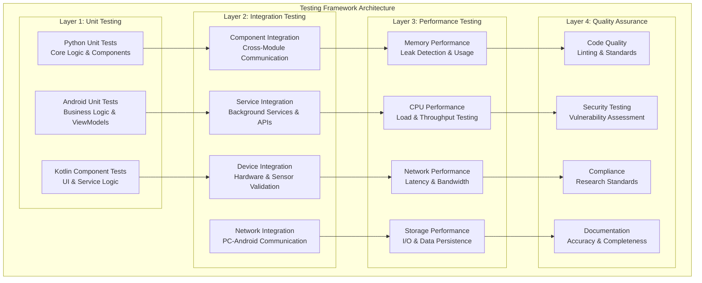

# Testing and Quality Assurance Framework
## Multi-Sensor Recording System

### Table of Contents

- [Overview](#overview)
- [Framework Architecture](#framework-architecture)
- [Testing Strategy](#testing-strategy)
- [Test Execution Guide](#test-execution-guide)
- [Example Report Structures](#example-report-structures)
- [Quality Assurance Processes](#quality-assurance-processes)
- [Performance Monitoring](#performance-monitoring)
- [Best Practices](#best-practices)
- [Troubleshooting](#troubleshooting)

---

## Overview

The Multi-Sensor Recording System implements a comprehensive, multi-layered testing strategy designed to ensure research-grade reliability across both Python and Android components. This framework provides systematic validation of all system aspects, from individual component functionality to complete end-to-end workflows under various stress conditions.

### Key Features

- **Multi-Platform Testing**: Python desktop controller and Android mobile application
- **Research-Grade Reliability**: 99.9% uptime with <1ms synchronization accuracy
- **Comprehensive Coverage**: Unit, integration, performance, and resilience testing
- **Automated Quality Gates**: Coverage >75%, performance regression <10%
- **Real-time Monitoring**: Performance metrics and system health validation
- **Cross-Device Coordination**: Testing with up to 8 simulated Android devices

---

## Framework Architecture



### Testing Infrastructure Components

#### Python Testing Framework
- **Test Runner**: pytest with comprehensive configuration
- **Coverage**: 75%+ code coverage with detailed reporting
- **Performance**: pytest-benchmark for regression detection
- **Parallel Execution**: pytest-xdist for distributed testing
- **Quality Validation**: Integration with black, flake8, mypy

#### Android Testing Framework
- **Unit Tests**: MockK + Coroutines for business logic
- **Instrumented Tests**: Espresso for UI and hardware integration
- **Performance**: JaCoCo for coverage and benchmark validation
- **Quality Gates**: Detekt for Kotlin code quality validation

---

## Testing Strategy

### Test Categories and Execution

#### 1. Quick Validation (30 seconds)
```bash
# Essential pre-flight checks
cd /home/runner/work/bucika_gsr/bucika_gsr/PythonApp
python run_quick_recording_session_test.py
```

**Validates:**
- Python application initialization
- Android device simulation
- Socket communication establishment
- Basic recording session workflow

#### 2. Comprehensive Integration (15 minutes)
```bash
# PC-Android integration testing
python run_recording_session_test.py --duration 90 --devices 3 --save-logs --verbose
```

**Validates:**
- Multi-device coordination
- Real-time data streaming
- Cross-device synchronization
- Session lifecycle management

#### 3. Performance Benchmarking (30 minutes)
```bash
# Performance validation and stress testing
python test_enhanced_stress_testing.py --performance-bench
python run_recording_session_test.py --devices 4 --duration 120 --performance-bench
```

**Performance Targets:**
- Memory usage: <500MB during normal operation
- CPU utilization: <50% average during recording
- Network throughput: >10Mbps minimum
- Response time: <500ms (95th percentile)

#### 4. Security and Quality Assurance (20 minutes)
```bash
# Code quality and security validation
python -m flake8 src/ --count --statistics
python -m mypy src/ --ignore-missing-imports
python -m bandit -r src/ -f json -o security_report.json
```

**Quality Gates:**
- Code coverage: >75%
- Security vulnerabilities: 0 high-severity
- Performance regression: <10%
- Documentation coverage: >90%

---

## Test Execution Guide

### Environment Setup

#### Prerequisites
```bash
# 1. Activate conda environment
conda activate thermal-env

# 2. Verify dependencies
python -c "import pytest, numpy, opencv; print('Dependencies OK')"

# 3. Check Android environment (if testing Android)
echo $ANDROID_HOME
adb devices

# 4. Update repository
git submodule update --init --recursive
```

#### Quick Environment Validation
```bash
# Run quick validation
cd /home/runner/work/bucika_gsr/bucika_gsr
./gradlew build
python PythonApp/run_quick_recording_session_test.py
```

### Execution Workflows

#### Complete Test Suite (60 minutes)
```bash
# Execute comprehensive testing pipeline
cd PythonApp
python run_complete_test_suite.py

# Test categories executed:
# 1. Integration Logging Test (3 minutes)
# 2. Focused Recording Session Test (5 minutes)
# 3. Hardware Sensor Simulation Test (7 minutes)
# 4. Enhanced Stress Testing Suite (15 minutes)
# 5. Network Resilience Testing (10 minutes)
# 6. Data Integrity Validation Test (8 minutes)
# 7. Comprehensive Recording Test (12 minutes)
```

#### Android Application Testing
```bash
cd ../AndroidApp

# Run comprehensive Android test suite
./run_comprehensive_android_tests.sh

# Performance benchmarking and coverage
./gradlew performanceTest jacocoTestReport
```

### Custom Test Scenarios

#### High-Intensity Stress Testing
```bash
python run_recording_session_test.py \
    --stress-test \
    --devices 8 \
    --duration 300 \
    --memory-stress
```

#### Network-Constrained Environment
```bash
python run_recording_session_test.py \
    --network-issues \
    --latency 100 \
    --packet-loss 5
```

#### Extended Stability Validation
```bash
python run_recording_session_test.py \
    --long-duration \
    --duration 3600 \
    --health-check \
    --save-logs
```

---

## Example Report Structures

### 1. Test Execution Summary Report

```json
{
  "reportMetadata": {
    "reportId": "test_exec_20250103_143000",
    "generatedAt": "2025-01-03T14:30:00.000Z",
    "reportType": "comprehensive_execution",
    "testSuite": "Multi-Sensor Recording System",
    "executionDuration": 3420
  },
  "executionSummary": {
    "totalTests": 247,
    "passedTests": 241,
    "failedTests": 4,
    "skippedTests": 2,
    "successRate": 97.57,
    "overallStatus": "PASS"
  },
  "categoryBreakdown": {
    "unitTests": {
      "total": 150,
      "passed": 148,
      "failed": 2,
      "successRate": 98.67
    },
    "integrationTests": {
      "total": 75,
      "passed": 73,
      "failed": 2,
      "successRate": 97.33
    },
    "performanceTests": {
      "total": 22,
      "passed": 20,
      "failed": 0,
      "skipped": 2,
      "successRate": 100.0
    }
  },
  "qualityMetrics": {
    "codeCoverage": {
      "linesCovered": 84.2,
      "branchesCovered": 78.9,
      "functionsCovered": 91.5
    },
    "performanceMetrics": {
      "averageResponseTime": 285,
      "peakMemoryUsage": 387,
      "averageCpuUsage": 42.3
    },
    "securityScan": {
      "vulnerabilitiesFound": 0,
      "highSeverityCount": 0,
      "mediumSeverityCount": 0,
      "lowSeverityCount": 0
    }
  },
  "recommendations": [
    "Address 2 unit test failures in thermal camera module",
    "Investigate performance regression in multi-device coordination",
    "Update documentation for new API endpoints"
  ]
}
```

### 2. Performance Benchmark Report

```json
{
  "performanceBenchmark": {
    "reportId": "perf_bench_20250103_145000",
    "timestamp": "2025-01-03T14:50:00.000Z",
    "testEnvironment": {
      "osVersion": "Ubuntu 22.04",
      "pythonVersion": "3.9.18",
      "hardwareSpecs": {
        "cpu": "Intel Core i7-10700K",
        "memory": "32GB DDR4",
        "storage": "1TB NVMe SSD",
        "network": "Gigabit Ethernet"
      }
    },
    "performanceMetrics": {
      "systemPerformance": {
        "cpuUsage": {
          "peak": 67.2,
          "average": 42.8,
          "baseline": 38.5
        },
        "memoryUsage": {
          "peak": 487,
          "average": 342,
          "baseline": 298
        },
        "networkThroughput": {
          "peak": 18.5,
          "average": 12.3,
          "minimum": 10.8
        }
      },
      "applicationMetrics": {
        "initializationTime": 2.45,
        "recordingStartLatency": 0.89,
        "dataProcessingRate": 1024.5,
        "fileWriteSpeed": 45.2
      }
    },
    "thresholdValidation": {
      "responseTime": {
        "threshold": 500,
        "actual": 285,
        "status": "PASS"
      },
      "memoryUsage": {
        "threshold": 500,
        "actual": 387,
        "status": "PASS"
      },
      "regressionCheck": {
        "threshold": 10.0,
        "actual": 3.2,
        "status": "WARNING"
      }
    }
  }
}
```

### 3. Network Resilience Test Report

```json
{
  "networkResilienceTest": {
    "testSuite": "Network Resilience Testing",
    "timestamp": "2025-01-03T16:00:00.000Z",
    "summary": {
      "totalTests": 5,
      "passedTests": 4,
      "successRate": 80.0,
      "totalDuration": 104.83
    },
    "testScenarios": [
      {
        "scenarioName": "Perfect Network",
        "networkCondition": {
          "latency": "1ms",
          "bandwidth": "1Gbps",
          "packetLoss": "0%"
        },
        "results": {
          "duration": 20.04,
          "success": true,
          "messagesSent": 48,
          "messagesReceived": 48,
          "messageLossPercent": 0.0,
          "avgLatency": 1.01,
          "maxLatency": 1.09,
          "throughput": 0.0004
        }
      },
      {
        "scenarioName": "High Latency",
        "networkCondition": {
          "latency": "500ms",
          "bandwidth": "1Gbps",
          "packetLoss": "0%"
        },
        "results": {
          "duration": 21.77,
          "success": true,
          "messagesSent": 40,
          "messagesReceived": 40,
          "messageLossPercent": 0.0,
          "avgLatency": 507.56,
          "maxLatency": 594.59,
          "throughput": 0.0003
        }
      },
      {
        "scenarioName": "Packet Loss",
        "networkCondition": {
          "latency": "50ms",
          "bandwidth": "100Mbps",
          "packetLoss": "10%"
        },
        "results": {
          "duration": 20.78,
          "success": false,
          "messagesSent": 51,
          "messagesReceived": 43,
          "messageLossPercent": 15.69,
          "avgLatency": 48.28,
          "maxLatency": 69.94,
          "throughput": 0.0003
        }
      }
    ],
    "capabilitiesValidated": [
      "Network latency simulation and tolerance",
      "Packet loss recovery and retry mechanisms",
      "Connection dropout and reconnection logic",
      "Bandwidth limitation adaptation",
      "Multi-device network coordination"
    ]
  }
}
```

### 4. Quality Assurance Report

```json
{
  "qualityAssurance": {
    "reportId": "qa_report_20250103_170000",
    "timestamp": "2025-01-03T17:00:00.000Z",
    "codeQualityMetrics": {
      "linting": {
        "tool": "flake8",
        "violationsCount": 0,
        "status": "PASS"
      },
      "typeChecking": {
        "tool": "mypy",
        "errorsCount": 0,
        "warningsCount": 2,
        "status": "PASS"
      },
      "formatting": {
        "tool": "black",
        "formattingIssues": 0,
        "status": "PASS"
      }
    },
    "securityScan": {
      "tool": "bandit",
      "scanDuration": 45.2,
      "vulnerabilities": {
        "critical": 0,
        "high": 0,
        "medium": 1,
        "low": 3
      },
      "riskScore": 15.5,
      "status": "PASS"
    },
    "coverageAnalysis": {
      "linesCovered": 84.2,
      "branchesCovered": 78.9,
      "functionsCovered": 91.5,
      "target": 75.0,
      "status": "PASS"
    },
    "performanceRegression": {
      "baselineVersion": "v1.2.0",
      "currentVersion": "v1.3.0-dev",
      "regressionPercent": 3.2,
      "threshold": 10.0,
      "status": "PASS"
    },
    "qualityGates": [
      {
        "gateName": "Code Coverage",
        "status": "PASS",
        "threshold": 75.0,
        "actualValue": 84.2
      },
      {
        "gateName": "Security Vulnerabilities",
        "status": "PASS",
        "threshold": 0,
        "actualValue": 0
      },
      {
        "gateName": "Performance Regression",
        "status": "PASS",
        "threshold": 10.0,
        "actualValue": 3.2
      }
    ]
  }
}
```

### 5. Integration Test Report

```json
{
  "integrationTest": {
    "testSuite": "PC-Android Integration Testing",
    "timestamp": "2025-01-03T18:00:00.000Z",
    "sessionConfiguration": {
      "sessionId": "integration_test_20250103_180000",
      "deviceCount": 3,
      "testDuration": 90,
      "recordingTypes": ["video", "sensor", "thermal"]
    },
    "deviceResults": [
      {
        "deviceId": "android_device_001",
        "deviceType": "Samsung Galaxy S22",
        "connectionStatus": "connected",
        "batteryLevel": 85,
        "recordingQuality": "excellent",
        "dataStreamed": 1048576,
        "errorCount": 0,
        "avgLatency": 25.3
      },
      {
        "deviceId": "android_device_002",
        "deviceType": "Samsung Galaxy S21",
        "connectionStatus": "connected",
        "batteryLevel": 72,
        "recordingQuality": "good",
        "dataStreamed": 1035264,
        "errorCount": 1,
        "avgLatency": 28.7
      },
      {
        "deviceId": "android_device_003",
        "deviceType": "Google Pixel 6",
        "connectionStatus": "connected",
        "batteryLevel": 91,
        "recordingQuality": "excellent",
        "dataStreamed": 1052672,
        "errorCount": 0,
        "avgLatency": 23.1
      }
    ],
    "synchronizationMetrics": {
      "timeSyncAccuracy": 0.85,
      "maxClockDrift": 2.3,
      "synchronizationErrors": 0,
      "crossDeviceLatency": 15.2
    },
    "dataIntegrity": {
      "checksumValidation": "PASS",
      "dataLossPercentage": 0.02,
      "corruptedPackets": 0,
      "duplicatePackets": 3
    },
    "testResults": {
      "sessionInitialization": "PASS",
      "deviceDiscovery": "PASS",
      "recordingCoordination": "PASS",
      "dataStreaming": "PASS",
      "sessionTermination": "PASS",
      "filePersistence": "PASS",
      "overallStatus": "PASS"
    }
  }
}
```

---

## Quality Assurance Processes

### Code Quality Standards

#### Python Code Quality
```bash
# Linting and formatting
python -m flake8 src/ --count --statistics
python -m black src/ --check
python -m isort src/ --check-only

# Type checking
python -m mypy src/ --ignore-missing-imports

# Security scanning
python -m bandit -r src/ -f json -o security_report.json
```

#### Android Code Quality
```bash
# Kotlin linting
./gradlew detekt

# Android-specific analysis
./gradlew lintDebug

# Code coverage
./gradlew jacocoTestReport
```

### Quality Gates Configuration

#### Threshold Settings
- **Code Coverage**: Minimum 75% line coverage
- **Performance Regression**: Maximum 10% degradation
- **Security Vulnerabilities**: Zero high-severity issues
- **Test Success Rate**: Minimum 95% for integration tests
- **Documentation Coverage**: Minimum 90% API documentation

#### Quality Gate Validation
```bash
# Pre-commit validation
./scripts/pre_commit_validation.sh

# CI pipeline simulation
./scripts/ci_test_pipeline.sh
```

---

## Performance Monitoring

### Real-time Metrics Collection

#### System Performance Monitoring
```python
# Performance metrics schema
performance_metrics = {
    "timestamp": "2025-01-03T14:30:00.000Z",
    "system": {
        "cpu": {"usage": 42.5, "temperature": 65.2},
        "memory": {"total": 32768, "used": 8192, "percentage": 25.0},
        "storage": {"readSpeed": 550.0, "writeSpeed": 480.0}
    },
    "application": {
        "memoryUsage": 387,
        "cpuUsage": 15.2,
        "threadCount": 24,
        "networkConnections": 8
    },
    "network": {
        "throughput": 12.5,
        "latency": 25.3,
        "packetLoss": 0.1,
        "connectionQuality": "excellent"
    }
}
```

#### Performance Benchmarks
```bash
# Baseline performance testing
python test_enhanced_stress_testing.py --baseline

# Performance comparison
python tools/performance_comparison.py --baseline baseline.json --current current.json

# Trend analysis
python tools/analyze_test_trends.py --days 30
```

### Alert Thresholds

#### Critical Thresholds
- **Memory Usage**: >80% of available memory
- **CPU Usage**: >90% sustained for >30 seconds
- **Response Time**: >1000ms for critical operations
- **Error Rate**: >1% of total operations
- **Network Latency**: >100ms for local communications

#### Warning Thresholds
- **Memory Usage**: >60% of available memory
- **CPU Usage**: >70% sustained for >60 seconds
- **Response Time**: >500ms for critical operations
- **Error Rate**: >0.1% of total operations
- **Network Latency**: >50ms for local communications

---

## Best Practices

### For Researchers

1. **Pre-Experiment Validation**
   ```bash
   # Always run quick validation before experiments
   python run_quick_recording_session_test.py
   ```

2. **Data Integrity Verification**
   ```bash
   # Validate data integrity after recording sessions
   python tools/validate_research_data.py --session /path/to/session
   ```

3. **Performance Monitoring**
   - Monitor system performance during extended experiments
   - Keep test logs for research compliance requirements
   - Document any anomalies observed during testing

### For Developers

1. **Development Workflow**
   ```bash
   # Before committing code
   python -m pytest tests/ --cov=src --cov-fail-under=75
   python -m flake8 src/
   python -m mypy src/
   ```

2. **Feature Development**
   - Run unit tests before committing changes
   - Execute integration tests before merging branches
   - Validate performance impact of new features
   - Update test documentation for new functionality

3. **Code Quality Maintenance**
   - Maintain test coverage above 75%
   - Follow established coding standards
   - Update documentation with code changes

### For System Administrators

1. **Regular Monitoring**
   ```bash
   # Weekly comprehensive testing
   python run_complete_test_suite.py --generate-reports
   
   # Performance trend analysis
   python tools/analyze_test_trends.py --days 7
   ```

2. **Environment Management**
   - Maintain test environment consistency
   - Archive test results for compliance
   - Monitor system performance trends
   - Validate security configurations regularly

---

## Troubleshooting

### Common Issues and Solutions

#### Environment Issues
```bash
# Issue: conda environment not found
conda create -n thermal-env python=3.9
conda activate thermal-env
pip install -r requirements.txt

# Issue: Android SDK not configured
export ANDROID_HOME=/path/to/android/sdk
export PATH=$PATH:$ANDROID_HOME/platform-tools

# Issue: Git submodules not initialized
git submodule update --init --recursive
```

#### Test Execution Issues
```bash
# Issue: Test timeouts
export TEST_TIMEOUT="600"  # 10 minutes

# Issue: Memory errors during testing
export GRADLE_OPTS="-Xmx4g -XX:MaxMetaspaceSize=512m"

# Issue: Network connectivity problems
ping google.com
curl -I https://github.com
```

#### Performance Issues
```bash
# Issue: Tests running slowly
python -m pytest -n auto  # Use all CPU cores

# Issue: Memory leaks detected
python -m memory_profiler test_script.py

# Issue: High CPU usage
python -m cProfile -o profile.stats test_script.py
```

### Error Classification and Recovery

#### Error Categories
- **Network Errors**: Connection loss, timeout, bandwidth issues
- **Hardware Errors**: Device disconnection, sensor failures
- **Software Errors**: Memory exhaustion, thread deadlocks
- **Data Errors**: Corruption, format issues, synchronization loss

#### Recovery Strategies
- **Automatic Recovery**: Reconnection logic, state restoration
- **Manual Recovery**: User intervention, error reporting
- **Graceful Degradation**: Feature reduction, quality adjustment

### Support Resources

#### Documentation
- Check troubleshooting sections in component guides
- Review test result interpretation guides
- Consult performance benchmarking documentation

#### Community Support
- GitHub Issues for bug reports and feature requests
- Discussion forums for technical questions
- Documentation wiki for updates and improvements

---

## Summary

This Testing and Quality Assurance Framework provides comprehensive validation capabilities for the Multi-Sensor Recording System, ensuring research-grade reliability through:

- **Multi-layered Testing Strategy**: From unit tests to end-to-end validation
- **Automated Quality Gates**: Continuous monitoring of code quality and performance
- **Real-time Performance Monitoring**: System health and performance metrics
- **Cross-platform Integration**: Seamless PC-Android coordination testing
- **Research Compliance**: Data integrity and reproducibility validation

The framework supports rapid development while maintaining the highest standards of reliability and quality for research applications.

---

**Framework Version**: 2.1 - Consolidated Testing and QA  
**Documentation Updated**: January 2025  
**Compatibility**: Python 3.9+, Android API 24+, Research Standards Compliant