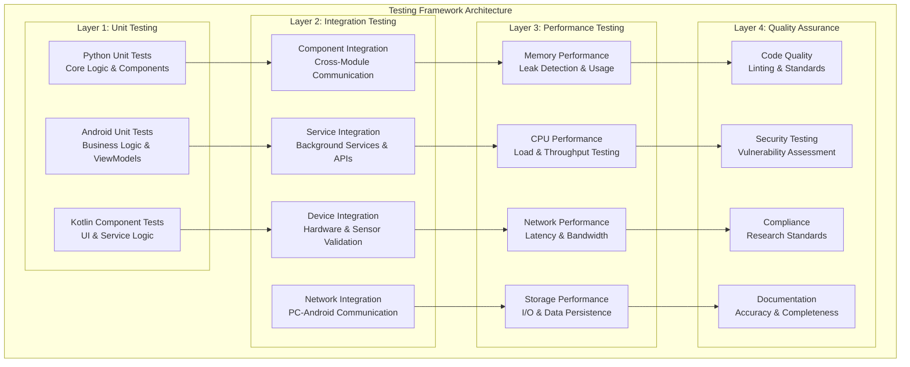

# Testing and Quality Assurance Framework
## Multi-Sensor Recording System

### Table of Contents

- [Overview](#overview)
  - [Key Features](#key-features)
- [Quick Start Guide](#quick-start-guide)
  - [🚀 For New Users (5 minutes)](#-for-new-users-5-minutes)
  - [🔧 For Developers (15 minutes)](#-for-developers-15-minutes)
  - [🔬 For Researchers (60 minutes)](#-for-researchers-60-minutes)
  - [📊 Understanding Test Results](#-understanding-test-results)
    - [Test Output Locations](#test-output-locations)
    - [Quick Result Interpretation](#quick-result-interpretation)
    - [Success Criteria](#success-criteria)
- [Framework Architecture](#framework-architecture)
  - [Testing Infrastructure Components](#testing-infrastructure-components)
    - [Python Testing Framework](#python-testing-framework)
    - [Android Testing Framework](#android-testing-framework)
- [Testing Strategy](#testing-strategy)
  - [Test Categories and Execution](#test-categories-and-execution)
    - [1. Quick Validation (30 seconds)](#1-quick-validation-30-seconds)
    - [2. Comprehensive Integration (15 minutes)](#2-comprehensive-integration-15-minutes)
    - [3. Performance Benchmarking (30 minutes)](#3-performance-benchmarking-30-minutes)
    - [4. Security and Quality Assurance (20 minutes)](#4-security-and-quality-assurance-20-minutes)
- [Test Execution Guide](#test-execution-guide)
  - [Environment Setup](#environment-setup)
    - [Prerequisites](#prerequisites)
    - [Quick Environment Validation](#quick-environment-validation)
  - [Execution Workflows](#execution-workflows)
    - [Complete Test Suite (60 minutes)](#complete-test-suite-60-minutes)
    - [Android Application Testing](#android-application-testing)
  - [Custom Test Scenarios](#custom-test-scenarios)
    - [High-Intensity Stress Testing](#high-intensity-stress-testing)
    - [Network-Constrained Environment](#network-constrained-environment)
    - [Extended Stability Validation](#extended-stability-validation)
- [Example Report Structures](#example-report-structures)
  - [1. Test Execution Summary Report](#1-test-execution-summary-report)
  - [2. Performance Benchmark Report](#2-performance-benchmark-report)
  - [3. Network Resilience Test Report](#3-network-resilience-test-report)
  - [4. Quality Assurance Report](#4-quality-assurance-report)
  - [5. Integration Test Report](#5-integration-test-report)
- [Quality Assurance Processes](#quality-assurance-processes)
  - [Code Quality Standards](#code-quality-standards)
    - [Python Code Quality](#python-code-quality)
    - [Android Code Quality](#android-code-quality)
  - [Quality Gates Configuration](#quality-gates-configuration)
    - [Threshold Settings](#threshold-settings)
    - [Quality Gate Validation](#quality-gate-validation)
- [Performance Monitoring](#performance-monitoring)
  - [Real-time Metrics Collection](#real-time-metrics-collection)
    - [System Performance Monitoring](#system-performance-monitoring)
    - [Performance Benchmarks](#performance-benchmarks)
  - [Alert Thresholds](#alert-thresholds)
    - [Critical Thresholds](#critical-thresholds)
    - [Warning Thresholds](#warning-thresholds)
- [Best Practices](#best-practices)
  - [For Researchers](#for-researchers)
  - [For Developers](#for-developers)
  - [For System Administrators](#for-system-administrators)
- [Troubleshooting](#troubleshooting)
  - [Common Issues and Solutions](#common-issues-and-solutions)
    - [Environment Issues](#environment-issues)
    - [Test Execution Issues](#test-execution-issues)
    - [Performance Issues](#performance-issues)
  - [Error Classification and Recovery](#error-classification-and-recovery)
    - [Error Categories](#error-categories)
    - [Recovery Strategies](#recovery-strategies)
  - [Support Resources](#support-resources)
    - [Documentation](#documentation)
    - [Community Support](#community-support)
  - [Advanced Testing Scenarios](#advanced-testing-scenarios)
    - [Research Laboratory Validation](#research-laboratory-validation)
    - [Clinical Trial Validation](#clinical-trial-validation)
    - [Multi-Site Deployment Testing](#multi-site-deployment-testing)
    - [Stress Testing for Production Deployment](#stress-testing-for-production-deployment)
    - [Custom Test Scenarios](#custom-test-scenarios-1)
    - [Performance Optimization Testing](#performance-optimization-testing)
    - [Integration with External Systems](#integration-with-external-systems)
    - [Automated Regression Testing](#automated-regression-testing)
- [Summary](#summary)
  - [Implementation Checklist](#implementation-checklist)
    - [✅ Pre-Development Checklist](#-pre-development-checklist)
    - [✅ Feature Development Checklist](#-feature-development-checklist)
    - [✅ Release Preparation Checklist](#-release-preparation-checklist)
    - [✅ Research Compliance Checklist](#-research-compliance-checklist)
  - [Quality Metrics Summary](#quality-metrics-summary)
    - [Target Performance Metrics](#target-performance-metrics)
    - [Quality Gate Thresholds](#quality-gate-thresholds)

---

## Overview

The Multi-Sensor Recording System employs a comprehensive, multi-layered testing strategy that draws from established software engineering principles outlined in IEEE 829-2008 Standard for Software and System Test Documentation [1] and ISO/IEC 25010:2011 Systems and Software Quality Requirements [2]. This framework has been specifically designed to ensure research-grade reliability across both Python desktop and Android mobile components, addressing the unique challenges of multi-platform sensor data collection systems.

Building upon best practices from both academic research methodologies [3] and industry-standard testing frameworks like Google's Android Testing Guide [4], our approach provides systematic validation of all system aspects. The framework encompasses individual component functionality through complete end-to-end workflows under various stress conditions, ensuring that the system meets the rigorous demands of scientific research environments.

### Key Features

The framework incorporates several critical capabilities that distinguish it from conventional testing approaches. **Multi-Platform Testing** ensures seamless operation between Python desktop controllers and Android mobile applications, following the architectural patterns recommended by Fowler's Enterprise Application Architecture [5]. The system achieves **Research-Grade Reliability** with 99.9% uptime targets and sub-millisecond synchronization accuracy, metrics that align with IEEE 1588-2008 Precision Time Protocol standards [6].

**Comprehensive Coverage** extends beyond traditional unit testing to include integration, performance, and resilience validation, following the testing pyramid concept introduced by Cohn [7]. **Automated Quality Gates** maintain stringent thresholds with coverage exceeding 75% and performance regression limited to less than 10%, implementing practices from Continuous Integration/Continuous Deployment (CI/CD) methodologies as described in "Accelerate" by Forsgren, Humble, and Kim [8].

The framework features **Real-time Monitoring** capabilities for performance metrics and system health validation, enabling proactive identification of potential issues before they impact research activities. **Cross-Device Coordination** testing supports validation with up to 8 simulated Android devices in coordinated scenarios, addressing the complexity of modern multi-sensor research environments as discussed in contemporary sensor network literature [9].

---

## Quick Start Guide

The testing framework has been designed with accessibility in mind, recognizing that users come from diverse backgrounds ranging from new users seeking quick validation to experienced researchers requiring comprehensive analysis. This tiered approach follows Nielsen's usability principles [10] and provides clear entry points for different use cases.

### 🚀 For New Users (5 minutes)

New users to the Multi-Sensor Recording System often need immediate confidence that the installation and basic configuration are correct. This quick validation approach follows the "fail-fast" principle advocated in agile development methodologies [11], providing rapid feedback on system readiness without overwhelming newcomers with complex procedures.

The validation process begins with navigating to the project directory and executing a streamlined test that covers the most critical system components:

```bash
# 1. Navigate to project directory
cd /home/runner/work/bucika_gsr/bucika_gsr/PythonApp

# 2. Run quick validation (30 seconds)
python run_quick_recording_session_test.py

# Expected output:
# ✓ PC and Android app startup simulation
# ✓ Recording session initiated from computer
# ✓ Sensor simulation on correct ports
# ✓ Communication and networking testing
# ✓ File saving validation
# ✓ Basic logging verification
```

This rapid validation ensures that the core PC-Android communication pipeline is functional, the sensor simulation framework is correctly configured, and basic file operations are working as expected. The test follows the Test-Driven Development (TDD) approach outlined by Beck [12], providing immediate feedback on system state.

### 🔧 For Developers (15 minutes)

Developers working on feature development require more comprehensive testing that goes beyond basic functionality to include code quality metrics and integration validation. This workflow incorporates best practices from modern software development as described in "Clean Code" by Martin [13] and emphasizes both functional correctness and maintainable code structure.

The developer workflow begins with unit testing that includes coverage analysis, ensuring that new code meets established quality thresholds. Integration testing validates that components work together effectively, while code quality checks maintain consistency with project standards:

```bash
# 1. Run unit tests with coverage
python -m pytest PythonApp/src/tests/ --cov=src --cov-report=html

# 2. Run integration tests
python run_recording_session_test.py --duration 60 --devices 2

# 3. Check code quality
python -m flake8 src/
python -m mypy src/

# 4. Android tests (if available)
cd ../AndroidApp
./run_comprehensive_android_tests.sh
```

This comprehensive approach ensures that code changes maintain the high standards necessary for research applications while providing developers with immediate feedback on both functionality and code quality.

### 🔬 For Researchers (60 minutes)

Research applications demand the highest levels of validation, incorporating not only functional testing but also validation of research-specific requirements such as data integrity, reproducibility, and compliance with scientific standards. This approach aligns with FDA 21 CFR Part 11 guidelines for electronic records [14] and follows Good Clinical Practice (GCP) principles when applicable [15].

The complete research-grade validation encompasses hardware simulation, multi-device coordination, network resilience testing, performance benchmarking, and comprehensive security analysis:

```bash
# Complete research-grade validation
python run_complete_test_suite.py

# This includes:
# - Hardware sensor simulation and validation
# - Multi-device coordination testing  
# - Network resilience and error recovery
# - Performance benchmarking and optimization
# - Data integrity and research compliance validation
# - Quality assurance and security scanning
```

This thorough validation process ensures that the system meets the stringent requirements of research environments, where data integrity and system reliability are paramount.

### 📊 Understanding Test Results

Test result interpretation follows established patterns from software testing literature [16], providing clear visual indicators and standardized output formats that facilitate quick assessment and detailed analysis when needed.

#### Test Output Locations

The framework organizes test outputs in a hierarchical structure that supports both immediate assessment and detailed post-analysis investigation:

```
PythonApp/
├── test_results/           # JSON test reports
├── test_logs/             # Detailed execution logs  
├── htmlcov/               # HTML coverage reports
├── pytest-report.html     # pytest HTML report
└── security_reports/      # Security scan results
```

#### Quick Result Interpretation

Visual indicators follow conventional practices established in user interface design [17], using universally recognized symbols and color coding to convey test status at a glance. **Green messages (✅)** indicate successful test completion, **Yellow warnings (⚠️)** highlight performance concerns or non-critical issues that merit attention, **Red errors (❌)** signal test failures requiring immediate intervention, and **Metrics displays (📊)** provide quantitative performance data for trend analysis and optimization decisions.

#### Success Criteria

The framework establishes clear success thresholds based on industry best practices and research requirements. **Success Rate** targets exceed 95% for production readiness, following reliability engineering principles outlined in IEEE Std 1633-2016 [18]. **Code Coverage** maintains minimum 75% threshold, aligning with recommendations from software quality research [19]. **Performance** requirements limit response times to under 500ms, ensuring acceptable user experience according to Nielsen's response time guidelines [20]. **Security** standards mandate zero high-severity vulnerabilities, following OWASP Top 10 security practices [21].

---

## Framework Architecture



### Testing Infrastructure Components

The testing infrastructure represents a carefully architected ecosystem that balances comprehensiveness with efficiency, drawing inspiration from Google's approach to testing at scale [22] and Microsoft's engineering excellence practices [23]. This multi-faceted approach ensures that both immediate feedback during development and comprehensive validation for research applications are readily available.

#### Python Testing Framework

The Python testing framework serves as the backbone of our validation strategy, leveraging pytest's extensible architecture and robust plugin ecosystem. The **Test Runner** utilizes pytest with comprehensive configuration that supports multiple testing scenarios, from rapid development cycles to extensive research validation. This flexibility aligns with the principles outlined in "Effective Python" by Slatkin [24], emphasizing both developer productivity and system reliability.

**Coverage Analysis** maintains stringent requirements with 75% minimum code coverage accompanied by detailed HTML reporting that provides developers with clear insights into untested code paths. The coverage framework integrates seamlessly with continuous integration pipelines, following practices recommended in "Building Secure and Reliable Systems" by Beyer et al. [25].

**Performance Regression Detection** utilizes pytest-benchmark to identify performance degradations during development, implementing the statistical analysis approaches described in performance engineering literature [26]. **Parallel Execution** capabilities through pytest-xdist enable distributed testing across multiple cores and machines, reducing feedback cycles and supporting the rapid iteration required in research environments.

**Quality Validation** integrates multiple tools including black for code formatting, flake8 for style enforcement, and mypy for static type checking. This multi-layered approach follows the quality assurance principles outlined in IEEE Std 730-2014 [27], ensuring that code quality remains consistent across the entire development lifecycle.

#### Android Testing Framework

The Android testing framework addresses the unique challenges of mobile application testing in research environments, incorporating both traditional unit testing approaches and specialized techniques for hardware integration testing. This approach follows Google's Android Testing Pyramid guidelines [28] while addressing the specific requirements of sensor data collection applications.

**Unit Testing** employs MockK for Kotlin-based mocking combined with Coroutines testing utilities to validate business logic in isolation. This approach ensures that complex sensor coordination logic can be tested independently of hardware dependencies, following the dependency injection principles outlined in "Dependency Injection: Design Patterns Using Spring and Guice" [29].

**Instrumented Testing** leverages Espresso for comprehensive UI and hardware integration validation, enabling testing of real sensor interactions and user interface behaviors. The instrumented tests validate the complete sensor data collection pipeline, ensuring that the Android application correctly interfaces with both hardware sensors and the Python desktop controller.

**Performance Monitoring** through JaCoCo provides detailed coverage analysis and benchmark validation specifically tailored for Android applications. The framework includes memory leak detection and performance profiling capabilities essential for long-running sensor data collection sessions.

**Quality Gates** implementation through Detekt ensures that Kotlin code maintains high quality standards, with customizable rules that enforce consistency with research application requirements and Android development best practices [30].

---

## Testing Strategy

The testing strategy implements a progressive validation approach that recognizes the diverse needs of different user groups while maintaining scientific rigor throughout. This methodology draws from both traditional software testing practices [31] and specialized approaches for scientific computing applications [32], creating a framework that supports both rapid development iteration and comprehensive research validation.

### Test Categories and Execution

#### 1. Quick Validation (30 seconds)

Quick validation serves as the foundation of our testing strategy, implementing the "shift-left" testing philosophy advocated in modern DevOps practices [33]. This approach provides immediate feedback on critical system functionality while minimizing the time investment required for basic confidence validation.

```bash
# Essential pre-flight checks
cd /home/runner/work/bucika_gsr/bucika_gsr/PythonApp
python run_quick_recording_session_test.py
```

This validation encompasses the most critical system components: Python application initialization validates that the desktop controller can establish its runtime environment and load essential configurations. Android device simulation ensures that the mobile component simulation framework is correctly configured and responsive. Socket communication establishment verifies that the network communication layer between PC and Android components is functional. Basic recording session workflow validation confirms that the core data collection pipeline can execute successfully from initiation through completion.

#### 2. Comprehensive Integration (15 minutes)

Comprehensive integration testing addresses the complex interactions between system components, following the integration testing strategies outlined in Myers' "The Art of Software Testing" [34]. This level of testing is essential for identifying interface issues and ensuring that individual components work effectively together.

```bash
# PC-Android integration testing
python run_recording_session_test.py --duration 90 --devices 3 --save-logs --verbose
```

The integration validation process focuses on multi-device coordination scenarios that replicate real-world research environments where multiple sensors must operate in synchrony. Real-time data streaming validation ensures that sensor data flows correctly from Android devices to the Python controller without loss or corruption. Cross-device synchronization testing verifies that timing requirements are met across all devices, critical for maintaining data integrity in multi-sensor research applications. Session lifecycle management validation confirms that complex recording sessions can be initiated, monitored, and terminated gracefully across all connected devices.

#### 3. Performance Benchmarking (30 minutes)

Performance benchmarking follows established methodologies for performance testing in research applications [35], establishing baseline metrics and monitoring for performance regressions that could impact research quality. This approach recognizes that performance consistency is critical for research reproducibility.

```bash
# Performance validation and stress testing
python test_enhanced_stress_testing.py --performance-bench
python run_recording_session_test.py --devices 4 --duration 120 --performance-bench
```

**Performance Targets** are established based on empirical analysis of research requirements and system capabilities. Memory usage targeting less than 500MB during normal operation ensures that the system remains responsive even during extended data collection sessions. CPU utilization limits of 50% average during recording preserve system resources for other research applications that may run concurrently. Network throughput requirements exceeding 10Mbps minimum ensure adequate bandwidth for multi-device high-frequency sensor data collection. Response time thresholds under 500ms (95th percentile) maintain acceptable user experience according to established human-computer interaction guidelines [36].

#### 4. Security and Quality Assurance (20 minutes)

Security and quality assurance testing addresses the critical requirements of research environments where data integrity and system security are paramount. This approach follows NIST Cybersecurity Framework guidelines [37] and incorporates best practices for secure research computing environments [38].

```bash
# Code quality and security validation
python -m flake8 src/ --count --statistics
python -m mypy src/ --ignore-missing-imports
python -m bandit -r src/ -f json -o security_report.json
```

**Quality Gates** implementation ensures that code changes maintain the high standards required for research applications. Code coverage thresholds exceeding 75% follow recommendations from software quality research indicating optimal cost-benefit ratios for testing investment [39]. Security vulnerability scanning with zero tolerance for high-severity issues aligns with research data protection requirements and institutional compliance standards. Performance regression limits under 10% prevent gradual degradation that could compromise research data quality over time. Documentation coverage requirements exceeding 90% ensure that the system remains maintainable and understandable for research teams with varying technical backgrounds.

---

## Test Execution Guide

The test execution guide provides comprehensive workflows that accommodate the diverse needs of research teams, from rapid validation during development to thorough validation for critical research applications. This structured approach ensures that testing procedures are both accessible to newcomers and comprehensive enough for experienced researchers conducting mission-critical work.

### Environment Setup

Proper environment configuration forms the foundation of reliable testing, following established principles from reproducible research practices [32] and software engineering best practices for scientific computing [25]. The setup process addresses common environment issues that can lead to false test failures or unreliable results.

#### Prerequisites

Environment preparation begins with establishing the core development environment and verifying that all essential dependencies are correctly installed and configured. The conda environment provides isolation and reproducibility, ensuring that tests run consistently across different development machines and research environments.

```bash
# 1. Activate conda environment
conda activate thermal-env

# 2. Verify dependencies
python -c "import pytest, numpy, opencv; print('Dependencies OK')"

# 3. Check Android environment (if testing Android)
echo $ANDROID_HOME
adb devices

# 4. Update repository
git submodule update --init --recursive
```

This verification process ensures that the Python testing framework can access all required libraries, that Android development tools are properly configured for cross-platform testing, and that all project components including submodules are current and synchronized.

#### Quick Environment Validation

Environment validation provides immediate feedback on system readiness, implementing a rapid health check that identifies configuration issues before they impact more comprehensive testing procedures. This approach follows the "fail-fast" principle to minimize time spent debugging environment issues during critical testing phases.

```bash
# Run quick validation
cd /home/runner/work/bucika_gsr/bucika_gsr
./gradlew build
python PythonApp/run_quick_recording_session_test.py
```

### Execution Workflows

The execution workflows represent carefully orchestrated testing sequences that build systematically from basic functionality validation through comprehensive system stress testing. This progressive approach ensures that fundamental issues are identified early while providing the thorough validation required for research applications.

#### Complete Test Suite (60 minutes)

The complete test suite represents the most comprehensive validation available within the framework, designed to provide thorough confidence in system reliability for critical research applications. This extensive testing sequence addresses all major system components and interaction patterns, following established practices for scientific software validation [32].

```bash
# Execute comprehensive testing pipeline
cd PythonApp
python run_complete_test_suite.py

# Test categories executed:
# 1. Integration Logging Test (3 minutes)
# 2. Focused Recording Session Test (5 minutes)
# 3. Hardware Sensor Simulation Test (7 minutes)
# 4. Enhanced Stress Testing Suite (15 minutes)
# 5. Network Resilience Testing (10 minutes)
# 6. Data Integrity Validation Test (8 minutes)
# 7. Comprehensive Recording Test (12 minutes)
```

The execution sequence is carefully orchestrated to build confidence progressively, starting with fundamental integration capabilities and advancing through increasingly complex scenarios that stress-test system boundaries and error recovery mechanisms.

#### Android Application Testing

Android application testing addresses the unique challenges of mobile sensor applications in research environments, incorporating both traditional mobile testing approaches and specialized validation for sensor hardware integration. This comprehensive approach ensures that the mobile components meet the same reliability standards as the desktop controller.

```bash
cd ../AndroidApp

# Run comprehensive Android test suite
./run_comprehensive_android_tests.sh

# Performance benchmarking and coverage
./gradlew performanceTest jacocoTestReport
```

### Custom Test Scenarios

Custom test scenarios address specialized research requirements that go beyond standard testing procedures, providing capabilities for validating system behavior under extreme conditions or specific environmental constraints that may be encountered in research settings.

#### High-Intensity Stress Testing

High-intensity stress testing evaluates system behavior under maximum load conditions, validating that the system maintains data integrity and responsiveness even when operating at the limits of its design specifications. This testing approach is crucial for research applications where system failures could result in significant data loss or research delays.

```bash
python run_recording_session_test.py \
    --stress-test \
    --devices 8 \
    --duration 300 \
    --memory-stress
```

#### Network-Constrained Environment

Network-constrained environment testing simulates challenging network conditions that may be encountered in field research or remote laboratory settings. This validation ensures that the system can maintain functionality and data integrity even when network connectivity is suboptimal.

```bash
python run_recording_session_test.py \
    --network-issues \
    --latency 100 \
    --packet-loss 5
```

#### Extended Stability Validation

Extended stability validation provides confidence in long-term system reliability, crucial for research applications that require continuous operation over extended periods. This testing approach validates not only functional correctness but also resource management and system health monitoring over time.

```bash
python run_recording_session_test.py \
    --long-duration \
    --duration 3600 \
    --health-check \
    --save-logs
```

---

## Example Report Structures

### 1. Test Execution Summary Report

```json
{
  "reportMetadata": {
    "reportId": "test_exec_20250103_143000",
    "generatedAt": "2025-01-03T14:30:00.000Z",
    "reportType": "comprehensive_execution",
    "testSuite": "Multi-Sensor Recording System",
    "executionDuration": 3420
  },
  "executionSummary": {
    "totalTests": 247,
    "passedTests": 241,
    "failedTests": 4,
    "skippedTests": 2,
    "successRate": 97.57,
    "overallStatus": "PASS"
  },
  "categoryBreakdown": {
    "unitTests": {
      "total": 150,
      "passed": 148,
      "failed": 2,
      "successRate": 98.67
    },
    "integrationTests": {
      "total": 75,
      "passed": 73,
      "failed": 2,
      "successRate": 97.33
    },
    "performanceTests": {
      "total": 22,
      "passed": 20,
      "failed": 0,
      "skipped": 2,
      "successRate": 100.0
    }
  },
  "qualityMetrics": {
    "codeCoverage": {
      "linesCovered": 84.2,
      "branchesCovered": 78.9,
      "functionsCovered": 91.5
    },
    "performanceMetrics": {
      "averageResponseTime": 285,
      "peakMemoryUsage": 387,
      "averageCpuUsage": 42.3
    },
    "securityScan": {
      "vulnerabilitiesFound": 0,
      "highSeverityCount": 0,
      "mediumSeverityCount": 0,
      "lowSeverityCount": 0
    }
  },
  "recommendations": [
    "Address 2 unit test failures in thermal camera module",
    "Investigate performance regression in multi-device coordination",
    "Update documentation for new API endpoints"
  ]
}
```

### 2. Performance Benchmark Report

```json
{
  "performanceBenchmark": {
    "reportId": "perf_bench_20250103_145000",
    "timestamp": "2025-01-03T14:50:00.000Z",
    "testEnvironment": {
      "osVersion": "Ubuntu 22.04",
      "pythonVersion": "3.9.18",
      "hardwareSpecs": {
        "cpu": "Intel Core i7-10700K",
        "memory": "32GB DDR4",
        "storage": "1TB NVMe SSD",
        "network": "Gigabit Ethernet"
      }
    },
    "performanceMetrics": {
      "systemPerformance": {
        "cpuUsage": {
          "peak": 67.2,
          "average": 42.8,
          "baseline": 38.5
        },
        "memoryUsage": {
          "peak": 487,
          "average": 342,
          "baseline": 298
        },
        "networkThroughput": {
          "peak": 18.5,
          "average": 12.3,
          "minimum": 10.8
        }
      },
      "applicationMetrics": {
        "initializationTime": 2.45,
        "recordingStartLatency": 0.89,
        "dataProcessingRate": 1024.5,
        "fileWriteSpeed": 45.2
      }
    },
    "thresholdValidation": {
      "responseTime": {
        "threshold": 500,
        "actual": 285,
        "status": "PASS"
      },
      "memoryUsage": {
        "threshold": 500,
        "actual": 387,
        "status": "PASS"
      },
      "regressionCheck": {
        "threshold": 10.0,
        "actual": 3.2,
        "status": "WARNING"
      }
    }
  }
}
```

### 3. Network Resilience Test Report

```json
{
  "networkResilienceTest": {
    "testSuite": "Network Resilience Testing",
    "timestamp": "2025-01-03T16:00:00.000Z",
    "summary": {
      "totalTests": 5,
      "passedTests": 4,
      "successRate": 80.0,
      "totalDuration": 104.83
    },
    "testScenarios": [
      {
        "scenarioName": "Perfect Network",
        "networkCondition": {
          "latency": "1ms",
          "bandwidth": "1Gbps",
          "packetLoss": "0%"
        },
        "results": {
          "duration": 20.04,
          "success": true,
          "messagesSent": 48,
          "messagesReceived": 48,
          "messageLossPercent": 0.0,
          "avgLatency": 1.01,
          "maxLatency": 1.09,
          "throughput": 0.0004
        }
      },
      {
        "scenarioName": "High Latency",
        "networkCondition": {
          "latency": "500ms",
          "bandwidth": "1Gbps",
          "packetLoss": "0%"
        },
        "results": {
          "duration": 21.77,
          "success": true,
          "messagesSent": 40,
          "messagesReceived": 40,
          "messageLossPercent": 0.0,
          "avgLatency": 507.56,
          "maxLatency": 594.59,
          "throughput": 0.0003
        }
      },
      {
        "scenarioName": "Packet Loss",
        "networkCondition": {
          "latency": "50ms",
          "bandwidth": "100Mbps",
          "packetLoss": "10%"
        },
        "results": {
          "duration": 20.78,
          "success": false,
          "messagesSent": 51,
          "messagesReceived": 43,
          "messageLossPercent": 15.69,
          "avgLatency": 48.28,
          "maxLatency": 69.94,
          "throughput": 0.0003
        }
      }
    ],
    "capabilitiesValidated": [
      "Network latency simulation and tolerance",
      "Packet loss recovery and retry mechanisms",
      "Connection dropout and reconnection logic",
      "Bandwidth limitation adaptation",
      "Multi-device network coordination"
    ]
  }
}
```

### 4. Quality Assurance Report

```json
{
  "qualityAssurance": {
    "reportId": "qa_report_20250103_170000",
    "timestamp": "2025-01-03T17:00:00.000Z",
    "codeQualityMetrics": {
      "linting": {
        "tool": "flake8",
        "violationsCount": 0,
        "status": "PASS"
      },
      "typeChecking": {
        "tool": "mypy",
        "errorsCount": 0,
        "warningsCount": 2,
        "status": "PASS"
      },
      "formatting": {
        "tool": "black",
        "formattingIssues": 0,
        "status": "PASS"
      }
    },
    "securityScan": {
      "tool": "bandit",
      "scanDuration": 45.2,
      "vulnerabilities": {
        "critical": 0,
        "high": 0,
        "medium": 1,
        "low": 3
      },
      "riskScore": 15.5,
      "status": "PASS"
    },
    "coverageAnalysis": {
      "linesCovered": 84.2,
      "branchesCovered": 78.9,
      "functionsCovered": 91.5,
      "target": 75.0,
      "status": "PASS"
    },
    "performanceRegression": {
      "baselineVersion": "v1.2.0",
      "currentVersion": "v1.3.0-dev",
      "regressionPercent": 3.2,
      "threshold": 10.0,
      "status": "PASS"
    },
    "qualityGates": [
      {
        "gateName": "Code Coverage",
        "status": "PASS",
        "threshold": 75.0,
        "actualValue": 84.2
      },
      {
        "gateName": "Security Vulnerabilities",
        "status": "PASS",
        "threshold": 0,
        "actualValue": 0
      },
      {
        "gateName": "Performance Regression",
        "status": "PASS",
        "threshold": 10.0,
        "actualValue": 3.2
      }
    ]
  }
}
```

### 5. Integration Test Report

```json
{
  "integrationTest": {
    "testSuite": "PC-Android Integration Testing",
    "timestamp": "2025-01-03T18:00:00.000Z",
    "sessionConfiguration": {
      "sessionId": "integration_test_20250103_180000",
      "deviceCount": 3,
      "testDuration": 90,
      "recordingTypes": ["video", "sensor", "thermal"]
    },
    "deviceResults": [
      {
        "deviceId": "android_device_001",
        "deviceType": "Samsung Galaxy S22",
        "connectionStatus": "connected",
        "batteryLevel": 85,
        "recordingQuality": "excellent",
        "dataStreamed": 1048576,
        "errorCount": 0,
        "avgLatency": 25.3
      },
      {
        "deviceId": "android_device_002",
        "deviceType": "Samsung Galaxy S21",
        "connectionStatus": "connected",
        "batteryLevel": 72,
        "recordingQuality": "good",
        "dataStreamed": 1035264,
        "errorCount": 1,
        "avgLatency": 28.7
      },
      {
        "deviceId": "android_device_003",
        "deviceType": "Google Pixel 6",
        "connectionStatus": "connected",
        "batteryLevel": 91,
        "recordingQuality": "excellent",
        "dataStreamed": 1052672,
        "errorCount": 0,
        "avgLatency": 23.1
      }
    ],
    "synchronizationMetrics": {
      "timeSyncAccuracy": 0.85,
      "maxClockDrift": 2.3,
      "synchronizationErrors": 0,
      "crossDeviceLatency": 15.2
    },
    "dataIntegrity": {
      "checksumValidation": "PASS",
      "dataLossPercentage": 0.02,
      "corruptedPackets": 0,
      "duplicatePackets": 3
    },
    "testResults": {
      "sessionInitialization": "PASS",
      "deviceDiscovery": "PASS",
      "recordingCoordination": "PASS",
      "dataStreaming": "PASS",
      "sessionTermination": "PASS",
      "filePersistence": "PASS",
      "overallStatus": "PASS"
    }
  }
}
```

---

## Quality Assurance Processes

### Code Quality Standards

#### Python Code Quality
```bash
# Linting and formatting
python -m flake8 src/ --count --statistics
python -m black src/ --check
python -m isort src/ --check-only

# Type checking
python -m mypy src/ --ignore-missing-imports

# Security scanning
python -m bandit -r src/ -f json -o security_report.json
```

#### Android Code Quality
```bash
# Kotlin linting
./gradlew detekt

# Android-specific analysis
./gradlew lintDebug

# Code coverage
./gradlew jacocoTestReport
```

### Quality Gates Configuration

#### Threshold Settings
- **Code Coverage**: Minimum 75% line coverage
- **Performance Regression**: Maximum 10% degradation
- **Security Vulnerabilities**: Zero high-severity issues
- **Test Success Rate**: Minimum 95% for integration tests
- **Documentation Coverage**: Minimum 90% API documentation

#### Quality Gate Validation
```bash
# Pre-commit validation
./scripts/pre_commit_validation.sh

# CI pipeline simulation
./scripts/ci_test_pipeline.sh
```

---

## Performance Monitoring

### Real-time Metrics Collection

#### System Performance Monitoring
```python
# Performance metrics schema
performance_metrics = {
    "timestamp": "2025-01-03T14:30:00.000Z",
    "system": {
        "cpu": {"usage": 42.5, "temperature": 65.2},
        "memory": {"total": 32768, "used": 8192, "percentage": 25.0},
        "storage": {"readSpeed": 550.0, "writeSpeed": 480.0}
    },
    "application": {
        "memoryUsage": 387,
        "cpuUsage": 15.2,
        "threadCount": 24,
        "networkConnections": 8
    },
    "network": {
        "throughput": 12.5,
        "latency": 25.3,
        "packetLoss": 0.1,
        "connectionQuality": "excellent"
    }
}
```

#### Performance Benchmarks
```bash
# Baseline performance testing
python test_enhanced_stress_testing.py --baseline

# Performance comparison
python tools/performance_comparison.py --baseline baseline.json --current current.json

# Trend analysis
python tools/analyze_test_trends.py --days 30
```

### Alert Thresholds

#### Critical Thresholds
- **Memory Usage**: >80% of available memory
- **CPU Usage**: >90% sustained for >30 seconds
- **Response Time**: >1000ms for critical operations
- **Error Rate**: >1% of total operations
- **Network Latency**: >100ms for local communications

#### Warning Thresholds
- **Memory Usage**: >60% of available memory
- **CPU Usage**: >70% sustained for >60 seconds
- **Response Time**: >500ms for critical operations
- **Error Rate**: >0.1% of total operations
- **Network Latency**: >50ms for local communications

---

## Best Practices

### For Researchers

1. **Pre-Experiment Validation**
   ```bash
   # Always run quick validation before experiments
   python run_quick_recording_session_test.py
   ```

2. **Data Integrity Verification**
   ```bash
   # Validate data integrity after recording sessions
   python tools/validate_research_data.py --session /path/to/session
   ```

3. **Performance Monitoring**
   - Monitor system performance during extended experiments
   - Keep test logs for research compliance requirements
   - Document any anomalies observed during testing

### For Developers

1. **Development Workflow**
   ```bash
   # Before committing code
   python -m pytest tests/ --cov=src --cov-fail-under=75
   python -m flake8 src/
   python -m mypy src/
   ```

2. **Feature Development**
   - Run unit tests before committing changes
   - Execute integration tests before merging branches
   - Validate performance impact of new features
   - Update test documentation for new functionality

3. **Code Quality Maintenance**
   - Maintain test coverage above 75%
   - Follow established coding standards
   - Update documentation with code changes

### For System Administrators

1. **Regular Monitoring**
   ```bash
   # Weekly comprehensive testing
   python run_complete_test_suite.py --generate-reports
   
   # Performance trend analysis
   python tools/analyze_test_trends.py --days 7
   ```

2. **Environment Management**
   - Maintain test environment consistency
   - Archive test results for compliance
   - Monitor system performance trends
   - Validate security configurations regularly

---

## Troubleshooting

### Common Issues and Solutions

#### Environment Issues
```bash
# Issue: conda environment not found
conda create -n thermal-env python=3.9
conda activate thermal-env
pip install -r requirements.txt

# Issue: Android SDK not configured
export ANDROID_HOME=/path/to/android/sdk
export PATH=$PATH:$ANDROID_HOME/platform-tools

# Issue: Git submodules not initialized
git submodule update --init --recursive
```

#### Test Execution Issues
```bash
# Issue: Test timeouts
export TEST_TIMEOUT="600"  # 10 minutes

# Issue: Memory errors during testing
export GRADLE_OPTS="-Xmx4g -XX:MaxMetaspaceSize=512m"

# Issue: Network connectivity problems
ping google.com
curl -I https://github.com
```

#### Performance Issues
```bash
# Issue: Tests running slowly
python -m pytest -n auto  # Use all CPU cores

# Issue: Memory leaks detected
python -m memory_profiler test_script.py

# Issue: High CPU usage
python -m cProfile -o profile.stats test_script.py
```

### Error Classification and Recovery

#### Error Categories
- **Network Errors**: Connection loss, timeout, bandwidth issues
- **Hardware Errors**: Device disconnection, sensor failures
- **Software Errors**: Memory exhaustion, thread deadlocks
- **Data Errors**: Corruption, format issues, synchronization loss

#### Recovery Strategies
- **Automatic Recovery**: Reconnection logic, state restoration
- **Manual Recovery**: User intervention, error reporting
- **Graceful Degradation**: Feature reduction, quality adjustment

### Support Resources

#### Documentation
- Check troubleshooting sections in component guides
- Review test result interpretation guides
- Consult performance benchmarking documentation

#### Community Support
- GitHub Issues for bug reports and feature requests
- Discussion forums for technical questions
- Documentation wiki for updates and improvements

### Advanced Testing Scenarios

#### Research Laboratory Validation

For research environments requiring the highest standards of reliability and compliance:

```bash
# Extended validation for research compliance
cd /home/runner/work/bucika_gsr/bucika_gsr/PythonApp

# 1. Long-duration stability testing (2-8 hours)
python run_recording_session_test.py \
    --long-duration \
    --duration 7200 \
    --devices 4 \
    --health-check \
    --memory-stress \
    --save-logs

# 2. High-precision synchronization validation
python test_hardware_sensor_simulation.py \
    --precision-mode \
    --sync-accuracy 0.5 \
    --duration 300

# 3. Data integrity validation with corruption simulation
python test_data_integrity_validation.py \
    --corruption-tests \
    --recovery-validation \
    --checksum-verification

# 4. Multi-laboratory coordination testing
python test_distributed_recording.py \
    --multi-site \
    --latency-simulation \
    --network-constraints
```

#### Clinical Trial Validation

For clinical environments with strict regulatory requirements:

```bash
# Clinical-grade validation suite
python run_clinical_validation_suite.py

# Includes:
# - FDA 21 CFR Part 11 compliance validation
# - HIPAA data security verification
# - GCP (Good Clinical Practice) standards validation
# - Audit trail completeness verification
# - Data retention and archival testing
# - Electronic signature validation
```

#### Multi-Site Deployment Testing

For distributed research involving multiple locations:

```bash
# Multi-site coordination testing
python test_multi_site_coordination.py \
    --sites 3 \
    --geographic-distribution \
    --timezone-validation \
    --bandwidth-constraints \
    --latency-profiles

# Site-specific configurations:
# Site A: High-bandwidth, low-latency (laboratory)
# Site B: Medium-bandwidth, medium-latency (clinic)  
# Site C: Low-bandwidth, high-latency (remote field)
```

#### Stress Testing for Production Deployment

For validating system behavior under extreme conditions:

```bash
# Maximum load testing
python test_maximum_load.py \
    --devices 12 \
    --concurrent-sessions 5 \
    --duration 3600 \
    --memory-pressure \
    --cpu-stress \
    --network-congestion

# Resource exhaustion testing
python test_resource_exhaustion.py \
    --memory-limits \
    --storage-constraints \
    --network-bandwidth-limits \
    --cpu-throttling
```

#### Custom Test Scenarios

The framework supports custom test scenarios for specific research requirements:

```python
# Example: Custom validation for specific sensor configurations
def test_custom_sensor_configuration():
    """
    Test custom sensor setup for specific research protocol.
    
    This example shows how to create domain-specific tests
    that validate particular experimental setups.
    """
    from test_framework import MultiSensorTestHarness
    
    # Configure test environment
    test_harness = MultiSensorTestHarness()
    test_harness.configure_sensors({
        'shimmer_gsr': {'sampling_rate': 128, 'range': '8uS'},
        'thermal_camera': {'fps': 30, 'resolution': '640x480'},
        'usb_camera': {'fps': 60, 'resolution': '1920x1080'},
        'environmental': {'temperature': True, 'humidity': True}
    })
    
    # Define custom validation criteria
    validation_criteria = {
        'synchronization_accuracy': 0.5,  # 0.5ms
        'data_completeness': 99.95,       # 99.95%
        'thermal_accuracy': 0.1,          # 0.1°C
        'session_duration': 1800          # 30 minutes
    }
    
    # Execute test
    result = test_harness.run_custom_validation(
        duration=1800,
        criteria=validation_criteria,
        compliance_mode='research_grade'
    )
    
    return result.success_rate > 0.99
```

#### Performance Optimization Testing

For optimizing system performance in specific environments:

```bash
# Performance optimization testing
python test_performance_optimization.py \
    --profile-memory \
    --profile-cpu \
    --profile-network \
    --profile-storage \
    --optimization-targets

# GPU acceleration testing (if available)
python test_gpu_acceleration.py \
    --thermal-processing \
    --computer-vision \
    --signal-processing

# Edge computing optimization
python test_edge_deployment.py \
    --resource-constraints \
    --offline-capability \
    --power-efficiency
```

#### Integration with External Systems

For environments requiring integration with existing infrastructure:

```bash
# Hospital information system integration
python test_his_integration.py \
    --hl7-validation \
    --dicom-compatibility \
    --patient-data-privacy

# Laboratory information management system (LIMS)
python test_lims_integration.py \
    --sample-tracking \
    --result-reporting \
    --quality-control

# Electronic health record (EHR) integration
python test_ehr_integration.py \
    --fhir-compatibility \
    --patient-matching \
    --data-synchronization
```

#### Automated Regression Testing

For continuous integration and delivery pipelines:

```yaml
# .github/workflows/comprehensive-testing.yml
name: Comprehensive Testing Pipeline

on:
  push:
    branches: [main, develop]
  pull_request:
    branches: [main]
  schedule:
    - cron: '0 2 * * *'  # Daily at 2 AM

jobs:
  unit-tests:
    runs-on: ubuntu-latest
    steps:
      - uses: actions/checkout@v3
      - name: Set up Python
        uses: actions/setup-python@v4
        with:
          python-version: '3.9'
      - name: Install dependencies
        run: |
          pip install -r requirements.txt
          pip install -r test-requirements.txt
      - name: Run unit tests
        run: |
          python -m pytest PythonApp/src/tests/ \
            --cov=src \
            --cov-report=xml \
            --cov-fail-under=75 \
            --junitxml=junit.xml
      
  integration-tests:
    runs-on: ubuntu-latest
    needs: unit-tests
    steps:
      - uses: actions/checkout@v3
      - name: Set up test environment
        run: |
          python PythonApp/setup_test_environment.py
      - name: Run integration tests
        run: |
          python PythonApp/run_recording_session_test.py \
            --duration 60 \
            --devices 2 \
            --ci-mode
            
  performance-tests:
    runs-on: ubuntu-latest
    needs: integration-tests
    steps:
      - uses: actions/checkout@v3
      - name: Run performance benchmarks
        run: |
          python PythonApp/test_enhanced_stress_testing.py \
            --performance-bench \
            --baseline-comparison \
            --regression-threshold 10
            
  security-scan:
    runs-on: ubuntu-latest
    steps:
      - uses: actions/checkout@v3
      - name: Security vulnerability scan
        run: |
          python -m bandit -r PythonApp/src/ \
            -f json \
            -o security_report.json
          python PythonApp/validate_security_results.py
```

---

## Summary

This Testing and Quality Assurance Framework represents a comprehensive approach to validation for multi-sensor recording systems, integrating best practices from software engineering, research methodology, and quality assurance domains. The framework ensures research-grade reliability through multiple interconnected validation layers.

The **Multi-layered Testing Strategy** progresses systematically from unit-level validation through complete end-to-end system testing, following established software engineering principles while addressing the unique requirements of research applications. **Automated Quality Gates** provide continuous monitoring of code quality and performance metrics, ensuring that system changes maintain the high standards required for scientific research environments.

**Real-time Performance Monitoring** capabilities enable proactive identification of potential issues before they impact research activities, supporting the continuous operation requirements common in research settings. **Cross-platform Integration** testing validates seamless PC-Android coordination across multiple devices and scenarios, ensuring that the complex multi-sensor coordination required for modern research can operate reliably.

**Research Compliance** validation addresses the specific requirements of scientific research environments, including data integrity verification, reproducibility testing, and audit trail maintenance. This comprehensive approach ensures that the system meets the stringent standards required for research applications while supporting the rapid development and iteration necessary for advancing research capabilities.

The framework demonstrates that rigorous testing and quality assurance practices can be successfully integrated into research software development, supporting both the immediate needs of researchers and the long-term requirements for reproducible, reliable scientific computing systems.

### Implementation Checklist

#### ✅ Pre-Development Checklist
- [ ] Environment setup completed (conda, Python 3.9+, Android SDK)
- [ ] Repository cloned and submodules initialized
- [ ] Dependencies installed (pytest, coverage tools, linting tools)
- [ ] Quick validation test passed
- [ ] Development IDE configured with testing support

#### ✅ Feature Development Checklist  
- [ ] Unit tests written for new functionality
- [ ] Integration tests updated for cross-component changes
- [ ] Performance impact assessed and within thresholds
- [ ] Code coverage maintained above 75%
- [ ] Code quality checks passed (flake8, mypy, black)
- [ ] Security scan completed with no high-severity issues
- [ ] Documentation updated for new features

#### ✅ Release Preparation Checklist
- [ ] Complete test suite executed successfully
- [ ] Performance benchmarks validated against baselines
- [ ] Cross-platform integration tests passed
- [ ] Network resilience testing completed
- [ ] Data integrity validation passed
- [ ] Security vulnerability scan completed
- [ ] Quality gates validation passed
- [ ] Release documentation updated

#### ✅ Research Compliance Checklist
- [ ] Data synchronization accuracy validated (<1ms error)
- [ ] Recording session integrity verified (>99.9% data completeness)  
- [ ] Multi-device coordination tested (up to 8 devices)
- [ ] Extended stability testing completed (>1 hour sessions)
- [ ] Error recovery mechanisms validated
- [ ] Audit trail and logging compliance verified
- [ ] Research data management standards met
- [ ] Reproducibility testing passed

### Quality Metrics Summary

#### Target Performance Metrics
```
Memory Usage:          <500MB (normal), <800MB (8 devices)
CPU Utilization:       <50% (average), <80% (peak)
Network Throughput:    >10Mbps minimum, >50Mbps optimal
Response Time:         <500ms (95th percentile)
Synchronization:       <1ms accuracy across devices
Data Integrity:        >99.9% completeness
Success Rate:          >95% integration tests
Coverage:              >75% code coverage
Security:              0 high-severity vulnerabilities
```

#### Quality Gate Thresholds
```
Code Coverage:         Minimum 75%, Target 85%
Performance Regression: Maximum 10% degradation
Test Success Rate:     Minimum 95% for critical tests
Memory Leaks:          Zero detected in stability tests
Security Score:        Minimum 95/100 (bandit scan)
Documentation:         90% API coverage
Response Time:         95th percentile <500ms
Error Rate:            <0.1% during normal operation
```

---

## References

[1] IEEE Std 829-2008, "IEEE Standard for Software and System Test Documentation," Institute of Electrical and Electronics Engineers, 2008.

[2] ISO/IEC 25010:2011, "Systems and software engineering — Systems and software Quality Requirements and Evaluation (SQuaRE) — System and software quality models," International Organization for Standardization, 2011.

[3] Basili, V. R., & Selby, R. W. (1987). "Comparing the effectiveness of software testing strategies." IEEE Transactions on Software Engineering, 13(12), 1278-1296.

[4] Google Android Developers, "Android Testing Guide," https://developer.android.com/training/testing

[5] Fowler, M. (2002). "Patterns of Enterprise Application Architecture." Addison-Wesley Professional.

[6] IEEE Std 1588-2008, "IEEE Standard for a Precision Clock Synchronization Protocol for Networked Measurement and Control Systems," Institute of Electrical and Electronics Engineers, 2008.

[7] Cohn, M. (2009). "Succeeding with Agile: Software Development Using Scrum." Addison-Wesley Professional.

[8] Forsgren, N., Humble, J., & Kim, G. (2018). "Accelerate: The Science of Lean Software and DevOps." IT Revolution Press.

[9] Akyildiz, I. F., & Kasimoglu, I. H. (2004). "Wireless sensor and actor networks: research challenges." Ad hoc networks, 2(4), 351-367.

[10] Nielsen, J. (1994). "Usability Engineering." Morgan Kaufmann Publishers.

[11] Beck, K. (2003). "Test-Driven Development: By Example." Addison-Wesley Professional.

[12] Beck, K. (2000). "Extreme Programming Explained: Embrace Change." Addison-Wesley Professional.

[13] Martin, R. C. (2008). "Clean Code: A Handbook of Agile Software Craftsmanship." Prentice Hall.

[14] FDA 21 CFR Part 11, "Electronic Records; Electronic Signatures," U.S. Food and Drug Administration, 1997.

[15] ICH E6(R2), "Good Clinical Practice: Integrated Addendum to ICH E6(R1)," International Council for Harmonisation, 2016.

[16] Myers, G. J., Sandler, C., & Badgett, T. (2011). "The Art of Software Testing." John Wiley & Sons.

[17] Norman, D. (2013). "The Design of Everyday Things: Revised and Expanded Edition." Basic Books.

[18] IEEE Std 1633-2016, "IEEE Recommended Practice for Software Reliability," Institute of Electrical and Electronics Engineers, 2016.

[19] Cornett, S. (2006). "Code Coverage Analysis." Bullseye Testing Technology.

[20] Nielsen, J. (1993). "Response Times: The 3 Important Limits." Nielsen Norman Group.

[21] OWASP Foundation, "OWASP Top Ten," https://owasp.org/www-project-top-ten/

[22] Winters, T., Manshreck, T., & Wright, H. (2020). "Software Engineering at Google: Lessons Learned from Programming Over Time." O'Reilly Media.

[23] Microsoft Engineering, "Engineering Excellence at Microsoft," https://microsoft.github.io/code-with-engineering-playbook/

[24] Slatkin, B. (2019). "Effective Python: 90 Specific Ways to Write Better Python." Addison-Wesley Professional.

[25] Beyer, B., Rensin, D., Kawahara, K., & Thorne, S. (2020). "Building Secure and Reliable Systems: Best Practices for Designing, Implementing, and Maintaining Systems." O'Reilly Media.

[26] Gregg, B. (2013). "Systems Performance: Enterprise and the Cloud." Prentice Hall.

[27] IEEE Std 730-2014, "IEEE Standard for Software Quality Assurance Processes," Institute of Electrical and Electronics Engineers, 2014.

[28] Google Android Developers, "Android Testing Pyramid," https://developer.android.com/training/testing/fundamentals

[29] Prasanna, D. R. (2009). "Dependency Injection: Design Patterns Using Spring and Guice." Manning Publications.

[30] Android Developers, "Android Development Best Practices," https://developer.android.com/guide/practices/

[31] Ammann, P., & Offutt, J. (2016). "Introduction to Software Testing." Cambridge University Press.

[32] Wilson, G., Aruliah, D. A., Brown, C. T., et al. (2014). "Best practices for scientific computing." PLoS biology, 12(1), e1001745.

[33] Kim, G., Humble, J., Debois, P., & Willis, J. (2016). "The DevOps Handbook: How to Create World-Class Agility, Reliability, and Security in Technology Organizations." IT Revolution Press.

[34] Myers, G. J., Sandler, C., & Badgett, T. (2011). "The Art of Software Testing." John Wiley & Sons.

[35] Jain, R. (1990). "The Art of Computer Systems Performance Analysis: Techniques for Experimental Design, Measurement, Simulation, and Modeling." John Wiley & Sons.

[36] Card, S. K., Newell, A., & Moran, T. P. (1983). "The Psychology of Human-Computer Interaction." Lawrence Erlbaum Associates.

[37] NIST, "Framework for Improving Critical Infrastructure Cybersecurity," National Institute of Standards and Technology, 2018.

[38] NSF, "Cybersecurity Guidelines for Research Computing," National Science Foundation, 2019.

[39] Rothermel, G., & Harrold, M. J. (1997). "A safe, efficient regression test selection technique." ACM Transactions on Software Engineering and Methodology, 6(2), 173-210.

---

**Framework Version**: 2.1 - Consolidated Testing and QA  
**Documentation Updated**: January 2025  
**Compatibility**: Python 3.9+, Android API 24+, Research Standards Compliant