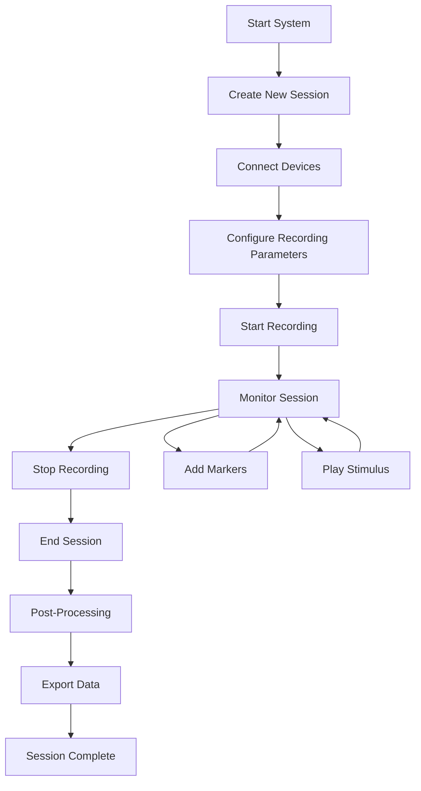

# Session Management and Data Storage - User Guide

## Overview

This guide provides step-by-step instructions for using the Session Management and Data Storage System in the Multi-Sensor Recording System. Whether you're conducting a single recording session or managing multiple experimental sessions, this guide will help you understand how to effectively organize, manage, and access your recorded data.

The session management system automatically organizes all your recordings into logical, timestamped folders with standardized naming conventions, making it easy to locate and analyze your data later.

## Pre-flight Checklist

Before starting any recording session, ensure the following prerequisites are met:

### System Requirements
- [ ] Multi-Sensor Recording System is installed and configured
- [ ] All devices (phones, webcams, sensors) are properly connected
- [ ] Sufficient disk space available (recommend 10GB+ per hour of recording)
- [ ] Network connections are stable for multi-device coordination
- [ ] Required permissions are granted for file system access

### Device Preparation
- [ ] Mobile devices have the companion app installed and updated
- [ ] Webcams are functional and properly positioned
- [ ] Shimmer GSR sensors are charged and paired
- [ ] Thermal cameras are connected and calibrated
- [ ] All devices are visible in the device management interface

### Data Storage Setup
- [ ] Base recordings directory is accessible and writable
- [ ] Backup storage is available if required
- [ ] Network storage is mounted if using shared storage
- [ ] Sufficient space for expected recording duration

## Session Management Workflow

The session management system guides you through a complete workflow from session creation to data export:



## Step-by-Step Session Guide

### Step 1: Creating a New Session

1. **Open the Multi-Sensor Recording System**
   - Launch the main application
   - Wait for system initialization to complete
   - Verify all components are loaded successfully

2. **Navigate to Session Management**
   - Click on "Session Manager" in the main interface
   - The session management panel will display current status

3. **Create a New Session**
   - Click the "New Session" button
   - **Option A - Default Naming**: Leave session name empty for automatic timestamp naming
     - Result: `session_20250731_143022`
   - **Option B - Custom Naming**: Enter a descriptive session name
     - Example input: "Experiment A Pilot Study"
     - Result: `Experiment_A_Pilot_Study_20250731_143022`

4. **Verify Session Creation**
   - Confirm session folder appears in recordings directory
   - Check that `session_metadata.json` file is created
   - Verify session status shows as "Active"

### Step 2: Device Connection and Management

1. **Connect Mobile Devices**
   - Ensure devices are on the same network
   - Open the companion app on each device
   - Tap "Connect to Session" in the mobile app
   - Verify device appears in the "Connected Devices" list
   - Note the device ID (e.g., `phone_1`, `phone_2`)

2. **Connect PC Webcams**
   - Check webcam availability in the "Device Manager"
   - Select desired webcams from the available list
   - Click "Add to Session" for each webcam
   - Test webcam functionality with preview window

3. **Connect Shimmer GSR Sensors** (if available)
   - Power on Shimmer devices
   - Use Bluetooth pairing interface
   - Verify sensor data streaming is active
   - Check signal quality indicators

4. **Verify All Devices**
   - Review the "Session Devices" panel
   - Confirm each device shows "Connected" status
   - Test device capabilities (camera preview, sensor data)
   - Resolve any connection issues before proceeding

### Step 3: Configure Recording Parameters

1. **Set Recording Quality**
   - **Video Quality**: Select resolution (recommended: 1920x1080)
   - **Frame Rate**: Choose frame rate (recommended: 30 fps)
   - **Audio Settings**: Enable/disable audio recording as needed

2. **Configure Device-Specific Settings**
   - **RGB Cameras**: Set exposure, white balance if needed
   - **Thermal Cameras**: Configure temperature range and palette
   - **GSR Sensors**: Set sampling rate (recommended: 128 Hz)

3. **Set File Naming Preferences**
   - Verify automatic naming conventions are acceptable
   - Enable/disable automatic post-processing options

### Step 4: Start and Monitor Recording

1. **Start Recording**
   - Click the "Start Recording" button
   - Observe countdown timer (3-2-1)
   - Verify all devices begin recording simultaneously
   - Check the session log for "start_record" events

2. **Monitor Session Status**
   - **Live Device Status**: Monitor connection status for all devices
   - **Recording Duration**: Track elapsed time
   - **Storage Usage**: Monitor available disk space
   - **Error Indicators**: Watch for any error notifications

3. **Real-time Session Log**
   ```
   14:30:22 - Session started. Devices: phone_1, webcam_1
   14:30:25 - Recording started on devices: phone_1, webcam_1
   14:30:45 - Device phone_1 acknowledged start_record
   14:31:10 - Marker 'stimulus_start' inserted
   ```

### Step 5: Interact During Recording

#### Adding Markers
Markers help you identify important moments in your recordings:

1. **Manual Markers**
   - Click "Add Marker" button during recording
   - Enter descriptive label (e.g., "stimulus_start", "subject_response")
   - Marker appears in session log with precise timestamp

2. **Stimulus-Triggered Markers**
   - Markers are automatically added when playing stimuli
   - Custom markers can be inserted for specific events

#### Playing Stimuli
The system supports synchronized stimulus presentation:

1. **Load Stimulus Media**
   - Click "Load Stimulus" button
   - Select media file (video, audio, image)
   - Preview stimulus before playing

2. **Play Stimulus**
   - Click "Play Stimulus" when ready
   - System automatically logs stimulus start/stop events
   - All connected devices receive synchronization signals

### Step 6: Stop Recording and End Session

1. **Stop Recording**
   - Click "Stop Recording" button when ready
   - Wait for all devices to confirm recording stop
   - Verify final file transfers are complete

2. **Review Session Summary**
   - Check recorded files in session summary
   - Verify expected file count and sizes
   - Review any error or warning messages

3. **End Session**
   - Click "End Session" button
   - Confirm session termination in dialog
   - Wait for final metadata updates

### Step 7: Access Your Recorded Data

Your data is automatically organized in a standardized structure:

```
recordings/experiment_A_pilot_study_20250731_143022/
├── 📄 session_metadata.json           # Complete session overview
├── 📄 session_20250731_143022_log.json # Detailed event timeline
├── 📁 devices/                        # Device-specific recordings
│   ├── 📁 phone_1/
│   │   ├── 📁 rgb_videos/
│   │   │   └── phone_1_rgb_20250731_143022.mp4
│   │   ├── 📁 thermal_videos/
│   │   │   └── phone_1_thermal_20250731_143022.mp4
│   │   └── 📁 sensor_data/
│   │       └── phone_1_gsr_20250731_143022.csv
│   └── 📁 phone_2/ (if multiple devices used)
├── 📁 webcam/
│   └── webcam_1_20250731_143022.mp4
├── 📁 processing/ (created during post-processing)
└── 📁 exports/ (created when exporting data)
```

## Understanding Your Data

### Session Metadata File
The `session_metadata.json` file contains complete information about your recording:

```json
{
  "session_id": "experiment_A_pilot_study_20250731_143022",
  "session_name": "Experiment A Pilot Study",
  "start_time": "2025-07-31T14:30:22.123456",
  "end_time": "2025-07-31T14:32:45.789012",
  "duration": 143.665556,
  "status": "completed",
  "devices": {
    "phone_1": {
      "device_type": "android_phone",
      "capabilities": ["rgb_video", "thermal_video", "gsr_data"],
      "status": "connected"
    },
    "webcam_1": {
      "device_type": "pc_webcam", 
      "capabilities": ["video_recording"],
      "status": "connected"
    }
  },
  "files": {
    "phone_1": [
      {
        "file_type": "rgb_video",
        "file_path": "devices/phone_1/rgb_videos/phone_1_rgb_20250731_143022.mp4",
        "file_size": 157286400,
        "created_time": "2025-07-31T14:32:45.001234"
      }
    ]
  }
}
```

### Session Event Log
The event log provides a detailed timeline of everything that happened:

```json
{
  "session": "experiment_A_pilot_study_20250731_143022",
  "events": [
    {
      "event": "session_start",
      "time": "14:30:22.123",
      "devices": ["phone_1", "webcam_1"]
    },
    {
      "event": "start_record",
      "time": "14:30:25.456",
      "devices": ["phone_1", "webcam_1"]
    },
    {
      "event": "marker",
      "time": "14:31:10.789",
      "label": "stimulus_start"
    },
    {
      "event": "stop_record",
      "time": "14:32:42.012"
    }
  ]
}
```

## Data Analysis and Export

### Quick Data Access

**Find all videos from your session:**
```bash
find recordings/experiment_A_pilot_study_20250731_143022/ -name "*.mp4"
```

**Find all sensor data:**
```bash
find recordings/experiment_A_pilot_study_20250731_143022/ -name "*.csv"
```

**Check file sizes:**
```bash
ls -lh recordings/experiment_A_pilot_study_20250731_143022/devices/*/rgb_videos/
```

### Post-Processing Options

The system offers automated post-processing workflows:

1. **Hand Segmentation Analysis**
   - Automatically detects and tracks hand movements
   - Creates cropped videos focused on hand regions
   - Generates segmentation masks for precise analysis
   - Results saved in `processing/hand_segmentation/`

2. **Multi-Device Synchronization**
   - Time-aligns data from all devices
   - Compensates for network latency and device clocks
   - Creates synchronized data packages
   - Results saved in `processing/synchronized_data/`

3. **Data Export**
   - CSV format for spreadsheet analysis
   - MATLAB format for advanced processing
   - Custom export formats available
   - Exports saved in `exports/` folder

### Triggering Post-Processing

Post-processing can be triggered manually or automatically:

1. **Automatic Post-Processing**
   - Enable in session settings before recording
   - Processing begins automatically after session ends
   - Monitor progress in the processing panel

2. **Manual Post-Processing**
   - Select completed session from session list
   - Click "Start Post-Processing" button
   - Choose processing modules to run
   - Monitor progress and review results

## Working with Multiple Sessions

### Session Management Best Practices

1. **Naming Conventions**
   - Use descriptive session names that include:
     - Experiment or study identifier
     - Participant information (if applicable)
     - Session type or condition
   - Example: `StressStudy_P001_Baseline`

2. **Session Organization**
   - Create separate sessions for different experimental conditions
   - Use consistent naming across related sessions
   - Document session purposes in a study log

3. **Data Management**
   - Regularly backup important sessions
   - Archive completed sessions to free up space
   - Maintain session documentation outside the system

### Batch Operations

The system supports operations across multiple sessions:

1. **Batch Post-Processing**
   - Select multiple completed sessions
   - Apply same processing workflow to all
   - Monitor batch progress in processing queue

2. **Batch Export**
   - Export multiple sessions in same format
   - Combine data from related sessions
   - Generate summary reports across sessions

## Troubleshooting Common Issues

### Session Creation Problems

**Issue: Cannot create new session**
- **Check**: Available disk space (need 1GB+ minimum)
- **Check**: Write permissions to recordings directory
- **Solution**: Free up space or change recordings directory

**Issue: Session name contains invalid characters**
- **Cause**: Special characters not allowed in folder names
- **Solution**: Use only letters, numbers, spaces, hyphens, and underscores

### Device Connection Issues

**Issue: Mobile device not appearing in device list**
- **Check**: Both devices on same network
- **Check**: Mobile app is updated to latest version
- **Solution**: Restart mobile app or reconnect to network

**Issue: Webcam not detected**
- **Check**: Webcam is connected and not used by other applications
- **Check**: Camera permissions are granted
- **Solution**: Close other applications using camera, restart system if needed

### Recording Problems

**Issue: Recording starts on some devices but not others**
- **Check**: All devices show "Connected" status before starting
- **Solution**: Wait for all devices to connect, restart failed devices

**Issue: Files missing after recording**
- **Check**: Session log for file transfer errors
- **Check**: Available storage space during recording
- **Solution**: Verify network connections, ensure adequate storage

### Data Access Issues

**Issue: Cannot find recorded files**
- **Location**: Check `recordings/[session_name]/` directory
- **Check**: Session completed successfully (status = "completed")
- **Solution**: Look in session metadata for actual file locations

**Issue: Video files won't play**
- **Check**: File size is not zero bytes
- **Try**: Different video player (VLC recommended)
- **Check**: Session log for recording errors

### Post-Processing Issues

**Issue: Hand segmentation not available**
- **Cause**: Hand segmentation module not installed
- **Solution**: Install computer vision dependencies
- **Workaround**: Use manual video analysis

**Issue: Post-processing fails**
- **Check**: Session contains expected video files
- **Check**: Available system memory and processing power
- **Solution**: Try processing smaller sessions first

## Advanced Features

### Custom Session Templates

Create reusable session configurations:

1. **Create Template**
   - Set up session with desired devices and settings
   - Save configuration as template
   - Name template for easy identification

2. **Use Template**
   - Select template when creating new session
   - Automatically applies saved settings
   - Customize as needed for specific session

### Session Recovery

The system can recover from unexpected shutdowns:

1. **Automatic Detection**
   - System detects incomplete sessions on startup
   - Prompts for recovery action

2. **Recovery Options**
   - **Continue Session**: Resume if devices still connected
   - **End Session**: Finalize with existing data
   - **Discard Session**: Remove incomplete session

### Integration with External Tools

Export data for use with external analysis tools:

1. **MATLAB Integration**
   - Export synchronized data in .mat format
   - Include timestamps and device metadata
   - Custom scripts for common analyses

2. **Python/R Integration**
   - Export CSV files with consistent formatting
   - JSON metadata for programmatic access
   - Example analysis scripts provided

## Getting Help

### Built-in Help Resources

1. **Session Status Panel**
   - Real-time status of all session components
   - Error messages with suggested solutions
   - Connection diagnostics for devices

2. **Event Log Viewer**
   - Detailed timeline of all session events
   - Filter by event type or time range
   - Export logs for technical support

### Documentation Resources

- **Quick Reference**: `docs/reference/data-storage-quick-reference.md`
- **Technical Details**: `docs/README_session_management.md`
- **API Documentation**: `docs/PROTOCOL_session_management.md`

### Support Channels

1. **Check Session Logs**: Review event logs for specific error messages
2. **Verify System Requirements**: Ensure all prerequisites are met
3. **Test with Minimal Setup**: Try single device before multi-device sessions
4. **Community Resources**: Access user forums and knowledge base

## Best Practices Summary

### Before Each Session
- [ ] Verify all devices are connected and functional
- [ ] Check available storage space
- [ ] Test recording with a short trial session
- [ ] Prepare stimulus materials if needed

### During Sessions
- [ ] Monitor device connections continuously
- [ ] Add meaningful markers at important events
- [ ] Watch for error notifications and respond promptly
- [ ] Keep sessions to reasonable lengths (< 2 hours recommended)

### After Sessions
- [ ] Verify all expected files are present
- [ ] Review session log for any errors
- [ ] Start post-processing if desired
- [ ] Backup important sessions
- [ ] Document session notes while memory is fresh

### Data Organization
- [ ] Use consistent naming conventions
- [ ] Organize related sessions in groups
- [ ] Maintain external documentation of experimental conditions
- [ ] Regular backup of critical data
- [ ] Archive old sessions to free up space

By following this user guide, you'll be able to effectively manage recording sessions and organize your multi-sensor data for successful analysis and research outcomes.