# Android App Architecture Diagram

## Current Architecture Overview

This diagram illustrates the current Android application architecture and highlights the identified design flaws.

```mermaid
graph TB
    subgraph "Main Application Layer"
        MA[MainActivity<br/>GOD CLASS<br/>1,410 lines, 80+ methods<br/>- Permissions<br/>- USB Handling<br/>- UI Updates<br/>- Recording<br/>- Calibration<br/>- Shimmer Integration<br/>- Sync Testing<br/>- Battery Monitoring]
        
        subgraph "Other Activities"
            NCA[NetworkConfigActivity]
            FVA[FileViewActivity]
            SCA[ShimmerConfigActivity]
            SA[SettingsActivity]
        end
        
        MVM[MainViewModel]
        RS[RecordingService]
    end
    
    subgraph "IRCamera Library - 🚨 OVER-MODULARIZED"
        subgraph "Thermal Components - 🚨 CODE DUPLICATION"
            TC1[thermal<br/>- GalleryActivity<br/>- ThermalFragment<br/>- GalleryAdapter<br/>- ThermalActionEvent]
            TC2[thermal-ir<br/>- IRGalleryDetail04Activity<br/>- GalleryAdapter<br/>- ThermalActionEvent<br/>- 99+ classes]
            TC3[thermal-hik]
            TC4[thermal-lite]
            TC5[thermal04]
            TC6[thermal07]
        end
        
        subgraph "Lib Modules"
            LA[libapp]
            LC[libcom]
            LH[libhik]
            LI[libir]
            LM[libmatrix]
            LME[libmenu]
            LU[libui]
        end
        
        subgraph "Component Modules"
            CC[CommonComponent]
            E3D[edit3d]
            H[house]
            P[pseudo]
            T[transfer]
            U[user]
        end
        
        subgraph "Other Modules"
            BM[BleModule]
            RSB[RangeSeekBar]
            CL[commonlibrary]
        end
    end
    
    subgraph "External Libraries"
        subgraph "Shimmer SDK - 🚨 MULTIPLE VERSIONS"
            SS1[shimmerandroidinstrumentdriver-3.2.3_beta.aar]
            SS2[shimmerbluetoothmanager-0.11.4_beta.jar]
            SS3[shimmerdriver-0.11.4_beta.jar]
            SS4[shimmerdriverpc-0.11.4_beta.jar]
        end
        
        subgraph "Topdon Thermal SDK"
            TS1[topdon_1.3.7.aar]
            TS2[libusbdualsdk_1.3.4.aar]
            TS3[opengl_1.3.2.aar]
            TS4[suplib-release.aar]
        end
    end
    
    subgraph "Android System - 🚨 EXCESSIVE PERMISSIONS"
        AP[Android Permissions<br/>98+ permissions requested<br/>- CALL_PHONE<br/>- READ_SMS<br/>- MANAGE_EXTERNAL_STORAGE<br/>- CAMERA<br/>- RECORD_AUDIO<br/>- BLUETOOTH<br/>- LOCATION<br/>- And many more...]
    end
    
    %% Main connections
    MA --> MVM
    MA --> RS
    MA --> NCA
    MA --> FVA
    MA --> SCA
    MA --> SA
    
    %% MainActivity directly accesses everything (God Class problem)
    MA -.->|Direct Access| TC1
    MA -.->|Direct Access| TC2
    MA -.->|Direct Access| SS1
    MA -.->|Direct Access| TS1
    MA -.->|Requests All| AP
    
    %% Duplication arrows
    TC1 -.->|Duplicated Code| TC2
    TC2 -.->|Duplicated Code| TC3
    TC3 -.->|Duplicated Code| TC4
    TC4 -.->|Duplicated Code| TC5
    TC5 -.->|Duplicated Code| TC6
    
    %% External dependencies
    MA --> SS1
    MA --> SS2
    MA --> SS3
    MA --> SS4
    MA --> TS1
    MA --> TS2
    MA --> TS3
    MA --> TS4
    
    %% Styling
    classDef problemClass fill:#ffcccc,stroke:#ff0000,stroke-width:3px
    classDef duplicateClass fill:#ffffcc,stroke:#ffaa00,stroke-width:2px
    classDef normalClass fill:#ccffcc,stroke:#00aa00,stroke-width:1px
    
    class MA problemClass
    class TC1,TC2,TC3,TC4,TC5,TC6 duplicateClass
    class AP problemClass
    class MVM,RS,NCA,FVA,SCA,SA normalClass
```

## Architecture Problems Visualization

## Recommended Architecture

## Key Improvements in Recommended Architecture

1. **Single Responsibility**: Each class has one clear purpose
2. **Clean Architecture**: Proper layer separation (Presentation → Domain → Data)
3. **Consolidated Modules**: Unified thermal module instead of 6 separate ones
4. **Essential Permissions**: Only request what's actually needed
5. **Testable Design**: Business logic separated from UI
6. **Maintainable Structure**: Clear dependencies and boundaries

## Migration Strategy

1. **Phase 1**: Remove excessive permissions, add TODO comments
2. **Phase 2**: Extract ViewModels and Use Cases from MainActivity
3. **Phase 3**: Consolidate thermal modules
4. **Phase 4**: Implement clean architecture layers
5. **Phase 5**: Add comprehensive testing