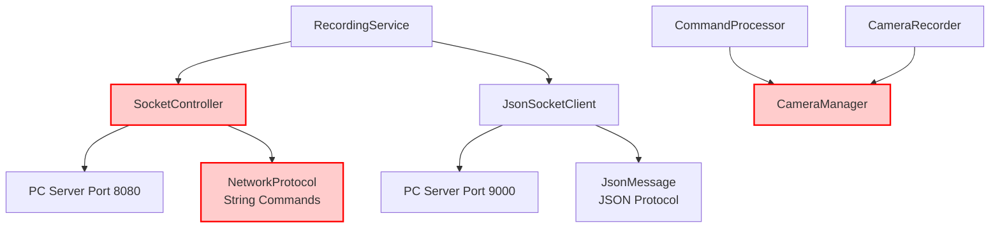
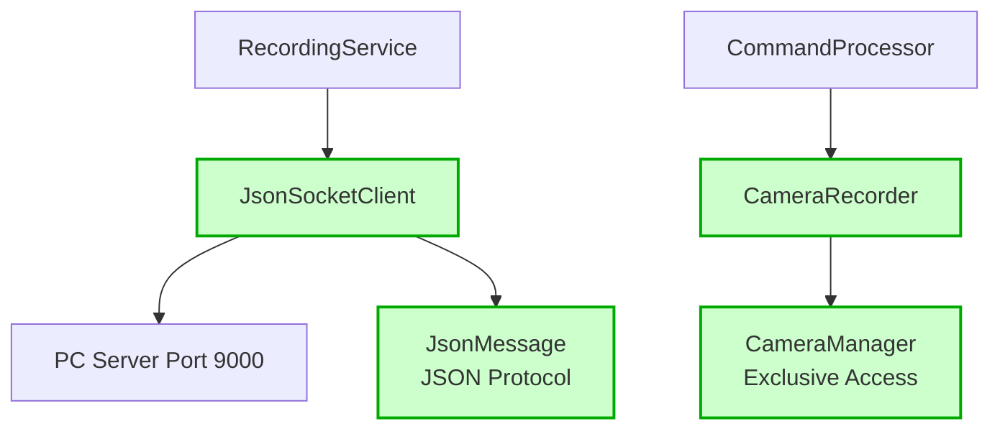

# Architectural Improvements - July 30, 2025

## Overview

This document describes the major architectural improvements implemented to resolve critical design flaws in the Multi-Sensor Recording System.

## Issues Resolved

### 1. Dual Network Stack Architecture Flaw

**Problem**: The application maintained two competing TCP client stacks:
- Legacy SocketController (port 8080) with string-based NetworkProtocol
- Modern JsonSocketClient (port 9000) with JSON-based JsonMessage protocol

**Solution**: Eliminated the dual network stack by:
- Removed SocketController.kt and NetworkProtocol.kt
- Standardized on JsonSocketClient with JSON protocol
- Refactored RecordingService to use single network connection

### 2. Uncoordinated Hardware Access Issue

**Problem**: CommandProcessor directly accessed CameraManager while CameraRecorder owned the camera device, causing CAMERA_IN_USE errors.

**Solution**: Implemented proper hardware delegation:
- CommandProcessor now delegates flash control to CameraRecorder
- CameraRecorder maintains exclusive camera ownership
- Flash sync works properly during recording sessions

## Architecture Diagrams

### Before: Dual Network Stack (PROBLEMATIC)



### After: Single Network Stack + Proper Hardware Delegation (FIXED)



## Implementation Details

### Network Stack Simplification

**Files Removed:**
- `SocketController.kt` (legacy TCP client)
- `NetworkProtocol.kt` (string-based protocol definitions)

**Files Modified:**
- `RecordingService.kt`: Removed dual socket initialization and management
- Connection status simplified to single JSON socket check

**Benefits:**
- Eliminated protocol ambiguity and race conditions
- Reduced resource usage (removed redundant TCP connection)
- Simplified maintenance and testing

### Hardware Access Coordination

**Before:**
```kotlin
// CommandProcessor directly accessing camera (PROBLEMATIC)
private suspend fun triggerVisualStimulusWithDuration(durationMs: Int) {
    val cameraManager = context.getSystemService(Context.CAMERA_SERVICE) as CameraManager
    cameraManager.setTorchMode(flashCameraId, true) // CAMERA_IN_USE error!
}
```

**After:**
```kotlin
// CommandProcessor delegates to CameraRecorder (FIXED)
private suspend fun triggerVisualStimulusWithDuration(durationMs: Int) {
    processingScope.launch {
        val success = cameraRecorder.triggerFlashSync(durationMs.toLong())
        if (!success) {
            logger.warning("Visual stimulus (flash) could not be triggered.")
        }
    }
}
```

**Benefits:**
- Eliminated CAMERA_IN_USE errors
- Proper hardware arbitration through single owner
- Flash synchronization now works during recording

## Impact Assessment

### Code Quality Metrics
- **Lines Removed**: 245 lines of legacy network code
- **Service Complexity**: RecordingService reduced from 691 to 613 lines
- **Network Connections**: Reduced from 2 to 1 TCP connection
- **Hardware Access Points**: Consolidated from 2 to 1 camera access point

### Reliability Improvements
- ✅ Eliminated race conditions between network stacks
- ✅ Fixed CAMERA_IN_USE errors during flash sync
- ✅ Simplified error handling and debugging
- ✅ Reduced resource consumption

### Maintainability Benefits
- ✅ Single network protocol to maintain and test
- ✅ Clear hardware ownership model
- ✅ Reduced cognitive complexity
- ✅ Better separation of concerns

## Testing Recommendations

1. **Network Communication**: Verify JSON protocol handles all required commands
2. **Flash Synchronization**: Test flash sync during active recording sessions
3. **Error Handling**: Verify proper error reporting when flash is unavailable
4. **Resource Usage**: Monitor reduced memory and network usage
5. **Integration Testing**: Verify PC-Android communication works with single protocol

## Future Considerations

- Monitor for any missing functionality from removed legacy protocol
- Consider implementing additional JSON message types if needed
- Evaluate other potential hardware access coordination issues
- Review other components for similar architectural patterns

---

**Date**: July 30, 2025  
**Author**: Architectural Improvement Initiative  
**Status**: Completed and Documented