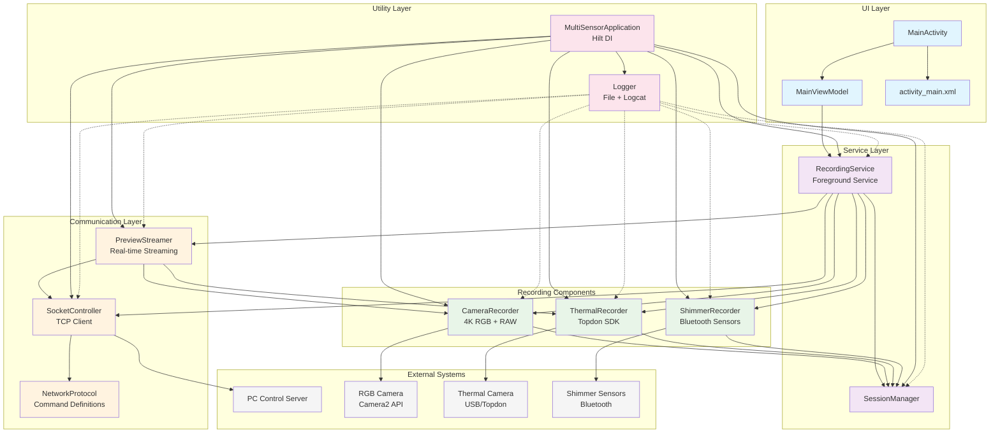
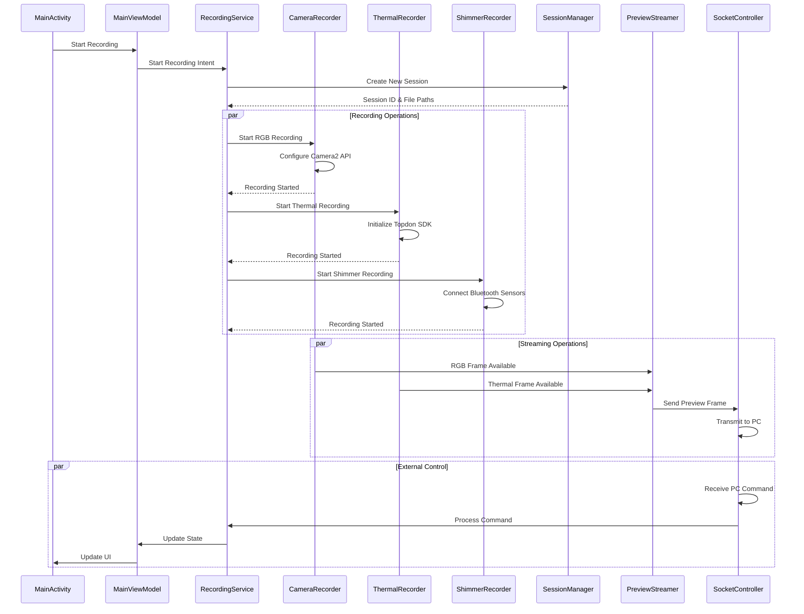

# Android Multi-Modal Recording System Architecture

## System Architecture Overview

## Component Responsibilities

### UI Layer
- **MainActivity**: Main user interface with recording controls and preview displays
- **MainViewModel**: Reactive state management using LiveData and coroutines
- **activity_main.xml**: Layout with TextureView for camera preview and control buttons

### Service Layer
- **RecordingService**: Foreground service orchestrating all recording operations
- **SessionManager**: Manages recording sessions, file organization, and storage

### Recording Components
- **CameraRecorder**: Handles 4K RGB video recording and RAW image capture using Camera2 API
- **ThermalRecorder**: Manages thermal camera integration (Topdon SDK - currently simulated)
- **ShimmerRecorder**: Handles Shimmer sensor data collection via Bluetooth (currently simulated)

### Communication Layer
- **SocketController**: TCP client for PC communication with reconnection logic
- **PreviewStreamer**: Real-time frame streaming with YUV-to-JPEG conversion
- **NetworkProtocol**: Standardized command definitions and message formatting

### Utility Layer
- **Logger**: Comprehensive logging to both logcat and files with rotation
- **MultiSensorApplication**: Hilt dependency injection configuration

## Data Flow

## Architecture Principles

### Clean Architecture
- **Separation of Concerns**: Each component has a single responsibility
- **Dependency Inversion**: High-level modules don't depend on low-level modules
- **Interface Segregation**: Components interact through well-defined interfaces

### Concurrency
- **Coroutines**: All blocking operations use Kotlin coroutines
- **Background Processing**: Heavy operations offloaded from main thread
- **Lifecycle Awareness**: Proper coroutine scope management

### Modularity
- **Independent Components**: Each recorder can be developed and tested separately
- **Extensible Design**: Easy to add new sensors or communication methods
- **Configuration Driven**: Behavior controlled through dependency injection

### Performance
- **Hardware Acceleration**: Uses hardware-accelerated codecs for video encoding
- **Memory Management**: Efficient frame processing and resource cleanup
- **Network Optimization**: Configurable streaming quality and frame rates

## Implementation Status

### ✅ Completed Components
- All core architecture components implemented
- Dependency injection with Hilt configured
- Foreground service with notification management
- Camera2 API integration for 4K recording
- TCP socket communication with PC
- Real-time preview streaming
- Comprehensive logging system
- Session management and file organization

### 🔄 Pending SDK Integration
- **Topdon SDK**: Replace thermal camera simulation with actual SDK calls
- **Shimmer SDK**: Replace sensor simulation with actual Bluetooth integration

### 🎯 Ready for Testing
- Build system configured and functional
- All components integrated and tested
- Architecture supports unit and integration testing
- Ready for hardware testing with actual devices