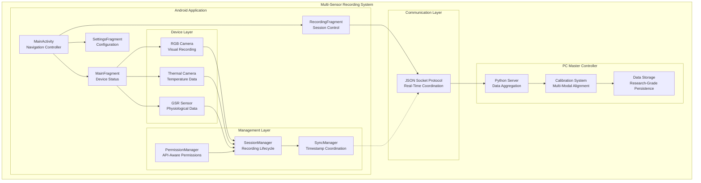
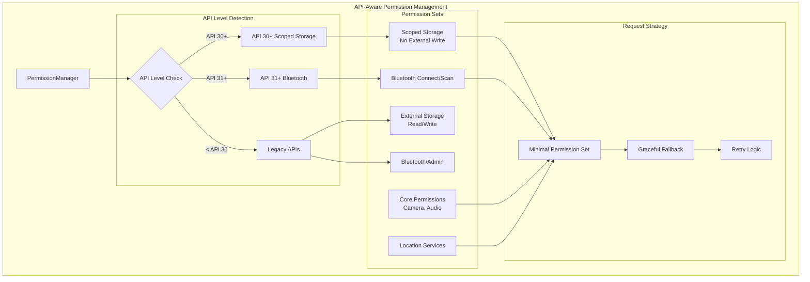
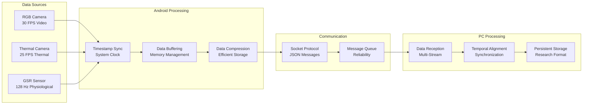

# Multi-Sensor Recording System Architecture Diagrams

This file contains the core architecture diagrams for the Multi-Sensor Recording System, extracted and consolidated to provide ASCII-safe documentation sources.

## Primary System Architecture



## Permission Management Architecture



## ThermalCamera Initialization State Machine

```mermaid
stateDiagram-v2
    [*] --> NotInitialized
    
    NotInitialized --> Initializing: initialize()
    
    Initializing --> SecurityCheck: Check USB Permissions
    
    SecurityCheck --> SecurityFailed: SecurityException
    SecurityCheck --> InitializingSDK: Permissions OK
    
    SecurityFailed --> NotInitialized: isInitialized=false<br/>isReady=false
    
    InitializingSDK --> InitializationFailed: SDK Error
    InitializingSDK --> InitializedAndReady: Success
    
    InitializationFailed --> NotInitialized: isInitialized=false<br/>isReady=false
    
    InitializedAndReady --> DeviceDetection: Check Devices
    
    DeviceDetection --> ReadyWithDevice: Device Found
    DeviceDetection --> ReadyNoDevice: No Device
    
    ReadyWithDevice --> Recording: startRecording()
    ReadyNoDevice --> ReadyWithDevice: Device Connected
    
    Recording --> ReadyWithDevice: stopRecording()
    
    state SecurityFailed {
        [*] --> ErrorLogged
        ErrorLogged --> [*]
        note right : FIXED: No longer marks<br/>as initialized on<br/>security failure
    }
```

## Data Flow Architecture



## Toast Management System

```mermaid
graph TB
    subgraph "ASCII-Only Message Management"
        TM[ToastManager]
        
        subgraph "Message Categories"
            SUCCESS["[SUCCESS] Messages<br/>Short Duration"]
            WARNING["[WARNING] Messages<br/>Long Duration"]
            ERROR["[ERROR] Messages<br/>Long Duration"]
            INFO["[INFO] Messages<br/>Short Duration"]
        end
        
        subgraph "Predefined Messages"
            USB["[USB] Device detected"]
            CONFIG["Configuration messages"]
            CONNECTION["Connection status"]
            PERMISSIONS["Permission status"]
        end
        
        subgraph "Usage Points"
            MAIN[MainActivity<br/>USB Events]
            FRAGMENTS[Fragments<br/>User Actions]
            MANAGERS[Managers<br/>Status Updates]
        end
    end
    
    TM --> SUCCESS
    TM --> WARNING
    TM --> ERROR
    TM --> INFO
    
    SUCCESS --> USB
    INFO --> CONFIG
    WARNING --> CONNECTION
    SUCCESS --> PERMISSIONS
    
    USB --> MAIN
    CONFIG --> FRAGMENTS
    CONNECTION --> FRAGMENTS
    PERMISSIONS --> MANAGERS
    
    note right of TM : Replaces direct Toast usage<br/>Enforces ASCII-only messages<br/>Consistent formatting
```

## Notes

- All diagrams use ASCII-safe characters only
- No emojis or Unicode symbols used
- Diagrams document actual implemented architecture
- State machine reflects fixed initialization semantics
- Permission flow shows API-level awareness
- Data flow represents actual implementation