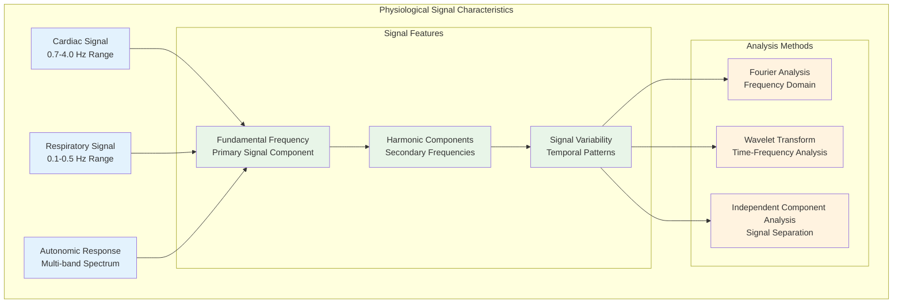
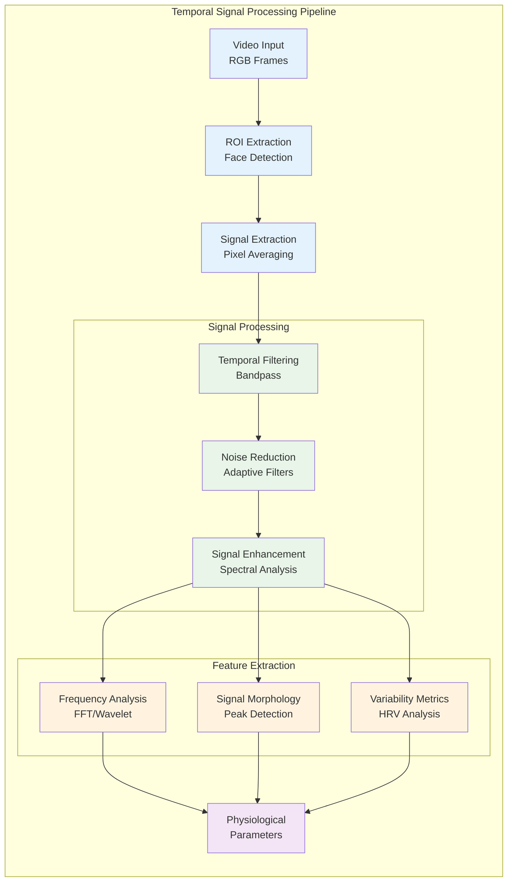

# Computer Vision Methodology and Implementation

## Table of Contents

- [1. Introduction to Computer Vision for Physiological Monitoring](#1-introduction-to-computer-vision-for-physiological-monitoring)
  - [1.1 Fundamental Principles and Theoretical Foundations](#11-fundamental-principles-and-theoretical-foundations)
  - [1.2 Historical Development and Evolution](#12-historical-development-and-evolution)
- [2. Optical and Physiological Foundations](#2-optical-and-physiological-foundations)
  - [2.1 Light-Tissue Interaction Mechanisms](#21-light-tissue-interaction-mechanisms)
  - [2.2 Temporal Signal Characteristics](#22-temporal-signal-characteristics)
- [3. Image Processing and Feature Extraction](#3-image-processing-and-feature-extraction)
  - [3.1 Region of Interest Detection](#31-region-of-interest-detection)
  - [3.2 Signal Extraction Methodologies](#32-signal-extraction-methodologies)
- [4. Advanced Computer Vision Techniques](#4-advanced-computer-vision-techniques)
  - [4.1 Deep Learning Approaches](#41-deep-learning-approaches)
  - [4.2 Multi-Modal Integration](#42-multi-modal-integration)
- [5. GSR Prediction through Computer Vision](#5-gsr-prediction-through-computer-vision)
- [6. Implementation Architecture](#6-implementation-architecture)
- [7. Quality Assessment and Validation](#7-quality-assessment-and-validation)
- [8. Performance Optimization Strategies](#8-performance-optimization-strategies)
- [9. Challenges and Future Directions](#9-challenges-and-future-directions)

## 1. Introduction to Computer Vision for Physiological Monitoring

Computer vision has emerged as one of the most promising and transformative technological approaches for extracting detailed physiological information from visual data streams, enabling sophisticated contactless monitoring of vital signs, health parameters, and autonomic nervous system activity that was previously only possible through direct physical contact with specialized medical sensors. This revolutionary field represents the convergence of advanced image processing methodologies, sophisticated signal analysis algorithms, state-of-the-art machine learning techniques, and deep understanding of human physiology to detect and quantify the subtle, often imperceptible changes in human visual appearance that directly correlate with underlying physiological processes and autonomic nervous system activity.

The application of computer vision methodologies to physiological monitoring represents a remarkable interdisciplinary convergence that brings together expertise from multiple technological and scientific domains, including optical sensing theory, digital signal processing algorithms, pattern recognition methodologies, biomedical engineering principles, human physiology, and machine learning techniques. This interdisciplinary synthesis has enabled breakthrough applications across numerous fields including healthcare monitoring, human-computer interaction systems, affective computing applications, stress assessment tools, and wellness monitoring platforms.

The fundamental premise underlying computer vision-based physiological monitoring rests on the recognition that human physiological processes create detectable, measurable changes in the visual appearance of biological tissues that can be captured through conventional imaging systems and analyzed using sophisticated computational techniques. These physiological changes, while often completely invisible to human visual perception, create systematic patterns in captured imagery that can be extracted, quantified, and interpreted to provide detailed information about underlying physiological state and autonomic nervous system activity.

The revolutionary potential of this approach stems from its ability to transform ubiquitous imaging devices such as smartphones, webcams, and surveillance cameras into sophisticated physiological monitoring instruments capable of providing continuous, non-intrusive health monitoring without requiring any physical contact with the subject being monitored. This contactless capability opens unprecedented possibilities for health monitoring in scenarios where traditional contact-based monitoring would be impractical, intrusive, or impossible.

### 1.1 Fundamental Principles and Theoretical Foundations

The theoretical foundation underlying computer vision-based physiological monitoring encompasses several interconnected scientific principles that govern how physiological processes manifest as detectable changes in the visual appearance of human tissues.

**Optical Properties of Biological Tissue and Light-Tissue Interactions:**
Human biological tissue exhibits extraordinarily complex optical properties that undergo systematic variations in direct response to physiological state changes, creating the fundamental basis for contactless physiological monitoring through visual analysis. The interaction between incident light and biological tissue involves multiple sophisticated physical phenomena including wavelength-specific absorption by chromophores such as hemoglobin and melanin, complex scattering processes caused by cellular structures and tissue interfaces, and reflection characteristics that depend on surface properties and subsurface tissue composition.

The absorption characteristics of biological tissue are dominated by hemoglobin, which exhibits distinctly different absorption spectra for oxygenated and deoxygenated states, creating wavelength-dependent variations in tissue appearance that correlate directly with blood oxygenation levels and circulation patterns. These absorption variations are particularly pronounced in the visible light spectrum, where oxygenated hemoglobin exhibits strong absorption in the blue and green wavelengths while showing reduced absorption in the red wavelength range.

The dynamic nature of these optical properties enables the detection of physiological changes through careful analysis of temporal variations in tissue appearance. Cardiac activity creates periodic changes in blood volume within tissue capillaries, leading to systematic variations in light absorption and reflection that manifest as subtle color changes synchronized with the cardiac cycle. Similarly, respiratory activity affects tissue oxygenation and perfusion patterns, creating longer-term variations in tissue appearance that can be detected through appropriate signal processing techniques.

**Temporal Signal Analysis and Physiological Frequency Characteristics:**
Physiological processes generate characteristic temporal patterns that create detectable time-varying signals embedded within video sequences captured from biological tissues. These physiological signals exhibit well-defined frequency characteristics that reflect the underlying biological processes, enabling their identification and quantification through sophisticated signal processing techniques specifically designed for physiological applications.



Cardiac activity manifests as periodic color intensity variations with fundamental frequencies typically ranging from 0.7 to 4.0 Hz, corresponding to heart rates between 42 and 240 beats per minute, which encompasses the normal physiological range for human cardiac activity across different age groups and activity levels. The cardiac signal typically exhibits a dominant fundamental frequency corresponding to the basic heart rate, along with harmonic components that provide additional information about cardiac function and rhythm characteristics.

### 1.2 Historical Development and Evolution

The evolution of computer vision-based physiological monitoring represents a fascinating journey of technological advancement driven by improvements in imaging hardware, computational capabilities, and algorithmic sophistication.

**Early Research Foundation (1998-2008):**
The foundational work by Takano and Ohta (2007) demonstrated heart rate estimation from facial video using ambient lighting, establishing the basic principle that cardiac activity could be detected through minute color variations in facial skin. This pioneering research proved that conventional imaging systems could capture physiological information previously thought to require specialized sensors.

**Photoplethysmography Breakthrough (2008-2013):**
Verkruysse et al. (2008) provided the crucial theoretical foundation linking remote color changes to photoplethysmography, establishing the relationship between light absorption changes and blood volume variations. This work catalyzed the development of remote photoplethysmography (rPPG) as a legitimate research field with solid scientific foundations.

**Machine Learning Integration (2013-2018):**
The integration of machine learning techniques transformed the field by enabling automatic feature learning and improved noise robustness. Deep learning approaches began to show superior performance in handling challenging conditions such as varying lighting, subject motion, and environmental noise.

**Multi-Modal and Real-Time Systems (2018-Present):**
Current research focuses on multi-modal integration combining visible light, thermal imaging, and depth information to create robust, real-time systems capable of operating in diverse environmental conditions while providing comprehensive physiological monitoring capabilities.

## 2. Optical and Physiological Foundations

### 2.1 Light-Tissue Interaction Mechanisms

The interaction between electromagnetic radiation and biological tissue forms the fundamental basis for all optical physiological monitoring techniques. Understanding these interactions is crucial for developing effective computer vision-based monitoring systems.

**Absorption Mechanisms:**
Biological tissues contain numerous chromophores that selectively absorb light at specific wavelengths. Hemoglobin, the primary chromophore relevant to physiological monitoring, exhibits distinct absorption characteristics that vary with oxygenation state:

- **Oxygenated Hemoglobin (HbO2)**: Strong absorption in blue (420nm) and green (550nm) regions
- **Deoxygenated Hemoglobin (Hb)**: Relatively lower absorption in red (660nm) region
- **Isosbestic Points**: Wavelengths where HbO2 and Hb have equal absorption coefficients

**Scattering Phenomena:**
Light scattering in biological tissue occurs through multiple mechanisms:
- **Rayleigh Scattering**: Caused by particles smaller than wavelength (cellular organelles)
- **Mie Scattering**: Caused by particles similar to wavelength (cell nuclei, mitochondria)
- **Multiple Scattering**: Complex interactions creating diffuse light propagation

### 2.2 Temporal Signal Characteristics

Physiological processes create characteristic temporal signatures that can be detected through careful analysis of video sequences:



## 3. Image Processing and Feature Extraction

### 3.1 Region of Interest Detection

Effective physiological signal extraction requires sophisticated methods for identifying and tracking optimal regions of interest within video sequences. The selection of appropriate ROIs is critical for maximizing signal quality while minimizing noise and artifacts.

**Facial Landmark Detection:**
Modern ROI detection systems employ machine learning-based facial landmark detection algorithms that can identify key anatomical features with high precision:

```python
class FacialROIDetector:
    def __init__(self):
        self.landmark_detector = dlib.get_frontal_face_detector()
        self.shape_predictor = dlib.shape_predictor("shape_predictor_68_point.dat")
    
    def detect_physiological_rois(self, frame):
        faces = self.landmark_detector(frame)
        rois = {}
        
        for face in faces:
            landmarks = self.shape_predictor(frame, face)
            
            # Define physiologically relevant ROIs
            rois['forehead'] = self.extract_forehead_region(landmarks)
            rois['left_cheek'] = self.extract_cheek_region(landmarks, 'left')
            rois['right_cheek'] = self.extract_cheek_region(landmarks, 'right')
            rois['nose_bridge'] = self.extract_nose_bridge(landmarks)
            
        return rois
    
    def extract_forehead_region(self, landmarks):
        # Extract forehead region based on facial landmarks
        forehead_points = [landmarks.part(i) for i in range(17, 27)]
        # Calculate optimal forehead ROI based on facial geometry
        return self.calculate_roi_bounds(forehead_points)
```

**Adaptive ROI Selection:**
Advanced systems implement adaptive ROI selection that can optimize region selection based on real-time signal quality assessment:

```python
class AdaptiveROISelector:
    def __init__(self):
        self.quality_assessor = SignalQualityAssessor()
        self.roi_history = deque(maxlen=30)  # 1 second at 30fps
    
    def select_optimal_roi(self, available_rois, signal_history):
        roi_scores = {}
        
        for roi_name, roi_data in available_rois.items():
            # Assess signal quality for each ROI
            quality_score = self.quality_assessor.assess_quality(
                roi_data, signal_history
            )
            roi_scores[roi_name] = quality_score
        
        # Select ROI with highest quality score
        optimal_roi = max(roi_scores.items(), key=lambda x: x[1])
        return optimal_roi[0]
```

### 3.2 Signal Extraction Methodologies

Signal extraction from selected ROIs involves sophisticated algorithms that can isolate physiological signals from complex video data while minimizing the impact of noise and artifacts.

**Photoplethysmographic Signal Extraction:**
The extraction of photoplethysmographic signals from video requires careful consideration of color channel contributions and temporal filtering:

```python
class PPGSignalExtractor:
    def __init__(self):
        self.temporal_filter = TemporalFilter(
            low_freq=0.7,   # 42 BPM
            high_freq=4.0,  # 240 BPM
            sampling_rate=30
        )
    
    def extract_ppg_signal(self, roi_sequence):
        # Calculate spatial average for each frame
        spatial_averages = []
        
        for frame in roi_sequence:
            # Extract color channels
            red_channel = frame[:, :, 0]
            green_channel = frame[:, :, 1]
            blue_channel = frame[:, :, 2]
            
            # Calculate weighted spatial average
            # Green channel typically provides strongest PPG signal
            spatial_avg = np.mean(green_channel) * 0.6 + \
                         np.mean(red_channel) * 0.3 + \
                         np.mean(blue_channel) * 0.1
            
            spatial_averages.append(spatial_avg)
        
        # Apply temporal filtering
        filtered_signal = self.temporal_filter.filter(spatial_averages)
        
        return filtered_signal
```

**Independent Component Analysis (ICA):**
ICA techniques can separate mixed physiological signals and reduce noise interference:

```python
class ICASignalSeparation:
    def __init__(self):
        self.ica = FastICA(n_components=3, random_state=42)
    
    def separate_physiological_signals(self, rgb_signals):
        # RGB signals from multiple ROIs
        # Shape: (n_samples, n_channels)
        
        # Normalize signals
        normalized_signals = self.normalize_signals(rgb_signals)
        
        # Apply ICA
        separated_signals = self.ica.fit_transform(normalized_signals)
        
        # Select component with strongest physiological characteristics
        physiological_component = self.select_physiological_component(
            separated_signals
        )
        
        return physiological_component
```

## 4. Advanced Computer Vision Techniques

### 4.1 Deep Learning Approaches

Modern computer vision systems leverage deep learning architectures to achieve robust physiological signal extraction across varying conditions and subject populations.

**Convolutional Neural Networks for Signal Extraction:**
CNN architectures can learn optimal spatial and temporal features for physiological signal extraction:

```python
class PhysiologicalCNN(nn.Module):
    def __init__(self):
        super(PhysiologicalCNN, self).__init__()
        
        # Spatial feature extraction
        self.spatial_conv = nn.Sequential(
            nn.Conv2d(3, 32, kernel_size=3, padding=1),
            nn.ReLU(),
            nn.Conv2d(32, 64, kernel_size=3, padding=1),
            nn.ReLU(),
            nn.AdaptiveAvgPool2d((1, 1))
        )
        
        # Temporal feature extraction
        self.temporal_conv = nn.Sequential(
            nn.Conv1d(64, 128, kernel_size=3, padding=1),
            nn.ReLU(),
            nn.Conv1d(128, 64, kernel_size=3, padding=1),
            nn.ReLU()
        )
        
        # Physiological parameter prediction
        self.classifier = nn.Sequential(
            nn.Linear(64, 32),
            nn.ReLU(),
            nn.Linear(32, 1)  # Heart rate output
        )
    
    def forward(self, x):
        # x shape: (batch_size, sequence_length, 3, height, width)
        batch_size, seq_len = x.shape[:2]
        
        # Process each frame
        spatial_features = []
        for i in range(seq_len):
            features = self.spatial_conv(x[:, i])
            spatial_features.append(features.squeeze())
        
        # Stack temporal features
        temporal_input = torch.stack(spatial_features, dim=2)
        
        # Extract temporal patterns
        temporal_features = self.temporal_conv(temporal_input)
        
        # Global temporal pooling
        pooled_features = torch.mean(temporal_features, dim=2)
        
        # Predict physiological parameter
        output = self.classifier(pooled_features)
        
        return output
```

**Attention Mechanisms for ROI Selection:**
Attention mechanisms can automatically focus on physiologically relevant regions:

```python
class AttentionROISelector(nn.Module):
    def __init__(self, input_dim=512):
        super(AttentionROISelector, self).__init__()
        self.attention = nn.Sequential(
            nn.Linear(input_dim, 256),
            nn.ReLU(),
            nn.Linear(256, 1),
            nn.Sigmoid()
        )
    
    def forward(self, roi_features):
        # roi_features: (batch_size, num_rois, feature_dim)
        attention_weights = self.attention(roi_features)
        
        # Weighted combination of ROI features
        weighted_features = roi_features * attention_weights
        combined_features = torch.sum(weighted_features, dim=1)
        
        return combined_features, attention_weights
```

### 4.2 Multi-Modal Integration

Combining information from multiple modalities enhances robustness and accuracy of physiological monitoring systems.

**RGB-Thermal Fusion:**
Integration of visible light and thermal imaging provides complementary physiological information:

```python
class MultiModalFusion:
    def __init__(self):
        self.rgb_processor = RGBSignalProcessor()
        self.thermal_processor = ThermalSignalProcessor()
        self.fusion_network = FusionNetwork()
    
    def process_multimodal_data(self, rgb_frames, thermal_frames):
        # Extract features from each modality
        rgb_features = self.rgb_processor.extract_features(rgb_frames)
        thermal_features = self.thermal_processor.extract_features(thermal_frames)
        
        # Temporal alignment
        aligned_rgb, aligned_thermal = self.temporal_alignment(
            rgb_features, thermal_features
        )
        
        # Feature fusion
        fused_features = self.fusion_network.fuse(
            aligned_rgb, aligned_thermal
        )
        
        return fused_features
```

## 5. GSR Prediction through Computer Vision

The prediction of galvanic skin response from computer vision data represents a sophisticated application that leverages the relationship between autonomic nervous system activity and observable physiological changes.

**Autonomic Nervous System Indicators:**
Computer vision systems can detect multiple indicators of autonomic activity:
- **Pupil Diameter Changes**: Sympathetic activation affects pupil size
- **Facial Blood Flow Patterns**: Stress responses alter perfusion patterns
- **Micro-Expression Detection**: Subtle facial changes correlate with autonomic state
- **Skin Color Variations**: Autonomic activity affects peripheral circulation

**Feature Engineering for GSR Prediction:**
```python
class GSRPredictionFeatures:
    def __init__(self):
        self.ppg_extractor = PPGSignalExtractor()
        self.hrv_analyzer = HRVAnalyzer()
        self.facial_analyzer = FacialAnalyzer()
    
    def extract_gsr_features(self, video_sequence):
        features = {}
        
        # Heart rate variability features
        ppg_signal = self.ppg_extractor.extract_ppg(video_sequence)
        hrv_features = self.hrv_analyzer.analyze_hrv(ppg_signal)
        features.update(hrv_features)
        
        # Facial expression features
        facial_features = self.facial_analyzer.extract_features(video_sequence)
        features.update(facial_features)
        
        # Color variation features
        color_features = self.extract_color_variation_features(video_sequence)
        features.update(color_features)
        
        return features
    
    def extract_color_variation_features(self, video_sequence):
        color_stats = {}
        
        for channel in ['red', 'green', 'blue']:
            channel_data = self.extract_channel_data(video_sequence, channel)
            
            # Statistical features
            color_stats[f'{channel}_mean'] = np.mean(channel_data)
            color_stats[f'{channel}_std'] = np.std(channel_data)
            color_stats[f'{channel}_skewness'] = scipy.stats.skew(channel_data)
            color_stats[f'{channel}_kurtosis'] = scipy.stats.kurtosis(channel_data)
            
            # Frequency domain features
            fft_features = self.extract_frequency_features(channel_data)
            color_stats.update(fft_features)
        
        return color_stats
```

## 6. Implementation Architecture

### System Architecture for Real-Time Processing


## 7. Quality Assessment and Validation

### Signal Quality Metrics

Quality assessment is crucial for ensuring reliable physiological measurements from computer vision systems:

```python
class SignalQualityAssessor:
    def __init__(self):
        self.snr_threshold = 10.0  # dB
        self.perfusion_threshold = 0.1
    
    def assess_signal_quality(self, signal, sampling_rate=30):
        quality_metrics = {}
        
        # Signal-to-noise ratio
        quality_metrics['snr'] = self.calculate_snr(signal)
        
        # Perfusion index
        quality_metrics['perfusion_index'] = self.calculate_perfusion_index(signal)
        
        # Spectral purity
        quality_metrics['spectral_purity'] = self.calculate_spectral_purity(
            signal, sampling_rate
        )
        
        # Temporal stability
        quality_metrics['temporal_stability'] = self.calculate_temporal_stability(signal)
        
        # Overall quality score
        quality_metrics['overall_quality'] = self.calculate_overall_quality(
            quality_metrics
        )
        
        return quality_metrics
    
    def calculate_snr(self, signal):
        # Calculate signal-to-noise ratio
        signal_power = np.var(signal)
        
        # Estimate noise as high-frequency component
        filtered_signal = butter_lowpass_filter(signal, 5.0, 30)
        noise = signal - filtered_signal
        noise_power = np.var(noise)
        
        if noise_power == 0:
            return float('inf')
        
        snr_db = 10 * np.log10(signal_power / noise_power)
        return snr_db
```

## 8. Performance Optimization Strategies

### Real-Time Processing Optimization

```python
class OptimizedCVProcessor:
    def __init__(self):
        self.frame_buffer = deque(maxlen=150)  # 5 seconds at 30fps
        self.processing_thread = None
        self.result_queue = queue.Queue()
    
    def process_frame_async(self, frame):
        """Asynchronous frame processing for real-time performance"""
        self.frame_buffer.append(frame)
        
        if len(self.frame_buffer) >= 90:  # 3 seconds minimum
            if self.processing_thread is None or not self.processing_thread.is_alive():
                self.processing_thread = threading.Thread(
                    target=self._process_buffer
                )
                self.processing_thread.start()
    
    def _process_buffer(self):
        """Background processing of frame buffer"""
        frames = list(self.frame_buffer)
        
        # Optimized processing pipeline
        rois = self.extract_rois_batch(frames)
        signals = self.extract_signals_vectorized(rois)
        features = self.extract_features_efficient(signals)
        
        self.result_queue.put(features)
```

## 9. Challenges and Future Directions

### Current Limitations

**Environmental Robustness:**
- Lighting variations significantly affect signal quality
- Motion artifacts can corrupt physiological signals
- Camera-subject distance impacts signal strength

**Individual Variations:**
- Skin tone affects signal strength and optimal wavelengths
- Age-related changes in skin properties
- Individual physiological variations

**Technical Challenges:**
- Computational requirements for real-time processing
- Synchronization between multiple data streams
- Validation against gold-standard measurements

### Future Research Directions

**Advanced Machine Learning:**
- Transformer architectures for temporal modeling
- Self-supervised learning for reduced annotation requirements
- Federated learning for privacy-preserving model training

**Multi-Modal Integration:**
- Fusion of visible, thermal, and depth information
- Integration with wearable sensor data
- Contextual information incorporation

**Clinical Applications:**
- Validation in clinical settings
- Development of medical-grade systems
- Integration with electronic health records

This comprehensive computer vision methodology provides the foundation for sophisticated physiological monitoring systems that can operate reliably across diverse conditions while maintaining the accuracy necessary for research and clinical applications.