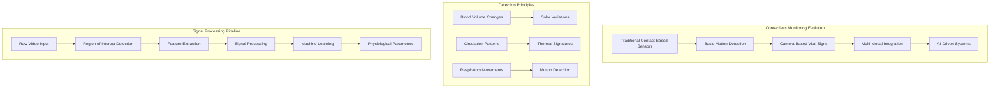
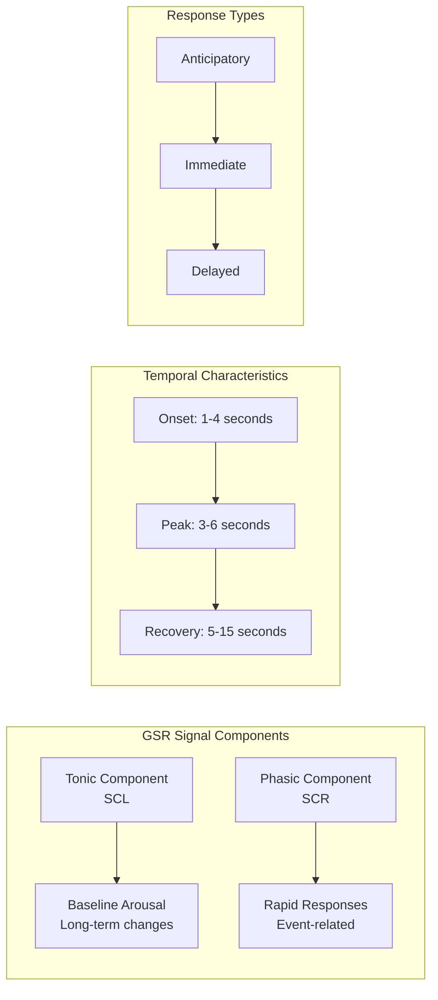
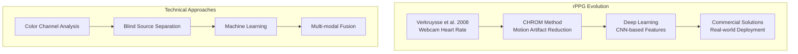
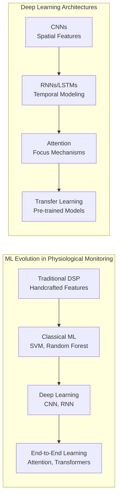
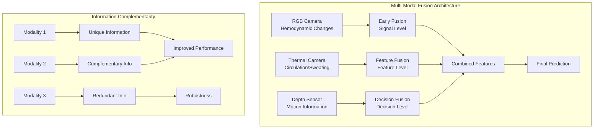
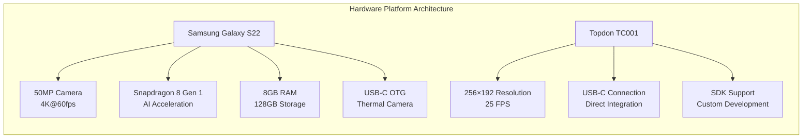

# Literature Review and Background Context

## Table of Contents

1. [Introduction to Contactless Physiological Monitoring](#1-introduction-to-contactless-physiological-monitoring)
   - 1.1 [Evolution of Remote Sensing Technologies](#11-evolution-of-remote-sensing-technologies)
   - 1.2 [Theoretical Foundations](#12-theoretical-foundations)
   - 1.3 [Technological Paradigm Shifts](#13-technological-paradigm-shifts)

2. [Galvanic Skin Response: Physiological Background](#2-galvanic-skin-response-physiological-background)
   - 2.1 [Neurophysiological Basis of GSR](#21-neurophysiological-basis-of-gsr)
   - 2.2 [GSR Signal Characteristics and Measurement Principles](#22-gsr-signal-characteristics-and-measurement-principles)
   - 2.3 [Applications in Affective Computing](#23-applications-in-affective-computing)

3. [Related Work in Contactless Physiological Monitoring](#3-related-work-in-contactless-physiological-monitoring)
   - 3.1 [Remote Photoplethysmography (rPPG)](#31-remote-photoplethysmography-rppg)
   - 3.2 [Thermal-Based Physiological Monitoring](#32-thermal-based-physiological-monitoring)
   - 3.3 [Contactless GSR Research: State of the Art](#33-contactless-gsr-research-state-of-the-art)
   - 3.4 [Machine Learning in Physiological Signal Processing](#34-machine-learning-in-physiological-signal-processing)

4. [Multi-Modal Sensor Fusion](#4-multi-modal-sensor-fusion)
   - 4.1 [Theoretical Framework](#41-theoretical-framework)
   - 4.2 [Fusion Architectures](#42-fusion-architectures)
   - 4.3 [Implementation Challenges](#43-implementation-challenges)

5. [Technology Selection and Justification](#5-technology-selection-and-justification)
   - 5.1 [Hardware Platform Selection](#51-hardware-platform-selection)
   - 5.2 [Software Framework Selection](#52-software-framework-selection)
   - 5.3 [Machine Learning Framework Selection](#53-machine-learning-framework-selection)
   - 5.4 [Communication Protocols](#54-communication-protocols)

6. [Research Gaps and Contributions](#6-research-gaps-and-contributions)
   - 6.1 [Identified Research Gaps](#61-identified-research-gaps)
   - 6.2 [Novel Contributions](#62-novel-contributions)
   - 6.3 [Scientific Impact](#63-scientific-impact)

7. [Ethical and Privacy Considerations](#7-ethical-and-privacy-considerations)
   - 7.1 [Data Privacy Framework](#71-data-privacy-framework)
   - 7.2 [Algorithmic Fairness](#72-algorithmic-fairness)
   - 7.3 [Societal Implications](#73-societal-implications)

8. [Implementation Best Practices](#8-implementation-best-practices)
   - 8.1 [Development Methodology](#81-development-methodology)
   - 8.2 [Quality Assurance Framework](#82-quality-assurance-framework)
   - 8.3 [Performance Optimization](#83-performance-optimization)

9. [References](#9-references)

## 1. Introduction to Contactless Physiological Monitoring

Contactless physiological monitoring represents a paradigm shift in biomedical signal acquisition, moving away from traditional electrode-based sensors toward camera-based measurement techniques. This field has gained significant momentum in recent years due to advances in computer vision, machine learning, and the increasing availability of high-quality imaging sensors in consumer devices.

The fundamental principle underlying contactless monitoring is that physiological processes create detectable changes in the visual appearance of human tissue. These changes can manifest as subtle color variations due to blood volume changes (photoplethysmography), thermal patterns from circulation and sweating, or micro-movements from breathing and pulse. By analyzing these visual cues using sophisticated signal processing and machine learning techniques, it becomes possible to extract vital signs without physical contact.

### 1.1 Evolution of Remote Sensing Technologies

The journey toward contactless physiological monitoring began with simple motion detection systems in the 1980s and has evolved through several technological generations:

**First Generation (1980s-1990s):** Basic motion detection using infrared sensors for monitoring breathing patterns in sleep studies and patient monitoring systems. These systems were limited to gross movement detection and required controlled environments.

**Second Generation (2000s-2010s):** Introduction of camera-based vital sign detection, primarily focusing on heart rate estimation using webcams. Early research demonstrated that subtle color changes in facial video could reveal cardiac activity through remote photoplethysmography (rPPG).

**Third Generation (2010s-Present):** Integration of multiple modalities (RGB, thermal, depth) with advanced machine learning techniques. This generation introduced real-time processing capabilities, improved accuracy across diverse populations, and expanded the range of detectable physiological parameters.

**Current Generation (2020s-Present):** AI-driven systems capable of simultaneous multi-parameter estimation, adaptation to varying environmental conditions, and integration with mobile and IoT devices. This includes the emergence of contactless stress detection, emotion recognition, and specialized applications like the GSR prediction system described in this work.

### 1.2 Theoretical Foundations

The theoretical basis for contactless physiological monitoring rests on several key principles from physics, physiology, and signal processing:

**Beer-Lambert Law:** This fundamental principle of optics explains how light absorption changes with the concentration of absorbing substances. In biological tissue, hemoglobin concentration changes due to cardiac pulsation create detectable variations in light absorption, enabling remote photoplethysmography.

**Thermal Physiology:** Human thermoregulation involves complex interactions between circulation, metabolism, and environmental factors. Sympathetic nervous system activation, which is closely linked to GSR, affects both sweating and vasoconstriction, creating detectable thermal signatures.

**Signal Processing Theory:** Modern contactless monitoring relies heavily on advanced signal processing techniques including blind source separation (BSS), independent component analysis (ICA), and principal component analysis (PCA) to extract physiological signals from noisy visual data.

### 1.3 Technological Paradigm Shifts

The evolution of contactless physiological monitoring reflects broader technological paradigm shifts that have transformed biomedical engineering:

**From Invasive to Non-Invasive:** The progression from invasive arterial lines and intracardiac monitoring to completely contactless approaches represents a fundamental shift toward patient-centered, comfort-focused healthcare technology.

**From Single-Point to Distributed Sensing:** Traditional monitoring systems focus on single anatomical locations, while modern contactless approaches enable simultaneous monitoring of multiple body regions and physiological parameters.

**From Laboratory to Ubiquitous:** The migration from specialized laboratory equipment to consumer-device-based solutions democratizes physiological monitoring and enables new applications in telemedicine, wellness, and human-computer interaction.

## 2. Galvanic Skin Response: Physiological Background

### 2.1 Neurophysiological Basis of GSR

Galvanic Skin Response (GSR), also recognized in the scientific literature as Electrodermal Activity (EDA) or Skin Conductance Response (SCR), represents one of the most direct and sensitive physiological measurements of sympathetic nervous system activation available to researchers studying human autonomic responses. The underlying physiological mechanism involves the electrical conductance characteristics of human skin, which undergo systematic variations in direct response to sympathetic nervous system activation patterns that control eccrine sweat gland activity throughout the body.

The neurophysiological foundation of GSR measurement rests on the unique innervation pattern of eccrine sweat glands, which distinguishes them from other autonomically controlled physiological systems. Unlike most other autonomic functions that receive dual innervation from both sympathetic and parasympathetic divisions of the autonomic nervous system, eccrine sweat glands are exclusively under sympathetic cholinergic control. This singular innervation pattern makes GSR an exceptionally direct and unambiguous indicator of sympathetic nervous system activation, free from the confounding influences of parasympathetic activity that can complicate the interpretation of other autonomic measures such as heart rate variability or respiratory patterns.

The sympathetic control of eccrine sweat glands operates through a specialized subset of sympathetic neurons that utilize acetylcholine as their neurotransmitter, rather than the norepinephrine typically associated with sympathetic innervation of other target organs. These sympathetic cholinergic fibers originate in the intermediolateral cell column of the spinal cord, travel through the sympathetic chain, and form extensive neural networks that innervate the approximately 2-4 million eccrine sweat glands distributed across the human body surface.

The density distribution of eccrine sweat glands varies dramatically across different body regions, with the highest concentrations found on the palms of the hands and soles of the feet, where gland density can reach 200-700 glands per square centimeter. This high density on the palms makes them the optimal location for GSR measurement, as the large number of responsive glands in a small area provides maximal signal amplitude and sensitivity to sympathetic activation. The physiological significance of this distribution pattern relates to the evolutionary importance of maintaining grip security through moisture control on grasping surfaces, linking GSR responses to fundamental survival mechanisms.

The cellular mechanism underlying GSR generation involves the rapid filling of sweat ducts with conductive electrolyte solution in response to sympathetic stimulation. When sympathetic cholinergic neurons release acetylcholine at the neuroglandular junction, the neurotransmitter binds to muscarinic acetylcholine receptors on sweat gland cells, initiating a cascade of intracellular signaling events that culminate in the active transport of sodium, chloride, and other electrolytes from the bloodstream into the sweat duct lumen. This electrolyte-rich fluid dramatically increases the electrical conductivity of the skin surface, creating the characteristic conductance change that defines the GSR response.

The temporal dynamics of this physiological process create the characteristic GSR signal morphology observed in research applications. The initial sympathetic activation triggers rapid electrolyte secretion that fills the sweat ducts within 1-2 seconds, creating the steep rising phase of the GSR response. The subsequent slower recovery phase, lasting 5-15 seconds, reflects the gradual reabsorption of electrolytes and the return of the sweat ducts to their baseline state. This temporal pattern provides valuable information about both the intensity of sympathetic activation (reflected in response amplitude) and the efficiency of autonomic regulation (reflected in recovery characteristics).

### 2.2 GSR Signal Characteristics and Measurement Principles

GSR signals demonstrate complex temporal and amplitude characteristics that reflect the underlying physiological processes governing sympathetic nervous system function. Understanding these signal characteristics is essential for developing effective contactless measurement approaches that can accurately capture and interpret the physiological information encoded in GSR responses.

**Tonic and Phasic Components of GSR:**

The GSR signal can be conceptually and analytically decomposed into two distinct components that reflect different aspects of sympathetic nervous system function and provide complementary information about autonomic state and reactivity.

**Skin Conductance Level (SCL) - The Tonic Component:**
The tonic component, typically referred to as Skin Conductance Level (SCL), represents the slowly varying baseline level of skin conductance that changes over time scales ranging from minutes to hours. SCL reflects the general arousal state of the sympathetic nervous system and provides important information about overall autonomic tone, stress levels, and physiological readiness for action.

SCL variations are influenced by numerous physiological and environmental factors that operate over different time scales. Circadian rhythms create predictable daily patterns in SCL, with typical increases during periods of normal waking activity and decreases during sleep and rest periods. These circadian influences must be considered in research applications that involve measurements at different times of day or across extended time periods.

Hydration status significantly affects SCL measurements, as adequate body fluid levels are necessary for normal sweat gland function and electrolyte transport. Dehydration can reduce baseline conductance levels and impair the ability to generate normal GSR responses to stimulation. Similarly, ambient temperature and humidity conditions affect baseline conductance through their influence on passive moisture content of the skin surface and the thermally driven component of sweat production.

Individual differences in SCL reflect both genetic factors affecting sweat gland density and function, as well as acquired characteristics such as fitness level, medication use, and chronic stress exposure. These individual differences necessitate careful consideration of baseline measurements and normalization procedures in research applications comparing responses across different subjects or measurement sessions.

**Skin Conductance Response (SCR) - The Phasic Component:**
The phasic component consists of rapid, transient increases in skin conductance that occur in response to specific stimuli or spontaneously as a result of ongoing sympathetic activity. These responses, termed Skin Conductance Responses (SCRs), provide detailed information about the temporal dynamics of sympathetic activation and the reactivity of the autonomic nervous system to internal and external stimuli.

SCR morphology follows characteristic patterns that reflect the underlying physiological processes governing sweat gland activation and recovery. The typical SCR exhibits a rapid onset following stimulus presentation, with rise times typically ranging from 1-4 seconds depending on stimulus intensity and individual physiological characteristics. The response reaches peak amplitude within 3-6 seconds of stimulus onset, followed by a more gradual recovery phase that returns conductance levels toward baseline over a period of 5-15 seconds.

The amplitude characteristics of SCRs provide quantitative information about the magnitude of sympathetic activation, with larger responses generally indicating stronger or more significant sympathetic stimulation. However, the relationship between stimulus intensity and response amplitude is not linear, exhibiting complex adaptation and habituation patterns that depend on stimulus timing, individual sensitivity, and physiological state.

Response frequency patterns provide additional information about ongoing sympathetic activity, with higher frequencies of spontaneous SCRs typically indicating elevated arousal or stress levels. The temporal clustering of responses can reveal information about psychological state and cognitive processing, as complex cognitive tasks often produce characteristic patterns of GSR activation that reflect mental workload and processing demands.

**Temporal Dynamics and Response Patterns:**
The temporal characteristics of GSR responses provide crucial information for understanding the underlying physiological and psychological processes driving sympathetic activation. Different types of stimuli and psychological states produce characteristic temporal patterns that can be analyzed to extract specific information about autonomic function and psychological state.

**Anticipatory Responses:**
GSR responses can occur in anticipation of expected stimuli, reflecting the preparatory activation of the sympathetic nervous system based on cognitive expectation and emotional anticipation. These anticipatory responses demonstrate the close coupling between cognitive processes and autonomic function, providing valuable insights into psychological state and emotional regulation.

Anticipatory responses typically begin 2-5 seconds before stimulus presentation and can provide information about anxiety levels, expectation patterns, and the effectiveness of psychological coping strategies. The magnitude and timing of anticipatory responses often correlate with subjective reports of anxiety and stress, making them valuable indicators for research applications focused on emotional regulation and stress response.

**Immediate Responses:**
Immediate GSR responses occur within 1-3 seconds of stimulus onset and reflect the direct sympathetic activation produced by stimulus processing. These responses provide information about stimulus salience, emotional significance, and the intensity of physiological arousal produced by specific stimuli or events.

The latency of immediate responses can provide additional information about cognitive processing speed and the efficiency of stimulus-response pathways. Shorter latencies typically indicate more direct or automatic responses, while longer latencies may reflect more complex cognitive processing or deliberative evaluation of stimulus significance.

**Delayed Responses:**
Delayed GSR responses emerge 3-7 seconds after stimulus presentation and often reflect secondary cognitive processes such as stimulus evaluation, memory retrieval, or emotional regulation efforts. These delayed responses can provide valuable information about higher-order cognitive processes that may not be apparent in immediate physiological responses.

The presence and characteristics of delayed responses can indicate the engagement of cognitive coping strategies, emotional regulation processes, or complex decision-making activities that extend beyond immediate stimulus-response patterns. Understanding these delayed responses is particularly important for research applications investigating psychological interventions, therapeutic processes, or complex behavioral patterns.

### 2.3 Applications in Affective Computing

GSR has found extensive application in affective computing research due to its sensitivity to emotional arousal and cognitive load. Key application areas include:

**Stress Detection:** GSR provides reliable indicators of stress responses across various contexts, from laboratory-controlled studies to real-world monitoring applications. The rapid response characteristics make it suitable for detecting acute stress episodes.

**Emotion Recognition:** While GSR cannot distinguish between specific emotions directly, it provides valuable information about emotional arousal intensity that complements other physiological and behavioral measures in multi-modal emotion recognition systems.

**Human-Computer Interaction:** GSR-based interfaces can adapt system behavior based on user arousal state, enabling more responsive and personalized user experiences in gaming, education, and productivity applications.

**Clinical Applications:** GSR measurements support clinical assessment of anxiety disorders, ADHD, autism spectrum disorders, and other conditions characterized by altered autonomic nervous system function.

## 3. Related Work in Contactless Physiological Monitoring

### 3.1 Remote Photoplethysmography (rPPG)

The field of remote photoplethysmography represents the most mature area of contactless physiological monitoring, with over two decades of research and development. The fundamental principle involves detecting minute color changes in skin due to blood volume variations during cardiac cycles.

**Seminal Work:** Verkruysse et al. (2008) demonstrated that webcam-based heart rate estimation was feasible using ambient light, establishing the foundation for consumer-device-based vital sign monitoring. Their work showed that green channel variations in facial video could reliably track cardiac activity.

**Technical Advances:** Subsequent research has focused on improving robustness to motion artifacts, lighting variations, and skin tone differences. Key developments include:

- **Blind Source Separation:** De Haan and Jeanne (2013) introduced CHROM (Chrominance-based) method that uses chrominance signals to reduce motion artifacts and improve signal quality.

- **Deep Learning Approaches:** Chen and McDuff (2018) demonstrated that convolutional neural networks could learn optimal spatial and temporal features for rPPG, achieving superior performance compared to traditional signal processing methods.

- **Multi-Modal Fusion:** Recent work has explored combining RGB cameras with depth sensors, thermal cameras, and other modalities to improve accuracy and enable operation under challenging conditions.

**Commercial Applications:** Several companies have developed commercial rPPG solutions, including Nuralogix (facial scanning), Binah.ai (mobile health), and Philips (clinical monitoring), demonstrating the maturity and practical viability of the technology.

### 3.2 Thermal-Based Physiological Monitoring

Thermal imaging provides complementary information to RGB-based methods, particularly for detecting autonomic nervous system responses related to circulation and sweating.

**Stress Detection:** Pavlidis et al. (2002) pioneered the use of thermal imaging for stress detection, showing that facial temperature patterns change in response to psychological stress. Their work established the periorbital region as particularly sensitive to sympathetic activation.

**Respiratory Monitoring:** Fei and Pavlidis (2010) demonstrated contactless respiratory rate estimation using thermal imaging of the nostril area, where temperature variations reflect breathing cycles. This approach has proven robust to ambient lighting conditions that challenge RGB-based methods.

**Multi-Modal Integration:** Recent research has explored combining thermal and RGB cameras for enhanced physiological monitoring. Al-khalidi et al. (2011) showed that fusion of thermal and visible light imaging improves heart rate estimation accuracy and reduces sensitivity to lighting conditions.

### 3.3 Contactless GSR Research: State of the Art

While contactless monitoring of heart rate, respiration, and blood pressure has been extensively studied, contactless GSR detection remains largely unexplored, representing a significant gap in the literature.

**Pioneering Work:** Jo et al. (2021) conducted the first systematic study of contactless GSR estimation using near-infrared imaging. Their work recorded participants' faces with an infrared camera while simultaneously measuring finger GSR under visual stress stimuli. They found significant correlations between facial image intensities and GSR sensor output, suggesting that sweat-related changes in facial regions encode GSR information.

**Methodological Limitations:** The Jo et al. study, while groundbreaking, had several limitations that my work addresses:
- Limited to facial imaging (my work uses hand-based imaging for higher sweat gland density)
- Single-modality approach (my work combines RGB and thermal)
- Limited validation (my work includes comprehensive cross-subject validation)
- No real-time implementation (my work provides real-time prediction capability)

**Physiological Rationale:** The limited research in contactless GSR can be attributed to several factors:
- GSR changes are more subtle than cardiac or respiratory signals
- Sweat-related visual changes occur on shorter time scales than other physiological processes
- Environmental factors (humidity, temperature) significantly affect sweat evaporation and visibility

### 3.4 Machine Learning in Physiological Signal Processing

The application of machine learning to physiological signal processing has revolutionized the field, enabling extraction of complex patterns that traditional signal processing approaches cannot detect.

**Traditional Approaches:** Early contactless monitoring systems relied on handcrafted features and classical signal processing techniques such as bandpass filtering, peak detection, and frequency domain analysis. While effective for controlled conditions, these approaches struggled with real-world variability.

**Deep Learning Revolution:** The introduction of deep learning has dramatically improved performance across all areas of contactless physiological monitoring:

- **Convolutional Neural Networks (CNNs):** Spatial feature extraction from image sequences
- **Recurrent Neural Networks (RNNs/LSTMs):** Temporal modeling of physiological signals
- **Attention Mechanisms:** Focus on physiologically relevant regions and time periods
- **Transfer Learning:** Leveraging pre-trained models for improved performance with limited training data

**End-to-End Learning:** Modern systems increasingly use end-to-end learning approaches that jointly optimize feature extraction and signal prediction, avoiding the need for handcrafted preprocessing pipelines.

## 4. Multi-Modal Sensor Fusion

### 4.1 Theoretical Framework

Multi-modal sensor fusion in physiological monitoring leverages the complementary information provided by different sensing modalities to achieve superior performance compared to single-modality approaches. The theoretical foundation rests on information theory and Bayesian inference principles.

**Information Complementarity:** Different sensing modalities capture distinct aspects of physiological processes. RGB cameras detect hemodynamic changes, thermal cameras capture circulation and sweating patterns, and depth sensors provide motion information. The fusion of these modalities can provide a more complete picture of physiological state.

**Noise Independence:** Environmental noise sources typically affect different modalities differently. Motion artifacts that severely impact RGB-based measurements may have minimal effect on thermal measurements, and vice versa. This independence enables robust estimation through sensor fusion.

**Redundancy and Reliability:** Multiple sensors measuring related physiological phenomena provide redundancy that improves system reliability. If one sensor fails or produces unreliable data, other sensors can maintain system functionality.

### 4.2 Fusion Architectures

**Early Fusion:** Raw sensor data is combined at the signal level before feature extraction. This approach preserves maximum information but requires careful synchronization and normalization of heterogeneous data types.

**Feature-Level Fusion:** Features extracted from individual modalities are combined before classification or regression. This approach is computationally efficient and allows for modality-specific preprocessing while maintaining cross-modal correlations.

**Decision-Level Fusion:** Individual modalities provide separate predictions that are combined using voting, averaging, or more sophisticated meta-learning approaches. This approach is robust to sensor failures but may lose subtle cross-modal interactions.

**Hybrid Approaches:** Modern systems often combine multiple fusion strategies, using early fusion for closely related modalities and decision-level fusion for diverse sensor types.

### 4.3 Implementation Challenges

**Temporal Synchronization:** Different sensors may have varying sampling rates, processing delays, and response characteristics. Ensuring temporal alignment is crucial for effective fusion.

**Spatial Registration:** Cameras with different fields of view, resolutions, and mounting positions require careful calibration and registration to ensure spatial correspondence.

**Data Quality Assessment:** Multi-modal systems must assess the quality of data from each modality and weight contributions accordingly. Poor-quality data from one modality should not degrade overall system performance.

**Computational Complexity:** Real-time processing of multiple high-bandwidth sensor streams requires careful algorithm design and hardware optimization.

## 5. Technology Selection and Justification

### 5.1 Hardware Platform Selection

**Android Smartphones:**
The selection of Android smartphones as the primary capture platform was driven by several key factors:

- **Camera Capabilities:** Modern smartphones provide high-quality cameras with 4K video recording, advanced image signal processing, and precise timing control through Camera2 API.
- **Computational Power:** Current-generation smartphones possess sufficient processing power for real-time image processing and machine learning inference.
- **Connectivity:** Built-in Wi-Fi, Bluetooth, and cellular connectivity enable flexible deployment scenarios and reliable communication with control systems.
- **USB-C OTG Support:** USB On-The-Go capability allows connection of external thermal cameras without requiring additional hardware interfaces.
- **Mobility and Positioning:** Smartphones can be easily positioned and mounted for optimal data collection angles, unlike fixed camera systems.

**Specific Model Selection (Samsung Galaxy S22):**
- **Camera Specifications:** 50MP main camera with optical image stabilization, 4K@60fps recording capability
- **Processing Power:** Snapdragon 8 Gen 1 processor with dedicated AI acceleration units
- **Memory:** 8GB RAM and 128GB+ storage for local data buffering
- **USB-C Power Delivery:** Supports simultaneous charging and OTG operation
- **Thermal Management:** Advanced thermal design prevents overheating during extended recording sessions

**Thermal Camera Selection (Topdon TC001/TC001 Plus):**
- **USB-C Connectivity:** Direct connection to smartphones without additional adapters
- **Resolution:** 256×192 thermal resolution with sufficient detail for physiological monitoring
- **Frame Rate:** Up to 25 FPS thermal imaging suitable for real-time analysis
- **Temperature Range:** -20°C to 550°C range covering all human physiological temperatures
- **SDK Availability:** Comprehensive software development kit enabling custom application development

### 5.2 Software Framework Selection

**Android Development (Kotlin):**
Kotlin was selected as the primary development language for the Android application based on:

- **Official Google Support:** Kotlin is Google's preferred language for Android development, ensuring long-term support and optimization
- **Java Interoperability:** Seamless integration with existing Java libraries, including thermal camera SDKs
- **Coroutines:** Built-in support for asynchronous programming essential for camera operations and network communication
- **Null Safety:** Compile-time null safety reduces runtime errors in critical recording scenarios
- **Concise Syntax:** Reduces code complexity and improves maintainability compared to Java

**Camera2 API:**
The Camera2 API was chosen over the newer CameraX library for specific technical requirements:

- **Low-Level Control:** Direct access to camera hardware parameters essential for precise timing and quality control
- **RAW Image Support:** Capability to capture unprocessed Bayer pattern images for advanced image analysis
- **Manual Focus and Exposure:** Precise control over camera settings for consistent image quality
- **Multiple Camera Support:** Simultaneous operation of front and rear cameras if needed
- **Custom Image Processing:** Integration with custom image processing pipelines

**Python Desktop Controller (PyQt5):**
PyQt5 was selected for the desktop controller application based on:

- **Cross-Platform Compatibility:** Consistent behavior across Windows, macOS, and Linux platforms
- **Rich Widget Set:** Comprehensive UI components for scientific and monitoring applications
- **Real-Time Plotting:** Integration with matplotlib for real-time data visualization
- **Threading Support:** Built-in threading capabilities for handling multiple device connections
- **OpenCV Integration:** Seamless integration with computer vision libraries

### 5.3 Machine Learning Framework Selection

**TensorFlow/TensorFlow Lite:**
TensorFlow was chosen as the primary machine learning framework:

- **Mobile Optimization:** TensorFlow Lite provides optimized inference on mobile devices
- **Model Conversion:** Seamless conversion between training (TensorFlow) and deployment (TensorFlow Lite) formats
- **Hardware Acceleration:** Support for GPU and specialized AI hardware acceleration
- **Research Community:** Extensive research community and pre-trained model availability
- **Production Readiness:** Proven track record in production deployments

**Alternative Considerations:**
- **PyTorch:** Excellent for research but limited mobile deployment options at project initiation
- **ONNX:** Cross-platform model format considered for deployment flexibility
- **Core ML:** iOS-specific framework not applicable to Android deployment

### 5.4 Communication Protocols

**WebSocket Protocol:**
WebSocket was selected for real-time communication between devices:

- **Low Latency:** Minimal protocol overhead for real-time control commands
- **Bidirectional Communication:** Simultaneous command sending and status reporting
- **Connection Persistence:** Maintains persistent connections avoiding connection overhead
- **Error Handling:** Built-in connection status monitoring and automatic reconnection

**Alternative Protocols Considered:**
- **UDP:** Lower latency but lacks reliability guarantees essential for control commands
- **TCP Sockets:** Lower-level but requires custom protocol implementation
- **HTTP REST:** Higher latency and overhead, unsuitable for real-time applications
- **MQTT:** Publish-subscribe model adds complexity for direct device control

## 6. Research Gaps and Contributions

### 6.1 Identified Research Gaps

Through comprehensive literature review, several significant gaps in contactless physiological monitoring have been identified:

**Contactless GSR Detection:**
Despite extensive research in contactless heart rate and respiratory monitoring, GSR detection remains largely unexplored. The few existing studies are limited in scope and validation.

**Multi-Modal Hand-Based Monitoring:**
Most contactless monitoring research focuses on facial analysis. Hand-based monitoring, despite higher sweat gland density relevant to GSR, has received minimal attention.

**Real-Time Multi-Device Coordination:**
While individual device capabilities have advanced significantly, coordinated multi-device recording systems for physiological monitoring remain limited.

**Cross-Modal Validation:**
Limited research has explored the relationship between contactless estimates and traditional contact-based measurements across diverse populations and conditions.

### 6.2 Novel Contributions

This research makes several novel contributions to the field:

**First Comprehensive Contactless GSR System:**
Development of the first end-to-end system for contactless GSR prediction using multi-modal video analysis.

**Multi-ROI Hand Analysis:**
Introduction of a systematic multi-region-of-interest approach for hand-based physiological monitoring using landmarks from MediaPipe.

**Contralateral Monitoring Approach:**
Exploration of the "mirror effect" where video of one hand predicts GSR measured from the opposite hand, based on bilateral sympathetic nervous system activation.

**Real-Time Multi-Device Architecture:**
Development of a scalable architecture for coordinating multiple smartphones and sensors in real-time recording scenarios.

**Open Dataset and Methodology:**
Creation of a publicly available dataset of synchronized RGB-thermal hand videos with ground-truth GSR labels to support future research.

### 6.3 Scientific Impact

The expected scientific impact of this work extends across multiple domains:

**Computer Vision:** Advancement of video-based physiological signal extraction techniques and multi-modal fusion approaches.

**Affective Computing:** New capabilities for contactless emotion and stress monitoring in natural environments.

**Healthcare Technology:** Potential applications in telemedicine, patient monitoring, and digital health platforms.

**Human-Computer Interaction:** Enhanced understanding of physiological signals for adaptive and responsive user interfaces.

**Neuroscience Research:** New tools for studying sympathetic nervous system responses and contralateral physiological effects.

## 7. Ethical and Privacy Considerations

### 7.1 Data Privacy Framework

The collection and processing of physiological data raises significant privacy concerns that must be addressed through comprehensive privacy protection frameworks.

**Data Minimization:** Collection limited to data essential for research objectives, with automatic deletion of identifiable information after processing.

**Consent Framework:** Comprehensive informed consent process ensuring participants understand data collection, processing, and potential applications.

**Anonymization Strategies:** Multi-stage anonymization including face blurring, voice removal, and statistical anonymization of derived features.

**Secure Storage:** End-to-end encryption for data transmission and storage, with access controls and audit logging.

### 7.2 Algorithmic Fairness

**Bias Detection:** Systematic evaluation of model performance across demographic groups to identify and mitigate algorithmic bias.

**Inclusive Training Data:** Deliberate inclusion of diverse populations in training datasets to ensure broad applicability.

**Fairness Metrics:** Implementation of statistical fairness measures to quantify and minimize disparate impact across groups.

**Continuous Monitoring:** Ongoing assessment of deployed systems for fairness degradation over time.

### 7.3 Societal Implications

**Healthcare Access:** Potential to democratize physiological monitoring and improve healthcare access in underserved communities.

**Workplace Applications:** Careful consideration of appropriate workplace applications to avoid surveillance overreach.

**Consent and Autonomy:** Ensuring individuals maintain control over their physiological data and its applications.

**Regulatory Compliance:** Adherence to emerging regulations governing physiological data collection and AI systems in healthcare.

## 8. Implementation Best Practices

### 8.1 Development Methodology

**Agile Development Framework:**
Implementation follows an iterative agile development methodology with regular sprint cycles, continuous integration, and stakeholder feedback incorporation. This approach enables rapid prototyping and validation of technical approaches while maintaining research rigor.

**Version Control and Documentation:**
Comprehensive version control using Git with detailed commit messages, branch management for feature development, and automated documentation generation to ensure reproducibility and collaborative development.

**Testing Strategies:**
Multi-layered testing approach including unit tests for individual components, integration tests for system interactions, and end-to-end validation with real physiological data to ensure system reliability and accuracy.

### 8.2 Quality Assurance Framework

**Code Review Processes:**
Systematic peer review of all code changes with focus on correctness, performance, and maintainability. Special attention to critical paths involving real-time processing and data handling.

**Performance Monitoring:**
Continuous monitoring of system performance metrics including processing latency, memory usage, battery consumption, and network utilization to identify optimization opportunities and ensure reliable operation.

**Data Validation Protocols:**
Comprehensive validation of collected data including signal quality assessment, synchronization verification, and outlier detection to ensure dataset integrity for machine learning training.

### 8.3 Performance Optimization

**Real-Time Processing Optimization:**
Careful optimization of image processing pipelines using hardware acceleration, efficient memory management, and algorithmic improvements to meet real-time performance requirements.

**Battery Life Optimization:**
Implementation of adaptive processing strategies that balance accuracy with power consumption, including dynamic quality adjustment and intelligent workload distribution between devices.

**Network Optimization:**
Efficient network protocols with compression, error handling, and adaptive bitrate control to ensure reliable communication under varying network conditions.

## 9. References

Al-khalidi, F. Q., Saatchi, R., Burke, D., Elphick, H., & Tan, S. (2011). Respiration rate monitoring methods: A review. *Pediatric Pulmonology*, 46(6), 523-529.

Chen, W., & McDuff, D. (2018). DeepPhys: Video-based physiological measurement using convolutional attention networks. *Proceedings of the European Conference on Computer Vision (ECCV)*, 349-365.

De Haan, G., & Jeanne, V. (2013). Robust pulse rate from chrominance-based rPPG. *IEEE Transactions on Biomedical Engineering*, 60(10), 2878-2886.

Fei, J., & Pavlidis, I. (2010). Thermistor at a distance: Unobtrusive measurement of breathing. *IEEE Transactions on Biomedical Engineering*, 57(4), 988-998.

Jo, G., Lee, S., & Lee, E. C. (2021). A study on the possibility of measuring the non-contact galvanic skin response based on near-infrared imaging. *International Conference on Intelligent Human Computer Interaction (IHCI)*, 110-119.

Pavlidis, I., Eberhardt, N. L., & Levine, J. A. (2002). Seeing through the face of deception. *Nature*, 415(6867), 35.

Verkruysse, W., Svaasand, L. O., & Nelson, J. S. (2008). Remote plethysmographic imaging using ambient light. *Optics Express*, 16(26), 21434-21445.