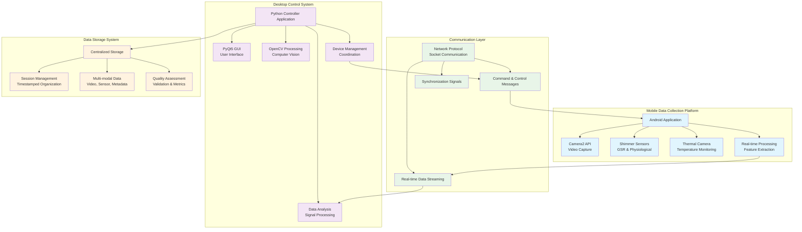

# System Overview and Design

## Table of Contents

- [1. Introduction](#1-introduction)
- [2. System Architecture](#2-system-architecture)
  - [2.1 Android Application Component](#21-android-application-component)
  - [2.2 Python Desktop Application Component](#22-python-desktop-application-component)
- [3. System Architecture Diagram](#3-system-architecture-diagram)
- [4. Component Interaction Flow](#4-component-interaction-flow)
- [5. Directory Structure and Organization](#5-directory-structure-and-organization)
- [6. Technology Stack](#6-technology-stack)
- [7. Integration Patterns](#7-integration-patterns)
- [8. Related Documentation](#8-related-documentation)

## Related Documentation

**This document is part of the archive collection. For comprehensive documentation, see:**

### Primary Documentation
- **Complete System Architecture**: `../new_documentation/README_system_architecture.md`
- **Technical Implementation Guide**: `../new_documentation/README_technical_implementation.md`
- **System Operation Manual**: `../new_documentation/USER_GUIDE_system_operation.md`

### Component Documentation
- **Android Application**: `../new_documentation/README_Android_Mobile_Application.md`
- **Python Desktop Controller**: `../new_documentation/README_python_desktop_controller.md`
- **Multi-Device Synchronization**: `../new_documentation/README_Multi_Device_Synchronization.md`

**Complete Navigation**: `../new_documentation/INDEX.md`

## 1. Introduction

The Multi-Sensor Synchronized Recording System represents a sophisticated distributed computing solution specifically designed for contactless galvanic skin response (GSR) prediction through advanced RGB-thermal video analysis. This comprehensive system leverages the complementary strengths of mobile and desktop computing platforms to create a robust, research-grade physiological monitoring environment that meets the stringent requirements of scientific data collection while maintaining practical usability for research applications.

The system architecture embodies a carefully designed separation of concerns that optimizes each platform for its unique capabilities. The Android application serves as the primary data acquisition engine, leveraging the mobility, integrated sensors, and real-time processing capabilities of modern smartphones. The Python desktop application functions as the central command and control system, providing sophisticated data analysis capabilities, comprehensive visualization tools, and coordinated multi-device management functionality.

This distributed approach enables the system to achieve performance characteristics that would be difficult or impossible to accomplish with a single-platform solution. The mobile component provides intimate access to hardware sensors, camera systems, and real-time processing capabilities, while the desktop component offers unlimited processing power, extensive storage capacity, and sophisticated analysis algorithms that require computational resources beyond those available on mobile devices.

## 2. System Architecture

The system architecture consists of two primary components that work in concert to provide comprehensive physiological monitoring capabilities. Each component is optimized for specific aspects of the data collection and analysis workflow, creating a synergistic relationship that enhances the overall system performance.

### 2.1 Android Application Component

The Android application serves as the mobile data collection platform, responsible for orchestrating complex multi-sensor data acquisition, real-time video processing, and maintaining reliable communication with the central control system. This component is implemented in **Kotlin** and leverages several advanced Android APIs to achieve research-grade data collection capabilities.

**Key APIs and Technologies:**
- **Camera2 API**: Provides low-level access to camera hardware, enabling precise control over exposure, focus, and timing parameters essential for consistent video data collection
- **Shimmer Sensor APIs**: Integrates with wearable physiological sensors to collect GSR, heart rate, and acceleration data with millisecond precision
- **USB Thermal Camera SDK**: Enables integration with external thermal imaging devices for contactless temperature monitoring
- **Android NDK**: Provides native code execution for computationally intensive real-time processing tasks

The Android application is specifically designed to function as a distributed data collection node capable of autonomous operation while maintaining coordination with the central system. This design enables robust data collection even in environments with intermittent network connectivity, ensuring that valuable research data is never lost due to temporary communication failures.

### 2.2 Python Desktop Application Component

The Python desktop application functions as the central command and control system, providing comprehensive data analysis capabilities, sophisticated visualization tools, and coordinated management of multiple data collection devices. This component is built using **PyQt5** for the user interface framework and integrates numerous specialized libraries for data processing and analysis.

**Core Framework and Libraries:**
- **PyQt5**: Provides advanced GUI capabilities with professional-quality interface elements optimized for research applications
- **OpenCV**: Enables sophisticated computer vision processing, including calibration, feature extraction, and real-time video analysis
- **NumPy/SciPy**: Provides high-performance numerical computing capabilities for signal processing and statistical analysis
- **Socket Programming**: Implements custom networking protocols for real-time communication with mobile devices

The desktop application serves as the central nervous system of the entire data collection infrastructure, coordinating multiple devices, managing data storage, and providing real-time monitoring capabilities that enable researchers to ensure data quality throughout the collection process.

## 3. System Architecture Diagram

The following diagram illustrates the comprehensive system architecture, showing the relationship between components, data flow patterns, and communication mechanisms:



This architecture diagram demonstrates the sophisticated integration between mobile and desktop components, highlighting the specialized role of each system component and the comprehensive communication infrastructure that enables seamless coordination between distributed system elements.

## 4. Component Interaction Flow

The system implements a sophisticated interaction pattern that ensures reliable data collection while maintaining flexibility for various research scenarios. The interaction flow encompasses several distinct phases that work together to provide comprehensive physiological monitoring capabilities.

### Data Collection Phase
The Android application initiates multi-sensor data capture, coordinating camera systems, physiological sensors, and thermal imaging devices to collect synchronized multi-modal data streams. This coordination requires precise timing control to ensure that data from different sources can be properly aligned during analysis.

### Network Synchronization Phase
Real-time communication protocols enable bidirectional data flow between mobile and desktop components. The desktop system provides configuration commands and timing signals, while the mobile system streams collected data and status information. This communication layer implements robust error detection and recovery mechanisms to ensure data integrity.

### Analysis and Processing Phase
The Python application receives data streams and performs real-time quality assessment, feature extraction, and preliminary analysis. This processing provides immediate feedback about data quality and enables researchers to make informed decisions about data collection parameters during active recording sessions.

### Calibration Coordination Phase
Cross-platform calibration procedures ensure that data collected from multiple devices can be properly integrated and analyzed. The calibration process involves geometric alignment of camera systems, temporal synchronization of data streams, and validation of sensor accuracy across the entire system.

## 5. Directory Structure and Organization

The system implements a comprehensive directory structure that provides logical organization of components, clear separation of concerns, and intuitive navigation for developers and users:

```
bucika_gsr/
├── AndroidApp/              # Mobile application implementation
│   ├── src/main/java/       # Kotlin source code
│   ├── src/main/res/        # Application resources
│   └── build.gradle         # Android build configuration
├── PythonApp/               # Desktop controller implementation
│   ├── src/                 # Python source modules
│   ├── ui/                  # User interface components
│   ├── analysis/            # Data analysis algorithms
│   └── requirements.txt     # Python dependencies
├── docs/                    # Comprehensive documentation
│   ├── new_documentation/   # Modern consolidated documentation (43 files)
│   │   ├── README_*.md      # Component technical deep-dives
│   │   ├── USER_GUIDE_*.md  # Practical user guides
│   │   ├── PROTOCOL_*.md    # Data contracts and specifications
│   │   └── INDEX.md         # Complete navigation roadmap
│   ├── archive/             # Preserved authoritative specifications (6 files)
│   │   ├── DeviceClient_Protocol_Specification_v2.md
│   │   ├── system-overview-design.md
│   │   ├── REPOSITORY_COMPONENT_INVENTORY.md
│   │   ├── TODO_DOCUMENTATION.md
│   │   ├── TODO_NetworkController.md
│   │   └── README.md        # Archive index
│   ├── technical/           # Legacy technical specifications
│   ├── user-guides/         # Legacy user documentation
│   └── api/                 # Schema and API specifications
├── tools/                   # Development utilities and scripts
│   ├── calibration/         # Calibration utilities
│   ├── testing/             # Testing frameworks
│   └── deployment/          # Deployment scripts
├── calibration_data/        # Sensor calibration parameters
│   ├── camera/              # Camera calibration data
│   ├── thermal/             # Thermal camera calibration
│   └── sensors/             # Physiological sensor calibration
├── protocol/                # Communication protocol specifications
│   ├── messages/            # Message format definitions
│   ├── networking/          # Network protocol implementation
│   └── synchronization/     # Timing synchronization protocols
└── examples/                # Example implementations and demos
    ├── basic_usage/         # Basic system usage examples
    ├── advanced_features/   # Advanced feature demonstrations
    └── integration_tests/   # Integration test scenarios
```

This organization facilitates efficient development workflows, clear separation between different system aspects, and intuitive navigation for both development and deployment activities.

## 6. Technology Stack

The system leverages a carefully selected technology stack that balances performance requirements, development efficiency, and long-term maintainability:

### Mobile Platform Technologies
- **Kotlin**: Primary development language providing null safety, conciseness, and full Java interoperability
- **Android SDK API Level 29+**: Ensures access to modern Android features while maintaining broad device compatibility
- **Camera2 API**: Low-level camera control for precise video capture parameters
- **Shimmer Android SDK**: Specialized APIs for physiological sensor integration
- **USB Host API**: Enables communication with external thermal imaging devices

### Desktop Platform Technologies
- **Python 3.9+**: Core development language providing extensive library ecosystem and rapid development capabilities
- **PyQt5**: Professional GUI framework enabling sophisticated user interface development
- **OpenCV 4.5+**: Comprehensive computer vision library for image processing and analysis
- **NumPy/SciPy**: High-performance numerical computing for signal processing algorithms
- **Matplotlib/Seaborn**: Advanced visualization capabilities for data analysis and presentation

### Communication Technologies
- **TCP/IP Socket Programming**: Reliable, low-latency communication between system components
- **JSON Message Serialization**: Human-readable, cross-platform data exchange format
- **Protocol Buffers**: High-performance binary serialization for real-time data streaming
- **Network Discovery Protocols**: Automatic device discovery and connection establishment

## 7. Integration Patterns

The system implements several sophisticated integration patterns that ensure robust operation across diverse deployment scenarios:

### Event-Driven Architecture
All system components implement event-driven communication patterns that enable loose coupling, improved responsiveness, and enhanced fault tolerance. This approach allows components to react to system events without requiring tight coordination or synchronous communication patterns.

### Observer Pattern Implementation
Data collection and analysis components implement observer patterns that enable multiple system elements to respond to data availability, quality changes, and system state transitions. This pattern provides flexibility for extending system functionality without requiring modifications to core components.

### Command Pattern for Device Control
Device control operations are implemented using command patterns that enable queuing, logging, and replay of control operations. This approach provides comprehensive audit trails and enables sophisticated error recovery mechanisms.

### Strategy Pattern for Algorithm Selection
Analysis algorithms are implemented using strategy patterns that enable runtime selection of processing approaches based on data characteristics, performance requirements, and research objectives. This flexibility allows the system to adapt to different experimental protocols without requiring code modifications.

## 8. Related Documentation

This system overview is complemented by comprehensive documentation:

### Complete Documentation Suite
- **Navigation Index**: `../new_documentation/INDEX.md`
- **Detailed Architecture**: `../new_documentation/README_system_architecture.md`
- **Implementation Guide**: `../new_documentation/README_technical_implementation.md`

### Component Documentation
- **Android Application**: `../new_documentation/README_Android_Mobile_Application.md`
- **Python Desktop Controller**: `../new_documentation/README_python_desktop_controller.md`
- **Networking Protocol**: `../new_documentation/README_networking_protocol.md`

### Protocol Specifications
- **System API Reference**: `../new_documentation/PROTOCOL_system_api_reference.md`
- **Data Models**: `../new_documentation/PROTOCOL_data_models_and_file_organization.md`
- **DeviceClient Protocol**: `DeviceClient_Protocol_Specification_v2.md` (this archive)

### User Guides
- **System Operation**: `../new_documentation/USER_GUIDE_system_operation.md`
- **Multi-Device Setup**: `../new_documentation/USER_GUIDE_Multi_Device_Synchronization.md`

**Last Updated**: January 2025 (Post-consolidation)