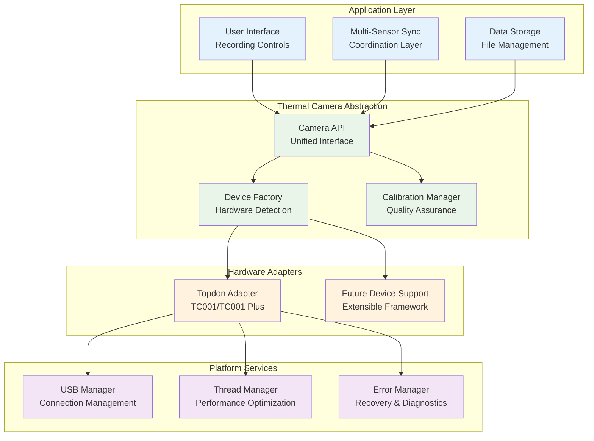
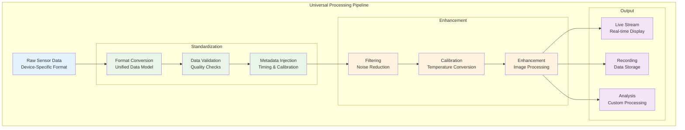

# Thermal Camera Integration and Implementation

> **📖 Comprehensive Documentation Available**: For detailed Topdon TC001 and TC001 Plus documentation, see:
> - **[Technical Deep-Dive](../new_documentation/README_topdon_tc001.md)** - Complete hardware specifications and implementation details
> - **[User Guide](../new_documentation/USER_GUIDE_topdon_tc001.md)** - Step-by-step setup and operation procedures  
> - **[Protocol Reference](../new_documentation/PROTOCOL_topdon_tc001.md)** - API specifications and data formats
> 
> This document provides general thermal camera integration overview and system-wide design patterns.

## Table of Contents

- [1. Overview](#1-overview)
- [2. General Integration Architecture](#2-general-integration-architecture)
- [3. System Integration Patterns](#3-system-integration-patterns)
- [4. Multi-Sensor Coordination](#4-multi-sensor-coordination)
- [5. Cross-Platform Considerations](#5-cross-platform-considerations)

## 1. Overview

The Multi-Sensor Recording System includes thermal camera integration capabilities designed to work with various thermal imaging devices. This document provides a system-wide view of thermal camera integration patterns, architectural decisions, and cross-cutting concerns that apply across different thermal camera models.

### Supported Thermal Cameras

The system currently supports the following thermal camera models:

| Camera Model | Documentation | Key Features |
|--------------|---------------|--------------|
| **Topdon TC001** | [Comprehensive Docs](../new_documentation/README_topdon_tc001.md) | 256×192, -20°C to +550°C, USB-C |
| **Topdon TC001 Plus** | [Comprehensive Docs](../new_documentation/README_topdon_tc001.md) | 256×192, -20°C to +650°C, Enhanced accuracy |

For device-specific technical details, implementation guides, and protocols, refer to the comprehensive documentation linked above.

### Integration Benefits

Thermal camera integration provides:
- **Multi-modal data collection**: Synchronized thermal, visual, and sensor data
- **Research-grade accuracy**: Calibrated temperature measurements with metadata
- **Real-time processing**: Low-latency thermal data streaming and analysis
- **Extensible architecture**: Plugin support for custom analysis algorithms

## 2. General Integration Architecture

### 2.1 System Architecture Overview

The thermal camera integration follows a modular architecture that separates hardware abstraction, data processing, and application logic into distinct layers. This design enables support for multiple thermal camera models while maintaining consistent interfaces.



### 2.2 Device Abstraction Pattern

The system uses a device abstraction pattern that enables uniform handling of different thermal camera models:

```kotlin
interface ThermalCamera {
    suspend fun connect(): Result<Unit>
    suspend fun startStreaming(): Flow<ThermalFrame>
    suspend fun stopStreaming()
    suspend fun disconnect()
    
    val specifications: ThermalCameraSpecs
    val calibrationManager: CalibrationManager
}
```

### 2.3 Multi-Sensor Coordination

Thermal cameras integrate with the broader multi-sensor recording system through standardized synchronization protocols that ensure temporal alignment across all sensor modalities.

## 3. System Integration Patterns

### 3.1 Plugin Architecture

The thermal camera system uses a plugin-based architecture that allows for easy extension and maintenance:

```kotlin
class ThermalCameraManager {
    private val registeredDevices = mutableMapOf<String, ThermalCameraFactory>()
    
    fun registerDevice(deviceId: String, factory: ThermalCameraFactory) {
        registeredDevices[deviceId] = factory
    }
    
    fun createDevice(usbDevice: UsbDevice): ThermalCamera? {
        val deviceId = "${usbDevice.vendorId}:${usbDevice.productId}"
        return registeredDevices[deviceId]?.create(usbDevice)
    }
}
```

### 3.2 Data Processing Pipeline

All thermal cameras follow a standardized data processing pipeline that ensures consistent data quality and format:



### 3.3 Error Handling and Recovery

The system implements comprehensive error handling strategies that are consistent across all thermal camera implementations:

```kotlin
sealed class ThermalCameraError {
    object ConnectionLost : ThermalCameraError()
    object CalibrationFailed : ThermalCameraError()
    object TemperatureOutOfRange : ThermalCameraError()
    data class HardwareMalfunction(val details: String) : ThermalCameraError()
}

interface ErrorRecoveryStrategy {
    suspend fun canRecover(error: ThermalCameraError): Boolean
    suspend fun recover(error: ThermalCameraError): Result<Unit>
}
```

## 4. Multi-Sensor Coordination

### 4.1 Synchronization Framework

The thermal camera integration includes sophisticated synchronization capabilities that enable precise temporal alignment with other sensor modalities:

```kotlin
interface SensorSynchronizer {
    suspend fun synchronizeStart(sensors: List<Sensor>): Result<Unit>
    suspend fun synchronizeStop(): Result<Unit>
    fun getTimestampOffset(sensorId: String): Long
}

class ThermalCameraSynchronizer : SensorSynchronizer {
    override suspend fun synchronizeStart(sensors: List<Sensor>): Result<Unit> {
        // Coordinate start sequence across all sensors
        // Ensure minimal time skew between thermal and other sensors
        return Result.success(Unit)
    }
}
```

### 4.2 Data Format Standardization

All thermal cameras produce data in standardized formats that enable consistent processing and analysis:

```kotlin
data class ThermalFrame(
    val timestamp: Long,
    val temperatureData: FloatArray,
    val width: Int,
    val height: Int,
    val metadata: ThermalMetadata
)

data class ThermalMetadata(
    val deviceModel: String,
    val calibrationTimestamp: Long,
    val ambientTemperature: Float,
    val emissivity: Float,
    val qualityMetrics: QualityMetrics
)
```

## 5. Cross-Platform Considerations

### 5.1 Android USB Host Support

The system requires Android devices with USB Host (OTG) support. Key considerations include:

- **API Level**: Minimum Android 7.0 (API 24) for stable USB Host implementation
- **Power Management**: USB devices must operate within Android power budget constraints
- **Permission Model**: Proper handling of USB device permissions and user consent
- **Thread Management**: Non-blocking USB communication using background threads

### 5.2 Performance Optimization

General optimization strategies that apply across all thermal camera implementations:

```kotlin
class ThermalPerformanceOptimizer {
    companion object {
        const val OPTIMAL_BUFFER_SIZE = 10
        const val MAX_PROCESSING_THREADS = 2
        const val FRAME_DROP_THRESHOLD_MS = 100
    }
    
    fun optimizeForDevice(deviceSpecs: DeviceSpecs): OptimizationSettings {
        return OptimizationSettings(
            bufferSize = calculateOptimalBufferSize(deviceSpecs),
            threadCount = calculateOptimalThreadCount(deviceSpecs),
            processingMode = selectProcessingMode(deviceSpecs)
        )
    }
}
```

This general thermal camera integration document provides the architectural framework that enables support for multiple thermal camera models while maintaining consistent interfaces and behavior patterns. For specific implementation details, refer to the comprehensive documentation for each supported camera model.