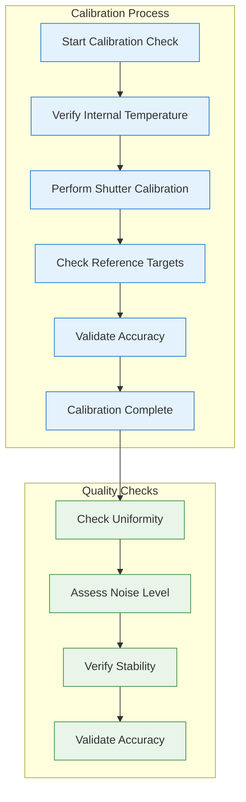
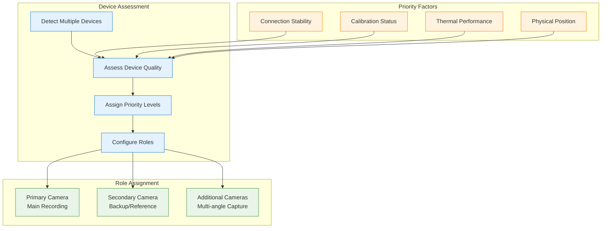
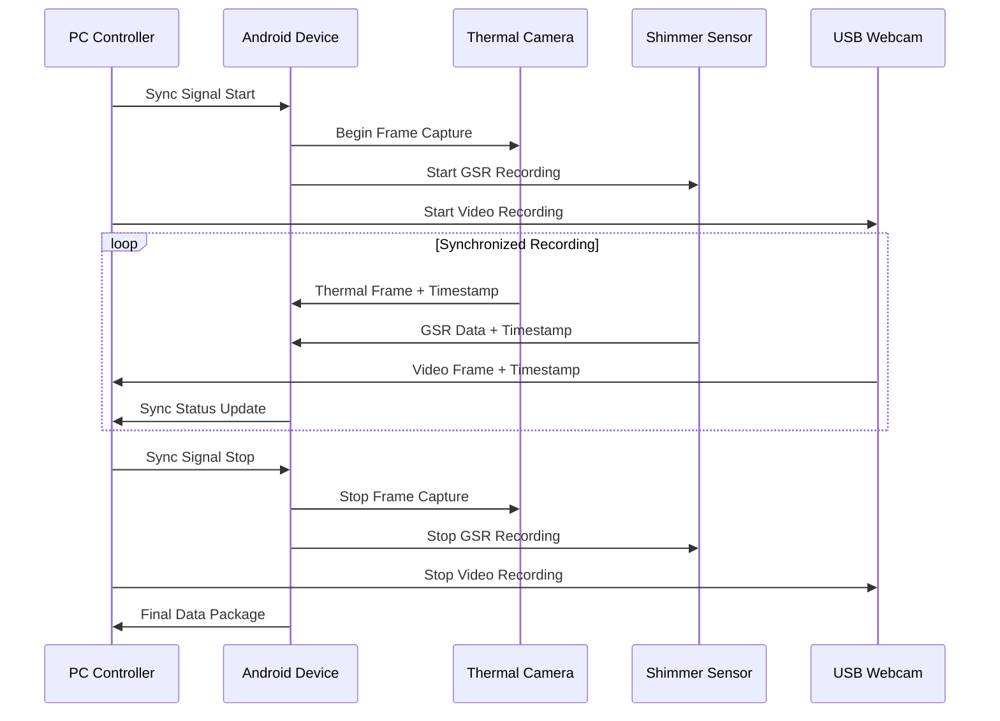
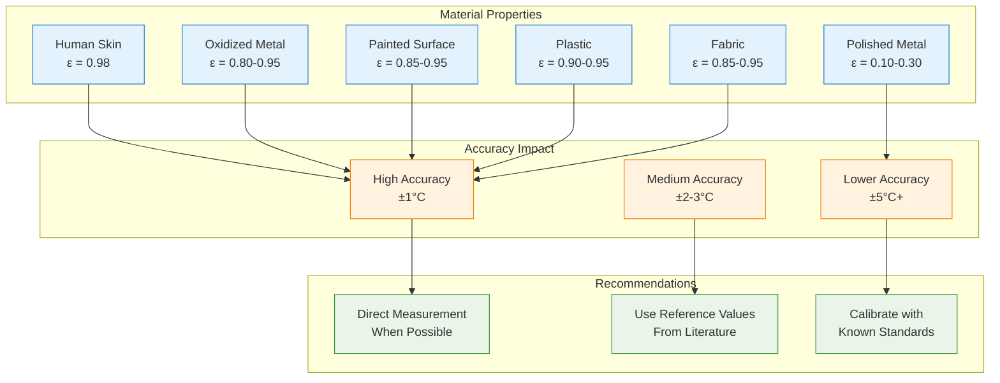
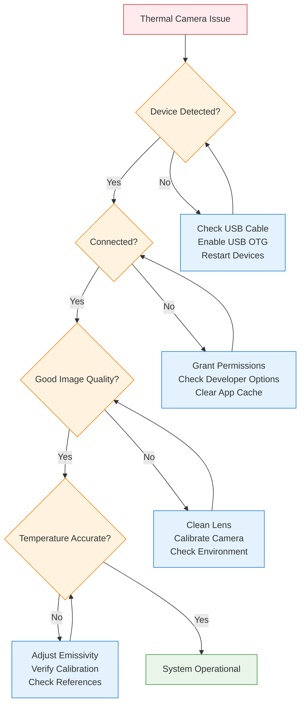

# Topdon TC001 and TC001 Plus User Guide

## Table of Contents

- [1. Getting Started](#1-getting-started)
- [2. Pre-flight Checklist](#2-pre-flight-checklist) 
- [3. Device Setup and Connection](#3-device-setup-and-connection)
- [4. Recording Procedures](#4-recording-procedures)
- [5. Data Management](#5-data-management)
- [6. Troubleshooting](#6-troubleshooting)
- [7. Best Practices](#7-best-practices)
- [8. Maintenance and Care](#8-maintenance-and-care)

## 1. Getting Started

The Topdon TC001 and TC001 Plus thermal cameras provide professional-grade thermal imaging capabilities for research applications. This guide provides step-by-step instructions for setup, operation, and data collection using these devices within the Multi-Sensor Recording System.

### 1.1 What You'll Need

**Required Equipment:**
- Topdon TC001 or TC001 Plus thermal camera
- Samsung Galaxy S22 smartphone (or compatible Android device)
- USB-C to USB-C cable (high-quality, data-capable)
- Fully charged devices (smartphone and thermal camera)
- Multi-Sensor Recording System app installed

**Optional Equipment:**
- External power bank for extended recording sessions
- Tripod mount for stable positioning
- Thermal calibration target (blackbody reference)

### 1.2 Compatibility Check

Before beginning, verify your equipment compatibility:

| Component | TC001 | TC001 Plus | Notes |
|-----------|-------|------------|-------|
| **Android Version** | 7.0+ (API 24) | 7.0+ (API 24) | Required for USB OTG support |
| **USB Standard** | USB-C OTG | USB-C OTG | Must support data transfer |
| **Available Storage** | 2GB minimum | 2GB minimum | For 10-minute recording session |
| **RAM** | 4GB minimum | 4GB minimum | For smooth real-time processing |

## 2. Pre-flight Checklist

Complete this checklist before each recording session to ensure optimal performance and data quality.

### 2.1 Equipment Verification

**✓ Hardware Check:**
- [ ] Thermal camera fully charged (>80% battery)
- [ ] Android device fully charged (>80% battery)
- [ ] USB-C cable tested and confirmed working
- [ ] Adequate storage space available (>1GB per 10 minutes)
- [ ] Camera lens clean and free of obstruction

**✓ Software Preparation:**
- [ ] Multi-Sensor Recording System app updated to latest version
- [ ] Android Developer Options enabled
- [ ] USB Debugging enabled
- [ ] Storage permissions granted to app

**✓ Environmental Considerations:**
- [ ] Recording environment temperature stable (±2°C)
- [ ] Ambient temperature within camera operating range (0°C to +50°C)
- [ ] No direct sunlight on camera lens
- [ ] Minimal air currents in measurement area

### 2.2 Calibration Verification



**Calibration Steps:**
1. **Warm-up Period**: Allow camera to stabilize for 2-3 minutes after connection
2. **Internal Calibration**: Ensure camera performs automatic shutter calibration
3. **Reference Check**: Verify temperature readings against known reference
4. **Accuracy Validation**: Confirm ±2°C accuracy for TC001, ±1.5°C for TC001 Plus

## 3. Device Setup and Connection

### 3.1 Initial Device Connection

Follow these steps to establish communication between the thermal camera and Android device:

**Step 1: Enable Developer Options**
1. Open Android **Settings** → **About phone**
2. Tap **Build number** 7 times rapidly
3. Navigate back to **Settings** → **System** → **Developer options**
4. Enable **USB debugging**

**Step 2: Connect Thermal Camera**
1. Ensure both devices are powered on
2. Connect thermal camera to Android device using USB-C cable
3. Wait for Android to detect the device (typically 5-10 seconds)

**Step 3: Grant Permissions**
1. Android will display USB permission dialog
2. Check **"Use by default for this USB device"**
3. Tap **OK** to grant permission
4. Note: Permission is required each time for security

**Step 4: Launch Application**
1. Open Multi-Sensor Recording System app
2. Navigate to **Thermal Camera** section
3. Verify camera status shows **"Connected"**

### 3.2 Device Configuration

Once connected, configure the thermal camera for your specific recording requirements:

**Basic Configuration:**
```
Frame Rate: 25 fps (default, adjustable 1-25 fps)
Resolution: 256×192 pixels (fixed)
Temperature Range: 
  - TC001: -20°C to +550°C
  - TC001 Plus: -20°C to +650°C
Emissivity: 0.95 (adjustable 0.10-1.00)
Measurement Mode: Radiometric (temperature data)
Display Mode: Pseudo-color (real-time visualization)
```

**Advanced Configuration:**


*Figure 1: Thermal camera configuration interface showing temperature range, emissivity, and display options*

1. **Temperature Range Selection**:
   - Tap **Temperature Range** button
   - Select appropriate range for your application
   - Narrower ranges provide better sensitivity

2. **Emissivity Setting**:
   - Tap **Emissivity** field
   - Enter value based on target material properties
   - Common values: Skin (0.98), Metal (0.10-0.95), Plastic (0.90-0.95)

3. **Display Options**:
   - Choose color palette for visualization
   - Adjust contrast and brightness
   - Enable/disable temperature overlay

### 3.3 Multi-Camera Setup

For applications requiring multiple thermal cameras, the system supports simultaneous operation of up to 4 devices:

**Multi-Camera Configuration Process:**
1. Connect first thermal camera following standard procedure
2. Connect second camera to available USB port (using USB hub if necessary)
3. System automatically detects and prioritizes devices
4. Configure each camera independently
5. Verify synchronization status in **Multi-Device** panel

**Device Priority System:**


## 4. Recording Procedures

### 4.1 Standard Recording Session

Follow this procedure for typical thermal recording sessions:

**Preparation Phase:**
1. Complete pre-flight checklist (Section 2)
2. Position camera at desired viewing angle
3. Verify target objects are within field of view
4. Check ambient lighting conditions

**Recording Setup:**
1. Open **Recording Session** interface
2. Enter session metadata:
   - Session ID/Name
   - Participant information (if applicable)
   - Environmental conditions
   - Research protocol reference

3. Configure recording parameters:
   - Duration (or continuous until stopped)
   - Frame rate (typically 25 fps)
   - File format preferences
   - Synchronization settings

**Start Recording:**
1. Tap **Start Recording** button
2. Verify recording indicator appears (red dot)
3. Monitor real-time display for proper operation
4. Check frame rate stability (target: 25 fps ±1)


*Figure 2: Active recording interface showing real-time thermal display, recording controls, and status indicators*

**During Recording:**
- Monitor device temperature to prevent overheating
- Verify adequate storage space remains
- Observe thermal image quality and stability
- Note any significant events in session log

**Stop Recording:**
1. Tap **Stop Recording** button
2. Wait for data finalization (typically 5-10 seconds)
3. Verify recording completed successfully
4. Review session summary and statistics

### 4.2 Synchronized Multi-Modal Recording

For research applications requiring temporal synchronization with other sensors:

**Synchronization Setup:**


**Synchronization Procedure:**
1. **Initialize All Devices**: Connect and configure all recording devices
2. **Clock Synchronization**: Establish common time reference across devices
3. **Start Sequence**: Begin recording in coordinated sequence
4. **Monitor Sync Status**: Verify all devices maintaining synchronization
5. **Stop Sequence**: End recording with proper data finalization

### 4.3 Specialized Recording Modes

**High-Speed Mode** (for rapid thermal events):
- Reduce resolution if available
- Maximize frame rate (up to 25 fps)
- Use minimal processing delays
- Ensure adequate USB bandwidth

**Long-Duration Mode** (for extended monitoring):
- Enable power management features
- Configure automatic data compression
- Set up periodic calibration checks
- Monitor device temperature limits

**High-Accuracy Mode** (for precision measurements):
- Extended warm-up period (5+ minutes)
- Frequent calibration validation
- Environmental stability monitoring
- Reference temperature comparison

## 5. Data Management

### 5.1 File Formats and Structure

The system generates multiple output files for each recording session:

**Primary Data Files:**
```
Recording_Session_20240131_103000/
├── thermal_raw.bin           # Raw radiometric data
├── thermal_display.mp4       # Pseudo-color video for visualization
├── thermal_metadata.json     # Session configuration and statistics
├── temperature_log.csv       # Frame-by-frame temperature data
├── calibration_data.json     # Calibration coefficients and validation
└── session_summary.pdf       # Human-readable session report
```

**File Format Specifications:**

| File Type | Format | Size (10 min) | Purpose |
|-----------|--------|---------------|---------|
| **thermal_raw.bin** | Binary | ~750 MB | Research analysis |
| **thermal_display.mp4** | H.264 | ~125 MB | Visualization |
| **thermal_metadata.json** | JSON | ~50 KB | Configuration record |
| **temperature_log.csv** | CSV | ~25 MB | Statistical analysis |
| **calibration_data.json** | JSON | ~10 KB | Accuracy validation |

### 5.2 Data Export and Analysis

**Export to Analysis Software:**

1. **MATLAB Export:**
   ```matlab
   % Load thermal data in MATLAB
   data = readThermalData('thermal_raw.bin');
   metadata = jsondecode(fileread('thermal_metadata.json'));
   temperatures = readmatrix('temperature_log.csv');
   ```

2. **Python Export:**
   ```python
   import numpy as np
   import json
   import pandas as pd
   
   # Load thermal data in Python
   data = np.fromfile('thermal_raw.bin', dtype=np.uint16)
   data = data.reshape(-1, 192, 256)  # frames x height x width
   
   with open('thermal_metadata.json', 'r') as f:
       metadata = json.load(f)
   
   temperatures = pd.read_csv('temperature_log.csv')
   ```

3. **R Export:**
   ```r
   # Load thermal data in R
   library(jsonlite)
   library(readr)
   
   metadata <- fromJSON("thermal_metadata.json")
   temperatures <- read_csv("temperature_log.csv")
   ```

### 5.3 Quality Assurance

**Data Validation Checklist:**
- [ ] Frame count matches expected duration
- [ ] No missing or corrupted frames
- [ ] Temperature ranges within expected bounds
- [ ] Calibration validation passed
- [ ] Synchronization markers present (if applicable)
- [ ] Metadata complete and accurate

**Quality Metrics:**
```json
{
  "session_quality": {
    "frame_completeness": 99.8,
    "temperature_accuracy": "±1.2°C",
    "calibration_stability": "Excellent",
    "sync_drift": "<0.1ms",
    "data_integrity": "Verified"
  }
}
```

## 6. Troubleshooting

### 6.1 Common Connection Issues

**Problem: Camera Not Detected**
```
Symptoms: No device shown in app, USB not recognized
Quick Fixes:
1. Check USB cable connection (try different cable)
2. Verify USB OTG enabled in Android settings
3. Restart both camera and Android device
4. Clear app cache and restart application

Advanced Solutions:
- Update Android USB drivers
- Check for app permission conflicts
- Verify camera firmware version
- Test with different Android device
```

**Problem: Permission Denied**
```
Symptoms: Device detected but cannot access
Solutions:
1. Grant USB permissions when prompted
2. Enable "Use by default for this USB device"
3. Check Developer Options → USB Configuration
4. Manually grant permissions in App Settings
```

**Problem: Intermittent Disconnection**
```
Symptoms: Camera disconnects during recording
Troubleshooting:
1. Use high-quality USB cable (avoid extension cables)
2. Ensure stable physical connection
3. Check power management settings
4. Monitor device temperature (may throttle when hot)
```

### 6.2 Image Quality Issues

**Problem: Poor Image Quality**


*Figure 3: Comparison of good vs. poor thermal image quality, showing effects of calibration and environmental factors*

```
Symptoms: Noisy, distorted, or unrealistic thermal images
Diagnosis Steps:
1. Verify calibration status (should be "Active")
2. Check warm-up time (minimum 2 minutes required)
3. Assess environmental conditions
4. Review emissivity settings for target materials

Solutions:
- Perform manual shutter calibration
- Adjust emissivity to match target material
- Ensure stable ambient temperature
- Clean camera lens with appropriate cloth
```

**Problem: Temperature Accuracy Issues**
```
Symptoms: Temperature readings inconsistent with references
Validation Steps:
1. Compare with calibrated reference thermometer
2. Verify emissivity settings (critical for accuracy)
3. Check for reflected thermal radiation
4. Assess measurement distance and angle

Corrections:
- Adjust emissivity based on material properties
- Use blackbody reference for calibration validation
- Position camera to minimize reflections
- Account for ambient temperature effects
```

### 6.3 Performance Issues

**Problem: Low Frame Rate**
```
Symptoms: Choppy thermal display, frame rate <20 fps
Solutions:
1. Close background apps to free system resources
2. Reduce display resolution if possible
3. Disable unnecessary processing features
4. Use faster USB cable/connection
5. Clear device cache and restart
```

**Problem: App Crashes or Freezes**
```
Symptoms: Application stops responding or crashes
Immediate Actions:
1. Force-stop and restart application
2. Disconnect and reconnect thermal camera
3. Restart Android device if necessary
4. Check available storage space

Preventive Measures:
- Ensure adequate device RAM (>2GB available)
- Regular app updates
- Periodic device reboots
- Monitor storage space during recording
```

### 6.4 Emergency Procedures

**Data Recovery:**
If recording is interrupted unexpectedly:
1. Do not disconnect camera immediately
2. Allow app to attempt automatic recovery
3. Check temp storage location for partial files
4. Use data recovery procedures if necessary

**Emergency Stop:**
For immediate recording termination:
1. Tap **Emergency Stop** button in app
2. If app unresponsive, disconnect USB cable
3. Force-stop application if necessary
4. Verify data integrity before proceeding

## 7. Best Practices

### 7.1 Measurement Accuracy

**Emissivity Considerations:**


**Environmental Controls:**
- Maintain stable ambient temperature (±2°C)
- Minimize air currents and drafts
- Control reflected thermal radiation
- Consider atmospheric absorption for long distances

### 7.2 Data Quality Optimization

**Recording Environment:**
```
Optimal Conditions:
├── Temperature: 20-25°C (ambient)
├── Humidity: 30-60% RH
├── Air Movement: <0.5 m/s
├── Lighting: Minimal IR sources
└── Stability: Vibration-free mounting

Measurement Distance:
├── Minimum: 30 cm (near focus limit)
├── Optimal: 1-3 meters
├── Maximum: 10 meters (atmospheric effects)
└── FOV Coverage: 80% of sensor target
```

**Session Planning:**
1. **Pre-session Calibration**: Always perform before critical measurements
2. **Warm-up Protocol**: Minimum 2-3 minutes, 5+ minutes for precision work
3. **Reference Measurements**: Include known temperature references in field of view
4. **Documentation**: Record all environmental conditions and setup parameters

### 7.3 Long-term Maintenance

**Regular Maintenance Schedule:**
- **Daily**: Clean lens with microfiber cloth, check calibration status
- **Weekly**: Verify temperature accuracy with reference thermometer
- **Monthly**: Deep calibration validation, update camera firmware if available
- **Quarterly**: Professional calibration service (if available)

**Storage and Handling:**
- Store in protective case when not in use
- Avoid extreme temperatures (-10°C to +60°C storage)
- Keep lens cap on to prevent contamination
- Handle by body, not by lens assembly

## 8. Maintenance and Care

### 8.1 Routine Maintenance

**Daily Maintenance:**
1. **Lens Cleaning**: Use only lint-free microfiber cloth
2. **Visual Inspection**: Check for physical damage or contamination
3. **Calibration Verification**: Ensure automatic calibration is functioning
4. **Battery Check**: Verify adequate charge for planned usage

**Weekly Maintenance:**
1. **Accuracy Validation**: Compare readings with reference thermometer
2. **Connection Testing**: Verify stable USB communication
3. **Software Updates**: Check for app and firmware updates
4. **Performance Review**: Analyze recent recording quality metrics

### 8.2 Professional Servicing

**Annual Calibration Service:**
- Professional radiometric calibration
- Optical alignment verification
- Sensor performance validation
- Firmware updates and optimization

**Warranty and Support:**
- TC001: 2-year manufacturer warranty
- TC001 Plus: 3-year manufacturer warranty
- Technical support: Available through Topdon service channels
- Calibration services: Available through authorized service centers

### 8.3 Upgrade Considerations

**When to Consider Upgrading:**
- Accuracy requirements exceed current capabilities
- Need for higher resolution thermal imaging
- Requirements for extended temperature ranges
- Integration with newer analysis software

**Future Compatibility:**
- SDK updates maintain backward compatibility
- Hardware interfaces standardized on USB-C
- Data formats designed for long-term accessibility
- Migration tools available for legacy data

---

## Appendices

### Appendix A: Quick Reference Card

**Connection Sequence:**
1. Enable USB debugging on Android
2. Connect camera with USB-C cable
3. Grant USB permissions
4. Launch Multi-Sensor Recording app
5. Verify connection status

**Essential Settings:**
- Frame Rate: 25 fps
- Emissivity: Material-dependent (0.95 default)
- Temperature Range: Application-dependent
- Display Mode: Pseudo-color recommended

**Emergency Contacts:**
- Technical Support: [Contact information]
- Calibration Services: [Service provider information]
- User Community: [Forum/support group links]

### Appendix B: Material Emissivity Values

| Material | Emissivity (ε) | Notes |
|----------|----------------|-------|
| Human skin | 0.98 | Independent of skin color |
| Water | 0.96 | Clean water surface |
| Concrete | 0.95 | Aged concrete |
| Paint (non-metallic) | 0.90-0.95 | Most standard paints |
| Plastic | 0.90-0.95 | Most thermoplastics |
| Fabric | 0.85-0.95 | Natural and synthetic |
| Oxidized metals | 0.80-0.95 | Rusted or painted |
| Anodized aluminum | 0.70-0.80 | Depends on finish |
| Polished aluminum | 0.05-0.10 | Highly reflective |
| Polished steel | 0.10-0.30 | Mirror-like finish |

### Appendix C: Troubleshooting Decision Tree



---

*This user guide provides comprehensive instructions for operating Topdon TC001 and TC001 Plus thermal cameras within the Multi-Sensor Recording System. For technical implementation details, refer to the companion Technical Documentation.*

**Document Version**: 1.0  
**Last Updated**: January 31, 2024  
**Compatibility**: Multi-Sensor Recording System v1.0+