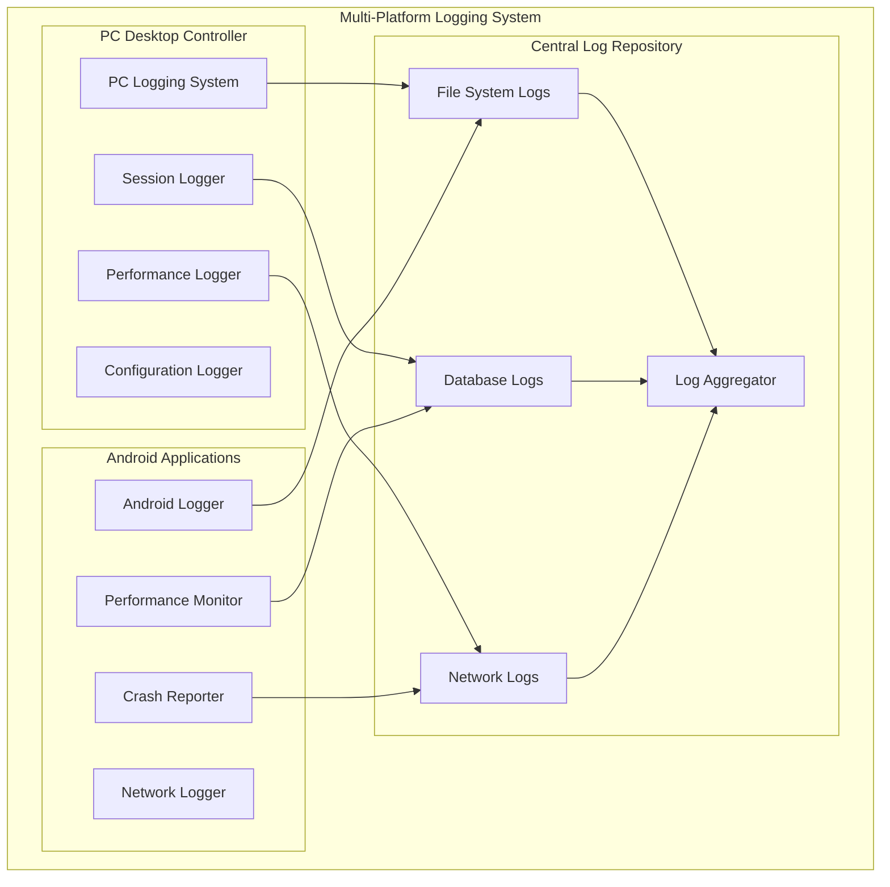
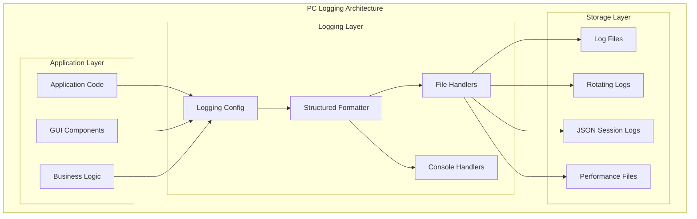
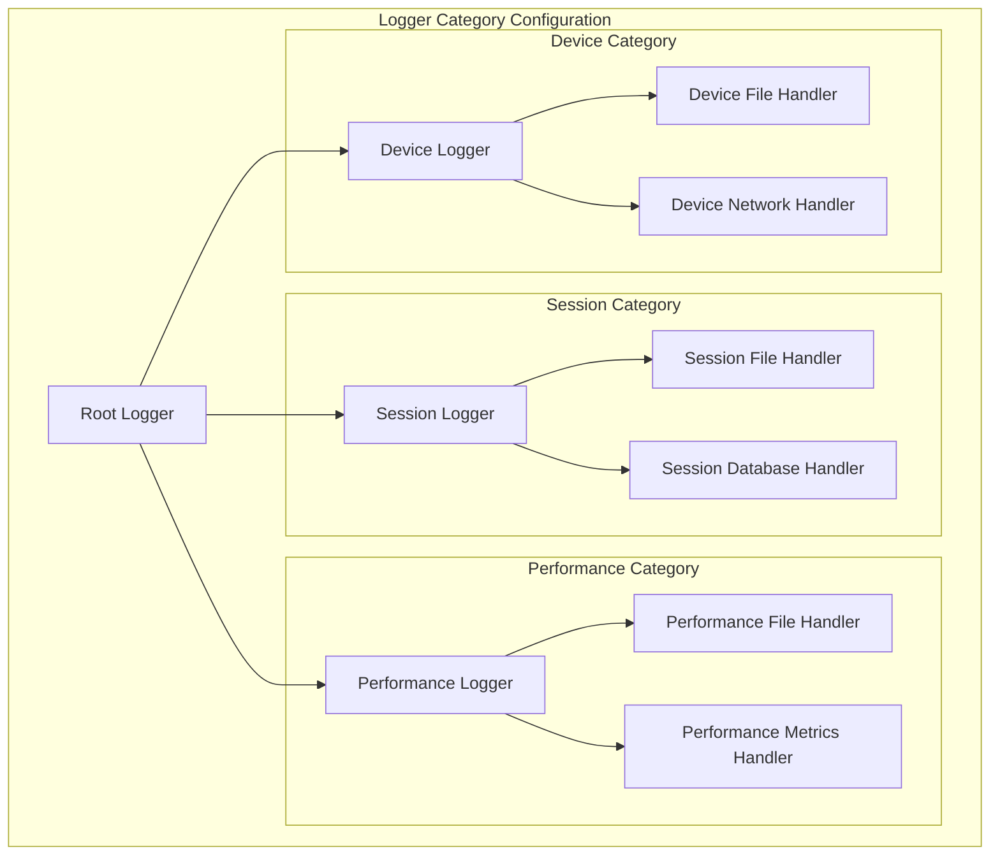
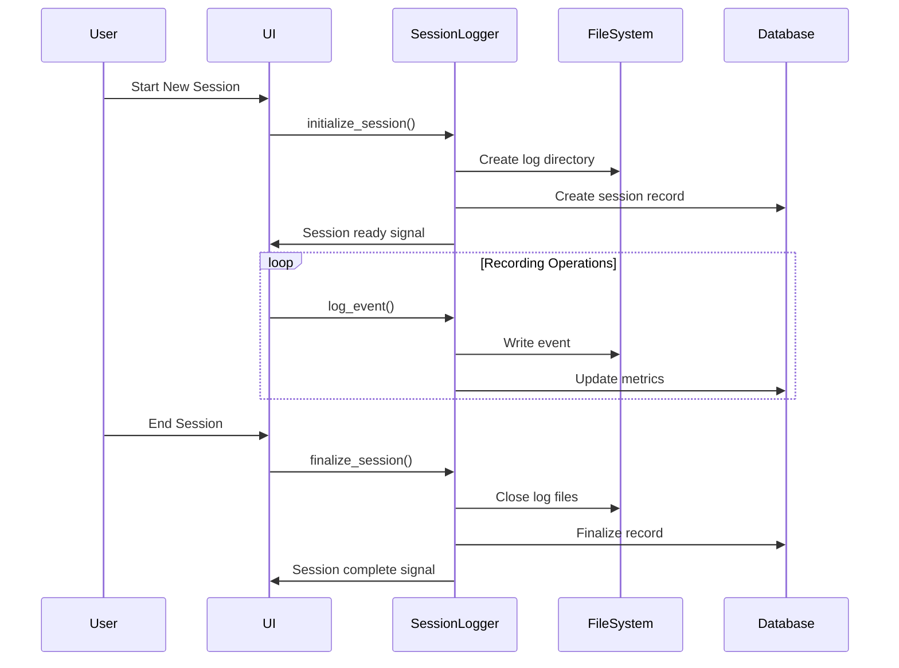
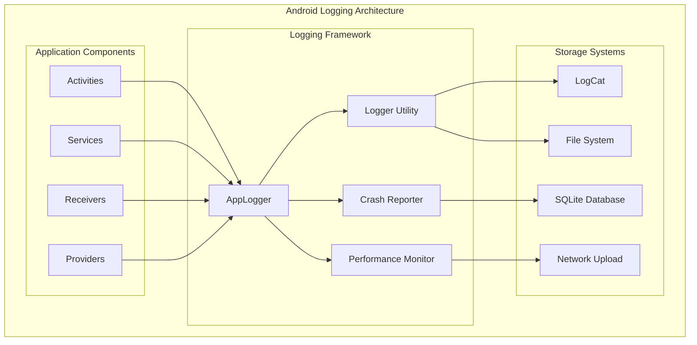
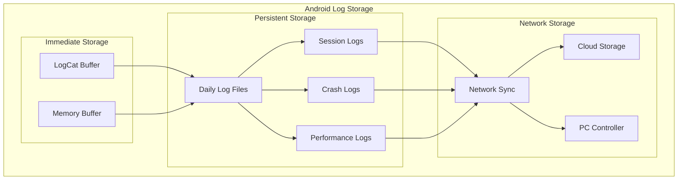
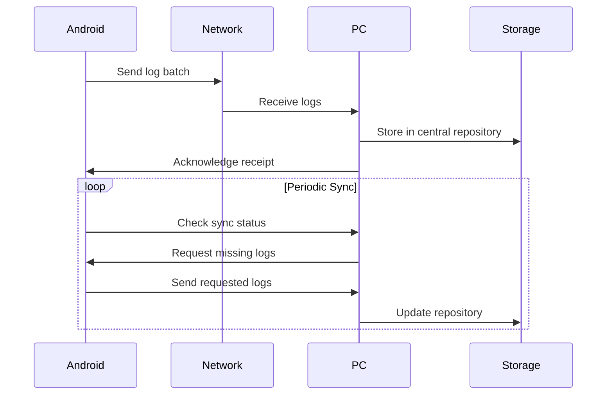
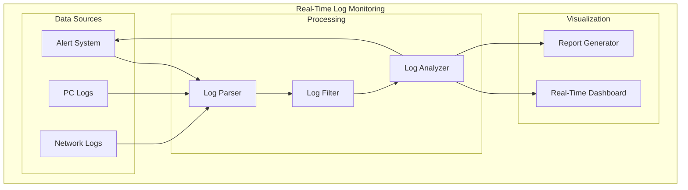
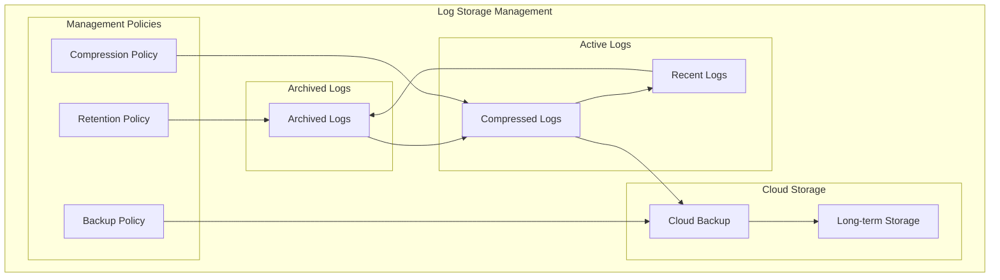

# PC/Android Logging Comprehensive Guide

A complete guide to the logging systems of the Multi-Sensor Recording System, covering both the Python desktop controller and Android mobile application logging infrastructure.

## Table of Contents

1. [Introduction](#introduction)
2. [PC Desktop Application Logging](#pc-desktop-application-logging)
   - [Logging Architecture](#logging-architecture)
   - [Log Configuration](#log-configuration)
   - [Log Levels and Categories](#log-levels-and-categories)
   - [Structured Logging](#structured-logging)
   - [Session Logging](#session-logging)
   - [Performance Monitoring](#performance-monitoring)
3. [Android Application Logging](#android-application-logging)
   - [Android Logging Architecture](#android-logging-architecture)
   - [Log Management](#log-management)
   - [Crash Reporting](#crash-reporting)
   - [Performance Tracking](#performance-tracking)
   - [Network Logging](#network-logging)
4. [Cross-Platform Log Integration](#cross-platform-log-integration)
5. [Log Analysis and Monitoring](#log-analysis-and-monitoring)
6. [Troubleshooting with Logs](#troubleshooting-with-logs)
7. [Log Management and Rotation](#log-management-and-rotation)
8. [Security and Privacy](#security-and-privacy)

## Introduction

The Multi-Sensor Recording System employs comprehensive logging across both PC and Android platforms to ensure reliable operation, facilitate debugging, and provide detailed audit trails for research sessions. The logging system is designed with several key principles:

### Logging Objectives

- **Operational Transparency**: Provide complete visibility into system operations by capturing detailed information about every component interaction, configuration change, and operational state transition. This comprehensive logging enables researchers and system administrators to understand exactly how the system behaves under different conditions and identify optimization opportunities.

- **Research Traceability**: Maintain detailed records for scientific reproducibility by documenting every aspect of data collection sessions, including participant information, experimental parameters, device configurations, and environmental conditions. This detailed audit trail ensures that research results can be validated and experiments can be precisely replicated.

- **Debugging Support**: Enable rapid identification and resolution of issues through comprehensive error logging, performance monitoring, and system state tracking. The logging system captures not only error conditions but also the complete context leading up to problems, significantly reducing troubleshooting time and improving system reliability.

- **Performance Monitoring**: Track system performance and resource usage across all components to identify bottlenecks, optimize resource allocation, and ensure consistent performance during critical recording sessions. The monitoring system includes predictive analysis to identify potential performance issues before they impact data collection.

- **Audit Compliance**: Meet research data management requirements by providing comprehensive logs that satisfy institutional review board requirements, data protection regulations, and scientific publication standards. The logging system includes features for data anonymization, access control, and retention policy enforcement.

### System-Wide Logging Architecture



### Logging Standards

The system adheres to industry standards for research logging:

| Standard | Application | Description |
|----------|-------------|-------------|
| **ISO 8601** | Timestamps | Standardized timestamp format |
| **JSON Schema** | Structured Logs | Machine-readable log format |
| **RFC 5424** | Syslog Format | Network log transmission |
| **W3C CLF** | Access Logs | Web-standard access logging |

## PC Desktop Application Logging

The PC desktop application uses a sophisticated Python-based logging system built on the standard `logging` module with custom enhancements for research applications.

### Logging Architecture

The PC logging system is built with a modular architecture that separates different types of logging concerns:



#### Core Logging Components

**Configuration Module (`logging_config.py`)**
- Centralized logging setup and configuration management that provides a single point of control for all logging behavior across the application. This module handles complex configuration scenarios including environment-specific settings, dynamic configuration updates, and integration with external logging services.

- Multiple handler management capabilities that allow simultaneous logging to file systems, console outputs, and network destinations. The system intelligently routes different types of log messages to appropriate handlers while maintaining performance and preventing log duplication.

- Dynamic log level adjustment functionality that enables real-time modification of logging verbosity without requiring application restart. This feature is particularly valuable during debugging sessions and performance optimization efforts.

- Performance monitoring integration that seamlessly incorporates system metrics into the logging stream, providing correlation between application events and system resource utilization patterns.

**Session Logger (`session_logger.py`)**
- Research session-specific logging capabilities that create dedicated log streams for individual recording sessions, making it easy to analyze session-specific events and troubleshoot issues that occur during particular experiments.

- Structured JSON event recording that captures complex data structures and relationships in a machine-readable format, enabling automated analysis and integration with research data management systems.

- Real-time UI integration via Qt signals that allows the user interface to display live logging information, providing researchers with immediate feedback about system operations and potential issues.

- Thread-safe operation for concurrent logging that ensures log integrity even when multiple system components are generating log messages simultaneously during high-activity periods.

**Structured Formatter**
- JSON-formatted log output designed for machine parsing and automated analysis, with standardized field names and data types that facilitate integration with log analysis tools and research data processing pipelines.

- Standardized field mapping that ensures consistent log structure across all system components, making it easier to correlate events and perform comprehensive system analysis.

- Exception tracking with full stack traces that captures complete error context including function call sequences, variable states, and system conditions at the time of errors.

- Performance metrics integration that embeds timing information, resource usage data, and system health indicators directly into log entries for comprehensive performance analysis.

### Log Configuration

The logging system provides flexible configuration options to support different research scenarios:

#### Configuration Parameters

```python
LOGGING_CONFIG = {
    'version': 1,
    'disable_existing_loggers': False,
    'formatters': {
        'standard': {
            'format': '%(asctime)s [%(levelname)s] %(name)s: %(message)s',
            'datefmt': '%Y-%m-%d %H:%M:%S'
        },
        'structured': {
            '()': 'utils.logging_config.StructuredFormatter'
        },
        'performance': {
            'format': '%(asctime)s [PERF] %(name)s: %(message)s'
        }
    },
    'handlers': {
        'console': {
            'class': 'logging.StreamHandler',
            'level': 'INFO',
            'formatter': 'standard'
        },
        'file_rotating': {
            'class': 'logging.handlers.RotatingFileHandler',
            'filename': 'logs/application.log',
            'maxBytes': 10485760,  # 10MB
            'backupCount': 5,
            'formatter': 'structured'
        },
        'session_file': {
            'class': 'logging.FileHandler',
            'formatter': 'structured'
        }
    }
}
```

#### Dynamic Configuration

The system supports runtime configuration changes:

- **Log level adjustment** capabilities for different debugging scenarios that allow researchers and system administrators to increase verbosity for troubleshooting while maintaining optimal performance during normal operations. The system supports granular level control on a per-component basis.

- **Handler addition/removal** functionality for specialized logging needs that enables dynamic reconfiguration of log destinations based on operational requirements. This includes the ability to add temporary debugging handlers or redirect logs to specialized analysis tools.

- **Formatter switching** between human-readable and machine-readable formats that accommodates different use cases, from real-time debugging displays to automated log processing systems. The switching can be performed at runtime without interrupting system operation.

- **Performance monitoring toggles** for production vs. development environments that allow detailed performance logging during development and testing while minimizing overhead in production research environments where system performance is critical.

### Log Levels and Categories

The PC application uses a comprehensive log level system that provides granular control over what information is captured:

#### Standard Log Levels

| Level | Priority | Usage | Example Scenarios |
|-------|----------|-------|-------------------|
| **CRITICAL** | 50 | System failures | Application crash, data corruption |
| **ERROR** | 40 | Recoverable errors | Device disconnection, file write failure |
| **WARNING** | 30 | Potential issues | Low disk space, network latency |
| **INFO** | 20 | Normal operations | Session start/stop, device connections |
| **DEBUG** | 10 | Detailed information | Function entry/exit, parameter values |

#### Specialized Categories

The system defines specific logger categories for different functional areas:

```python
# Logger categories with specialized handling
LOGGER_CATEGORIES = {
    'session': 'multisensor.session',      # Session management
    'device': 'multisensor.device',        # Device communication
    'network': 'multisensor.network',      # Network operations
    'camera': 'multisensor.camera',        # Camera operations
    'calibration': 'multisensor.calibration', # Calibration procedures
    'performance': 'multisensor.performance', # Performance monitoring
    'security': 'multisensor.security',    # Security and permissions
    'ui': 'multisensor.ui',               # User interface events
    'data': 'multisensor.data',           # Data processing and storage
    'config': 'multisensor.config'        # Configuration management
}
```

#### Category-Specific Configuration

Each category can have independent configuration:



### Structured Logging

The PC application implements structured logging to enable automated analysis and monitoring:

#### JSON Log Format

```json
{
    "timestamp": "2025-07-31T14:30:45.123456",
    "level": "INFO",
    "logger": "multisensor.session",
    "module": "session_manager",
    "function": "start_recording",
    "line": 245,
    "thread": 140234567890,
    "thread_name": "MainThread",
    "message": "Recording session started successfully",
    "session_id": "session_20250731_143045",
    "device_count": 4,
    "recording_parameters": {
        "resolution": "4K",
        "framerate": 30,
        "duration": 600
    },
    "performance_metrics": {
        "cpu_usage": 15.2,
        "memory_usage": 245.6,
        "disk_usage": 1024.0
    }
}
```

#### Structured Data Fields

Standard fields included in all structured log entries:

| Field | Type | Description |
|-------|------|-------------|
| **timestamp** | ISO 8601 | Precise event timestamp |
| **level** | String | Log severity level |
| **logger** | String | Logger category name |
| **module** | String | Python module name |
| **function** | String | Function name where log originated |
| **line** | Integer | Line number in source code |
| **thread** | Integer | Thread ID |
| **thread_name** | String | Human-readable thread name |
| **message** | String | Human-readable log message |

#### Context-Specific Fields

Additional fields based on logging context:

**Session Events:**
- `session_id`: Unique session identifier that maintains consistency across all log entries for a specific recording session, enabling easy correlation of events and comprehensive session analysis. This identifier is generated at session initiation and persists throughout the entire recording lifecycle.

- `participant_id`: Research participant identifier that provides linkage to participant demographics and study enrollment information while maintaining appropriate privacy protections. This field supports both anonymous and identified research protocols based on study requirements.

- `experiment_name`: Experiment or study name that associates log entries with specific research protocols, enabling analysis of system behavior across different experimental conditions and helping researchers track performance across multiple studies.

- `device_list`: Array of connected devices that documents the complete hardware configuration for each session, including device identifiers, capabilities, and status information. This comprehensive device inventory supports troubleshooting and helps ensure experimental reproducibility.

**Performance Events:**
- `cpu_usage`: CPU utilization percentage captured at high frequency to provide detailed insights into computational load patterns and help identify performance bottlenecks during intensive data processing operations. The measurements include both instantaneous and averaged values over configurable time windows.

- `memory_usage`: Memory consumption in MB tracked across all system components to monitor memory efficiency and detect potential memory leaks or excessive resource consumption that could impact system stability during long recording sessions.

- `disk_usage`: Disk space usage in MB monitored continuously to prevent storage exhaustion and enable predictive capacity planning. The monitoring includes both current usage and projected consumption based on current recording rates and session duration.

- `network_throughput`: Network data rate in Mbps measured for all device connections to ensure adequate bandwidth for high-quality data transmission and identify network bottlenecks that could affect synchronization or data quality.

**Error Events:**
- `error_type`: Exception class name
- `error_message`: Exception message
- `stack_trace`: Full stack trace
- `recovery_action`: Automated recovery attempts

### Session Logging

The session logging system provides comprehensive tracking of research sessions with detailed event capture and analysis capabilities:

#### Session Lifecycle Logging



#### Event Types

The session logger captures various types of events throughout a recording session:

**System Events:**
- Application startup/shutdown
- Device connection/disconnection
- Network status changes
- Configuration updates

**Recording Events:**
- Recording start/stop/pause
- Camera parameter changes
- File creation/completion
- Data transfer operations

**User Events:**
- Button clicks and menu selections
- Configuration changes
- Manual annotations
- Error acknowledgments

**Performance Events:**
- Resource usage snapshots
- Response time measurements
- Error rate tracking
- Quality metrics

#### Session Metadata

Each session generates comprehensive metadata:

```json
{
    "session_info": {
        "session_id": "session_20250731_143045",
        "start_time": "2025-07-31T14:30:45.123456",
        "end_time": "2025-07-31T15:15:23.456789",
        "duration_seconds": 2678.33,
        "participant_id": "P001",
        "experiment_name": "Stress Response Study",
        "investigator": "Dr. Smith",
        "notes": "Baseline measurement session"
    },
    "device_configuration": {
        "android_devices": [
            {
                "device_id": "device_001",
                "model": "Samsung S22",
                "camera_resolution": "4K",
                "thermal_camera": "TopDon TC001",
                "gsr_sensor": "Shimmer3 GSR+"
            }
        ],
        "usb_cameras": [
            {
                "camera_id": "webcam_001",
                "model": "Logitech Brio 4K",
                "resolution": "3840x2160",
                "framerate": 30
            }
        ]
    },
    "performance_summary": {
        "avg_cpu_usage": 18.5,
        "max_memory_usage": 512.0,
        "total_data_recorded": 2048.0,
        "error_count": 0,
        "warning_count": 3
    }
}
```

### Performance Monitoring

The PC application includes sophisticated performance monitoring integrated with the logging system:

#### Performance Metrics Collection

```python
class PerformanceMonitor:
    """Performance monitoring with automatic logging integration."""
    
    def __init__(self):
        self.metrics = {
            'cpu_usage': [],
            'memory_usage': [],
            'disk_io': [],
            'network_io': [],
            'response_times': {}
        }
        
    def log_performance_snapshot(self):
        """Capture and log current performance metrics."""
        metrics = {
            'timestamp': datetime.now().isoformat(),
            'cpu_percent': psutil.cpu_percent(),
            'memory_percent': psutil.virtual_memory().percent,
            'disk_usage': psutil.disk_usage('/').percent,
            'network_sent': psutil.net_io_counters().bytes_sent,
            'network_recv': psutil.net_io_counters().bytes_recv
        }
        
        logger.info("Performance snapshot", extra={'performance': metrics})
        return metrics
```

#### Performance Logging Categories

| Category | Metrics | Frequency | Purpose |
|----------|---------|-----------|---------|
| **System Resources** | CPU, Memory, Disk | Every 30 seconds | Resource usage monitoring |
| **Network Performance** | Throughput, Latency | Per operation | Communication quality |
| **Application Response** | Function timing | Per function call | Performance optimization |
| **Device Communication** | Command latency | Per device operation | Device health monitoring |

#### Performance Alerting

The system provides automated performance alerting:

```python
PERFORMANCE_THRESHOLDS = {
    'cpu_usage_warning': 80.0,
    'cpu_usage_critical': 95.0,
    'memory_usage_warning': 85.0,
    'memory_usage_critical': 95.0,
    'disk_usage_warning': 90.0,
    'disk_usage_critical': 98.0,
    'response_time_warning': 5.0,
    'response_time_critical': 10.0
}
```

## Android Application Logging

The Android application implements a comprehensive logging system designed for mobile research environments with offline capability and efficient resource usage.

### Android Logging Architecture

The Android logging system is built on Android's native logging framework with custom enhancements:



#### Core Android Logging Components

**AppLogger (Object)**
- Singleton logging utility with thread-safe operations
- Standardized log tag management
- Performance tracking integration
- Memory usage monitoring

**Logger (Class)**
- Dependency-injected logging service
- File-based logging with rotation
- Session-specific log management
- Network log transmission

**Crash Reporter**
- Uncaught exception handling
- Crash metadata collection
- Automatic crash reporting
- Recovery procedure logging

### Log Management

The Android application provides sophisticated log management capabilities designed for research environments:

#### Log Storage Strategy



#### File-Based Logging

The Android application implements sophisticated file-based logging:

```kotlin
class Logger @Inject constructor(
    @ApplicationContext private val context: Context
) {
    companion object {
        private const val LOG_FOLDER = "logs"
        private const val MAX_LOG_FILES = 7 // Keep logs for 7 days
        private const val MAX_LOG_SIZE = 10 * 1024 * 1024 // 10MB per file
    }
    
    private fun initializeFileLogging() {
        val logDir = File(context.getExternalFilesDir(null), LOG_FOLDER)
        if (!logDir.exists()) {
            logDir.mkdirs()
        }
        
        // Clean old log files
        cleanOldLogFiles(logDir)
        
        // Create today's log file
        val today = fileDateFormat.format(Date())
        currentLogFile = File(logDir, "multisensor_$today$LOG_FILE_EXTENSION")
        
        try {
            fileWriter = FileWriter(currentLogFile, true)
        } catch (e: Exception) {
            Log.e(TAG, "Failed to initialize file logging", e)
        }
    }
}
```

#### Log Rotation and Cleanup

The system implements automatic log rotation to manage storage space:

| Parameter | Value | Description |
|-----------|-------|-------------|
| **Max File Size** | 10 MB | Individual log file size limit |
| **Retention Period** | 7 days | How long to keep log files |
| **Max Total Size** | 100 MB | Total log storage limit |
| **Cleanup Frequency** | Daily | How often to run cleanup |

### Crash Reporting

The Android application includes comprehensive crash reporting capabilities:

#### Crash Detection and Reporting

```kotlin
class CrashReporter : Thread.UncaughtExceptionHandler {
    
    private val defaultHandler = Thread.getDefaultUncaughtExceptionHandler()
    
    override fun uncaughtException(thread: Thread, exception: Throwable) {
        try {
            // Collect crash information
            val crashInfo = CrashInfo(
                timestamp = System.currentTimeMillis(),
                appVersion = BuildConfig.VERSION_NAME,
                androidVersion = Build.VERSION.RELEASE,
                deviceModel = "${Build.MANUFACTURER} ${Build.MODEL}",
                threadName = thread.name,
                exceptionType = exception.javaClass.simpleName,
                exceptionMessage = exception.message ?: "No message",
                stackTrace = getStackTrace(exception),
                systemInfo = collectSystemInfo(),
                appState = collectAppState()
            )
            
            // Save crash report
            saveCrashReport(crashInfo)
            
            // Attempt to send crash report
            sendCrashReport(crashInfo)
            
        } catch (e: Exception) {
            Log.e("CrashReporter", "Error in crash reporting", e)
        } finally {
            // Call default handler
            defaultHandler?.uncaughtException(thread, exception)
        }
    }
}
```

#### Crash Metadata Collection

The crash reporter collects comprehensive metadata:

**Device Information:**
- Device model and manufacturer
- Android version and API level
- Available RAM and storage
- CPU architecture and cores
- Battery level and charging status

**Application State:**
- Application version and build
- Current activity and fragment
- Active services and receivers
- User preferences and settings
- Recent user actions

**System State:**
- Available memory and CPU usage
- Network connectivity status
- Storage space availability
- Running processes and services
- System performance metrics

### Performance Tracking

The Android application includes detailed performance tracking integrated with the logging system:

#### Performance Metrics

```kotlin
object PerformanceTracker {
    
    private val performanceStats = ConcurrentHashMap<String, PerformanceStats>()
    private val startTimes = ConcurrentHashMap<String, Long>()
    
    fun startOperation(operationName: String) {
        startTimes[operationName] = System.nanoTime()
        AppLogger.debug("Performance", "Started operation: $operationName")
    }
    
    fun endOperation(operationName: String) {
        val endTime = System.nanoTime()
        val startTime = startTimes.remove(operationName)
        
        if (startTime != null) {
            val duration = (endTime - startTime) / 1_000_000 // Convert to milliseconds
            
            val stats = performanceStats.getOrPut(operationName) { PerformanceStats() }
            stats.addMeasurement(duration)
            
            AppLogger.info("Performance", "Operation '$operationName' completed in ${duration}ms")
            
            // Log performance warning if operation is slow
            if (duration > SLOW_OPERATION_THRESHOLD) {
                AppLogger.warning("Performance", "Slow operation detected: $operationName (${duration}ms)")
            }
        }
    }
}
```

#### Memory Monitoring

The system continuously monitors memory usage:

```kotlin
class MemoryMonitor {
    
    private val handler = Handler(Looper.getMainLooper())
    private val monitoringRunnable = object : Runnable {
        override fun run() {
            if (memoryMonitoringEnabled) {
                logMemoryUsage()
                handler.postDelayed(this, MEMORY_MONITORING_INTERVAL)
            }
        }
    }
    
    private fun logMemoryUsage() {
        val runtime = Runtime.getRuntime()
        val memInfo = ActivityManager.MemoryInfo()
        val activityManager = context.getSystemService(Context.ACTIVITY_SERVICE) as ActivityManager
        activityManager.getMemoryInfo(memInfo)
        
        val memoryStats = mapOf(
            "heap_used" to (runtime.totalMemory() - runtime.freeMemory()) / 1024 / 1024,
            "heap_max" to runtime.maxMemory() / 1024 / 1024,
            "system_available" to memInfo.availMem / 1024 / 1024,
            "system_total" to memInfo.totalMem / 1024 / 1024,
            "low_memory" to memInfo.lowMemory
        )
        
        AppLogger.debug("Memory", "Memory usage: $memoryStats")
        
        // Alert on low memory conditions
        if (memInfo.lowMemory) {
            AppLogger.warning("Memory", "Low memory condition detected")
        }
    }
}
```

### Network Logging

The Android application includes comprehensive network operation logging:

#### Network Request Logging

```kotlin
class NetworkLogger {
    
    fun logNetworkRequest(
        url: String,
        method: String,
        requestSize: Long,
        responseCode: Int,
        responseSize: Long,
        duration: Long
    ) {
        val logData = mapOf(
            "url" to url,
            "method" to method,
            "request_size" to requestSize,
            "response_code" to responseCode,
            "response_size" to responseSize,
            "duration_ms" to duration,
            "timestamp" to System.currentTimeMillis()
        )
        
        val level = when {
            responseCode >= 500 -> AppLogger.LogLevel.ERROR
            responseCode >= 400 -> AppLogger.LogLevel.WARNING
            duration > SLOW_REQUEST_THRESHOLD -> AppLogger.LogLevel.WARNING
            else -> AppLogger.LogLevel.INFO
        }
        
        AppLogger.log(level, "Network", "Network request completed", logData)
    }
}
```

#### Connection Quality Monitoring

The system monitors and logs network connection quality:

| Metric | Measurement | Logging Frequency |
|--------|-------------|-------------------|
| **Signal Strength** | dBm/RSSI | Every 30 seconds |
| **Network Type** | WiFi/Cellular | On change |
| **Bandwidth** | Mbps | Per operation |
| **Latency** | Milliseconds | Per request |
| **Packet Loss** | Percentage | Every minute |

## Cross-Platform Log Integration

The system provides comprehensive integration between PC and Android logging systems:

### Log Synchronization



### Unified Log Format

Both platforms use a common log format for integration:

```json
{
    "platform": "android|pc",
    "device_id": "unique_device_identifier",
    "session_id": "session_20250731_143045",
    "timestamp": "2025-07-31T14:30:45.123456Z",
    "level": "INFO",
    "category": "device.camera",
    "message": "Camera recording started",
    "metadata": {
        "resolution": "4K",
        "framerate": 30,
        "codec": "H.264"
    },
    "performance": {
        "cpu_usage": 15.2,
        "memory_usage": 245.6
    }
}
```

### Log Aggregation

The PC controller serves as the central log aggregation point:

**Aggregation Features:**
- **Real-time log collection** from all Android devices
- **Unified timeline** across all system components
- **Cross-platform correlation** of related events
- **Centralized search and filtering** capabilities

## Log Analysis and Monitoring

The system provides comprehensive tools for log analysis and monitoring:

### Real-Time Monitoring



### Log Analysis Tools

The system includes several analysis tools:

**Performance Analysis:**
- Resource usage trends
- Response time analysis
- Error rate tracking
- Capacity planning metrics

**Session Analysis:**
- Recording quality metrics
- Device reliability statistics
- User interaction patterns
- Error correlation analysis

**System Health:**
- Component availability
- Error frequency analysis
- Performance degradation detection
- Predictive maintenance alerts

### Monitoring Dashboards

Real-time monitoring dashboards provide comprehensive system visibility:

| Dashboard | Focus | Key Metrics |
|-----------|-------|-------------|
| **System Overview** | Overall health | Error rates, response times, resource usage |
| **Device Status** | Individual devices | Connection status, battery levels, performance |
| **Session Monitoring** | Active sessions | Recording progress, quality metrics, issues |
| **Performance** | System performance | CPU/memory usage, throughput, latency |

## Troubleshooting with Logs

The comprehensive logging system enables effective troubleshooting:

### Common Issues and Log Signatures

**Device Connection Issues:**
```
[ERROR] multisensor.device: Device connection failed
  - Device ID: device_001
  - Error: Connection timeout after 30 seconds
  - Network status: Connected to WiFi "Research_Network"
  - Last successful connection: 2025-07-31T14:25:30Z
```

**Recording Failures:**
```
[ERROR] multisensor.session: Recording failed to start
  - Session ID: session_20250731_143045
  - Failed devices: [device_002]
  - Error type: InsufficientStorageException
  - Available storage: 1.2 GB
  - Required storage: 5.0 GB
```

**Performance Issues:**
```
[WARNING] multisensor.performance: High CPU usage detected
  - CPU usage: 92.5%
  - Duration: 45 seconds
  - Primary process: camera_recording
  - Recommendation: Reduce recording quality or frame rate
```

### Diagnostic Procedures

**Step 1: Identify the Issue**
- Search logs for error and warning messages using sophisticated filtering and pattern matching tools that can quickly locate relevant entries across multiple log sources and time periods. The search capabilities include regex support, contextual filtering, and automated issue classification.

- Check timestamp correlation across devices to identify synchronization issues or timing-related problems that might affect data integrity. This includes automated analysis of time drift patterns and identification of events that occurred outside expected temporal windows.

- Identify affected system components by analyzing error propagation patterns and determining which parts of the system are experiencing problems. The analysis includes dependency mapping and impact assessment to understand the full scope of issues.

**Step 2: Analyze Context**
- Review system state before issue occurrence by examining configuration settings, resource utilization, and operational parameters that were active when problems began. This contextual analysis helps identify environmental factors that may have contributed to issues.

- Check performance metrics during problem period to correlate system resource usage with error occurrence and identify whether performance bottlenecks contributed to system problems. The analysis includes trend analysis and anomaly detection.

- Examine user actions that may have triggered issue by reviewing user interface interactions, configuration changes, and operational commands that preceded problem onset. This helps distinguish between system-induced and user-induced issues.

**Step 3: Determine Root Cause**
- Correlate errors across multiple log sources by performing sophisticated cross-referencing analysis that identifies causal relationships between events occurring in different system components. This analysis uses automated pattern recognition and timeline correlation.

- Analyze performance trends to identify gradual degradation patterns that may have led to system failures, including resource exhaustion, memory leaks, and cumulative timing drift that affects system stability over time.

- Check configuration and environment factors including network conditions, hardware status, and software version compatibility that may have created conditions conducive to system problems.

**Step 4: Implement Solution**
- Apply appropriate fixes based on log analysis findings, using documented remediation procedures and validated solutions that address root causes rather than just symptoms. The implementation includes verification testing and rollback procedures.

- Monitor logs to verify resolution by establishing continuous monitoring of key system indicators that confirm problem resolution and ensure that fixes remain effective over time.

- Document solution for future reference by creating detailed incident reports, updating troubleshooting guides, and contributing to the knowledge base of system maintenance procedures.

## Log Management and Rotation

The system implements comprehensive log management to ensure efficient storage usage:

### Log Rotation Policies

**PC Application:**
- **File size limit**: 10 MB per log file with intelligent splitting that ensures log entries are never truncated mid-message and maintains chronological ordering across file boundaries. The system monitors file sizes continuously and performs rotation during low-activity periods to minimize system impact.

- **Retention period**: 30 days for general operational logs and 1 year for session logs containing research data, with configurable policies that can be adjusted based on storage capacity and regulatory requirements. The system provides automated alerts when approaching retention limits.

- **Compression**: Automatic compression of rotated logs using efficient algorithms that balance compression ratio with decompression speed, ensuring archived logs remain accessible for analysis while minimizing storage requirements. The compression includes integrity verification and error detection.

- **Archive location**: Configurable archive directory with support for both local and network storage destinations, including automatic failover to backup locations when primary storage becomes unavailable. The system maintains archive catalogs for efficient log retrieval.

**Android Application:**
- **File size limit**: 5 MB per log file optimized for mobile device storage constraints while ensuring sufficient capacity for detailed logging during extended recording sessions. The system intelligently manages file rotation to prevent storage exhaustion on resource-limited devices.

- **Retention period**: 7 days for general operational logs and 30 days for session logs, with automatic cleanup procedures that prioritize preservation of session data over routine operational logs. The retention policy includes emergency extension capabilities for troubleshooting purposes.

- **Storage limit**: Maximum 100 MB total log storage with intelligent space management that automatically removes older logs when approaching limits while preserving critical session data and recent error logs. The system provides warnings when approaching storage thresholds.

- **Cleanup frequency**: Daily automatic cleanup operations scheduled during low-activity periods to minimize impact on recording operations, with manual cleanup capabilities for immediate space recovery when needed. The cleanup process includes verification of archive completion before deletion.

### Storage Management



### Automated Cleanup

The system provides automated cleanup procedures:

```python
class LogManager:
    def cleanup_old_logs(self):
        """Remove logs older than retention period."""
        for log_file in self.get_log_files():
            if self.is_expired(log_file):
                if self.should_archive(log_file):
                    self.archive_log(log_file)
                else:
                    self.delete_log(log_file)
                    
    def archive_log(self, log_file):
        """Compress and archive old log file."""
        compressed_file = self.compress_log(log_file)
        self.move_to_archive(compressed_file)
        self.delete_original(log_file)
```

## Security and Privacy

The logging system includes comprehensive security and privacy protections:

### Data Protection

**Sensitive Data Filtering:**
- Automatic detection and redaction of personal information using sophisticated pattern recognition algorithms that identify and mask personally identifiable information (PII), including names, addresses, phone numbers, and other sensitive data that might inadvertently appear in log entries. The filtering system uses configurable rules and machine learning techniques to ensure comprehensive protection.

- Encryption of logs containing sensitive data with industry-standard AES-256 encryption that protects confidential information both at rest and in transit. The encryption system uses secure key management practices and supports key rotation to maintain long-term data security.

- Access control for different log categories that implements role-based permissions ensuring that researchers, system administrators, and support staff can only access log information appropriate to their responsibilities. The access control system includes time-limited access tokens and session management.

- Audit trails for log access that maintain comprehensive records of who accessed which logs when, providing accountability and supporting compliance with research data governance requirements. The audit system includes tamper-evident logging and secure storage.

**Privacy Compliance:**
- GDPR-compliant data handling that implements all required privacy protections including data minimization, purpose limitation, and transparent processing. The system provides automated compliance reporting and supports data subject rights under privacy regulations.

- Configurable data retention periods that allow institutions to set retention policies based on regulatory requirements, research needs, and institutional policies. The system provides automated enforcement of retention limits and secure deletion of expired data.

- Right to erasure implementation that enables complete removal of personal data upon request while maintaining system integrity and research data validity. The erasure process includes verification procedures and audit trail maintenance.

- Consent management integration that links log data handling to participant consent status and research protocol requirements, ensuring that data processing remains aligned with participant permissions and study protocols.

### Security Measures

| Security Feature | Implementation | Purpose |
|------------------|----------------|---------|
| **Log Encryption** | AES-256 encryption for sensitive logs | Protect confidential information |
| **Access Control** | Role-based access to log files | Limit log access to authorized users |
| **Audit Logging** | Separate audit trail for log access | Track who accessed what logs |
| **Secure Transmission** | TLS encryption for network log transfer | Protect logs in transit |

### Compliance Features

The logging system supports various compliance requirements:

**Research Compliance:**
- IRB approval documentation
- Participant consent tracking
- Data anonymization capabilities
- Retention policy enforcement

**Technical Compliance:**
- ISO 27001 security standards
- HIPAA privacy requirements (when applicable)
- SOC 2 audit compliance
- GDPR data protection compliance

---

This comprehensive logging guide provides researchers and system administrators with complete understanding of the Multi-Sensor Recording System's logging capabilities. The sophisticated logging infrastructure ensures reliable operation, facilitates effective troubleshooting, and maintains comprehensive audit trails for research activities.

For additional technical details, refer to the [PC/Android UI Guide](pc-android-ui-guide.md) and [Testing and Quality Assurance Framework](../new_documentation/README_testing_qa_framework.md).