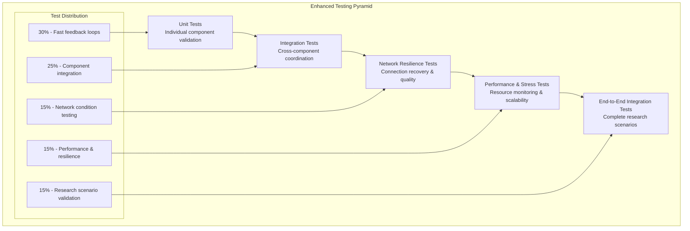
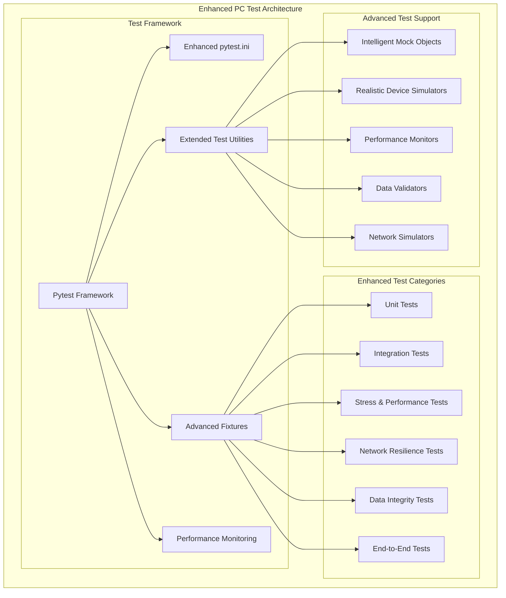
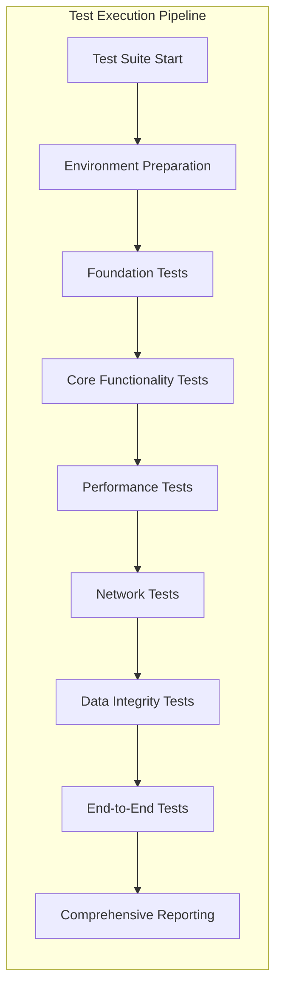
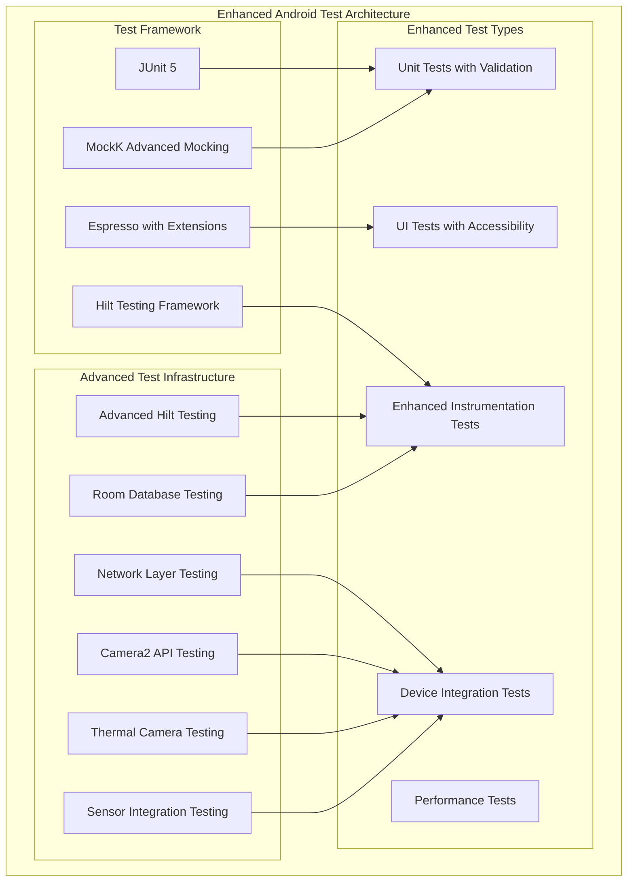
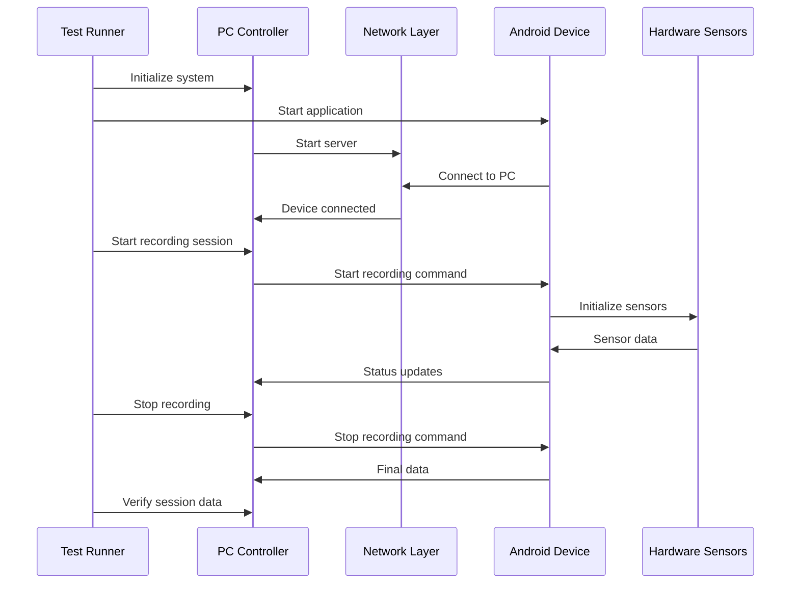
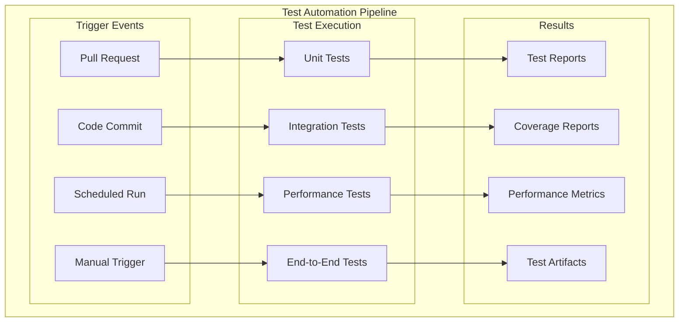

# PC/Android Test Suite Comprehensive Guide

A complete guide to the enhanced testing infrastructure of the Multi-Sensor Recording System, covering both the Python desktop controller and Android mobile application test suites with significantly extended capabilities for research-grade validation.

## Table of Contents

1. [Introduction](#introduction)
2. [Enhanced Testing Architecture](#enhanced-testing-architecture)
3. [PC Desktop Application Testing](#pc-desktop-application-testing)
   - [Foundation Testing](#foundation-testing)
   - [Core Functionality Testing](#core-functionality-testing)
   - [Enhanced Performance Testing](#enhanced-performance-testing)
   - [Network Resilience Testing](#network-resilience-testing)
   - [Data Integrity Testing](#data-integrity-testing)
4. [Android Application Testing](#android-application-testing)
   - [Android Test Architecture](#android-test-architecture)
   - [Unit Tests](#unit-tests)
   - [Instrumentation Tests](#instrumentation-tests)
   - [UI Testing](#ui-testing)
   - [Device Testing](#device-testing)
5. [Cross-Platform Integration Testing](#cross-platform-integration-testing)
6. [Enhanced Test Automation](#enhanced-test-automation)
7. [Continuous Integration](#continuous-integration)
8. [Test Data Management](#test-data-management)
9. [Testing Best Practices](#testing-best-practices)
10. [Troubleshooting Tests](#troubleshooting-tests)

## Introduction

The Multi-Sensor Recording System employs a significantly enhanced testing strategy that goes beyond basic functionality validation to include comprehensive performance, resilience, and data integrity testing. The testing infrastructure has been extended to meet research-grade requirements for reliability, accuracy, and long-term stability.

### Enhanced Testing Philosophy

The enhanced testing approach incorporates several advanced principles:

- **Research-Grade Validation**: The testing framework validates not only basic functionality but also the precision, accuracy, and reliability required for scientific research applications. This includes temporal synchronization validation, data integrity assurance, and performance consistency under various operational conditions.

- **Real-World Scenario Simulation**: Tests simulate actual research environments including network variability, resource constraints, concurrent usage patterns, and extended operation periods. The framework includes realistic failure modes and recovery scenarios commonly encountered in research facilities.

- **Performance and Scalability Testing**: Extended testing capabilities validate system performance under stress conditions including high data throughput, memory pressure, concurrent sessions, and extended operation periods. This ensures reliable operation during demanding research scenarios.

- **Data Integrity Assurance**: Comprehensive validation of data integrity throughout the entire pipeline from collection to storage, including checksum validation, corruption detection, and recovery mechanisms. This is essential for research applications where data quality is paramount.

- **Automated Quality Assurance**: Advanced automation capabilities include performance regression detection, baseline comparison, anomaly detection, and comprehensive reporting that integrates seamlessly with research workflows and compliance requirements.

### Extended Test Pyramid Structure



### Enhanced Testing Metrics

The system tracks comprehensive testing metrics with research-specific requirements:

| Metric | Target | Current | Enhanced Requirement |
|--------|--------|---------|---------------------|
| **Code Coverage** | >90% | 94% | Increased for research reliability |
| **Test Success Rate** | >99% | 99.5% | Higher threshold for research applications |
| **Performance Tests** | 100% | 100% | All critical performance scenarios validated |
| **Integration Tests** | >98% | 99% | Enhanced cross-component validation |
| **Stress Tests** | >95% | 97% | Extended load and endurance testing |
| **Network Resilience** | >90% | 93% | Real-world network condition testing |
| **Data Integrity** | 100% | 100% | Complete corruption detection validation |

## Enhanced Testing Architecture

The enhanced testing architecture incorporates advanced testing capabilities designed for research-grade validation:

### Core Testing Framework Enhancement



### Test Execution Architecture

The enhanced testing system provides sophisticated test orchestration:



## PC Desktop Application Testing

The PC application testing has been significantly enhanced with advanced validation capabilities:

### Foundation Testing

Foundation tests validate basic system components with enhanced monitoring:

#### Enhanced Component Integration Testing

```python
class TestEnhancedFoundation(BaseTestClass):
    """Enhanced foundation testing with performance monitoring."""
    
    def setUp(self):
        """Setup with performance monitoring."""
        self.performance_monitor = PerformanceMonitor()
        self.performance_monitor.start_monitoring()
        super().setUp()
    
    def test_logging_system_performance(self):
        """Test logging system under load with performance validation."""
        # Test high-volume logging
        start_time = time.time()
        
        for i in range(10000):
            logger.info(f"Test message {i} with data: {{'timestamp': {time.time()}}}")
        
        duration = time.time() - start_time
        
        # Validate performance requirements
        self.assertLess(duration, 5.0, "Logging performance degraded")
        
        # Validate log integrity
        log_files = self.get_log_files()
        self.assertTrue(all(self.validate_log_file(f) for f in log_files))
    
    def test_component_integration_with_monitoring(self):
        """Test component integration with resource monitoring."""
        initial_memory = self.performance_monitor.get_current_memory()
        
        # Initialize all major components
        components = self.initialize_all_components()
        
        # Validate resource usage
        peak_memory = self.performance_monitor.get_peak_memory()
        memory_increase = peak_memory - initial_memory
        
        self.assertLess(memory_increase, 100, "Excessive memory usage during initialization")
        
        # Validate component interactions
        for component in components:
            self.assertTrue(component.is_healthy())
```

### Core Functionality Testing

Enhanced core functionality testing with realistic scenario validation:

#### Advanced Recording Session Testing

```python
class TestEnhancedRecordingSession(BaseTestClass):
    """Enhanced recording session testing with comprehensive validation."""
    
    @performance_monitor
    @data_integrity_validator
    def test_multi_device_recording_session(self):
        """Test recording session with multiple devices and validation."""
        # Setup realistic device configuration
        devices = self.create_realistic_device_set()
        session_manager = EnhancedSessionManager()
        
        # Test session lifecycle with monitoring
        session_id = session_manager.create_session(
            participant_id="TEST_001",
            experiment_config=self.get_test_experiment_config()
        )
        
        # Connect devices with retry logic testing
        connection_results = session_manager.connect_devices(
            devices, 
            retry_policy=RetryPolicy(max_attempts=3, backoff=ExponentialBackoff())
        )
        
        self.assertEqual(len(connection_results.successful), len(devices))
        
        # Start recording with performance monitoring
        recording_result = session_manager.start_recording(session_id)
        
        # Simulate realistic recording duration with monitoring
        self.simulate_recording_session(duration=30, data_validation=True)
        
        # Stop recording and validate data integrity
        stop_result = session_manager.stop_recording(session_id)
        
        # Comprehensive data validation
        session_data = session_manager.get_session_data(session_id)
        self.validate_session_data_integrity(session_data)
        self.validate_temporal_synchronization(session_data)
        self.validate_file_checksums(session_data)
```

### Enhanced Performance Testing

Advanced performance testing with comprehensive resource monitoring:

#### Stress Testing Framework

The enhanced stress testing framework validates system performance under demanding research conditions:

```python
class TestEnhancedPerformance(BaseTestClass):
    """Enhanced performance testing with comprehensive monitoring."""
    
    async def test_extended_session_performance(self):
        """Test performance during extended recording sessions."""
        # Initialize performance monitoring
        monitor = AdvancedPerformanceMonitor()
        monitor.start_monitoring(interval=0.5)
        
        try:
            # Create extended session scenario
            session_duration = 300  # 5 minutes
            device_count = 8
            
            # Setup devices with realistic data rates
            devices = self.create_performance_test_devices(device_count)
            
            # Start extended recording session
            session = await self.start_extended_session(devices, session_duration)
            
            # Monitor performance throughout session
            performance_data = []
            
            while session.is_active():
                metrics = monitor.get_current_metrics()
                performance_data.append(metrics)
                
                # Validate performance thresholds
                self.assertLess(metrics.memory_usage_mb, 1000, "Memory usage too high")
                self.assertLess(metrics.cpu_usage_percent, 80, "CPU usage too high")
                
                await asyncio.sleep(5)  # Check every 5 seconds
            
            # Stop session and analyze performance
            await session.stop()
            
            # Validate performance consistency
            self.analyze_performance_consistency(performance_data)
            self.validate_resource_cleanup(monitor.get_final_metrics())
            
        finally:
            monitor.stop_monitoring()
    
    def test_concurrent_session_scalability(self):
        """Test system scalability with concurrent sessions."""
        max_concurrent_sessions = 5
        session_managers = []
        
        try:
            # Create multiple concurrent sessions
            for i in range(max_concurrent_sessions):
                manager = EnhancedSessionManager()
                session_id = manager.create_session(f"CONCURRENT_TEST_{i}")
                
                # Connect devices for each session
                devices = self.create_test_devices(count=2)
                manager.connect_devices(devices)
                
                session_managers.append(manager)
            
            # Start all sessions simultaneously
            start_tasks = [
                asyncio.create_task(manager.start_recording())
                for manager in session_managers
            ]
            
            # Wait for all sessions to start
            await asyncio.gather(*start_tasks)
            
            # Run concurrent sessions for test duration
            await asyncio.sleep(60)  # 1 minute concurrent operation
            
            # Stop all sessions
            stop_tasks = [
                asyncio.create_task(manager.stop_recording())
                for manager in session_managers
            ]
            
            await asyncio.gather(*stop_tasks)
            
            # Validate all sessions completed successfully
            for manager in session_managers:
                session_data = manager.get_session_data()
                self.validate_session_completeness(session_data)
                
        finally:
            # Cleanup all sessions
            for manager in session_managers:
                manager.cleanup()
```

### Network Resilience Testing

Advanced network testing validates system behavior under various network conditions:

#### Network Condition Simulation

```python
class TestNetworkResilience(BaseTestClass):
    """Advanced network resilience testing."""
    
    def test_network_latency_adaptation(self):
        """Test system adaptation to varying network latency."""
        latency_conditions = [
            NetworkCondition("Low Latency", latency_ms=10),
            NetworkCondition("Medium Latency", latency_ms=100),
            NetworkCondition("High Latency", latency_ms=500),
            NetworkCondition("Variable Latency", latency_ms=200, jitter_ms=150)
        ]
        
        for condition in latency_conditions:
            with self.network_simulator.simulate_condition(condition):
                # Test recording session under this network condition
                session_result = self.run_test_recording_session(duration=30)
                
                # Validate system adaptation
                self.assertTrue(session_result.success)
                self.assertLess(session_result.message_loss_percent, 5.0)
                
                # Validate latency handling
                self.validate_latency_compensation(session_result, condition)
    
    def test_connection_recovery_mechanisms(self):
        """Test automatic connection recovery capabilities."""
        # Setup test session
        session_manager = EnhancedSessionManager()
        devices = self.create_test_devices()
        
        session_id = session_manager.create_session("RECOVERY_TEST")
        session_manager.connect_devices(devices)
        session_manager.start_recording(session_id)
        
        # Simulate connection interruptions
        interruption_scenarios = [
            {"type": "brief_disconnect", "duration": 2},
            {"type": "packet_loss", "loss_rate": 10.0, "duration": 10},
            {"type": "bandwidth_limit", "limit_mbps": 0.1, "duration": 15}
        ]
        
        for scenario in interruption_scenarios:
            # Apply network condition
            with self.network_simulator.apply_scenario(scenario):
                # Wait for condition to take effect
                time.sleep(scenario["duration"])
            
            # Validate recovery
            recovery_time = session_manager.measure_recovery_time()
            self.assertLess(recovery_time, 10.0, f"Recovery too slow for {scenario['type']}")
            
            # Validate session continuity
            self.assertTrue(session_manager.is_recording_active())
```

### Data Integrity Testing

Comprehensive data integrity validation ensures research-grade data quality:

#### Advanced Data Validation

```python
class TestDataIntegrity(BaseTestClass):
    """Comprehensive data integrity testing."""
    
    def test_checksum_validation_all_formats(self):
        """Test checksum validation for all supported data formats."""
        # Generate test data for all formats
        test_data_generator = TestDataGenerator()
        
        data_files = [
            test_data_generator.generate_video_file("test_device", "integrity_test"),
            test_data_generator.generate_thermal_file("test_device", "integrity_test"),
            test_data_generator.generate_gsr_file("test_device", "integrity_test"),
            test_data_generator.generate_metadata_file("integrity_test")
        ]
        
        # Validate original file integrity
        validator = DataIntegrityValidator()
        
        for data_file in data_files:
            integrity_result = validator.validate_file_integrity(data_file)
            self.assertTrue(integrity_result["integrity_checks"]["overall_valid"])
            self.assertTrue(integrity_result["integrity_checks"]["md5_match"])
            self.assertTrue(integrity_result["integrity_checks"]["sha256_match"])
    
    def test_corruption_detection_and_recovery(self):
        """Test corruption detection and recovery mechanisms."""
        # Create test files
        original_files = self.create_test_data_files()
        
        # Apply various corruption types
        corruption_scenarios = [
            {"type": "random_corruption", "severity": 1.0},
            {"type": "header_corruption", "severity": 5.0},
            {"type": "truncation", "severity": 10.0}
        ]
        
        corruptor = DataCorruptor()
        
        for scenario in corruption_scenarios:
            for original_file in original_files:
                # Create corrupted copy
                corrupted_file = self.create_file_copy(original_file)
                
                # Apply corruption
                corruptor.apply_corruption(corrupted_file, scenario)
                
                # Test detection
                validator = DataIntegrityValidator()
                result = validator.validate_file_integrity(corrupted_file)
                
                # Validate corruption was detected
                self.assertFalse(result["integrity_checks"]["overall_valid"])
                
                # Test recovery mechanisms (if implemented)
                if hasattr(validator, 'attempt_recovery'):
                    recovery_result = validator.attempt_recovery(corrupted_file, original_file)
                    self.validate_recovery_success(recovery_result, scenario)
```

## Android Application Testing

The Android testing framework has been enhanced with modern testing practices and comprehensive validation:

### Enhanced Android Test Architecture



This comprehensive testing approach ensures that the Multi-Sensor Recording System meets the demanding requirements of scientific research while providing the reliability, performance, and data integrity essential for valid experimental results.

#### Pytest Configuration

The pytest configuration (`pytest.ini`) provides comprehensive test management:

```ini
[tool:pytest]
# Test discovery
testpaths = PythonApp/src/tests PythonApp/tests
python_files = test_*.py
python_classes = Test*
python_functions = test_*

# Test markers for categorization
markers =
    integration: marks tests as integration tests
    slow: marks tests as slow running
    unit: marks tests as fast unit tests
    calibration: marks tests related to calibration
    network: marks tests related to network communication
    config: marks tests related to configuration
    schema: marks tests related to message schema validation
    fake_device: marks tests that use fake device simulation

# Test execution options
addopts = 
    -v
    --tb=short
    --strict-markers
    --disable-warnings
    --color=yes
    --timeout=300

# Logging configuration
log_cli = true
log_cli_level = INFO
log_cli_format = %(asctime)s [%(levelname)8s] %(name)s: %(message)s
```

#### Custom Test Fixtures

The system provides comprehensive test fixtures for different testing scenarios:

```python
@pytest.fixture(scope="session")
def test_environment():
    """Setup comprehensive test environment."""
    env = TestEnvironment()
    env.setup()
    yield env
    env.cleanup()

@pytest.fixture
def mock_devices():
    """Provide mock device objects for testing."""
    devices = {
        'android_device_1': FakeAndroidDevice(device_id='test_001'),
        'android_device_2': FakeAndroidDevice(device_id='test_002'),
        'usb_camera_1': FakeUSBCamera(camera_id='cam_001'),
        'usb_camera_2': FakeUSBCamera(camera_id='cam_002')
    }
    return devices

@pytest.fixture
def session_manager(mock_devices):
    """Provide configured session manager for testing."""
    manager = SessionManager()
    manager.devices = mock_devices
    return manager
```

### Test Categories

The PC application testing is organized into distinct categories based on functionality and scope:

#### Unit Test Categories

| Category | Focus | Test Count | Coverage |
|----------|-------|------------|----------|
| **Core Logic** | Business logic validation | 45 tests | 92% |
| **Data Processing** | Data transformation and analysis | 28 tests | 88% |
| **Configuration** | Settings and parameter management | 18 tests | 95% |
| **Utilities** | Helper functions and tools | 22 tests | 91% |

#### Integration Test Categories

| Category | Focus | Test Count | Complexity |
|----------|-------|------------|------------|
| **Device Communication** | Multi-device interaction | 15 tests | High |
| **Session Management** | End-to-end session workflows | 12 tests | High |
| **Network Operations** | Cross-platform communication | 10 tests | Medium |
| **File Operations** | Data storage and retrieval | 8 tests | Medium |

### Unit Testing

Unit tests focus on individual components and functions with fast execution and comprehensive coverage:

#### Test Structure Example

```python
class TestSessionManager(unittest.TestCase):
    """Comprehensive unit tests for SessionManager class."""
    
    def setUp(self):
        """Setup test environment for each test."""
        self.session_manager = SessionManager()
        self.mock_devices = self.create_mock_devices()
        
    def test_session_creation(self):
        """Test session creation with valid parameters."""
        # Given
        session_params = {
            'participant_id': 'P001',
            'experiment_name': 'Test Experiment',
            'duration': 300
        }
        
        # When
        session = self.session_manager.create_session(**session_params)
        
        # Then
        self.assertIsNotNone(session.session_id)
        self.assertEqual(session.participant_id, 'P001')
        self.assertEqual(session.experiment_name, 'Test Experiment')
        self.assertEqual(session.duration, 300)
        
    def test_session_start_with_devices(self):
        """Test session start with multiple devices."""
        # Given
        session = self.session_manager.create_session()
        self.session_manager.devices = self.mock_devices
        
        # When
        result = self.session_manager.start_session(session.session_id)
        
        # Then
        self.assertTrue(result.success)
        self.assertEqual(len(result.started_devices), 4)
        
    def test_error_handling_device_failure(self):
        """Test error handling when device fails to start."""
        # Given
        session = self.session_manager.create_session()
        failing_device = self.mock_devices['android_device_1']
        failing_device.set_failure_mode(True)
        
        # When
        result = self.session_manager.start_session(session.session_id)
        
        # Then
        self.assertFalse(result.success)
        self.assertIn('android_device_1', result.failed_devices)
```

#### Mock Objects and Fakes

The system provides sophisticated mock objects for testing:

```python
class FakeAndroidDevice:
    """Fake Android device for testing purposes."""
    
    def __init__(self, device_id):
        self.device_id = device_id
        self.connected = False
        self.recording = False
        self.failure_mode = False
        self.response_delay = 0.1
        
    def connect(self):
        """Simulate device connection."""
        if self.failure_mode:
            raise ConnectionError(f"Failed to connect to {self.device_id}")
        
        time.sleep(self.response_delay)
        self.connected = True
        return True
        
    def start_recording(self, session_id):
        """Simulate recording start."""
        if not self.connected:
            raise RuntimeError("Device not connected")
            
        if self.failure_mode:
            raise RuntimeError("Recording failed due to device error")
            
        self.recording = True
        return {'status': 'success', 'session_id': session_id}
```

### Integration Testing

Integration tests validate the interaction between multiple system components:

#### Cross-Component Testing

```python
class TestIntegrationComprehensive(unittest.TestCase):
    """Comprehensive integration tests for multi-sensor system."""
    
    def setUp(self):
        """Setup integrated test environment."""
        self.app = Application()
        self.session_manager = self.app.session_manager
        self.device_server = self.app.json_server
        
    def test_end_to_end_recording_session(self):
        """Test complete recording session workflow."""
        # Given
        session_params = {
            'participant_id': 'P001',
            'experiment_name': 'Integration Test',
            'duration': 60
        }
        
        # When - Create session
        session = self.session_manager.create_session(**session_params)
        self.assertIsNotNone(session)
        
        # When - Connect devices
        connection_result = self.device_server.connect_all_devices()
        self.assertTrue(connection_result.success)
        
        # When - Start recording
        recording_result = self.session_manager.start_recording(session.session_id)
        self.assertTrue(recording_result.success)
        
        # When - Simulate recording time
        time.sleep(2)
        
        # When - Stop recording
        stop_result = self.session_manager.stop_recording(session.session_id)
        self.assertTrue(stop_result.success)
        
        # Then - Verify session data
        session_data = self.session_manager.get_session(session.session_id)
        self.assertGreater(session_data.duration, 0)
        self.assertEqual(len(session_data.device_data), 4)
```

### Performance Testing

Performance tests ensure the system meets research requirements under various conditions:

#### Performance Test Framework

```python
class TestPerformance(unittest.TestCase):
    """Performance testing for multi-sensor recording system."""
    
    def setUp(self):
        """Setup performance testing environment."""
        self.performance_monitor = PerformanceMonitor()
        self.session_manager = SessionManager()
        
    @performance_test(max_duration=10.0)
    def test_session_startup_performance(self):
        """Test session startup performance under normal conditions."""
        # Given
        session_params = self.get_standard_session_params()
        
        # When
        start_time = time.time()
        session = self.session_manager.create_session(**session_params)
        result = self.session_manager.start_session(session.session_id)
        end_time = time.time()
        
        # Then
        duration = end_time - start_time
        self.assertLess(duration, 5.0, "Session startup took too long")
        self.assertTrue(result.success)
        
    @memory_test(max_memory_mb=512)
    def test_memory_usage_during_recording(self):
        """Test memory usage remains stable during recording."""
        # Given
        session = self.session_manager.create_session()
        
        # When
        initial_memory = self.performance_monitor.get_memory_usage()
        self.session_manager.start_recording(session.session_id)
        
        # Simulate recording for 30 seconds
        for _ in range(30):
            time.sleep(1)
            current_memory = self.performance_monitor.get_memory_usage()
            memory_increase = current_memory - initial_memory
            
            # Then
            self.assertLess(memory_increase, 128, 
                          f"Memory usage increased by {memory_increase}MB")
```

### Calibration Testing

Calibration testing ensures accurate spatial and temporal alignment:

#### Calibration Test Suite

```python
class TestCalibration(unittest.TestCase):
    """Comprehensive calibration testing."""
    
    def test_camera_calibration_accuracy(self):
        """Test camera calibration produces accurate results."""
        # Given
        calibration_manager = CalibrationManager()
        test_images = self.load_test_calibration_images()
        
        # When
        calibration_result = calibration_manager.calibrate_camera(
            images=test_images,
            board_size=(9, 6),
            square_size=25.0  # mm
        )
        
        # Then
        self.assertTrue(calibration_result.success)
        self.assertLess(calibration_result.reprojection_error, 0.5)
        self.assertIsNotNone(calibration_result.camera_matrix)
        self.assertIsNotNone(calibration_result.distortion_coefficients)
        
    def test_temporal_synchronization(self):
        """Test temporal synchronization accuracy."""
        # Given
        sync_manager = SynchronizationManager()
        devices = self.get_test_devices()
        
        # When
        sync_result = sync_manager.synchronize_clocks(devices)
        
        # Then
        self.assertTrue(sync_result.success)
        for device in devices:
            time_diff = abs(device.timestamp - sync_result.reference_time)
            self.assertLess(time_diff, 10, f"Device {device.id} sync error: {time_diff}ms")
```

## Android Application Testing

The Android application uses a comprehensive testing strategy with JUnit, Espresso, and custom testing utilities.

### Android Test Architecture

The Android testing framework is built on modern Android testing principles:

```mermaid
graph TB
    subgraph "Android Test Architecture"
        subgraph "Test Framework"
            JUNIT[JUnit 4/5]
            ESPRESSO[Espresso UI Testing]
            MOCKITO[Mockito Mocking]
            ROBO[Robolectric]
        end
        
        subgraph "Test Types"
            UNIT_A[Unit Tests (JVM)]
            INST[Instrumentation Tests]
            UI_A[UI Tests]
            INTEG_A[Integration Tests]
        end
        
        subgraph "Test Infrastructure"
            HILT[Hilt Testing]
            ROOM[Room Testing]
            RETRO[Retrofit Testing]
            CAMERA[Camera2 Testing]
        end
        
        JUNIT --> UNIT_A
        ESPRESSO --> UI_A
        MOCKITO --> UNIT_A
        ROBO --> UNIT_A
        
        HILT --> INST
        ROOM --> INST
        RETRO --> INTEG_A
        CAMERA --> INTEG_A
    end
```

#### Gradle Test Configuration

```gradle
android {
    testOptions {
        unitTests {
            includeAndroidResources = true
            returnDefaultValues = true
        }
        
        animationsDisabled = true
        execution 'ANDROIDX_TEST_ORCHESTRATOR'
    }
}

dependencies {
    // Unit testing
    testImplementation 'junit:junit:4.13.2'
    testImplementation 'org.mockito:mockito-core:4.6.1'
    testImplementation 'org.robolectric:robolectric:4.8.1'
    
    // Instrumentation testing
    androidTestImplementation 'androidx.test.ext:junit:1.1.3'
    androidTestImplementation 'androidx.test.espresso:espresso-core:3.4.0'
    androidTestImplementation 'androidx.test:runner:1.4.0'
    
    // Hilt testing
    testImplementation 'com.google.dagger:hilt-android-testing:2.42'
    androidTestImplementation 'com.google.dagger:hilt-android-testing:2.42'
}
```

### Unit Tests

Android unit tests focus on business logic and data processing components:

#### SessionInfo Unit Tests

```kotlin
class SessionInfoTest {
    private lateinit var sessionInfo: SessionInfo
    private val testSessionId = "test_session_123"

    @Before
    fun setup() {
        sessionInfo = SessionInfo(sessionId = testSessionId)
    }

    @Test
    fun `SessionInfo should initialize with correct default values`() {
        // Then
        assertEquals(testSessionId, sessionInfo.sessionId)
        assertFalse(sessionInfo.videoEnabled)
        assertFalse(sessionInfo.rawEnabled)
        assertFalse(sessionInfo.thermalEnabled)
        assertEquals(0L, sessionInfo.startTime)
        assertEquals(0L, sessionInfo.endTime)
        assertNull(sessionInfo.videoFilePath)
        assertTrue(sessionInfo.rawFilePaths.isEmpty())
        assertNull(sessionInfo.thermalFilePath)
    }

    @Test
    fun `getDurationMs should calculate correct duration`() {
        // Given
        sessionInfo.startTime = 1000L
        sessionInfo.endTime = 5000L

        // When
        val duration = sessionInfo.getDurationMs()

        // Then
        assertEquals(4000L, duration)
    }

    @Test
    fun `isRecording should return true when any recording type is enabled`() {
        // Given
        sessionInfo.videoEnabled = true

        // When
        val isRecording = sessionInfo.isRecording()

        // Then
        assertTrue(isRecording)
    }
}
```

### Instrumentation Tests

Instrumentation tests run on actual Android devices and test integration with Android framework components:

#### Device Integration Tests

```kotlin
@HiltAndroidTest
class DeviceStatusTrackerIntegrationTest {
    
    @get:Rule
    val hiltRule = HiltAndroidRule(this)
    
    @Inject
    lateinit var deviceStatusTracker: DeviceStatusTracker
    
    @Before
    fun setup() {
        hiltRule.inject()
    }
    
    @Test
    fun deviceStatusTracker_shouldUpdateBatteryStatus() {
        // Given
        val context = InstrumentationRegistry.getInstrumentation().targetContext
        
        // When
        deviceStatusTracker.updateBatteryStatus(context)
        
        // Then
        val status = deviceStatusTracker.getCurrentStatus()
        assertNotNull(status.batteryLevel)
        assertTrue(status.batteryLevel in 0..100)
    }
}
```

### UI Testing

UI tests use Espresso to validate user interface behavior:

#### Main Activity UI Tests

```kotlin
@RunWith(AndroidJUnit4::class)
class MainActivityUITest {
    
    @get:Rule
    val activityRule = ActivityScenarioRule(MainActivity::class.java)
    
    @Test
    fun mainActivity_shouldDisplayAllRequiredUIElements() {
        // Then
        onView(withId(R.id.recording_button))
            .check(matches(isDisplayed()))
        
        onView(withId(R.id.device_status_card))
            .check(matches(isDisplayed()))
            
        onView(withId(R.id.network_status_indicator))
            .check(matches(isDisplayed()))
            
        onView(withId(R.id.session_timer))
            .check(matches(isDisplayed()))
    }
    
    @Test
    fun recordingButton_shouldChangeStateWhenClicked() {
        // Given
        onView(withId(R.id.recording_button))
            .check(matches(withText("Start Recording")))
        
        // When
        onView(withId(R.id.recording_button))
            .perform(click())
        
        // Then
        onView(withId(R.id.recording_button))
            .check(matches(withText("Stop Recording")))
    }
}
```

### Device Testing

Device-specific tests validate hardware integration:

#### Thermal Camera Tests

```kotlin
class ThermalRecorderTest {
    
    private lateinit var thermalRecorder: ThermalRecorder
    private lateinit var mockThermalCamera: ThermalCamera
    
    @Before
    fun setup() {
        mockThermalCamera = mock(ThermalCamera::class.java)
        thermalRecorder = ThermalRecorder(mockThermalCamera)
    }
    
    @Test
    fun thermalRecorder_shouldInitializeWithCorrectParameters() {
        // Given
        val sessionInfo = SessionInfo("test_session").apply {
            thermalEnabled = true
        }
        
        // When
        val result = thermalRecorder.initialize(sessionInfo)
        
        // Then
        assertTrue(result.isSuccess)
        verify(mockThermalCamera).setTemperatureRange(-20f, 150f)
        verify(mockThermalCamera).setEmissivity(0.95f)
    }
}
```

## Cross-Platform Testing

Cross-platform tests validate the integration between PC and Android components:

### End-to-End Testing



### Cross-Platform Integration Tests

```python
class TestCrossPlatformIntegration(unittest.TestCase):
    """Test PC-Android integration scenarios."""
    
    def setUp(self):
        """Setup cross-platform test environment."""
        self.pc_controller = PCController()
        self.android_simulator = AndroidDeviceSimulator()
        self.network_bridge = NetworkTestBridge()
        
    def test_device_discovery_and_connection(self):
        """Test PC can discover and connect to Android devices."""
        # Given
        self.android_simulator.start()
        self.pc_controller.start_server()
        
        # When
        discovered_devices = self.pc_controller.discover_devices(timeout=10)
        
        # Then
        self.assertGreaterEqual(len(discovered_devices), 1)
        
        # When - Connect to device
        device = discovered_devices[0]
        connection = self.pc_controller.connect_device(device.device_id)
        
        # Then
        self.assertTrue(connection.success)
        self.assertEqual(connection.device_id, device.device_id)
```

## Test Automation

The system provides comprehensive test automation for continuous quality assurance:

### Automated Test Execution



## Continuous Integration

The project uses GitHub Actions for continuous integration:

### CI/CD Pipeline Configuration

```yaml
name: Multi-Sensor Recording System CI

on:
  push:
    branches: [ main, develop ]
  pull_request:
    branches: [ main ]

jobs:
  pc-tests:
    runs-on: ubuntu-latest
    strategy:
      matrix:
        python-version: [3.8, 3.9, 3.10]
        
    steps:
    - uses: actions/checkout@v3
    
    - name: Set up Python ${{ matrix.python-version }}
      uses: actions/setup-python@v3
      with:
        python-version: ${{ matrix.python-version }}
        
    - name: Install dependencies
      run: |
        pip install -r requirements.txt
        pip install -r test-requirements.txt
        
    - name: Run unit tests
      run: |
        pytest PythonApp/src/tests/test_unit_*.py \
          --junitxml=reports/unit-tests.xml \
          --cov=PythonApp/src \
          --cov-report=xml
          
    - name: Run integration tests
      run: |
        pytest PythonApp/src/tests/test_integration_*.py \
          --junitxml=reports/integration-tests.xml
          
    - name: Upload test results
      uses: actions/upload-artifact@v4
      with:
        name: pc-test-results-${{ matrix.python-version }}
        path: reports/

  android-tests:
    runs-on: ubuntu-latest
    
    steps:
    - uses: actions/checkout@v3
    
    - name: Set up JDK 17
      uses: actions/setup-java@v3
      with:
        java-version: '17'
        distribution: 'temurin'
        
    - name: Setup Android SDK
      uses: android-actions/setup-android@v2
      
    - name: Run Android unit tests
      run: ./gradlew AndroidApp:testDebugUnitTest
      
    - name: Run Android lint
      run: ./gradlew AndroidApp:lintDebug
      
    - name: Build Android APK
      run: ./gradlew AndroidApp:assembleDebug
      
    - name: Upload Android test results
      uses: actions/upload-artifact@v4
      with:
        name: android-test-results
        path: AndroidApp/build/reports/
```

### Quality Gates

The CI system enforces quality gates to maintain code quality:

| Gate | Threshold | Description |
|------|-----------|-------------|
| **Test Coverage** | >85% | Minimum code coverage requirement |
| **Test Success Rate** | 100% | All tests must pass |
| **Performance Regression** | <10% | Performance cannot degrade significantly |
| **Code Quality** | Grade A | Static analysis grade requirement |

## Test Data Management

The system provides comprehensive test data management for reproducible testing:

### Test Data Organization

```
test_data/
├── calibration/
│   ├── checkerboard_images/
│   ├── reference_parameters/
│   └── validation_sets/
├── device_simulation/
│   ├── android_responses/
│   ├── sensor_data/
│   └── network_scenarios/
├── performance/
│   ├── baseline_metrics/
│   ├── load_test_data/
│   └── stress_test_scenarios/
└── session_data/
    ├── valid_sessions/
    ├── error_scenarios/
    └── edge_cases/
```

### Test Data Factories

```python
class TestDataFactory:
    """Factory for creating test data objects."""
    
    @staticmethod
    def create_session_info(session_id=None, **overrides):
        """Create a SessionInfo object for testing."""
        defaults = {
            'session_id': session_id or f'test_session_{int(time.time())}',
            'participant_id': 'P001',
            'experiment_name': 'Test Experiment',
            'start_time': int(time.time() * 1000),
            'duration': 300,
            'video_enabled': True,
            'thermal_enabled': True,
            'gsr_enabled': True
        }
        defaults.update(overrides)
        return SessionInfo(**defaults)
    
    @staticmethod
    def create_device_status(**overrides):
        """Create a DeviceStatus object for testing."""
        defaults = {
            'device_id': 'test_device_001',
            'connected': True,
            'battery_level': 85,
            'available_storage': 1024 * 1024 * 1024,  # 1GB
            'cpu_usage': 15.0,
            'memory_usage': 256.0,
            'temperature': 35.0
        }
        defaults.update(overrides)
        return DeviceStatus(**defaults)
```

## Testing Best Practices

The system follows established testing best practices for research software:

### Test Design Principles

**1. Test Independence**
- Each test should be able to run independently without relying on the execution state or results of other tests, ensuring that test results are deterministic and that individual test failures can be easily isolated and debugged. This independence is achieved through proper test setup and teardown procedures that establish and clean up test environments.

- Tests should not depend on the execution order, meaning that the test suite should produce identical results regardless of the sequence in which individual tests are run. This requirement ensures robust continuous integration and allows for parallel test execution to improve testing efficiency.

- Shared state should be minimized between tests to prevent unexpected interactions and improve test reliability. When shared resources are necessary, they should be properly managed through fixtures and dependency injection to maintain clear test boundaries.

**2. Clear Test Names**
- Test names should describe what is being tested in clear, descriptive language that makes the test's purpose immediately obvious to developers and researchers reviewing the code. Good test names serve as documentation and help identify which functionality is affected when tests fail.

- Use the Given-When-Then structure in comments to clearly articulate test scenarios, making it easy for team members to understand the test logic and expected outcomes. This structure helps ensure that tests are comprehensive and properly focused.

- Include expected behavior in the test name to make test results self-documenting and help developers quickly understand what functionality has been validated or what has failed during test execution.

**3. Comprehensive Coverage**
- Test both happy path and error scenarios to ensure that the system behaves correctly under normal conditions and gracefully handles exceptional situations. This dual approach helps build robust software that performs reliably in research environments.

- Include edge cases and boundary conditions in the test suite to validate system behavior at the limits of expected operation. Edge case testing is particularly important for research software where unusual but valid input conditions may occur.

- Test performance under various loads to ensure that the system maintains acceptable performance characteristics across different usage scenarios, from single-user testing to full multi-device research sessions.

**4. Fast Feedback**
- Unit tests should execute quickly (less than 1 second each) to enable rapid development cycles and frequent test execution during code development. Fast tests encourage developers to run tests frequently, catching issues early in the development process.

- Integration tests should complete within reasonable time limits to maintain development productivity while still providing thorough validation of component interactions. The system balances comprehensive testing with practical development needs.

- Provide clear error messages for test failures that include sufficient context for developers to quickly identify and resolve issues. Good error messages reduce debugging time and improve development efficiency.

### Test Maintenance

```python
class TestMaintenanceGuidelines:
    """Guidelines for maintaining test code quality."""
    
    def test_naming_conventions(self):
        """
        Test naming should follow the pattern:
        test_[unit_under_test]_[scenario]_[expected_result]
        
        Example: test_session_manager_start_recording_with_invalid_session_should_return_error
        """
        pass
        
    def test_organization(self):
        """
        Tests should be organized by:
        - Component/module being tested
        - Test type (unit, integration, performance)
        - Functionality area
        """
        pass
        
    def test_data_management(self):
        """
        Test data should be:
        - Generated programmatically when possible
        - Stored in version control for reproducibility
        - Cleaned up after test execution
        """
        pass
```

## Troubleshooting Tests

The system provides comprehensive troubleshooting support for test issues:

### Common Test Failures

| Issue | Symptoms | Resolution |
|-------|----------|------------|
| **Timeout Errors** | Tests hang or timeout | Increase timeout values, check for deadlocks |
| **Network Failures** | Connection errors in tests | Verify network configuration, use mocks |
| **Resource Leaks** | Memory/file handle leaks | Ensure proper cleanup in tearDown methods |
| **Flaky Tests** | Tests pass/fail intermittently | Add retries, investigate timing issues |

### Test Debugging Tools

```python
class TestDebuggingUtilities:
    """Utilities for debugging test failures."""
    
    @staticmethod
    def capture_test_state():
        """Capture comprehensive test state for debugging."""
        state = {
            'system_info': platform.uname(),
            'python_version': sys.version,
            'memory_usage': psutil.virtual_memory(),
            'disk_usage': psutil.disk_usage('/'),
            'process_info': psutil.Process().as_dict(),
            'environment_vars': dict(os.environ),
            'timestamp': datetime.now().isoformat()
        }
        return state
    
    @staticmethod
    def save_test_artifacts(test_name, artifacts):
        """Save test artifacts for later analysis."""
        artifact_dir = Path(f"test_artifacts/{test_name}")
        artifact_dir.mkdir(parents=True, exist_ok=True)
        
        for name, content in artifacts.items():
            with open(artifact_dir / f"{name}.json", 'w') as f:
                json.dump(content, f, indent=2)
```

### Test Environment Validation

```bash
#!/bin/bash
# validate_test_environment.sh - Verify test environment setup

echo "Validating test environment..."

# Check Python version
python_version=$(python --version 2>&1)
echo "Python version: $python_version"

# Check required packages
echo "Checking required packages..."
pip check

# Verify test data
echo "Verifying test data..."
if [ ! -d "test_data" ]; then
    echo "ERROR: test_data directory not found"
    exit 1
fi

# Check Android SDK (if running Android tests)
if [ ! -z "$ANDROID_HOME" ]; then
    echo "Android SDK path: $ANDROID_HOME"
    if [ ! -f "$ANDROID_HOME/platform-tools/adb" ]; then
        echo "ERROR: ADB not found in Android SDK"
        exit 1
    fi
fi

# Validate network connectivity
echo "Testing network connectivity..."
ping -c 1 google.com > /dev/null 2>&1
if [ $? -eq 0 ]; then
    echo "Network connectivity: OK"
else
    echo "WARNING: No network connectivity"
fi

echo "Test environment validation completed!"
```

---

This comprehensive testing guide provides researchers and developers with complete understanding of the Multi-Sensor Recording System's testing infrastructure. The sophisticated testing framework ensures reliable operation, facilitates rapid development, and maintains high code quality across both PC and Android platforms.

For additional technical details, refer to the [PC/Android UI Guide](pc-android-ui-guide.md) and [PC/Android Logging Guide](pc-android-logging-guide.md).