# PC/Android UI Comprehensive Guide

A complete guide to the user interfaces of the Multi-Sensor Recording System, covering both the Python desktop controller and Android mobile application interfaces.

## Table of Contents

1. [Introduction](#introduction)
2. [PC Desktop Application UI](#pc-desktop-application-ui)
   - [Main Window Overview](#main-window-overview)
   - [Control Panels](#control-panels)
   - [Device Status Displays](#device-status-displays)
   - [Recording Controls](#recording-controls)
   - [Calibration Interface](#calibration-interface)
   - [Settings and Configuration](#settings-and-configuration)
3. [Android Application UI](#android-application-ui)
   - [Main Activity Layout](#main-activity-layout)
   - [Recording Interface](#recording-interface)
   - [Device Configuration](#device-configuration)
   - [Status Indicators](#status-indicators)
   - [Network Connection](#network-connection)
4. [UI Architecture](#ui-architecture)
   - [PC Application Architecture](#pc-application-architecture)
   - [Android Application Architecture](#android-application-architecture)
   - [Cross-Platform Communication](#cross-platform-communication)
5. [User Interaction Flows](#user-interaction-flows)
6. [Accessibility Features](#accessibility-features)
7. [Troubleshooting UI Issues](#troubleshooting-ui-issues)

## Introduction

The Multi-Sensor Recording System features sophisticated user interfaces designed to provide researchers with intuitive control over complex multi-modal data collection. The system consists of two primary interface components:

- **PC Desktop Controller**: A sophisticated PyQt5-based application that serves as the master control interface for the entire multi-sensor recording system. This desktop application provides researchers with comprehensive oversight of all connected devices, real-time monitoring capabilities, and centralized control over recording sessions. The interface is designed to handle complex multi-modal data collection scenarios while maintaining an intuitive user experience.

- **Android Mobile Application**: A native Kotlin application specifically developed for Samsung S22 devices that acts as a mobile sensor collection platform. These mobile applications capture high-quality camera footage, thermal imaging data, and physiological sensor readings (GSR) while maintaining precise synchronization with the central PC controller. Each Android device operates semi-autonomously while remaining connected to the desktop coordinator for session management and data coordination.

Both interfaces are designed with modern UI principles, featuring clean layouts, intuitive controls, and real-time status monitoring capabilities. The interfaces work together seamlessly to provide synchronized control over multiple sensor modalities.

### Key Design Principles

The UI design follows several core principles that ensure usability in research environments:

- **Clarity**: The interface maintains a clear visual hierarchy with distinct sections for different functions, ensuring that researchers can quickly locate and access the tools they need. Each functional area uses consistent spacing, typography, and color schemes to reduce cognitive load during complex recording sessions.

- **Responsiveness**: The system provides real-time updates of device status and recording progress through live data streams and immediate visual feedback. Status changes are reflected instantly across all interface elements, allowing researchers to monitor system health and recording quality in real-time.

- **Reliability**: Robust error handling mechanisms provide clear user feedback when issues occur, with detailed diagnostic information and suggested remediation steps. The interface gracefully handles device disconnections, network interruptions, and other common research environment challenges.

- **Efficiency**: Streamlined workflows for common research tasks minimize the number of clicks and interactions required to complete standard operations. Keyboard shortcuts, batch operations, and automated sequences help researchers focus on their studies rather than system management.

- **Professional**: The interface features a clean, modern aesthetic suitable for scientific applications, with a professional color palette and typography that maintains readability under various lighting conditions common in research environments.

## PC Desktop Application UI

The PC desktop application serves as the central command center for the entire multi-sensor recording system. Built using PyQt5, it provides comprehensive control over all connected devices and sensors.

### Main Window Overview

The main window features a modern, PsychoPy-inspired design with a professional color scheme and intuitive layout. The interface is organized into distinct functional areas that provide clear visual separation of different system components.

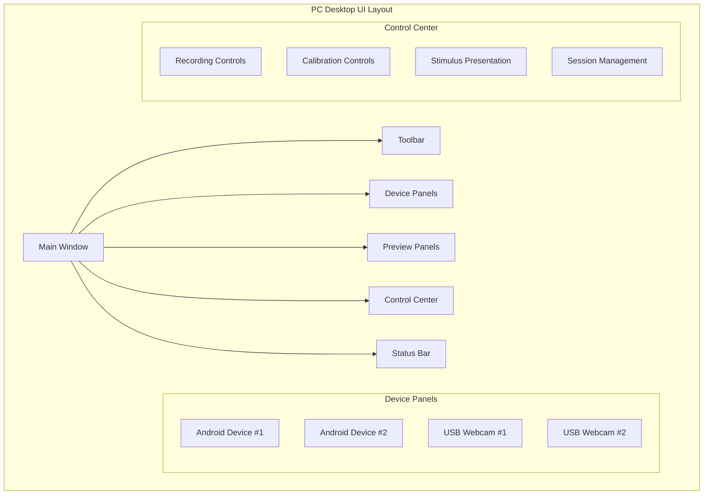

#### Layout Structure

The main window employs a flexible layout system that adapts to different screen sizes and user preferences:

| Component | Position | Purpose |
|-----------|----------|---------|
| **Toolbar** | Top | Quick access to common actions |
| **Device Panels** | Left/Center | Real-time device status and controls |
| **Preview Area** | Center/Right | Live camera feeds and data visualization |
| **Control Center** | Bottom/Right | Recording and calibration controls |
| **Status Bar** | Bottom | System-wide status information |

### Control Panels

The application features several specialized control panels, each designed for specific aspects of the recording system:

#### Recording Control Panel

The recording control panel provides centralized control over all recording devices. It features modern button styling with clear visual feedback for different states.

**Key Features:**
- **Start/Stop Recording**: Primary action buttons featuring distinct styling and immediate visual feedback to clearly indicate the current recording state. These buttons use color-coded backgrounds and iconography to prevent accidental activation and provide confidence in system state during critical recording moments.

- **Session Timer**: A real-time display showing the current recording duration with millisecond precision, helping researchers track session length and ensure compliance with study protocols. The timer includes lap functionality for marking important events during recording sessions.

- **Recording Status**: Comprehensive visual indicators for each connected device's recording state, displaying not only whether recording is active but also data quality metrics, storage utilization, and any warning conditions that require attention.

- **Emergency Stop**: A prominently positioned emergency stop button that immediately halts all recording across all devices while preserving data integrity. This feature includes confirmation prompts and automatic session archiving to protect collected data even during emergency shutdown procedures.

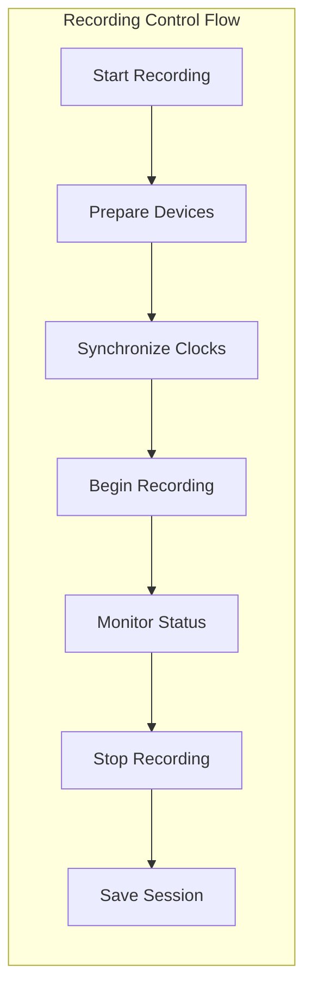

#### Device Status Panel

Each connected device has its own status panel that provides comprehensive information about the device's current state and capabilities.

**Status Categories:**
- **Connection Status**: Comprehensive monitoring of network connectivity and communication health between the PC controller and Android devices. This includes not only basic connectivity but also signal strength, latency measurements, and data transmission quality metrics that help researchers identify potential connectivity issues before they impact data collection.

- **Battery Level**: Detailed power status monitoring for mobile devices, including current charge percentage, estimated remaining recording time, and power consumption trends. The system provides proactive warnings when battery levels approach critical thresholds and can automatically adjust recording parameters to extend session duration.

- **Storage Space**: Real-time monitoring of available storage capacity for recordings on each device, with predictive analysis of storage consumption based on current recording settings. The interface displays both absolute values and estimated remaining recording time based on current data rates.

- **Sensor Status**: Individual monitoring of sensor functionality including camera operation, thermal imaging performance, and GSR sensor readings. Each sensor displays health status, calibration state, and real-time data quality metrics to ensure optimal recording conditions throughout the session.

- **Performance Metrics**: Comprehensive system performance monitoring including CPU usage, memory consumption, and device temperature readings. These metrics help researchers identify potential performance bottlenecks and ensure system stability during extended recording sessions.

#### Calibration Control Panel

The calibration system provides researchers with tools to ensure precise spatial and temporal alignment of all sensors.

**Calibration Features:**
- **Camera Calibration**: Sophisticated intrinsic and extrinsic parameter calculation system that determines precise camera characteristics including focal length, distortion coefficients, and spatial positioning relative to other sensors. The calibration process uses advanced algorithms to ensure accurate spatial registration across all camera devices in the multi-sensor array.

- **Clock Synchronization**: High-precision temporal alignment system that maintains microsecond-level synchronization across all devices in the recording system. This feature accounts for network latency, processing delays, and hardware clock drift to ensure that data from different sensors can be accurately correlated temporally.

- **Spatial Registration**: Advanced alignment algorithms that establish precise spatial relationships between different sensor modalities, enabling accurate fusion of camera, thermal, and physiological data. The system uses reference markers and geometric optimization to determine exact sensor positioning and orientation.

- **Quality Assessment**: Comprehensive validation of calibration accuracy through statistical analysis of calibration residuals, repeatability testing, and real-time monitoring of calibration drift. The system provides quantitative metrics for calibration quality and alerts researchers when recalibration may be needed.

### Device Status Displays

The application provides rich visual feedback about the status of all connected devices through several display mechanisms:

#### Status Indicators

Modern status indicators use color coding to provide immediate visual feedback:

| Status | Color | Meaning |
|--------|-------|---------|
| **Connected** | Green (#107c10) | Device is connected and functioning |
| **Disconnected** | Red (#d13438) | Device is not responding |
| **Warning** | Orange (#ff8c00) | Device has non-critical issues |
| **Unknown** | Gray (#8a8886) | Status cannot be determined |

#### Real-time Monitoring

The interface continuously updates device information to provide researchers with current system status:

- **Live preview streams** from all camera devices display real-time video feeds with resolution and frame rate indicators, allowing researchers to monitor video quality and adjust positioning as needed. The preview system includes zoom, pan, and overlay capabilities for detailed inspection of recording setup.

- **Real-time data visualization** for physiological sensors presents GSR readings in graphical format with trend analysis and threshold monitoring. The visualization includes automatic scaling, noise filtering, and event marking capabilities to help researchers identify important physiological responses during recording.

- **Network throughput indicators** for data transmission show current bandwidth utilization, packet loss rates, and transmission latency for each connected device. These metrics help researchers optimize network settings and identify potential bottlenecks that could affect data quality.

- **Storage usage monitors** for each recording device display both current storage consumption and projected usage based on recording settings. The monitors include automatic cleanup recommendations and low-space warnings to prevent data loss due to storage limitations.

### Recording Controls

The recording interface is designed to provide researchers with precise control over data collection while maintaining simplicity for routine use.

#### Session Management

The session management system helps organize recordings and maintain data integrity:

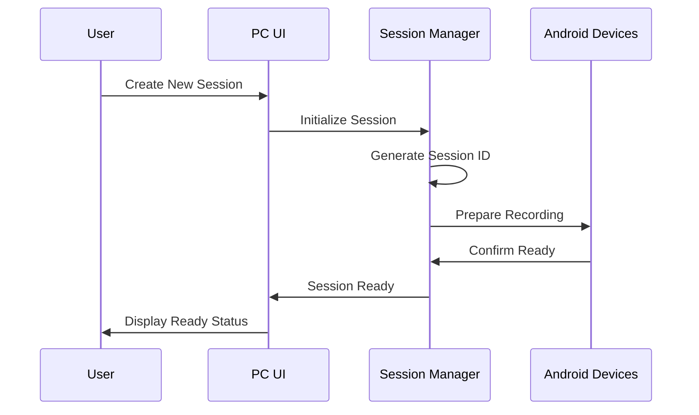

**Session Features:**
- **Automatic session naming** with timestamp and metadata
- **Session notes and annotations** for research documentation
- **Participant information management** for human subjects research
- **Data validation** to ensure recording integrity

#### Multi-Device Coordination

The interface provides tools for coordinating recording across multiple devices simultaneously:

- **Synchronized start/stop** across all devices
- **Staggered recording** for sequential data collection
- **Selective device recording** for partial system operation
- **Emergency stop** functionality for immediate halt

### Calibration Interface

The calibration interface provides comprehensive tools for ensuring accurate spatial and temporal alignment of all sensors in the system.

#### Camera Calibration Workflow

The camera calibration system guides users through the calibration process with clear visual feedback and automated quality assessment.

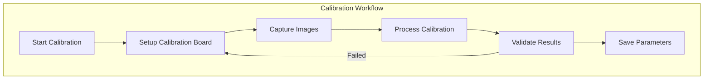

**Calibration Features:**
- **Interactive calibration board detection** with real-time feedback
- **Automatic image quality assessment** to ensure reliable calibration
- **Calibration accuracy visualization** showing reprojection errors
- **Parameter export** for integration with analysis software

#### Temporal Synchronization

The system provides precise temporal synchronization across all recording devices:

- **Network Time Protocol (NTP) synchronization** for coarse alignment
- **Hardware timestamp coordination** for precise alignment
- **Drift compensation** for long recording sessions
- **Synchronization quality monitoring** throughout recording

### Settings and Configuration

The settings interface allows researchers to configure the system for different experimental scenarios and hardware configurations.

#### Device Configuration

Each device type has specialized configuration options:

**Android Device Settings:**
- **Camera resolution and frame rate** for optimal recording quality
- **Thermal camera parameters** for environmental conditions
- **GSR sensor sensitivity** for physiological measurements
- **Network connection preferences** for reliable communication

**USB Webcam Settings:**
- **Resolution and codec selection** for high-quality recording
- **Exposure and focus controls** for optimal image quality
- **Color space configuration** for accurate color reproduction
- **Compression settings** for storage efficiency

#### System Preferences

Global system settings control overall system behavior:

| Setting Category | Options | Description |
|------------------|---------|-------------|
| **Data Storage** | Path, naming, format | Where and how recordings are saved |
| **Network** | Ports, timeouts, protocols | Communication parameters |
| **Display** | Themes, scaling, layout | User interface appearance |
| **Performance** | Threading, memory, CPU | System resource management |

## Android Application UI

The Android application provides a streamlined interface for mobile data collection, designed specifically for Samsung S22 devices with attached thermal cameras and connected physiological sensors.

### Main Activity Layout

The main activity features a modern Material Design interface optimized for research use. The layout prioritizes essential recording functions while providing comprehensive device status information.

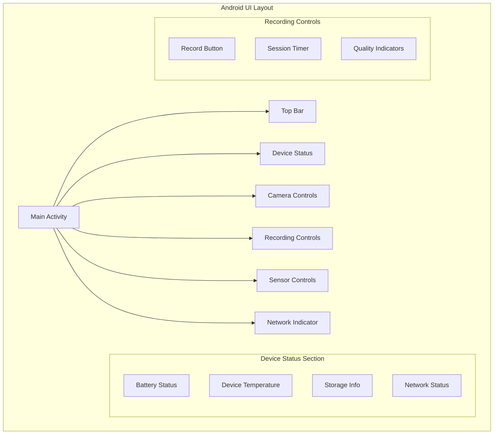

#### Layout Components

The Android interface uses a card-based layout that groups related functionality:

| Component | Function | Visual Design |
|-----------|----------|---------------|
| **Status Cards** | Device health monitoring | Rounded corners, color-coded |
| **Control Buttons** | Primary actions | Material Design FABs |
| **Progress Indicators** | Real-time feedback | Circular progress, linear bars |
| **Sensor Readouts** | Live data display | Numeric values, mini-graphs |

### Recording Interface

The recording interface is designed for one-handed operation during research scenarios, with large touch targets and clear visual feedback.

#### Recording States

The interface clearly communicates different recording states through visual design:

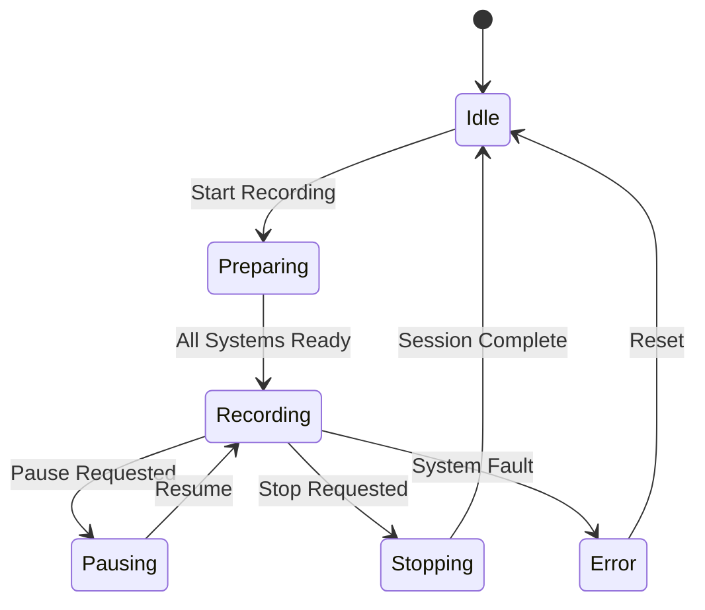

**State Indicators:**
- **Idle**: Neutral colors, "Ready to Record" message
- **Preparing**: Animated progress, "Initializing..." status
- **Recording**: Red recording indicator, elapsed time display
- **Error**: Alert colors, clear error messages

#### Touch Interactions

The interface supports various touch interactions optimized for research scenarios:

- **Large touch targets** (minimum 48dp) for reliable operation
- **Swipe gestures** for quick access to secondary functions
- **Long press actions** for confirmation of critical operations
- **Haptic feedback** for operation confirmation

### Device Configuration

The Android app provides comprehensive configuration options for all connected sensors and devices.

#### Camera Configuration

The camera configuration interface allows fine-tuning of recording parameters:

**Configuration Categories:**
- **Resolution Settings**: Multiple resolution options from 1080p to 4K
- **Frame Rate Control**: Adjustable frame rates from 24fps to 60fps
- **Codec Selection**: H.264, H.265 options for different quality/size trade-offs
- **Focus and Exposure**: Manual and automatic modes for different scenarios

#### Thermal Camera Settings

The thermal camera interface provides specialized controls for thermal imaging:

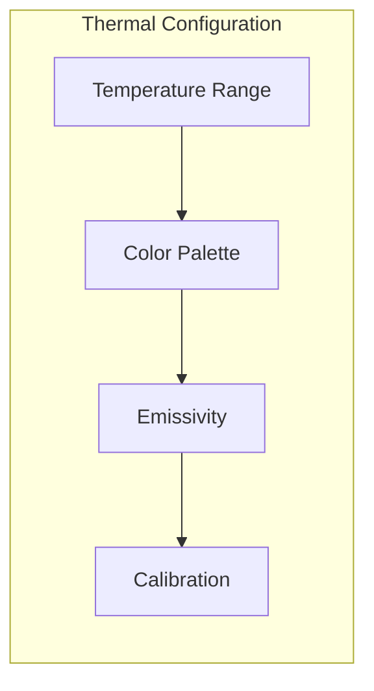

**Thermal Settings:**
- **Temperature range selection** for optimal dynamic range
- **Color palette options** for different visualization needs
- **Emissivity correction** for accurate temperature measurement
- **Calibration routines** for thermal accuracy

#### GSR Sensor Configuration

The GSR sensor configuration provides options for physiological data collection:

| Parameter | Range | Purpose |
|-----------|-------|---------|
| **Sampling Rate** | 51.2Hz - 512Hz | Data collection frequency |
| **Gain Setting** | 1x - 12x | Signal amplification |
| **Filter Settings** | 0.5Hz - 100Hz | Noise reduction |
| **Calibration Mode** | Auto/Manual | Sensor accuracy |

### Status Indicators

The Android interface uses multiple types of status indicators to provide comprehensive system feedback.

#### Visual Status Elements

**Connection Status:**
- **WiFi indicator** shows network connectivity strength
- **PC connection status** indicates master controller communication
- **Sensor status icons** show individual sensor health

**System Health:**
- **Battery level** with color-coded warnings
- **Temperature monitoring** with thermal throttling alerts
- **Storage space** with low-space warnings
- **Performance metrics** showing CPU/memory usage

#### Audio and Haptic Feedback

The interface provides multi-modal feedback for critical events:

- **Recording start/stop tones** for audio confirmation
- **Error alert sounds** for system problems
- **Haptic patterns** for touch feedback and notifications
- **LED indicators** for visual status when screen is off

### Network Connection

The network interface provides tools for establishing and maintaining communication with the PC controller.

#### Connection Management

The connection system handles various network scenarios:

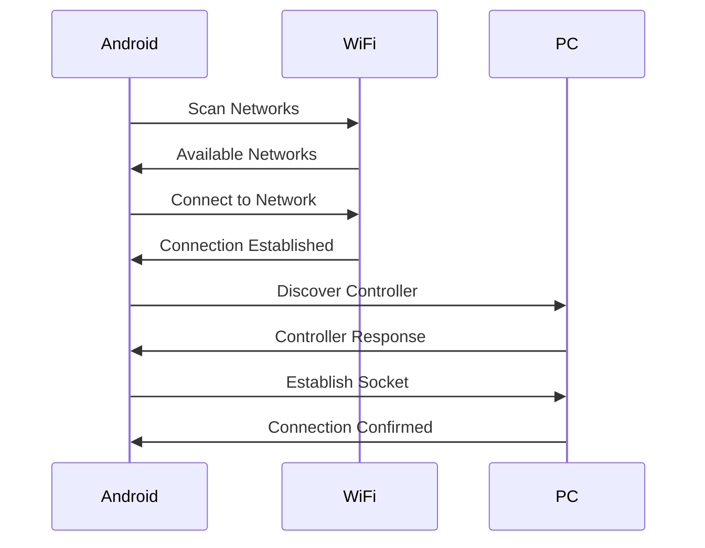

**Connection Features:**
- **Automatic network discovery** for PC controller detection
- **Connection health monitoring** with automatic reconnection
- **Bandwidth optimization** for different network conditions
- **Offline mode** for standalone recording when network is unavailable

## UI Architecture

The user interface architecture is designed to provide responsive, reliable operation across both platforms while maintaining clear separation of concerns.

### PC Application Architecture

The PC application uses a modern PyQt5 architecture with clear separation between UI and business logic:

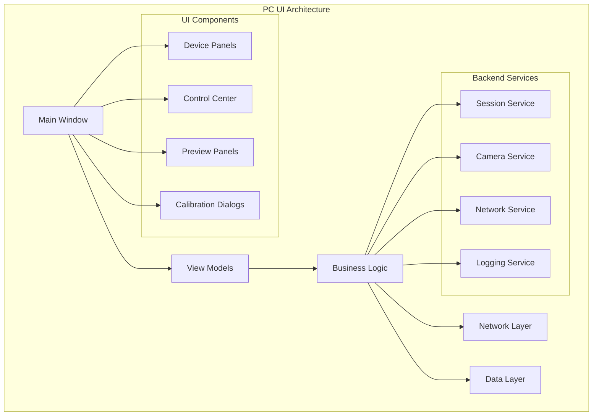

#### Component Responsibilities

| Component | Responsibility |
|-----------|----------------|
| **Main Window** | Overall layout and coordination |
| **View Models** | UI state management and data binding |
| **Business Logic** | Core application functionality |
| **Network Layer** | Device communication |
| **Data Layer** | Session and configuration management |

### Android Application Architecture

The Android application follows modern Android architecture principles with clean separation of concerns:

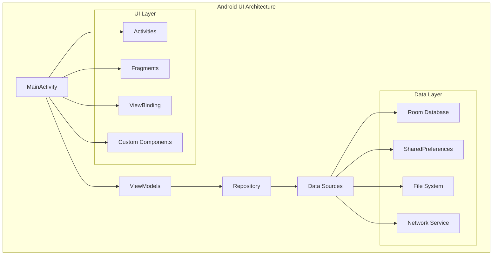

#### Architecture Benefits

The clean architecture provides several advantages for the research application:

- **Testability**: Clear interfaces enable comprehensive unit testing
- **Maintainability**: Separation of concerns simplifies code maintenance
- **Scalability**: Modular design supports feature additions
- **Reliability**: Reduced coupling minimizes system failures

### Cross-Platform Communication

The UI systems communicate through a well-defined protocol that ensures reliable operation:

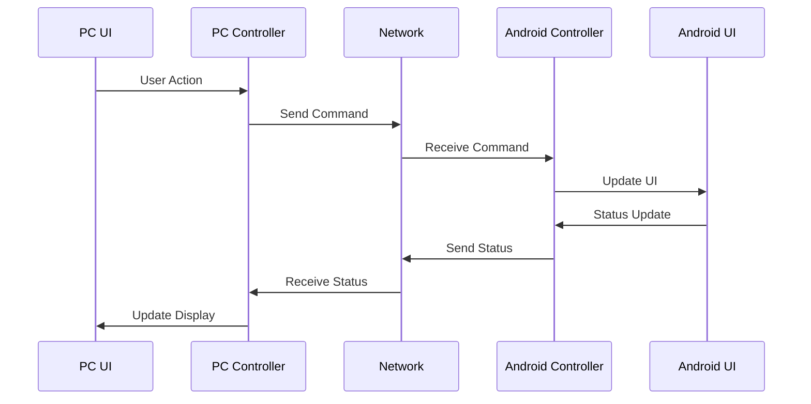

## User Interaction Flows

The system is designed to support common research workflows with intuitive interaction patterns.

### Recording Session Workflow

A typical recording session follows a well-defined workflow that guides users through the process:

1. **Session Setup**
   - Create new session with metadata
   - Configure recording parameters
   - Verify device connections

2. **System Preparation**
   - Synchronize device clocks
   - Initialize sensors
   - Prepare storage systems

3. **Recording Execution**
   - Start synchronized recording
   - Monitor system status
   - Handle any issues that arise

4. **Session Completion**
   - Stop recording gracefully
   - Verify data integrity
   - Save session metadata

### Calibration Workflow

The calibration process is designed to be straightforward while ensuring accurate results:

1. **Calibration Setup**
   - Select calibration type
   - Configure calibration parameters
   - Prepare calibration targets

2. **Data Collection**
   - Capture calibration images
   - Monitor capture quality
   - Collect sufficient samples

3. **Processing and Validation**
   - Compute calibration parameters
   - Assess calibration quality
   - Validate results

4. **Parameter Storage**
   - Save calibration data
   - Update system configuration
   - Document calibration session

## Accessibility Features

The UI system includes several accessibility features to support users with different needs and working in various environments.

### Visual Accessibility

- **High contrast themes** for different lighting conditions
- **Scalable fonts** for different viewing distances
- **Color-blind friendly palettes** for universal usability
- **Clear visual hierarchy** with consistent spacing and typography

### Motor Accessibility

- **Large touch targets** (minimum 48dp) for reliable interaction
- **Reduced precision requirements** for critical functions
- **Alternative input methods** including keyboard shortcuts
- **Gesture alternatives** for users with limited dexterity

### Cognitive Accessibility

- **Clear information hierarchy** with logical grouping
- **Consistent interaction patterns** across the system
- **Helpful error messages** with actionable suggestions
- **Progress indicators** for long-running operations

## Troubleshooting UI Issues

The system includes comprehensive error handling and troubleshooting capabilities to maintain reliable operation.

### Common UI Issues

| Issue | Symptoms | Resolution |
|-------|----------|------------|
| **Unresponsive Interface** | UI freezes, no button response | Restart application, check system resources |
| **Device Not Appearing** | Missing device panels | Check network connection, restart device discovery |
| **Preview Not Updating** | Static or black preview | Verify camera permissions, restart camera service |
| **Connection Problems** | Red status indicators | Check WiFi, firewall settings, IP configuration |

### Diagnostic Tools

The system provides several diagnostic tools to help identify and resolve issues:

- **Connection test utilities** for network troubleshooting that provide comprehensive diagnostics of network connectivity between PC and Android devices, including latency measurements, bandwidth testing, and packet loss analysis. These utilities help researchers identify and resolve network issues that could impact data collection quality.

- **Performance monitors** for system resource analysis that track CPU usage, memory consumption, disk I/O, and network utilization across all system components. The monitors provide real-time visualization and historical trending to help identify performance bottlenecks and optimize system configuration.

- **Log viewers** for detailed error analysis that provide sophisticated filtering, searching, and visualization capabilities for system logs. The viewers can correlate events across multiple devices and highlight patterns that indicate potential issues or system optimization opportunities.

- **System health checks** for overall system validation that perform comprehensive automated testing of all system components, including hardware connectivity, software functionality, and data integrity verification. These checks can be run on-demand or scheduled to ensure continuous system readiness.

### Recovery Procedures

**Automatic Recovery:**
- **Connection retry logic** for temporary network issues that automatically attempts to reestablish communication with disconnected devices using exponential backoff algorithms and intelligent retry scheduling. The system maintains session continuity even during brief network interruptions common in research environments.

- **Service restart capabilities** for crashed components that automatically detect and restart failed system services while preserving session data and maintaining synchronization across the remaining active devices. The restart process includes integrity checks and state recovery procedures.

- **Data recovery tools** for corrupted sessions that can reconstruct partial session data, validate data integrity, and recover usable portions of sessions that experienced interruptions. These tools include sophisticated algorithms for temporal data alignment and gap detection.

- **Graceful degradation** when partial system failure occurs that allows the system to continue operating with reduced functionality rather than complete failure. The system automatically adjusts recording parameters and notifies researchers of the modified operational state.

**Manual Recovery:**
- **Reset to defaults** for configuration issues that provides a safe fallback to known-good system configuration while preserving critical user settings and session data. The reset process includes backup creation and selective configuration restoration options.

- **Force restart procedures** for severe problems that provide emergency system restart capabilities while attempting to preserve as much session data as possible. These procedures include automatic session archiving and system state logging for post-incident analysis.

- **Emergency recording stop** for safety scenarios that immediately halts all recording activities across all devices while ensuring data integrity and providing clear documentation of the emergency stop conditions. This feature includes automatic incident reporting and system state preservation.

- **Data export tools** for session recovery that can extract and format session data even from partially corrupted sessions, providing researchers with maximum data recovery options and detailed reports of data quality and completeness.

---

This comprehensive guide provides researchers with the knowledge needed to effectively use both the PC desktop controller and Android mobile application interfaces. The modern, intuitive design ensures that users can focus on their research while the system handles the complexity of multi-sensor data collection.

For additional technical details, refer to the [PC/Android Logging Guide](pc-android-logging-guide.md) and [PC/Android Test Suite Guide](pc-android-testing-guide.md).