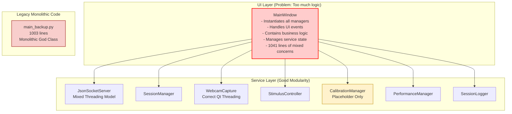

# Architecture Diagrams - Multi-Sensor Recording System

This document contains Mermaid diagrams showing the architectural transformation from the problematic "God Controller"
anti-pattern to the clean MVC architecture with dependency injection.

## Current Architecture (Before Refactoring)—Problem

The original architecture suffered from the "God Controller" anti-pattern where the MainWindow class directly managed
all backend services:



### Problems with Original Architecture

1. **"God Controller" Anti-Pattern**: MainWindow directly instantiated and managed all backend services
2. **Tight Coupling**: UI was tightly coupled to business logic of every manager
3. **Poor Testability**: Nearly impossible to unit test UI interaction logic without instantiating entire application
   stack
4. **High Complexity**: MainWindow would continue to grow as more features were added
5. **Mixed Threading Models**: JsonSocketServer used both QThread and threading.Thread
6. **Placeholder Implementations**: Critical modules like CalibrationManager contained only TODO comments

## Recommended Architecture (After Refactoring)—Solution

The new architecture implements a clean separation of concerns using the MVC pattern with dependency injection:

```mermaid
graph TD
    subgraph "Entry Point"
        main[main.py<br/>Application Entry Point]
    end

    subgraph "Application Layer (Dependency Injection)"
        App[Application<br/>- Creates services DI Container<br/>- Service lifecycle management<br/>- Dependency wiring<br/>- 175 lines]
        MC[MainController<br/>- Receives services via DI<br/>- Orchestrates backend logic<br/>- Business logic only<br/>- Qt signal communication<br/>- 516 lines]
    end

    subgraph "UI Layer (View Only)"
        MW[RefactoredMainWindow<br/>- Receives Controller via DI<br/>- Forwards UI events to Controller<br/>- Renders state from Controller<br/>- UI concerns only<br/>- 585 lines]
    end

    subgraph "Service Layer (Independent Components)"
        JSS[JsonSocketServer<br/>️ Needs Qt Threading Fix]
        SM[SessionManager]
        WBC[WebcamCapture<br/> Correct Qt Threading]
        SC[StimulusController]
        CM[CalibrationManager<br/> Needs Implementation]
        PM[PerformanceManager]
        SL[SessionLogger<br/> Needs Implementation]
    end

    main --> App
    App --> MC
    App -- Creates --> JSS
    App -- Creates --> SM
    App -- Creates --> WBC
    App -- Creates --> SC
    App -- Creates --> CM
    App -- Creates --> PM
    App -- Creates --> SL
    MC --> MW
    MC -- Controls --> JSS
    MC -- Controls --> SM
    MC -- Controls --> WBC
    MC -- Controls --> SC
    MC -- Controls --> CM
    MC -- Controls --> PM
    MC -- Controls --> SL
    classDef clean fill: #ccffcc, stroke: #00aa00, stroke-width: 1px
    classDef warning fill: #fff2cc, stroke: #d6b656, stroke-width: 2px
    classDef controller fill: #cce5ff, stroke: #0066cc, stroke-width: 2px
    class App, MW, SM, WBC, SC, PM clean
    class MC controller
    class JSS, CM, SL warning
```

### Benefits of New Architecture

1. **✅ Eliminated "God Controller"**: MainController only handles business logic, UI only handles events
2. **✅ Dependency Injection**: Clean separation with injected dependencies
3. **✅ Improved Testability**: Controller can be unit tested independently
4. **✅ Loose Coupling**: UI and business logic are completely decoupled
5. **✅ Single Responsibility**: Each class has a clear, focused purpose
6. **✅ Thread-safe Communication**: All communication uses Qt signals

## Threading Model Comparison

### Current Threading Issues

```mermaid
graph LR
    subgraph "JsonSocketServer (Problem)"
        JSS_QT[QThread<br/>Main Server Thread]
        JSS_STD[threading.Thread<br/>Per-Client Threads]
        JSS_QT --> JSS_STD
    end

    subgraph "WebcamCapture (Correct)"
        WBC_QT[QThread<br/>Capture Thread]
        WBC_WORKER[QObject Worker<br/>Moved to Thread]
        WBC_QT --> WBC_WORKER
    end

    subgraph "GUI Thread"
        GUI[MainWindow<br/>Qt GUI Thread]
    end

    JSS_STD -.->|❌ Unsafe| GUI
    WBC_WORKER -->|✅ Qt Signals| GUI
    classDef problem fill: #ffcccc, stroke: #ff0000, stroke-width: 2px
    classDef correct fill: #ccffcc, stroke: #00aa00, stroke-width: 2px
    classDef gui fill: #cce5ff, stroke: #0066cc, stroke-width: 2px
    class JSS_QT, JSS_STD problem
    class WBC_QT, WBC_WORKER correct
    class GUI gui
```

### Recommended Threading Model

```mermaid
graph LR
    subgraph "All Services (Standardized)"
        JSS_QT[JsonSocketServer<br/>QThread]
        JSS_WORKER[QObject Worker<br/>Moved to Thread]
        WBC_QT[WebcamCapture<br/>QThread]
        WBC_WORKER[QObject Worker<br/>Moved to Thread]
        OTHER_QT[Other Services<br/>QThread]
        OTHER_WORKER[QObject Workers<br/>Moved to Threads]
    end

    subgraph "GUI Thread"
        GUI[RefactoredMainWindow<br/>Qt GUI Thread]
    end

    JSS_QT --> JSS_WORKER
    WBC_QT --> WBC_WORKER
    OTHER_QT --> OTHER_WORKER
    JSS_WORKER -->|✅ Qt Signals| GUI
    WBC_WORKER -->|✅ Qt Signals| GUI
    OTHER_WORKER -->|✅ Qt Signals| GUI
    classDef correct fill: #ccffcc, stroke: #00aa00, stroke-width: 2px
    classDef gui fill: #cce5ff, stroke: #0066cc, stroke-width: 2px
    class JSS_QT, JSS_WORKER, WBC_QT, WBC_WORKER, OTHER_QT, OTHER_WORKER correct
    class GUI gui
```

## Implementation Status

### ✅ Completed (2025-07-30)

1. **MainController Class**: 516-line controller implementing Controller/Presenter pattern
2. **Application Class**: 175-line dependency injection container
3. **RefactoredMainWindow Class**: 585-line UI-only implementation
4. **Documentation Updates**: Corrected misleading status reports
5. **Architecture Documentation**: Comprehensive diagrams and explanations

### ⚠️ Remaining Critical Tasks

1. **Threading Model Standardization**: Fix JsonSocketServer mixed threading
2. **Placeholder Implementation**: Complete CalibrationManager and LoggerManager
3. **Legacy Code Cleanup**: Remove main_backup.py after migration verification
4. **Testing Updates**: Update tests for new architecture
5. **Integration Testing**: Verify all functionality works with new architecture

## Files Created/Modified

### New Files

- `PythonApp/src/gui/main_controller.py` - Controller/Presenter implementation
- `PythonApp/src/application.py` - Dependency injection container
- `PythonApp/src/gui/refactored_main_window.py` - Clean UI implementation
- `docs/architecture-diagrams.md` - This file

### Modified Files

- `PythonApp/src/FINAL_SYSTEM_STATUS_REPORT.md` - Corrected documentation
- `todo.md` - Added an architectural refactoring section
- `changelog.md` - Added comprehensive refactoring entry

## Next Steps

1. **Standardize Threading Model**: Update JsonSocketServer to use Qt threading consistently
2. **Implement Placeholder Modules**: Complete CalibrationManager and LoggerManager functionality
3. **Update Tests**: Modify existing tests to work with new architecture
4. **Integration Testing**: Verify all functionality works correctly
5. **Performance Testing**: Ensure new architecture doesn't impact performance
6. **Documentation**: Update any remaining references to old architecture