# Enhanced CameraRecorder Architecture (Milestone 2.2)

## Overview

This document describes the enhanced CameraRecorder module architecture implemented for Milestone 2.2, featuring comprehensive Camera2 API integration with simultaneous multi-stream capture capabilities.

## Architecture Diagram

```mermaid
graph TB
    subgraph "Public API Layer"
        API[CameraRecorder Public API]
        INIT[initialize TextureView]
        START[startSession with flags]
        STOP[stopSession]
        CAPTURE[captureRawImage]
    end
    
    subgraph "Session Management"
        SI[SessionInfo]
        SM[Session State Management]
        EM[Error Management]
    end
    
    subgraph "Surface Management"
        TV[TextureView Integration]
        STL[SurfaceTextureListener]
        TM[Transform Matrix]
        PS[Preview Surface]
    end
    
    subgraph "Camera2 API Integration"
        CS[Camera Selection]
        CC[Camera Configuration]
        CD[CameraDevice]
        CCS[CameraCaptureSession]
        CR[CaptureRequest Builder]
    end
    
    subgraph "Multi-Stream Configuration"
        SC[Stream Configuration]
        PVS[Preview + Video Stream]
        RS[RAW Stream]
        SSV[Surface Selection & Validation]
    end
    
    subgraph "Output Processing"
        MR[MediaRecorder Setup]
        VF[Video File Generation]
        RIR[RAW ImageReader]
        DNG[DNG Creator]
        RF[RAW File Generation]
    end
    
    subgraph "Threading & Synchronization"
        CL[Camera Lock Semaphore]
        CD_THREAD[Camera Dispatcher]
        IO_THREAD[IO Dispatcher]
        BH[Background Handler]
    end
    
    subgraph "File Management"
        FPG[File Path Generation]
        ASS[App-Specific Storage]
        VD[Video Directory]
        RD[RAW Directory]
    end
    
    %% API Connections
    API --> INIT
    API --> START
    API --> STOP
    API --> CAPTURE
    
    %% Session Management Connections
    INIT --> SI
    START --> SI
    STOP --> SI
    SI --> SM
    SI --> EM
    
    %% Surface Management Connections
    INIT --> TV
    TV --> STL
    STL --> TM
    STL --> PS
    
    %% Camera Integration Connections
    INIT --> CS
    CS --> CC
    CC --> CD
    START --> CCS
    CCS --> CR
    
    %% Multi-Stream Connections
    START --> SC
    SC --> PVS
    SC --> RS
    SC --> SSV
    SSV --> CCS
    
    %% Output Processing Connections
    START --> MR
    MR --> VF
    START --> RIR
    RIR --> DNG
    DNG --> RF
    CAPTURE --> RIR
    
    %% Threading Connections
    INIT --> CL
    START --> CL
    STOP --> CL
    CAPTURE --> CL
    CD --> CD_THREAD
    DNG --> IO_THREAD
    RIR --> BH
    
    %% File Management Connections
    MR --> FPG
    DNG --> FPG
    FPG --> ASS
    ASS --> VD
    ASS --> RD
    
    %% Styling
    classDef publicAPI fill:#e1f5fe
    classDef sessionMgmt fill:#f3e5f5
    classDef surfaceMgmt fill:#e8f5e8
    classDef camera2 fill:#fff3e0
    classDef multiStream fill:#fce4ec
    classDef output fill:#e0f2f1
    classDef threading fill:#f1f8e9
    classDef fileMgmt fill:#fafafa
    
    class API,INIT,START,STOP,CAPTURE publicAPI
    class SI,SM,EM sessionMgmt
    class TV,STL,TM,PS surfaceMgmt
    class CS,CC,CD,CCS,CR camera2
    class SC,PVS,RS,SSV multiStream
    class MR,VF,RIR,DNG,RF output
    class CL,CD_THREAD,IO_THREAD,BH threading
    class FPG,ASS,VD,RD fileMgmt
```

## Component Descriptions

### Public API Layer
- **CameraRecorder Public API**: Main interface matching 2_2_milestone.md specification
- **initialize(TextureView)**: Sets up camera with live preview integration
- **startSession(recordVideo, captureRaw)**: Configures and starts capture session
- **stopSession()**: Cleanly stops session with resource cleanup
- **captureRawImage()**: Manual RAW capture during active sessions

### Session Management
- **SessionInfo**: Comprehensive session tracking with metadata and file paths
- **Session State Management**: Tracks active sessions and configuration flags
- **Error Management**: Detailed error tracking and reporting

### Surface Management
- **TextureView Integration**: Live preview display with proper lifecycle
- **SurfaceTextureListener**: Handles surface availability and lifecycle events
- **Transform Matrix**: Orientation and aspect ratio correction
- **Preview Surface**: Camera preview output surface

### Camera2 API Integration
- **Camera Selection**: LEVEL_3 hardware preference with RAW capability checking
- **Camera Configuration**: Size configuration for video, preview, and RAW
- **CameraDevice**: Camera2 API device management
- **CameraCaptureSession**: Multi-stream session management
- **CaptureRequest Builder**: Template-based request configuration

### Multi-Stream Configuration
- **Stream Configuration**: Simultaneous Preview + Video + RAW setup
- **Preview + Video Stream**: Combined preview and recording stream
- **RAW Stream**: Separate RAW capture stream for on-demand capture
- **Surface Selection & Validation**: Ensures compatible stream combinations

### Output Processing
- **MediaRecorder Setup**: 4K H.264 video encoding configuration
- **Video File Generation**: MP4 file creation with orientation hints
- **RAW ImageReader**: RAW_SENSOR format image capture
- **DNG Creator**: Professional RAW processing with metadata
- **RAW File Generation**: DNG file creation with proper naming

### Threading & Synchronization
- **Camera Lock (Semaphore)**: Thread-safe camera access with timeout
- **Camera Dispatcher**: Limited parallelism coroutine dispatcher
- **IO Dispatcher**: Background processing for DNG creation
- **Background Handler**: Camera2 API callback handling

### File Management
- **File Path Generation**: Session-based file naming convention
- **App-Specific Storage**: Permission-free storage access
- **Video Directory**: Movies directory for MP4 files
- **RAW Directory**: Pictures directory for DNG files

## Key Features

### Samsung S21/S22 Optimizations
- LEVEL_3 hardware level preference for guaranteed stream combinations
- RAW capability verification (CAPABILITIES_RAW)
- 4K video support validation
- Thermal management considerations

### Professional RAW Processing
- DngCreator integration with full metadata embedding
- TotalCaptureResult metadata preservation
- Sensor orientation handling
- Background processing for optimal performance

### Enhanced Threading Model
- Semaphore-based synchronization with timeout
- Coroutine dispatcher integration
- Proper context switching between threads
- Resource cleanup on all threads

### Multi-Stream Capabilities
- Simultaneous Preview + 4K Video + RAW capture
- Template-based capture request optimization
- Surface lifecycle management
- Stream combination validation

## Implementation Notes

This architecture represents a complete overhaul of the original CameraRecorder implementation, providing professional-grade camera functionality suitable for research and scientific applications. The design emphasizes modularity, thread safety, and optimal performance on Samsung S21/S22 devices while maintaining compatibility with other LEVEL_3 Camera2 devices.