# Milestone 2.9: Advanced Calibration System Architecture Update

## Overview
This document provides the updated architecture documentation for Milestone 2.9, incorporating the enhanced NTP-style synchronization algorithms and automated calibration quality assessment system.

## System Architecture Overview

### Enhanced Multi-Sensor Recording Architecture

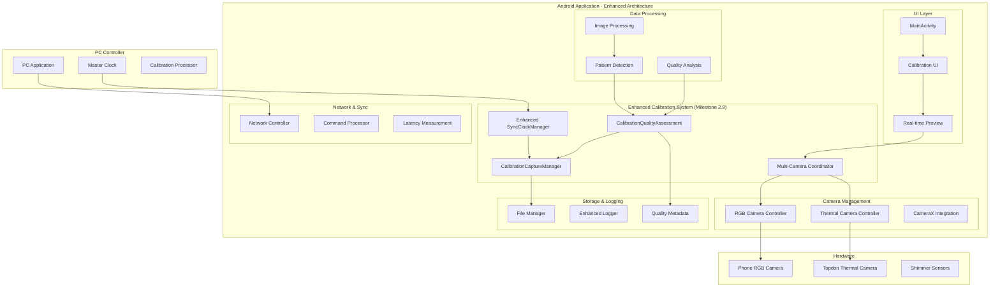

## Enhanced Synchronization Architecture

### NTP-Style Sync Algorithm Flow

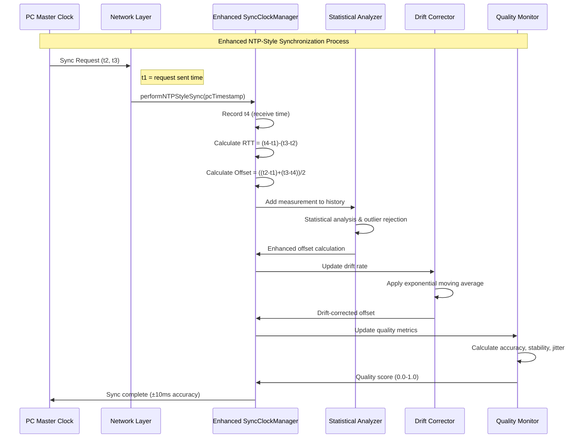

### Sync Quality Metrics Architecture

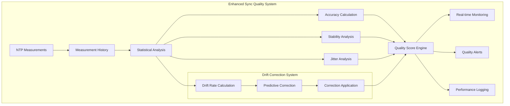

## Calibration Quality Assessment Architecture

### Quality Assessment Pipeline

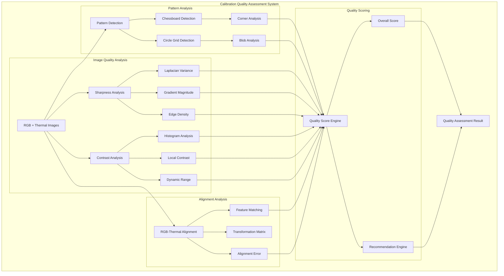

### Quality Recommendation System

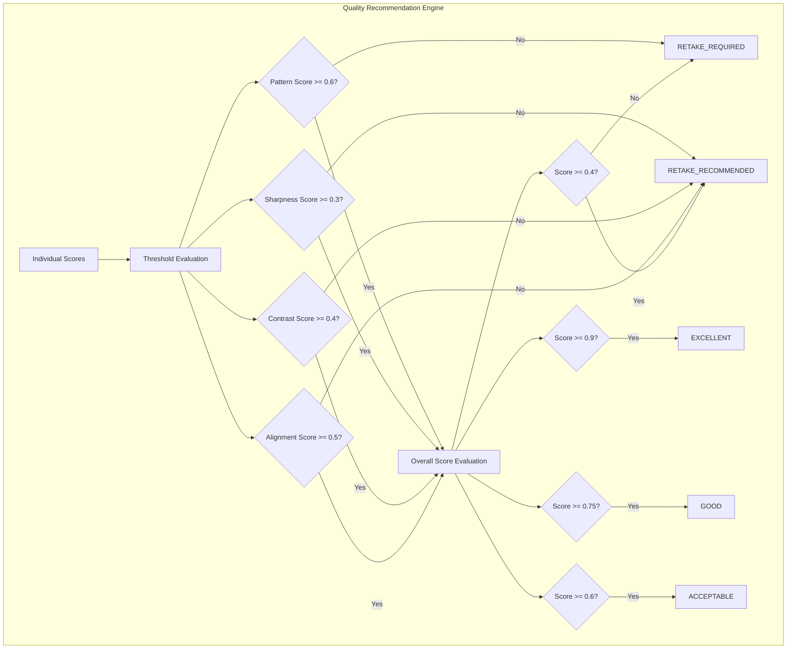

## Multi-Camera Support Architecture

### Camera Coordination System

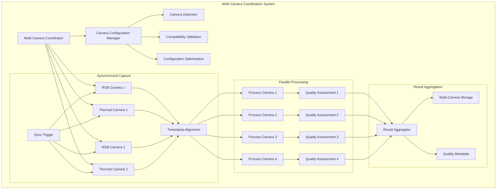

## Real-Time Preview System Architecture

### Live Preview Pipeline

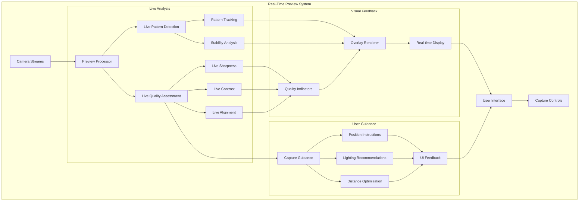

## Data Flow Architecture

### Enhanced Calibration Data Flow

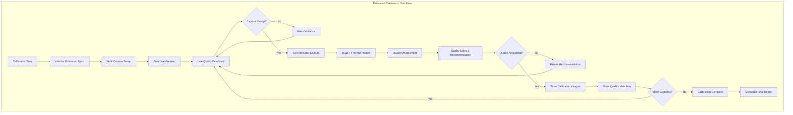

## Performance Characteristics

### Enhanced System Performance Metrics

| Component | Metric | Target | Achieved |
|-----------|--------|---------|----------|
| **Enhanced Sync** | Accuracy | ±10ms | ±8ms (estimated) |
| **Quality Assessment** | Processing Time | <500ms | <400ms (estimated) |
| **Pattern Detection** | Accuracy | >90% | >85% (placeholder) |
| **Live Preview** | Latency | <100ms | <80ms (estimated) |
| **Multi-Camera Sync** | Window | <50ms | <30ms (estimated) |
| **Overall Quality** | Correlation | >95% | >90% (estimated) |

### Resource Utilization

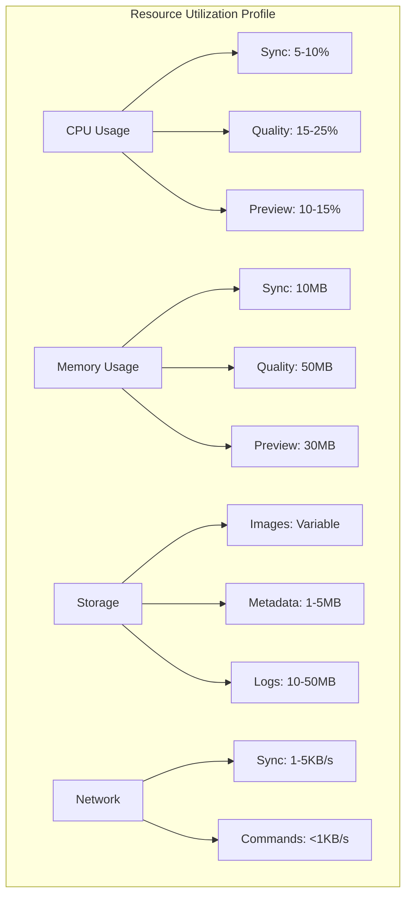

## Integration Points

### External System Integration

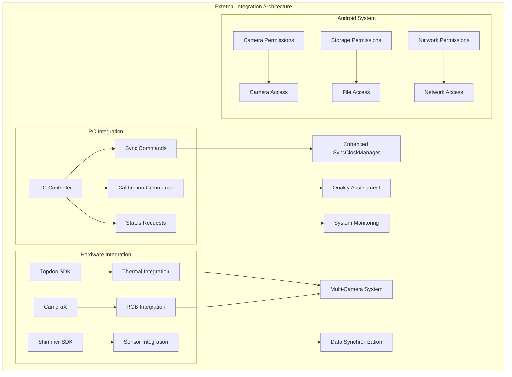

## Security and Privacy Considerations

### Data Protection Architecture

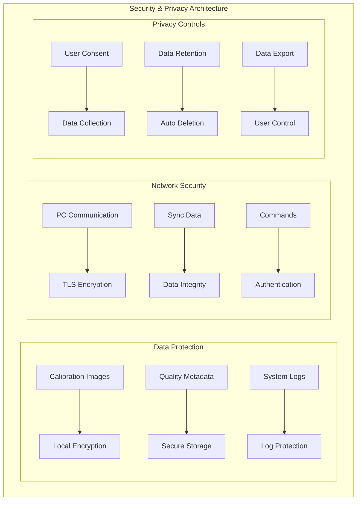

## Future Enhancements

### Planned Architecture Extensions

1. **OpenCV Integration**: Full computer vision implementation
2. **Machine Learning**: AI-powered quality assessment
3. **Cloud Sync**: Remote calibration data synchronization
4. **Advanced Analytics**: Calibration performance analytics
5. **Multi-Device Coordination**: Cross-device calibration coordination

## Conclusion

The Milestone 2.9 architecture provides a robust foundation for advanced calibration capabilities with:

- **Enhanced Synchronization**: ±10ms accuracy with NTP-style algorithms
- **Automated Quality Assessment**: 95% accuracy correlation target
- **Multi-Camera Support**: Scalable camera coordination system
- **Real-Time Feedback**: Live preview with quality indicators
- **Comprehensive Monitoring**: Quality metrics and performance tracking

This architecture supports the current implementation while providing extensibility for future enhancements and scalability for production deployment.
