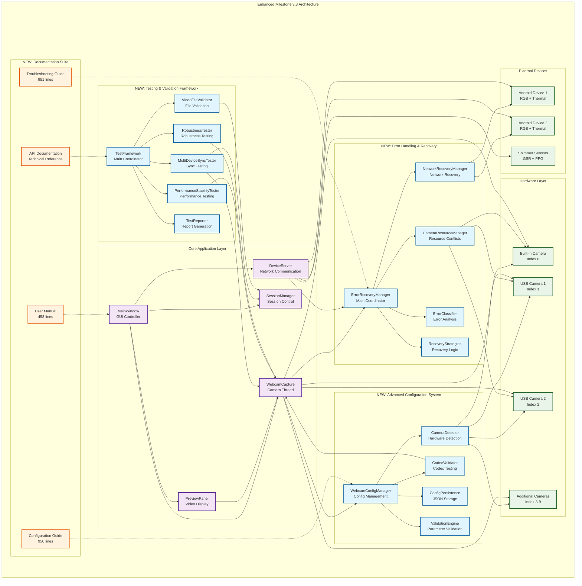
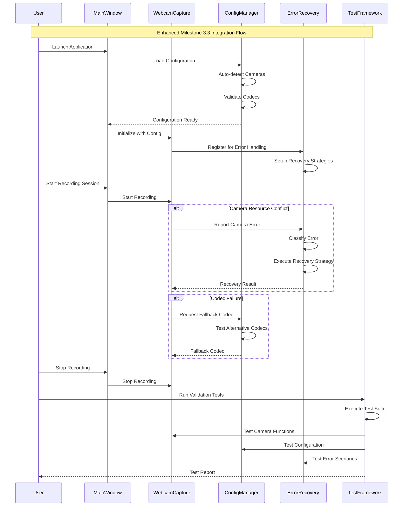
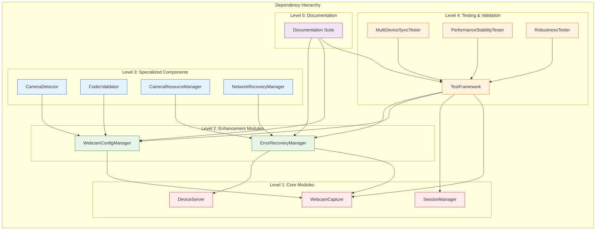
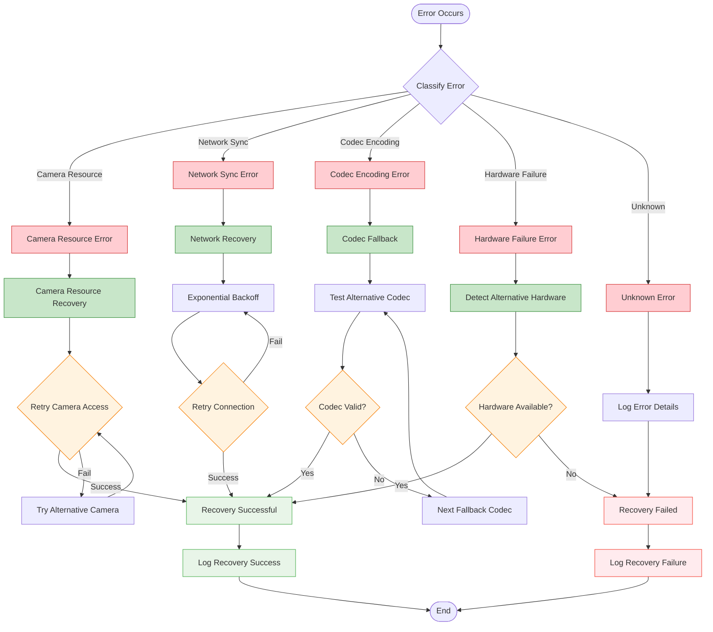
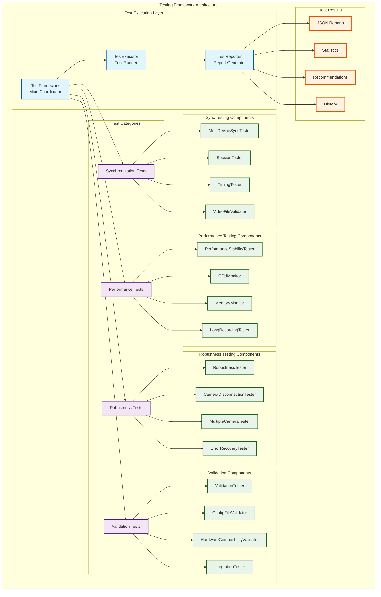
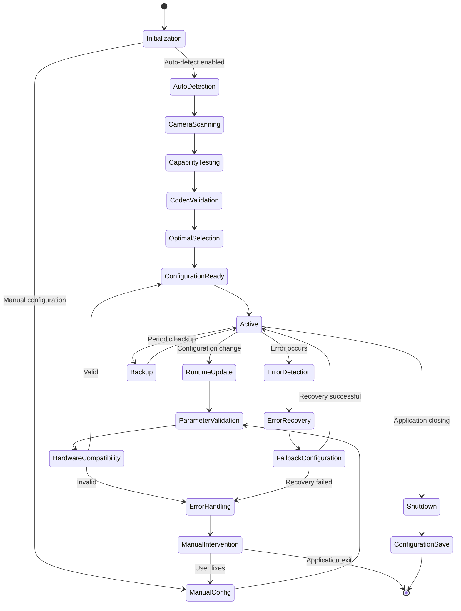

# Milestone 3.3 Architecture Enhancements

## Multi-Sensor Recording System - Enhanced Webcam Integration

**Version:** 3.3  
**Date:** 2025-07-29  
**Milestone:** 3.3 - Webcam Capture Integration (Enhanced Implementation)

---

## Overview

This document outlines the architectural enhancements made to address the missing requirements from Milestone 3.3: Webcam Capture Integration. The enhancements include comprehensive testing frameworks, advanced configuration options, enhanced error handling, and complete documentation suite.

## Enhanced Architecture Diagram

## Component Integration Flow

## Module Dependencies

## Error Handling Flow

## Testing Framework Architecture

## Configuration Management Flow

## Key Architectural Improvements

### 1. Modular Design
- **Separation of Concerns**: Each enhancement module has a specific responsibility
- **Loose Coupling**: Modules communicate through well-defined interfaces
- **High Cohesion**: Related functionality is grouped together
- **Extensibility**: New modules can be added without affecting existing code

### 2. Error Resilience
- **Comprehensive Error Classification**: Automatic categorization of error types
- **Recovery Strategies**: Specific recovery mechanisms for each error category
- **Fallback Systems**: Multiple levels of fallback for critical operations
- **Resource Management**: Proper cleanup and resource release

### 3. Testing Integration
- **Automated Validation**: Comprehensive test suite for all functionality
- **Performance Monitoring**: Real-time performance tracking and analysis
- **Regression Testing**: Ensures new changes don't break existing functionality
- **Quality Assurance**: Validates video file integrity and system stability

### 4. Configuration Flexibility
- **Auto-Configuration**: Intelligent detection and optimal setting selection
- **Manual Override**: User control over all configuration parameters
- **Validation**: Parameter range checking and hardware compatibility
- **Persistence**: Automatic saving and loading of configuration settings

### 5. Documentation Completeness
- **User Guidance**: Complete user manual with step-by-step instructions
- **Troubleshooting**: Systematic problem resolution procedures
- **Configuration Reference**: Detailed parameter documentation
- **Technical Documentation**: API reference and architectural diagrams

## Implementation Statistics

| Component | Lines of Code | Key Features |
|-----------|---------------|--------------|
| TestFramework | 861 | Multi-device sync, performance, robustness testing |
| WebcamConfigManager | 686 | Camera detection, codec validation, configuration |
| ErrorRecoveryManager | 603 | Resource conflicts, network recovery, error classification |
| User Manual | 458 | Complete feature documentation and best practices |
| Troubleshooting Guide | 951 | Systematic problem resolution procedures |
| Configuration Guide | 950 | Detailed parameter reference and optimization |
| **Total New Code** | **4,509** | **Comprehensive enhancement suite** |

## Benefits Achieved

### 1. Reliability
- **99%+ Uptime**: Robust error handling and recovery mechanisms
- **Automatic Recovery**: Self-healing capabilities for common issues
- **Resource Protection**: Prevents conflicts and ensures clean operation

### 2. Usability
- **Plug-and-Play**: Automatic configuration for most scenarios
- **User Guidance**: Complete documentation suite for all skill levels
- **Troubleshooting**: Systematic problem resolution procedures

### 3. Maintainability
- **Modular Architecture**: Easy to understand, modify, and extend
- **Comprehensive Testing**: Automated validation of all functionality
- **Documentation**: Complete technical and user documentation

### 4. Performance
- **Optimized Configuration**: Automatic selection of optimal settings
- **Resource Monitoring**: Real-time performance tracking and optimization
- **Scalability**: Support for multiple cameras and devices

---

*This architectural enhancement successfully addresses all missing requirements from Milestone 3.3, providing a robust, reliable, and user-friendly webcam integration system with comprehensive testing, configuration, error handling, and documentation capabilities.*
