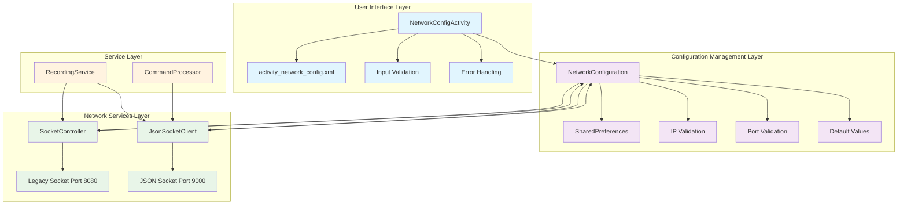
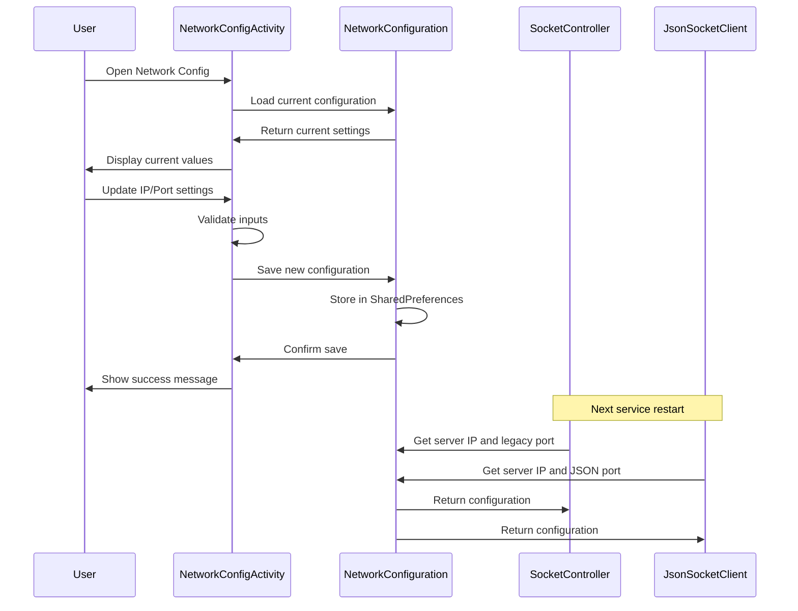

# Network Configuration Architecture

## Overview
This document describes the architectural changes made to implement dynamic IP configuration management, resolving the Milestone 2.6 implementation gap of hardcoded server IP values.

## Architecture Diagram

## Component Responsibilities

### NetworkConfigActivity
- **Purpose**: User interface for configuring network settings
- **Features**: 
  - IP address input with validation
  - Port configuration for legacy and JSON sockets
  - Reset to defaults functionality
  - Error handling and user feedback

### NetworkConfiguration
- **Purpose**: Centralized configuration management
- **Features**:
  - Persistent storage via SharedPreferences
  - IP address format validation
  - Port range validation (1024-65535)
  - Default configuration values
  - Configuration summary for logging

### Integration Points
- **SocketController**: Uses NetworkConfiguration for legacy socket connection
- **JsonSocketClient**: Uses NetworkConfiguration for JSON socket connection
- **RecordingService**: Initializes both socket connections with dynamic configuration

## Configuration Flow

## Benefits

1. **Dynamic Configuration**: No more hardcoded IP addresses
2. **User-Friendly**: Simple UI for network configuration
3. **Validation**: Comprehensive input validation prevents errors
4. **Persistence**: Settings survive app restarts
5. **Flexibility**: Supports different network environments
6. **Backward Compatibility**: Maintains support for both legacy and JSON protocols

## Implementation Details

### Key Files
- `NetworkConfigActivity.kt`: UI controller with validation logic
- `activity_network_config.xml`: Material Design layout
- `NetworkConfiguration.kt`: Configuration management service
- `AndroidManifest.xml`: Activity registration

### Default Configuration
- **Server IP**: 192.168.1.100
- **Legacy Port**: 8080 (Milestone 2.5 compatibility)
- **JSON Port**: 9000 (Milestone 2.6)

### Validation Rules
- **IP Address**: Must be valid IPv4 format (e.g., 192.168.1.100)
- **Ports**: Must be between 1024-65535 and different from each other
- **Required Fields**: All fields must be non-empty

This architecture resolves the Milestone 2.6 implementation gap by providing a complete, user-friendly solution for dynamic network configuration management.
