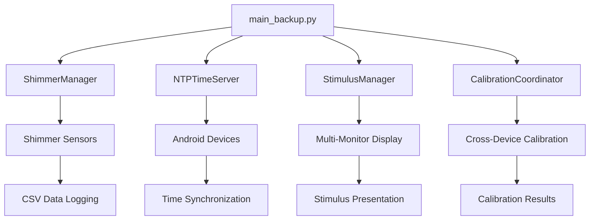

# Python Integration Guide

## Multi-Sensor Recording System - Python Components

This guide provides comprehensive documentation for integrating and using the Python components of the Multi-Sensor Recording System, including Shimmer sensor integration, NTP time synchronization, advanced stimulus presentation, and calibration systems.

## Table of Contents

1. [System Overview](#system-overview)
2. [Component Architecture](#component-architecture)
3. [Installation and Setup](#installation-and-setup)
4. [Shimmer Integration](#shimmer-integration)
5. [NTP Time Synchronization](#ntp-time-synchronization)
6. [Advanced Stimulus Presentation](#advanced-stimulus-presentation)
7. [Calibration Systems](#calibration-systems)
8. [Integration Patterns](#integration-patterns)
9. [Troubleshooting](#troubleshooting)
10. [Performance Optimization](#performance-optimization)

## System Overview

The Python application serves as the master controller for the multi-sensor recording system, providing:

- **Failover Shimmer Integration**: Automatic takeover when Android devices cannot connect to Shimmer sensors
- **High-Precision Time Synchronization**: NTP server for synchronizing Android device clocks
- **Advanced Stimulus Presentation**: Multi-monitor stimulus presentation with precise timing
- **Cross-Device Calibration**: Coordinated calibration across multiple devices and cameras
- **Real-time Quality Assessment**: Live calibration feedback and quality scoring

## Component Architecture

### Core Components

```
PythonApp/src/
├── main_backup.py                          # Main application controller
├── shimmer_manager.py                      # Shimmer sensor integration
├── ntp_time_server.py                      # NTP time synchronization
├── stimulus_manager.py                     # Advanced stimulus presentation
├── calibration_quality_assessment.py      # Computer vision calibration analysis
├── real_time_calibration_feedback.py      # Live calibration feedback
├── cross_device_calibration_coordinator.py # Multi-device calibration coordination
└── tests/                                  # Comprehensive test suite
    ├── test_shimmer_manager.py
    ├── test_ntp_time_server.py
    ├── test_stimulus_manager.py
    ├── test_integration_end_to_end.py
    ├── test_hardware_failure_recovery.py
    └── test_python_android_integration.py
```

### Integration Flow



## Installation and Setup

### Prerequisites

1. **Python Environment**: Python 3.9+ with conda/pip
2. **Dependencies**: Install required packages
3. **Hardware**: Shimmer sensors, cameras, multiple monitors (optional)
4. **Network**: Wi-Fi network for device communication

### Environment Setup

```bash
# Create conda environment
conda create -n multisensor python=3.9
conda activate multisensor

# Install dependencies
pip install PyQt5 opencv-python numpy pandas pyserial ntplib
pip install pytest pytest-cov  # For testing

# Install pyshimmer library (if available)
cd AndroidApp/libs/pyshimmer
pip install -e .
```

### Configuration

```python
# main_backup.py configuration
SHIMMER_SAMPLING_RATE = 128  # Hz
NTP_SERVER_PORT = 8889
CALIBRATION_COORDINATION_PORT = 8910
DEFAULT_SESSION_DIRECTORY = "recordings"
```

## Shimmer Integration

### ShimmerManager Overview

The `ShimmerManager` provides comprehensive Shimmer sensor integration with failover capabilities when Android devices cannot connect.

### Basic Usage

```python
from shimmer_manager import ShimmerManager, ShimmerStatus, ShimmerSample

# Initialize manager
shimmer_manager = ShimmerManager(logger=logger)

# Initialize the system
if shimmer_manager.initialize():
    print("ShimmerManager initialized successfully")
    
    # Scan for devices
    devices = shimmer_manager.scan_and_pair_devices()
    print(f"Found {len(devices)} Shimmer devices")
    
    # Connect to devices
    if shimmer_manager.connect_devices(devices):
        print("Connected to Shimmer devices")
        
        # Configure sensor channels
        channels = {"GSR", "PPG_A13", "Accel_X", "Accel_Y", "Accel_Z"}
        for device_id in shimmer_manager.device_status:
            shimmer_manager.set_enabled_channels(device_id, channels)
        
        # Start recording
        session_id = "my_recording_session"
        if shimmer_manager.start_recording(session_id):
            print("Recording started")
            
            # Record for some time
            time.sleep(30)
            
            # Stop recording
            shimmer_manager.stop_recording()
            print("Recording stopped")
    
    # Cleanup
    shimmer_manager.cleanup()
```

### Data Callbacks

```python
def on_shimmer_data(sample: ShimmerSample):
    """Handle real-time Shimmer data"""
    print(f"GSR: {sample.gsr_conductance:.2f}μS, "
          f"PPG: {sample.ppg_a13:.0f}, "
          f"Accel: ({sample.accel_x:.2f}, {sample.accel_y:.2f}, {sample.accel_z:.2f})")

def on_shimmer_status(device_id: str, status: ShimmerStatus):
    """Handle device status updates"""
    print(f"Device {device_id}: Connected={status.is_connected}, "
          f"Battery={status.battery_level}%")

# Add callbacks
shimmer_manager.add_data_callback(on_shimmer_data)
shimmer_manager.add_status_callback(on_shimmer_status)
```

### CSV Data Format

The ShimmerManager automatically logs data to CSV files with the following format:

```csv
timestamp,system_time,device_id,gsr_conductance,ppg_a13,accel_x,accel_y,accel_z,battery_percentage
1643723400.123,2025-07-30T03:56:40.123Z,shimmer_00_06_66_66_66_66,5.25,2048.0,0.1,0.2,1.0,85
```

## NTP Time Synchronization

### NTPTimeServer Overview

The `NTPTimeServer` provides high-precision time synchronization for Android devices, ensuring synchronized data collection across the system.

### Basic Usage

```python
from ntp_time_server import TimeServerManager, TimeServerStatus

# Initialize time server manager
time_server_manager = TimeServerManager(logger=logger)

# Initialize and start server
if time_server_manager.initialize(port=8889):
    if time_server_manager.start():
        print("NTP time server started on port 8889")
        
        # Monitor server status
        while True:
            status = time_server_manager.get_status()
            if status:
                print(f"Server running: {status.is_running}")
                print(f"Synchronized: {status.is_synchronized}")
                print(f"Accuracy: {status.time_accuracy_ms:.1f}ms")
                print(f"Clients: {status.client_count}")
                print(f"Requests served: {status.requests_served}")
            
            time.sleep(10)
```

### Android Integration

Android devices connect to the NTP server using the following protocol:

```json
// Request from Android
{
    "type": "time_sync_request",
    "client_id": "android_device_001",
    "timestamp": 1643723400123,
    "sequence": 1
}

// Response from Python server
{
    "type": "time_sync_response",
    "server_timestamp": 1643723400.123,
    "request_timestamp": 1643723400123,
    "response_timestamp": 1643723400.124,
    "server_precision_ms": 2.5,
    "sequence": 1,
    "server_time_ms": 1643723400124
}
```

### Time Accuracy

The NTP server achieves sub-millisecond accuracy through:

- **Multiple NTP Sources**: Synchronizes with pool.ntp.org, time.google.com, time.cloudflare.com
- **Statistical Analysis**: Uses median offset calculation for robustness
- **Drift Compensation**: Automatic clock drift detection and correction
- **High-Precision Timestamps**: Microsecond-level timestamp generation

## Advanced Stimulus Presentation

### StimulusManager Overview

The `StimulusManager` provides research-grade stimulus presentation with multi-monitor support and precise timing controls.

### Basic Usage

```python
from stimulus_manager import StimulusManager, StimulusConfig, PatternType

# Initialize stimulus manager
stimulus_manager = StimulusManager(logger=logger)

if stimulus_manager.initialize():
    monitor_count = stimulus_manager.get_monitor_count()
    print(f"Found {monitor_count} monitors")
    
    # Get monitor information
    primary_id = stimulus_manager.get_primary_monitor_id()
    secondary_id = stimulus_manager.get_secondary_monitor_id()
    
    # Create stimulus configuration
    config = StimulusConfig(
        stimulus_type="video",
        content_path="path/to/stimulus_video.mp4",
        duration_ms=5000,
        monitor_id=secondary_id or 0,
        fullscreen=True,
        audio_enabled=True
    )
    
    # Present stimulus
    if stimulus_manager.present_stimulus(config):
        print("Stimulus presentation started")
        
        # Wait for completion
        time.sleep(config.duration_ms / 1000)
        
        # Stop stimulus
        stimulus_manager.stop_stimulus(config.monitor_id)
    
    # Cleanup
    stimulus_manager.cleanup()
```

### Multi-Monitor Synchronized Presentation

```python
# Create configurations for multiple monitors
configs = [
    StimulusConfig(
        stimulus_type="video",
        content_path="stimulus1.mp4",
        monitor_id=0,
        duration_ms=10000
    ),
    StimulusConfig(
        stimulus_type="image",
        content_path="stimulus2.jpg",
        monitor_id=1,
        duration_ms=10000
    )
]

# Present synchronized stimuli
if stimulus_manager.present_synchronized_stimuli(configs):
    print("Synchronized presentation started")
    
    # Monitor presentation events
    def on_stimulus_event(event):
        print(f"Event: {event.event_type} on monitor {event.monitor_id}")
    
    stimulus_manager.add_event_callback(on_stimulus_event)
```

### Stimulus Types

The system supports multiple stimulus types:

1. **Video Stimuli**: MP4, AVI, MOV files with audio support
2. **Image Stimuli**: JPG, PNG, BMP files with scaling options
3. **Text Stimuli**: Customizable text with font and color options
4. **Pattern Stimuli**: Generated test patterns for calibration

## Calibration Systems

### CalibrationQualityAssessment

Automated quality evaluation for calibration images using computer vision algorithms.

```python
from calibration_quality_assessment import CalibrationQualityAssessment, PatternType

# Initialize assessment
assessment = CalibrationQualityAssessment(logger=logger)

# Load calibration image
image = cv2.imread("calibration_image.jpg")

# Assess quality
result = assessment.assess_calibration_quality(
    image, 
    PatternType.CHESSBOARD,
    reference_image=None  # Optional for alignment assessment
)

print(f"Overall Quality: {result.overall_quality_score:.3f}")
print(f"Acceptable: {result.is_acceptable}")
print(f"Pattern Found: {result.pattern_detection.pattern_found}")
print(f"Sharpness: {result.sharpness_metrics.sharpness_score:.3f}")
print(f"Contrast: {result.contrast_metrics.contrast_score:.3f}")

print("Recommendations:")
for rec in result.recommendations:
    print(f"  - {rec}")
```

### Real-time Calibration Feedback

Live quality scoring and feedback for calibration processes.

```python
from real_time_calibration_feedback import RealTimeCalibrationWidget, CameraFeedConfig

# Create camera configuration
config = CameraFeedConfig(
    camera_id=0,
    camera_name="RGB Camera",
    pattern_type=PatternType.CHESSBOARD,
    target_fps=15,
    resolution=(640, 480),
    enable_preview=True,
    quality_threshold=0.7
)

# Create feedback widget (Qt application required)
app = QApplication(sys.argv)
widget = RealTimeCalibrationWidget(config)
widget.show()

# Start real-time feedback
widget.start_feedback()

# Run Qt event loop
sys.exit(app.exec_())
```

### Cross-Device Calibration Coordination

Coordinate calibration across multiple devices and cameras.

```python
from cross_device_calibration_coordinator import CrossDeviceCalibrationCoordinator

# Initialize coordinator
coordinator = CrossDeviceCalibrationCoordinator(logger=logger)

# Start coordination server
if coordinator.start_coordination_server():
    print("Calibration coordination server started")
    
    # Create calibration session
    session_id = "multi_device_calibration"
    coordinator.create_calibration_session(
        session_id,
        PatternType.CHESSBOARD,
        target_images_per_camera=20,
        quality_threshold=0.7
    )
    
    # Start calibration
    coordinator.start_calibration_session(session_id)
    
    # Monitor progress
    while True:
        status = coordinator.get_session_status(session_id)
        if status:
            print(f"Progress: {status['overall_progress']:.1%}")
            if status['overall_progress'] >= 1.0:
                break
        time.sleep(1)
    
    # Perform stereo calibration
    camera_pairs = [("device1_camera1", "device1_camera2")]
    for pair in camera_pairs:
        result = coordinator.perform_stereo_calibration(session_id, pair)
        if result:
            print(f"Stereo calibration completed: error={result['reprojection_error']:.4f}")
    
    # Cleanup
    coordinator.cleanup()
```

## Integration Patterns

### Main Application Integration

The `main_backup.py` demonstrates how to integrate all components:

```python
class MultiSensorController(QMainWindow):
    def __init__(self):
        super().__init__()
        
        # Initialize all managers
        self.shimmer_manager = ShimmerManager(logger=logger)
        self.time_server_manager = TimeServerManager(logger=logger)
        self.stimulus_manager = StimulusManager(logger=logger)
        
        # Setup callbacks
        self.shimmer_manager.add_data_callback(self._on_shimmer_data)
        self.shimmer_manager.add_status_callback(self._on_shimmer_status)
        self.stimulus_manager.add_event_callback(self._on_stimulus_event)
        
        # Initialize components
        self.shimmer_manager.initialize()
        self.time_server_manager.initialize(port=8889)
        self.stimulus_manager.initialize()
        
        # Start services
        self.time_server_manager.start()
```

### Error Handling Patterns

```python
try:
    # Component operation
    result = component.perform_operation()
    if not result:
        logger.error("Operation failed")
        # Handle failure gracefully
        
except Exception as e:
    logger.error(f"Unexpected error: {e}")
    # Cleanup and recovery
    component.cleanup()
```

### Resource Management

```python
class ResourceManager:
    def __enter__(self):
        self.shimmer_manager = ShimmerManager()
        self.shimmer_manager.initialize()
        return self.shimmer_manager
    
    def __exit__(self, exc_type, exc_val, exc_tb):
        self.shimmer_manager.cleanup()

# Usage
with ResourceManager() as shimmer:
    shimmer.start_recording("session_id")
    # Recording happens here
    # Automatic cleanup on exit
```

## Troubleshooting

### Common Issues

#### Shimmer Connection Problems

```python
# Check Bluetooth availability
if not PYSHIMMER_AVAILABLE:
    print("PyShimmer library not available - using simulation mode")

# Verify device discovery
devices = shimmer_manager.scan_and_pair_devices()
if not devices:
    print("No Shimmer devices found")
    print("Check: Bluetooth enabled, devices powered on, in range")

# Connection timeout
shimmer_manager.connection_timeout = 60.0  # Increase timeout
```

#### NTP Server Issues

```python
# Check port availability
import socket
try:
    test_socket = socket.socket(socket.AF_INET, socket.SOCK_STREAM)
    test_socket.bind(('localhost', 8889))
    test_socket.close()
    print("Port 8889 available")
except OSError:
    print("Port 8889 in use - choose different port")

# Verify NTP synchronization
status = time_server_manager.get_status()
if not status.is_synchronized:
    print("NTP synchronization failed")
    print("Check: Internet connection, firewall settings")
```

#### Calibration Quality Issues

```python
# Check image quality
result = assessment.assess_calibration_quality(image, PatternType.CHESSBOARD)
if not result.is_acceptable:
    print("Calibration quality issues:")
    for rec in result.recommendations:
        print(f"  - {rec}")
    
    # Common fixes:
    # - Improve lighting
    # - Ensure pattern is fully visible
    # - Check camera focus
    # - Reduce motion blur
```

### Debugging Tools

#### Enable Debug Logging

```python
import logging
logging.basicConfig(
    level=logging.DEBUG,
    format='%(asctime)s - %(name)s - %(levelname)s - %(message)s'
)
```

#### Performance Monitoring

```python
# Monitor Shimmer performance
stats = shimmer_manager.get_performance_stats()
print(f"Sampling rate: {stats['effective_sampling_rate']:.1f} Hz")
print(f"Data loss: {stats['data_loss_percentage']:.2f}%")

# Monitor NTP server performance
status = time_server_manager.get_status()
print(f"Response time: {status.average_response_time_ms:.2f}ms")
print(f"Clients served: {status.client_count}")
```

## Performance Optimization

### Memory Management

```python
# Configure buffer sizes
shimmer_manager.data_buffer_size = 500  # Reduce for lower memory usage
shimmer_manager.max_csv_buffer_size = 1000

# Periodic cleanup
def cleanup_old_data():
    shimmer_manager.cleanup_old_sessions(days=7)
    
# Schedule cleanup
timer = QTimer()
timer.timeout.connect(cleanup_old_data)
timer.start(3600000)  # Every hour
```

### Network Optimization

```python
# Configure network timeouts
time_server_manager.client_timeout = 30.0
coordinator.response_timeout = 10.0

# Optimize data transmission
coordinator.enable_compression = True
coordinator.max_concurrent_clients = 5
```

### CPU Optimization

```python
# Configure thread pools
shimmer_manager.max_worker_threads = 2
coordinator.processing_thread_count = 4

# Reduce processing frequency for non-critical operations
status_update_interval = 2000  # 2 seconds instead of 1
```

## Testing

### Unit Tests

```bash
# Run all tests
cd PythonApp/src
python -m pytest tests/ -v

# Run specific component tests
python -m pytest tests/test_shimmer_manager.py -v
python -m pytest tests/test_ntp_time_server.py -v

# Run with coverage
python -m pytest tests/ --cov=. --cov-report=html
```

### Integration Tests

```bash
# End-to-end integration tests
python -m pytest tests/test_integration_end_to_end.py -v

# Hardware failure recovery tests
python -m pytest tests/test_hardware_failure_recovery.py -v

# Python-Android integration tests
python -m pytest tests/test_python_android_integration.py -v
```

### Manual Testing

```python
# Test Shimmer integration
python shimmer_manager.py

# Test NTP server
python ntp_time_server.py

# Test stimulus presentation
python stimulus_manager.py

# Test calibration quality assessment
python calibration_quality_assessment.py
```

## Best Practices

### Code Organization

1. **Separation of Concerns**: Each component handles a specific responsibility
2. **Dependency Injection**: Pass logger and configuration objects to components
3. **Error Handling**: Comprehensive exception handling with graceful degradation
4. **Resource Management**: Proper cleanup in finally blocks or context managers
5. **Thread Safety**: Use appropriate synchronization primitives

### Configuration Management

```python
# Use configuration files
import json

with open('config.json', 'r') as f:
    config = json.load(f)

shimmer_config = config['shimmer']
ntp_config = config['ntp']
stimulus_config = config['stimulus']
```

### Logging Best Practices

```python
# Use structured logging
logger.info("Shimmer recording started", extra={
    'session_id': session_id,
    'device_count': len(devices),
    'sampling_rate': sampling_rate
})

# Log performance metrics
logger.info("Performance metrics", extra={
    'component': 'shimmer_manager',
    'fps': effective_fps,
    'memory_usage_mb': memory_usage,
    'cpu_usage_percent': cpu_usage
})
```

### Security Considerations

1. **Network Security**: Use secure protocols for device communication
2. **Data Privacy**: Encrypt sensitive sensor data
3. **Access Control**: Implement authentication for device connections
4. **Input Validation**: Validate all network inputs and file paths

## Conclusion

This integration guide provides comprehensive documentation for using the Python components of the Multi-Sensor Recording System. The modular architecture allows for flexible integration while maintaining high performance and reliability.

For additional support:
- Review the test files for usage examples
- Check the troubleshooting section for common issues
- Refer to the component-specific documentation in each module
- Monitor system logs for detailed diagnostic information

The system is designed to be robust, scalable, and maintainable, supporting complex multi-sensor recording scenarios with precise timing and synchronization requirements.
