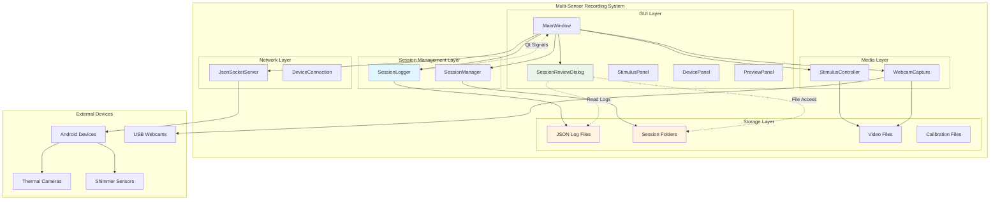
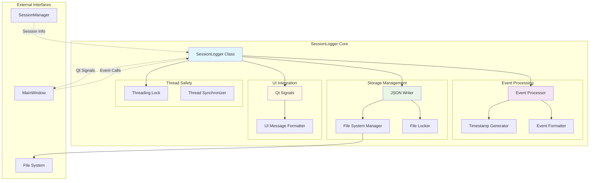
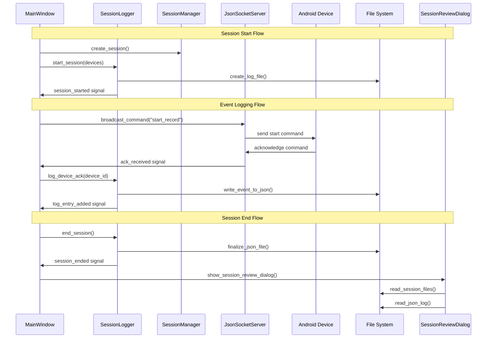
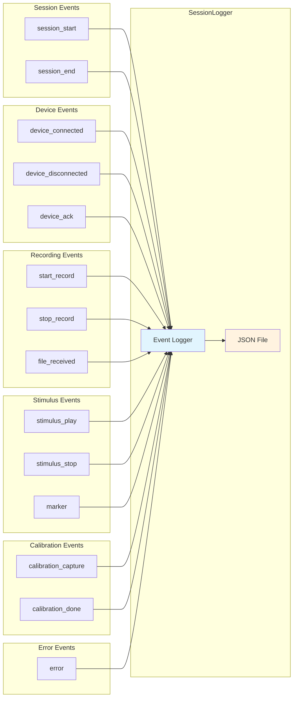
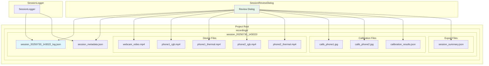
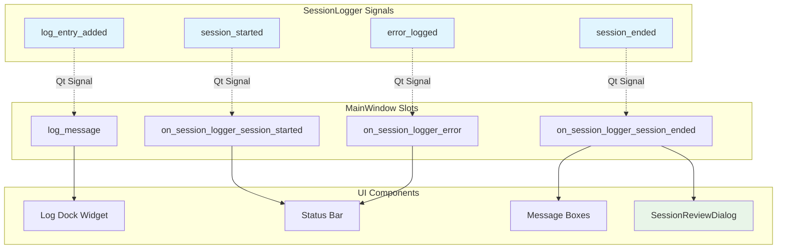
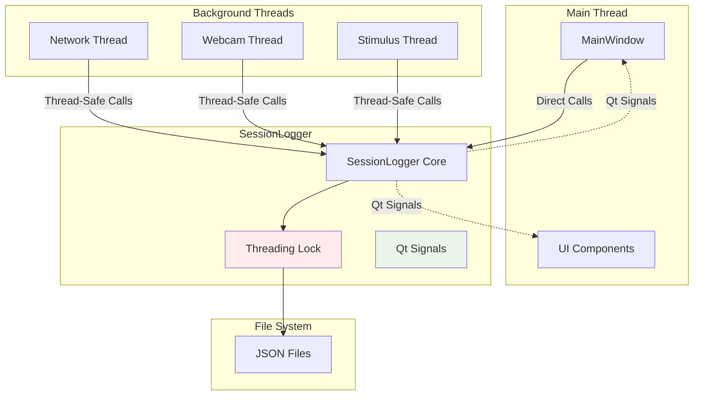

# Session Logger Architecture Documentation

**Date:** 2025-07-30  
**Milestone:** 3.8 - Session Metadata Logging and Review  
**Author:** Multi-Sensor Recording System Team

## Overview

This document provides comprehensive architectural documentation for the SessionLogger system implemented in Milestone 3.8. The SessionLogger provides structured JSON event logging, real-time UI feedback, and post-session review capabilities for the Multi-Sensor Recording System.

## System Architecture Overview

## SessionLogger Component Architecture

## Data Flow Architecture

## Event Type Architecture

## File System Architecture

## Qt Signal Integration Architecture

## Thread Safety Architecture

## Integration Points

### 1. MainWindow Integration
- **Event Logging**: All major UI events are logged through SessionLogger
- **Signal Handling**: Qt signals provide real-time UI updates
- **Session Management**: Coordinates with SessionManager for folder management
- **Review Dialog**: Launches SessionReviewDialog after session completion

### 2. Device Integration
- **JsonSocketServer**: Logs device connections, acknowledgments, and errors
- **WebcamCapture**: Logs webcam recording events and file creation
- **Device Events**: All device interactions are captured with timestamps

### 3. Stimulus Integration
- **StimulusController**: Logs stimulus playback start/stop events
- **Event Markers**: User-generated markers with stimulus timeline correlation
- **Media Tracking**: Records media file names and playback timing

### 4. File System Integration
- **Session Folders**: Organized file structure per session
- **JSON Logging**: Structured event logging with immediate disk writes
- **File Tracking**: All session files are cataloged and accessible

## Performance Considerations

### 1. Thread Safety
- **Threading.Lock**: Ensures thread-safe access to shared resources
- **Qt Signals**: Proper cross-thread communication for UI updates
- **Atomic Operations**: File writes are atomic to prevent corruption

### 2. File I/O Optimization
- **Immediate Flushing**: Events are written immediately with fsync
- **JSON Structure**: Efficient JSON structure for fast parsing
- **File Locking**: Prevents concurrent access issues

### 3. Memory Management
- **Event Buffering**: Events are stored in memory and written to disk
- **Resource Cleanup**: Proper cleanup of file handles and resources
- **Memory Efficiency**: Minimal memory footprint for event storage

## Error Handling Strategy

### 1. Logging Errors
- **Categorized Errors**: Different error types for different scenarios
- **Context Information**: Device ID, timestamps, and error messages
- **Error Propagation**: Errors are logged and signaled to UI

### 2. Recovery Mechanisms
- **Crash Recovery**: Valid JSON maintained even during crashes
- **Session Recovery**: Ability to resume logging after interruption
- **File Validation**: JSON structure validation and repair

### 3. User Feedback
- **Real-Time Alerts**: Immediate error notification through UI
- **Error Logging**: All errors are logged for post-session analysis
- **Graceful Degradation**: System continues operating despite errors

## Future Enhancements

### 1. Advanced Analytics
- **Performance Metrics**: Detailed timing and performance analysis
- **Statistical Analysis**: Session statistics and trend analysis
- **Data Visualization**: Graphical representation of session data

### 2. Enhanced Review Features
- **Video Synchronization**: Synchronized playback of multiple video streams
- **Timeline Visualization**: Interactive timeline with event markers
- **Export Capabilities**: Multiple export formats for analysis tools

### 3. Cloud Integration
- **Remote Storage**: Cloud backup of session data
- **Collaborative Review**: Multi-user session review capabilities
- **Real-Time Monitoring**: Remote monitoring of active sessions

## Conclusion

The SessionLogger architecture provides a robust, scalable, and maintainable solution for comprehensive session metadata logging. The system integrates seamlessly with existing components while providing new capabilities for session review and analysis. The architecture supports future enhancements and maintains high performance through careful design of thread safety, file I/O, and error handling mechanisms.
