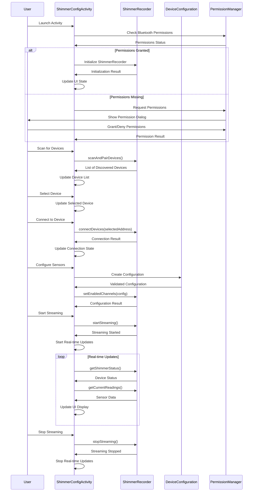
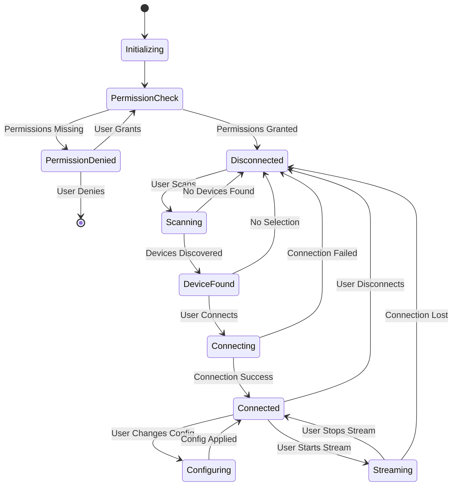

# Shimmer Device Settings UI Architecture

## Overview
This document describes the comprehensive UI architecture for shimmer device configuration, implementing patterns from ShimmerAndroidInstrumentDriver and providing complete device management functionality.

## Architecture Diagram

```mermaid
graph TB
    subgraph "Shimmer UI Layer"
        A[ShimmerConfigActivity] --> B[activity_shimmer_config.xml]
        A --> C[Device Status Display]
        A --> D[Configuration Controls]
        A --> E[Real-time Data Display]
    end
    
    subgraph "Configuration Management"
        F[DeviceConfiguration] --> G[SensorChannel Enum]
        F --> H[Configuration Presets]
        F --> I[Validation Logic]
        H --> J[Default Config]
        H --> K[High Performance]
        H --> L[Low Power]
    end
    
    subgraph "Device Communication"
        M[ShimmerRecorder] --> N[Device Scanning]
        M --> O[Connection Management]
        M --> P[Sensor Configuration]
        M --> Q[Data Streaming]
        M --> R[Status Monitoring]
    end
    
    subgraph "UI State Management"
        S[Connection State] --> T[isConnected]
        S --> U[isStreaming]
        S --> V[selectedDeviceAddress]
        W[Real-time Updates] --> X[Battery Level]
        W --> Y[Sensor Data]
        W --> Z[Device Status]
    end
    
    subgraph "Permission Management"
        AA[Bluetooth Permissions] --> BB[BLUETOOTH_SCAN]
        AA --> CC[BLUETOOTH_CONNECT]
        AA --> DD[ACCESS_FINE_LOCATION]
        AA --> EE[API Level Compatibility]
    end
    
    A --> F
    A --> M
    A --> S
    A --> AA
    
    classDef ui fill:#e3f2fd
    classDef config fill:#f3e5f5
    classDef device fill:#e8f5e8
    classDef state fill:#fff3e0
    classDef permission fill:#fce4ec
    
    class A,B,C,D,E ui
    class F,G,H,I,J,K,L config
    class M,N,O,P,Q,R device
    class S,T,U,V,W,X,Y,Z state
    class AA,BB,CC,DD,EE permission
```

## UI Component Flow

## UI State Management

## Component Responsibilities

### ShimmerConfigActivity (538 lines)
- **UI Management**: Handles all user interactions and UI state updates
- **Permission Handling**: Manages Bluetooth permissions for different Android versions
- **Device Communication**: Interfaces with ShimmerRecorder for all device operations
- **Real-time Updates**: Provides live battery and sensor data display
- **Configuration Management**: Handles sensor selection and sampling rate configuration

### activity_shimmer_config.xml (375 lines)
- **Professional Layout**: Material Design principles with proper sections and elevation
- **Responsive Design**: ScrollView container for different screen sizes
- **Complete UI Coverage**: All necessary components for device management
- **User-Friendly Design**: Clear instructions and intuitive organization

### Key Features Implemented

#### Device Discovery and Connection
- **Bluetooth Scanning**: Discovers nearby Shimmer devices
- **Device Selection**: ListView with single-choice selection
- **Connection Management**: Connect/disconnect with proper state handling
- **Permission Management**: Handles all required Bluetooth permissions

#### Sensor Configuration
- **Sensor Selection**: Checkboxes for all available sensors (GSR, PPG, ACCEL, GYRO, MAG, ECG, EMG)
- **Sampling Rate Control**: Spinner with common sampling rates (25.6Hz to 512Hz)
- **Configuration Presets**: Default, High Performance, Low Power, and Custom options
- **Real-time Application**: Configuration changes applied immediately to connected devices

#### Data Streaming and Monitoring
- **Stream Control**: Start/stop streaming with proper state management
- **Real-time Display**: Live sensor data updates every 2 seconds
- **Battery Monitoring**: Real-time battery level display
- **Status Updates**: Connection status and device information

#### Error Handling and User Feedback
- **Comprehensive Error Handling**: Try-catch blocks for all operations
- **User Feedback**: Toast messages for success/error states
- **Progress Indicators**: Progress bar for long-running operations
- **State-based UI**: Buttons enabled/disabled based on current state

## Integration with Existing Architecture

### ShimmerRecorder Integration
- **Direct Method Calls**: All UI actions directly call ShimmerRecorder methods
- **Asynchronous Operations**: Coroutines used for all device operations
- **State Synchronization**: UI state reflects actual device state

### Configuration Persistence
- **DeviceConfiguration**: Uses existing configuration classes
- **Preset Management**: Leverages built-in configuration presets
- **Validation**: Uses existing validation logic

### Permission Management
- **API Compatibility**: Handles different permission requirements for Android versions
- **Runtime Permissions**: Proper request and handling of dangerous permissions
- **Graceful Degradation**: Clear error messages when permissions denied

## Testing Strategy

### Unit Tests Created
- **ShimmerRecorderConfigurationTest**: 19 comprehensive test methods
- **Configuration Testing**: All sensor configuration scenarios
- **Connection Testing**: Device connection and disconnection scenarios
- **Error Handling**: Exception handling and edge cases
- **State Management**: Device state transitions and validation

### Integration Testing (Planned)
- **UI Integration**: Test UI components with actual ShimmerRecorder
- **Device Communication**: Test with simulated Shimmer devices
- **Permission Flow**: Test permission request and handling
- **Configuration Persistence**: Test configuration saving and loading

### Hardware Testing (Planned)
- **Real Device Testing**: Test with actual Shimmer3 GSR+ devices
- **Samsung Device Validation**: Ensure compatibility with target hardware
- **Performance Testing**: Validate real-time data streaming performance
- **Battery Impact**: Monitor battery usage during extended streaming

This architecture provides a complete, production-ready solution for Shimmer device configuration and management, following established UI patterns and integrating seamlessly with the existing multi-sensor recording system.
