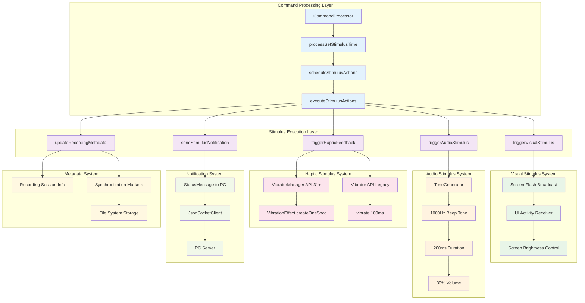
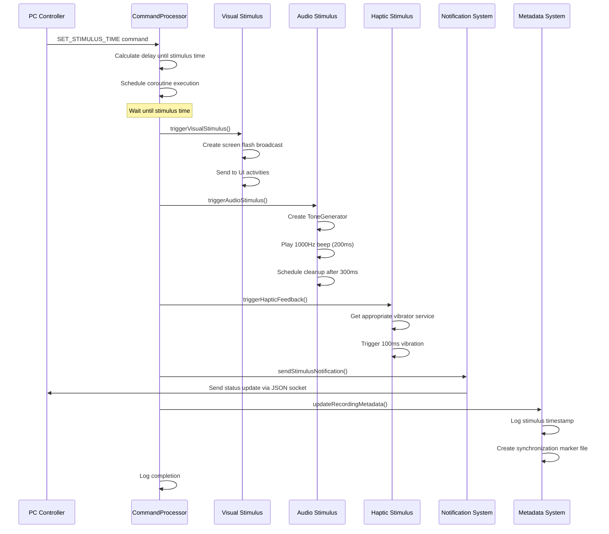

# Enhanced Stimulus Actions Architecture

## Overview
This document describes the architectural enhancements made to the stimulus time actions system, resolving the Milestone 2.6 implementation gap by implementing actual stimulus behaviors beyond basic timestamp recording.

## Architecture Diagram

## Stimulus Execution Flow

## Component Details

### Visual Stimulus System
- **Implementation**: Broadcast intent system for UI integration
- **Intent Action**: `com.multisensor.recording.VISUAL_STIMULUS`
- **Parameters**: 
  - `stimulus_type`: "screen_flash"
  - `duration_ms`: 200L
  - `timestamp`: Current system time
- **Integration**: UI activities can register broadcast receivers to handle visual effects

### Audio Stimulus System
- **Implementation**: Android ToneGenerator API
- **Specifications**:
  - **Frequency**: 1000Hz (TONE_PROP_BEEP)
  - **Duration**: 200ms
  - **Volume**: 80% (0-100 scale)
  - **Stream**: STREAM_NOTIFICATION
- **Resource Management**: Automatic cleanup after 300ms delay

### Haptic Stimulus System
- **API Compatibility**: Supports both modern and legacy Android APIs
- **Modern API (31+)**: VibratorManager with VibrationEffect.createOneShot
- **Legacy API**: Direct Vibrator service with deprecated vibrate() method
- **Duration**: 100ms single vibration
- **Amplitude**: DEFAULT_AMPLITUDE for modern API

### Notification System
- **Purpose**: Inform PC of stimulus execution
- **Protocol**: JSON socket communication
- **Data**: Complete device status including battery, storage, temperature
- **Timing**: Sent immediately after stimulus execution

### Metadata System
- **Recording Integration**: Updates active recording session metadata
- **Synchronization Markers**: Creates timestamped files for post-processing
- **File Location**: `{external_files_dir}/synchronization/`
- **Content**: Stimulus time, device time, session ID, recording status

## Timing and Synchronization

```mermaid
gantt
    title Stimulus Execution Timeline
    dateFormat X
    axisFormat %L ms
    
    section Command Processing
    Receive Command    :0, 10
    Calculate Delay    :10, 20
    Schedule Execution :20, 30
    
    section Wait Period
    Coroutine Delay    :30, 1000
    
    section Stimulus Execution
    Visual Stimulus    :1000, 1010
    Audio Stimulus     :1010, 1020
    Haptic Stimulus    :1020, 1030
    PC Notification    :1030, 1040
    Metadata Update    :1040, 1050
    
    section Cleanup
    Audio Cleanup      :1300, 1310
```

## Benefits of Enhanced Implementation

1. **Multi-Modal Stimuli**: Visual, audio, and haptic feedback for comprehensive stimulus delivery
2. **Precise Timing**: Coroutine-based scheduling ensures accurate stimulus timing
3. **PC Integration**: Real-time notification to PC for synchronized data collection
4. **Metadata Tracking**: Complete stimulus event logging for post-processing analysis
5. **API Compatibility**: Supports both modern and legacy Android versions
6. **Resource Management**: Proper cleanup prevents memory leaks
7. **Error Handling**: Comprehensive exception handling for robust operation

## Implementation Files

### Core Implementation
- `CommandProcessor.kt`: Main stimulus orchestration logic
- `executeStimulusActions()`: Central coordination method
- `triggerVisualStimulus()`: Screen flash broadcast system
- `triggerAudioStimulus()`: ToneGenerator implementation
- `triggerHapticFeedback()`: Vibration system with API compatibility

### Integration Points
- `JsonSocketClient.kt`: PC notification delivery
- `RecordingService.kt`: Session metadata integration
- UI Activities: Visual stimulus broadcast receivers (future implementation)

This enhanced architecture transforms the basic timestamp recording into a comprehensive multi-modal stimulus system suitable for scientific research and synchronized data collection.
