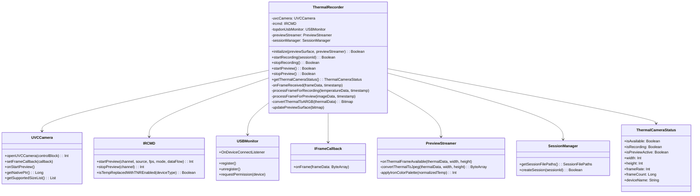
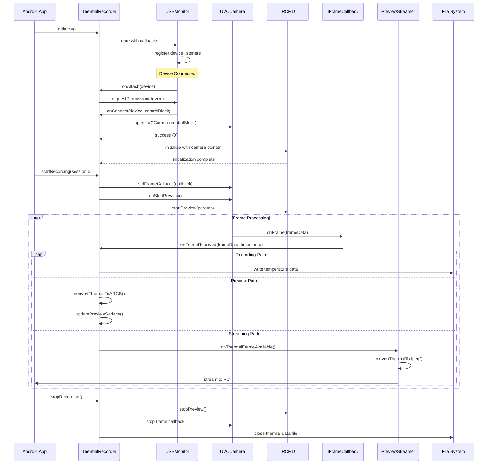
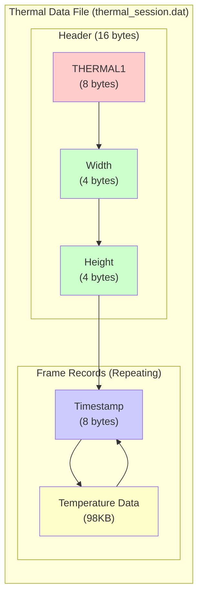

# Thermal Recording System Architecture

## System Overview

```mermaid
graph TB
    subgraph "Android Application"
        subgraph "ThermalRecorder Module"
            TR[ThermalRecorder]
            USB[USBMonitor]
            UVC[UVCCamera]
            IRCMD[IRCMD]
            FC[IFrameCallback]
        end
        
        subgraph "Integration Layer"
            SM[SessionManager]
            PS[PreviewStreamer]
            LOG[Logger]
        end
        
        subgraph "Data Processing"
            BG[Background Thread]
            FW[File Writer Thread]
            IP[Image Processing]
        end
    end
    
    subgraph "Hardware"
        TC[Topdon TC001/Plus]
        USB_C[USB-C OTG]
        PHONE[Samsung S22]
    end
    
    subgraph "PC Controller"
        NET[Network Socket]
        PREVIEW[Live Preview]
        CONTROL[Recording Control]
    end
    
    subgraph "Data Storage"
        THERMAL[thermal_session.dat]
        SESSION[Session Directory]
        METADATA[Session Metadata]
    end
    
    %% Hardware Connections
    TC -->|USB-C OTG| USB_C
    USB_C -->|Physical Connection| PHONE
    
    %% SDK Integration
    TR -->|Manages| USB
    USB -->|Device Events| TR
    TR -->|Initializes| UVC
    TR -->|Initializes| IRCMD
    UVC -->|Frame Data| FC
    FC -->|Thermal Frames| TR
    
    %% Data Flow
    TR -->|Frame Processing| BG
    TR -->|File Writing| FW
    TR -->|Session Info| SM
    TR -->|Preview Frames| PS
    TR -->|Logging| LOG
    
    %% Network Integration
    PS -->|Compressed Frames| NET
    NET -->|Live Stream| PREVIEW
    CONTROL -->|Commands| NET
    
    %% Storage
    FW -->|Raw Data| THERMAL
    SM -->|Organization| SESSION
    TR -->|Metadata| METADATA
    
    %% Styling
    classDef hardware fill:#ff9999
    classDef software fill:#99ccff
    classDef data fill:#99ff99
    classDef network fill:#ffcc99
    
    class TC,USB_C,PHONE hardware
    class TR,USB,UVC,IRCMD,FC,SM,PS,LOG,BG,FW,IP software
    class THERMAL,SESSION,METADATA data
    class NET,PREVIEW,CONTROL network
```

## Component Architecture

## Data Flow Architecture

## File Format Specification

## Integration Points

### SessionManager Integration
- **File Organization**: Creates thermal data files in session directories
- **Metadata Tracking**: Updates session info with thermal recording status
- **Naming Convention**: `thermal_{sessionId}.dat` format

### PreviewStreamer Integration
- **Frame Processing**: Receives thermal frames for PC streaming
- **Color Palette**: Applies iron color palette for visualization
- **Compression**: JPEG compression for network efficiency
- **Throttling**: Frame rate control for bandwidth management

### Logger Integration
- **Debug Information**: Comprehensive logging of SDK operations
- **Error Handling**: Detailed error reporting and troubleshooting
- **Performance Metrics**: Frame rate and processing statistics
- **Device Status**: USB connection and camera state logging

## Performance Characteristics

### Memory Usage
- **Frame Buffers**: 2 × 98KB (image + temperature data)
- **Preview Bitmaps**: ~200KB for ARGB conversion
- **File Buffers**: Buffered output stream for efficient I/O
- **Total Overhead**: <100MB additional memory usage

### Processing Performance
- **Frame Rate**: 25 fps thermal data capture
- **Preview Rate**: ~15-25 fps local display
- **Streaming Rate**: ~10 fps to PC (throttled)
- **File I/O**: ~2.45 MB/s continuous write performance

### Storage Requirements
- **Per Frame**: 98KB temperature data + 8 bytes timestamp
- **Per Second**: ~2.45 MB at 25 fps
- **Per Minute**: ~147 MB
- **10 Minutes**: ~1.47 GB

## Hardware Compatibility

### Supported Devices
- **Topdon TC001**: PID 0x3901, 256×192 resolution
- **Topdon TC001 Plus**: PID 0x5840, 256×192 resolution
- **Additional Models**: PIDs 0x5830, 0x5838 supported

### Android Requirements
- **API Level**: 24+ (Android 7.0+)
- **USB Host**: Required for OTG camera connection
- **Storage**: UFS 3.0+ recommended for performance
- **RAM**: 8GB+ recommended for multi-sensor recording

### Network Requirements
- **Wi-Fi**: 802.11n+ for preview streaming
- **Bandwidth**: ~100KB/s for thermal preview stream
- **Latency**: <100ms for real-time preview experience