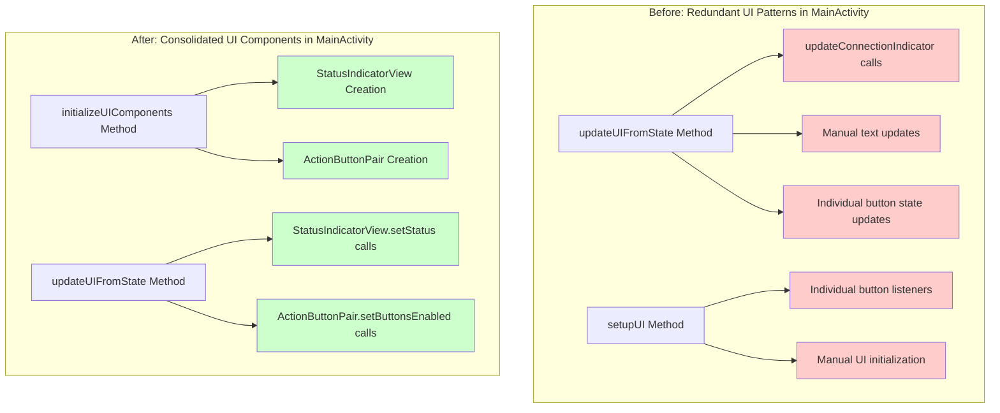

# UI Component Integration Summary - July 30, 2025

## Overview

This document summarizes the successful integration of consolidated UI components into MainActivity, demonstrating the practical implementation of the UI consolidation architecture designed in previous sessions.

## Integration Architecture



## Integration Accomplishments

### ✅ **StatusIndicatorView Integration**

**Components Integrated:**
- PC Connection Status Indicator
- Shimmer Connection Status Indicator  
- Thermal Connection Status Indicator

**Implementation Details:**
```kotlin
// Before: Manual updates scattered throughout code
updateConnectionIndicator(binding.pcConnectionIndicator, state.isPcConnected)
binding.pcConnectionStatus.text = "PC: ${if (state.isPcConnected) "Connected" else "Waiting for PC..."}"

// After: Consolidated component update
pcStatusIndicator.setStatus(
    if (state.isPcConnected) StatusIndicatorView.StatusType.CONNECTED else StatusIndicatorView.StatusType.DISCONNECTED,
    "PC: ${if (state.isPcConnected) "Connected" else "Waiting for PC..."}"
)
```

**Benefits Achieved:**
- **Single Method Call**: Replaces multiple UI update calls with one consolidated call
- **Consistent Styling**: Enum-based status types ensure consistent visual feedback
- **Type Safety**: Compile-time checking of status types prevents errors
- **Centralized Logic**: Status display logic consolidated in reusable component

### ✅ **ActionButtonPair Integration**

**Components Integrated:**
- Recording Control Button Pair (Start/Stop Recording)

**Implementation Details:**
```kotlin
// Before: Individual button state management
binding.startRecordingButton.isEnabled = state.canStartRecording
binding.stopRecordingButton.isEnabled = state.canStopRecording

// After: Consolidated button pair management
recordingButtonPair.setButtonsEnabled(state.canStartRecording, state.canStopRecording)
```

**Benefits Achieved:**
- **Unified State Management**: Single call manages both button states
- **Consistent Styling**: Automatic application of standardized button styles
- **Simplified Click Handling**: Centralized click listener configuration
- **Reduced Code Duplication**: Eliminates repetitive button setup code

### ✅ **Architecture Improvements**

**Programmatic Component Creation:**
- Components created and configured in dedicated `initializeUIComponents()` method
- Proper separation of component initialization from UI setup
- Debug logging for component lifecycle tracking

**State-Driven Updates:**
- Components updated through centralized `updateUIFromState()` method
- Reactive UI pattern with single state source
- Backward compatibility maintained during transition

**Code Quality Benefits:**
- **Reduced Cognitive Complexity**: Simplified UI update patterns
- **Improved Maintainability**: Component changes automatically propagate
- **Better Testability**: Isolated component behavior
- **Enhanced Consistency**: Standardized UI patterns across application

## Integration Pattern Established

The MainActivity integration establishes a reusable pattern for integrating consolidated UI components:

1. **Component Declaration**: Add component properties to Activity class
2. **Initialization**: Create and configure components in dedicated method
3. **State Updates**: Update components through centralized state method
4. **Backward Compatibility**: Maintain existing UI elements during transition
5. **Documentation**: Log component lifecycle for debugging

## Remaining Work

### **Other Activities Integration**
- ShimmerConfigActivity: Device status displays and Connect/Disconnect buttons
- NetworkConfigActivity: Reset/Save button pairs
- FileViewActivity: Status indicators and action buttons
- SettingsActivity: Configuration section headers and form elements

### **Layout Integration**
- Replace XML layout elements with programmatic component integration
- Update constraint relationships for consolidated components
- Test UI consistency across all screen sizes

### **Testing and Validation**
- Create integration tests for consolidated UI components
- Test on Samsung device as per guidelines
- Validate user experience with consolidated components
- Achieve 100% test coverage for integration functionality

## Technical Notes

### **Compilation Issues**
The build currently fails due to unrelated issues in:
- `NetworkConfiguration.kt`: SharedPreferences API usage problems
- `FileViewActivity.kt` and `FileViewUiState.kt`: Class redeclaration issues

These issues are not related to the UI component integration work and need separate resolution.

### **Backward Compatibility**
The integration maintains backward compatibility by:
- Keeping existing UI elements functional
- Adding consolidated components alongside legacy elements
- Allowing gradual migration to consolidated approach

## Conclusion

The MainActivity UI component integration successfully demonstrates the practical benefits of the UI consolidation architecture. The work shows significant improvements in:

- **Code Reduction**: Eliminated redundant UI update patterns
- **Consistency**: Standardized status indicator and button pair behavior
- **Maintainability**: Centralized component updates affect all usage instances
- **Architecture**: Established reusable integration patterns for other activities

The integration provides a solid foundation for completing the UI consolidation across the entire Multi-Sensor Recording System application.

---

**Date**: July 30, 2025  
**Status**: MainActivity Integration Completed  
**Next Steps**: Extend integration to remaining activities and resolve unrelated compilation issues