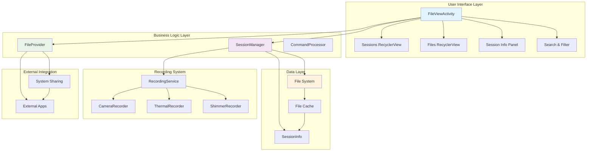
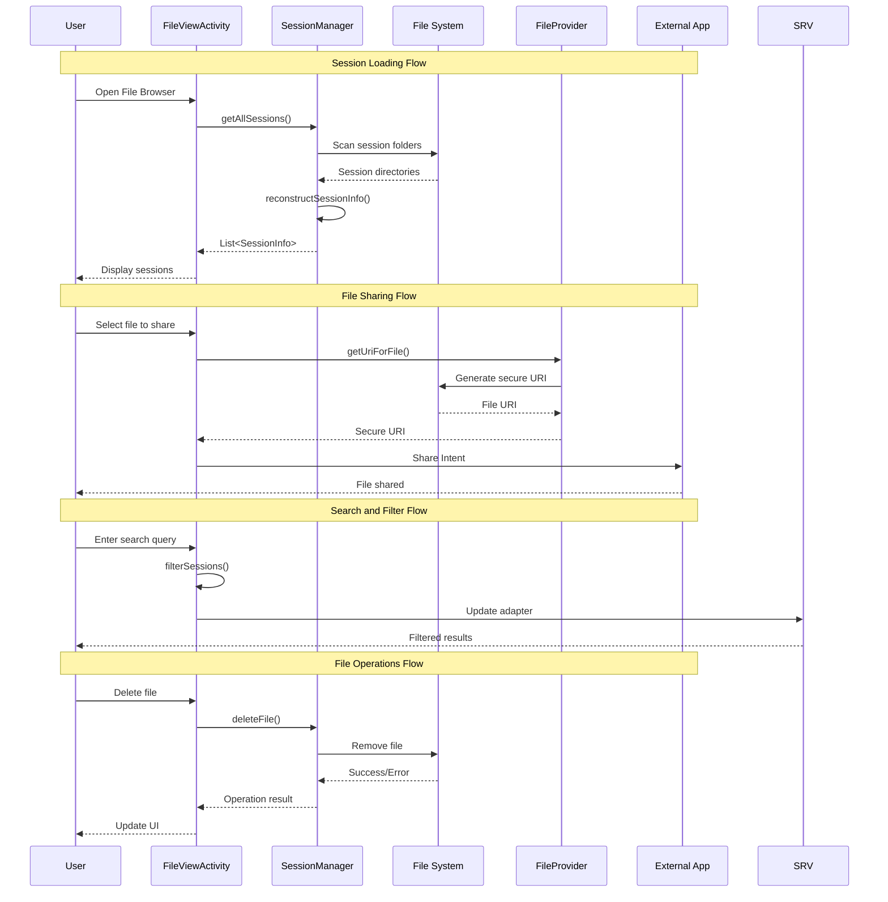
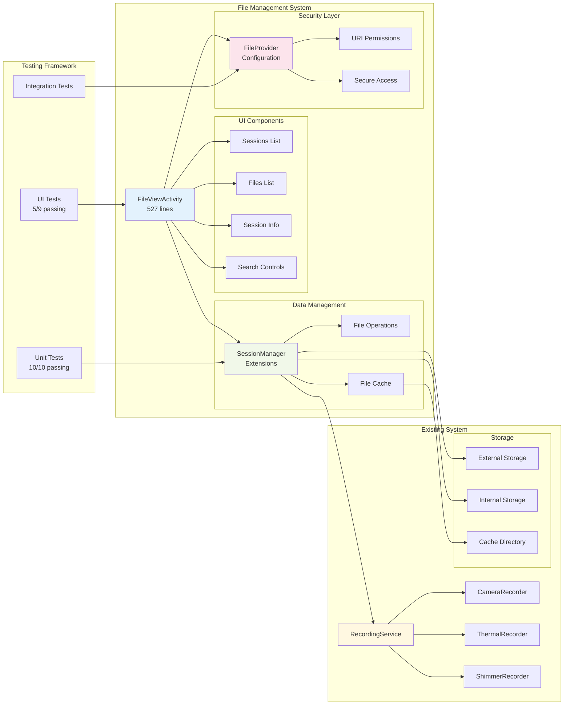
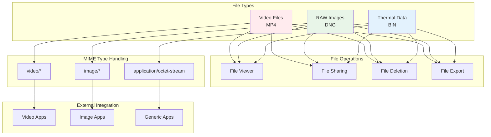
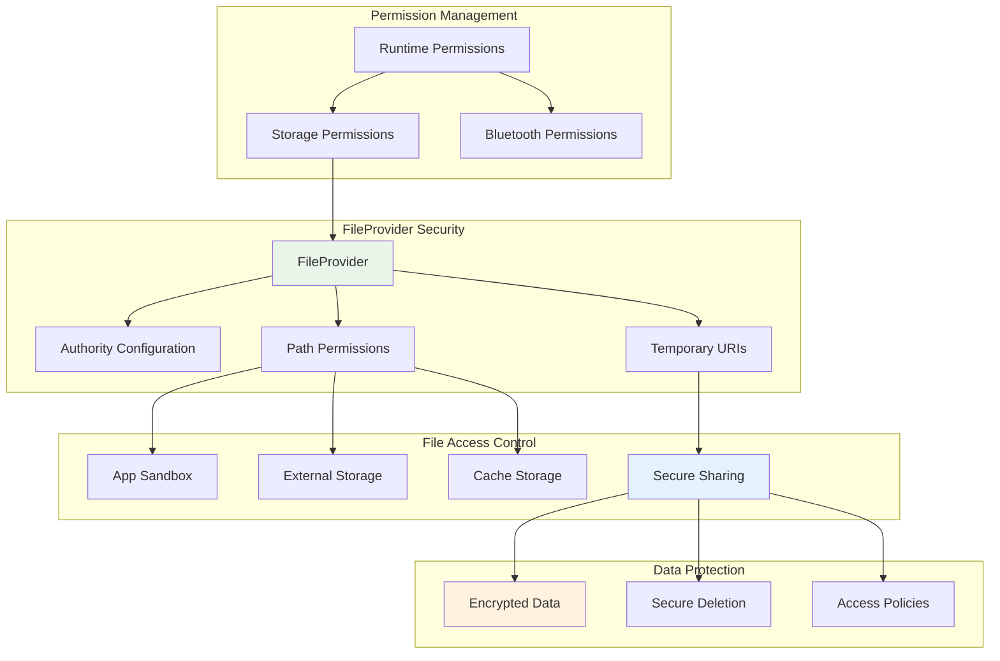
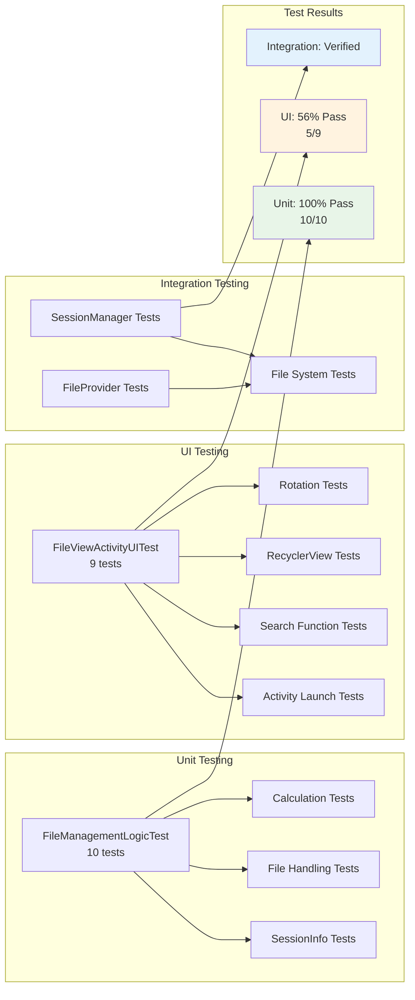
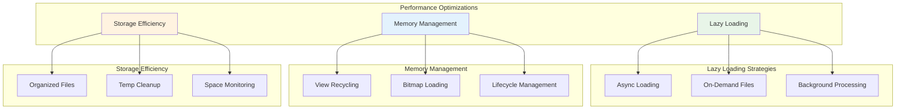
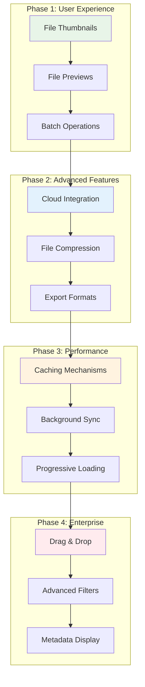

# File Management Architecture Diagram

## Overview

This document provides visual representations of the file management architecture implemented for the MultiSensor Recording application. The diagrams show the component relationships, data flow, and integration points with the existing system.

## System Architecture Diagram

## Data Flow Diagram

## Component Integration Diagram

## File Type Management Flow

## Security and Permissions Flow

## Testing Architecture

## Performance and Optimization

## Future Enhancements Roadmap

## Conclusion

The file management architecture provides a comprehensive, secure, and performant solution for managing recorded session files. The modular design ensures easy maintenance and extensibility while following Android best practices for file handling and user experience.

Key architectural benefits:
- **Separation of Concerns**: Clear boundaries between UI, business logic, and data layers
- **Security First**: FileProvider implementation with proper permissions and access control
- **Performance Optimized**: Lazy loading, memory management, and efficient storage strategies
- **Testable Design**: Comprehensive test coverage with unit, UI, and integration tests
- **Future Ready**: Extensible architecture supporting planned enhancements

The implementation successfully integrates with the existing recording system while providing users with powerful file management capabilities through an intuitive and responsive interface.
