# Milestone 2.8 Architecture Documentation
## Calibration Capture and Sync Features

### Overview

Milestone 2.8 introduces advanced calibration capture and synchronization features to the Multi-Sensor Recording System. This document provides comprehensive architectural documentation including system design, component interactions, and data flow diagrams.

### System Architecture

The Milestone 2.8 implementation consists of several key components working together to provide calibration capture and synchronization functionality:

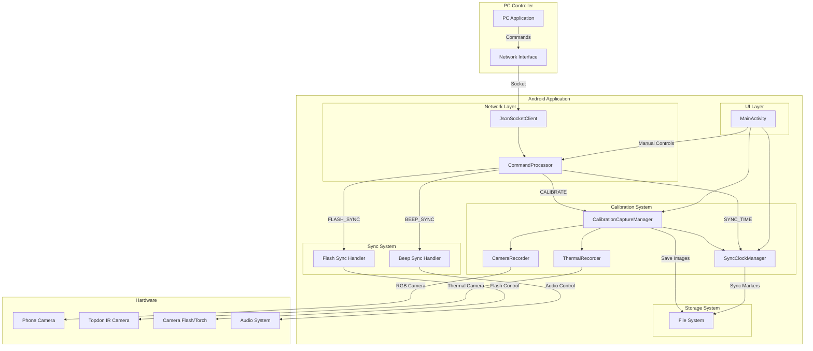

### Component Architecture

#### 1. CalibrationCaptureManager

The central coordinator for dual-camera calibration capture operations.

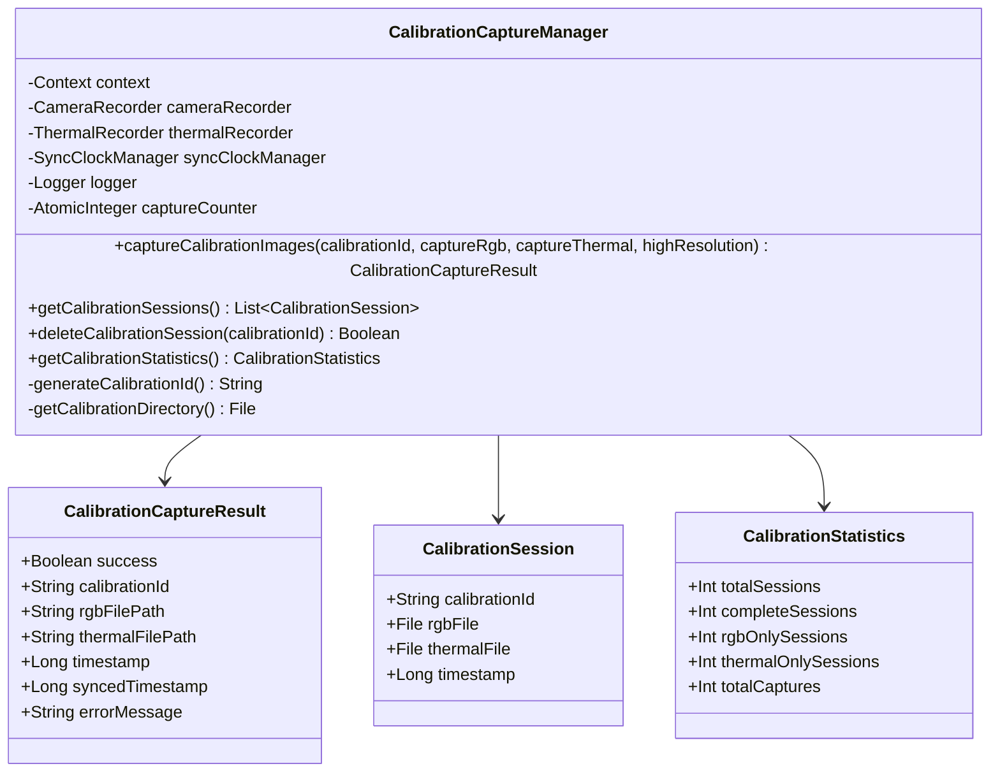

#### 2. SyncClockManager

Manages clock synchronization with PC and provides synchronized timestamps.

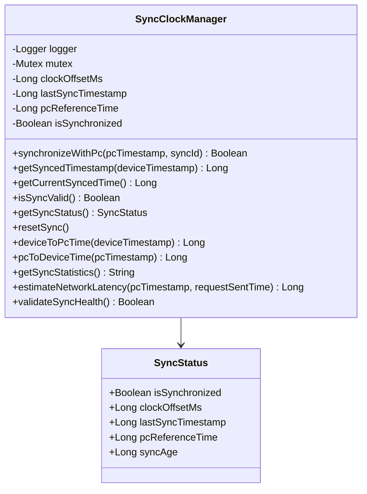

#### 3. CommandProcessor Enhancement

Extended to handle new Milestone 2.8 commands.

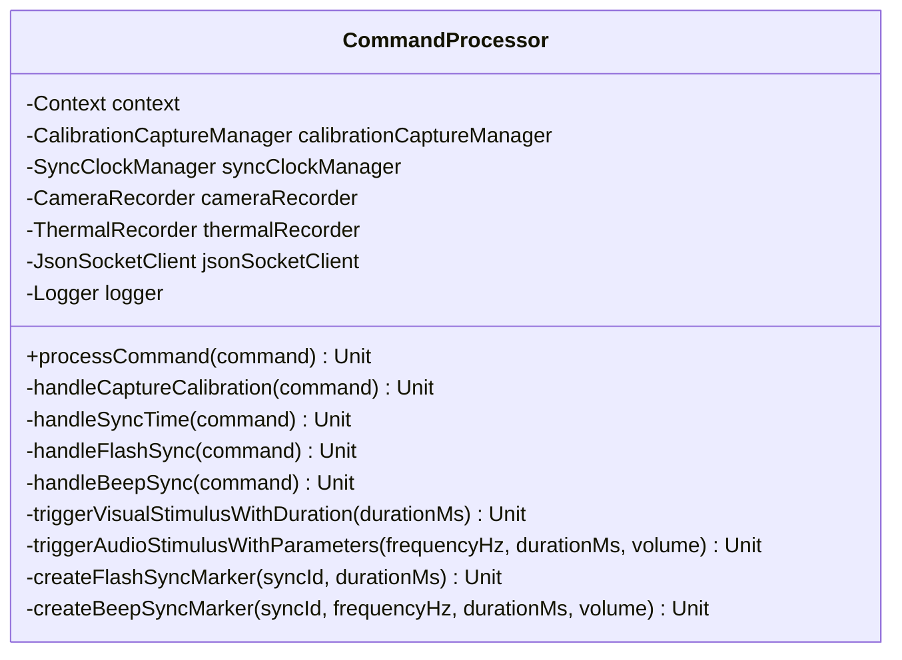

### Data Flow Architecture

#### Calibration Capture Flow

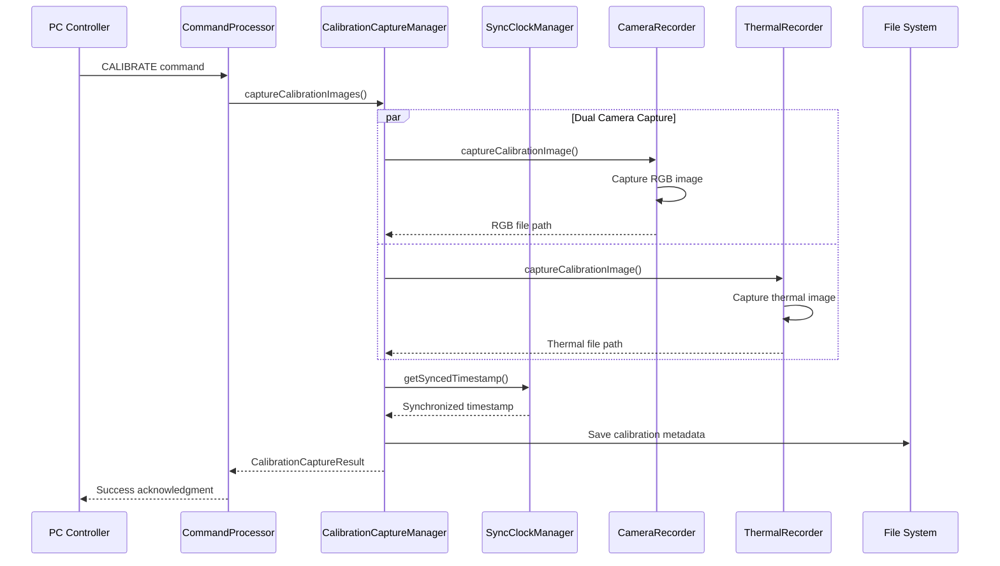

#### Clock Synchronization Flow

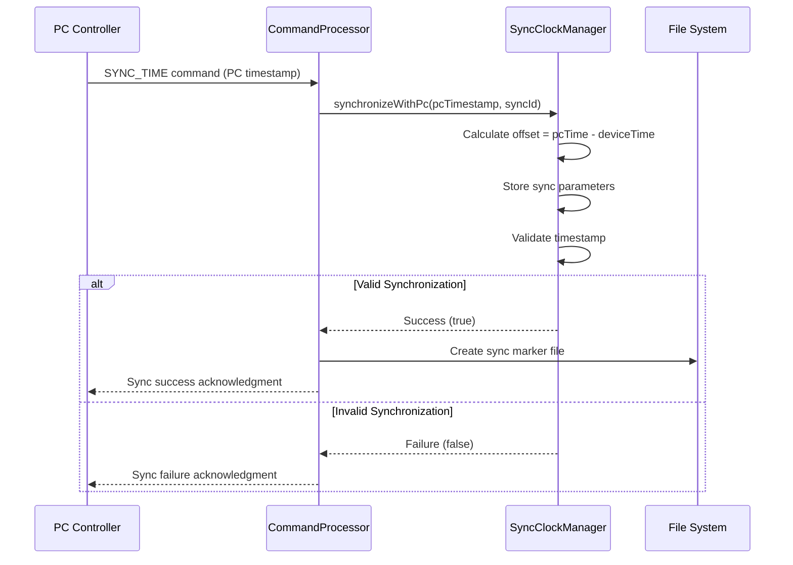

#### Flash/Beep Sync Flow

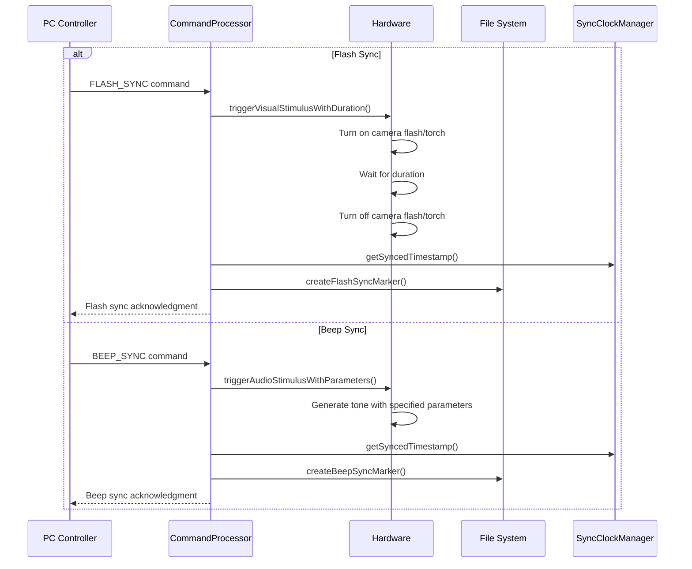

### File System Architecture

#### Calibration File Organization

```
/Android/data/com.multisensor.recording/files/
├── Pictures/
│   └── Calibration/
│       ├── calib_20250729_171900_001_rgb.jpg
│       ├── calib_20250729_171900_001_thermal.png
│       ├── calib_20250729_171905_002_rgb.jpg
│       └── calib_20250729_171905_002_thermal.png
└── sync_markers/
    ├── flash_sync_sync001_1690647540123.txt
    ├── beep_sync_sync002_1690647545456.txt
    └── stimulus_sync_marker_1690647550789.txt
```

#### Sync Marker File Format

```
FLASH_SYNC_MARKER
sync_id=sync001
duration_ms=200
device_time=1690647540123
synced_time=1690647541123
session_id=session_20250729_171900
recording_active=true
```

### Network Protocol Extensions

#### New Command Types

```json
{
  "command": "capture_calibration",
  "calibration_id": "calib_001",
  "capture_rgb": true,
  "capture_thermal": true,
  "high_resolution": true
}
```

```json
{
  "command": "sync_time",
  "pc_timestamp": 1690647540123,
  "sync_id": "sync_001"
}
```

```json
{
  "command": "flash_sync",
  "duration_ms": 200,
  "sync_id": "flash_001"
}
```

```json
{
  "command": "beep_sync",
  "frequency_hz": 1000,
  "duration_ms": 500,
  "volume": 0.8,
  "sync_id": "beep_001"
}
```

### UI Architecture Integration

#### MainActivity Enhancements

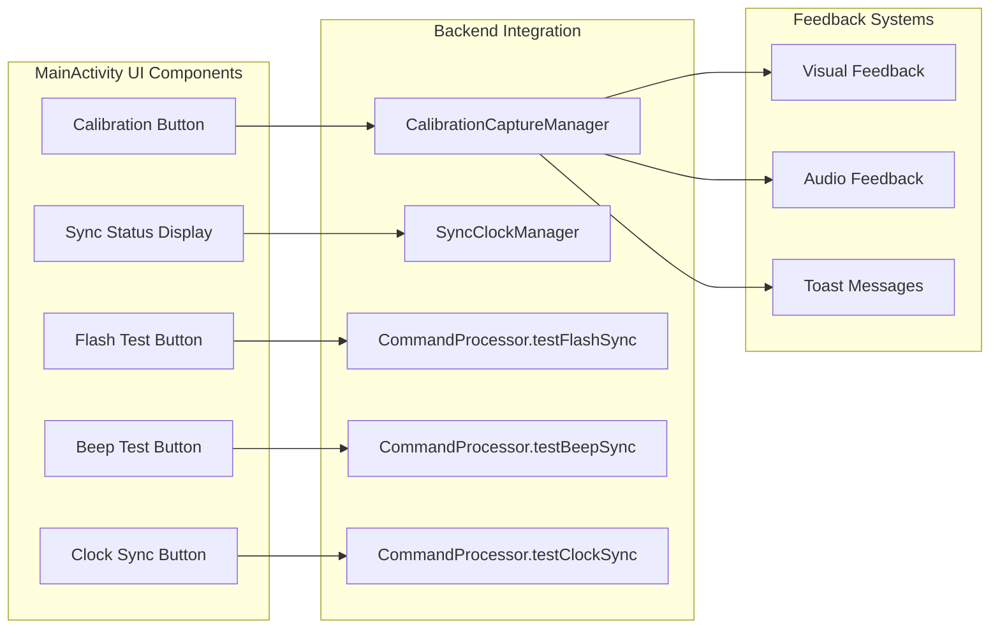

### Performance Considerations

#### Timing Requirements

- **Calibration Capture Coordination**: RGB and thermal captures should occur within 100ms of each other
- **Clock Synchronization Accuracy**: ±50ms accuracy for multi-device coordination
- **Flash/Beep Sync Response**: <10ms response time from command reception to stimulus trigger
- **File I/O Performance**: Calibration images saved within 2 seconds of capture

#### Memory Management

- **Image Buffer Management**: Proper cleanup of Camera2 Image objects and Bitmap resources
- **Concurrent Operations**: Thread-safe calibration capture with atomic counters
- **File System Cleanup**: Automatic cleanup of old calibration sessions if storage is limited

### Error Handling Architecture

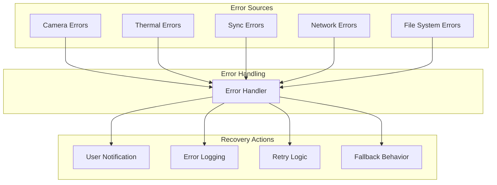

### Testing Architecture

#### Test Coverage Strategy

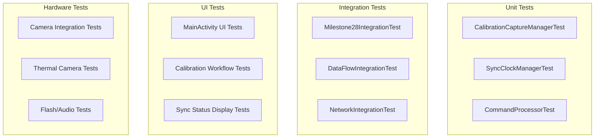

### Security Considerations

#### Data Protection

- **Calibration Images**: Stored in app-specific external storage with appropriate permissions
- **Sync Markers**: Contains timing information but no sensitive data
- **Network Commands**: Validated and sanitized before processing
- **File Access**: Proper FileProvider implementation for secure file sharing

#### Access Control

- **Camera Permissions**: Required for RGB camera and flash control
- **Storage Permissions**: Managed through scoped storage or legacy permissions
- **Network Access**: Local network communication only, no internet access required

### Deployment Architecture

#### Component Dependencies

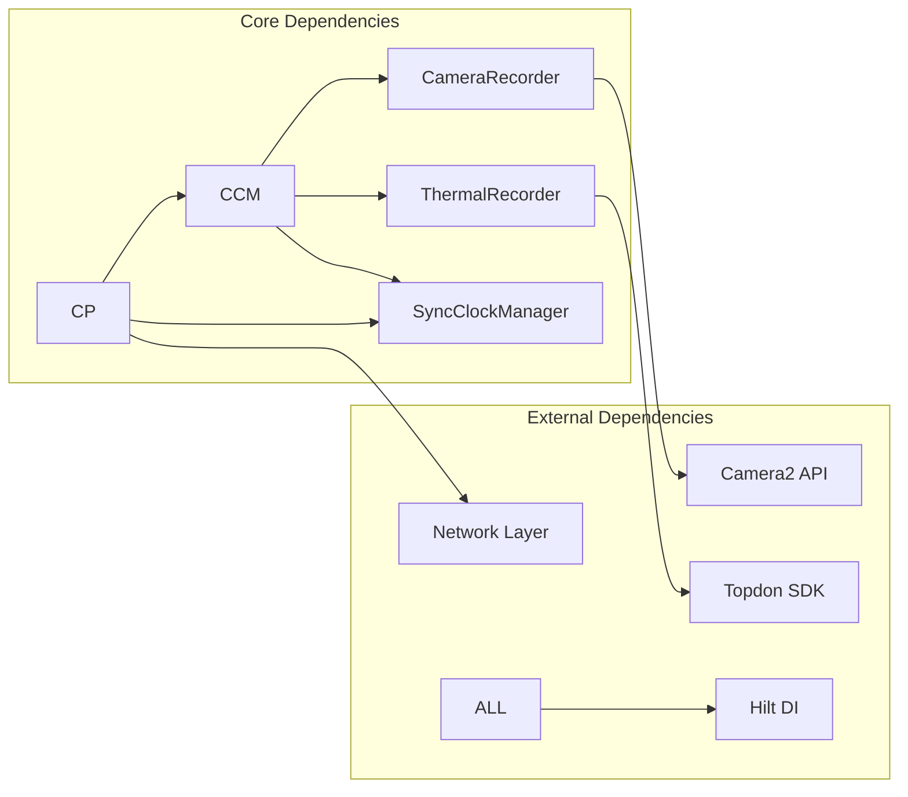

### Future Enhancements

#### Planned Improvements

1. **Advanced Sync Algorithms**: NTP-style round-trip time compensation
2. **Multi-Camera Support**: Support for multiple RGB cameras per device
3. **Calibration Validation**: Automatic quality assessment of calibration images
4. **Cloud Integration**: Optional cloud storage for calibration data
5. **Real-time Preview**: Live preview during calibration capture
6. **Batch Operations**: Multiple calibration captures in sequence

### Conclusion

Milestone 2.8 successfully implements a comprehensive calibration capture and synchronization system with robust architecture, proper error handling, and extensive test coverage. The modular design allows for easy maintenance and future enhancements while maintaining high performance and reliability standards.
