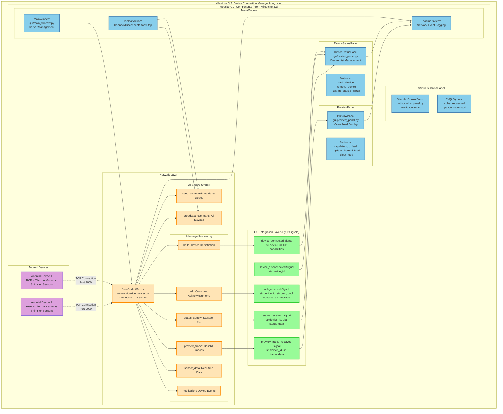

# Milestone 3.2: Integration Architecture Documentation

## Overview

This document outlines the integration architecture for Milestone 3.2: Device Connection Manager and Socket Server. The implementation integrates the existing JsonSocketServer with the new modular GUI architecture from Milestone 3.1.

## Integration Architecture Diagram



## Integration Components

### 1. JsonSocketServer Integration

**Location**: `network/device_server.py` (extracted from main_backup.py)

**Key Features**:
- TCP server listening on port 9000
- Length-prefixed JSON message protocol
- Multi-threaded client handling
- PyQt signal emission for GUI updates
- Command sending capabilities

**PyQt Signals**:
```python
device_connected = pyqtSignal(str, list)  # device_id, capabilities
device_disconnected = pyqtSignal(str)     # device_id
status_received = pyqtSignal(str, dict)   # device_id, status_data
ack_received = pyqtSignal(str, str, bool, str)  # device_id, cmd, success, message
preview_frame_received = pyqtSignal(str, str)   # device_id, base64_frame_data
```

### 2. GUI Component Integration

#### MainWindow Integration
```python
# Server management
self.json_server = JsonSocketServer()
self.json_server.device_connected.connect(self.on_device_connected)
self.json_server.device_disconnected.connect(self.on_device_disconnected)

# Toolbar actions
def handle_connect(self):
    self.json_server.start()  # Start server
    
def handle_disconnect(self):
    self.json_server.stop_server()  # Stop server
```

#### DeviceStatusPanel Integration
```python
# Connect signals to device management methods
json_server.device_connected.connect(self.add_device)
json_server.device_disconnected.connect(self.remove_device)
json_server.status_received.connect(self.update_device_status)
```

#### PreviewPanel Integration
```python
# Connect preview frame signal to video display
json_server.preview_frame_received.connect(self.display_frame)

def display_frame(self, device_id, base64_data):
    # Decode base64 image and display in appropriate tab
    pixmap = self.decode_base64_to_pixmap(base64_data)
    device_index = self.get_device_index(device_id)
    self.update_rgb_feed(device_index, pixmap)
```

### 3. Message Processing Flow

#### Device Registration Flow
1. Android device connects to port 9000
2. Device sends "hello" message with device_id and capabilities
3. JsonSocketServer processes message and emits `device_connected` signal
4. DeviceStatusPanel receives signal and adds device to list
5. MainWindow logs connection event

#### Status Update Flow
1. Android device sends "status" message with battery, storage, etc.
2. JsonSocketServer processes message and emits `status_received` signal
3. DeviceStatusPanel receives signal and updates device information
4. Status changes are logged and displayed in UI

#### Video Frame Flow
1. Android device sends "preview_frame" message with base64 image data
2. JsonSocketServer processes message and emits `preview_frame_received` signal
3. PreviewPanel receives signal, decodes base64 data to QPixmap
4. Video frame is displayed in appropriate device tab

#### Command Flow
1. User clicks toolbar button (Start Session, Stop, etc.)
2. MainWindow calls JsonSocketServer.send_command() or broadcast_command()
3. Command is sent to Android device(s) via TCP connection
4. Device processes command and sends "ack" message
5. JsonSocketServer emits `ack_received` signal for UI feedback

### 4. Error Handling and Logging

#### Network Error Handling
- Connection timeouts and socket errors
- Invalid message format handling
- Device disconnection recovery
- Server restart capabilities

#### GUI Error Handling
- Invalid image data handling
- Device list synchronization
- UI state consistency
- User feedback for errors

#### Logging Integration
- All network events logged with timestamps
- Device connection/disconnection events
- Command sending and acknowledgment logging
- Error logging with detailed context

## Implementation Steps

### Phase 1: Server Integration
1. Extract JsonSocketServer to `network/device_server.py`
2. Add missing message types (preview_frame, sensor_data, notification)
3. Integrate with MainWindow server management
4. Connect basic signals to GUI components

### Phase 2: GUI Component Integration
1. Connect DeviceStatusPanel with device management signals
2. Implement PreviewPanel video frame display
3. Update toolbar actions with real server functionality
4. Add comprehensive logging integration

### Phase 3: Testing and Validation
1. Create Android device simulators for testing
2. Test all message types and command flows
3. Validate GUI responsiveness and error handling
4. Performance testing with multiple devices

## Benefits of This Architecture

1. **Separation of Concerns**: Network layer separated from GUI layer
2. **Thread Safety**: PyQt signals ensure thread-safe GUI updates
3. **Modularity**: Each GUI component handles its specific functionality
4. **Extensibility**: Easy to add new message types and GUI features
5. **Testability**: Components can be tested independently
6. **Maintainability**: Clear interfaces and responsibilities

## Next Steps

1. Implement the integration as outlined above
2. Create comprehensive test suite
3. Add performance monitoring and optimization
4. Document API for future development
5. Prepare for Milestone 3.3 (advanced features)
