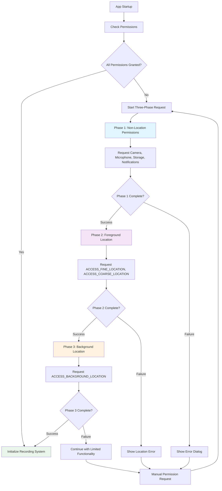
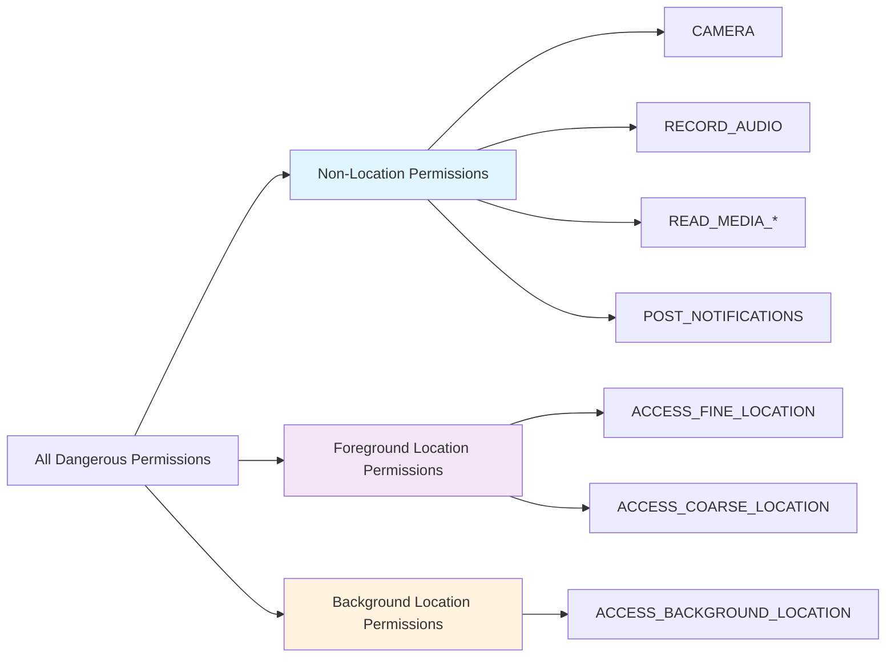
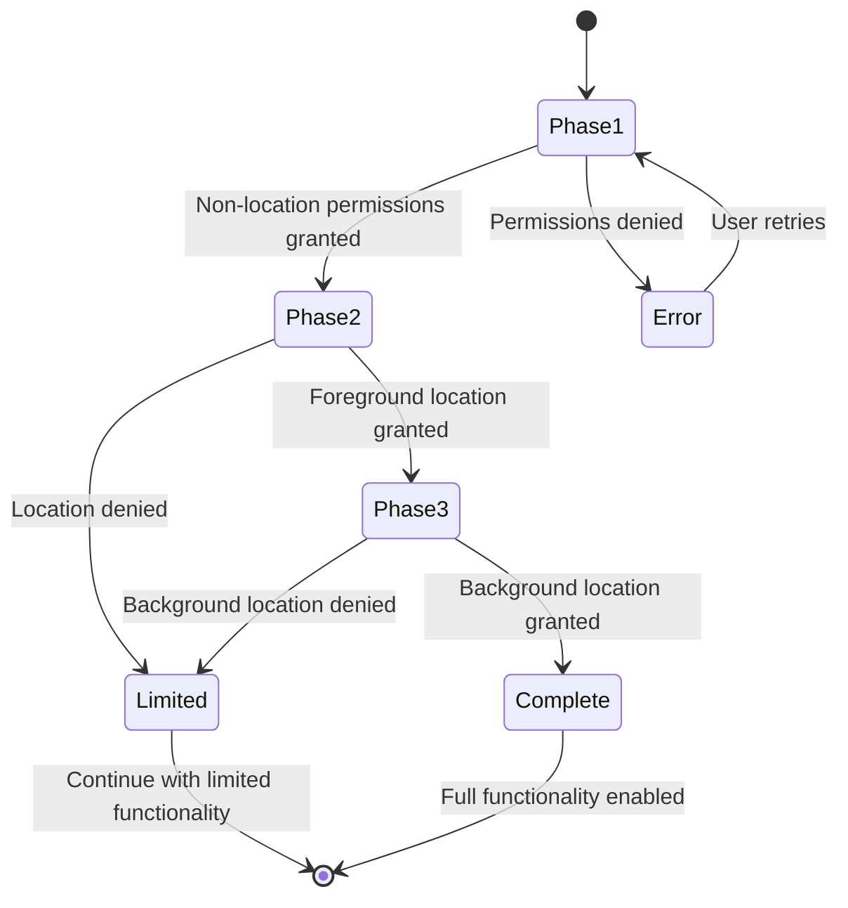

# Permission Flow Architecture

## Overview

This document describes the three-phase permission request architecture implemented to resolve XXPermissions library restrictions and prevent permission-related crashes.

## Problem Statement

The XXPermissions library throws `IllegalArgumentException: Because it includes background location permissions, do not apply for permissions unrelated to location` when background location permissions are requested together with non-location permissions.

## Solution Architecture

### Three-Phase Permission Flow

### Permission Grouping Strategy

## Implementation Details

### Key Components

1. **PermissionTool.kt**
   - `getAllDangerousPermissions()`: Excludes background location permissions
   - `requestAllDangerousPermissions()`: Implements three-phase flow
   - `ThreePhasePermissionCallback`: Manages phase transitions

2. **AllAndroidPermissions.kt**
   - `getDangerousPermissions()`: Aligned with PermissionTool approach
   - Excludes background location from main permission list

3. **MainActivity.kt**
   - `checkPermissions()`: Entry point for permission checking
   - Uses PermissionTool for consistent permission handling

### Phase Transition Logic

## Benefits

1. **Crash Prevention**: Eliminates XXPermissions library restriction errors
2. **User Experience**: Smooth permission flow without interruptions
3. **Compliance**: Proper Android permission handling
4. **Flexibility**: Graceful degradation when permissions are denied
5. **Maintainability**: Clear separation of permission types

## Testing Strategy

- Unit tests verify permission grouping logic
- Integration tests ensure three-phase flow works correctly
- Build verification confirms no compilation errors
- Manual testing on Samsung devices as per guidelines

## Future Considerations

- Monitor Android permission policy changes
- Update permission grouping as new permissions are added
- Consider user education for background location permissions
- Implement permission rationale dialogs for better UX