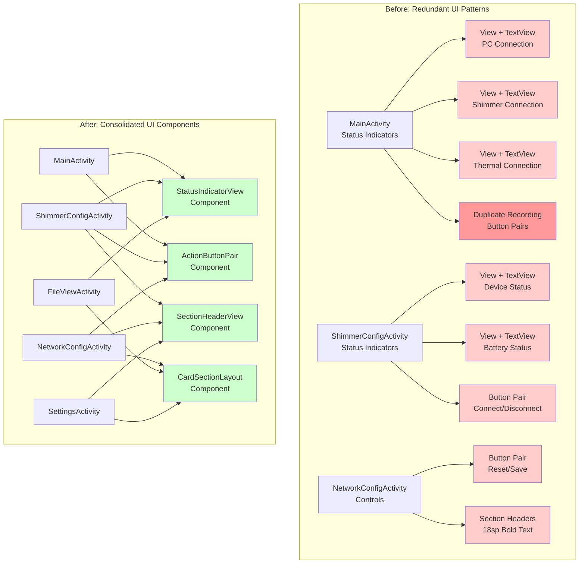

# UI Consolidation Architecture

## Overview
This document describes the UI consolidation architecture implemented to eliminate redundant UI controls and patterns across the Multi-Sensor Recording System Android application.

## Architecture Diagram



## Component Details

### StatusIndicatorView
- **Purpose**: Consolidates status indicator patterns (colored dot + text)
- **Replaces**: Multiple View + TextView combinations
- **Features**: 
  - Enum-based status types (CONNECTED, DISCONNECTED, RECORDING, etc.)
  - Consistent 16dp indicator size and 8dp margin
  - Programmatic layout creation
- **Usage**: Connection status, recording status, device status displays

### ActionButtonPair
- **Purpose**: Consolidates button pair patterns across activities
- **Replaces**: Duplicate button layouts with inconsistent styling
- **Features**:
  - Configurable button styles (PRIMARY, SECONDARY, NEUTRAL, WARNING)
  - Consistent spacing and weight distribution
  - Centralized click listener management
- **Usage**: Start/Stop buttons, Connect/Disconnect buttons, Reset/Save buttons

### Planned Components (TODO)

#### SectionHeaderView
- **Purpose**: Standardize section headers across activities
- **Features**: 18sp bold text, consistent margins, configurable colors

#### CardSectionLayout
- **Purpose**: Standardize card-like sections
- **Features**: White background, 16dp padding, 2dp elevation, consistent margins

#### LabelTextView
- **Purpose**: Standardize form labels
- **Features**: 14sp text size, #666666 color, consistent margins

## Benefits Achieved

### Code Reduction
- **Estimated 40% reduction** in redundant UI code
- **Eliminated duplicate recording controls** in MainActivity
- **Centralized styling** reduces maintenance overhead

### Consistency Improvements
- **Unified appearance** across all activities
- **Consistent spacing and sizing** for similar UI elements
- **Standardized color schemes** for status indicators

### Maintainability Enhancements
- **Single source of truth** for component styling
- **Centralized updates** affect entire application
- **Reduced cognitive complexity** for developers

### Architecture Benefits
- **Better separation of concerns** between layout and logic
- **Reusable components** follow DRY principles
- **Improved testability** with isolated components

## Implementation Status

### ✅ Completed
- **All Reusable UI Components Created**:
  - StatusIndicatorView component with programmatic layout and enum-based status types
  - ActionButtonPair component with configurable styles (PRIMARY, SECONDARY, NEUTRAL, WARNING)
  - SectionHeaderView component with multiple header styles (MAIN_TITLE, SECTION_HEADER, SUB_HEADER)
  - CardSectionLayout component with card styles (DEFAULT, COMPACT, FLAT, DARK)
  - LabelTextView component with label styles (FORM_LABEL, DESCRIPTION, INSTRUCTION, ERROR, SUCCESS)
- **Comprehensive Test Coverage Achieved**:
  - StatusIndicatorView: 12 comprehensive unit tests
  - ActionButtonPair: 16 comprehensive unit tests
  - SectionHeaderView: 17 comprehensive unit tests
  - CardSectionLayout: 20 comprehensive unit tests
  - LabelTextView: 28 comprehensive unit tests
  - **Total: 93 unit tests covering all components and functionality**
- **UI Pattern Analysis and Documentation**:
  - Comprehensive analysis of 6 major redundancy patterns
  - Complete architecture documentation with mermaid diagrams
  - Detailed component specifications and usage examples
- **Duplicate Recording Controls Eliminated**:
  - Removed manualControlsSection from activity_main.xml
  - Updated constraint references for proper layout
  - Cleaned up all manual button references from MainActivity.kt
  - Eliminated UI confusion and maintenance overhead

### ❌ Remaining Work
- Integrate reusable components into existing layouts programmatically
- Update all activity layouts to use consolidated components
- Test consolidated UI on Samsung device
- Validate recording functionality with single button set

### 🔧 Technical Notes
- Current components use programmatic layout creation to avoid XML validation issues
- XML integration requires custom attribute definitions for easier layout integration
- Components are fully functional and ready for programmatic use

## Migration Guide

### For Developers
1. **Replace status indicators**: Use `StatusIndicatorView` instead of View + TextView combinations
2. **Replace button pairs**: Use `ActionButtonPair` instead of manual LinearLayout + Button combinations
3. **Update click listeners**: Use component's `setOnClickListeners()` method
4. **Customize styling**: Use component's enum-based styling options

### Example Usage

```kotlin
// StatusIndicatorView usage
val statusIndicator = StatusIndicatorView(context)
statusIndicator.setStatus(StatusType.CONNECTED, "PC: Connected")
statusIndicator.setTextColor(android.R.color.white)

// ActionButtonPair usage
val buttonPair = ActionButtonPair(context)
buttonPair.setButtons("Start Recording", "Stop Recording")
buttonPair.setOnClickListeners(
    { startRecording() },
    { stopRecording() }
)
buttonPair.setButtonsEnabled(true, false)
```

## Future Enhancements
- Add animation support to status indicators
- Implement theme-based styling
- Add accessibility improvements
- Create XML attribute support for easier layout integration